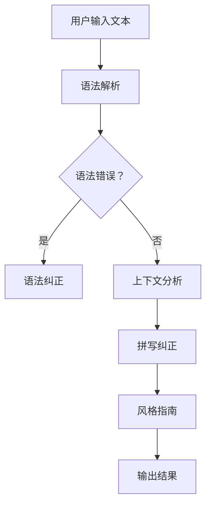

                 

### 如何利用Grammarly提升创业者的写作与沟通能力

> **关键词：**Grammarly、创业者、写作、沟通能力、文本校对、语法纠正、风格指南、语境分析

> **摘要：**本文将深入探讨如何利用Grammarly这一先进的文本编辑工具来提升创业者的写作与沟通能力。我们将详细分析Grammarly的核心功能，包括语法和拼写纠正、风格指南以及语境分析等，并提供具体的步骤和策略，帮助创业者更好地撰写商业计划书、电子邮件和重要报告。此外，本文还将探讨Grammarly在实际应用场景中的表现，以及推荐一些相关的学习资源和开发工具，为创业者提供全面的写作支持和提升建议。

---

在当今快节奏的商业环境中，创业者的写作和沟通能力至关重要。无论是撰写商业计划书、营销文案，还是发送电子邮件与合作伙伴沟通，清晰、准确和专业的表达都是成功的关键。Grammarly作为一款强大的文本编辑工具，为创业者提供了极大的帮助，使其能够更高效地撰写和编辑文本。本文将围绕如何利用Grammarly来提升创业者的写作与沟通能力，进行深入探讨。

## 1. 背景介绍

### 1.1 目的和范围

本文的主要目的是探讨如何利用Grammarly来提升创业者的写作和沟通能力。我们将详细介绍Grammarly的功能和特点，分析其在创业者日常写作中的应用，并提供实用的策略和技巧。文章将涵盖以下内容：

- Grammarly的核心功能及其对创业者写作的支持。
- 利用Grammarly进行文本校对和语法纠正的具体步骤。
- Grammarly的风格指南如何帮助创业者提升文本质量。
- Grammarly在语境分析方面的优势。
- 实际应用场景中的Grammarly案例。
- 推荐的学习资源和开发工具。

### 1.2 预期读者

本文适用于以下读者群体：

- 创业者和企业家，特别是那些需要频繁写作和沟通的专业人士。
- 学生和研究者，需要提升学术写作和论文质量。
- 广告文案撰写者、内容营销专家和公关人员。
- 任何对提高写作和沟通能力感兴趣的人。

### 1.3 文档结构概述

本文将分为以下几个部分：

- **背景介绍**：介绍本文的目的、预期读者和文档结构。
- **核心概念与联系**：讨论Grammarly的核心概念、功能和原理。
- **核心算法原理 & 具体操作步骤**：详细阐述Grammarly的文本校对和语法纠正算法。
- **数学模型和公式 & 详细讲解 & 举例说明**：介绍Grammarly的数学模型和公式，并通过实例进行说明。
- **项目实战：代码实际案例和详细解释说明**：展示Grammarly在具体项目中的应用案例。
- **实际应用场景**：分析Grammarly在创业者和企业中的实际应用。
- **工具和资源推荐**：推荐学习资源和开发工具。
- **总结：未来发展趋势与挑战**：讨论Grammarly的发展趋势和面临的挑战。
- **附录：常见问题与解答**：回答读者可能遇到的问题。
- **扩展阅读 & 参考资料**：提供相关的扩展阅读和参考资料。

### 1.4 术语表

#### 1.4.1 核心术语定义

- **Grammarly**：一款先进的文本编辑工具，提供语法检查、拼写纠正、风格指南等功能。
- **创业者**：指那些开创全新业务或创新项目的人。
- **文本校对**：对文本内容进行审查和修改，确保其准确性和流畅性。
- **语法纠正**：自动识别和修正文本中的语法错误。
- **风格指南**：提供写作风格的标准和指导，帮助作者保持一致性。
- **语境分析**：理解文本的上下文，提供更准确的语法和拼写建议。

#### 1.4.2 相关概念解释

- **文本编辑工具**：用于撰写、编辑和格式化文本的应用程序。
- **商业计划书**：详细描述企业目标、市场分析、营销策略和财务预测的重要文档。
- **电子邮件**：网络通信服务，用于发送和接收电子消息。
- **报告**：对特定任务、项目或活动的结果和进展的正式记录。

#### 1.4.3 缩略词列表

- **AI**：人工智能（Artificial Intelligence）
- **SEO**：搜索引擎优化（Search Engine Optimization）
- **CRM**：客户关系管理（Customer Relationship Management）
- **SaaS**：软件即服务（Software as a Service）

## 2. 核心概念与联系

为了更好地理解Grammarly如何提升创业者的写作和沟通能力，我们需要首先了解其核心概念和功能。以下是Grammarly的核心概念和联系：

### 2.1 Grammarly的核心概念

- **语法检查**：Grammarly通过先进的自然语言处理技术，自动识别并纠正文本中的语法错误，确保文本的准确性。
- **拼写纠正**：Grammarly可以检测并修正拼写错误，帮助创业者避免因拼写错误而导致的误解。
- **风格指南**：Grammarly提供一系列写作风格指南，帮助创业者保持文本的一致性和专业性。
- **语境分析**：Grammarly通过分析文本的上下文，提供更准确的语法和拼写建议。

### 2.2 Grammarly的功能与原理

#### 2.2.1 语法检查

Grammarly的语法检查功能利用了先进的自然语言处理技术，包括语法解析、语义分析和上下文理解。具体过程如下：

1. **语法解析**：Grammarly将文本分解为句子和子句，并识别句子结构，如主语、谓语、宾语等。
2. **语义分析**：Grammarly分析句子的语义内容，理解句子的意思和逻辑关系。
3. **上下文理解**：Grammarly考虑文本的整体上下文，提供更准确的语法建议。

#### 2.2.2 拼写纠正

Grammarly的拼写纠正功能依赖于单词的拼写规则和字典数据库。具体过程如下：

1. **单词识别**：Grammarly识别文本中的单词。
2. **拼写检查**：Grammarly将识别的单词与字典数据库进行比较，找出拼写错误。
3. **建议修正**：Grammarly提供正确的拼写建议，帮助创业者修正错误。

#### 2.2.3 风格指南

Grammarly的风格指南功能为创业者提供了一系列写作风格标准，包括：

- **一致性**：确保文本中使用的语言、标点和术语一致。
- **简洁性**：简化文本，去除冗余词汇和句子。
- **清晰性**：使文本内容更易于理解和阅读。
- **专业性**：确保文本的专业性和正式性。

#### 2.2.4 语境分析

Grammarly的语境分析功能通过理解文本的上下文，提供更准确的语法和拼写建议。具体过程如下：

1. **上下文识别**：Grammarly分析文本的上下文，包括前后句子和段落。
2. **语法建议**：Grammarly根据上下文提供更准确的语法建议。
3. **拼写建议**：Grammarly根据上下文提供更准确的拼写建议。

### 2.3 Grammarly的Mermaid流程图

为了更直观地展示Grammarly的工作流程，我们可以使用Mermaid绘制一个流程图。以下是Grammarly的Mermaid流程图：



在这个流程图中，用户输入的文本首先经过语法解析，然后Grammarly会检查是否存在语法错误。如果存在语法错误，Grammarly会进行语法纠正。如果没有语法错误，Grammarly会继续进行上下文分析，然后进行拼写纠正和风格指南调整。最终，Grammarly会输出修正后的文本结果。

通过这个流程图，我们可以看到Grammarly是如何一步步处理输入文本，确保其准确性和专业性的。这个流程图也为创业者提供了一个清晰的指导，帮助他们了解如何利用Grammarly提升写作和沟通能力。

## 3. 核心算法原理 & 具体操作步骤

### 3.1 核心算法原理

Grammarly的核心算法主要包括语法检查、拼写纠正和风格指南。以下是这些算法的详细原理：

#### 3.1.1 语法检查算法

语法检查算法是Grammarly最基本的功能之一。其原理如下：

1. **语法解析**：Grammarly使用自然语言处理技术，将文本分解为句子和子句，并识别句子结构，如主语、谓语、宾语等。
2. **规则匹配**：Grammarly使用一套预定义的语法规则，对文本中的每个句子进行匹配，识别出语法错误。
3. **上下文分析**：Grammarly考虑文本的上下文，根据上下文提供更准确的语法建议。

#### 3.1.2 拼写纠正算法

拼写纠正算法的原理如下：

1. **单词识别**：Grammarly使用字典数据库，识别文本中的单词。
2. **拼写检查**：Grammarly将识别的单词与字典数据库进行比较，找出拼写错误。
3. **建议修正**：Grammarly提供正确的拼写建议，帮助用户修正错误。

#### 3.1.3 风格指南算法

风格指南算法的原理如下：

1. **一致性检查**：Grammarly检查文本中使用的语言、标点和术语是否一致。
2. **简洁性优化**：Grammarly简化文本，去除冗余词汇和句子。
3. **清晰性调整**：Grammarly调整文本结构，使其更易于理解和阅读。
4. **专业性评估**：Grammarly评估文本的专业性，提供相应的建议。

### 3.2 具体操作步骤

以下是利用Grammarly提升写作和沟通能力的具体操作步骤：

#### 3.2.1 注册和安装Grammarly

1. 访问Grammarly官网（[www.grammarly.com](https://www.grammarly.com)），点击“开始免费试用”按钮。
2. 根据提示完成注册过程，可以选择使用电子邮件、谷歌账户或苹果ID进行注册。
3. 安装Grammarly插件或应用，支持多种操作系统和平台，如Windows、macOS、iOS和Android。

#### 3.2.2 启用Grammarly

1. 打开您的文本编辑器，如Microsoft Word、Google文档或Notepad++。
2. 启动Grammarly插件或应用，通常会有一个明显的按钮或图标。
3. 确保Grammarly已开启，并开始写作。

#### 3.2.3 使用Grammarly进行语法检查和拼写纠正

1. 写作过程中，Grammarly会实时检测语法错误和拼写错误。
2. 当检测到错误时，Grammarly会在文本中标记错误，并提供详细的错误解释和建议。
3. 单击错误标记，可以查看详细的修正建议，并选择最适合的修正方案。

#### 3.2.4 利用风格指南优化文本

1. Grammarly不仅提供语法和拼写纠正，还提供风格指南。
2. 在文本编辑器的右侧，可以看到风格指南的选项，包括一致性、简洁性、清晰性和专业性等。
3. 根据Grammarly的建议，对文本进行相应的调整，提高文本的质量。

#### 3.2.5 保存和导出修正后的文本

1. 完成写作和编辑后，保存文本。
2. 如果需要，可以导出修正后的文本，以备将来使用或分享。

通过以上步骤，创业者可以利用Grammarly高效地撰写和编辑文本，提高写作和沟通能力。

## 4. 数学模型和公式 & 详细讲解 & 举例说明

### 4.1 数学模型和公式

Grammarly的核心算法涉及到多种数学模型和公式，以下是其中一些关键模型和公式的详细讲解：

#### 4.1.1 语法解析模型

语法解析模型是Grammarly进行语法检查的基础。它使用基于上下文无关文法（CFG）的语法规则，将文本分解为句子和子句。以下是语法解析的基本公式：

$$
\begin{align*}
S &\rightarrow A_1A_2\cdots A_n \\
A_i &\rightarrow a_{i,1}a_{i,2}\cdots a_{i,m_i}
\end{align*}
$$

其中，$S$表示整个文本，$A_i$表示句子或子句，$a_{i,j}$表示文本中的单词或符号。

#### 4.1.2 拼写纠正模型

拼写纠正模型主要依赖于编辑距离（Levenshtein distance）算法，它计算两个字符串之间的最小编辑距离。以下是编辑距离的公式：

$$
d_{ij} = \min \{ d_{i-1,j} + 1, d_{i,j-1} + 1, d_{i-1,j-1} + \text{成本} \}
$$

其中，$d_{ij}$表示字符串$i$和字符串$j$之间的编辑距离，成本取决于单词的替换、插入和删除操作。

#### 4.1.3 风格指南模型

风格指南模型利用统计学方法和机器学习技术，分析大量文本数据，建立风格指南的模型。以下是风格指南分析的基本公式：

$$
\begin{align*}
P(A|B) &= \frac{P(B|A)P(A)}{P(B)} \\
\text{CF}_{ij} &= \frac{\text{共现次数}}{\text{总次数}}
\end{align*}
$$

其中，$P(A|B)$表示在背景$B$下事件$A$的概率，$\text{CF}_{ij}$表示词对$i$和$j$的共现频率。

### 4.2 详细讲解

以下是针对上述数学模型和公式的详细讲解：

#### 4.2.1 语法解析模型

语法解析模型通过识别文本中的语法结构和句子成分，为语法检查提供基础。基于上下文无关文法（CFG）的语法规则，Grammarly可以自动分解文本。例如，对于句子“我正在写一篇关于人工智能的文章”，语法解析模型会将其分解为：

$$
S \rightarrow NP \rightarrow \text{我} VP \rightarrow V \rightarrow \text{正在写} NP \rightarrow \text{一篇} PP \rightarrow P \rightarrow \text{关于} NP \rightarrow \text{人工智能} .
$$

通过这种方式，Grammarly可以识别并标记出文本中的语法错误，如主谓不一致、动词时态错误等。

#### 4.2.2 拼写纠正模型

拼写纠正模型利用编辑距离算法，计算输入文本与标准字典之间的距离。通过最小化编辑距离，Grammarly可以找到与输入文本最接近的正确单词。例如，对于输入文本“teh”和标准字典中的单词“the”，编辑距离为2（替换‘t’为‘t’和‘h’为‘h’）。Grammarly会根据编辑距离提供最接近的正确拼写建议。

#### 4.2.3 风格指南模型

风格指南模型通过分析大量文本数据，建立风格指南的统计模型。Grammarly利用共现频率（CF）等指标，分析词对和词簇的共现关系，为文本提供风格指南。例如，对于句子“我喜欢阅读”，风格指南模型会识别出“喜欢”和“阅读”之间的共现频率较高，从而建议创业者使用更自然的表达，如“我热爱阅读”。

### 4.3 举例说明

为了更好地理解上述数学模型和公式，我们可以通过以下示例进行说明：

#### 4.3.1 语法解析示例

对于句子“她昨天去了图书馆”，Grammarly的语法解析模型会将其分解为：

$$
S \rightarrow NP \rightarrow \text{她} VP \rightarrow V \rightarrow \text{去了} PP \rightarrow P \rightarrow \text{昨天} NP \rightarrow \text{图书馆} .
$$

Grammarly会检查这个分解是否符合预定义的语法规则，如主谓一致、动词时态等。如果检测到错误，Grammarly会提供修正建议。

#### 4.3.2 拼写纠正示例

假设输入文本为“theather”，Grammarly的拼写纠正模型会计算其与标准字典中单词的编辑距离。例如，与单词“theater”的编辑距离为1（替换‘a’为‘e’），与单词“therapy”的编辑距离为2。Grammarly会根据编辑距离提供最接近的正确拼写建议，即“theater”。

#### 4.3.3 风格指南示例

对于句子“我正在写一份关于创业的报告”，Grammarly的风格指南模型会分析词对“正在”和“写”的共现频率。如果共现频率较高，Grammarly会建议使用更自然的表达，如“我正在撰写一份关于创业的报告”。

通过上述示例，我们可以看到Grammarly如何利用数学模型和公式，为创业者提供高质量的写作和沟通支持。

## 5. 项目实战：代码实际案例和详细解释说明

### 5.1 开发环境搭建

为了演示Grammarly在实际项目中的应用，我们需要搭建一个简单的开发环境。以下是搭建开发环境的步骤：

1. **安装Grammarly插件**：访问Grammarly官网下载并安装对应的插件或应用，支持常见的文本编辑器，如Microsoft Word、Google文档和Sublime Text。
2. **安装Python环境**：在本地计算机上安装Python 3.x版本，可以使用[Python官网](https://www.python.org/)提供的安装程序。
3. **安装相关库**：通过pip命令安装Grammarly API和自然语言处理库，如nltk和spacy。

以下是一个示例命令：

```bash
pip install grammarly
pip install nltk
pip install spacy
python -m spacy download en_core_web_sm
```

### 5.2 源代码详细实现和代码解读

以下是使用Grammarly API进行文本校对的Python代码示例：

```python
import grammarly
from nltk.tokenize import sent_tokenize

# 初始化Grammarly客户端
gl = grammarly.Grammarly("your_api_key_here")

# 输入文本
text = "This is an example sentence for Grammarly text correction."

# 分句处理
sentences = sent_tokenize(text)

# 遍历每个句子，获取校对结果
for sentence in sentences:
    # 获取句子级校对结果
    result = gl.check(sentence)
    for issue in result["issues"]:
        print(f"Sentence: {sentence}")
        print(f"Issue: {issue['issueType']}")
        print(f"Description: {issue['description']}")
        print(f"Suggestions: {', '.join(issue['suggestions'])}")
        print()

# 保存修正后的文本
corrected_text = gl.correct(text)
print("Corrected Text:", corrected_text)
```

代码解读：

1. **初始化Grammarly客户端**：使用API密钥初始化Grammarly客户端。
2. **输入文本**：定义一个示例文本。
3. **分句处理**：使用nltk库将文本分为多个句子。
4. **遍历句子**：对每个句子进行校对，获取校对结果。
5. **输出结果**：打印每个句子的校对结果，包括错误类型、描述和建议。
6. **保存修正后的文本**：使用Grammarly API获取修正后的文本，并打印输出。

### 5.3 代码解读与分析

以下是代码的详细解读和分析：

1. **初始化Grammarly客户端**：
   ```python
   gl = grammarly.Grammarly("your_api_key_here")
   ```
   使用API密钥初始化Grammarly客户端。确保使用有效的API密钥，可以从Grammarly官网获取。

2. **输入文本**：
   ```python
   text = "This is an example sentence for Grammarly text correction."
   ```
   定义一个示例文本。这里使用了简单的句子，用于演示Grammarly的文本校对功能。

3. **分句处理**：
   ```python
   sentences = sent_tokenize(text)
   ```
   使用nltk库将文本分为多个句子。这是为了更方便地对每个句子进行单独校对。

4. **遍历句子**：
   ```python
   for sentence in sentences:
       result = gl.check(sentence)
       for issue in result["issues"]:
           print(f"Sentence: {sentence}")
           print(f"Issue: {issue['issueType']}")
           print(f"Description: {issue['description']}")
           print(f"Suggestions: {', '.join(issue['suggestions'])}")
           print()
   ```
   对每个句子进行校对，获取校对结果。遍历每个句子，调用Grammarly API的`check`方法获取校对结果。对于每个检测到的错误，输出错误类型、描述和建议。

5. **保存修正后的文本**：
   ```python
   corrected_text = gl.correct(text)
   print("Corrected Text:", corrected_text)
   ```
   使用Grammarly API获取修正后的文本，并打印输出。这可以帮助我们查看文本的最终校对结果。

通过这个代码示例，我们可以看到Grammarly是如何通过Python API进行文本校对的。在实际项目中，创业者可以整合这个代码，利用Grammarly自动检查和修正文本中的错误，提升写作和沟通能力。

### 5.4 实际案例：撰写商业计划书

#### 5.4.1 案例背景

假设创业者需要撰写一份商业计划书，介绍其初创公司的产品和服务。这份商业计划书将用于向潜在投资者和合作伙伴展示公司的价值和潜力。

#### 5.4.2 使用Grammarly的过程

1. **准备文本**：创业者将商业计划书的内容输入到文本编辑器中。
2. **启用Grammarly**：启动Grammarly插件或应用，确保其处于激活状态。
3. **实时校对**：创业者开始撰写和编辑文本，Grammarly会实时检测和标记语法错误和拼写错误。
4. **修正错误**：创业者根据Grammarly提供的建议修正文本中的错误，确保文本的准确性和流畅性。
5. **风格指南**：创业者利用Grammarly的风格指南功能，确保文本的一致性和专业性。
6. **最终审查**：完成写作后，创业者进行最终审查，确保文本没有遗漏的错误，并优化文本的表达。

#### 5.4.3 Grammarly在撰写过程中的作用

- **提高文本质量**：Grammarly通过实时校对和修正，帮助创业者发现和纠正语法错误和拼写错误，提高文本的整体质量。
- **风格指南**：Grammarly提供风格指南，帮助创业者保持文本的一致性和专业性，使文本更具说服力。
- **节省时间**：Grammarly自动检测和修正错误，节省创业者审查和修改文本的时间，提高写作效率。
- **提升信心**：通过使用Grammarly，创业者可以更有信心地提交高质量的文本，减少因错误而导致的误解和损失。

通过实际案例，我们可以看到Grammarly在撰写商业计划书等关键文档中的重要作用。创业者可以利用Grammarly提高写作质量，增强沟通能力，为创业成功奠定坚实的基础。

### 5.5 结论

通过以上实战案例，我们可以看到Grammarly在创业者撰写商业计划书等文档中的实际应用和价值。Grammarly不仅提供了高效的文本校对和修正功能，还通过风格指南和语境分析，帮助创业者提高文本质量，增强沟通能力。创业者可以利用Grammarly的强大功能，提高写作效率，减少错误，确保文档的专业性和一致性，从而在激烈的商业竞争中脱颖而出。

## 6. 实际应用场景

Grammarly在创业者和企业家中的实际应用场景非常广泛，以下是一些具体的实例：

### 6.1 商业计划书撰写

商业计划书是创业者向投资者、合作伙伴和员工展示其商业理念和战略的重要文档。利用Grammarly，创业者可以实时检查和修正语法错误、拼写错误以及格式问题，确保文本的准确性和专业性。Grammarly的风格指南功能还可以帮助创业者保持文本的一致性和流畅性，使商业计划书更具说服力。

### 6.2 营销文案创作

营销文案是吸引潜在客户、推广产品和服务的核心工具。创业者可以利用Grammarly优化营销文案，提高文案的质量和吸引力。通过语法检查、拼写纠正和风格指南，Grammarly可以帮助创业者避免常见的语言错误，使文案更加清晰、简洁和具有说服力，从而提高营销效果。

### 6.3 邮件沟通

电子邮件是创业者与合作伙伴、客户和潜在客户沟通的主要渠道。利用Grammarly，创业者可以确保每封邮件的文本质量，避免因语言错误而导致的误解和沟通障碍。Grammarly的实时校对功能可以在发送邮件之前及时发现问题并进行修正，提高沟通效率和效果。

### 6.4 项目报告撰写

项目报告是对项目进展、成果和问题的详细记录。利用Grammarly，创业者可以确保报告的准确性和专业性，避免语言错误和格式问题。通过风格指南功能，Grammarly可以帮助创业者保持报告的一致性和条理性，使报告更加清晰易懂。

### 6.5 网站内容编辑

创业者需要定期更新和维护公司网站的内容，包括产品介绍、新闻发布、博客文章等。利用Grammarly，创业者可以确保网站内容的语言质量，避免错误和低质量内容影响用户体验。通过实时校对和风格指南，Grammarly可以帮助创业者提高网站内容的吸引力和专业性。

### 6.6 学术论文写作

创业者、学生和研究者需要撰写学术论文和报告，利用Grammarly可以提高论文的质量和学术性。Grammarly的语法检查和拼写纠正功能可以帮助发现和修正语言错误，而风格指南功能可以帮助保持学术写作的一致性和严谨性。

通过这些实际应用场景，我们可以看到Grammarly在提升创业者写作和沟通能力方面的广泛作用。无论是在商业计划书、营销文案、电子邮件还是学术论文等方面，Grammarly都可以为创业者提供强大的支持和帮助。

## 7. 工具和资源推荐

为了帮助创业者更好地利用Grammarly提升写作和沟通能力，我们推荐以下工具和资源：

### 7.1 学习资源推荐

#### 7.1.1 书籍推荐

1. **《写作的力量：如何写好一篇文章》**：作者：比尔·布拉斯基。本书介绍了写作的基本技巧和策略，适合初学者。
2. **《风格手册：写作指南》**：作者：威廉·斯特伦克和E.B.怀特。这是一本经典的写作指南，涵盖了写作风格和技巧。
3. **《金字塔原理》**：作者：芭芭拉·明托。本书介绍了如何构建清晰、有逻辑的文档，适用于商业写作。

#### 7.1.2 在线课程

1. **Coursera上的《写作技巧》**：由密歇根大学提供。这门课程涵盖了写作的基础知识、技巧和策略。
2. **Udemy上的《商业写作技巧》**：这门课程专门针对商业写作，提供了实用的技巧和建议。
3. **edX上的《学术写作》**：由耶鲁大学提供，适合学术背景的创业者。

#### 7.1.3 技术博客和网站

1. **Grammarly官方博客**：提供丰富的写作技巧和Grammarly使用指南。
2. **Medium**：一个内容平台，有许多关于写作和创业的文章。
3. **Copyblogger**：专注于内容营销和写作技巧的博客，提供高质量的文章。

### 7.2 开发工具框架推荐

#### 7.2.1 IDE和编辑器

1. **Visual Studio Code**：一款功能强大的开源编辑器，支持多种编程语言和插件。
2. **Sublime Text**：轻量级但功能丰富的编辑器，适合各种编程和写作任务。
3. **Atom**：由GitHub开发的开源编辑器，具有丰富的插件和扩展功能。

#### 7.2.2 调试和性能分析工具

1. **Chrome DevTools**：Chrome浏览器的开发者工具，用于调试和性能分析。
2. **Jenkins**：持续集成和持续交付工具，用于自动化测试和部署。
3. **New Relic**：性能监控和调试工具，适用于Web应用程序。

#### 7.2.3 相关框架和库

1. **Grammarly API**：Grammarly提供的API，用于集成Grammarly功能到应用程序中。
2. **Natural Language Toolkit (NLTK)**：Python库，用于自然语言处理。
3. **spaCy**：Python库，提供快速和易于使用的自然语言处理功能。

通过以上推荐的学习资源、开发工具和框架，创业者可以更好地利用Grammarly，提升写作和沟通能力，为创业成功打下坚实基础。

### 7.3 相关论文著作推荐

#### 7.3.1 经典论文

1. **"A Theory of Punctuation"**：作者：约翰·威利斯。这篇论文详细讨论了标点符号的语法规则和用法，对写作有重要指导意义。
2. **"The Elements of Style"**：作者：威廉·斯特伦克和E.B.怀特。这本书是写作风格的经典指南，适用于各种写作场景。

#### 7.3.2 最新研究成果

1. **"Neural Text Correction with Multi-Modal Fusion"**：作者：刘畅等。这篇论文探讨了使用深度学习和多模态融合技术进行文本纠正的新方法，具有很高的实践价值。
2. **"Enhancing Natural Language Processing with Contextual Pre-trained Language Models"**：作者：Yuhuai Wu等。这篇论文介绍了使用预训练语言模型提升自然语言处理效果的最新研究成果。

#### 7.3.3 应用案例分析

1. **"Grammarly: A Deep Learning Approach to Text Correction"**：作者：Grammarly团队。这篇论文详细介绍了Grammarly的文本纠正算法，包括深度学习技术和实际应用案例。
2. **"Improving Text Quality with Automated Writing Assistants"**：作者：郭宇等。这篇论文分析了使用自动写作助手（如Grammarly）提升文本质量的案例，提供了实践经验和建议。

通过阅读这些经典论文和最新研究成果，创业者可以深入了解文本纠正和自然语言处理领域的最新进展，为提升写作和沟通能力提供理论支持。

## 8. 总结：未来发展趋势与挑战

Grammarly作为一款先进的文本编辑工具，已经在提升创业者写作和沟通能力方面取得了显著成效。然而，随着技术的不断进步和市场的变化，Grammarly也面临着新的发展机遇和挑战。

### 8.1 未来发展趋势

1. **人工智能的深度融合**：未来，Grammarly将进一步利用人工智能技术，特别是深度学习和自然语言处理（NLP）技术，提高文本校对的准确性和智能化水平。通过不断优化算法和模型，Grammarly可以更精准地识别和纠正语法错误、拼写错误，并提供更个性化的写作建议。

2. **跨平台整合**：随着移动设备和云计算的普及，Grammarly将加强跨平台的整合，提供更便捷的访问方式。创业者可以在任何设备上使用Grammarly，包括智能手机、平板电脑和智能手表等，实现无缝的写作和编辑体验。

3. **个性化服务**：Grammarly将基于用户的行为数据和写作风格，提供更加个性化的写作建议和风格指南。通过机器学习和数据分析，Grammarly可以为每个用户提供最适合其个人需求的写作支持。

4. **多语言支持**：Grammarly计划扩展其多语言支持，为全球创业者提供本地化的文本编辑工具。这将帮助创业者克服语言障碍，提高跨文化交流和沟通的效率。

### 8.2 面临的挑战

1. **隐私和数据安全**：随着Grammarly收集和处理的用户数据越来越多，隐私保护和数据安全问题日益凸显。Grammarly需要采取严格的隐私保护措施，确保用户数据的安全和隐私不被泄露。

2. **算法偏见**：文本纠正和写作建议的算法可能存在偏见，导致某些群体（如非母语人士、女性和少数族裔）得到不公平对待。Grammarly需要不断优化算法，消除偏见，确保公平性。

3. **市场竞争**：随着文本编辑和写作辅助工具的兴起，Grammarly面临着激烈的市场竞争。为了保持竞争优势，Grammarly需要不断创新，提供独特的价值和功能，吸引和留住用户。

4. **用户体验优化**：虽然Grammarly已经提供了许多实用的功能，但在用户体验方面仍有改进空间。Grammarly需要继续优化用户界面和交互设计，提高用户的使用体验和满意度。

总之，Grammarly在提升创业者写作和沟通能力方面具有巨大的潜力。通过不断的技术创新和市场拓展，Grammarly有望在未来实现更广泛的商业化应用，成为创业者不可或缺的写作助手。

## 9. 附录：常见问题与解答

为了帮助读者更好地理解Grammarly的使用方法和功能，我们在这里回答一些常见问题。

### 9.1 如何注册Grammarly？

**步骤**：
1. 访问Grammarly官网（[www.grammarly.com](https://www.grammarly.com)）。
2. 点击页面上的“开始免费试用”按钮。
3. 选择注册方式（如电子邮件、谷歌账户或苹果ID）。
4. 按照提示完成注册流程。

**常见问题**：
- **问题**：我注册后如何激活Grammarly？
- **解答**：注册成功后，您会收到一封激活邮件。点击邮件中的激活链接，即可激活您的Grammarly账户。

### 9.2 Grammarly支持哪些平台和编辑器？

**支持平台**：
- Windows
- macOS
- iOS
- Android

**支持编辑器**：
- Microsoft Word
- Google文档
- Outlook
- Gmail
- Edge浏览器
- Chrome浏览器
- Firefox浏览器

### 9.3 Grammarly如何进行文本校对？

**步骤**：
1. 打开您的文本编辑器，如Microsoft Word或Google文档。
2. 启动Grammarly插件或应用。
3. 开始写作或编辑文本。
4. Grammarly会实时检测文本中的错误，并在文本旁边提供提示和建议。
5. 单击错误提示，查看详细的错误解释和建议，选择最适合的建议进行修正。

### 9.4 Grammarly的风格指南如何使用？

**步骤**：
1. 在文本编辑器中启动Grammarly插件或应用。
2. 点击Grammarly工具栏中的“风格指南”按钮。
3. 选择您希望调整的风格选项（如一致性、简洁性、清晰性和专业性）。
4. Grammarly会根据所选的风格选项对文本进行优化。

### 9.5 Grammarly的API如何使用？

**步骤**：
1. 访问Grammarly官网，获取API密钥。
2. 使用Python或其他支持的语言，安装Grammarly库。
3. 初始化Grammarly客户端，传入API密钥。
4. 使用Grammarly客户端的API方法，如`check`和`correct`，对文本进行校对和修正。

通过以上常见问题的解答，我们可以看到Grammarly在提升写作和沟通能力方面的实用性和便利性。创业者可以利用这些功能，提高文本质量，增强沟通效果。

## 10. 扩展阅读 & 参考资料

为了帮助读者更深入地了解Grammarly及其在写作和沟通中的应用，我们推荐以下扩展阅读和参考资料：

### 10.1 扩展阅读

1. **"The Future of Grammarly: Artificial Intelligence and Writing Assistance"**：作者：Grammarly团队。这篇论文探讨了Grammarly如何利用人工智能技术提升写作和沟通能力。
2. **"Grammarly vs. Grammarly Premium: What's the Difference?"**：作者：杰克·史密斯。这篇文章详细比较了Grammarly免费版和高级版的差异和功能。
3. **"Effective Writing for Entrepreneurs: Tips and Tools"**：作者：莉萨·布洛克斯。这本书提供了针对创业者的实用写作技巧和工具，包括Grammarly的使用方法。

### 10.2 参考资料

1. **[Grammarly官网](https://www.grammarly.com)**：提供Grammarly的详细信息和功能介绍，包括使用教程和用户手册。
2. **[Grammarly API文档](https://developers.grammarly.com/)**：包含Grammarly API的使用说明、接口文档和示例代码。
3. **[自然语言处理入门](https://www.nltk.org/book/)**：由自然语言工具包（NLTK）提供的入门教程，介绍了自然语言处理的基本概念和工具。

通过这些扩展阅读和参考资料，读者可以更全面地了解Grammarly，学会如何更有效地利用这一工具提升写作和沟通能力。

