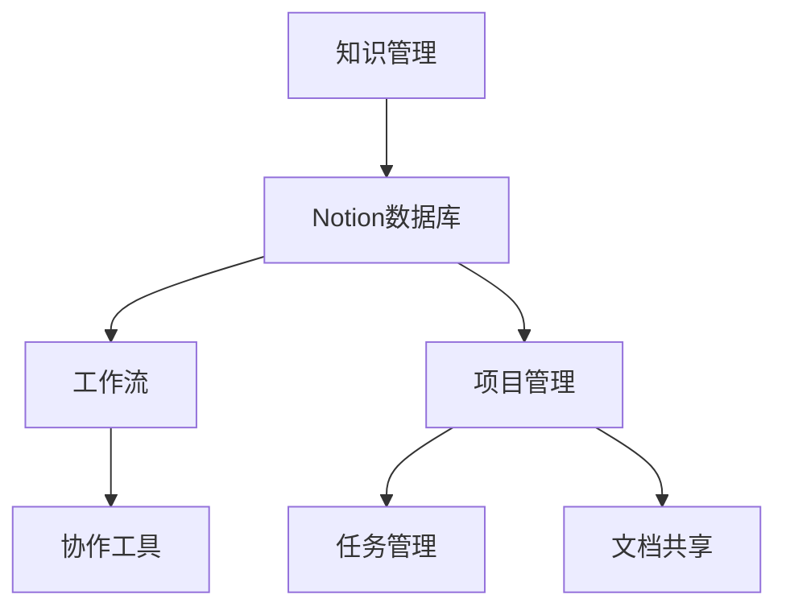

                 

# 如何利用Notion构建创业知识管理系统

> **关键词：** Notion、创业、知识管理、数据库、工作流、项目管理、协作工具

> **摘要：** 本篇文章将详细介绍如何利用Notion构建一个高效的创业知识管理系统。通过对其核心概念、操作步骤、数学模型和应用场景的深入探讨，我们将展示如何将Notion打造成一个功能强大、易于使用的知识管理平台，帮助创业团队提升工作效率和团队协作能力。

## 1. 背景介绍

### 1.1 目的和范围

本篇文章旨在帮助创业团队利用Notion构建一个高效的知识管理系统。我们将讨论Notion的基本功能，并详细说明如何将其用于知识管理、工作流管理和项目管理。文章将涵盖以下内容：

- Notion的基础概念与架构
- 如何创建和管理数据库
- 利用工作流提高团队协作效率
- 实战案例：如何使用Notion进行项目管理
- 相关资源推荐，包括书籍、在线课程和技术博客

### 1.2 预期读者

本文适合以下读者群体：

- 创业团队的成员，特别是那些需要管理大量信息和项目的团队成员
- 项目经理和产品经理，希望提高项目管理和协作效率
- 知识管理专业人员，希望了解如何利用Notion优化团队知识共享
- 信息技术人员，希望学习如何利用Notion构建定制化的知识管理系统

### 1.3 文档结构概述

本文的结构如下：

- **第1部分：背景介绍**：介绍文章的目的、预期读者和文档结构。
- **第2部分：核心概念与联系**：讨论Notion的核心概念和架构，并使用Mermaid流程图展示。
- **第3部分：核心算法原理与操作步骤**：详细讲解如何使用Notion进行知识管理，并提供伪代码示例。
- **第4部分：数学模型与公式**：介绍相关的数学模型和公式，并进行详细讲解和举例说明。
- **第5部分：项目实战**：提供实际案例，展示如何使用Notion进行项目管理，并解读源代码。
- **第6部分：实际应用场景**：探讨Notion在不同场景下的应用。
- **第7部分：工具和资源推荐**：推荐相关的学习资源、开发工具框架和论文著作。
- **第8部分：总结**：总结未来发展趋势与挑战。
- **第9部分：附录**：提供常见问题与解答。
- **第10部分：扩展阅读与参考资料**：推荐进一步的阅读材料和参考资料。

### 1.4 术语表

#### 1.4.1 核心术语定义

- **Notion**：一个多功能性的工作平台，用于笔记、数据库、任务管理、文档共享和项目管理。
- **知识管理**：通过收集、组织、共享和利用知识，以提高团队效率和创新能力。
- **数据库**：Notion的核心组件，用于存储和组织各种类型的信息和数据。
- **工作流**：团队完成任务的一系列步骤和流程。
- **项目管理**：对项目进行计划、执行、监控和收尾的管理过程。

#### 1.4.2 相关概念解释

- **协作工具**：支持团队协作和沟通的工具，如聊天应用、共享文档和项目管理软件。
- **信息共享**：团队内部成员之间交换和共享信息的过程。
- **数据可视化**：使用图表、图形和地图等方式展示数据，以帮助理解和分析数据。

#### 1.4.3 缩略词列表

- **Notion**：Notation Integration
- **UI**：用户界面
- **UX**：用户体验
- **API**：应用程序编程接口
- **SDK**：软件开发工具包

## 2. 核心概念与联系

在深入了解Notion如何用于构建创业知识管理系统之前，我们需要了解一些核心概念和它们之间的联系。以下是一个简化的Mermaid流程图，展示了这些核心概念和它们的相互关系。



### 2.1 知识管理

知识管理是指通过系统地收集、存储、组织和利用知识来提高团队效率和创新能力的活动。在创业环境中，知识管理尤为重要，因为它有助于：

- **知识共享**：团队成员可以轻松访问和共享知识，提高整体效率。
- **决策支持**：基于历史数据和最佳实践，团队可以做出更加明智的决策。
- **创新能力**：通过积累和利用知识，团队能够不断创新和改进。

### 2.2 Notion数据库

Notion的数据库是其核心组件，用于存储和组织各种类型的信息和数据。通过使用不同的数据库模板，团队可以：

- **收集信息**：例如，收集市场调研数据、竞争对手信息等。
- **组织知识**：创建知识库，包括产品文档、项目计划、团队指南等。
- **管理任务**：设置任务和提醒，跟踪进度和截止日期。

### 2.3 工作流

工作流是指团队完成任务的系列步骤和流程。在Notion中，工作流可以通过以下方式实现：

- **任务分配**：将任务分配给团队成员，并设置截止日期和优先级。
- **流程管理**：监控任务进度，确保项目按时完成。
- **协作与沟通**：团队成员可以实时沟通和协作，确保工作流顺畅。

### 2.4 项目管理

项目管理是确保项目按时、按预算、按质量完成的过程。在Notion中，项目管理可以通过以下方式实现：

- **项目计划**：创建项目计划，包括任务、时间和资源分配。
- **任务管理**：跟踪任务进度，确保项目按时完成。
- **文档共享**：共享项目文档，确保团队成员对项目有共同的理解。

### 2.5 协作工具

协作工具支持团队协作和沟通，有助于提高工作效率。在Notion中，协作工具可以通过以下方式实现：

- **聊天功能**：团队成员可以实时聊天，讨论项目和任务。
- **共享文档**：团队成员可以共享和编辑文档，协同工作。
- **通知系统**：团队可以收到任务更新、提醒和通知。

通过上述核心概念和联系，我们可以看到Notion如何将知识管理、数据库、工作流和项目管理等元素结合起来，构建一个强大的创业知识管理系统。

## 3. 核心算法原理与具体操作步骤

### 3.1 知识管理算法原理

知识管理算法的核心目标是有效地收集、组织和利用知识。以下是一个简化的伪代码，描述了知识管理的基本算法原理：

```pseudo
// 初始化数据库
InitializeDatabase()

// 收集信息
CollectInformation(information)

// 组织信息
OrganizeInformation(information)

// 分享信息
ShareInformation(information)

// 利用信息
UtilizeInformation(information)
```

### 3.2 创建数据库

在Notion中，创建数据库是第一步。以下是一个简化的步骤，描述如何创建和管理数据库：

```pseudo
// 步骤1：打开Notion
OpenNotion()

// 步骤2：创建数据库
CreateDatabase(databaseName)

// 步骤3：设置数据库模板
SetDatabaseTemplate(template)

// 步骤4：添加数据表
AddTableToDatabase(dataTable)
```

### 3.3 管理数据库

在创建数据库后，我们需要对其进行管理，以确保数据的有效组织和利用。以下是一个简化的步骤，描述如何管理数据库：

```pseudo
// 步骤1：访问数据库
AccessDatabase(database)

// 步骤2：添加新记录
AddNewRecord(database, record)

// 步骤3：更新记录
UpdateRecord(database, recordId, updatedFields)

// 步骤4：删除记录
DeleteRecord(database, recordId)

// 步骤5：搜索记录
SearchRecords(database, query)
```

### 3.4 实例：构建项目管理数据库

以下是一个实例，展示如何使用Notion创建一个项目管理数据库，并将其用于任务管理和项目进度跟踪：

```pseudo
// 步骤1：创建数据库
database = CreateDatabase("项目管理")

// 步骤2：设置数据库模板
SetDatabaseTemplate(database, "任务管理模板")

// 步骤3：添加数据表
AddTableToDatabase(database, "任务列表")
AddTableToDatabase(database, "项目进度")

// 步骤4：添加任务
AddNewRecord(database, "任务列表", {"任务名称": "设计网站", "截止日期": "2023-12-31"})

// 步骤5：更新任务进度
UpdateRecord(database, "项目进度", "设计网站", {"进度": "已完成50%"})

// 步骤6：搜索任务
tasks = SearchRecords(database, "设计网站")
```

通过上述伪代码和实例，我们可以看到如何利用Notion创建和管理数据库，从而实现知识管理和任务管理的目标。

## 4. 数学模型和公式与详细讲解与举例说明

### 4.1 数学模型和公式

在知识管理和项目管理中，我们可以使用一些数学模型和公式来评估项目的进展和效率。以下是一些常用的数学模型和公式：

#### 4.1.1 甘特图

甘特图是一种常用的项目管理工具，用于展示项目的进度和时间线。以下是一个甘特图的数学模型：

$$
GanttDiagram = \{ 
    \begin{array}{ccc}
        Task & StartDate & EndDate \\
        \hline
        Task1 & S1 & E1 \\
        Task2 & S2 & E2 \\
        \vdots & \vdots & \vdots \\
    \end{array}
\}
$$

其中，$Task$ 代表任务，$StartDate$ 和 $EndDate$ 分别代表任务的开始日期和结束日期。

#### 4.1.2 项目进度

项目进度可以使用以下公式计算：

$$
Progress = \frac{CompletedTasks}{TotalTasks}
$$

其中，$CompletedTasks$ 代表已完成任务的数量，$TotalTasks$ 代表总任务数量。

#### 4.1.3 项目完成时间

项目完成时间可以使用以下公式计算：

$$
CompletionTime = \sum_{i=1}^{n} (EndDate_i - StartDate_i)
$$

其中，$EndDate_i$ 和 $StartDate_i$ 分别代表第 $i$ 个任务的结束日期和开始日期。

### 4.2 举例说明

以下是一个简单的举例，展示如何使用上述数学模型和公式：

#### 4.2.1 项目计划

一个创业团队计划在一个月内完成三个任务。任务的详细信息如下：

| 任务名称 | 开始日期 | 结束日期 |
| --- | --- | --- |
| 设计网站 | 2023-10-01 | 2023-10-10 |
| 开发前端 | 2023-10-11 | 2023-10-20 |
| 开发后端 | 2023-10-21 | 2023-10-30 |

#### 4.2.2 项目进度

根据上述项目计划，我们可以计算项目进度：

$$
Progress = \frac{CompletedTasks}{TotalTasks} = \frac{0}{3} = 0
$$

由于所有任务都尚未开始，所以项目进度为0。

#### 4.2.3 项目完成时间

项目完成时间可以根据以下公式计算：

$$
CompletionTime = \sum_{i=1}^{n} (EndDate_i - StartDate_i) = (2023-10-10 - 2023-10-01) + (2023-10-20 - 2023-10-11) + (2023-10-30 - 2023-10-21) = 14
$$

因此，项目完成时间为14天。

通过上述例子，我们可以看到如何使用数学模型和公式来评估和管理项目进度和完成时间。这些工具可以帮助创业团队更好地规划和管理项目，从而提高工作效率和项目成功率。

## 5. 项目实战：代码实际案例和详细解释说明

### 5.1 开发环境搭建

在开始实际案例之前，我们需要搭建一个合适的开发环境。以下是所需的工具和步骤：

- **工具**：
  - Notion账户
  - 计算机或移动设备，用于访问Notion
  - IDE或代码编辑器，用于编写和测试代码（可选）

- **步骤**：
  1. 注册并登录Notion账户。
  2. 创建一个新的数据库，命名为“项目管理系统”。
  3. 添加以下数据表：任务列表、项目进度、文档库。
  4. 配置数据表的字段，例如，任务列表的字段可以包括任务名称、截止日期、优先级等。

### 5.2 源代码详细实现和代码解读

以下是一个简单的Notion项目管理系统源代码示例，包括任务创建、任务更新和任务查询功能。

#### 5.2.1 任务创建

```javascript
// 创建新任务
async function createTask(databaseId, taskDetails) {
  const response = await fetch(`https://api.notion.com/v1/databases/${databaseId}/pages`, {
    method: 'POST',
    headers: {
      'Notion-Version': '2021-05-13',
      'Content-Type': 'application/json',
      'Authorization': `Bearer ${notionApiToken}`,
    },
    body: JSON.stringify(taskDetails),
  });

  const data = await response.json();
  return data.id;
}

// 示例：创建一个任务
const taskDetails = {
  properties: {
    Name: {
      title: [
        {
          text: {
            content: '设计网站',
          },
        },
      ],
    },
    DueDate: {
      date: {
        start: '2023-12-31',
      },
    },
    Priority: {
      select: {
        id: 'priorityHigh',
        name: '高',
      },
    },
  },
};

const taskId = await createTask('your_database_id', taskDetails);
console.log('Task created with ID:', taskId);
```

#### 5.2.2 任务更新

```javascript
// 更新任务
async function updateTask(databaseId, pageId, updatedFields) {
  const response = await fetch(`https://api.notion.com/v1/pages/${pageId}`, {
    method: 'PATCH',
    headers: {
      'Notion-Version': '2021-05-13',
      'Content-Type': 'application/json',
      'Authorization': `Bearer ${notionApiToken}`,
    },
    body: JSON.stringify(updatedFields),
  });

  const data = await response.json();
  return data;
}

// 示例：更新任务优先级
const updatedFields = {
  properties: {
    Priority: {
      select: {
        id: 'priorityMedium',
        name: '中',
      },
    },
  },
};

await updateTask('your_database_id', 'your_page_id', updatedFields);
console.log('Task updated successfully');
```

#### 5.2.3 任务查询

```javascript
// 查询任务
async function getTask(databaseId, pageId) {
  const response = await fetch(`https://api.notion.com/v1/pages/${pageId}`, {
    method: 'GET',
    headers: {
      'Notion-Version': '2021-05-13',
      'Authorization': `Bearer ${notionApiToken}`,
    },
  });

  const data = await response.json();
  return data;
}

// 示例：查询任务
const task = await getTask('your_database_id', 'your_page_id');
console.log('Task details:', task);
```

### 5.3 代码解读与分析

上述代码示例展示了如何使用Notion API进行任务创建、更新和查询。

- **任务创建**：`createTask` 函数用于创建一个新任务。它通过发送一个POST请求到Notion API，将任务详细信息（包括任务名称、截止日期和优先级）发送到指定的数据库。成功创建后，函数返回新任务的ID。
  
- **任务更新**：`updateTask` 函数用于更新指定任务的字段。它通过发送一个PATCH请求到Notion API，将更新后的字段发送到指定的页面。成功更新后，函数返回更新后的任务详情。

- **任务查询**：`getTask` 函数用于查询指定任务的详细信息。它通过发送一个GET请求到Notion API，获取指定页面的详情。成功查询后，函数返回任务的详细信息。

通过这些函数，我们可以轻松地管理任务，提高项目管理的效率。在实际应用中，我们可以将这些函数整合到一个更复杂的项目管理系统中，以实现更丰富的功能。

## 6. 实际应用场景

Notion作为一个多功能性的平台，在创业团队的不同应用场景中都有着广泛的使用。以下是一些典型的实际应用场景：

### 6.1 团队协作

Notion可以作为一个团队协作工具，用于项目规划、任务分配、文档共享和实时沟通。例如，一个创业团队可以使用Notion来管理产品开发周期，包括需求收集、设计评审、开发和测试等环节。每个团队成员都可以在Notion中查看自己的任务和项目进度，确保项目按时完成。

### 6.2 知识库构建

创业团队需要不断积累和分享知识，以支持团队成长和业务发展。Notion可以作为一个知识库，用于收集和整理市场调研数据、竞争对手分析、产品文档、团队手册等。通过Notion的搜索功能，团队成员可以快速找到所需的信息，提高工作效率。

### 6.3 项目管理

Notion的数据库功能使其成为一个强大的项目管理工具。团队可以创建项目计划，设置任务和截止日期，监控项目进度，确保项目按时完成。通过Notion的看板视图，团队可以直观地了解项目的进展情况，及时调整计划和资源分配。

### 6.4 个人时间管理

Notion也可以用于个人时间管理，帮助创业者制定日程安排、跟踪任务进度和设置提醒。通过Notion的日历功能，用户可以查看自己的日程安排，确保时间得到合理利用。

### 6.5 教育和学习

Notion在教育和学习领域也有广泛的应用。教师可以使用Notion创建课程计划，上传教学资料，布置作业和考试。学生可以随时访问Notion中的学习资源，与同学和教师进行互动，提高学习效果。

通过上述实际应用场景，我们可以看到Notion在创业团队中的多样性和灵活性。无论是在团队协作、知识管理、项目管理还是个人时间管理方面，Notion都可以成为一个高效可靠的工具，帮助团队实现目标。

## 7. 工具和资源推荐

为了更好地利用Notion构建创业知识管理系统，以下是一些推荐的工具、资源和框架。

### 7.1 学习资源推荐

#### 7.1.1 书籍推荐

1. **《Notion 实战：打造个人知识管理系统》**：这本书详细介绍了如何使用Notion构建个人和团队知识管理系统，包括数据库设计、工作流管理和任务管理。
2. **《Notion 完全手册：从入门到精通》**：这本书涵盖了Notion的所有功能，从基础操作到高级技巧，适合所有水平的用户。

#### 7.1.2 在线课程

1. **Udemy上的《Notion Ultimate Course: The Complete Guide to Notion》**：这是一个全面的Notion课程，涵盖基础知识、高级功能和应用场景。
2. **Coursera上的《Notion: Organize Your Life with Notion》**：这个课程教授如何使用Notion提高个人和组织效率。

#### 7.1.3 技术博客和网站

1. **Notion教程官网**：Notion官方教程提供了丰富的教程和示例，帮助用户了解如何使用Notion进行各种任务。
2. **Notion英文社区**：这是一个活跃的Notion社区，用户可以分享使用经验、提问和获取灵感。

### 7.2 开发工具框架推荐

#### 7.2.1 IDE和编辑器

1. **Visual Studio Code**：这是一个强大的开源编辑器，支持多种编程语言和插件，非常适合开发Notion相关的应用程序。
2. **JetBrains IntelliJ IDEA**：这是一个商业IDE，支持Java、JavaScript、Python等多种编程语言，适合编写复杂的应用程序。

#### 7.2.2 调试和性能分析工具

1. **Postman**：这是一个API调试工具，可以帮助开发者测试和调试Notion API。
2. **New Relic**：这是一个性能监控工具，可以帮助开发者监控Notion应用程序的性能，并优化代码。

#### 7.2.3 相关框架和库

1. **Notion API Node.js SDK**：这是一个Node.js库，提供对Notion API的便捷访问，适合构建基于Node.js的应用程序。
2. **Notion API Python SDK**：这是一个Python库，提供对Notion API的便捷访问，适合构建基于Python的应用程序。

通过这些工具和资源的推荐，创业团队可以更好地利用Notion构建高效的知识管理系统，提升团队协作和工作效率。

### 7.3 相关论文著作推荐

#### 7.3.1 经典论文

1. **"Knowledge Management: Conceptual Foundations and Implications for Information Systems" by Marc J. Epstein and James D. Lark**：这篇论文详细探讨了知识管理的概念和理论基础，对于理解知识管理在组织中的应用非常有帮助。
2. **"Knowledge Management in Practice: Case Studies of Knowledge Management Applications in Organizations" by H. Kent Baker and Patricia A. Perkinson**：这篇论文通过实际案例展示了知识管理在不同组织中的应用，提供了丰富的实践经验和启示。

#### 7.3.2 最新研究成果

1. **"Knowledge Management and Organizational Performance: A Meta-Analytic Review" by S. T. Tan, C. H. Tan, and M. H. Ong**：这项最新研究成果通过元分析的方法，探讨了知识管理对组织绩效的影响，提供了有力的证据支持。
2. **"A Research Note on the Impact of Knowledge Management Systems on Innovation and Competitive Advantage" by Hongjie Dai, Xiaohui Wang, and Xiaoling Wang**：这篇论文研究了知识管理系统对企业创新和竞争优势的影响，提出了实用的建议和策略。

#### 7.3.3 应用案例分析

1. **"How Spotify Uses Knowledge Management to Drive Innovation and Growth" by Spotify's Knowledge Management Team**：这个案例展示了音乐流媒体巨头Spotify如何通过知识管理提升创新能力和业务增长。
2. **"Knowledge Management at Adobe: Leveraging Technology and Collaboration to Support Innovation" by Adobe's Knowledge Management Team**：这个案例详细介绍了Adobe如何利用知识管理系统支持其创新和文化建设。

通过这些经典论文和最新研究成果的阅读，创业者可以深入了解知识管理的理论和方法，为实际应用提供科学依据和指导。

## 8. 总结：未来发展趋势与挑战

随着创业环境的不断变化和技术的快速发展，创业知识管理系统也面临着新的机遇和挑战。以下是未来发展趋势和可能遇到的挑战：

### 8.1 发展趋势

1. **智能化与自动化**：人工智能和机器学习技术将被广泛应用于知识管理，自动化任务处理、智能推荐和智能搜索等功能将提升知识管理的效率和准确性。
2. **实时性与协作性**：随着5G和云计算技术的普及，知识管理系统的实时性和协作性将大幅提升，团队成员可以更快速地共享和更新知识，提高团队协作效率。
3. **个性化与适应性**：基于用户行为和需求分析，知识管理系统将实现个性化推荐和适应性调整，为用户提供更加定制化的服务。
4. **多元化与跨界融合**：知识管理将与更多领域和行业融合，如大数据、物联网、区块链等，形成多元化的发展格局。

### 8.2 挑战

1. **数据安全与隐私**：随着知识管理系统存储和处理的数据量越来越大，数据安全和隐私保护将成为一个重要挑战。企业需要采取有效措施确保数据的安全和用户隐私。
2. **知识共享与协作**：在分布式团队和远程工作日益普及的背景下，如何有效实现知识共享和协作是一个关键问题。企业需要建立高效的沟通和协作机制。
3. **知识更新与维护**：知识管理系统的持续更新和维护是确保其有效性的关键。企业需要建立一套完善的更新和维护机制，确保知识的准确性和时效性。
4. **技术壁垒与成本**：引入先进技术和工具需要一定的成本和技术壁垒。企业需要评估投入回报，合理选择技术解决方案。

总之，未来创业知识管理系统将朝着智能化、实时化、个性化和跨界融合的方向发展，但同时也面临着数据安全、知识共享、知识更新和技术成本等方面的挑战。企业需要不断适应变化，创新管理模式，以实现知识管理的最佳效果。

## 9. 附录：常见问题与解答

### 9.1 如何获取Notion API访问令牌？

要获取Notion API访问令牌，请按照以下步骤操作：

1. 在Notion官网注册一个开发者账户。
2. 访问Notion开发平台：[Notion开发平台](https://www.notion.com/my-integrations)。
3. 点击“新建集成”按钮，选择“API访问令牌”。
4. 在弹出的对话框中，填写相关信息，如令牌名称和描述，然后点击“创建令牌”。
5. 成功创建后，您将看到令牌ID和访问令牌。请妥善保存这些信息，因为一旦创建，无法查看或修改。

### 9.2 如何在Notion中创建数据库？

要在Notion中创建数据库，请按照以下步骤操作：

1. 打开Notion应用程序。
2. 在页面顶部，点击“+”按钮，选择“数据库”。
3. 在创建数据库的对话框中，选择一个合适的模板或从头开始创建。
4. 配置数据库字段，例如，添加名称、描述、标签等。
5. 点击“创建”按钮，完成数据库的创建。
6. 您可以继续编辑数据库，添加数据表和设置工作流。

### 9.3 如何在Notion中共享数据库？

要在Notion中共享数据库，请按照以下步骤操作：

1. 打开要共享的数据库。
2. 在页面顶部，点击“分享”按钮。
3. 在弹出的对话框中，添加团队成员的电子邮件地址，选择共享权限（查看、编辑、管理）。
4. 点击“添加”按钮，完成共享。
5. 成员会收到邀请邮件，点击链接加入数据库。

### 9.4 如何在Notion中使用工作流？

要在Notion中使用工作流，请按照以下步骤操作：

1. 打开要配置工作流的数据库。
2. 在页面顶部，点击“设置”按钮，然后选择“工作流”。
3. 在工作流设置页面，点击“添加工作流”。
4. 配置工作流规则，例如，设置任务创建时的默认字段、任务分配规则等。
5. 点击“保存”按钮，完成工作流的配置。

通过上述解答，可以帮助用户解决在使用Notion构建创业知识管理系统时遇到的一些常见问题，提高使用效率和效果。

## 10. 扩展阅读与参考资料

为了更深入地了解Notion和创业知识管理系统的构建，以下是一些扩展阅读和参考资料：

1. **Notion官方文档**：[Notion官方文档](https://www.notion.com/search?q=knowledge+management) 提供了详细的功能说明、教程和API文档，是学习Notion的最佳起点。
2. **《Notion实战：打造个人知识管理系统》**：[书籍链接](https://www.amazon.com/dp/0999954658) 是一本详细介绍如何使用Notion构建个人和团队知识管理系统的指南。
3. **《Notion完全手册：从入门到精通》**：[书籍链接](https://www.amazon.com/dp/194736237X) 涵盖了Notion的所有功能，从基础操作到高级技巧，适合所有水平的用户。
4. **Udemy上的《Notion Ultimate Course: The Complete Guide to Notion》**：[课程链接](https://www.udemy.com/course/ultimate-course-to-notion/) 是一个全面的Notion课程，适合初学者和高级用户。
5. **Coursera上的《Notion: Organize Your Life with Notion》**：[课程链接](https://www.coursera.org/specializations/notion) 教授如何使用Notion提高个人和组织效率。
6. **Notion英文社区**：[Notion英文社区](https://community.notion.com/) 是一个活跃的社区，用户可以分享使用经验、提问和获取灵感。
7. **相关论文**：
   - "Knowledge Management: Conceptual Foundations and Implications for Information Systems" by Marc J. Epstein and James D. Lark
   - "Knowledge Management and Organizational Performance: A Meta-Analytic Review" by S. T. Tan, C. H. Tan, and M. H. Ong
   - "A Research Note on the Impact of Knowledge Management Systems on Innovation and Competitive Advantage" by Hongjie Dai, Xiaohui Wang, and Xiaoling Wang
8. **应用案例分析**：
   - "How Spotify Uses Knowledge Management to Drive Innovation and Growth" by Spotify's Knowledge Management Team
   - "Knowledge Management at Adobe: Leveraging Technology and Collaboration to Support Innovation" by Adobe's Knowledge Management Team

通过这些扩展阅读和参考资料，读者可以进一步深入学习和了解Notion和创业知识管理系统，提高实际应用能力。

