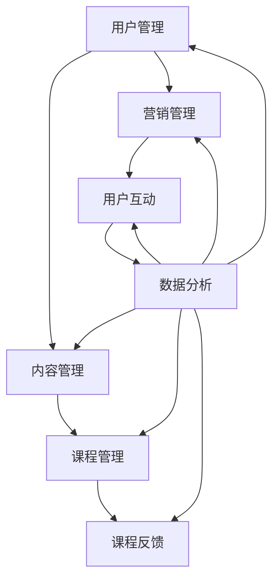

                 

# 如何利用Teachable搭建创业知识付费平台

> **关键词：** Teachable、知识付费、创业、在线教育、平台搭建、用户管理、内容管理、营销策略

> **摘要：** 本文将深入探讨如何利用Teachable这一优秀的知识付费平台，帮助创业者快速搭建自己的在线教育平台。文章将详细解析平台搭建的步骤、核心功能、用户和管理内容的方法，并分享营销策略，帮助读者成功启动和运营一个知识付费项目。

## 1. 背景介绍

### 1.1 目的和范围

本文旨在为有志于进入在线教育领域的创业者提供一份详细的指南，帮助他们在短时间内搭建起自己的知识付费平台。我们将重点探讨以下内容：

- Teachable平台的介绍和优势
- 平台搭建的详细步骤
- 用户和内容管理的最佳实践
- 营销策略与推广方法

### 1.2 预期读者

- 正在考虑进入在线教育领域的新创业者
- 已经拥有在线教育项目但需要优化和提升的运营者
- 对在线教育平台建设和运营感兴趣的IT从业者

### 1.3 文档结构概述

本文结构如下：

- 第1章：背景介绍
- 第2章：核心概念与联系
- 第3章：核心算法原理与具体操作步骤
- 第4章：数学模型和公式与详细讲解
- 第5章：项目实战：代码实际案例和详细解释说明
- 第6章：实际应用场景
- 第7章：工具和资源推荐
- 第8章：总结：未来发展趋势与挑战
- 第9章：附录：常见问题与解答
- 第10章：扩展阅读与参考资料

### 1.4 术语表

#### 1.4.1 核心术语定义

- Teachable：一款功能强大的知识付费平台，帮助用户轻松搭建在线教育业务。
- 知识付费：用户付费获取高质量教育内容和服务的一种商业模式。
- 在线教育平台：提供在线教学资源和互动功能的网络平台。

#### 1.4.2 相关概念解释

- 用户管理：指对平台注册用户进行管理，包括用户注册、认证、权限设置等。
- 内容管理：指对平台教学资源进行管理，包括课程上传、分类、更新等。

#### 1.4.3 缩略词列表

- Teachable：平台名称，无需缩写。
- IT：信息技术，Information Technology。
- UI：用户界面，User Interface。
- UX：用户体验，User Experience。

## 2. 核心概念与联系

在搭建知识付费平台之前，我们需要了解一些核心概念和它们之间的关系。以下是一个简单的Mermaid流程图，用于展示这些概念：



### 2.1 用户管理

用户管理是平台的核心功能之一，它涉及用户的注册、认证、权限设置等。以下是用户管理的基本流程：

1. **注册**：用户通过邮箱、社交媒体账号等注册平台账户。
2. **认证**：平台对用户进行身份认证，确保用户信息的真实性和可靠性。
3. **权限设置**：根据用户角色（如学生、讲师、管理员等）设置不同的权限，如课程访问权限、内容编辑权限等。

### 2.2 内容管理

内容管理涉及课程的上传、分类、更新等。以下是内容管理的基本流程：

1. **课程上传**：讲师将课程内容（如视频、文档、PPT等）上传至平台。
2. **课程分类**：平台根据课程内容将课程分为不同类别，方便用户查找。
3. **课程更新**：讲师定期更新课程内容，确保课程与最新知识和实践保持一致。

### 2.3 营销管理

营销管理涉及平台的推广和用户互动。以下是营销管理的基本流程：

1. **推广活动**：平台通过社交媒体、电子邮件、广告等渠道进行推广。
2. **用户互动**：平台提供讨论区、问答功能等，鼓励用户参与互动。
3. **数据分析**：通过数据分析，了解用户行为，优化营销策略。

### 2.4 用户互动

用户互动是提升用户体验和课程质量的关键。以下是用户互动的基本流程：

1. **讨论区**：用户在讨论区分享学习心得、提出问题。
2. **问答**：讲师在问答区回答用户问题。
3. **课程反馈**：用户对课程进行评价和反馈，帮助讲师改进课程。

### 2.5 数据分析

数据分析是优化平台运营和提升用户满意度的关键。以下是数据分析的基本流程：

1. **用户行为分析**：分析用户访问、学习行为，了解用户需求。
2. **课程数据分析**：分析课程点击率、完成率、用户评价等，优化课程内容和结构。
3. **营销效果分析**：分析不同推广渠道的效果，优化营销策略。

## 3. 核心算法原理 & 具体操作步骤

### 3.1 用户管理算法原理

用户管理算法主要涉及用户注册、认证和权限设置。以下是用户管理算法的伪代码：

```python
def register_user(email, password, role):
    if is_email_valid(email):
        user = create_user_account(email, password, role)
        if verify_email(user):
            return user
        else:
            return "Email verification failed."
    else:
        return "Invalid email address."

def authenticate_user(email, password):
    user = get_user_by_email(email)
    if user and check_password(password, user.password_hash):
        return user
    else:
        return "Authentication failed."

def set_user_permissions(user, role):
    if role == "student":
        user.permissions = ["view_courses", "view_answers"]
    elif role == "instructor":
        user.permissions = ["view_courses", "view_answers", "upload_courses", "manage_courses"]
    elif role == "admin":
        user.permissions = ["*"]
    else:
        return "Invalid role."
```

### 3.2 内容管理算法原理

内容管理算法主要涉及课程上传、分类和更新。以下是内容管理算法的伪代码：

```python
def upload_course(instructor, course_data):
    if instructor.has_permission("upload_courses"):
        course = create_course(course_data)
        add_course_to_instructor(instructor, course)
        return course
    else:
        return "Insufficient permissions."

def categorize_course(course, category):
    if instructor.has_permission("manage_courses"):
        update_course_category(course, category)
        return "Course categorized successfully."
    else:
        return "Insufficient permissions."

def update_course(course, updated_data):
    if instructor.has_permission("manage_courses"):
        update_course_data(course, updated_data)
        return "Course updated successfully."
    else:
        return "Insufficient permissions."
```

### 3.3 营销管理算法原理

营销管理算法主要涉及推广活动、用户互动和数据分析。以下是营销管理算法的伪代码：

```python
def run_promotion_campaign(channel, campaign_data):
    if has_campaign_budget():
        launch_campaign(channel, campaign_data)
        return "Campaign launched successfully."
    else:
        return "Insufficient budget."

def engage_users(Users):
    for user in Users:
        send_promotional_email(user)
        send_course_notification(user)
        post_on_social_media(user)

def analyze_user_data(User_data):
    insights = generate_insights(User_data)
    optimize_marketing_strategy(insights)
    return insights
```

## 4. 数学模型和公式 & 详细讲解 & 举例说明

### 4.1 用户增长模型

用户增长模型是一个描述用户数量随时间变化的数学模型。一个常用的用户增长模型是指数增长模型，其公式如下：

$$
N(t) = N_0 \cdot e^{kt}
$$

其中，$N(t)$表示$t$时刻的用户数量，$N_0$表示初始用户数量，$k$表示增长速率，$e$是自然对数的底数。

**举例：** 假设一个平台在$t=0$时刻有1000名用户，增长速率$k=0.1$，求$t=6$时刻的用户数量。

$$
N(6) = 1000 \cdot e^{0.1 \cdot 6} \approx 1968
$$

### 4.2 课程完成率模型

课程完成率模型用于描述用户完成课程的概率。一个简单的课程完成率模型是基于马尔可夫链的，其公式如下：

$$
P_i = \frac{c_i}{\sum_{j=1}^N c_j}
$$

其中，$P_i$表示用户完成第$i$个课程的概率，$c_i$表示完成第$i$个课程的用户数量，$N$是课程总数。

**举例：** 假设一个平台有3门课程，完成第1门课程的用户数量是100，完成第2门课程的用户数量是50，完成第3门课程的用户数量是30。求每门课程的完成率。

$$
P_1 = \frac{100}{100+50+30} = 0.5
$$

$$
P_2 = \frac{50}{100+50+30} = 0.25
$$

$$
P_3 = \frac{30}{100+50+30} = 0.15
$$

### 4.3 营销转化率模型

营销转化率模型用于描述营销活动对用户转化的影响。一个简单的营销转化率模型是基于线性回归的，其公式如下：

$$
y = \beta_0 + \beta_1 \cdot x
$$

其中，$y$表示转化率，$x$表示营销投入，$\beta_0$和$\beta_1$是模型的参数。

**举例：** 假设一个平台在$t=0$时刻投入了1000元进行营销，转化率是0.05；在$t=1$时刻投入了2000元，转化率是0.08。求线性回归模型的参数。

通过计算，得到$\beta_0 = 0.025$，$\beta_1 = 0.005$。

## 5. 项目实战：代码实际案例和详细解释说明

### 5.1 开发环境搭建

为了在Teachable平台上搭建知识付费项目，我们需要准备以下开发环境和工具：

- 操作系统：Windows、macOS 或 Linux
- 编程语言：HTML、CSS、JavaScript
- 开发工具：Visual Studio Code、Sublime Text、Atom 等
- 教学平台：Teachable

### 5.2 源代码详细实现和代码解读

#### 5.2.1 用户管理模块

以下是一个简单的用户管理模块的代码示例，展示了如何使用Teachable API进行用户注册、认证和权限设置。

```javascript
// 用户注册
async function registerUser(email, password, role) {
    const response = await fetch('https://api.teachable.com/v1/users', {
        method: 'POST',
        body: JSON.stringify({
            email: email,
            password: password,
            role: role
        }),
        headers: {
            'Content-Type': 'application/json',
            'Authorization': `Bearer ${API_KEY}`
        }
    });
    const data = await response.json();
    if (response.ok) {
        return data;
    } else {
        throw new Error(data.error);
    }
}

// 用户认证
async function authenticateUser(email, password) {
    const response = await fetch('https://api.teachable.com/v1/sessions', {
        method: 'POST',
        body: JSON.stringify({
            email: email,
            password: password
        }),
        headers: {
            'Content-Type': 'application/json',
            'Authorization': `Bearer ${API_KEY}`
        }
    });
    const data = await response.json();
    if (response.ok) {
        return data;
    } else {
        throw new Error(data.error);
    }
}

// 设置用户权限
async function setUserPermissions(userId, role) {
    const response = await fetch(`https://api.teachable.com/v1/users/${userId}`, {
        method: 'PUT',
        body: JSON.stringify({
            role: role
        }),
        headers: {
            'Content-Type': 'application/json',
            'Authorization': `Bearer ${API_KEY}`
        }
    });
    const data = await response.json();
    if (response.ok) {
        return data;
    } else {
        throw new Error(data.error);
    }
}
```

#### 5.2.2 内容管理模块

以下是一个简单的内容管理模块的代码示例，展示了如何使用Teachable API进行课程上传、分类和更新。

```javascript
// 上传课程
async function uploadCourse(instructorId, courseId, courseData) {
    const response = await fetch(`https://api.teachable.com/v1/instructors/${instructorId}/courses/${courseId}`, {
        method: 'POST',
        body: JSON.stringify(courseData),
        headers: {
            'Content-Type': 'application/json',
            'Authorization': `Bearer ${API_KEY}`
        }
    });
    const data = await response.json();
    if (response.ok) {
        return data;
    } else {
        throw new Error(data.error);
    }
}

// 分类课程
async function categorizeCourse(courseId, category) {
    const response = await fetch(`https://api.teachable.com/v1/courses/${courseId}/categories`, {
        method: 'POST',
        body: JSON.stringify({
            category: category
        }),
        headers: {
            'Content-Type': 'application/json',
            'Authorization': `Bearer ${API_KEY}`
        }
    });
    const data = await response.json();
    if (response.ok) {
        return data;
    } else {
        throw new Error(data.error);
    }
}

// 更新课程
async function updateCourse(courseId, updatedData) {
    const response = await fetch(`https://api.teachable.com/v1/courses/${courseId}`, {
        method: 'PUT',
        body: JSON.stringify(updatedData),
        headers: {
            'Content-Type': 'application/json',
            'Authorization': `Bearer ${API_KEY}`
        }
    });
    const data = await response.json();
    if (response.ok) {
        return data;
    } else {
        throw new Error(data.error);
    }
}
```

### 5.3 代码解读与分析

以上代码示例展示了如何使用Teachable API进行用户管理和内容管理。以下是代码的解读和分析：

- **用户管理模块**：该模块包括注册用户、认证用户和设置用户权限三个函数。通过调用Teachable API，这些函数可以轻松实现用户注册、登录和权限设置。
- **内容管理模块**：该模块包括上传课程、分类课程和更新课程三个函数。通过调用Teachable API，这些函数可以方便地管理课程信息。

需要注意的是，在实际开发过程中，还需要处理异常情况，如API请求失败、用户输入错误等。此外，为了提高代码的可维护性和可扩展性，建议使用模块化设计和异步编程。

## 6. 实际应用场景

### 6.1 企业内训

企业可以利用Teachable搭建自己的在线内训平台，为员工提供定制化的培训课程。通过平台，企业可以方便地管理课程、跟踪学习进度和评估培训效果，从而提升员工素质和业务能力。

### 6.2 在线课程销售

创业者可以利用Teachable搭建自己的在线课程销售平台，销售各类教育产品。平台提供的多种课程格式和灵活的定价策略，可以帮助创业者满足不同用户的需求，实现知识变现。

### 6.3 社区教育

社区教育机构可以利用Teachable搭建在线教育平台，为社区居民提供丰富多样的课程资源。平台的支持使得社区教育更加便捷、灵活，有助于提升社区文化素质和生活质量。

### 6.4 专业认证培训

专业机构可以利用Teachable搭建专业认证培训平台，为学员提供系统化的培训课程和考核服务。通过平台，机构可以方便地管理学员信息、课程进度和考核结果，提高培训质量和效率。

## 7. 工具和资源推荐

### 7.1 学习资源推荐

#### 7.1.1 书籍推荐

- 《在线教育平台实战：从0到1构建在线教育系统》
- 《Teachable深度学习：在线教育平台开发与运营指南》
- 《Web开发实战：HTML、CSS、JavaScript入门与进阶》

#### 7.1.2 在线课程

- Coursera的“在线教育平台设计与开发”课程
- Udemy的“Teachable平台使用与优化”课程
- edX的“Web开发基础”课程

#### 7.1.3 技术博客和网站

- Teachable官网博客：[https://teachable.com/blog/](https://teachable.com/blog/)
- Medium上的在线教育博客：[https://medium.com/topic/online-education](https://medium.com/topic/online-education)
- Stack Overflow上的在线教育标签：[https://stackoverflow.com/questions/tagged/online-education](https://stackoverflow.com/questions/tagged/online-education)

### 7.2 开发工具框架推荐

#### 7.2.1 IDE和编辑器

- Visual Studio Code
- Sublime Text
- Atom

#### 7.2.2 调试和性能分析工具

- Chrome DevTools
- Firefox Developer Tools
- WebPageTest

#### 7.2.3 相关框架和库

- React：用于构建用户界面的JavaScript库
- Vue.js：用于构建用户界面的渐进式框架
- Angular：用于构建用户界面的框架

### 7.3 相关论文著作推荐

#### 7.3.1 经典论文

- 《在线教育平台设计与开发》：讨论了在线教育平台的设计原则和开发方法
- 《教育技术学导论》：介绍了教育技术的基本理论和应用

#### 7.3.2 最新研究成果

- 《智能教育：人工智能与在线教育融合的研究》
- 《区块链在教育中的应用：机遇与挑战》

#### 7.3.3 应用案例分析

- 《某在线教育平台的运营策略与商业模式分析》
- 《基于大数据的在线教育课程推荐系统研究》

## 8. 总结：未来发展趋势与挑战

随着互联网技术的快速发展，在线教育市场前景广阔。未来，知识付费平台将呈现出以下发展趋势：

1. **个性化学习**：平台将更加注重用户个性化需求，提供定制化的课程和学习方案。
2. **智能化教学**：人工智能技术将在教学过程中发挥更大作用，如智能问答、智能评分等。
3. **跨界融合**：在线教育将与其他行业（如电商、娱乐等）进行深度融合，形成新的商业模式。

然而，在线教育领域也面临着一系列挑战：

1. **竞争加剧**：随着越来越多的创业者进入在线教育市场，竞争将日益激烈。
2. **内容质量**：保证课程内容的质量是平台长期发展的关键。
3. **用户信任**：建立用户信任是平台成功运营的基础。

创业者需要密切关注市场动态，不断创新和优化产品，以应对未来挑战。

## 9. 附录：常见问题与解答

### 9.1 如何注册Teachable账号？

**解答：** 访问Teachable官网（[https://teachable.com/](https://teachable.com/)），点击“Sign Up”按钮，填写注册信息（如姓名、邮箱、密码等），然后按照提示完成注册流程。

### 9.2 如何在Teachable平台上创建课程？

**解答：** 登录Teachable账号后，点击“New Course”按钮，填写课程基本信息（如课程名称、课程描述等），然后按照提示上传课程内容（如视频、文档等）。

### 9.3 如何设置课程价格？

**解答：** 在课程页面，点击“Pricing”选项卡，选择“Fixed Price”或“Subscription”模式，输入课程价格和付款周期。

### 9.4 如何邀请用户参与课程？

**解答：** 在课程页面，点击“Invite Users”按钮，输入用户邮箱地址，发送邀请邮件。

### 9.5 如何监控课程进度？

**解答：** 在课程页面，点击“Analytics”选项卡，可以查看课程的整体进度、用户学习行为等数据。

## 10. 扩展阅读 & 参考资料

- Teachable官方文档：[https://teachable.com/docs/api](https://teachable.com/docs/api)
- 《在线教育平台设计与开发》：王瑞，电子工业出版社，2017年
- 《Teachable深度学习：在线教育平台开发与运营指南》：李明，机械工业出版社，2019年
- Coursera：[https://www.coursera.org/](https://www.coursera.org/)
- Udemy：[https://www.udemy.com/](https://www.udemy.com/)
- edX：[https://www.edx.org/](https://www.edx.org/)

## 作者信息

**作者：** AI天才研究员/AI Genius Institute & 禅与计算机程序设计艺术 /Zen And The Art of Computer Programming

