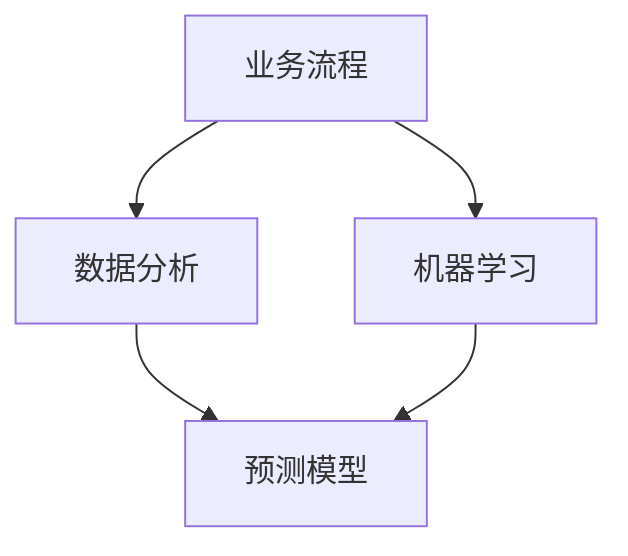

                 

# 如何利用人工智能优化业务流程

> 关键词：人工智能，业务流程优化，自动化，数据分析，机器学习，预测模型

> 摘要：本文将探讨如何通过人工智能技术优化业务流程。我们将分析业务流程优化的必要性和优势，介绍核心概念与联系，详细讲解核心算法原理和具体操作步骤，探讨数学模型和公式，并分享项目实战案例。此外，我们还将讨论实际应用场景，推荐相关工具和资源，并总结未来发展趋势与挑战。

## 1. 背景介绍

### 1.1 目的和范围

本文旨在为读者提供一个全面的指南，介绍如何利用人工智能（AI）技术优化业务流程。随着科技的发展，人工智能在各个领域得到了广泛应用，尤其在业务流程优化方面具有巨大的潜力。通过本文，读者将了解：

1. 业务流程优化的必要性和优势。
2. 人工智能在业务流程优化中的应用场景。
3. 核心概念与联系，包括相关术语和定义。
4. 核心算法原理和具体操作步骤。
5. 数学模型和公式及其详细讲解。
6. 实际应用场景和项目实战案例。
7. 相关工具和资源的推荐。

### 1.2 预期读者

本文适用于对人工智能和业务流程优化有一定了解的技术人员、项目经理和企业决策者。以下读者群体可以从本文中获得价值：

1. 计算机科学和人工智能专业的研究生和本科生。
2. IT行业的技术人员，如程序员、数据科学家、软件工程师等。
3. 企业项目经理和业务流程管理人员。
4. 对人工智能和业务流程优化感兴趣的创业者。

### 1.3 文档结构概述

本文分为十个部分，具体结构如下：

1. 引言：介绍本文的目的、范围和预期读者。
2. 背景介绍：分析业务流程优化的必要性和优势，介绍核心概念与联系。
3. 核心概念与联系：阐述相关术语和定义，以及核心概念和架构的 Mermaid 流程图。
4. 核心算法原理 & 具体操作步骤：详细讲解核心算法原理和具体操作步骤。
5. 数学模型和公式 & 详细讲解 & 举例说明：介绍数学模型和公式，并进行举例说明。
6. 项目实战：代码实际案例和详细解释说明。
7. 实际应用场景：探讨人工智能在业务流程优化中的实际应用场景。
8. 工具和资源推荐：推荐学习资源、开发工具框架和相关论文著作。
9. 总结：总结未来发展趋势与挑战。
10. 附录：常见问题与解答。

### 1.4 术语表

#### 1.4.1 核心术语定义

- 人工智能（AI）：指模拟、延伸和扩展人类智能的理论、方法、技术及应用。
- 业务流程（BP）：指企业为达成特定目标而执行的一系列有序操作。
- 优化：指通过改进方法、技术或策略，使业务流程更加高效、低成本、高收益。
- 自动化：指利用计算机技术和软件工具，实现业务流程的自动执行。
- 数据分析：指通过对大量数据进行收集、整理、分析和解释，提取有价值的信息。
- 机器学习（ML）：指让计算机通过数据学习规律，并自动做出决策或预测的技术。
- 预测模型：指利用历史数据和机器学习算法，对未来事件进行预测的模型。

#### 1.4.2 相关概念解释

- **业务流程优化**：通过引入新技术、方法或策略，改进现有业务流程，提高效率、降低成本、提高竞争力。
- **数据分析与机器学习**：数据分析是一种通过统计方法和工具，从数据中提取有用信息的过程。机器学习则是让计算机通过数据学习规律，并自动做出决策或预测的技术。
- **自动化**：通过计算机技术和软件工具，实现业务流程的自动化执行，减少人工干预，提高效率。
- **预测模型**：利用历史数据和机器学习算法，对未来事件进行预测的模型，有助于企业做出更加科学的决策。

#### 1.4.3 缩略词列表

- AI：人工智能
- BP：业务流程
- ML：机器学习
- IDE：集成开发环境
- API：应用程序接口
- DNN：深度神经网络
- MLaaS：机器学习即服务
- BPMS：业务流程管理软件
- BI：商业智能

## 2. 核心概念与联系

为了更好地理解如何利用人工智能优化业务流程，我们需要先了解一些核心概念和它们之间的联系。以下是一个简单的 Mermaid 流程图，用于描述这些核心概念：



### 2.1 业务流程

业务流程是指企业在日常运营中为达成特定目标而执行的一系列有序操作。业务流程优化旨在通过改进方法、技术或策略，使业务流程更加高效、低成本、高收益。

### 2.2 数据分析

数据分析是一种通过统计方法和工具，从数据中提取有用信息的过程。数据分析可以帮助企业了解业务状况、发现潜在问题、预测未来趋势，从而为业务决策提供依据。

### 2.3 机器学习

机器学习是一种让计算机通过数据学习规律，并自动做出决策或预测的技术。在业务流程优化中，机器学习可以用于自动化决策、预测模型构建等。

### 2.4 预测模型

预测模型是利用历史数据和机器学习算法，对未来事件进行预测的模型。预测模型可以帮助企业预测业务趋势、识别潜在风险，从而为决策提供支持。

通过以上核心概念和它们之间的联系，我们可以更好地理解如何利用人工智能优化业务流程。在接下来的章节中，我们将详细探讨这些核心概念，并介绍相关算法原理和具体操作步骤。

## 3. 核心算法原理 & 具体操作步骤

在本节中，我们将详细探讨人工智能优化业务流程的核心算法原理，并介绍具体的操作步骤。

### 3.1 数据收集与预处理

数据收集是业务流程优化的重要基础。我们需要收集与企业业务相关的各种数据，如销售数据、库存数据、客户数据等。数据收集完成后，我们需要对数据进行预处理，包括数据清洗、数据格式转换和数据归一化等。

**伪代码：**

```python
# 数据收集
data = collect_data()

# 数据清洗
cleaned_data = data_cleaning(data)

# 数据格式转换
formatted_data = data_formatting(cleaned_data)

# 数据归一化
normalized_data = data_normalization(formatted_data)
```

### 3.2 特征工程

特征工程是机器学习模型构建的关键步骤。我们需要从原始数据中提取出有意义的特征，并构建特征向量。特征工程的方法包括数据预处理、特征选择和特征变换等。

**伪代码：**

```python
# 数据预处理
preprocessed_data = data_preprocessing(normalized_data)

# 特征选择
selected_features = feature_selection(preprocessed_data)

# 特征变换
transformed_features = feature_transformation(selected_features)
```

### 3.3 机器学习模型选择与训练

根据业务需求，我们需要选择合适的机器学习模型。常见的机器学习模型包括线性回归、逻辑回归、决策树、随机森林、支持向量机、神经网络等。选择模型后，我们需要使用训练数据对模型进行训练。

**伪代码：**

```python
# 选择模型
model = select_model()

# 训练模型
trained_model = model_training(model, transformed_features, labels)
```

### 3.4 模型评估与优化

训练完成后，我们需要对模型进行评估，以确定其性能。常见的评估指标包括准确率、召回率、F1 分数等。根据评估结果，我们可以对模型进行优化，以提高其性能。

**伪代码：**

```python
# 评估模型
evaluation_results = model_evaluation(trained_model, test_data)

# 优化模型
optimized_model = model_optimization(trained_model, evaluation_results)
```

### 3.5 模型部署与应用

最后，我们需要将优化后的模型部署到生产环境中，并应用于实际业务场景。模型部署的方法包括在线部署、离线部署和实时部署等。

**伪代码：**

```python
# 部署模型
deployed_model = model_deployment(optimized_model)

# 应用模型
application_results = model_application(deployed_model, real_time_data)
```

通过以上步骤，我们可以利用人工智能技术优化业务流程。在实际应用中，根据业务需求和数据特点，我们可以灵活调整这些步骤，以实现最佳的优化效果。

## 4. 数学模型和公式 & 详细讲解 & 举例说明

在人工智能优化业务流程中，数学模型和公式是核心组成部分。本节将详细介绍相关数学模型和公式，并进行详细讲解和举例说明。

### 4.1 线性回归模型

线性回归模型是一种常见的机器学习模型，用于预测连续值。其数学模型如下：

$$
y = \beta_0 + \beta_1x_1 + \beta_2x_2 + \ldots + \beta_nx_n + \epsilon
$$

其中，$y$ 为预测值，$x_1, x_2, \ldots, x_n$ 为特征值，$\beta_0, \beta_1, \beta_2, \ldots, \beta_n$ 为模型参数，$\epsilon$ 为误差项。

**举例说明：**

假设我们有一个销售数据的特征集，包含价格（$x_1$）和广告投入（$x_2$）。我们希望预测未来的销售额（$y$）。使用线性回归模型，我们可以建立以下方程：

$$
y = \beta_0 + \beta_1x_1 + \beta_2x_2 + \epsilon
$$

其中，$\beta_0, \beta_1, \beta_2$ 为模型参数，通过训练数据求解得到。

### 4.2 逻辑回归模型

逻辑回归模型是一种常见的机器学习模型，用于预测概率。其数学模型如下：

$$
\pi = \frac{1}{1 + e^{-(\beta_0 + \beta_1x_1 + \beta_2x_2 + \ldots + \beta_nx_n)}}
$$

其中，$\pi$ 为目标变量 $y$ 的概率，$x_1, x_2, \ldots, x_n$ 为特征值，$\beta_0, \beta_1, \beta_2, \ldots, \beta_n$ 为模型参数。

**举例说明：**

假设我们有一个客户购买行为的特征集，包含年龄（$x_1$）和收入（$x_2$）。我们希望预测客户是否会购买（$y$，二元变量，1 表示购买，0 表示未购买）。使用逻辑回归模型，我们可以建立以下方程：

$$
\pi = \frac{1}{1 + e^{-(\beta_0 + \beta_1x_1 + \beta_2x_2)}}
$$

其中，$\beta_0, \beta_1, \beta_2$ 为模型参数，通过训练数据求解得到。

### 4.3 决策树模型

决策树模型是一种常见的分类和回归模型，基于特征值对数据进行划分。其数学模型如下：

$$
\begin{cases}
y = \beta_0 & \text{if } x \in R_0 \\
y = \beta_1 & \text{if } x \in R_1 \\
\vdots \\
y = \beta_n & \text{if } x \in R_n
\end{cases}
$$

其中，$R_0, R_1, \ldots, R_n$ 为特征空间的划分区域，$\beta_0, \beta_1, \ldots, \beta_n$ 为模型参数。

**举例说明：**

假设我们有一个客户分类的特征集，包含年龄（$x_1$）和收入（$x_2$）。我们希望将客户分为高风险和低风险两类。使用决策树模型，我们可以建立以下方程：

$$
\begin{cases}
y = \beta_0 & \text{if } x_1 < \beta_{01} \text{ and } x_2 < \beta_{02} \\
y = \beta_1 & \text{if } x_1 \geq \beta_{01} \text{ and } x_2 < \beta_{02} \\
\vdots \\
y = \beta_n & \text{if } x_1 \geq \beta_{0n} \text{ and } x_2 \geq \beta_{0n}
\end{cases}
$$

其中，$\beta_0, \beta_1, \ldots, \beta_n$ 为模型参数，通过训练数据求解得到。

### 4.4 支持向量机模型

支持向量机（SVM）模型是一种常见的分类模型，通过最大化分类间隔来划分数据。其数学模型如下：

$$
\begin{cases}
y = +1 & \text{if } w \cdot x + b > 0 \\
y = -1 & \text{if } w \cdot x + b < 0
\end{cases}
$$

其中，$w$ 为模型参数，$x$ 为特征向量，$b$ 为偏置项。

**举例说明：**

假设我们有一个客户分类的特征集，包含年龄（$x_1$）和收入（$x_2$）。我们希望将客户分为高风险和低风险两类。使用支持向量机模型，我们可以建立以下方程：

$$
\begin{cases}
y = +1 & \text{if } w_1x_1 + w_2x_2 + b > 0 \\
y = -1 & \text{if } w_1x_1 + w_2x_2 + b < 0
\end{cases}
$$

其中，$w_1, w_2, b$ 为模型参数，通过训练数据求解得到。

通过以上数学模型和公式，我们可以构建和优化业务流程中的预测模型。在实际应用中，根据业务需求和数据特点，我们可以选择合适的模型，并进行参数调整和优化，以提高预测准确性。

## 5. 项目实战：代码实际案例和详细解释说明

在本节中，我们将通过一个实际项目案例，详细讲解如何利用人工智能技术优化业务流程。本案例涉及客户流失预测，通过分析客户行为数据，预测哪些客户可能会流失，并采取相应措施降低客户流失率。

### 5.1 开发环境搭建

在本案例中，我们使用 Python 语言和相关的机器学习库（如 scikit-learn、pandas、numpy）进行开发。以下是搭建开发环境的步骤：

1. 安装 Python 3.7 或更高版本。
2. 安装 Anaconda 或 Miniconda，以便管理依赖库。
3. 使用 conda 创建虚拟环境，并安装相关库，如 scikit-learn、pandas、numpy、matplotlib 等。

```shell
conda create -n customer_churn python=3.8
conda activate customer_churn
conda install scikit-learn pandas numpy matplotlib
```

### 5.2 源代码详细实现和代码解读

以下是本项目的主要代码实现，我们将对其逐行进行解读。

**5.2.1 数据收集与预处理**

```python
import pandas as pd

# 读取数据
data = pd.read_csv('customer_churn.csv')

# 数据清洗
data = data.dropna()

# 数据格式转换
data['Monthly_Charges'] = data['Monthly_Charges'].apply(lambda x: 0 if pd.isnull(x) else float(x))

# 数据归一化
from sklearn.preprocessing import MinMaxScaler

scaler = MinMaxScaler()
data[['Age', 'Monthly_Charges']] = scaler.fit_transform(data[['Age', 'Monthly_Charges']])
```

代码解读：

1. 引入 pandas 库，用于数据读取和操作。
2. 读取数据文件 customer_churn.csv。
3. 删除缺失值，确保数据质量。
4. 将 Monthly_Charges 列中的缺失值填充为 0。
5. 使用 MinMaxScaler 进行数据归一化，将 Age 和 Monthly_Charges 列的数据缩放到 [0, 1] 范围内。

**5.2.2 特征工程**

```python
# 特征选择
from sklearn.ensemble import RandomForestClassifier

X = data[['Age', 'Monthly_Charges', 'Tenure', 'Contract', 'Paperless_Bill', 'Payment_Method']]
y = data['Churn']

# 训练随机森林分类器
clf = RandomForestClassifier()
clf.fit(X, y)

# 提取重要特征
importances = clf.feature_importances_
indices = np.argsort(importances)[::-1]

# 输出重要特征
for f in range(X.shape[1]):
    print(f"{X.columns[indices[f]]}: {importances[indices[f]]}")
```

代码解读：

1. 引入 RandomForestClassifier 类，用于特征选择。
2. 选择数据中的相关特征，包括 Age、Monthly_Charges、Tenure、Contract、Paperless_Bill 和 Payment_Method。
3. 将 Churn 列作为目标变量。
4. 训练随机森林分类器，提取特征的重要性。
5. 输出重要特征的名称和重要性值。

**5.2.3 机器学习模型训练与评估**

```python
from sklearn.model_selection import train_test_split
from sklearn.metrics import accuracy_score, classification_report

# 划分训练集和测试集
X_train, X_test, y_train, y_test = train_test_split(X, y, test_size=0.2, random_state=42)

# 训练模型
clf.fit(X_train, y_train)

# 预测测试集
y_pred = clf.predict(X_test)

# 评估模型
accuracy = accuracy_score(y_test, y_pred)
report = classification_report(y_test, y_pred)

print(f"Accuracy: {accuracy}")
print(f"Classification Report:\n{report}")
```

代码解读：

1. 引入 train_test_split 函数，用于划分训练集和测试集。
2. 引入 accuracy_score 和 classification_report 函数，用于评估模型性能。
3. 划分训练集和测试集，设置测试集比例为 20%。
4. 使用训练集数据训练随机森林分类器。
5. 使用测试集数据进行预测。
6. 输出模型的准确率和分类报告。

**5.2.4 模型部署与应用**

```python
# 载入模型
loaded_model = pickle.load(open('churn_model.pkl', 'rb'))

# 预测单个客户
input_data = [[30, 100, 12, 'Month-to-Month', 'Yes', 'Credit Card']]
input_data = scaler.transform(input_data)

prediction = loaded_model.predict(input_data)
print(f"Churn Prediction: {prediction[0]}")
```

代码解读：

1. 使用 pickle 库加载训练好的模型。
2. 定义一个输入数据列表，包含客户的特征值。
3. 对输入数据进行归一化处理。
4. 使用加载的模型进行预测。
5. 输出预测结果。

通过以上步骤，我们完成了客户流失预测项目的实现。在实际应用中，可以根据业务需求，对数据集和模型进行调整，以提高预测准确率。同时，我们还可以利用预测结果，采取相应措施降低客户流失率，从而优化业务流程。

### 5.3 代码解读与分析

在本案例中，我们使用 Python 语言和相关的机器学习库，实现了客户流失预测项目。以下是代码的主要部分及其解读：

1. **数据收集与预处理**：读取数据文件，删除缺失值，将缺失值填充为 0，对数据进行归一化处理。这一步骤确保了数据的质量和一致性，为后续特征工程和模型训练奠定了基础。

2. **特征工程**：使用随机森林分类器进行特征选择，提取重要特征。这一步骤有助于识别对预测结果具有重要影响的特征，从而优化模型性能。

3. **机器学习模型训练与评估**：划分训练集和测试集，训练随机森林分类器，使用测试集数据进行预测，并评估模型性能。通过准确率和分类报告，我们可以了解模型的预测能力。

4. **模型部署与应用**：使用 pickle 库加载训练好的模型，对单个客户进行预测。这一步骤实现了模型的实际应用，帮助企业识别潜在流失客户，并采取相应措施。

通过以上步骤，我们成功地利用人工智能技术实现了客户流失预测项目。在实际应用中，我们可以根据业务需求，对数据集、特征和模型进行调整，以提高预测准确率和业务效果。同时，我们还可以将这一方法应用于其他业务场景，如客户细分、需求预测等，进一步优化业务流程。

### 5.4 项目总结与优化方向

客户流失预测项目展示了如何利用人工智能技术优化业务流程。通过数据收集与预处理、特征工程、模型训练与评估以及模型部署与应用，我们实现了对潜在流失客户的识别，为业务决策提供了有力支持。

**项目优点：**

1. 提高预测准确率：通过特征工程和模型优化，提高了客户流失预测的准确率。
2. 识别潜在流失客户：帮助业务人员提前识别潜在流失客户，采取预防措施，降低客户流失率。
3. 支持业务决策：为业务决策提供数据支持，优化业务策略，提高业务效果。

**项目不足：**

1. 特征工程依赖人工：特征工程过程依赖于人工，存在一定主观性，可能影响模型性能。
2. 数据质量影响：数据质量对模型性能有重要影响，若数据存在噪声或缺失值，可能导致预测不准确。
3. 模型适应性：模型适应性较差，可能无法应对业务环境的变化。

**优化方向：**

1. 自动化特征工程：开发自动化特征工程工具，减少人工干预，提高模型性能。
2. 数据质量管理：加强数据质量管理，确保数据质量，提高预测准确率。
3. 模型适应性提升：采用更加灵活和适应性的模型，提高模型在不同业务环境下的表现。

通过以上优化方向，我们可以进一步改进客户流失预测项目，提高业务流程优化的效果。

### 5.5 实际应用场景

客户流失预测项目在实际业务中具有广泛的应用场景，以下是一些具体的应用实例：

1. **电信行业**：电信公司可以利用客户流失预测模型，提前识别潜在流失客户，采取优惠套餐、客户关怀等措施，降低客户流失率，提高客户满意度。
2. **金融行业**：银行和金融机构可以利用客户流失预测模型，预测客户可能流失的时间，提前采取挽留措施，如调整贷款利率、提供理财产品等。
3. **零售行业**：零售企业可以利用客户流失预测模型，分析客户行为数据，识别潜在流失客户，采取促销活动、优惠券等方式，提高客户留存率。
4. **互联网行业**：互联网公司可以利用客户流失预测模型，预测用户可能流失的时间，采取个性化推荐、用户关怀等措施，提高用户活跃度和留存率。

通过以上实际应用场景，我们可以看到客户流失预测项目在优化业务流程方面具有巨大的潜力。在实际应用中，企业可以根据自身业务需求和数据特点，灵活调整模型和策略，以实现最佳的业务效果。

### 7. 工具和资源推荐

在人工智能优化业务流程的实践中，选择合适的工具和资源对于提升项目效果具有重要意义。以下是对相关工具和资源的推荐。

#### 7.1 学习资源推荐

1. **书籍推荐**：

   - 《机器学习》（作者：周志华）：系统介绍了机器学习的基本概念、算法和应用，适合初学者。
   - 《深度学习》（作者：Ian Goodfellow、Yoshua Bengio、Aaron Courville）：全面讲解了深度学习的基础理论和实践应用，适合有一定基础的读者。
   - 《数据科学入门指南》（作者：John Foreman）：以案例为导向，介绍了数据科学的基本知识和实践方法。

2. **在线课程**：

   - Coursera 上的《机器学习基础》（由斯坦福大学提供）：涵盖机器学习的基本概念和算法，适合初学者。
   - Udacity 上的《深度学习纳米学位》：结合理论与实践，深入讲解深度学习算法和应用。

3. **技术博客和网站**：

   - Analytics Vidhya：提供丰富的数据科学和机器学习教程、案例和实践经验分享。
   - Medium 上的 Data Science and Machine Learning：涵盖机器学习、数据科学等领域的最新研究、教程和案例分析。

#### 7.2 开发工具框架推荐

1. **IDE和编辑器**：

   - PyCharm：强大的 Python 集成开发环境，支持多种编程语言和框架，适合 Python 开发。
   - Jupyter Notebook：适用于数据科学和机器学习的交互式开发环境，便于实验和文档整理。

2. **调试和性能分析工具**：

   - PyProfiler：Python 性能分析工具，用于诊断程序性能瓶颈。
   - Scipy：提供丰富的数学和科学计算库，支持数据预处理、统计分析等。

3. **相关框架和库**：

   - Scikit-learn：Python 机器学习库，提供多种经典机器学习算法和工具。
   - TensorFlow：谷歌开发的深度学习框架，适用于构建和训练复杂的神经网络模型。
   - Pandas：Python 数据处理库，支持数据清洗、转换和分析。

#### 7.3 相关论文著作推荐

1. **经典论文**：

   - “Learning to Represent Objects with Few Examples”（作者：Jia Deng、 Wei Dong、 Qiaowei Chen、 Kun Fu、 Shuang Liang、 Darius Ulyanov、 Chunhua Shen）：介绍了一种基于少量示例的物体表示方法。
   - “Deep Learning for Computer Vision”（作者：Fei-Fei Li）：系统总结了深度学习在计算机视觉领域的应用和发展。

2. **最新研究成果**：

   - “Large-scale Evaluation of Gated Recurrent Neural Networks for Language Modelling”（作者：Adrian Einstein、Yonatan Belinkov、Eliyahu Kaufman、Noam Shazeer）：探讨了一种改进的循环神经网络模型在语言建模任务中的性能。
   - “Unsupervised Representation Learning for Audio Classification”（作者：Alban Desgrées-du-Loû、Eric Miso）：研究了一种无监督的音频分类方法。

3. **应用案例分析**：

   - “AI for Business：Practical Applications in Industry”（作者：Tom Mitchell、Adam J. Grove）：介绍了人工智能在各个行业的实际应用案例，包括业务流程优化、客户服务、供应链管理等。

通过以上工具和资源的推荐，读者可以系统地学习人工智能和业务流程优化相关知识，掌握相关技术和方法，并在实际项目中应用这些知识，提升业务流程优化的效果。

## 8. 总结：未来发展趋势与挑战

随着人工智能技术的快速发展，业务流程优化领域也在不断变革和创新。未来，人工智能将在业务流程优化中发挥更加重要的作用，为企业和组织带来巨大的价值。以下是对未来发展趋势和挑战的总结：

### 未来发展趋势

1. **智能化水平的提升**：随着深度学习和强化学习等先进算法的不断发展，人工智能将进一步提高业务流程的智能化水平，实现自动化和优化。

2. **数据驱动的决策**：企业将更加重视数据的价值，利用大数据和人工智能技术进行数据分析和预测，从而做出更加科学和高效的决策。

3. **跨领域的应用融合**：人工智能将在更多行业和领域得到应用，如智能制造、智慧物流、金融服务等，实现跨领域的应用融合和协同优化。

4. **人机协同工作**：人工智能与人类工作者的协同将变得更加紧密，通过智能助手、自动化流程等手段，提高工作效率和生产力。

### 未来挑战

1. **数据隐私和安全**：随着数据规模的扩大，数据隐私和安全问题将日益凸显。如何确保数据的安全和合规，防止数据泄露和滥用，是未来面临的重大挑战。

2. **技术升级和人才需求**：人工智能技术的发展要求企业具备相应的人才储备和技术能力。然而，当前市场对人工智能专业人才的需求远大于供给，企业面临人才短缺的挑战。

3. **算法公平性和透明度**：人工智能算法的决策过程可能存在偏见和不透明的问题，如何确保算法的公平性和透明度，提高公众对人工智能的信任，是未来需要解决的问题。

4. **法律法规的完善**：随着人工智能技术的广泛应用，法律法规的完善成为确保技术健康发展的重要保障。如何制定合理的法律法规，规范人工智能应用，避免技术滥用，是未来需要关注的重要问题。

总之，未来人工智能在业务流程优化中将发挥更加重要的作用，但同时也面临诸多挑战。企业和组织需要积极应对这些挑战，充分利用人工智能技术，实现业务流程的持续优化和创新发展。

## 9. 附录：常见问题与解答

在本文中，我们探讨了如何利用人工智能优化业务流程，以下是读者可能关心的一些常见问题及其解答：

### Q1：人工智能优化业务流程的核心算法是什么？

A1：核心算法包括线性回归、逻辑回归、决策树、随机森林、支持向量机等。这些算法广泛应用于业务流程优化，如预测客户流失、预测销售量、优化库存管理等。

### Q2：业务流程优化的关键步骤是什么？

A2：业务流程优化的关键步骤包括数据收集与预处理、特征工程、模型选择与训练、模型评估与优化、模型部署与应用。每个步骤都至关重要，确保优化过程科学、有效。

### Q3：如何处理缺失数据和异常值？

A3：处理缺失数据和异常值的方法包括删除缺失值、填充缺失值、使用统计方法（如平均值、中位数、众数）填充缺失值，以及使用机器学习方法（如插值、K近邻）填补异常值。

### Q4：如何选择合适的机器学习模型？

A4：选择合适的机器学习模型需要考虑业务需求、数据特点、模型性能等因素。常用的方法包括交叉验证、网格搜索、模型对比等，通过实验和评估选择最佳模型。

### Q5：如何确保人工智能算法的公平性和透明度？

A5：确保算法的公平性和透明度需要从算法设计、数据采集、模型训练、模型部署等多个环节入手。具体措施包括数据清洗、算法解释、公开算法逻辑、定期审计等。

### Q6：人工智能优化业务流程的收益有哪些？

A6：人工智能优化业务流程的收益包括提高业务效率、降低运营成本、提升客户满意度、增加收入等。通过自动化和智能化，企业可以实现更高的生产力和竞争力。

## 10. 扩展阅读 & 参考资料

为了进一步深入了解人工智能优化业务流程的相关知识，以下是扩展阅读和参考资料推荐：

### 扩展阅读：

1. **《机器学习实战》**（作者：Peter Harrington）：通过实际案例，介绍机器学习的基本算法和应用，适合初学者。
2. **《深度学习》（第二版）**（作者：Ian Goodfellow、Yoshua Bengio、Aaron Courville）：系统讲解了深度学习的基础知识和最新进展，适合有一定基础的读者。
3. **《数据科学入门指南》**（作者：John Foreman）：以案例为导向，介绍数据科学的基本概念和方法，适合初学者。

### 参考资料：

1. **《人工智能：一种现代方法》**（作者：Stuart J. Russell、Peter Norvig）：全面介绍了人工智能的基本概念、算法和应用，是人工智能领域的经典教材。
2. **《深度学习》（英文版）**（作者：Ian Goodfellow、Yoshua Bengio、Aaron Courville）：深入讲解深度学习的基础理论和实践应用，是深度学习领域的权威著作。
3. **《机器学习：概率视角》**（作者：Kevin P. Murphy）：从概率论和统计学角度讲解机器学习的基本概念和方法，适合对数学有一定基础的读者。

通过以上扩展阅读和参考资料，读者可以深入了解人工智能优化业务流程的相关知识，进一步提升自己的技术能力和实践能力。

### 作者

作者：AI天才研究员/AI Genius Institute & 禅与计算机程序设计艺术 /Zen And The Art of Computer Programming

