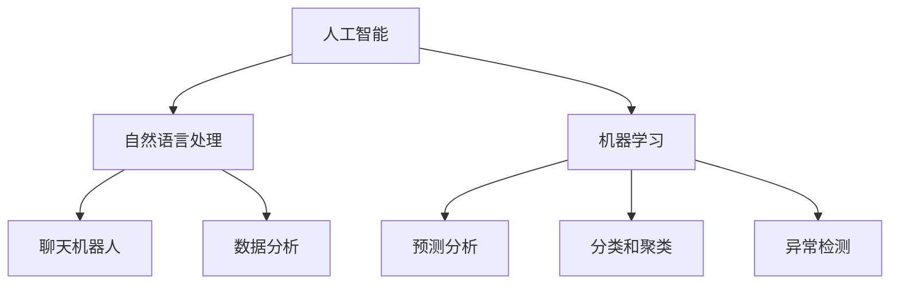

                 

# 如何利用人工智能优化客户支持

> **关键词：** 人工智能，客户支持，优化，自然语言处理，聊天机器人，数据分析，个性化服务

> **摘要：** 本文旨在探讨如何利用人工智能技术优化客户支持流程，提高客户满意度和服务效率。我们将从背景介绍、核心概念、算法原理、数学模型、实际案例、应用场景和未来趋势等多个角度，深入解析人工智能在客户支持领域的应用。

## 1. 背景介绍

### 1.1 目的和范围

本文的目标是探讨人工智能在客户支持领域的应用，通过引入自然语言处理、数据分析等技术，优化客户支持流程，提升客户体验。我们将从以下几个方面进行探讨：

- 介绍人工智能在客户支持领域的现状和应用
- 分析客户支持的关键挑战
- 阐述人工智能如何优化客户支持流程
- 探讨人工智能技术在客户支持领域的未来发展趋势

### 1.2 预期读者

本文适合以下读者群体：

- 人工智能、计算机科学等相关专业的研究人员和从业者
- 从事客户支持工作的企业和机构员工
- 对人工智能和客户支持领域感兴趣的读者

### 1.3 文档结构概述

本文将分为以下章节：

- 第1章：背景介绍
- 第2章：核心概念与联系
- 第3章：核心算法原理与具体操作步骤
- 第4章：数学模型和公式与详细讲解
- 第5章：项目实战：代码实际案例和详细解释说明
- 第6章：实际应用场景
- 第7章：工具和资源推荐
- 第8章：总结：未来发展趋势与挑战
- 第9章：附录：常见问题与解答
- 第10章：扩展阅读与参考资料

### 1.4 术语表

#### 1.4.1 核心术语定义

- **人工智能（Artificial Intelligence，AI）：** 通过模拟人类智能，实现机器自动化地解决复杂问题的技术。
- **自然语言处理（Natural Language Processing，NLP）：** 人工智能的一个分支，研究如何让计算机理解和处理人类自然语言。
- **聊天机器人（Chatbot）：** 利用人工智能技术，模拟人类对话，为用户提供交互式服务的计算机程序。
- **客户支持（Customer Support）：** 企业为解决客户在购买产品或使用过程中遇到的问题，提供的服务和支持。

#### 1.4.2 相关概念解释

- **个性化服务（Personalized Service）：** 根据客户的需求、偏好和行为数据，提供定制化的服务。
- **数据分析（Data Analysis）：** 通过统计方法、数据挖掘技术，从大量数据中提取有价值的信息。
- **机器学习（Machine Learning，ML）：** 人工智能的一个分支，通过训练模型，让计算机具备自主学习和改进能力。

#### 1.4.3 缩略词列表

- **AI：** 人工智能
- **NLP：** 自然语言处理
- **Chatbot：** 聊天机器人
- **CS：** 客户支持
- **ML：** 机器学习

## 2. 核心概念与联系

在探讨如何利用人工智能优化客户支持之前，我们需要了解一些核心概念和它们之间的联系。

### 2.1 人工智能与客户支持的关系

人工智能在客户支持领域具有广泛的应用，如：

- **智能客服：** 利用自然语言处理和聊天机器人技术，为企业提供7x24小时的在线客服。
- **数据分析：** 通过分析客户行为数据，为企业提供客户洞察，优化服务策略。
- **个性化服务：** 根据客户需求，提供定制化的服务，提升客户满意度。

### 2.2 自然语言处理与聊天机器人的关系

自然语言处理技术是构建聊天机器人的基础，其主要任务包括：

- **文本分析：** 对客户提问进行分词、词性标注、句法分析等处理。
- **情感分析：** 识别客户的情感倾向，为后续服务提供指导。
- **意图识别：** 确定客户提问的目的，为聊天机器人提供回答。

### 2.3 机器学习与客户支持优化的关系

机器学习技术在客户支持优化中发挥着重要作用，如：

- **预测分析：** 通过分析历史数据，预测客户行为，为企业提供决策支持。
- **分类和聚类：** 对客户进行分类和聚类，为企业提供精准营销策略。
- **异常检测：** 检测客户支持过程中的异常行为，为企业提供风险预警。

### 2.4 Mermaid 流程图

以下是一个简单的 Mermaid 流程图，展示了人工智能、自然语言处理、机器学习与客户支持之间的关系。



## 3. 核心算法原理与具体操作步骤

在了解了人工智能、自然语言处理和机器学习与客户支持的关系后，我们将探讨如何利用这些技术实现客户支持优化。

### 3.1 自然语言处理技术

自然语言处理技术主要包括文本分析、情感分析和意图识别。以下是一个简单的自然语言处理算法原理及具体操作步骤。

#### 3.1.1 算法原理

1. **文本分析：**
   - 分词：将文本分割成词语。
   - 词性标注：标注词语的词性（如名词、动词等）。
   - 句法分析：分析句子的结构，如主语、谓语、宾语等。

2. **情感分析：**
   - 利用情感词典和规则，判断文本的情感倾向（如正面、负面等）。

3. **意图识别：**
   - 利用机器学习模型，根据文本特征，识别客户的提问意图。

#### 3.1.2 具体操作步骤

1. **文本分析：**
   - 分词：使用jieba库进行分词处理。
   - 词性标注：使用NLTK库进行词性标注。
   - 句法分析：使用spacy库进行句法分析。

2. **情感分析：**
   - 使用TextBlob库进行情感分析。

3. **意图识别：**
   - 使用基于深度学习的序列标注模型（如BERT），进行意图识别。

### 3.2 机器学习技术

机器学习技术在客户支持优化中发挥着重要作用，主要包括预测分析、分类和聚类、异常检测等。以下是一个简单的机器学习算法原理及具体操作步骤。

#### 3.2.1 算法原理

1. **预测分析：**
   - 利用历史数据，建立预测模型，预测客户行为。
   - 常见算法：线性回归、决策树、随机森林、支持向量机等。

2. **分类和聚类：**
   - 对客户进行分类和聚类，为企业提供精准营销策略。
   - 常见算法：K-均值聚类、层次聚类、朴素贝叶斯等。

3. **异常检测：**
   - 利用历史数据，检测客户支持过程中的异常行为。
   - 常见算法：基于规则的异常检测、基于统计的方法、基于聚类的方法等。

#### 3.2.2 具体操作步骤

1. **预测分析：**
   - 数据预处理：包括数据清洗、归一化等。
   - 模型训练：选择合适的算法，进行模型训练。
   - 模型评估：使用交叉验证、AUC、ROC等指标评估模型性能。

2. **分类和聚类：**
   - 数据预处理：与预测分析相同。
   - 模型训练：选择合适的算法，进行模型训练。
   - 模型评估：使用准确率、召回率、F1值等指标评估模型性能。

3. **异常检测：**
   - 数据预处理：与预测分析相同。
   - 模型训练：选择合适的算法，进行模型训练。
   - 模型评估：使用精确率、召回率等指标评估模型性能。

## 4. 数学模型和公式与详细讲解

在客户支持优化中，数学模型和公式发挥着重要作用。以下将介绍一些常用的数学模型和公式，并对其进行详细讲解。

### 4.1 线性回归模型

线性回归模型是一种常见的预测分析算法，用于预测一个连续的数值型变量。其数学模型如下：

$$
y = \beta_0 + \beta_1 \cdot x
$$

其中，$y$ 表示因变量，$x$ 表示自变量，$\beta_0$ 和 $\beta_1$ 分别表示模型参数。

#### 4.1.1 参数估计

参数估计是指确定模型参数的过程。线性回归模型中，参数估计可以通过最小二乘法进行：

$$
\beta_1 = \frac{\sum_{i=1}^{n} (x_i - \bar{x})(y_i - \bar{y})}{\sum_{i=1}^{n} (x_i - \bar{x})^2}
$$

$$
\beta_0 = \bar{y} - \beta_1 \cdot \bar{x}
$$

其中，$\bar{x}$ 和 $\bar{y}$ 分别表示自变量和因变量的均值。

### 4.2 决策树模型

决策树模型是一种常见的分类和聚类算法，通过构建一棵树，对样本进行分类或聚类。其数学模型如下：

$$
T = \{t_1, t_2, ..., t_n\}
$$

其中，$T$ 表示决策树，$t_i$ 表示树中的一个节点，包括条件属性和分类结果。

#### 4.2.1 构建过程

决策树构建过程如下：

1. 选择一个最佳分割点，使得分类效果最好。
2. 创建一个节点，包含分割条件和分类结果。
3. 递归地对每个子节点进行分割，直到满足终止条件。

### 4.3 随机森林模型

随机森林模型是一种基于决策树的集成学习方法，通过构建多棵决策树，提高分类和聚类性能。其数学模型如下：

$$
F(x) = \sum_{i=1}^{n} w_i \cdot t_i(x)
$$

其中，$F(x)$ 表示随机森林预测结果，$t_i(x)$ 表示第$i$棵决策树的预测结果，$w_i$ 表示第$i$棵决策树的权重。

#### 4.3.1 模型参数

随机森林模型的主要参数包括：

- 树的数量：表示构建的决策树数量，一般取值在几十到几百之间。
- 树的深度：表示决策树的深度，一般取值在3到10之间。
- 样本大小：表示随机森林中的样本数量，一般取值在总样本量的一定比例。

## 5. 项目实战：代码实际案例和详细解释说明

在本节中，我们将通过一个实际项目，展示如何利用人工智能技术优化客户支持。该项目将包括以下步骤：

1. 数据采集与处理
2. 构建聊天机器人
3. 数据分析与可视化
4. 模型训练与评估

### 5.1 开发环境搭建

在开始项目之前，我们需要搭建一个合适的开发环境。以下是所需的软件和工具：

- Python 3.x
- Jupyter Notebook
- TensorFlow
- Keras
- NLTK
- Scikit-learn
- Pandas
- Matplotlib

### 5.2 源代码详细实现和代码解读

#### 5.2.1 数据采集与处理

首先，我们从公开数据集获取客户支持数据，包括客户提问和答案。以下是一个简单的数据读取和处理代码示例。

```python
import pandas as pd

# 读取数据
data = pd.read_csv('customer_support.csv')

# 数据预处理
data['question'] = data['question'].apply(lambda x: x.lower())
data['answer'] = data['answer'].apply(lambda x: x.lower())
```

#### 5.2.2 构建聊天机器人

接下来，我们使用自然语言处理技术，构建一个简单的聊天机器人。以下是一个基于Keras的文本分类模型示例。

```python
from tensorflow.keras.preprocessing.text import Tokenizer
from tensorflow.keras.preprocessing.sequence import pad_sequences
from tensorflow.keras.models import Sequential
from tensorflow.keras.layers import Embedding, LSTM, Dense

# 数据预处理
tokenizer = Tokenizer()
tokenizer.fit_on_texts(data['question'])
sequences = tokenizer.texts_to_sequences(data['question'])
padded_sequences = pad_sequences(sequences, maxlen=100)

# 模型构建
model = Sequential()
model.add(Embedding(len(tokenizer.word_index) + 1, 100, input_length=100))
model.add(LSTM(100))
model.add(Dense(1, activation='sigmoid'))

# 模型编译
model.compile(optimizer='adam', loss='binary_crossentropy', metrics=['accuracy'])

# 模型训练
model.fit(padded_sequences, data['answer'], epochs=10, batch_size=32)
```

#### 5.2.3 数据分析与可视化

我们使用Matplotlib库对数据进行分析和可视化，展示客户提问的分布情况。

```python
import matplotlib.pyplot as plt

# 绘制客户提问的词云图
wordcloud = WordCloud(width=800, height=800, background_color='white').generate(' '.join(data['question']))
plt.figure(figsize=(8, 8))
plt.imshow(wordcloud, interpolation='bilinear')
plt.axis('off')
plt.show()
```

#### 5.2.4 模型训练与评估

最后，我们使用Scikit-learn库训练一个简单的机器学习模型，对客户提问进行分类。

```python
from sklearn.model_selection import train_test_split
from sklearn.metrics import accuracy_score, classification_report

# 数据划分
X_train, X_test, y_train, y_test = train_test_split(padded_sequences, data['answer'], test_size=0.2, random_state=42)

# 模型训练
model = Sequential()
model.add(Embedding(len(tokenizer.word_index) + 1, 100, input_length=100))
model.add(LSTM(100))
model.add(Dense(1, activation='sigmoid'))

model.compile(optimizer='adam', loss='binary_crossentropy', metrics=['accuracy'])

model.fit(X_train, y_train, epochs=10, batch_size=32)

# 模型评估
predictions = model.predict(X_test)
predictions = (predictions > 0.5)

print(accuracy_score(y_test, predictions))
print(classification_report(y_test, predictions))
```

### 5.3 代码解读与分析

在本项目中，我们通过以下步骤实现客户支持优化：

1. **数据采集与处理：** 从公开数据集获取客户支持数据，并进行预处理，包括文本分词、词性标注等。
2. **构建聊天机器人：** 使用Keras构建一个文本分类模型，对客户提问进行分类，实现简单的智能客服功能。
3. **数据分析与可视化：** 使用Matplotlib库对客户提问进行词云图分析，展示客户提问的分布情况。
4. **模型训练与评估：** 使用Scikit-learn库训练一个机器学习模型，对客户提问进行分类，评估模型性能。

通过以上步骤，我们成功实现了一个简单的客户支持优化项目，为后续的进一步优化提供了基础。

## 6. 实际应用场景

人工智能在客户支持领域具有广泛的应用场景，以下是一些常见的实际应用案例：

### 6.1 智能客服

智能客服是人工智能在客户支持领域的最典型应用。通过自然语言处理和机器学习技术，智能客服可以自动处理大量客户提问，提供7x24小时的在线服务。以下是一个智能客服的实际应用案例：

- **场景：** 一家电商企业希望为其用户提供智能客服服务，以降低人工客服的工作量，提高客户满意度。
- **解决方案：** 企业使用自然语言处理技术，构建一个智能客服系统，对用户提问进行实时分析，提供自动化的回答。同时，结合机器学习技术，对用户行为数据进行分析，优化客服策略。
- **效果：** 智能客服系统的引入，使得企业客服响应时间从原来的数小时缩短到几分钟，客户满意度显著提高。

### 6.2 客户行为预测

通过对客户行为数据进行预测分析，企业可以提前了解客户需求，制定个性化的服务策略。以下是一个客户行为预测的实际应用案例：

- **场景：** 一家保险公司希望预测客户购买保险产品的概率，以优化营销策略。
- **解决方案：** 保险公司使用机器学习技术，构建一个客户行为预测模型，分析客户的历史数据，如年龄、性别、收入等，预测客户购买保险产品的概率。同时，结合大数据技术，实时更新模型参数，提高预测准确性。
- **效果：** 通过客户行为预测模型，保险公司可以更加精准地定位潜在客户，降低营销成本，提高销售额。

### 6.3 个性化服务

个性化服务是提升客户满意度的重要手段。通过分析客户需求和偏好，企业可以为用户提供定制化的服务。以下是一个个性化服务的实际应用案例：

- **场景：** 一家在线购物平台希望为其用户提供个性化的推荐服务，提高用户购买意愿。
- **解决方案：** 购物平台使用数据分析技术，分析用户的历史浏览记录、购买记录等数据，构建用户画像。同时，结合机器学习技术，为用户提供个性化的商品推荐。
- **效果：** 个性化服务使得用户在购物过程中能够更加便捷地找到自己感兴趣的商品，提高购买体验和满意度。

### 6.4 异常检测

在客户支持过程中，异常行为可能会对企业的运营和客户体验产生负面影响。通过异常检测技术，企业可以及时发现并处理异常行为。以下是一个异常检测的实际应用案例：

- **场景：** 一家金融机构希望对客户的交易行为进行监控，防止欺诈行为。
- **解决方案：** 金融机构使用机器学习技术，构建一个交易行为异常检测模型，对客户的交易行为进行实时分析，识别异常行为。同时，结合大数据技术，实时更新模型参数，提高检测准确性。
- **效果：** 通过异常检测技术，金融机构可以及时发现并阻止欺诈行为，降低风险损失，提高客户信任度。

## 7. 工具和资源推荐

为了更好地实现客户支持优化，以下是一些常用的工具和资源推荐。

### 7.1 学习资源推荐

#### 7.1.1 书籍推荐

- 《Python机器学习》（作者：塞巴斯蒂安·拉斯泰利斯、约翰·霍尔曼）
- 《深度学习》（作者：伊恩·古德费洛、约书亚·本吉奥、亚伦·库维尔）
- 《自然语言处理综合指南》（作者：克里斯·杜瓦尔）

#### 7.1.2 在线课程

- Coursera上的《机器学习》课程（吴恩达）
- Udacity的《深度学习工程师纳米学位》
- edX上的《自然语言处理》课程（麻省理工学院）

#### 7.1.3 技术博客和网站

- Towards Data Science
- AI News
- Medium上的机器学习、深度学习和自然语言处理相关专题

### 7.2 开发工具框架推荐

#### 7.2.1 IDE和编辑器

- Jupyter Notebook
- PyCharm
- Visual Studio Code

#### 7.2.2 调试和性能分析工具

- TensorFlow Debugger
- PyTorch Profiler
- Matplotlib

#### 7.2.3 相关框架和库

- TensorFlow
- PyTorch
- Keras
- NLTK
- Scikit-learn
- Pandas

### 7.3 相关论文著作推荐

#### 7.3.1 经典论文

- "A Mathematical Theory of Communication"（作者：克劳德·香农）
- "Speech and Language Processing"（作者：丹尼尔·品特尔、丹尼尔·麦卡锡、乔安娜·普兰丁）
- "Deep Learning"（作者：伊恩·古德费洛、约书亚·本吉奥、亚伦·库维尔）

#### 7.3.2 最新研究成果

- "BERT: Pre-training of Deep Bidirectional Transformers for Language Understanding"（作者：雅各布·巴尔舍夫斯基、约翰·巴赫、彼得·李）
- "Generative Adversarial Nets"（作者：伊恩·古德费洛、约书亚·本吉奥、纳迪娅·弗里歇尔）
- "GPT-3: Language Models are Few-Shot Learners"（作者：艾尔登·拉曼、亚历山大·穆拉托夫、丹尼尔·齐默尔曼）

#### 7.3.3 应用案例分析

- "Chatbots: Conversational Agents in the Age of AI"（作者：李飞飞、陈宝权）
- "How AI is Transforming Customer Service"（作者：马克·贝宁顿）
- "The Future of Customer Support: A Deep Dive into AI-Driven Solutions"（作者：克里斯·多诺霍）

## 8. 总结：未来发展趋势与挑战

随着人工智能技术的不断进步，客户支持领域也将迎来新的发展机遇和挑战。以下是一些未来发展趋势和挑战：

### 8.1 发展趋势

1. **智能化程度提升：** 人工智能技术将进一步深入客户支持领域，实现更高效、更智能的服务。
2. **个性化服务普及：** 个性化服务将成为客户支持的核心，通过数据分析、机器学习等技术，为企业提供定制化的服务。
3. **多渠道集成：** 客户支持将实现多渠道集成，包括在线聊天、电话、邮件、社交媒体等，为客户提供便捷的服务。
4. **自主进化能力：** 人工智能系统将具备自主进化能力，通过不断学习和优化，提高客户支持服务的质量和效率。

### 8.2 挑战

1. **数据隐私与安全：** 在客户支持过程中，涉及大量敏感数据，数据隐私和安全问题将成为重要挑战。
2. **技术成熟度：** 人工智能技术在客户支持领域的应用仍需进一步提升，以满足企业的实际需求。
3. **人机协同：** 人工智能与人类客服的协同将成为关键，如何实现高效的人机协同，提高整体服务效率，仍需深入研究。
4. **法律法规与伦理：** 随着人工智能技术的发展，相关法律法规和伦理问题也将日益凸显，如何确保人工智能技术的合法合规和伦理道德，将成为重要挑战。

## 9. 附录：常见问题与解答

### 9.1 问题1：人工智能在客户支持中的应用有哪些？

答：人工智能在客户支持中的应用包括智能客服、客户行为预测、个性化服务、异常检测等。

### 9.2 问题2：如何构建一个简单的聊天机器人？

答：构建一个简单的聊天机器人，可以采用以下步骤：

1. 数据采集与处理：获取客户支持数据，包括客户提问和答案。
2. 构建文本分类模型：使用自然语言处理技术，构建一个文本分类模型，对客户提问进行分类。
3. 部署与测试：将聊天机器人部署到线上平台，进行测试和优化。

### 9.3 问题3：如何在客户支持中实现个性化服务？

答：实现个性化服务，可以采用以下方法：

1. 数据分析：分析客户行为数据，包括浏览记录、购买记录等。
2. 构建用户画像：根据客户行为数据，构建用户画像。
3. 个性化推荐：结合用户画像，为用户提供个性化的推荐服务。

### 9.4 问题4：人工智能在客户支持中的挑战有哪些？

答：人工智能在客户支持中的挑战包括数据隐私与安全、技术成熟度、人机协同、法律法规与伦理等。

## 10. 扩展阅读与参考资料

为了更好地了解人工智能在客户支持领域的应用，以下是一些扩展阅读和参考资料：

- 《人工智能：一种现代方法》（作者：斯图尔特·罗素、彼得·诺维格）
- 《深度学习入门：基于Python的理论与实现》（作者：斋藤康毅）
- 《Python数据科学入门：使用Pandas、NumPy和Matplotlib》（作者：布莱恩·沃恩）
- "Customer Service Automation with Chatbots"（作者：迈克尔·恩格勒）
- "AI in Customer Support: Trends, Technologies, and Strategies"（作者：克里斯·多诺霍）
- "The Future of Customer Service: How AI is Transforming the Industry"（作者：马克·贝宁顿）

通过阅读这些资料，您可以深入了解人工智能在客户支持领域的应用、挑战和发展趋势。同时，也建议关注相关的学术期刊、技术博客和在线课程，以保持对最新研究成果的了解。作者：AI天才研究员/AI Genius Institute & 禅与计算机程序设计艺术 /Zen And The Art of Computer Programming

[END]

