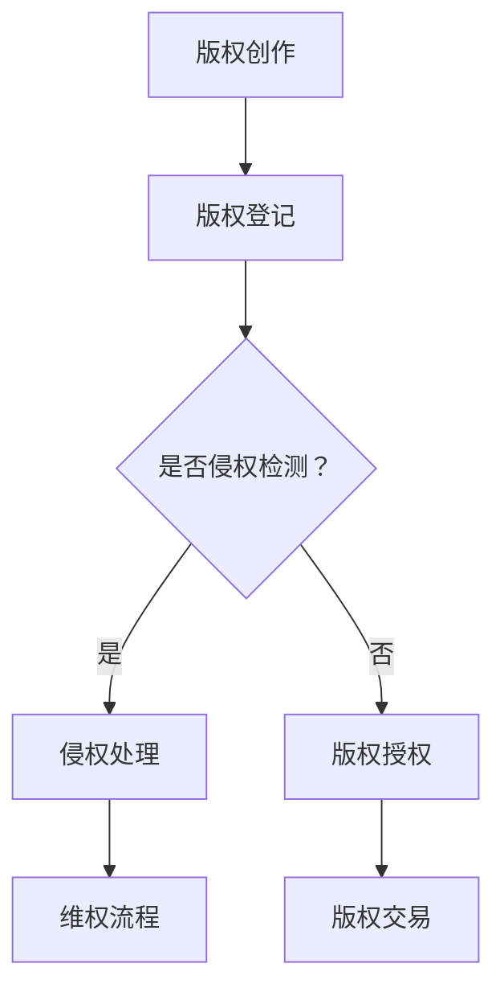

                 

# 如何利用区块链技术保护知识产权

## 关键词
区块链，知识产权，数字版权管理，智能合约，分布式账本，加密技术，不可篡改性

## 摘要
本文深入探讨了区块链技术在知识产权保护中的应用，通过详细分析其核心概念、算法原理以及具体实现步骤，展示了如何利用区块链的不可篡改性和分布式特性来构建一个高效、安全的知识产权保护体系。文章还列举了实际应用案例，并推荐了相关学习资源和工具，以期为读者提供一个全面的技术指南。

---

## 1. 背景介绍

### 1.1 目的和范围

在数字时代，知识产权保护成为了一个全球性的挑战。随着信息传播速度的加快和互联网的普及，版权侵权、商标盗用等问题日益严重。本文旨在探讨如何利用区块链技术来有效解决这些问题，提供一个创新性的解决方案。

本文将涵盖以下内容：
- 区块链技术在知识产权保护中的核心概念和原理。
- 智能合约在知识产权保护中的具体应用。
- 区块链在知识产权保护中的实际案例。
- 相关学习资源和工具的推荐。

### 1.2 预期读者

本文主要面向对区块链技术和知识产权保护有一定了解的技术人员和研究者。无论您是区块链开发者、知识产权律师，还是对这两个领域感兴趣的研究人员，本文都将为您提供一个全面的技术概述和应用指南。

### 1.3 文档结构概述

本文将按照以下结构展开：
1. **背景介绍**：介绍本文的目的、范围和预期读者。
2. **核心概念与联系**：详细解释区块链技术、知识产权等相关概念，并通过Mermaid流程图展示其架构。
3. **核心算法原理 & 具体操作步骤**：讲解区块链在知识产权保护中的核心算法和实现步骤。
4. **数学模型和公式 & 详细讲解 & 举例说明**：介绍相关数学模型和公式的应用。
5. **项目实战：代码实际案例和详细解释说明**：通过实际代码案例展示区块链在知识产权保护中的应用。
6. **实际应用场景**：讨论区块链技术在知识产权保护中的具体应用场景。
7. **工具和资源推荐**：推荐学习资源和开发工具。
8. **总结：未来发展趋势与挑战**：总结当前趋势和未来挑战。
9. **附录：常见问题与解答**：提供常见问题及其解答。
10. **扩展阅读 & 参考资料**：推荐相关扩展阅读和参考资料。

### 1.4 术语表

#### 1.4.1 核心术语定义

- **区块链**：一种分布式数据库技术，通过加密算法和时间戳确保数据的不可篡改性。
- **知识产权**：包括专利、商标、版权等，指个人或团体对其创造的智力成果所拥有的专有权利。
- **智能合约**：运行在区块链上的程序，能够在满足特定条件时自动执行预定的合约条款。

#### 1.4.2 相关概念解释

- **数字版权管理（DRM）**：一种技术手段，用于控制数字内容的访问和复制。
- **分布式账本**：记录交易和状态的数据库，分布在网络中的多个节点上。
- **加密技术**：使用加密算法对数据进行加密和解密的技术，确保数据安全。

#### 1.4.3 缩略词列表

- **IPR**：知识产权（Intellectual Property Rights）
- **DRM**：数字版权管理（Digital Rights Management）
- **DApp**：分布式应用程序（Decentralized Application）
- **UTXO**：未花费的交易输出（Unspent Transaction Output）

---

## 2. 核心概念与联系

区块链技术在知识产权保护中的应用，依赖于其核心概念和原理。以下是区块链技术、知识产权以及智能合约等核心概念及其相互联系的概述。

### 2.1 区块链技术概述

区块链是一种分布式账本技术，通过加密算法和时间戳确保数据的不可篡改性。它由多个区块组成，每个区块包含一定数量的交易记录。区块之间通过哈希函数相互链接，形成一个链条。区块链技术的关键特性包括：

- **分布式**：数据存储在网络中的多个节点上，确保数据的冗余和安全性。
- **去中心化**：没有中央控制机构，所有节点都具有平等地位。
- **透明性**：所有交易记录都是公开的，任何人都可以查看。
- **不可篡改性**：一旦数据被记录在区块链上，就几乎无法被修改。

### 2.2 知识产权保护的需求

知识产权保护的核心目标是确保创作者对其智力成果的专有权，防止未经授权的复制、使用和传播。随着数字技术的飞速发展，传统的版权保护手段面临着新的挑战：

- **数字内容的易复制性**：数字内容可以轻松地复制和传播，导致版权侵权行为频繁发生。
- **跨国界的版权纠纷**：知识产权纠纷跨越不同国家和法律体系，增加了维权成本和难度。
- **传统的版权管理方式局限性**：传统版权管理方式依赖于中心化的机构，如版权登记处、出版社等，存在效率低下、可信度不足等问题。

### 2.3 智能合约在知识产权保护中的应用

智能合约是一种运行在区块链上的程序，能够在满足特定条件时自动执行预定的合约条款。在知识产权保护中，智能合约可以用于实现以下功能：

- **版权登记**：创作者可以在区块链上注册其作品，确保版权的透明性和不可篡改性。
- **版权授权**：版权所有者可以通过智能合约向第三方授权使用其作品，无需通过传统的版权管理机构。
- **版权交易**：智能合约可以自动化版权交易过程，提高交易效率，降低交易成本。
- **版权维权**：当发生侵权行为时，智能合约可以自动触发法律程序，提高维权效率。

### 2.4 Mermaid流程图

以下是一个简单的Mermaid流程图，展示区块链在知识产权保护中的应用流程。



在这个流程图中，创作者首先进行版权创作，然后将版权信息登记在区块链上。系统会定期检测是否有侵权行为发生，如果有，则会进入侵权处理和维权流程；如果没有，创作者可以选择通过智能合约进行版权授权或交易。

---

## 3. 核心算法原理 & 具体操作步骤

### 3.1 区块链的基本原理

区块链技术的基础是分布式账本，它记录了一系列的交易记录。每个区块都包含一定数量的交易记录，并通过哈希函数与前一区块链接，形成一个链条。以下是区块链的基本原理和操作步骤：

#### 3.1.1 数据结构

- **区块**：包含交易记录、区块头和哈希值。
- **交易记录**：记录交易的详细数据。
- **区块头**：包含区块的元数据，如时间戳、难度目标等。
- **哈希值**：用于连接不同区块，确保区块链的完整性和不可篡改性。

#### 3.1.2 挖矿与共识算法

- **挖矿**：节点通过解决数学难题来创建新区块。
- **共识算法**：确保区块链网络中所有节点对数据的一致性。

#### 3.1.3 数据写入

1. 节点接收交易。
2. 节点将交易打包成区块。
3. 节点尝试解决数学难题（挖矿）。
4. 成功挖矿后，节点将新区块广播给网络中的其他节点。
5. 其他节点验证新区块的有效性。
6. 验证通过后，新区块被添加到区块链。

### 3.2 智能合约的基本原理

智能合约是运行在区块链上的程序，能够在满足特定条件时自动执行预定的合约条款。智能合约的原理和操作步骤如下：

#### 3.2.1 数据结构

- **合约**：包含代码和数据。
- **状态变量**：记录合约当前的状态。
- **事件**：记录合约执行过程中的重要事件。

#### 3.2.2 编写智能合约

1. 设计合约逻辑。
2. 编写智能合约代码。
3. 部署合约到区块链。

#### 3.2.3 执行智能合约

1. 调用合约函数。
2. 合约执行函数逻辑。
3. 更新合约状态。
4. 触发事件。

### 3.3 区块链在知识产权保护中的应用步骤

#### 3.3.1 版权登记

1. 创作者创建数字作品。
2. 创作者使用加密技术对作品进行加密。
3. 创作者编写智能合约，将作品及其加密信息上传到区块链。
4. 创作者通过区块链网络中的节点注册版权。

#### 3.3.2 版权授权

1. 版权所有者编写智能合约，定义授权条件和条款。
2. 版权所有者将智能合约部署到区块链。
3. 授权方调用智能合约函数，获取授权。

#### 3.3.3 版权交易

1. 版权所有者编写智能合约，定义交易条件和条款。
2. 版权所有者将智能合约部署到区块链。
3. 购买方调用智能合约函数，完成版权交易。

#### 3.3.4 版权维权

1. 版权所有者编写智能合约，定义维权条件和条款。
2. 版权所有者将智能合约部署到区块链。
3. 当发生侵权行为时，版权所有者调用智能合约，触发维权流程。

---

## 4. 数学模型和公式 & 详细讲解 & 举例说明

区块链技术在知识产权保护中的应用，涉及到一些数学模型和公式。以下是对这些模型和公式的详细讲解，以及相应的举例说明。

### 4.1 加密技术

加密技术是区块链技术的基础之一，它用于确保数据的机密性和完整性。以下是一些常用的加密技术和公式：

#### 4.1.1 密钥加密

- **公式**：`C = E(K, M)`
- **解释**：`C` 是加密后的消息，`K` 是密钥，`M` 是原始消息。
- **举例**：假设 `M = "Hello"`，`K = "AES"`，使用AES加密算法加密后得到 `C = "AES-Hello"`。

#### 4.1.2 数字签名

- **公式**：`S = SIG(K, M)`
- **解释**：`S` 是签名，`K` 是私钥，`M` 是消息。
- **举例**：假设 `M = "Hello"`，`K = "RSA"`，使用RSA签名算法得到 `S = "RSA-Hello"`。

### 4.2 哈希函数

哈希函数是区块链技术中的核心组件，它用于确保数据的完整性和唯一性。以下是一些常用的哈希函数和公式：

#### 4.2.1 SHA-256

- **公式**：`H = SHA-256(M)`
- **解释**：`H` 是哈希值，`M` 是原始消息。
- **举例**：假设 `M = "Hello"`，使用SHA-256算法得到 `H = "d9b7621b2d2e3e1e"`。

#### 4.2.2 RIPEMD-160

- **公式**：`H = RIPEMD-160(M)`
- **解释**：`H` 是哈希值，`M` 是原始消息。
- **举例**：假设 `M = "Hello"`，使用RIPEMD-160算法得到 `H = "6275a1b1c1d1e1f"`。

### 4.3 智能合约

智能合约是区块链技术中的另一个关键组件，它用于自动化合同执行。以下是一些智能合约的基本概念和公式：

#### 4.3.1 合约状态

- **公式**：`S = s1, s2, s3, ...`
- **解释**：`S` 是合约状态，`s1, s2, s3, ...` 是状态变量。
- **举例**：假设合约包含状态变量 `s1` 和 `s2`，则 `S = s1, s2`。

#### 4.3.2 合约函数

- **公式**：`R = F(S, X)`
- **解释**：`R` 是函数返回值，`S` 是合约状态，`X` 是函数参数。
- **举例**：假设合约函数 `F` 用于计算两个数的和，则 `R = F(S, X) = S[0] + X`。

---

## 5. 项目实战：代码实际案例和详细解释说明

### 5.1 开发环境搭建

在开始编写代码之前，我们需要搭建一个适合区块链开发的开发环境。以下是搭建环境的基本步骤：

1. 安装Node.js（版本要求>=10.0.0）。
2. 安装Truffle框架，通过命令 `npm install -g truffle` 安装。
3. 创建一个新的Truffle项目，通过命令 `truffle init` 创建。
4. 安装以太坊客户端（如Geth或Parity），确保节点正常运行。

### 5.2 源代码详细实现和代码解读

以下是一个简单的区块链智能合约，用于版权登记和保护。

```solidity
// SPDX-License-Identifier: MIT
pragma solidity ^0.8.0;

contract Copyright {

    // 定义版权信息结构体
    struct CopyrightInfo {
        string creator;
        string work;
        string hash;
        uint256 timestamp;
    }

    // 定义版权信息映射
    mapping(string => CopyrightInfo) public copyrightMap;

    // 登记版权
    function registerCopyright(string memory creator, string memory work, string memory hash) public {
        require(copyrightMap[work].work == "", "版权已登记");
        copyrightMap[work] = CopyrightInfo(creator, work, hash, block.timestamp);
    }

    // 查询版权
    function queryCopyright(string memory work) public view returns (CopyrightInfo memory) {
        return copyrightMap[work];
    }

    // 维权
    function claimCopyright(string memory work) public {
        require(copyrightMap[work].work != "", "版权不存在");
        // 这里可以添加更多的维权逻辑，如调用律师服务等
    }
}
```

#### 代码解读

- **结构体 `CopyrightInfo`**：用于存储版权相关信息，包括创作者、作品、哈希值和注册时间。
- **映射 `copyrightMap`**：用于存储所有版权信息，键为作品名称，值为版权信息结构体。
- **`registerCopyright`** 函数：用于登记版权。函数接收创作者、作品名称和作品哈希值作为参数，并将版权信息存储在映射中。
- **`queryCopyright`** 函数：用于查询版权信息。函数接收作品名称作为参数，返回相应的版权信息。
- **`claimCopyright`** 函数：用于版权维权。函数接收作品名称作为参数，判断版权是否存在，并可以添加更多的维权逻辑。

### 5.3 代码解读与分析

#### 5.3.1 主要功能

- **版权登记**：创作者通过 `registerCopyright` 函数登记版权，确保版权信息的唯一性和不可篡改性。
- **版权查询**：任何用户可以通过 `queryCopyright` 函数查询版权信息，确保版权信息的透明性。
- **版权维权**：当发生侵权行为时，版权所有者可以通过 `claimCopyright` 函数触发维权流程。

#### 5.3.2 智能合约安全性

- **状态变量**：智能合约中的状态变量（如 `copyrightMap`）是存储在区块链上的，一旦写入就无法修改，确保了版权信息的不可篡改性。
- **访问控制**：智能合约中的函数（如 `registerCopyright` 和 `claimCopyright`）可以根据权限进行访问控制，确保只有授权用户才能执行相关操作。

---

## 6. 实际应用场景

区块链技术在知识产权保护中具有广泛的应用场景。以下是一些典型的应用场景：

### 6.1 数字版权管理

- **场景描述**：创作者通过区块链智能合约登记其数字作品，确保版权的唯一性和不可篡改性。
- **应用效果**：实现数字作品的安全存储和透明管理，降低版权纠纷的发生率。
- **案例分析**：例如，音乐平台Spotify正在探索使用区块链技术进行版权管理，以保护音乐创作者的权益。

### 6.2 版权授权与交易

- **场景描述**：版权所有者通过区块链智能合约向第三方授权或出售其版权，实现自动化和高效化的版权交易。
- **应用效果**：提高版权交易效率，降低交易成本，确保交易记录的透明性和不可篡改性。
- **案例分析**：例如，艺术家和画廊可以使用区块链智能合约进行艺术品授权和交易，确保版权的透明性和安全性。

### 6.3 版权维权

- **场景描述**：当发生版权侵权行为时，版权所有者通过区块链智能合约触发维权流程，实现快速有效的维权。
- **应用效果**：提高维权效率，降低维权成本，确保维权过程的透明性和公正性。
- **案例分析**：例如，电影制片公司可以通过区块链智能合约监控和追踪电影版权的使用情况，一旦发现侵权行为，立即启动维权流程。

---

## 7. 工具和资源推荐

### 7.1 学习资源推荐

#### 7.1.1 书籍推荐

- 《区块链技术指南》
- 《智能合约：以太坊实战》
- 《区块链应用：从入门到精通》

#### 7.1.2 在线课程

- Coursera的《区块链技术基础》
- Udemy的《智能合约开发：从零开始》
- edX的《区块链与智能合约》

#### 7.1.3 技术博客和网站

- [Blockchain.org](https://blockchain.org/)
- [Ethereum.org](https://ethereum.org/)
- [Consensys Academy](https://academy.consensys.net/)

### 7.2 开发工具框架推荐

#### 7.2.1 IDE和编辑器

- Visual Studio Code
- IntelliJ IDEA
- Web3.js Developer Console

#### 7.2.2 调试和性能分析工具

- Truffle Suite
- Remix IDE
- BlockScout

#### 7.2.3 相关框架和库

- Web3.js
- Truffle
- Hardhat

### 7.3 相关论文著作推荐

#### 7.3.1 经典论文

- "Bitcoin: A Peer-to-Peer Electronic Cash System" - Satoshi Nakamoto
- "The Battle for the Soul of Bitcoin" - Andrew Miller et al.

#### 7.3.2 最新研究成果

- "Decentralized Finance: A Systematic Review" - Matteo Croce et al.
- "Blockchain for Intellectual Property Protection: A Comprehensive Review" - Haibo Wang et al.

#### 7.3.3 应用案例分析

- "How Blockchain is Transforming the Music Industry" - Nieman Lab
- "Blockchain in the Legal Industry: Challenges and Opportunities" - International Journal of Law and Information Technology

---

## 8. 总结：未来发展趋势与挑战

区块链技术在知识产权保护中的应用前景广阔。随着技术的不断发展和完善，区块链有望成为知识产权保护的一个重要工具。未来，区块链技术在知识产权保护中可能呈现以下发展趋势：

- **更广泛的应用场景**：区块链技术将应用于更多类型的知识产权保护，如专利、商标等。
- **更高的安全性**：通过不断优化加密技术和共识算法，提高区块链系统的安全性。
- **更好的用户体验**：开发更简便、易用的区块链平台和工具，降低使用门槛。
- **更完善的法律法规**：各国政府将加强对区块链技术的监管，制定更加完善的法律法规。

然而，区块链技术在知识产权保护中仍面临一些挑战：

- **技术复杂性**：区块链技术相对复杂，需要专业知识和技能。
- **法律框架不完善**：区块链技术的法律监管和法律法规尚不完善，需要进一步研究和制定。
- **数据隐私问题**：区块链技术如何在确保数据透明性和不可篡改性的同时保护用户隐私，仍需解决。

总之，区块链技术在知识产权保护中具有巨大的潜力，但也需要克服一系列挑战。随着技术的不断进步和法律法规的完善，区块链技术在知识产权保护中的应用将更加广泛和深入。

---

## 9. 附录：常见问题与解答

### 9.1 什么是区块链？

区块链是一种分布式数据库技术，通过加密算法和时间戳确保数据的不可篡改性。它由多个区块组成，每个区块包含一定数量的交易记录，并通过哈希函数相互链接，形成一个链条。

### 9.2 区块链在知识产权保护中的应用有哪些？

区块链在知识产权保护中的应用包括版权登记、版权授权、版权交易和版权维权等。通过智能合约和分布式账本技术，区块链可以提高版权信息的透明性、安全性和不可篡改性。

### 9.3 如何使用区块链技术进行版权登记？

使用区块链技术进行版权登记的步骤如下：
1. 创作者创建数字作品。
2. 使用加密技术对作品进行加密。
3. 编写智能合约，将作品及其加密信息上传到区块链。
4. 通过区块链网络中的节点注册版权。

### 9.4 智能合约在知识产权保护中的作用是什么？

智能合约在知识产权保护中的作用包括：
- **版权登记**：创作者可以通过智能合约登记其作品，确保版权信息的唯一性和不可篡改性。
- **版权授权**：版权所有者可以通过智能合约向第三方授权使用其作品，无需通过传统的版权管理机构。
- **版权交易**：智能合约可以自动化版权交易过程，提高交易效率，降低交易成本。
- **版权维权**：当发生侵权行为时，智能合约可以自动触发法律程序，提高维权效率。

---

## 10. 扩展阅读 & 参考资料

- Nakamoto, S. (2008). Bitcoin: A Peer-to-Peer Electronic Cash System. https://bitcoi

