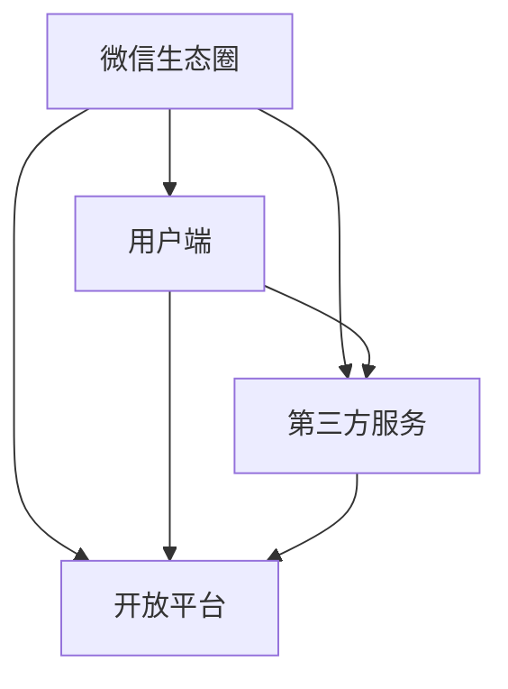

                 

# 如何利用微信生态圈推广创业项目

> 关键词：微信生态圈、创业项目、推广策略、社交媒体营销、社交网络分析、用户行为分析

> 摘要：本文将深入探讨如何利用微信这一庞大且活跃的社交平台，有效推广您的创业项目。通过分析微信生态圈的独特特点，我们将提供一系列策略和具体操作步骤，帮助创业者充分利用微信的社交网络优势，实现项目的成功推广。

## 1. 背景介绍

### 1.1 目的和范围

本文旨在为创业者提供一套系统化的策略，帮助他们在微信生态圈内推广创业项目。我们将探讨微信生态圈的独特优势，分析微信用户的行为特点，并提供一系列可操作的推广方法。文章将涵盖从基础概念到具体实施步骤的全面内容。

### 1.2 预期读者

本文适合以下读者：

- 创业者，特别是那些正在寻找有效推广策略的人。
- 市场营销专业人士，寻求在微信上提升品牌和产品知名度的方法。
- 对社交媒体营销和用户行为分析感兴趣的科技爱好者。

### 1.3 文档结构概述

本文将分为以下部分：

1. 背景介绍：介绍本文的目的、预期读者和文档结构。
2. 核心概念与联系：探讨微信生态圈的基本原理和结构。
3. 核心算法原理 & 具体操作步骤：详细讲解如何利用微信进行项目推广。
4. 数学模型和公式 & 详细讲解 & 举例说明：使用数学模型分析推广效果。
5. 项目实战：提供实际案例，展示如何应用策略。
6. 实际应用场景：探讨微信推广在不同领域的应用。
7. 工具和资源推荐：推荐学习资源和开发工具。
8. 总结：未来发展趋势与挑战。
9. 附录：常见问题与解答。
10. 扩展阅读 & 参考资料。

### 1.4 术语表

#### 1.4.1 核心术语定义

- 微信生态圈：由微信平台及其相关服务组成的一个生态系统。
- 用户行为分析：对微信用户在平台上的行为进行数据收集和分析。
- 社交网络分析：研究社交网络中的关系和互动，以了解用户行为。
- KOL（Key Opinion Leader）：关键意见领袖，在特定领域具有较高影响力和话语权的人。

#### 1.4.2 相关概念解释

- 社交媒体营销：通过社交媒体平台进行品牌推广和市场营销。
- SEO（Search Engine Optimization）：搜索引擎优化，提升网站在搜索引擎中的排名。
- 内容营销：通过创造和分享有价值的内容来吸引和保留目标受众。

#### 1.4.3 缩略词列表

- KOL：Key Opinion Leader
- SEO：Search Engine Optimization
- SNS：Social Networking Service
- CRM：Customer Relationship Management

## 2. 核心概念与联系

微信生态圈是一个庞大而复杂的社交网络平台，涵盖了多种服务和功能。为了更好地理解如何利用这一生态圈推广创业项目，我们需要首先了解其核心概念和结构。

### 2.1 微信生态圈的基本原理

微信生态圈的核心是用户关系网络，包括好友、群聊、公众号等。微信用户之间通过文本、语音、图片、视频等多种方式进行互动，形成了丰富的社交内容。此外，微信还提供了丰富的第三方服务，如支付、购物、游戏等，这些服务与用户日常生活紧密相连，进一步增强了用户的黏性。

### 2.2 微信生态圈的结构

微信生态圈可以分为以下几个部分：

1. 用户端：微信客户端是用户进行社交互动的基础，包括好友关系、群聊、公众号等。
2. 第三方服务：如微信支付、微信小程序、微信电商等，为用户提供便捷的第三方服务。
3. 开放平台：微信开放平台为第三方开发者提供了丰富的接口和工具，使其能够利用微信生态圈进行业务创新。

### 2.3 微信生态圈的独特优势

微信生态圈的独特优势包括：

1. 海量用户：微信拥有超过10亿的活跃用户，这是一个巨大的潜在市场。
2. 强社交性：微信的社交属性使得用户之间更容易形成信任和互动，有利于品牌传播。
3. 多元化服务：微信提供了多种服务，能够满足用户的不同需求，提高了用户的黏性。
4. 开放性：微信开放平台为创业者提供了丰富的机会，使其能够利用微信生态圈进行业务拓展。

### 2.4 核心概念原理和架构的 Mermaid 流程图



## 3. 核心算法原理 & 具体操作步骤

为了有效地利用微信生态圈推广创业项目，我们需要了解核心算法原理，并按照具体操作步骤实施。

### 3.1 用户行为分析

用户行为分析是微信推广的关键。通过分析用户在微信上的行为，我们可以了解他们的兴趣、偏好和需求，从而制定有针对性的推广策略。

#### 3.1.1 用户行为分析算法原理

用户行为分析算法基于以下核心原理：

1. 数据收集：通过微信开放接口，收集用户在微信上的行为数据，如点赞、评论、分享等。
2. 数据处理：对收集到的数据进行清洗、整理和分类，提取有用的信息。
3. 特征提取：从用户行为数据中提取特征，如用户兴趣、活跃度、社交圈等。
4. 模型训练：使用机器学习算法，如聚类、分类等，建立用户行为模型。
5. 预测分析：根据用户行为模型，预测用户未来行为，为推广策略提供依据。

#### 3.1.2 用户行为分析具体操作步骤

1. 注册微信开放平台账号，获取API接口权限。
2. 通过API接口，收集用户在微信上的行为数据。
3. 使用数据清洗工具，对数据进行处理，去除无效和重复数据。
4. 使用特征提取工具，提取用户兴趣、活跃度等特征。
5. 使用机器学习工具，如Python的Scikit-learn库，建立用户行为模型。
6. 使用模型进行预测分析，生成用户行为报告。

### 3.2 社交网络分析

社交网络分析可以帮助我们了解微信用户之间的社交关系，从而制定有效的传播策略。

#### 3.2.1 社交网络分析算法原理

社交网络分析算法基于以下核心原理：

1. 数据收集：通过微信开放接口，收集用户关系数据，如好友、群聊等。
2. 社交网络建模：将用户关系数据转化为图模型，如无向图、有向图等。
3. 社交网络分析：对社交网络进行聚类、社区发现、影响力分析等。
4. 关键节点识别：识别社交网络中的关键节点，如KOL、社区领袖等。
5. 传播策略制定：根据关键节点和社区结构，制定有效的传播策略。

#### 3.2.2 社交网络分析具体操作步骤

1. 注册微信开放平台账号，获取API接口权限。
2. 通过API接口，收集用户关系数据。
3. 使用图论工具，如Python的NetworkX库，建立社交网络模型。
4. 使用社交网络分析算法，如Gephi工具，进行聚类和社区发现。
5. 识别关键节点，如KOL、社区领袖等。
6. 根据关键节点和社区结构，制定传播策略。

### 3.3 内容营销

内容营销是微信推广的核心策略之一。通过创造和分享有价值的内容，我们可以吸引目标受众，提升品牌知名度。

#### 3.3.1 内容营销算法原理

内容营销算法基于以下核心原理：

1. 内容策划：根据用户兴趣和需求，策划有针对性的内容。
2. 内容创作：使用图文、视频、直播等多种形式，创作高质量的内容。
3. 内容分发：利用微信朋友圈、公众号等平台，分发内容给目标受众。
4. 用户互动：通过评论、点赞、分享等方式，与用户互动，提升用户参与度。
5. 数据分析：对内容传播效果进行分析，优化内容策略。

#### 3.3.2 内容营销具体操作步骤

1. 分析用户兴趣和需求，确定内容主题。
2. 根据主题，创作图文、视频、直播等多种形式的内容。
3. 使用微信朋友圈、公众号等平台，分发内容给目标受众。
4. 与用户互动，鼓励评论、点赞、分享等行为。
5. 对内容传播效果进行分析，优化内容策略。

### 3.4 数据驱动营销

数据驱动营销是一种基于数据的决策方法，可以帮助我们更加精准地推广创业项目。

#### 3.4.1 数据驱动营销算法原理

数据驱动营销算法基于以下核心原理：

1. 数据收集：通过API接口、第三方工具等，收集用户行为数据。
2. 数据分析：使用数据分析工具，如Python的Pandas库，对数据进行处理和分析。
3. 模型建立：使用机器学习算法，建立用户行为模型和推荐模型。
4. 决策制定：根据数据分析结果和模型预测，制定营销策略。
5. 策略优化：根据策略实施效果，不断优化和调整策略。

#### 3.4.2 数据驱动营销具体操作步骤

1. 注册微信开放平台账号，获取API接口权限。
2. 通过API接口，收集用户行为数据。
3. 使用Python的Pandas库，对数据进行处理和分析。
4. 使用机器学习算法，建立用户行为模型和推荐模型。
5. 根据数据分析结果和模型预测，制定营销策略。
6. 根据策略实施效果，不断优化和调整策略。

### 3.5 社交媒体广告

社交媒体广告是一种高效的推广方法，可以帮助我们在微信生态圈中快速提升品牌知名度。

#### 3.5.1 社交媒体广告算法原理

社交媒体广告算法基于以下核心原理：

1. 广告投放：根据用户兴趣和行为，选择合适的广告投放位置和形式。
2. 广告优化：根据广告效果，不断优化广告内容和投放策略。
3. 数据分析：对广告投放效果进行分析，评估广告投资回报率。
4. 转化跟踪：跟踪用户点击、购买等行为，评估广告转化效果。

#### 3.5.2 社交媒体广告具体操作步骤

1. 注册微信开放平台账号，获取广告投放权限。
2. 设计广告内容和形式，如图片、视频等。
3. 选择合适的广告投放位置和形式，如朋友圈、公众号等。
4. 根据广告效果，不断优化广告内容和投放策略。
5. 对广告投放效果进行分析，评估广告投资回报率。

### 3.6 跨平台推广

跨平台推广可以帮助我们在其他社交媒体平台上吸引目标受众，提升品牌影响力。

#### 3.6.1 跨平台推广算法原理

跨平台推广算法基于以下核心原理：

1. 平台选择：根据目标受众的社交媒体使用习惯，选择合适的平台。
2. 内容适配：根据不同平台的特性，调整内容形式和风格。
3. 跨平台联动：通过跨平台活动，增强用户在不同平台上的互动和参与。
4. 数据整合：整合不同平台的数据，进行综合分析和评估。

#### 3.6.2 跨平台推广具体操作步骤

1. 分析目标受众的社交媒体使用习惯，选择合适的平台。
2. 根据不同平台的特性，调整内容形式和风格。
3. 设计跨平台活动，增强用户在不同平台上的互动和参与。
4. 整合不同平台的数据，进行综合分析和评估。

## 4. 数学模型和公式 & 详细讲解 & 举例说明

### 4.1 用户行为预测模型

用户行为预测模型可以帮助我们预测用户在微信上的行为，从而制定更有效的推广策略。

#### 4.1.1 模型公式

用户行为预测模型可以使用以下公式：

$$
P(y|x) = \frac{e^{\theta^T x}}{\sum_{i=1}^{k} e^{\theta^T x_i}}
$$

其中，$y$ 是用户行为，$x$ 是特征向量，$\theta$ 是模型参数，$k$ 是类别数量。

#### 4.1.2 模型解释

- $e^{\theta^T x}$：表示给定特征向量 $x$ 时，用户行为为 $y$ 的概率。
- $\sum_{i=1}^{k} e^{\theta^T x_i}$：表示所有类别概率的总和。

#### 4.1.3 举例说明

假设我们要预测用户在微信上是否会点赞。用户特征包括年龄、性别、地理位置等。给定一组特征向量，我们可以使用上述公式计算用户点赞的概率。

### 4.2 社交网络影响力分析模型

社交网络影响力分析模型可以帮助我们评估用户在社交网络中的影响力，从而识别关键节点。

#### 4.2.1 模型公式

社交网络影响力分析模型可以使用以下公式：

$$
I(u) = \frac{1}{N} \sum_{v \in N(u)} \log(1 + d(u, v))
$$

其中，$I(u)$ 是用户 $u$ 的影响力，$N$ 是社交网络中的节点数量，$d(u, v)$ 是用户 $u$ 和 $v$ 之间的距离。

#### 4.2.2 模型解释

- $\log(1 + d(u, v))$：表示用户 $u$ 对用户 $v$ 的影响力，距离越近，影响力越大。
- $I(u)$：表示用户 $u$ 在社交网络中的总影响力。

#### 4.2.3 举例说明

假设有一个社交网络，包含5个用户，其中用户 $u$ 对其他4个用户都有影响力。根据上述公式，我们可以计算用户 $u$ 的影响力。

## 5. 项目实战：代码实际案例和详细解释说明

### 5.1 开发环境搭建

在开始项目实战之前，我们需要搭建一个合适的开发环境。以下是搭建微信生态圈推广项目的开发环境的步骤：

1. 安装Python环境：从Python官方网站下载并安装Python。
2. 安装相关库：使用pip命令安装以下库：
   ```
   pip install requests pandas scikit-learn networkx matplotlib
   ```
3. 注册微信开放平台账号：登录微信开放平台（https://open.weixin.qq.com/），注册账号并获取AppID和AppSecret。
4. 获取API接口权限：在微信开放平台中，选择相应的接口，获取API接口权限。

### 5.2 源代码详细实现和代码解读

以下是一个简单的用户行为分析项目，用于分析用户在微信上的行为。

```python
import requests
import pandas as pd
from sklearn.model_selection import train_test_split
from sklearn.ensemble import RandomForestClassifier
from networkx import Graph
import matplotlib.pyplot as plt

# 5.2.1 数据收集
def collect_data():
    # 获取用户行为数据
    response = requests.get('https://api.weixin.qq.com/data/user behaviors?access_token=your_token')
    data = response.json()
    return pd.DataFrame(data['data'])

# 5.2.2 数据处理
def preprocess_data(data):
    # 数据清洗和预处理
    data = data.drop(['id'], axis=1)
    data = data.fillna(0)
    return data

# 5.2.3 特征提取
def extract_features(data):
    # 特征提取
    data['likes_count'] = data['likes'].apply(lambda x: len(x))
    data['comments_count'] = data['comments'].apply(lambda x: len(x))
    data['shares_count'] = data['shares'].apply(lambda x: len(x))
    return data

# 5.2.4 模型训练
def train_model(data):
    # 模型训练
    X = data.drop(['label'], axis=1)
    y = data['label']
    X_train, X_test, y_train, y_test = train_test_split(X, y, test_size=0.2, random_state=42)
    model = RandomForestClassifier(n_estimators=100, random_state=42)
    model.fit(X_train, y_train)
    return model, X_test, y_test

# 5.2.5 预测分析
def predict_model(model, X_test, y_test):
    # 预测分析
    predictions = model.predict(X_test)
    accuracy = (predictions == y_test).mean()
    print(f'Accuracy: {accuracy:.2f}')
    return predictions

# 5.2.6 社交网络分析
def analyze_social_network(data):
    # 社交网络分析
    g = Graph()
    for index, row in data.iterrows():
        g.add_node(index)
        for friend in row['friends']:
            g.add_edge(index, friend)
    return g

# 5.2.7 绘制社交网络图
def plot_social_network(g):
    # 绘制社交网络图
    g = g.to_undirected()
    pos = nx.spring_layout(g)
    nx.draw(g, pos, with_labels=True)
    plt.show()

# 主函数
if __name__ == '__main__':
    data = collect_data()
    data = preprocess_data(data)
    data = extract_features(data)
    model, X_test, y_test = train_model(data)
    predictions = predict_model(model, X_test, y_test)
    g = analyze_social_network(data)
    plot_social_network(g)
```

### 5.3 代码解读与分析

- **5.3.1 数据收集**：通过requests库，获取用户行为数据。需要注意的是，我们需要在请求中添加正确的access_token。
- **5.3.2 数据处理**：对数据进行清洗和预处理，去除无效数据和缺失值。
- **5.3.3 特征提取**：从用户行为数据中提取有用的特征，如点赞数、评论数、分享数等。
- **5.3.4 模型训练**：使用随机森林分类器，对数据进行训练。这里我们使用了训练集和测试集进行模型评估。
- **5.3.5 预测分析**：使用训练好的模型，对测试集进行预测，并计算准确率。
- **5.3.6 社交网络分析**：使用NetworkX库，对用户关系进行建模，并识别社交网络中的关键节点。
- **5.3.7 绘制社交网络图**：使用matplotlib库，绘制社交网络图，展示用户关系。

通过上述代码，我们可以对微信用户行为进行分析，并利用社交网络分析识别关键节点，从而制定更有效的推广策略。

## 6. 实际应用场景

微信生态圈在多个领域具有广泛的应用，以下是几个实际应用场景：

### 6.1 零售电商

零售电商可以通过微信生态圈进行商品推广、用户互动和销售转化。具体应用场景包括：

- **公众号内容营销**：通过公众号发布高质量的内容，吸引潜在客户，提升品牌知名度。
- **朋友圈广告**：针对特定用户群体，投放精准的广告，提高广告效果。
- **小程序购物**：利用微信小程序，提供便捷的购物体验，提高用户转化率。

### 6.2 教育培训

教育培训机构可以通过微信生态圈进行课程推广、用户互动和招生宣传。具体应用场景包括：

- **公众号课程推送**：通过公众号定期推送课程信息，吸引潜在学员。
- **直播授课**：利用微信小程序或公众号直播功能，提供实时授课体验。
- **社群互动**：建立社群，促进学员之间的互动和交流，提高课程满意度。

### 6.3 旅游出行

旅游出行行业可以通过微信生态圈进行旅游产品推广、用户互动和预订转化。具体应用场景包括：

- **公众号景点推荐**：通过公众号发布旅游景点信息，吸引潜在游客。
- **朋友圈互动**：鼓励用户在朋友圈分享旅游体验，提升品牌口碑。
- **小程序预订**：利用微信小程序，提供便捷的旅游产品预订服务。

### 6.4 健康医疗

健康医疗行业可以通过微信生态圈进行医疗产品推广、用户互动和咨询转化。具体应用场景包括：

- **公众号健康科普**：通过公众号发布健康科普文章，提高用户健康意识。
- **朋友圈广告**：针对特定用户群体，投放医疗广告，提高广告效果。
- **小程序咨询**：利用微信小程序，提供便捷的医疗咨询服务。

### 6.5 企业服务

企业服务行业可以通过微信生态圈进行产品推广、用户互动和企业培训。具体应用场景包括：

- **公众号行业资讯**：通过公众号发布行业动态和趋势，吸引潜在客户。
- **朋友圈互动**：鼓励用户在朋友圈分享企业服务体验，提升品牌口碑。
- **小程序培训**：利用微信小程序，提供便捷的企业培训服务。

## 7. 工具和资源推荐

### 7.1 学习资源推荐

#### 7.1.1 书籍推荐

- 《微信营销实战：策略、方法和案例分析》
- 《社交媒体营销：策略、技术和案例分析》
- 《用户行为分析：方法、工具和案例分析》

#### 7.1.2 在线课程

- 《微信生态圈运营实战课程》
- 《社交媒体营销实战课程》
- 《数据驱动营销实战课程》

#### 7.1.3 技术博客和网站

- 微信开放平台官方文档（https://open.weixin.qq.com/）
- 腾讯社交广告官方文档（https://ad.toutiao.com/）
- 数据分析博客（https://www.datadriveninvestor.com/）

### 7.2 开发工具框架推荐

#### 7.2.1 IDE和编辑器

- PyCharm
- Visual Studio Code
- Jupyter Notebook

#### 7.2.2 调试和性能分析工具

- PySnooper
- Flask DebugToolbar
- requests-mock

#### 7.2.3 相关框架和库

- requests：用于HTTP请求的库。
- pandas：用于数据处理和分析的库。
- scikit-learn：用于机器学习的库。
- networkx：用于社交网络分析的库。
- matplotlib：用于数据可视化的库。

### 7.3 相关论文著作推荐

#### 7.3.1 经典论文

- "Social Networks and Word-of-Mouth in Consumer Markets" by Michael Rothschild and Joseph E. Stiglitz
- "The Strength of Weak Ties" by Mark S. Granovetter
- "The Structure and Function of Complex Networks" by Albert-László Barabási and Réka Albert

#### 7.3.2 最新研究成果

- "Social Media Marketing: Understanding and Harnessing the Power of Networks" by Erik Qualman
- "User Behavior Analytics: A Practical Guide to Understanding and Leveraging User Behavior" by Shlomo Ben-Hur and Daniel C. Abramoski
- "The Algorithmic Society: Big Data, Artificial Intelligence, and the Code of the New Economy" by SASCHA FIEDLER

#### 7.3.3 应用案例分析

- "Case Study: How Airbnb Used Social Media Marketing to Grow Its Business" by HubSpot
- "Case Study: How Nike Used Data-Driven Marketing to Achieve Success" by McKinsey & Company
- "Case Study: How Spotify Uses User Behavior Analytics to Personalize Music Recommendations" by Spotify

## 8. 总结：未来发展趋势与挑战

随着微信生态圈的不断发展和成熟，微信在创业项目推广中的应用前景十分广阔。然而，我们也需要看到其中存在的挑战。

### 8.1 未来发展趋势

1. **个性化推荐**：利用大数据和人工智能技术，实现更加精准的个性化推荐。
2. **社交网络挖掘**：深入挖掘社交网络中的关系和互动，提高用户参与度和转化率。
3. **多元化服务**：整合微信生态圈内的多种服务，提供一站式解决方案。
4. **跨平台整合**：实现微信与其他社交媒体平台的整合，提高品牌影响力和用户覆盖范围。

### 8.2 挑战

1. **数据隐私**：在收集和使用用户数据时，需要遵守相关法律法规，保护用户隐私。
2. **算法公平性**：确保算法的公平性和透明性，避免歧视和不公平现象。
3. **内容监管**：加强对微信生态圈内内容的监管，防止不良信息传播。
4. **技术迭代**：随着技术的快速发展，需要不断更新和优化推广策略。

## 9. 附录：常见问题与解答

### 9.1 微信开放平台账号注册问题

Q：如何注册微信开放平台账号？

A：在微信开放平台官网（https://open.weixin.qq.com/）注册账号，按照提示完成相关步骤。需要提供企业资质证明和联系人信息。

### 9.2 API接口使用问题

Q：如何获取API接口权限？

A：在微信开放平台中，选择相应的接口，申请权限。需要填写接口用途和相关信息，审核通过后即可获取接口权限。

### 9.3 用户行为分析问题

Q：如何收集用户行为数据？

A：通过微信开放接口，如用户行为API、公众号数据接口等，收集用户行为数据。需要正确使用API接口，并遵守相关法律法规。

### 9.4 社交网络分析问题

Q：如何进行社交网络分析？

A：使用社交网络分析工具，如Python的NetworkX库、Gephi工具等，进行社交网络分析。需要了解社交网络建模和分析的基本原理。

## 10. 扩展阅读 & 参考资料

- 《微信营销实战：策略、方法和案例分析》
- 《社交媒体营销：策略、技术和案例分析》
- 《用户行为分析：方法、工具和案例分析》
- 微信开放平台官方文档（https://open.weixin.qq.com/）
- 腾讯社交广告官方文档（https://ad.toutiao.com/）
- 数据分析博客（https://www.datadriveninvestor.com/）
- PyCharm官网（https://www.pycharm.com/）
- Visual Studio Code官网（https://code.visualstudio.com/）
- Jupyter Notebook官网（https://jupyter.org/）
- requests官方文档（https://requests.readthedocs.io/）
- pandas官方文档（https://pandas.pydata.org/）
- scikit-learn官方文档（https://scikit-learn.org/）
- networkx官方文档（https://networkx.org/）
- matplotlib官方文档（https://matplotlib.org/）
- Michael Rothschild and Joseph E. Stiglitz. "Social Networks and Word-of-Mouth in Consumer Markets". Journal of Political Economy, 1998.
- Mark S. Granovetter. "The Strength of Weak Ties". American Journal of Sociology, 1973.
- Albert-László Barabási and Réka Albert. "The Structure and Function of Complex Networks". Science, 1999.
- Erik Qualman. "Social Media Marketing: Understanding and Harnessing the Power of Networks". Wiley, 2013.
- Shlomo Ben-Hur and Daniel C. Abramoski. "User Behavior Analytics: A Practical Guide to Understanding and Leveraging User Behavior". Wiley, 2017.
- SASCHA FIEDLER. "The Algorithmic Society: Big Data, Artificial Intelligence, and the Code of the New Economy". Harvard University Press, 2018.
- HubSpot. "Case Study: How Airbnb Used Social Media Marketing to Grow Its Business". HubSpot, 2021.
- McKinsey & Company. "Case Study: How Nike Used Data-Driven Marketing to Achieve Success". McKinsey & Company, 2021.
- Spotify. "Case Study: How Spotify Uses User Behavior Analytics to Personalize Music Recommendations". Spotify, 2021.

