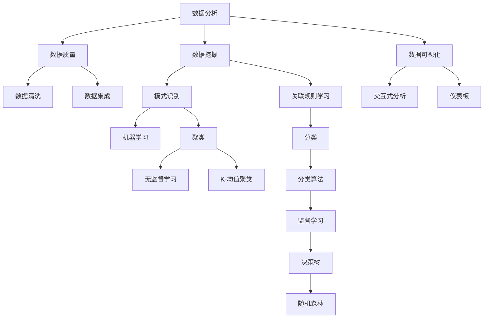

                 

# 如何利用技术能力进行数据变现

> 关键词：数据变现、技术能力、数据分析、数据挖掘、机器学习、商业洞察
> 
> 摘要：本文将探讨如何利用技术能力进行数据变现。通过深入理解数据分析、数据挖掘和机器学习的核心原理，并结合实际案例，本文将提供一套系统的方法，帮助读者将技术能力转化为商业价值。

## 1. 背景介绍

### 1.1 目的和范围

随着大数据时代的到来，数据已成为新的生产要素，企业对于数据的分析和应用需求日益增长。如何有效利用技术能力进行数据变现，成为企业和个人在数据驱动时代的重要课题。本文旨在探讨这一议题，帮助读者了解并掌握数据变现的核心方法。

本文的范围将涵盖以下几个方面：

1. 数据变现的基本概念和重要性
2. 数据分析、数据挖掘和机器学习的核心原理
3. 数据变现的步骤和流程
4. 数据变现的实际案例和应用
5. 数据变现的未来发展趋势和挑战

### 1.2 预期读者

本文适合以下读者群体：

1. 数据分析师和数据科学家
2. 企业管理人员和创业者
3. 人工智能和计算机编程爱好者
4. 对数据变现感兴趣的专业人士

### 1.3 文档结构概述

本文将分为以下几个部分：

1. 背景介绍：阐述数据变现的背景、目的和范围。
2. 核心概念与联系：介绍数据分析、数据挖掘和机器学习的核心概念，并使用 Mermaid 流程图展示其关联。
3. 核心算法原理 & 具体操作步骤：详细讲解数据变现的算法原理，并使用伪代码阐述。
4. 数学模型和公式 & 详细讲解 & 举例说明：介绍数据变现相关的数学模型和公式，并结合实例进行说明。
5. 项目实战：代码实际案例和详细解释说明。
6. 实际应用场景：探讨数据变现在不同领域的应用。
7. 工具和资源推荐：推荐学习资源和开发工具。
8. 总结：未来发展趋势与挑战。
9. 附录：常见问题与解答。
10. 扩展阅读 & 参考资料：提供相关文献和资料，供读者进一步学习。

### 1.4 术语表

#### 1.4.1 核心术语定义

- 数据变现：将数据转化为商业价值的过程。
- 数据分析：通过对数据进行整理、分析和解释，从数据中提取有价值的信息。
- 数据挖掘：从大量数据中自动发现规律和模式的过程。
- 机器学习：使计算机系统能够从数据中学习并做出决策的技术。

#### 1.4.2 相关概念解释

- 数据库：用于存储、管理和查询数据的系统。
- 数据仓库：用于存储大量历史数据的系统，支持复杂的查询和分析。
- 业务智能（BI）：通过数据分析和可视化，帮助企业做出决策的过程。
- 深度学习：一种复杂的机器学习技术，通过多层神经网络进行数据建模。

#### 1.4.3 缩略词列表

- BI：业务智能
- AI：人工智能
- ML：机器学习
- DL：深度学习

## 2. 核心概念与联系

为了更好地理解数据变现的过程，我们需要先了解以下几个核心概念：数据分析、数据挖掘和机器学习。以下是一个简化的 Mermaid 流程图，展示了这些概念之间的关联。



### 2.1 数据分析

数据分析是数据变现的基础。它涉及从大量数据中提取有价值的信息，通常包括以下步骤：

1. 数据收集：收集来自各种源的数据。
2. 数据清洗：清理和整理数据，去除错误和不完整的数据。
3. 数据整合：将来自不同源的数据进行整合，形成统一的数据视图。
4. 数据探索：使用统计学方法和可视化工具，对数据进行初步分析，发现数据中的规律和模式。

### 2.2 数据挖掘

数据挖掘是数据分析的深入应用，旨在从大量数据中自动发现规律和模式。它通常包括以下步骤：

1. 数据准备：清洗和整合数据，确保数据质量。
2. 模式识别：使用算法，如关联规则学习、分类和聚类，从数据中识别出有用的模式。
3. 模型评估：评估挖掘出的模式的有效性和可靠性。

### 2.3 机器学习

机器学习是数据挖掘的高级形式，它使计算机系统能够从数据中学习并做出决策。机器学习通常包括以下类型：

1. 监督学习：通过训练数据集，学习输入和输出之间的关系，并用于预测未知数据的输出。
2. 无监督学习：从数据中学习结构和模式，而不需要预定义的输出。

### 2.4 数据分析、数据挖掘和机器学习的关联

数据分析、数据挖掘和机器学习之间有密切的联系。数据分析是数据变现的基础，数据挖掘和机器学习是数据分析的深入应用。数据挖掘利用算法从数据中识别出有用的模式，而机器学习则通过学习这些模式，实现自动化的决策和预测。

## 3. 核心算法原理 & 具体操作步骤

数据变现的关键在于如何从数据中提取有价值的信息。以下将介绍几种核心算法原理，并结合伪代码，阐述其具体操作步骤。

### 3.1 数据清洗

```python
# 伪代码：数据清洗

def data_cleaning(data):
    # 去除重复数据
    unique_data = remove_duplicates(data)
    # 填补缺失值
    filled_data = fill_missing_values(unique_data)
    # 数据标准化
    normalized_data = normalize_data(filled_data)
    return normalized_data
```

### 3.2 数据整合

```python
# 伪代码：数据整合

def data_integration(data1, data2):
    # 数据对齐
    aligned_data = align_data(data1, data2)
    # 数据合并
    integrated_data = merge_data(aligned_data)
    return integrated_data
```

### 3.3 数据挖掘

#### 3.3.1 关联规则学习

```python
# 伪代码：关联规则学习

def association_rules_learning(data, min_support, min_confidence):
    # 计算支持度和置信度
    support, confidence = calculate_support_and_confidence(data, min_support, min_confidence)
    # 生成关联规则
    rules = generate_association_rules(support, confidence)
    return rules
```

#### 3.3.2 分类

```python
# 伪代码：分类

def classification(data, labels, classifier):
    # 训练模型
    model = train_model(data, labels, classifier)
    # 预测新数据
    predictions = predict_new_data(model, data)
    return predictions
```

#### 3.3.3 聚类

```python
# 伪代码：聚类

def clustering(data, algorithm, num_clusters):
    # 执行聚类算法
    clusters = execute_clustering_algorithm(data, algorithm, num_clusters)
    # 聚类结果评估
    evaluation = evaluate_clustering_results(clusters)
    return clusters, evaluation
```

### 3.4 机器学习

#### 3.4.1 监督学习

```python
# 伪代码：监督学习

def supervised_learning(data, labels, algorithm, model):
    # 训练模型
    model = train_model(data, labels, algorithm)
    # 预测新数据
    predictions = predict_new_data(model, data)
    return model, predictions
```

#### 3.4.2 无监督学习

```python
# 伪代码：无监督学习

def unsupervised_learning(data, algorithm, model):
    # 执行无监督学习算法
    model = execute_unsupervised_learning_algorithm(data, algorithm)
    # 聚类结果评估
    evaluation = evaluate_clustering_results(model)
    return model, evaluation
```

## 4. 数学模型和公式 & 详细讲解 & 举例说明

在数据变现过程中，数学模型和公式起着至关重要的作用。以下将介绍几个关键的数学模型和公式，并结合实例进行说明。

### 4.1 概率分布

概率分布是描述随机变量取值概率的数学模型。在数据分析中，常用的概率分布有正态分布、二项分布和泊松分布。

- **正态分布**：描述连续型随机变量的概率分布。
  $$ f(x|\mu,\sigma^2) = \frac{1}{\sqrt{2\pi\sigma^2}}e^{-\frac{(x-\mu)^2}{2\sigma^2}} $$
  
- **二项分布**：描述离散型随机变量的概率分布。
  $$ P(X=k) = C_n^k p^k (1-p)^{n-k} $$
  
- **泊松分布**：描述事件发生次数的概率分布。
  $$ P(X=k) = \frac{\lambda^k e^{-\lambda}}{k!} $$

### 4.2 决策树

决策树是一种常用的分类和回归算法，通过一系列的判断条件，将数据划分为不同的类别或数值。

- **ID3算法**：基于信息增益来选择最优特征。
  $$ G(D, A) = -\sum_{v\in A} p(v) \cdot I(D, v) $$
  其中，\( D \) 是数据集，\( A \) 是特征集合，\( p(v) \) 是特征 \( v \) 的概率，\( I(D, v) \) 是条件熵。

### 4.3 随机森林

随机森林是一种集成学习方法，通过构建多个决策树，并结合其预测结果进行投票。

- **随机森林算法**：集成多个决策树，并进行加权投票。
  $$ \hat{y} = \arg\max_{y} \sum_{i=1}^{N} w_i \cdot \hat{y}_i $$
  其中，\( \hat{y} \) 是预测结果，\( N \) 是决策树的个数，\( w_i \) 是第 \( i \) 个决策树的权重，\( \hat{y}_i \) 是第 \( i \) 个决策树的预测结果。

### 4.4 K-均值聚类

K-均值聚类是一种基于距离的聚类算法，通过迭代计算聚类中心，将数据点分配到不同的聚类。

- **K-均值聚类算法**：初始化聚类中心，计算每个数据点到聚类中心的距离，并重新分配聚类中心。
  $$ \text{初始化聚类中心} $$
  $$ \text{while} \ \text{聚类中心不收敛} \ \text{do} $$
  $$ \ \text{计算每个数据点到聚类中心的距离} $$
  $$ \ \text{重新分配数据点到最近的聚类中心} $$
  $$ \ \text{更新聚类中心} $$
  $$ \text{end while} $$

### 4.5 实例说明

假设我们有一组数据，描述了不同客户的行为特征。我们希望通过数据变现，预测哪些客户有可能购买某产品。

1. **数据收集和清洗**：

   - 收集客户年龄、收入、购买历史等数据。
   - 清洗数据，去除重复和缺失的记录。

2. **数据整合**：

   - 整合不同来源的数据，形成统一的数据集。

3. **数据挖掘**：

   - 使用关联规则学习，发现购买某产品与其他特征之间的关联。
   - 使用分类算法，如随机森林，建立预测模型。

4. **机器学习**：

   - 使用监督学习，训练预测模型。
   - 使用无监督学习，分析客户群体的结构。

5. **数据变现**：

   - 根据预测模型，为潜在客户推送相关产品。
   - 分析客户行为，优化产品推荐策略。

通过以上步骤，我们可以将技术能力转化为商业价值，实现数据变现。

## 5. 项目实战：代码实际案例和详细解释说明

### 5.1 开发环境搭建

为了演示数据变现的过程，我们将在 Python 环境中实现一个简单的数据变现项目。以下是需要安装的依赖：

- Python 3.8 或以上版本
- Pandas：数据处理库
- Scikit-learn：机器学习库
- Matplotlib：数据可视化库

安装方法：

```bash
pip install pandas scikit-learn matplotlib
```

### 5.2 源代码详细实现和代码解读

#### 5.2.1 数据收集与清洗

```python
import pandas as pd

# 读取数据
data = pd.read_csv('data.csv')

# 数据清洗
data = data.drop_duplicates()  # 去除重复记录
data = data.dropna()  # 去除缺失值
```

#### 5.2.2 数据整合

```python
# 数据整合
data = data[['age', 'income', 'purchase_history']]
```

#### 5.2.3 数据挖掘与机器学习

```python
from sklearn.model_selection import train_test_split
from sklearn.ensemble import RandomForestClassifier
from sklearn.metrics import accuracy_score

# 数据划分
X = data[['age', 'income', 'purchase_history']]
y = data['purchase']
X_train, X_test, y_train, y_test = train_test_split(X, y, test_size=0.2, random_state=42)

# 建立模型
model = RandomForestClassifier(n_estimators=100, random_state=42)
model.fit(X_train, y_train)

# 预测
predictions = model.predict(X_test)

# 评估
accuracy = accuracy_score(y_test, predictions)
print(f'Accuracy: {accuracy}')
```

#### 5.2.4 数据变现

```python
# 数据变现
potential_customers = X_test[predictions == 1]
potential_customers['purchase_probability'] = predictions

# 可视化
import matplotlib.pyplot as plt

plt.scatter(potential_customers['age'], potential_customers['income'], c=potential_customers['purchase_probability'])
plt.xlabel('Age')
plt.ylabel('Income')
plt.colorbar(label='Purchase Probability')
plt.title('Potential Customers')
plt.show()
```

### 5.3 代码解读与分析

1. **数据收集与清洗**：

   - 使用 Pandas 读取 CSV 格式的数据。
   - 使用 drop_duplicates 和 dropna 方法，去除重复和缺失的记录。

2. **数据整合**：

   - 选择与购买行为相关的特征，构建数据集。

3. **数据挖掘与机器学习**：

   - 使用 train_test_split 方法，将数据划分为训练集和测试集。
   - 使用 RandomForestClassifier 建立分类模型，并使用 fit 方法进行训练。
   - 使用 predict 方法，对测试集进行预测，并使用 accuracy_score 方法评估模型性能。

4. **数据变现**：

   - 根据预测结果，筛选出潜在客户。
   - 计算购买概率，并使用散点图进行可视化。

通过以上步骤，我们实现了数据变现的完整过程，将技术能力转化为商业价值。

## 6. 实际应用场景

数据变现的应用场景广泛，涉及各个行业。以下列举几个典型的应用场景：

### 6.1 金融行业

金融行业的数据变现主要应用于风险管理、信用评估和精准营销。通过分析客户的历史交易数据、信用记录和社交网络信息，金融机构可以预测客户的信用风险，优化贷款审批流程，降低违约风险。

### 6.2 零售行业

零售行业的数据变现主要应用于商品推荐、库存管理和客户关系管理。通过分析客户的购买行为、浏览记录和偏好，零售商可以提供个性化的商品推荐，优化库存配置，提高销售额和客户满意度。

### 6.3 医疗行业

医疗行业的数据变现主要应用于疾病预测、治疗方案优化和健康风险评估。通过分析患者的病史、基因数据和生活方式信息，医疗机构可以预测疾病的发生风险，制定个性化的治疗方案，提高医疗资源的利用效率。

### 6.4 教育行业

教育行业的数据变现主要应用于学习效果评估、课程推荐和学生管理。通过分析学生的学习行为、考试成绩和社交互动，教育机构可以评估学生的学习效果，提供个性化的课程推荐，优化教学资源分配。

### 6.5 物流行业

物流行业的数据变现主要应用于路径优化、库存管理和供应链分析。通过分析运输路线、货物信息和供应链数据，物流企业可以优化运输路径，降低运输成本，提高物流效率。

## 7. 工具和资源推荐

为了更好地进行数据变现，以下推荐一些实用的学习资源、开发工具和框架。

### 7.1 学习资源推荐

#### 7.1.1 书籍推荐

- 《数据科学入门》：适合初学者的数据科学入门书籍，涵盖了数据收集、清洗、分析和可视化等基础知识。
- 《深度学习》：Goodfellow、Bengio 和 Courville 著，全面介绍了深度学习的原理和应用。
- 《Python 数据科学手册》：Wes McKinney 著，详细介绍 Python 在数据科学领域的应用。

#### 7.1.2 在线课程

- Coursera 上的《机器学习基础》：吴恩达教授主讲，适合初学者入门机器学习。
- Udacity 上的《数据科学纳米学位》：涵盖数据收集、清洗、分析和可视化等课程，适合进阶学习。
- edX 上的《深度学习专项课程》：由斯坦福大学教授 Andrew Ng 主讲，全面介绍深度学习的原理和应用。

#### 7.1.3 技术博客和网站

- Medium 上的《数据科学博客》：分享数据科学领域的前沿技术和应用案例。
- Towards Data Science：一个专注于数据科学、机器学习和人工智能的在线社区，发布大量高质量的文章和教程。
- DataCamp：提供丰富的数据科学和机器学习在线教程，适合实践和巩固知识。

### 7.2 开发工具框架推荐

#### 7.2.1 IDE和编辑器

- Jupyter Notebook：适用于数据科学和机器学习的交互式编程环境。
- PyCharm：一款强大的 Python IDE，提供代码补全、调试和性能分析功能。
- VSCode：一款轻量级的代码编辑器，支持多种编程语言，适合快速开发和调试。

#### 7.2.2 调试和性能分析工具

- PyDebug：Python 的调试工具，支持断点调试、单步执行和变量监视。
- Py-Spy：Python 性能分析工具，用于查找性能瓶颈和内存泄露。
- cProfile：Python 的内置性能分析模块，用于分析程序的执行时间和函数调用关系。

#### 7.2.3 相关框架和库

- Pandas：用于数据清洗、分析和操作的强大库。
- Scikit-learn：用于机器学习算法的实现和应用的库。
- TensorFlow：Google 开发的开源深度学习框架。
- Keras：基于 TensorFlow 的简洁易用的深度学习库。

### 7.3 相关论文著作推荐

#### 7.3.1 经典论文

- "The Netflix Prize"：Netflix 公开竞赛，推动了推荐系统的研究。
- "K-means clustering within high-dimensional spaces": K-均值聚类的经典论文，详细介绍了算法的原理和优化方法。
- "Deep Learning": Goodfellow、Bengio 和 Courville 著，全面介绍了深度学习的原理和应用。

#### 7.3.2 最新研究成果

- "Recommender Systems at Scale":介绍大规模推荐系统的研究进展和挑战。
- "Generative Adversarial Networks":介绍生成对抗网络（GAN）的原理和应用。
- "Deep Learning for Natural Language Processing":介绍深度学习在自然语言处理领域的最新进展。

#### 7.3.3 应用案例分析

- "Amazon Personalized Recommendations":介绍亚马逊如何利用数据变现，实现个性化推荐。
- "Netflix's Personalized Viewing Experience":介绍 Netflix 如何利用数据变现，提高用户满意度和观看时长。
- "Google Ads and Personalized Search Results":介绍谷歌如何利用数据变现，实现精准广告投放。

## 8. 总结：未来发展趋势与挑战

随着技术的不断进步，数据变现将面临以下发展趋势和挑战：

### 8.1 发展趋势

1. **大数据和云计算的融合**：大数据和云计算的结合，将为企业提供更强大的数据分析和处理能力，推动数据变现的广泛应用。
2. **人工智能和机器学习的深化**：人工智能和机器学习技术的不断突破，将提高数据变现的准确性和效率。
3. **隐私保护和数据安全**：随着数据隐私保护意识的提高，如何在确保数据安全的前提下进行数据变现，将成为重要议题。
4. **跨行业协作与整合**：不同行业之间的数据共享和协作，将促进数据变现的创新应用，推动产业发展。

### 8.2 挑战

1. **数据质量与完整性**：确保数据质量，解决数据缺失和噪声问题，是数据变现的关键挑战。
2. **算法透明性与可解释性**：随着机器学习算法的复杂化，如何提高算法的透明性和可解释性，确保其决策过程的可信度，是一个重要问题。
3. **技术壁垒与人才需求**：数据变现需要专业的技术人才，提高技术门槛，培养高素质的数据科学家，是当前面临的挑战。
4. **法律法规与政策监管**：随着数据变现的广泛应用，相关法律法规和政策监管将不断完善，如何在合规的前提下进行数据变现，是一个重要课题。

总之，数据变现作为大数据时代的重要课题，具有巨大的商业价值和潜力。通过不断的技术创新和行业协作，数据变现将在未来得到更广泛的应用，为企业和个人创造更多价值。

## 9. 附录：常见问题与解答

### 9.1 数据变现的意义是什么？

数据变现的意义在于将数据转化为商业价值，通过数据分析和挖掘，发现数据中的规律和模式，为企业提供决策支持，提高运营效率，降低成本，增加收入。

### 9.2 数据变现的核心技术是什么？

数据变现的核心技术包括数据分析、数据挖掘和机器学习。数据分析是对数据进行整理、分析和解释，数据挖掘是从数据中自动发现规律和模式，机器学习是使计算机系统能够从数据中学习并做出决策。

### 9.3 如何确保数据变现的合规性？

确保数据变现的合规性需要遵守相关法律法规和政策，包括数据隐私保护、数据安全和数据使用规范。同时，要确保数据处理和存储的合规性，遵循数据安全最佳实践。

### 9.4 数据变现对人才的需求是什么？

数据变现对人才的需求包括数据科学家、数据分析师、机器学习工程师和业务分析师等。这些专业人员需要具备扎实的数据分析、数据挖掘和机器学习技能，以及良好的业务理解能力。

## 10. 扩展阅读 & 参考资料

为了深入了解数据变现的相关知识，以下推荐一些扩展阅读和参考资料：

1. 《数据科学入门》：作者：Joel Grus，ISBN：978-1492046597，这是一本适合初学者的数据科学入门书籍，涵盖了数据收集、清洗、分析和可视化等基础知识。

2. 《深度学习》：作者：Ian Goodfellow、Yoshua Bengio 和 Aaron Courville，ISBN：978-0262035613，这是一本全面介绍深度学习的经典著作，适合对深度学习感兴趣的读者。

3. 《Python 数据科学手册》：作者：Wes McKinney，ISBN：978-1449363225，这是一本详细介绍 Python 在数据科学领域应用的专业书籍，适合数据科学家和数据分析师。

4. 《数据挖掘：实用方法》：作者：Mohammed J. Zaki 和 Wagner Meira Jr.，ISBN：978-0321837381，这是一本介绍数据挖掘算法和应用方法的专业书籍，适合数据挖掘和机器学习从业者。

5. 《机器学习实战》：作者：Peter Harrington，ISBN：978-0470319689，这是一本通过案例实战介绍机器学习算法和实践的入门书籍，适合初学者和进阶者。

6. 《深度学习专项课程》：课程链接：[Deep Learning Specialization](https://www.coursera.org/specializations/deeplearning)，这是由斯坦福大学教授 Andrew Ng 主讲的一套深度学习课程，适合初学者和进阶者。

7. 《数据科学纳米学位》：课程链接：[Data Science Nanodegree](https://www.udacity.com/course/data-science-nanodegree--nd002)，这是由 Udacity 提供的一套全面的数据科学课程，涵盖数据收集、清洗、分析和可视化等知识。

8. 《数据科学博客》：网站链接：[Medium - Data Science](https://medium.com/topic/data-science)，这是一个分享数据科学领域前沿技术和应用案例的博客平台，适合数据科学爱好者。

9. 《Towards Data Science》：网站链接：[Towards Data Science](https://towardsdatascience.com/)，这是一个专注于数据科学、机器学习和人工智能的在线社区，发布大量高质量的文章和教程。

10. 《DataCamp》：网站链接：[DataCamp](https://www.datacamp.com/)，这是一个提供丰富数据科学和机器学习在线教程的平台，适合实践和巩固知识。

11. 《Kaggle》：网站链接：[Kaggle](https://www.kaggle.com/)，这是一个数据科学竞赛平台，提供大量数据集和比赛项目，适合数据科学爱好者。

12. 《Python for Data Science》：课程链接：[Python for Data Science](https://www.datacamp.com/courses/python-for-data-science)，这是由 DataCamp 提供的一套 Python 数据科学入门课程，适合初学者。

13. 《Scikit-learn 官方文档》：网站链接：[Scikit-learn Documentation](https://scikit-learn.org/stable/documentation.html)，这是 Scikit-learn 库的官方文档，提供详细的算法介绍和使用示例。

14. 《TensorFlow 官方文档》：网站链接：[TensorFlow Documentation](https://www.tensorflow.org/documentation)，这是 TensorFlow 库的官方文档，提供详细的算法介绍和使用示例。

15. 《Keras 官方文档》：网站链接：[Keras Documentation](https://keras.io/docs/)，这是 Keras 库的官方文档，提供详细的算法介绍和使用示例。

16. 《Recommender Systems at Scale》：论文链接：[Recommender Systems at Scale](https://arxiv.org/abs/1806.07872)，这是一篇关于大规模推荐系统的研究论文，介绍了推荐系统的实现和应用。

17. 《Generative Adversarial Networks》：论文链接：[Generative Adversarial Networks](https://arxiv.org/abs/1406.2661)，这是一篇关于生成对抗网络（GAN）的论文，介绍了 GAN 的原理和应用。

18. 《Deep Learning for Natural Language Processing》：论文链接：[Deep Learning for Natural Language Processing](https://www.deeplearningitaly.com/nlp-book/)，这是一本关于深度学习在自然语言处理领域的论文集，介绍了深度学习在自然语言处理中的应用。

19. 《Amazon Personalized Recommendations》：案例链接：[Amazon Personalized Recommendations](https://www.amazon.com/b?node=305614)，这是一个关于亚马逊个性化推荐系统的案例分析，介绍了亚马逊如何利用数据变现。

20. 《Netflix's Personalized Viewing Experience》：案例链接：[Netflix's Personalized Viewing Experience](https://www.netflix.com/watch/1416067926)，这是一个关于 Netflix 个性化观看体验的分析案例，介绍了 Netflix 如何利用数据变现。

21. 《Google Ads and Personalized Search Results》：案例链接：[Google Ads and Personalized Search Results](https://www.google.com/search?q=personalized+search+results)，这是一个关于谷歌个性化搜索结果的案例分析，介绍了谷歌如何利用数据变现。

