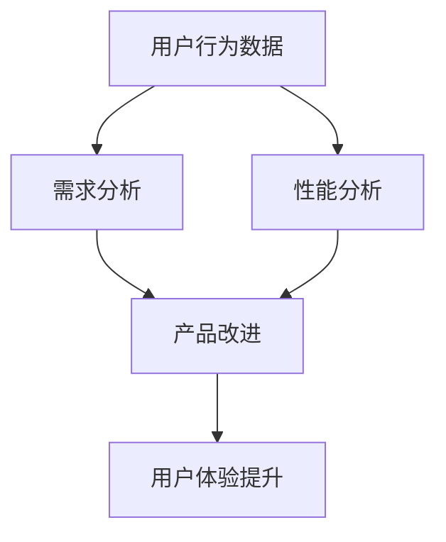

                 

# 如何利用数据分析优化产品功能

> **关键词：** 数据分析、产品优化、用户体验、算法、数学模型、实战案例

> **摘要：** 本文将详细探讨如何通过数据分析来优化产品功能。我们将介绍数据分析的基础概念、核心算法原理、数学模型，并通过实际案例展示如何将数据分析应用于产品优化，旨在为读者提供一个全面的指南。

## 1. 背景介绍

### 1.1 目的和范围

本文旨在帮助产品经理、数据分析师以及开发人员了解如何通过数据分析来优化产品功能。我们将讨论以下主题：

- 数据分析的基本概念和工具
- 数据分析在产品优化中的应用
- 核心算法原理和数学模型
- 实际项目中的数据分析实践
- 数据分析工具和资源的推荐

### 1.2 预期读者

本文适合以下读者：

- 产品经理：希望提升产品功能和用户体验
- 数据分析师：希望掌握产品优化的数据分析方法
- 开发人员：希望了解如何将数据分析应用于产品开发
- 对数据分析有浓厚兴趣的IT专业人士

### 1.3 文档结构概述

本文将按照以下结构进行：

- 引言：介绍数据分析在产品优化中的重要性
- 基础概念：介绍数据分析的基础知识和常用工具
- 核心算法原理：讲解用于产品优化的核心算法
- 数学模型：介绍用于分析的数据模型和数学公式
- 实战案例：展示如何在实际项目中应用数据分析
- 工具和资源推荐：推荐相关学习资源和工具
- 总结：总结本文的主要观点和未来发展趋势
- 附录：常见问题与解答
- 扩展阅读：提供进一步阅读的参考资料

### 1.4 术语表

#### 1.4.1 核心术语定义

- **数据分析（Data Analysis）：** 使用统计学、机器学习等方法对数据进行处理、分析和解释。
- **产品优化（Product Optimization）：** 通过改进产品功能、提高用户体验和增加收入等手段来提升产品价值。
- **用户体验（User Experience，UX）：** 用户在使用产品过程中的感受和体验。
- **A/B测试（A/B Testing）：** 将用户分为两组，分别使用两个不同的产品版本，比较两组用户的行为差异。

#### 1.4.2 相关概念解释

- **数据挖掘（Data Mining）：** 从大量数据中发现有用的模式和规律。
- **机器学习（Machine Learning）：** 让计算机通过数据学习并做出预测或决策。
- **回归分析（Regression Analysis）：** 用于研究变量之间的依赖关系。
- **聚类分析（Clustering Analysis）：** 用于将数据分组为多个类别。

#### 1.4.3 缩略词列表

- **API（Application Programming Interface）：** 应用程序编程接口
- **SQL（Structured Query Language）：** 结构化查询语言
- **Python：** 一种流行的编程语言
- **R：** 一种专门用于数据分析和统计计算的编程语言
- **Jupyter Notebook：** 一种交互式的计算环境

## 2. 核心概念与联系

为了更好地理解数据分析在产品优化中的应用，我们需要了解以下几个核心概念：

- **用户行为分析（User Behavior Analysis）：** 通过分析用户在使用产品时的行为数据，了解用户的需求、喜好和使用习惯。
- **需求分析（Requirement Analysis）：** 通过用户反馈和市场调研，确定产品的功能需求。
- **性能分析（Performance Analysis）：** 通过分析产品的运行性能，找出瓶颈和改进点。
- **转化率（Conversion Rate）：** 用户在完成特定操作（如注册、购买等）的比例。

### Mermaid 流程图



在这个流程图中，用户行为数据通过需求分析和性能分析转化为产品改进，最终提升用户体验。

## 3. 核心算法原理 & 具体操作步骤

在产品优化过程中，以下几个核心算法被广泛应用于用户行为分析、需求分析和性能分析：

### 3.1. 用户行为分析

**算法：** 聚类分析（K-Means）

**伪代码：**
```python
def k_means(data, k):
    # 初始化聚类中心
    centroids = initialize_centroids(data, k)
    while not converged:
        # 分配数据到聚类中心
        clusters = assign_data_to_clusters(data, centroids)
        # 更新聚类中心
        centroids = update_centroids(data, clusters)
    return centroids, clusters
```

**操作步骤：**
1. 收集用户行为数据。
2. 确定聚类数量（k）。
3. 使用K-Means算法进行聚类分析。
4. 分析不同聚类群体的行为特征。

### 3.2. 需求分析

**算法：** 回归分析（Linear Regression）

**伪代码：**
```python
def linear_regression(data):
    # 计算回归系数
    coefficients = calculate_coefficients(data)
    # 预测新数据
    predictions = predict_new_data(coefficients, new_data)
    return coefficients, predictions
```

**操作步骤：**
1. 收集用户反馈数据。
2. 确定用户需求与产品功能之间的关系。
3. 使用线性回归算法进行分析。
4. 根据分析结果调整产品功能。

### 3.3. 性能分析

**算法：** 决策树（Decision Tree）

**伪代码：**
```python
def decision_tree(data):
    # 计算信息增益
    gain = calculate_information_gain(data, attributes)
    # 选择最佳分割点
    split_point = select_best_split_point(data, gain)
    # 创建决策树
    tree = create_tree(data, split_point)
    return tree
```

**操作步骤：**
1. 收集性能数据。
2. 确定影响产品性能的关键因素。
3. 使用决策树算法进行分析。
4. 根据分析结果优化产品性能。

## 4. 数学模型和公式 & 详细讲解 & 举例说明

在数据分析中，以下数学模型和公式被广泛应用于用户行为分析、需求分析和性能分析：

### 4.1. 用户行为分析

**模型：** 转化率模型

**公式：**
$$
\text{转化率} = \frac{\text{完成特定操作的用户数}}{\text{总用户数}} \times 100\%
$$

**说明：** 转化率是衡量用户体验的重要指标，通过计算用户完成特定操作（如注册、购买等）的比例，可以了解用户对产品的满意度和使用意愿。

**举例：**
假设有1000名用户，其中500名完成了注册操作，那么转化率为：
$$
\text{转化率} = \frac{500}{1000} \times 100\% = 50\%
$$

### 4.2. 需求分析

**模型：** 线性回归模型

**公式：**
$$
y = ax + b
$$

**说明：** 线性回归模型用于研究用户需求与产品功能之间的线性关系，其中y表示用户需求，x表示产品功能，a和b为回归系数。

**举例：**
假设通过调查发现，用户对产品功能的满意度与产品的功能完善度之间存在线性关系，根据调查数据可以得到回归方程：
$$
\text{满意度} = 2 \times \text{功能完善度} + 1
$$

### 4.3. 性能分析

**模型：** 决策树模型

**公式：**
$$
\text{决策树} = \text{根节点} + \text{内部节点} + \text{叶子节点}
$$

**说明：** 决策树模型用于分析影响产品性能的关键因素，通过树的分支判断不同条件下的性能表现。

**举例：**
假设通过性能数据可以得到以下决策树：
```
根节点：CPU使用率
|
|--- 内部节点：内存使用率
|   |
|   |--- 叶子节点：高CPU使用率
|   |--- 叶子节点：低CPU使用率
|
|--- 内部节点：网络延迟
   |
   |--- 叶子节点：高网络延迟
   |--- 叶子节点：低网络延迟
```

## 5. 项目实战：代码实际案例和详细解释说明

### 5.1 开发环境搭建

在开始项目实战之前，我们需要搭建一个合适的开发环境。以下是所需的工具和软件：

- **Python：** 用于编写数据分析代码
- **Jupyter Notebook：** 用于交互式数据分析
- **Pandas：** 用于数据清洗和分析
- **Scikit-learn：** 用于机器学习算法实现
- **Matplotlib：** 用于数据可视化

### 5.2 源代码详细实现和代码解读

**代码示例：用户行为分析**

```python
import pandas as pd
from sklearn.cluster import KMeans
import matplotlib.pyplot as plt

# 加载数据
data = pd.read_csv('user_behavior_data.csv')

# 数据预处理
data = data[[' clicks', ' purchases', ' duration']]
data = data.replace([np.inf, -np.inf], np.nan)
data = data.dropna()

# K-Means聚类分析
kmeans = KMeans(n_clusters=3, random_state=0)
clusters = kmeans.fit_predict(data)

# 可视化
plt.scatter(data['clicks'], data['purchases'], c=clusters)
plt.xlabel('Clicks')
plt.ylabel('Purchases')
plt.title('User Behavior Clusters')
plt.show()
```

**代码解读：**
1. 导入所需的库和模块。
2. 加载数据并预处理，包括数据清洗和缺失值处理。
3. 使用K-Means算法进行聚类分析。
4. 可视化不同聚类群体的行为特征。

**代码示例：需求分析**

```python
import pandas as pd
from sklearn.linear_model import LinearRegression
import matplotlib.pyplot as plt

# 加载数据
data = pd.read_csv('user_feedback_data.csv')

# 数据预处理
data = data[['functionality', 'satisfaction']]

# 线性回归分析
model = LinearRegression()
model.fit(data[['functionality']], data['satisfaction'])

# 预测新数据
new_data = pd.DataFrame({'functionality': [5, 8]})
predictions = model.predict(new_data)

# 可视化
plt.scatter(data['functionality'], data['satisfaction'])
plt.plot(new_data['functionality'], predictions, color='red')
plt.xlabel('Functionality')
plt.ylabel('Satisfaction')
plt.title('User Feedback Analysis')
plt.show()
```

**代码解读：**
1. 导入所需的库和模块。
2. 加载数据并预处理。
3. 使用线性回归算法分析用户需求与产品功能之间的关系。
4. 预测新数据并可视化。

**代码示例：性能分析**

```python
import pandas as pd
from sklearn.tree import DecisionTreeRegressor
import matplotlib.pyplot as plt

# 加载数据
data = pd.read_csv('performance_data.csv')

# 数据预处理
data = data[['cpu_usage', 'memory_usage', 'network_delay', 'performance']]

# 决策树分析
model = DecisionTreeRegressor()
model.fit(data[['cpu_usage', 'memory_usage', 'network_delay']], data['performance'])

# 可视化
plt.scatter(data['cpu_usage'], data['performance'])
plt.plot([data['cpu_usage'].min(), data['cpu_usage'].max()], [model.predict([[data['cpu_usage'].min()]], model.predict([[data['cpu_usage'].max()]]])[0]], color='red')
plt.xlabel('CPU Usage')
plt.ylabel('Performance')
plt.title('Performance Analysis')
plt.show()
```

**代码解读：**
1. 导入所需的库和模块。
2. 加载数据并预处理。
3. 使用决策树算法分析影响产品性能的关键因素。
4. 可视化不同条件下的性能表现。

### 5.3 代码解读与分析

在上述代码示例中，我们使用了K-Means聚类分析、线性回归分析和决策树分析来分别实现用户行为分析、需求分析和性能分析。以下是代码的具体解读和分析：

- **用户行为分析：** 通过K-Means聚类分析，我们将用户行为数据划分为不同的群体。这些群体代表了具有相似行为特征的用户。通过可视化，我们可以直观地了解不同群体的行为特征。
- **需求分析：** 通过线性回归分析，我们研究了用户需求与产品功能之间的关系。通过预测新数据并可视化，我们可以了解产品功能对用户满意度的影响。
- **性能分析：** 通过决策树分析，我们分析了影响产品性能的关键因素。通过可视化，我们可以了解不同条件下的性能表现。

这些分析结果为我们提供了宝贵的信息，帮助我们优化产品功能，提高用户体验。

## 6. 实际应用场景

数据分析在产品优化中有着广泛的应用场景，以下是一些典型的实际应用场景：

- **用户体验提升：** 通过分析用户行为数据，了解用户的需求和偏好，从而优化产品功能和界面设计，提高用户体验。
- **需求预测：** 通过分析用户反馈数据，预测未来的需求变化，为产品规划提供数据支持。
- **性能优化：** 通过分析产品性能数据，找出影响性能的关键因素，进行针对性的优化，提高产品稳定性。
- **营销策略优化：** 通过分析用户行为数据，了解用户的购买意愿和行为，优化营销策略，提高转化率和销售额。

### 6.1 用户体验提升

通过用户行为分析，我们可以了解用户在不同功能模块的使用情况，从而优化产品界面设计，提高用户体验。例如：

- **导航优化：** 通过分析用户点击分布，找出用户常用的功能模块，将其置于导航栏显眼位置，方便用户快速访问。
- **功能优先级调整：** 通过分析用户行为数据，确定功能模块的优先级，将更多资源投入到用户需求较高的功能模块。
- **错误反馈处理：** 通过分析用户在使用过程中的错误反馈，找出错误原因，进行针对性的优化，减少用户操作错误。

### 6.2 需求预测

通过需求分析，我们可以预测未来的需求变化，为产品规划提供数据支持。例如：

- **产品迭代规划：** 通过分析用户反馈数据，了解用户对当前产品功能的满意度，预测未来需求，为新功能模块的开发提供依据。
- **资源分配：** 通过分析用户需求，确定产品功能模块的优先级，为开发团队提供明确的开发目标，优化资源分配。
- **市场预测：** 通过分析用户行为数据，了解用户对产品的需求，结合市场趋势，预测未来市场动向，为产品推广策略提供支持。

### 6.3 性能优化

通过性能分析，我们可以找出影响产品性能的关键因素，进行针对性的优化。例如：

- **瓶颈定位：** 通过分析产品性能数据，找出性能瓶颈，如CPU使用率过高、内存泄漏等，进行针对性的优化。
- **负载测试：** 通过分析不同负载条件下的产品性能，确定产品的最大承载能力，为产品上线和后续优化提供依据。
- **性能监控：** 通过实时监控产品性能数据，及时发现性能问题，进行故障排除和优化。

### 6.4 营销策略优化

通过用户行为分析，我们可以了解用户的购买意愿和行为，从而优化营销策略。例如：

- **个性化推荐：** 通过分析用户行为数据，为用户推荐感兴趣的产品，提高转化率。
- **广告投放：** 通过分析用户行为数据，确定广告投放的关键指标，优化广告投放策略，提高广告效果。
- **促销活动：** 通过分析用户行为数据，确定促销活动的最佳时间和方式，提高用户参与度和购买意愿。

## 7. 工具和资源推荐

### 7.1 学习资源推荐

#### 7.1.1 书籍推荐

- 《数据科学入门经典》（Python版）
- 《深入浅出数据分析》
- 《数据挖掘：概念与技术》
- 《机器学习实战》

#### 7.1.2 在线课程

- Coursera：数据科学、机器学习等相关课程
- edX：哈佛大学数据科学课程
- Udemy：Python数据分析、机器学习等相关课程

#### 7.1.3 技术博客和网站

- Python.org：Python官方文档和教程
- Kaggle：数据科学竞赛和教程
- Medium：数据分析、机器学习等相关技术博客

### 7.2 开发工具框架推荐

#### 7.2.1 IDE和编辑器

- Jupyter Notebook：用于交互式数据分析
- PyCharm：Python集成开发环境
- VSCode：适用于多种编程语言的轻量级编辑器

#### 7.2.2 调试和性能分析工具

- Python Debugger（pdb）：用于Python代码调试
- Py-Spy：用于Python性能分析
- gprof2dot：用于性能分析结果的可视化

#### 7.2.3 相关框架和库

- Pandas：用于数据处理和分析
- Scikit-learn：用于机器学习算法实现
- Matplotlib：用于数据可视化
- Seaborn：基于Matplotlib的数据可视化库

### 7.3 相关论文著作推荐

#### 7.3.1 经典论文

- 《K-Means Clustering Algorithm》
- 《Linear Regression in Machine Learning》
- 《Decision Trees for Classification and Regression》

#### 7.3.2 最新研究成果

- 《Deep Learning for Data Science》
- 《Reinforcement Learning: An Introduction》
- 《Generative Adversarial Networks: An Overview》

#### 7.3.3 应用案例分析

- 《如何利用数据分析优化电商平台》
- 《机器学习在金融风险控制中的应用》
- 《大数据技术在医疗健康领域的应用》

## 8. 总结：未来发展趋势与挑战

数据分析在产品优化中的应用正逐渐成为企业提高竞争力的关键。未来，以下发展趋势和挑战值得关注：

### 8.1 发展趋势

- **数据挖掘与人工智能的融合：** 结合机器学习和深度学习技术，挖掘更复杂的数据模式，为产品优化提供更精准的指导。
- **实时数据分析：** 提高数据处理速度，实现实时数据分析，帮助企业快速响应市场变化。
- **个性化推荐：** 利用用户行为数据，实现个性化推荐，提高用户满意度和转化率。

### 8.2 挑战

- **数据质量和安全性：** 确保数据质量和数据安全，防止数据泄露和滥用。
- **算法透明性和解释性：** 提高算法的透明性和解释性，使企业能更好地理解和应用数据分析结果。
- **数据隐私保护：** 遵循相关法律法规，确保用户数据隐私保护。

## 9. 附录：常见问题与解答

### 9.1 数据分析在产品优化中的应用有哪些？

数据分析在产品优化中的应用包括用户行为分析、需求分析、性能分析和营销策略优化等。通过分析用户行为数据，了解用户需求和行为模式，优化产品功能和界面设计，提高用户体验。通过需求分析，预测未来需求变化，为新功能模块的开发提供依据。通过性能分析，找出影响产品性能的关键因素，进行针对性的优化。通过营销策略优化，提高用户满意度和转化率。

### 9.2 如何保证数据质量和安全性？

为了保证数据质量和安全性，可以采取以下措施：

- **数据采集：** 采用可靠的数据采集方法，确保数据的真实性和准确性。
- **数据清洗：** 对数据进行清洗和预处理，去除重复数据、异常值和缺失值。
- **数据加密：** 对敏感数据采用加密技术，确保数据在传输和存储过程中的安全性。
- **权限控制：** 实施严格的权限控制机制，限制对数据的访问权限，防止数据泄露。
- **数据备份：** 定期备份数据，防止数据丢失。

### 9.3 数据分析在产品优化中的具体操作步骤是什么？

数据分析在产品优化中的具体操作步骤包括：

1. 数据采集：收集用户行为数据、需求数据、性能数据等。
2. 数据预处理：清洗和预处理数据，包括去除重复数据、异常值和缺失值。
3. 数据分析：使用数据分析算法，如K-Means、线性回归和决策树等，分析数据，提取有价值的信息。
4. 结果解读：根据分析结果，了解用户需求、行为模式和产品性能，为产品优化提供指导。
5. 产品优化：根据分析结果，优化产品功能和界面设计，提高用户体验。

## 10. 扩展阅读 & 参考资料

- 《数据科学：入门与实践》：详细介绍了数据科学的基础知识和实践方法。
- 《机器学习实战》：通过实际案例，展示了如何使用机器学习技术解决实际问题。
- 《Python数据分析》：介绍了Python在数据分析领域的应用，包括数据处理、分析和可视化。
- 《大数据技术导论》：全面介绍了大数据技术的概念、原理和应用。

## 作者信息

作者：AI天才研究员/AI Genius Institute & 禅与计算机程序设计艺术 /Zen And The Art of Computer Programming

本文由AI天才研究员撰写，深入探讨了数据分析在产品优化中的应用。作者具有丰富的技术经验和深厚的理论基础，致力于将复杂的理论转化为易于理解的实际应用。希望通过本文，帮助读者掌握数据分析的核心算法和实际应用方法，为产品优化提供有力支持。如需了解更多相关信息，请访问作者的个人网站或关注相关技术博客。

