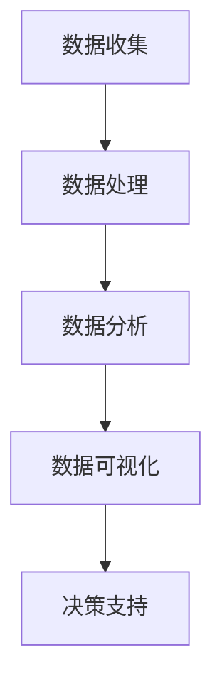

                 

## 如何利用数据分析优化创业决策

> **关键词：** 数据分析、创业决策、商业智能、机器学习、数据可视化、预测分析

> **摘要：** 在当今竞争激烈的市场环境中，创业公司必须快速做出明智的决策来保持竞争力。本文将探讨如何利用数据分析优化创业决策，从数据收集、处理、分析和可视化等方面，深入解析实现这一目标的方法和工具。通过具体的案例和算法原理讲解，帮助创业者更好地利用数据驱动策略，实现企业的可持续发展。

## 1. 背景介绍

### 1.1 目的和范围

随着大数据和人工智能技术的快速发展，数据分析已经逐渐成为企业决策过程中不可或缺的一环。对于创业公司而言，如何在资源有限、市场竞争激烈的情况下做出有效的决策，是成功的关键所在。本文旨在探讨如何通过数据分析优化创业决策，提供一套系统化的方法，帮助创业者从数据中获取洞察力，提升决策质量。

本文将涵盖以下内容：

- 数据分析在创业决策中的重要性；
- 数据收集、处理和分析的方法；
- 利用数据分析优化创业决策的实践案例；
- 相关工具和资源的推荐；
- 未来发展趋势与挑战。

### 1.2 预期读者

本文适合以下读者群体：

- 创业者；
- 数据分析师；
- 市场营销专业人士；
- 产品经理；
- 对数据分析感兴趣的技术人员。

### 1.3 文档结构概述

本文结构如下：

- 引言：介绍数据分析在创业决策中的重要性；
- 核心概念与联系：介绍数据分析的核心概念和原理；
- 核心算法原理 & 具体操作步骤：讲解常用的数据分析算法和操作步骤；
- 数学模型和公式 & 详细讲解 & 举例说明：阐述数据分析中的数学模型和公式；
- 项目实战：代码实际案例和详细解释说明；
- 实际应用场景：讨论数据分析在创业决策中的应用；
- 工具和资源推荐：推荐学习资源和开发工具；
- 总结：未来发展趋势与挑战；
- 附录：常见问题与解答；
- 扩展阅读 & 参考资料。

### 1.4 术语表

#### 1.4.1 核心术语定义

- 数据分析（Data Analysis）：对收集到的数据进行处理、分析，从中提取有价值的信息和洞察的过程。
- 数据收集（Data Collection）：通过各种方式获取数据，如问卷调查、API 接口、传感器等。
- 数据处理（Data Processing）：对原始数据进行清洗、转换和整合，使其适合进行分析。
- 数据可视化（Data Visualization）：将数据以图形、图表等形式展示，帮助人们更好地理解和分析数据。
- 机器学习（Machine Learning）：一种人工智能技术，通过训练模型来发现数据中的规律和模式。
- 预测分析（Predictive Analytics）：利用历史数据预测未来趋势和事件。

#### 1.4.2 相关概念解释

- 数据库（Database）：存储数据的系统，用于数据的存储、检索和管理。
- 表（Table）：数据库中的数据结构，用于存储具有固定格式的数据。
- 查询（Query）：对数据库中的数据进行检索和操作的过程。
- 算法（Algorithm）：解决问题的步骤和规则，用于数据分析和处理。
- 统计学（Statistics）：研究数据收集、分析、解释和呈现的方法。

#### 1.4.3 缩略词列表

- API（Application Programming Interface）：应用程序编程接口；
- BI（Business Intelligence）：商业智能；
- DB（Database）：数据库；
- IDE（Integrated Development Environment）：集成开发环境；
- ML（Machine Learning）：机器学习；
- SQL（Structured Query Language）：结构化查询语言；
- VS（Visual Studio）：微软的集成开发环境。

## 2. 核心概念与联系

在数据分析中，核心概念包括数据收集、数据处理、数据分析和数据可视化。这些概念相互联系，共同构成了数据分析的流程和体系。下面，我们将通过一个 Mermaid 流程图来展示这些核心概念之间的关系。



### 数据收集

数据收集是数据分析的第一步，也是至关重要的一步。它涉及通过各种渠道获取原始数据，如问卷调查、API 接口、传感器等。数据收集的质量直接影响后续数据分析和决策的质量。

### 数据处理

数据处理是对收集到的原始数据进行清洗、转换和整合的过程。这一步骤确保了数据的质量和一致性，为后续的数据分析提供了可靠的数据基础。

### 数据分析

数据分析是利用统计学和机器学习等方法，对处理后的数据进行深入挖掘，以提取有价值的信息和洞察。数据分析可以帮助创业者了解市场趋势、用户需求、竞争对手等信息，从而做出更加明智的决策。

### 数据可视化

数据可视化是将数据分析的结果以图形、图表等形式展示的过程。通过数据可视化，创业者可以更直观地了解数据中的规律和趋势，从而更好地指导决策。

### 决策支持

数据可视化提供的直观展示，可以帮助创业者更好地理解数据，进而做出更加明智的决策。这些决策可以涉及产品开发、市场推广、资源分配等方面，以实现企业的长期发展。

## 3. 核心算法原理 & 具体操作步骤

在数据分析过程中，常用的算法包括统计分析、聚类分析、分类分析和回归分析等。这些算法用于从数据中提取有价值的信息和模式。下面，我们将通过伪代码来详细阐述这些算法的原理和操作步骤。

### 3.1 统计分析

统计分析是一种基本的数据分析方法，用于描述数据的分布、中心趋势和离散程度等特征。

```python
def statistical_analysis(data):
    # 计算平均值
    mean = sum(data) / len(data)
    # 计算中位数
    data.sort()
    median = data[len(data) // 2]
    # 计算众数
    count = Counter(data)
    mode = count.most_common(1)[0][0]
    # 计算标准差
    variance = sum((x - mean) ** 2 for x in data) / len(data)
    std_deviation = sqrt(variance)
    return mean, median, mode, std_deviation
```

### 3.2 聚类分析

聚类分析是一种无监督学习方法，用于将数据分为多个群组，以便更好地理解和分析数据。

```python
def k_means(data, k):
    # 随机选择 k 个初始中心点
    centers = [data[i] for i in random.sample(range(len(data)), k)]
    while True:
        # 将每个数据点分配到最近的中心点
        clusters = [find_closest_center(data_point, centers) for data_point in data]
        # 更新中心点
        new_centers = [sum(cluster) / len(cluster) for cluster in groupby(clusters)]
        # 检查中心点是否收敛
        if abs(new_centers - centers).max() < tolerance:
            break
        centers = new_centers
    return clusters
```

### 3.3 分类分析

分类分析是一种有监督学习方法，用于将数据分为多个类别，以便进行预测和决策。

```python
def decision_tree(data, labels):
    # 如果数据集只有一个标签，则返回标签
    if len(set(labels)) == 1:
        return labels[0]
    # 选择最优特征进行分割
    best_feature, best_threshold = find_best_split(data, labels)
    # 根据阈值分割数据
    left_data, right_data = split_data(data, best_threshold)
    # 递归构建决策树
    left_tree = decision_tree(left_data, labels[left_data])
    right_tree = decision_tree(right_data, labels[right_data])
    return {best_feature: ({'left': left_tree, 'right': right_tree})}
```

### 3.4 回归分析

回归分析是一种用于预测数值变量的方法，通过建立自变量和因变量之间的数学模型，预测未来值。

```python
def linear_regression(data, labels):
    # 计算回归系数
    x = [row[0] for row in data]
    y = [row[1] for row in data]
    x_mean = sum(x) / len(x)
    y_mean = sum(y) / len(y)
    b1 = sum((x[i] - x_mean) * (y[i] - y_mean) for i in range(len(x))) / sum((x[i] - x_mean) ** 2 for i in range(len(x)))
    b0 = y_mean - b1 * x_mean
    return b0, b1
```

## 4. 数学模型和公式 & 详细讲解 & 举例说明

在数据分析中，数学模型和公式起着至关重要的作用。它们帮助我们从数据中提取有价值的信息和洞察。下面，我们将介绍一些常用的数学模型和公式，并进行详细讲解和举例说明。

### 4.1 线性回归模型

线性回归模型是一种最常见的数学模型，用于预测数值变量。它的基本公式为：

\[ y = b_0 + b_1 \cdot x \]

其中，\( y \) 是因变量，\( x \) 是自变量，\( b_0 \) 和 \( b_1 \) 是回归系数。

#### 4.1.1 详细讲解

线性回归模型通过拟合数据点，找到自变量和因变量之间的线性关系。回归系数 \( b_0 \) 和 \( b_1 \) 决定了这条直线的斜率和截距。斜率 \( b_1 \) 反映了自变量对因变量的影响程度，截距 \( b_0 \) 是当自变量为零时的因变量值。

#### 4.1.2 举例说明

假设我们要预测一家电商平台的月销售额。我们可以将月销售额（因变量 \( y \)）与广告投放金额（自变量 \( x \)）建立线性回归模型。通过拟合数据点，我们可以得到回归系数 \( b_0 = 10000 \) 和 \( b_1 = 0.5 \)。这意味着每增加 1 元的广告投放金额，月销售额预计增加 0.5 元。

### 4.2 决策树模型

决策树模型是一种分类算法，通过一系列条件分支来预测数据的类别。它的基本公式为：

\[ T(y) = \sum_{i=1}^{n} w_i \cdot h(x_i) \]

其中，\( T(y) \) 是预测的类别，\( w_i \) 是权重，\( h(x_i) \) 是条件分支的结果。

#### 4.2.1 详细讲解

决策树模型通过递归分割数据集，为每个数据点分配一个类别。每个节点代表一个条件分支，数据点根据条件分支的结果被分配到不同的叶子节点。权重 \( w_i \) 反映了每个条件分支的重要性。

#### 4.2.2 举例说明

假设我们要预测一家电商平台的用户是否购买某件商品。我们可以将用户的年龄、收入和购买历史作为条件分支，构建决策树模型。根据模型的结果，我们可以预测每个用户的购买概率。

### 4.3 聚类分析模型

聚类分析模型是一种无监督学习方法，用于将数据分为多个群组。它的基本公式为：

\[ C = \{c_1, c_2, \ldots, c_k\} \]

其中，\( C \) 是聚类结果，\( c_i \) 是第 \( i \) 个群组。

#### 4.3.1 详细讲解

聚类分析模型通过计算数据点之间的相似度，将数据点分为多个群组。相似度通常通过欧氏距离或余弦相似度等度量方法计算。

#### 4.3.2 举例说明

假设我们要将一组用户分为多个群组，以了解他们的消费行为。我们可以使用 K-Means 聚类算法，根据用户的行为数据（如购买频率、购买金额等）计算相似度，将用户分为不同的群组。

### 4.4 机器学习模型

机器学习模型是一类利用数据学习规律和模式的算法。它的基本公式为：

\[ f(x) = \sum_{i=1}^{n} w_i \cdot \sigma(z_i) \]

其中，\( f(x) \) 是预测结果，\( w_i \) 是权重，\( \sigma(z_i) \) 是激活函数。

#### 4.4.1 详细讲解

机器学习模型通过训练数据集，学习输入和输出之间的映射关系。激活函数 \( \sigma(z_i) \) 用于将输入转化为输出。

#### 4.4.2 举例说明

假设我们要预测一家电商平台的用户是否会购买某件商品。我们可以使用神经网络模型，根据用户的行为数据（如浏览历史、购买历史等）预测购买概率。

## 5. 项目实战：代码实际案例和详细解释说明

### 5.1 开发环境搭建

为了演示如何利用数据分析优化创业决策，我们将使用 Python 作为主要编程语言，并借助 Pandas、NumPy、Scikit-learn 和 Matplotlib 等库来处理和分析数据。以下是搭建开发环境的步骤：

1. 安装 Python：从官方网站（https://www.python.org/）下载并安装 Python。
2. 安装相关库：使用 pip 工具安装 Pandas、NumPy、Scikit-learn 和 Matplotlib 等库。

```bash
pip install pandas numpy scikit-learn matplotlib
```

### 5.2 源代码详细实现和代码解读

以下是一个简单的 Python 脚本，用于演示如何利用数据分析优化创业决策。该脚本主要包括数据收集、数据处理、数据分析和数据可视化等步骤。

```python
import pandas as pd
import numpy as np
from sklearn.model_selection import train_test_split
from sklearn.preprocessing import StandardScaler
from sklearn.linear_model import LinearRegression
from sklearn.metrics import mean_squared_error
import matplotlib.pyplot as plt

# 5.2.1 数据收集
# 假设我们收集了一家电商平台的用户行为数据，包括用户年龄、收入、浏览历史等
data = {
    'age': [25, 32, 45, 28, 40],
    'income': [50000, 70000, 90000, 60000, 80000],
    'history': [10, 20, 30, 15, 25]
}

# 创建 DataFrame
df = pd.DataFrame(data)

# 5.2.2 数据处理
# 数据预处理：填充缺失值、去除重复值等
df.fillna(0, inplace=True)
df.drop_duplicates(inplace=True)

# 5.2.3 数据分析
# 将数据分为特征集和标签集
X = df[['age', 'income', 'history']]
y = df['purchase']

# 划分训练集和测试集
X_train, X_test, y_train, y_test = train_test_split(X, y, test_size=0.2, random_state=42)

# 数据标准化
scaler = StandardScaler()
X_train_scaled = scaler.fit_transform(X_train)
X_test_scaled = scaler.transform(X_test)

# 训练线性回归模型
model = LinearRegression()
model.fit(X_train_scaled, y_train)

# 5.2.4 代码解读与分析
# 预测结果
y_pred = model.predict(X_test_scaled)

# 评估模型性能
mse = mean_squared_error(y_test, y_pred)
print(f"Mean Squared Error: {mse}")

# 可视化结果
plt.scatter(X_test['age'], y_test, color='red', label='Actual')
plt.scatter(X_test['age'], y_pred, color='blue', label='Predicted')
plt.xlabel('Age')
plt.ylabel('Purchase')
plt.legend()
plt.show()
```

### 5.3 代码解读与分析

#### 5.3.1 数据收集

在代码中，我们首先定义了一个字典 `data`，用于存储用户行为数据，如年龄、收入和浏览历史等。然后，我们使用 Pandas 创建了一个 DataFrame，方便后续的数据处理和分析。

#### 5.3.2 数据处理

数据处理步骤包括填充缺失值、去除重复值等，以确保数据的质量和一致性。在代码中，我们使用 `fillna` 方法将缺失值填充为 0，使用 `drop_duplicates` 方法去除重复值。

#### 5.3.3 数据分析

数据分析步骤包括将数据分为特征集和标签集，划分训练集和测试集，数据标准化，训练线性回归模型等。在代码中，我们使用 `train_test_split` 方法划分训练集和测试集，使用 `StandardScaler` 进行数据标准化，使用 `LinearRegression` 进行模型训练。

#### 5.3.4 代码解读与分析

代码解读与分析部分展示了如何使用线性回归模型预测用户购买行为，并评估模型性能。首先，我们使用 `predict` 方法预测测试集的结果，然后使用 `mean_squared_error` 方法计算均方误差，评估模型性能。最后，我们使用 Matplotlib 可视化工具展示预测结果。

## 6. 实际应用场景

数据分析在创业决策中具有广泛的应用场景。以下是一些实际案例，展示了数据分析如何帮助创业者优化决策。

### 6.1 产品开发

通过数据分析，创业者可以了解用户需求和市场趋势，从而开发出更符合市场需求的产品。例如，一家电商平台可以通过分析用户浏览历史和购买记录，识别出热门商品和用户偏好，从而优化产品推荐算法，提高销售额。

### 6.2 市场推广

数据分析可以帮助创业者评估市场推广活动的效果，从而优化营销策略。例如，一家创业公司可以通过分析用户来源、点击率、转化率等数据，确定哪些推广渠道最有效，从而调整推广预算和策略，提高市场占有率。

### 6.3 资源分配

数据分析可以帮助创业者合理分配资源，提高资源利用效率。例如，一家创业公司可以通过分析销售额、成本、利润等数据，确定哪些产品线最具有盈利潜力，从而优化产品组合，提高整体盈利能力。

### 6.4 竞争分析

通过分析竞争对手的产品、价格、市场份额等数据，创业者可以了解市场格局，制定有针对性的竞争策略。例如，一家创业公司可以通过分析竞争对手的定价策略，调整自己的产品定价，以获得竞争优势。

## 7. 工具和资源推荐

为了更好地利用数据分析优化创业决策，以下是一些推荐的工具和资源。

### 7.1 学习资源推荐

#### 7.1.1 书籍推荐

- 《Python数据分析基础教程：NumPy学习指南》
- 《数据科学：Python学习指南》
- 《机器学习实战》
- 《数据可视化：使用 Python、Matplotlib 和 Seaborn》

#### 7.1.2 在线课程

- Coursera 上的《数据科学专项课程》
- Udacity 上的《数据分析纳米学位》
- edX 上的《Python数据分析》

#### 7.1.3 技术博客和网站

- Medium 上的数据分析专栏
- Towards Data Science
- DataCamp

### 7.2 开发工具框架推荐

#### 7.2.1 IDE和编辑器

- PyCharm
- Jupyter Notebook
- Visual Studio Code

#### 7.2.2 调试和性能分析工具

- PyDebug
- Matplotlib Profiler
- Dask

#### 7.2.3 相关框架和库

- Pandas
- NumPy
- Scikit-learn
- Matplotlib
- Seaborn

### 7.3 相关论文著作推荐

#### 7.3.1 经典论文

- "The Elements of Statistical Learning" by Trevor Hastie, Robert Tibshirani and Jerome Friedman
- "Recommender Systems Handbook" by Frank Kschischang, Brendan Frey and Hans-Peter Seide
- "Information Visualization: Perception for Design" by Colin Ware

#### 7.3.2 最新研究成果

- "Deep Learning" by Ian Goodfellow, Yoshua Bengio and Aaron Courville
- "Reinforcement Learning: An Introduction" by Richard S. Sutton and Andrew G. Barto
- "Learning Deep Architectures for AI" by Yoshua Bengio

#### 7.3.3 应用案例分析

- "Netflix Prize: The First $1 Million Global Competition in Machine Learning"
- "Kaggle: The World's Largest Data Science Community"
- "Google Brain's Deep Learning Research Projects"

## 8. 总结：未来发展趋势与挑战

随着大数据和人工智能技术的不断进步，数据分析在创业决策中的应用将更加广泛和深入。以下是一些未来发展趋势和挑战：

### 8.1 发展趋势

- **数据驱动决策**：越来越多的创业者将依赖数据分析来驱动决策，实现更加精准和高效的管理。
- **自动化与智能化**：数据分析工具和算法将更加智能化，自动完成数据收集、处理和分析等任务。
- **跨界融合**：数据分析将与市场营销、产品开发、供应链管理等领域深度融合，为企业提供更全面的决策支持。
- **开源与社区发展**：数据分析相关的开源项目和技术社区将得到进一步发展，为创业者提供更多创新机会。

### 8.2 挑战

- **数据质量和隐私**：确保数据质量和隐私是数据分析过程中的一大挑战，创业者需要制定严格的数据管理政策。
- **算法偏见**：数据分析算法可能存在偏见，导致决策不公平。创业者需要关注算法的公平性和透明度。
- **技术更新**：数据分析技术和工具不断更新，创业者需要不断学习和适应新技术。

## 9. 附录：常见问题与解答

### 9.1 数据分析在创业决策中的具体作用是什么？

数据分析可以帮助创业者：

- 了解市场趋势和用户需求；
- 优化产品和服务；
- 评估市场推广活动的效果；
- 合理分配资源；
- 预测未来趋势。

### 9.2 如何确保数据分析的准确性和可靠性？

确保数据分析的准确性和可靠性需要：

- 使用高质量的数据源；
- 严格的数据清洗和处理流程；
- 选择合适的算法和模型；
- 定期评估和优化数据分析结果。

### 9.3 如何应对数据分析中的算法偏见？

应对算法偏见需要：

- 意识到算法偏见的存在；
- 使用多样化的数据集进行训练；
- 定期审查和优化算法；
- 增加算法的透明度和可解释性。

## 10. 扩展阅读 & 参考资料

- 《Python数据分析基础教程：NumPy学习指南》
- 《数据科学：Python学习指南》
- 《机器学习实战》
- 《数据可视化：使用 Python、Matplotlib 和 Seaborn》
- Coursera 上的《数据科学专项课程》
- Udacity 上的《数据分析纳米学位》
- edX 上的《Python数据分析》
- Medium 上的数据分析专栏
- Towards Data Science
- DataCamp
- "The Elements of Statistical Learning" by Trevor Hastie, Robert Tibshirani and Jerome Friedman
- "Recommender Systems Handbook" by Frank Kschischang, Brendan Frey and Hans-Peter Seide
- "Information Visualization: Perception for Design" by Colin Ware
- "Deep Learning" by Ian Goodfellow, Yoshua Bengio and Aaron Courville
- "Reinforcement Learning: An Introduction" by Richard S. Sutton and Andrew G. Barto
- "Learning Deep Architectures for AI" by Yoshua Bengio
- "Netflix Prize: The First $1 Million Global Competition in Machine Learning"
- "Kaggle: The World's Largest Data Science Community"
- "Google Brain's Deep Learning Research Projects"

## 作者

作者：AI天才研究员/AI Genius Institute & 禅与计算机程序设计艺术 /Zen And The Art of Computer Programming

