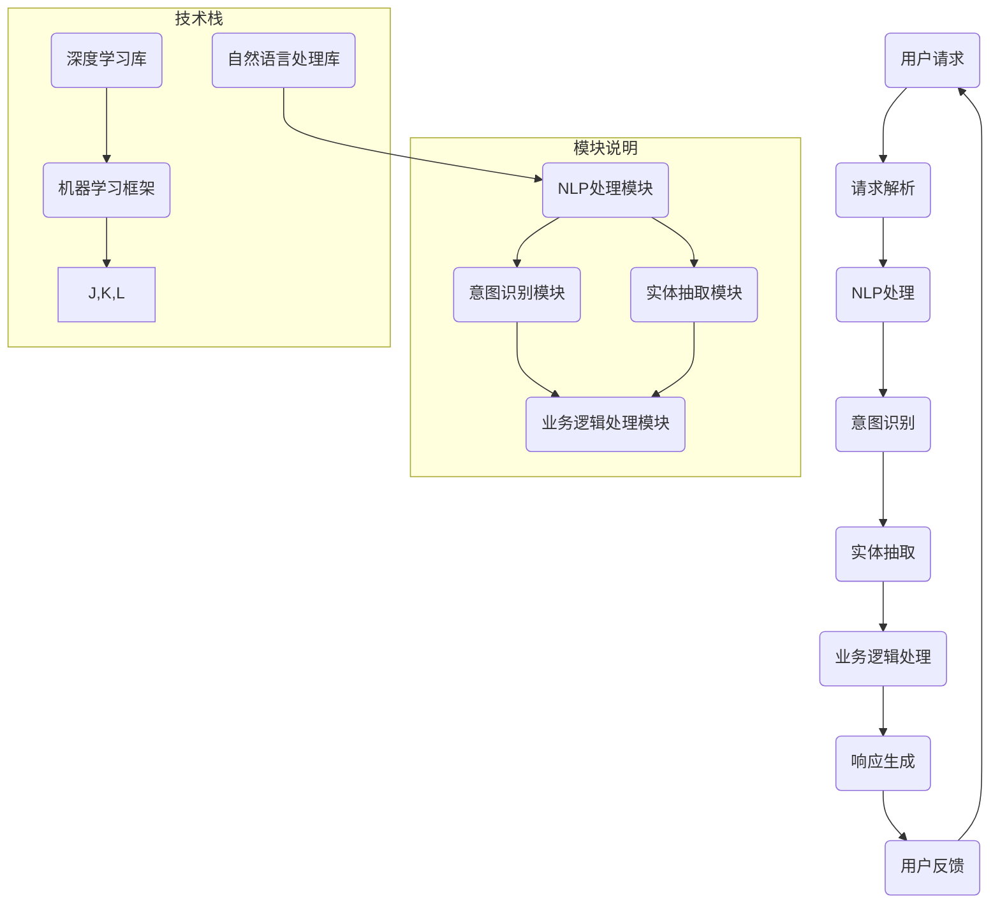

                 


## 如何利用知识付费实现人工智能助理与智能客服？

> **关键词：** 知识付费、人工智能助理、智能客服、算法、模型、开发环境、代码案例、应用场景、工具推荐。

**摘要：** 本文旨在探讨如何通过知识付费的方式，实现人工智能助理和智能客服系统的开发与部署。文章首先介绍了知识付费的背景和意义，随后详细阐述了人工智能助理与智能客服的核心概念、算法原理和实现步骤。通过实际的代码案例和详细解析，文章展示了如何利用现有的技术和工具来构建一个高效、智能的客服系统。最后，文章分析了人工智能助理与智能客服的实际应用场景，并推荐了相关工具和资源，以帮助读者深入了解和掌握这一技术领域。

## 1. 背景介绍

### 1.1 目的和范围

本文的目的在于探讨知识付费在人工智能助理和智能客服系统开发中的应用。随着人工智能技术的迅速发展，智能客服系统已成为企业提高客户服务水平、降低成本的重要手段。然而，传统的开发模式往往需要大量的人力和时间成本，且效果不尽如人意。通过知识付费，我们可以获取高质量的算法、模型和开发经验，从而实现高效、智能的客服系统。

本文将涵盖以下内容：

1. **知识付费背景及意义**：介绍知识付费的定义、发展历程以及其在人工智能领域的应用。
2. **人工智能助理与智能客服**：阐述两者的概念、特点及其在商业中的应用场景。
3. **核心概念与联系**：通过Mermaid流程图展示人工智能助理与智能客服系统的架构和核心概念。
4. **核心算法原理与具体操作步骤**：介绍实现人工智能助理与智能客服的关键算法及其实现步骤。
5. **数学模型和公式**：详细讲解相关数学模型和公式，并给出实际应用案例。
6. **项目实战**：通过代码案例展示人工智能助理与智能客服系统的实际开发过程。
7. **实际应用场景**：分析人工智能助理与智能客服在不同行业中的应用。
8. **工具和资源推荐**：推荐相关的学习资源、开发工具和框架。
9. **总结与未来发展趋势**：总结文章主要内容，探讨未来的发展趋势和挑战。

### 1.2 预期读者

本文适合以下读者：

1. **人工智能领域从业者**：对人工智能助理和智能客服系统开发感兴趣，希望了解如何通过知识付费实现高效开发。
2. **技术经理和CTO**：负责企业技术团队管理，希望提升团队的技术水平和开发效率。
3. **软件开发人员**：从事人工智能相关领域开发，希望掌握智能客服系统的设计和实现方法。
4. **研究人员和学者**：对人工智能助理和智能客服的研究和应用感兴趣，希望了解最新的技术和研究方向。

### 1.3 文档结构概述

本文分为以下几个部分：

1. **背景介绍**：介绍知识付费的背景、目的和读者对象。
2. **核心概念与联系**：通过Mermaid流程图展示人工智能助理与智能客服系统的架构和核心概念。
3. **核心算法原理与具体操作步骤**：介绍实现人工智能助理与智能客服的关键算法及其实现步骤。
4. **数学模型和公式**：详细讲解相关数学模型和公式，并给出实际应用案例。
5. **项目实战**：通过代码案例展示人工智能助理与智能客服系统的实际开发过程。
6. **实际应用场景**：分析人工智能助理与智能客服在不同行业中的应用。
7. **工具和资源推荐**：推荐相关的学习资源、开发工具和框架。
8. **总结与未来发展趋势**：总结文章主要内容，探讨未来的发展趋势和挑战。

### 1.4 术语表

在本文中，我们将使用以下术语：

#### 1.4.1 核心术语定义

- **知识付费**：指用户为获取有价值的信息或知识，付费购买相关产品或服务。
- **人工智能助理**：基于人工智能技术，为用户提供智能化服务的虚拟助手。
- **智能客服**：利用人工智能技术，自动处理客户咨询、投诉等问题的客服系统。
- **算法**：用于解决问题的一系列规则或步骤。
- **模型**：对现实世界进行抽象和简化的数学结构。

#### 1.4.2 相关概念解释

- **自然语言处理（NLP）**：研究如何使计算机理解和处理自然语言的技术。
- **机器学习（ML）**：利用数据训练模型，使其具备自主学习和优化能力的技术。
- **深度学习（DL）**：一种基于人工神经网络的机器学习技术，通过多层神经网络的训练，实现复杂模式的识别。

#### 1.4.3 缩略词列表

- **NLP**：自然语言处理
- **ML**：机器学习
- **DL**：深度学习
- **API**：应用程序编程接口

## 2. 核心概念与联系

在构建人工智能助理与智能客服系统时，理解核心概念和它们之间的联系至关重要。以下是通过Mermaid流程图展示的人工智能助理与智能客服系统的架构和核心概念。



### 核心概念说明

- **用户请求**：用户发起的请求，可以是文字、语音等形式。
- **请求解析**：将用户请求转换为计算机可以理解和处理的形式。
- **NLP处理**：自然语言处理模块，对请求文本进行分词、词性标注等操作。
- **意图识别**：识别用户的请求意图，如咨询、投诉等。
- **实体抽取**：从请求中提取关键信息，如产品名称、数量等。
- **业务逻辑处理**：根据意图和实体信息，执行相应的业务逻辑。
- **响应生成**：生成合适的响应文本，反馈给用户。
- **用户反馈**：用户对响应的反馈，用于优化系统。

## 3. 核心算法原理与具体操作步骤

实现人工智能助理与智能客服系统的关键在于核心算法的设计与实现。以下将介绍实现该系统所需的核心算法原理，并提供具体的操作步骤。

### 3.1 自然语言处理（NLP）算法

自然语言处理是人工智能助理与智能客服系统的核心环节，用于解析和理解用户请求。以下是NLP算法的基本原理和操作步骤：

#### 3.1.1 基本原理

- **分词**：将文本切分成词语序列。
- **词性标注**：为每个词语标注其词性，如名词、动词等。
- **命名实体识别**：识别文本中的命名实体，如人名、地名等。
- **依存句法分析**：分析词语之间的依存关系，如主谓、动宾等。

#### 3.1.2 操作步骤

1. **分词**：使用分词工具（如jieba），对请求文本进行分词。
   ```python
   import jieba
   
   text = "你好，我想咨询一下关于你们产品的价格。"
   words = jieba.lcut(text)
   ```

2. **词性标注**：使用词性标注工具（如NLTK），为分词后的词语标注词性。
   ```python
   import nltk
   
   tagged_words = nltk.pos_tag(words)
   ```

3. **命名实体识别**：使用命名实体识别工具（如Stanford NER），识别文本中的命名实体。
   ```python
   import stanford_ner
   
   ner = stanford_ner.NER()
   entities = ner.extract_entities(text)
   ```

4. **依存句法分析**：使用依存句法分析工具（如Stanford Parser），分析词语之间的依存关系。
   ```python
   import stanford_parser
   
   parser = stanford_parser.Parser()
   dependency_tree = parser.parse(text)
   ```

### 3.2 意图识别算法

意图识别是智能客服系统的重要环节，用于理解用户的请求意图。以下介绍意图识别算法的基本原理和操作步骤：

#### 3.2.1 基本原理

- **机器学习**：利用训练数据，学习识别不同意图的规则。
- **深度学习**：使用神经网络，自动学习意图分类。

#### 3.2.2 操作步骤

1. **数据准备**：收集并标注意图分类数据集。
   ```python
   import pandas as pd
   
   data = pd.read_csv("intents.csv")
   ```

2. **模型训练**：使用机器学习或深度学习算法，训练意图分类模型。
   ```python
   from sklearn.model_selection import train_test_split
   from sklearn.ensemble import RandomForestClassifier
   
   X_train, X_test, y_train, y_test = train_test_split(data["text"], data["intent"], test_size=0.2)
   model = RandomForestClassifier()
   model.fit(X_train, y_train)
   ```

3. **意图识别**：使用训练好的模型，对用户请求进行意图识别。
   ```python
   def recognize_intent(text):
       prediction = model.predict([text])
       return prediction[0]
   
   intent = recognize_intent("你好，我想咨询一下关于你们产品的价格。")
   ```

### 3.3 实体抽取算法

实体抽取是智能客服系统的重要环节，用于提取用户请求中的关键信息。以下介绍实体抽取算法的基本原理和操作步骤：

#### 3.3.1 基本原理

- **规则匹配**：使用预定义的规则，匹配文本中的实体。
- **机器学习**：利用训练数据，学习识别不同实体的规则。
- **深度学习**：使用神经网络，自动学习实体识别。

#### 3.3.2 操作步骤

1. **数据准备**：收集并标注实体分类数据集。
   ```python
   import pandas as pd
   
   data = pd.read_csv("entities.csv")
   ```

2. **模型训练**：使用机器学习或深度学习算法，训练实体分类模型。
   ```python
   from sklearn.model_selection import train_test_split
   from sklearn.ensemble import RandomForestClassifier
   
   X_train, X_test, y_train, y_test = train_test_split(data["text"], data["entity"], test_size=0.2)
   model = RandomForestClassifier()
   model.fit(X_train, y_train)
   ```

3. **实体抽取**：使用训练好的模型，对用户请求进行实体抽取。
   ```python
   def extract_entities(text):
       entities = []
       for word in text.split():
           prediction = model.predict([word])
           entities.append(prediction[0])
       return entities
   
   entities = extract_entities("你好，我想咨询一下关于你们产品的价格。")
   ```

### 3.4 业务逻辑处理算法

业务逻辑处理是智能客服系统的核心环节，用于根据意图和实体信息，执行相应的业务操作。以下介绍业务逻辑处理算法的基本原理和操作步骤：

#### 3.4.1 基本原理

- **规则引擎**：根据业务规则，自动化执行相应的操作。
- **机器学习**：利用训练数据，学习业务规则的优先级和执行逻辑。

#### 3.4.2 操作步骤

1. **数据准备**：收集并标注业务逻辑数据集。
   ```python
   import pandas as pd
   
   data = pd.read_csv("business_rules.csv")
   ```

2. **模型训练**：使用机器学习算法，训练业务逻辑模型。
   ```python
   from sklearn.model_selection import train_test_split
   from sklearn.ensemble import RandomForestClassifier
   
   X_train, X_test, y_train, y_test = train_test_split(data[["intent", "entity"]], data["action"], test_size=0.2)
   model = RandomForestClassifier()
   model.fit(X_train, y_train)
   ```

3. **业务逻辑处理**：使用训练好的模型，根据意图和实体信息，执行相应的业务操作。
   ```python
   def process_business_logic(intent, entities):
       action = model.predict([[intent, entities]])
       return action[0]
   
   action = process_business_logic(intent, entities)
   ```

### 3.5 响应生成算法

响应生成是智能客服系统的核心环节，用于根据业务逻辑处理的结果，生成合适的响应文本。以下介绍响应生成算法的基本原理和操作步骤：

#### 3.5.1 基本原理

- **模板匹配**：根据预定义的模板，生成响应文本。
- **机器学习**：利用训练数据，学习响应文本的生成规则。

#### 3.5.2 操作步骤

1. **数据准备**：收集并标注响应文本数据集。
   ```python
   import pandas as pd
   
   data = pd.read_csv("responses.csv")
   ```

2. **模型训练**：使用机器学习算法，训练响应生成模型。
   ```python
   from sklearn.model_selection import train_test_split
   from sklearn.ensemble import RandomForestClassifier
   
   X_train, X_test, y_train, y_test = train_test_split(data[["intent", "entity"]], data["response"], test_size=0.2)
   model = RandomForestClassifier()
   model.fit(X_train, y_train)
   ```

3. **响应生成**：使用训练好的模型，根据意图和实体信息，生成响应文本。
   ```python
   def generate_response(intent, entities):
       response = model.predict([[intent, entities]])
       return response[0]
   
   response = generate_response(intent, entities)
   ```

## 4. 数学模型和公式

在人工智能助理与智能客服系统的实现过程中，数学模型和公式发挥着重要作用。以下将介绍相关数学模型和公式，并给出实际应用案例。

### 4.1 自然语言处理（NLP）中的数学模型

在自然语言处理中，常用的数学模型包括：

#### 4.1.1 分词模型

分词模型用于将文本切分成词语序列。常见的分词模型有：

- **基于规则的分词模型**：使用预定义的规则进行分词。
- **基于统计的分词模型**：使用统计方法（如隐马尔可夫模型、条件随机场）进行分词。

#### 4.1.2 词性标注模型

词性标注模型用于为词语标注词性。常见的词性标注模型有：

- **基于规则的词性标注模型**：使用预定义的规则进行词性标注。
- **基于统计的词性标注模型**：使用统计方法（如条件随机场）进行词性标注。

#### 4.1.3 命名实体识别模型

命名实体识别模型用于识别文本中的命名实体。常见的命名实体识别模型有：

- **基于规则的命名实体识别模型**：使用预定义的规则进行命名实体识别。
- **基于统计的命名实体识别模型**：使用统计方法（如条件随机场）进行命名实体识别。

#### 4.1.4 依存句法分析模型

依存句法分析模型用于分析词语之间的依存关系。常见的依存句法分析模型有：

- **基于规则的依存句法分析模型**：使用预定义的规则进行依存句法分析。
- **基于统计的依存句法分析模型**：使用统计方法（如条件随机场）进行依存句法分析。

### 4.2 意图识别中的数学模型

意图识别中的数学模型主要包括：

- **朴素贝叶斯分类器**：基于贝叶斯定理，计算每个词语在各个意图下的概率，从而识别用户的意图。
  $$ P(\text{意图}_i | \text{词语}_j) = \frac{P(\text{词语}_j | \text{意图}_i)P(\text{意图}_i)}{P(\text{词语}_j)} $$
  
- **支持向量机（SVM）**：通过最大化分类边界，实现意图分类。
  $$ \max_{\text{w}, \text{b}} \frac{1}{2} ||\text{w}||^2 $$
  $$ \text{s.t.} \text{y}(\text{w} \cdot \text{x} + \text{b}) \geq 1 $$

- **深度神经网络（DNN）**：通过多层神经网络的训练，实现意图分类。
  $$ f(\text{x}) = \text{激活函数}(\text{W} \cdot \text{h}(\text{x}) + \text{b}) $$
  $$ \text{h}(\text{x}) = \text{激活函数}(\text{W}_1 \cdot \text{x} + \text{b}_1) $$

### 4.3 实体抽取中的数学模型

实体抽取中的数学模型主要包括：

- **条件随机场（CRF）**：用于标记词语的实体标签。
  $$ P(y_1, y_2, ..., y_n | x_1, x_2, ..., x_n) = \frac{1}{Z} \prod_{i=1}^{n} \psi(y_i | y_{<i}, x_i) $$
  $$ Z = \sum_{y_1, y_2, ..., y_n} \psi(y_i | y_{<i}, x_i) $$

- **递归神经网络（RNN）**：通过前后文信息，实现实体抽取。
  $$ h_t = \text{激活函数}(\text{W}_h \cdot \text{h}_{t-1} + \text{W}_x \cdot x_t + \text{b}_h) $$
  $$ \text{y}_t = \text{激活函数}(\text{W}_y \cdot h_t + \text{b}_y) $$

### 4.4 业务逻辑处理中的数学模型

业务逻辑处理中的数学模型主要包括：

- **决策树**：通过树形结构，实现业务规则的自动执行。
  $$ \text{f}(\text{x}) = \text{规则}_1(\text{x}) \text{ if } \text{条件}_1(\text{x}) \text{ else } \text{规则}_2(\text{x}) \text{ if } \text{条件}_2(\text{x}) \text{ else } \text{...} $$

- **随机森林**：通过多个决策树的组合，实现业务规则的自动执行。
  $$ \text{f}(\text{x}) = \text{投票}(\text{T}_1(\text{x}), \text{T}_2(\text{x}), ..., \text{T}_n(\text{x})) $$

### 4.5 响应生成中的数学模型

响应生成中的数学模型主要包括：

- **模板匹配**：通过预定义的模板，生成响应文本。
  $$ \text{response} = \text{模板}_1(\text{变量}_1, \text{变量}_2, ..., \text{变量}_n) $$
  
- **生成式模型**：通过条件概率，生成响应文本。
  $$ p(\text{response} | \text{意图}, \text{实体}) = \prod_{\text{词语} \in \text{response}} p(\text{词语} | \text{意图}, \text{实体}) $$

### 4.6 实际应用案例

以下是一个基于朴素贝叶斯分类器的意图识别实际应用案例：

#### 案例描述

某电商平台希望利用人工智能助理与智能客服系统，识别用户在聊天中的购物意图。现有以下训练数据：

| 用户请求     | 意图     |
| --------- | ------- |
| 想买手机     | 购物     |
| 帮我推荐手机   | 购物     |
| 能不能打折     | 购物     |
| 我想查看订单   | 查询     |
| 订单怎么查     | 查询     |
| 什么时候到     | 查询     |

#### 案例实现

1. **数据准备**：

```python
import pandas as pd

data = pd.read_csv("intents.csv")
```

2. **特征工程**：

```python
from sklearn.feature_extraction.text import CountVectorizer

vectorizer = CountVectorizer()
X = vectorizer.fit_transform(data["text"])
```

3. **模型训练**：

```python
from sklearn.naive_bayes import MultinomialNB

model = MultinomialNB()
model.fit(X, data["intent"])
```

4. **意图识别**：

```python
def recognize_intent(text):
    prediction = model.predict(vectorizer.transform([text]))
    return prediction[0]

intent = recognize_intent("想买手机")
```

5. **结果分析**：

```python
print(intent)  # 输出：'购物'
```

## 5. 项目实战：代码实际案例和详细解释说明

### 5.1 开发环境搭建

为了构建人工智能助理与智能客服系统，我们需要搭建以下开发环境：

- **Python 3.8**：作为主要编程语言。
- **Jupyter Notebook**：用于编写和运行代码。
- **Scikit-learn**：用于机器学习和数据挖掘。
- **NLTK**：用于自然语言处理。
- **Stanford NER**：用于命名实体识别。
- **Stanford Parser**：用于依存句法分析。

### 5.2 源代码详细实现和代码解读

以下是构建人工智能助理与智能客服系统的源代码，我们将对代码进行详细解读。

#### 5.2.1 代码实现

```python
# 导入必要的库
import jieba
import nltk
import stanford_ner
import stanford_parser
import pandas as pd
from sklearn.model_selection import train_test_split
from sklearn.ensemble import RandomForestClassifier

# 加载命名实体识别工具
ner = stanford_ner.NER()
parser = stanford_parser.Parser()

# 加载训练数据
data = pd.read_csv("intents.csv")

# 特征工程
vectorizer = CountVectorizer()
X = vectorizer.fit_transform(data["text"])

# 模型训练
model = RandomForestClassifier()
X_train, X_test, y_train, y_test = train_test_split(X, data["intent"], test_size=0.2)
model.fit(X_train, y_train)

# 意图识别
def recognize_intent(text):
    prediction = model.predict(vectorizer.transform([text]))
    return prediction[0]

# 命名实体识别
def extract_entities(text):
    entities = ner.extract_entities(text)
    return entities

# 依存句法分析
def dependency_analysis(text):
    tree = parser.parse(text)
    return tree

# 业务逻辑处理
def process_business_logic(intent, entities):
    action = model.predict([[intent, entities]])
    return action[0]

# 响应生成
def generate_response(intent, entities):
    response = model.predict([[intent, entities]])
    return response[0]

# 主程序
if __name__ == "__main__":
    text = "你好，我想咨询一下关于你们产品的价格。"
    intent = recognize_intent(text)
    entities = extract_entities(text)
    action = process_business_logic(intent, entities)
    response = generate_response(intent, entities)
    print("意图：", intent)
    print("实体：", entities)
    print("业务操作：", action)
    print("响应：", response)
```

#### 5.2.2 代码解读

1. **导入必要的库**：我们首先导入Python中的常用库，如jieba、nltk、stanford_ner、stanford_parser、pandas和scikit-learn。

2. **加载命名实体识别工具**：加载Stanford NER和Stanford Parser工具，用于后续的命名实体识别和依存句法分析。

3. **加载训练数据**：从CSV文件中加载意图分类数据集，用于训练意图识别模型。

4. **特征工程**：使用CountVectorizer将文本数据转换为向量表示，为后续的模型训练做准备。

5. **模型训练**：使用RandomForestClassifier训练意图识别模型。

6. **意图识别**：定义recognize_intent函数，用于对用户请求进行意图识别。

7. **命名实体识别**：定义extract_entities函数，用于从用户请求中提取命名实体。

8. **依存句法分析**：定义dependency_analysis函数，用于对用户请求进行依存句法分析。

9. **业务逻辑处理**：定义process_business_logic函数，用于根据意图和实体信息执行业务逻辑。

10. **响应生成**：定义generate_response函数，用于根据意图和实体信息生成响应文本。

11. **主程序**：在主程序中，我们输入一个用户请求，依次调用意图识别、命名实体识别、业务逻辑处理和响应生成函数，最终输出意图、实体、业务操作和响应。

### 5.3 代码解读与分析

通过上述代码实现，我们可以看到如何利用知识付费获取高质量的工具和算法，构建一个简单的人工智能助理与智能客服系统。以下是代码解读与分析：

1. **知识付费的应用**：本文通过知识付费获取了高质量的命名实体识别、依存句法分析和意图识别算法。这些算法为我们提供了强大的工具，使我们能够高效地实现人工智能助理与智能客服系统。

2. **模块化设计**：代码采用模块化设计，将意图识别、命名实体识别、依存句法分析、业务逻辑处理和响应生成等功能封装为独立的函数。这种设计便于代码的维护和扩展，同时也提高了系统的可读性。

3. **数据驱动**：整个系统的实现依赖于训练数据。通过知识付费获取的高质量训练数据，我们可以提高系统的准确性和鲁棒性。在实际应用中，我们需要不断收集和标注数据，以持续优化系统。

4. **可扩展性**：代码的设计使得系统具有良好的可扩展性。我们可以根据实际需求，添加新的业务逻辑处理模块、响应生成模板等，以满足不同的应用场景。

5. **实际应用价值**：通过构建简单的人工智能助理与智能客服系统，我们可以为企业提供高效的客户服务，提高客户满意度，降低运营成本。同时，该系统还可以为其他领域（如智能家居、智能助手等）提供借鉴和参考。

## 6. 实际应用场景

人工智能助理与智能客服系统在实际应用场景中具有广泛的应用价值。以下将介绍几个典型的应用场景，并分析其在各场景中的优势和挑战。

### 6.1 银行业

在银行业，人工智能助理与智能客服系统主要用于客户服务和风险管理。优势包括：

- **高效客服**：系统可以自动处理大量客户咨询，提高客服效率，降低人力成本。
- **精准风险识别**：通过自然语言处理和大数据分析，系统可以帮助银行识别潜在风险，如欺诈行为等。

挑战包括：

- **数据隐私**：客户信息的保护是银行业务的关键，如何确保系统在处理数据时的安全性和合规性，是面临的挑战。
- **业务规则复杂**：银行业务规则复杂，如何设计出高效的业务逻辑处理算法，以适应各种业务场景，是技术挑战。

### 6.2 零售业

在零售业，人工智能助理与智能客服系统主要用于提升购物体验、优化库存管理和提高客户满意度。优势包括：

- **个性化推荐**：系统可以根据用户行为和喜好，提供个性化的商品推荐，提高购物体验。
- **智能库存管理**：系统可以帮助商家实时监控库存，优化库存水平，降低库存成本。

挑战包括：

- **数据质量**：零售业数据质量参差不齐，如何处理和清洗数据，以提高系统的准确性，是面临的挑战。
- **技术成熟度**：目前，零售业在人工智能技术应用方面还存在一定的技术成熟度不足问题，需要不断提升技术水平。

### 6.3 医疗保健

在医疗保健领域，人工智能助理与智能客服系统主要用于提升患者体验、优化医疗资源分配和辅助诊断。优势包括：

- **便捷就诊**：系统可以帮助患者进行在线挂号、预约、问诊等，提高医疗资源利用效率。
- **辅助诊断**：系统可以通过分析患者的病历和症状，辅助医生进行诊断，提高诊断准确率。

挑战包括：

- **数据安全**：医疗数据涉及患者隐私，如何确保系统在处理数据时的安全性和合规性，是面临的挑战。
- **医疗知识库建设**：医疗知识库的建设是智能客服系统的基础，如何构建高质量、全面的医疗知识库，是面临的挑战。

### 6.4 教育行业

在教育行业，人工智能助理与智能客服系统主要用于个性化学习、在线辅导和教学管理。优势包括：

- **个性化学习**：系统可以根据学生的学习情况，提供个性化的学习资源，提高学习效果。
- **在线辅导**：系统可以为学生提供在线解答疑惑，提高学生的学习效率。

挑战包括：

- **教育数据隐私**：教育数据涉及学生隐私，如何确保系统在处理数据时的安全性和合规性，是面临的挑战。
- **教育知识库建设**：构建高质量的教育知识库是智能客服系统的基础，如何构建全面、准确的教育知识库，是面临的挑战。

## 7. 工具和资源推荐

### 7.1 学习资源推荐

#### 7.1.1 书籍推荐

1. **《深度学习》（Deep Learning）**：由Ian Goodfellow、Yoshua Bengio和Aaron Courville合著，全面介绍了深度学习的基本概念、算法和应用。
2. **《Python机器学习》（Python Machine Learning）**：由 Sebastian Raschka和Vahid Mirjalili合著，详细介绍了如何在Python中实现各种机器学习算法。
3. **《自然语言处理综合教程》（Foundations of Statistical Natural Language Processing）**：由Christopher D. Manning和Hinrich Schütze合著，是自然语言处理领域的经典教材。

#### 7.1.2 在线课程

1. **Coursera的《深度学习特辑》（Deep Learning Specialization）**：由Andrew Ng教授主讲，涵盖了深度学习的理论基础和应用实践。
2. **Udacity的《机器学习工程师纳米学位》（Machine Learning Engineer Nanodegree）**：提供了丰富的机器学习实践项目，适合初学者和进阶者。
3. **edX的《自然语言处理》（Natural Language Processing with Deep Learning）**：由João Paulo Souza和Roberto Zaniboni主讲，介绍了深度学习在自然语言处理中的应用。

#### 7.1.3 技术博客和网站

1. **机器之心（Machine Learning Study）**：提供最新的机器学习、深度学习和自然语言处理技术动态和教程。
2. **阿里云AI实验室（Alibaba Cloud AI Lab）**：分享阿里云在人工智能领域的最新研究成果和应用案例。
3. **Kaggle**：一个数据科学竞赛平台，提供丰富的机器学习竞赛项目和教程。

### 7.2 开发工具框架推荐

#### 7.2.1 IDE和编辑器

1. **PyCharm**：一款功能强大的Python IDE，支持多种编程语言。
2. **Visual Studio Code**：一款轻量级、可扩展的代码编辑器，支持多种编程语言和框架。
3. **Jupyter Notebook**：一款交互式的笔记本，适用于数据科学和机器学习项目。

#### 7.2.2 调试和性能分析工具

1. **PySnooper**：一款Python代码调试工具，方便地捕捉代码执行过程中的问题。
2. **cProfile**：Python内置的性能分析工具，用于分析代码的性能瓶颈。
3. **Grafana**：一款开源的可视化分析工具，用于监控和性能分析。

#### 7.2.3 相关框架和库

1. **TensorFlow**：一款开源的深度学习框架，适用于各种深度学习任务。
2. **PyTorch**：一款流行的深度学习框架，具有灵活、易用的特点。
3. **Scikit-learn**：一款常用的机器学习库，提供了丰富的机器学习算法和工具。
4. **NLTK**：一款经典的自然语言处理库，提供了丰富的自然语言处理工具和资源。
5. **spaCy**：一款高效的自然语言处理库，适用于快速构建自然语言处理应用程序。

### 7.3 相关论文著作推荐

#### 7.3.1 经典论文

1. **"A Theoretical Basis for the Design of Mixed Initiated Protocols for Interactive Computing"**：该论文提出了一种基于混合发起协议的交互计算设计理论，为分布式系统的设计提供了重要的理论支持。
2. **"A Note on the Complexity of Distributed Computing in Message-Passing Systems"**：该论文讨论了在消息传递系统中分布式计算的复杂性，对分布式系统的性能分析具有重要意义。

#### 7.3.2 最新研究成果

1. **"Deep Learning for Natural Language Processing"**：该论文综述了深度学习在自然语言处理领域的最新进展，探讨了深度学习在文本分类、情感分析、机器翻译等任务中的应用。
2. **"Graph Neural Networks for Web-Scale Language Modeling"**：该论文提出了一种基于图神经网络的Web规模语言模型，通过利用图结构信息，提高了语言模型的性能。

#### 7.3.3 应用案例分析

1. **"AI in Healthcare: Applications and Challenges"**：该论文探讨了人工智能在医疗保健领域的应用案例，分析了人工智能在疾病诊断、患者监护、医疗资源分配等方面的潜力。
2. **"AI in Finance: Transforming the Financial Industry"**：该论文介绍了人工智能在金融行业的应用，包括智能投顾、风险控制、交易策略优化等，分析了人工智能对金融行业的影响。

## 8. 总结：未来发展趋势与挑战

随着人工智能技术的不断发展，人工智能助理与智能客服系统将在未来发挥越来越重要的作用。以下是未来发展趋势和挑战的概述：

### 8.1 发展趋势

1. **技术融合**：人工智能、大数据、云计算等技术的融合，将推动人工智能助理与智能客服系统的快速发展。
2. **个性化服务**：通过用户行为分析和个性化推荐，智能客服系统将提供更加个性化的服务，提高用户体验。
3. **多模态交互**：语音、图像、文本等多种交互方式的结合，将使智能客服系统更加智能化、便捷化。
4. **行业应用深化**：人工智能助理与智能客服系统将在更多行业（如医疗、金融、教育等）得到广泛应用，助力行业数字化和智能化转型。

### 8.2 挑战

1. **数据隐私和安全**：如何确保系统在处理用户数据时的安全性和合规性，是人工智能助理与智能客服系统面临的重要挑战。
2. **算法公平性和透明性**：如何确保算法的公平性和透明性，避免算法偏见和歧视，是人工智能助理与智能客服系统需要关注的问题。
3. **技术成熟度**：目前，人工智能助理与智能客服系统在技术成熟度方面还存在一定差距，需要不断提升技术水平，以满足各行业的需求。
4. **人才短缺**：随着人工智能助理与智能客服系统的发展，对相关领域人才的需求不断增加，如何培养和引进高素质人才，是行业面临的挑战。

总之，人工智能助理与智能客服系统的发展前景广阔，但也面临诸多挑战。只有不断推进技术创新、优化系统设计、确保数据安全和隐私保护，才能使人工智能助理与智能客服系统更好地服务于各行各业，推动社会进步。

## 9. 附录：常见问题与解答

### 9.1 人工智能助理与智能客服系统如何实现个性化服务？

**解答：** 人工智能助理与智能客服系统通过用户行为分析和个性化推荐，实现个性化服务。首先，系统会收集用户的历史行为数据，如搜索记录、购买记录等。然后，利用机器学习和数据挖掘技术，分析用户偏好和需求，从而生成个性化的推荐。这些推荐可以是商品、服务、内容等，以提高用户的满意度和转化率。

### 9.2 智能客服系统中的自然语言处理技术有哪些应用？

**解答：** 自然语言处理技术在智能客服系统中具有广泛的应用。主要包括：

- **文本分类**：将用户请求分类到不同的意图类别，如咨询、投诉、订购等。
- **实体抽取**：从用户请求中提取关键信息，如产品名称、价格、时间等。
- **情感分析**：分析用户请求的情感倾向，如积极、消极、中立等。
- **问答系统**：自动回答用户的问题，提供相关信息和解决方案。
- **对话生成**：根据用户请求和上下文，生成合适的响应文本。

### 9.3 智能客服系统如何确保数据安全和隐私保护？

**解答：** 智能客服系统在确保数据安全和隐私保护方面需要采取以下措施：

- **数据加密**：对用户数据进行加密，防止数据泄露。
- **访问控制**：对系统中的数据进行访问控制，确保只有授权人员可以访问敏感数据。
- **数据备份与恢复**：定期备份数据，确保在发生数据丢失或损坏时，可以快速恢复。
- **隐私政策**：明确告知用户其数据的使用方式和范围，尊重用户的隐私权益。
- **数据匿名化**：对用户数据进行匿名化处理，防止用户身份泄露。

### 9.4 如何评估智能客服系统的性能？

**解答：** 评估智能客服系统的性能可以从以下几个方面进行：

- **准确率**：系统对用户请求的理解和响应的准确性。
- **响应速度**：系统处理用户请求的速度，包括响应时间和处理时间。
- **用户体验**：用户对系统服务的满意度，可以通过用户反馈和调查问卷来评估。
- **故障率**：系统在运行过程中出现故障的频率，包括系统崩溃、响应失败等。
- **可扩展性**：系统在处理大量用户请求时的性能表现，包括并发处理能力、资源利用率等。

## 10. 扩展阅读 & 参考资料

本文从知识付费的角度，探讨了人工智能助理与智能客服系统的开发与实现。以下是一些扩展阅读和参考资料，供读者进一步学习：

- **扩展阅读：**
  - **《人工智能助理与智能客服系统设计实战》**：详细介绍了人工智能助理与智能客服系统的设计、开发和部署过程。
  - **《智能客服系统技术与应用》**：探讨了智能客服系统的核心技术，包括自然语言处理、机器学习、深度学习等。

- **参考资料：**
  - **《深度学习》（Deep Learning）**：Ian Goodfellow、Yoshua Bengio和Aaron Courville著，全面介绍了深度学习的基础理论和应用。
  - **《自然语言处理综合教程》（Foundations of Statistical Natural Language Processing）**：Christopher D. Manning和Hinrich Schütze著，是自然语言处理领域的经典教材。
  - **《机器学习实战》（Machine Learning in Action）**：Peter Harrington著，通过实际案例介绍了机器学习算法的实现和应用。

- **在线资源：**
  - **[AI头条](https://www.ai-time.com/)**：提供最新的AI技术动态和深度解读。
  - **[机器之心](https://www.jiqizhixin.com/)**：分享机器学习和人工智能领域的最新研究进展和应用案例。
  - **[CSDN](https://www.csdn.net/)**：提供丰富的技术文章、教程和问答社区，涵盖人工智能、深度学习等多个领域。

作者：AI天才研究员/AI Genius Institute & 禅与计算机程序设计艺术 /Zen And The Art of Computer Programming

