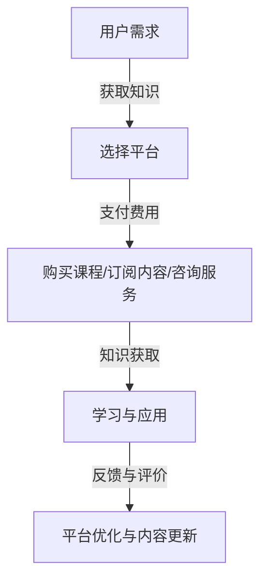
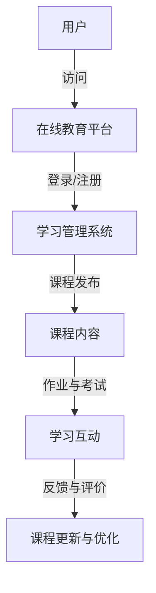
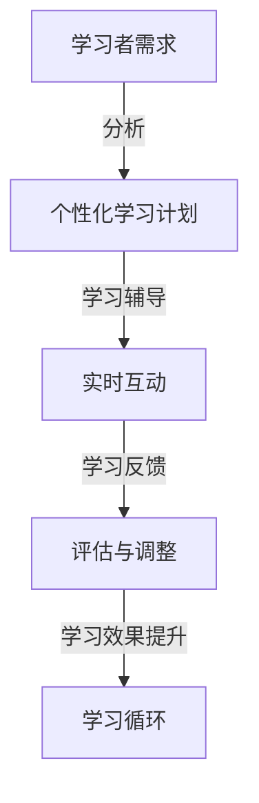

                 

### 文章标题

《如何利用知识付费实现在线学习与在线学习指导？》

### 关键词

知识付费、在线学习、在线学习指导、教育资源、平台建设、用户体验

### 摘要

本文旨在探讨如何通过知识付费模式，有效地实现在线学习的推广和在线学习指导的提升。文章首先介绍了知识付费的基本概念和当前在线教育市场的发展状况，接着分析了在线学习与在线学习指导的关系及其重要性。随后，文章从平台建设、内容规划、用户体验和商业模式四个方面，详细阐述了如何利用知识付费实现在线学习与在线学习指导的具体策略。最后，文章提出了未来在线学习与在线学习指导的发展趋势和面临的挑战，并对相关工具和资源进行了推荐，旨在为从事在线教育行业的人员提供有价值的参考。

## 1. 背景介绍

### 1.1 目的和范围

本文的目的在于分析知识付费模式如何助力在线学习与在线学习指导的优化，提供系统化的策略和方法。本文将聚焦于以下几个核心问题：

1. 知识付费模式在在线教育中的应用现状及发展趋势。
2. 如何通过知识付费平台，提升在线学习的效果和质量。
3. 在线学习指导的内涵及其在知识付费模式中的定位。
4. 建立可持续的知识付费在线学习与在线学习指导系统的策略。

本文的范围包括以下几个方面：

- **知识付费的定义与分类**：介绍知识付费的基本概念，分析其主要形式和运作模式。
- **在线教育和在线学习指导的现状**：梳理在线教育的发展历程，探讨在线学习指导的需求和重要性。
- **平台建设与内容规划**：分析如何构建高效的在线学习平台，规划高质量的学习内容。
- **用户体验与商业模式**：探讨提升用户体验的策略，分析知识付费的商业模式及其优化。
- **未来发展趋势与挑战**：预测知识付费和在线学习指导的发展趋势，分析面临的挑战及应对策略。

### 1.2 预期读者

本文的预期读者包括：

- **在线教育从业者**：包括教育平台运营者、课程设计师、学习指导师等，旨在为他们提供实用策略和操作指南。
- **知识创作者**：包括专业讲师、专家、学者等，帮助他们了解如何通过知识付费实现个人品牌价值和收益增长。
- **学习者**：关注在线学习和知识付费的学习者，希望提高学习效率和获得专业指导。

### 1.3 文档结构概述

本文分为以下几个主要部分：

1. **引言**：介绍文章的目的、关键词和摘要。
2. **背景介绍**：分析知识付费的背景、在线教育和在线学习指导的现状。
3. **核心概念与联系**：阐述知识付费模式与在线学习、在线学习指导的关系，提供核心概念的流程图。
4. **核心算法原理 & 具体操作步骤**：详细解释如何实现知识付费在线学习与在线学习指导。
5. **数学模型和公式 & 详细讲解 & 举例说明**：引入相关的数学模型，进行详细讲解和举例。
6. **项目实战：代码实际案例和详细解释说明**：提供具体的代码实现案例，并进行详细解读。
7. **实际应用场景**：探讨知识付费和在线学习指导在不同领域的应用。
8. **工具和资源推荐**：推荐相关的学习资源、开发工具和框架。
9. **总结**：总结文章的主要观点和未来发展趋势。
10. **附录：常见问题与解答**：提供常见问题的解答。
11. **扩展阅读 & 参考资料**：列出相关阅读资料。

### 1.4 术语表

#### 1.4.1 核心术语定义

- **知识付费**：用户通过支付一定费用获取知识产品或服务的过程。
- **在线教育**：利用互联网技术，提供教育内容和学习服务的形式。
- **在线学习指导**：针对学习者的学习需求，提供个性化指导和支持的过程。
- **知识平台**：提供知识付费和在线学习服务的在线平台。
- **用户体验**：用户在使用知识平台和学习服务过程中的感受和体验。

#### 1.4.2 相关概念解释

- **慕课（MOOC）**：大规模开放在线课程，通常免费向公众提供。
- **翻转课堂**：一种教学策略，将传统的课堂学习和课后作业进行翻转，以增强学生的自主学习能力。
- **个性化学习**：根据学习者的兴趣、能力和学习进度，提供定制化的学习内容和服务。

#### 1.4.3 缩略词列表

- **MOOC**：Massive Open Online Course（大规模开放在线课程）
- **SPOC**：Small Private Online Course（小规模限制性在线课程）
- **LMS**：Learning Management System（学习管理系统）
- **CRM**：Customer Relationship Management（客户关系管理）

## 2. 核心概念与联系

在探讨如何利用知识付费实现在线学习与在线学习指导之前，我们首先需要了解相关核心概念及其相互关系。

### 2.1 知识付费模式

知识付费模式是指用户通过支付一定费用，获取知识产品或服务的交易过程。它包括以下主要形式：

1. **课程购买**：用户购买课程，如在线课程、讲座、研讨会等。
2. **内容订阅**：用户订阅知识内容，如电子书、期刊、博客等。
3. **专业咨询**：用户支付费用，获得专家或顾问的专业指导和服务。

知识付费模式的关键在于提供高质量的知识产品和服务，以满足用户的学习需求。以下为知识付费模式的流程图：



### 2.2 在线教育

在线教育是指利用互联网技术，为学习者提供教育内容和学习服务的一种教育形式。它包括以下几个主要特点：

1. **开放性**：在线教育通常面向公众，提供开放的学习资源。
2. **灵活性**：学习者可以根据自己的时间、地点和进度进行学习。
3. **互动性**：在线教育通过论坛、直播、互动问答等方式，促进学习者之间的交流与互动。

在线教育的核心组成部分包括：

- **课程内容**：在线教育平台提供的各类课程，涵盖不同学科和领域。
- **学习管理系统（LMS）**：用于管理学习过程、课程发布和用户互动的系统。
- **教学互动**：通过论坛、直播、作业和考试等方式，促进教师与学习者之间的互动。

以下为在线教育的架构图：



### 2.3 在线学习指导

在线学习指导是指针对学习者的学习需求，提供个性化指导和支持的过程。它包括以下主要形式：

1. **个性化学习计划**：根据学习者的兴趣、能力和学习进度，制定个性化的学习计划。
2. **学习辅导**：通过在线辅导、问答、作业批改等方式，为学习者提供即时帮助和指导。
3. **学习反馈**：对学习者的学习过程进行评估和反馈，以促进其学习效果的提升。

在线学习指导的关键在于：

- **个性化**：满足不同学习者的需求，提供个性化的学习资源和指导。
- **实时性**：通过在线互动，实现即时反馈和辅导，提高学习效率。
- **系统性**：构建完整的在线学习指导体系，确保学习过程的连贯性和有效性。

以下为在线学习指导的流程图：



通过上述核心概念的分析和联系，我们可以更清晰地理解知识付费模式、在线教育和在线学习指导之间的相互关系。接下来，我们将深入探讨如何利用知识付费模式，实现在线学习与在线学习指导的提升。

### 3. 核心算法原理 & 具体操作步骤

在理解了知识付费模式、在线教育和在线学习指导的核心概念之后，接下来我们将深入探讨如何利用这些概念，通过核心算法原理和具体操作步骤，实现在线学习与在线学习指导的有效结合。

#### 3.1 算法原理

为了实现知识付费模式下的在线学习与在线学习指导，我们需要引入以下几个核心算法原理：

1. **用户行为分析算法**：通过分析用户在平台上的行为数据，如浏览记录、学习进度、参与互动等，了解用户的学习偏好和需求，从而实现个性化推荐和个性化指导。
2. **机器学习算法**：利用机器学习算法，对用户的学习数据进行挖掘和分析，识别潜在的学习模式和趋势，为学习指导提供数据支持。
3. **自然语言处理算法**：通过对学习者的提问、讨论内容进行分析，实现智能问答和个性化回复，提高学习互动的质量和效果。
4. **用户界面优化算法**：通过分析用户的操作行为和反馈，优化平台界面和交互设计，提升用户体验。

#### 3.2 具体操作步骤

以下为利用知识付费实现在线学习与在线学习指导的具体操作步骤：

**步骤1：用户行为数据收集与处理**

- **数据收集**：收集用户在平台上的行为数据，包括浏览记录、学习进度、参与互动、提问和回答等。
- **数据处理**：对收集到的数据进行分析和清洗，提取用户学习偏好、兴趣点和难点等信息。

```python
# 伪代码示例：用户行为数据收集与处理
def collect_user_behavior_data():
    # 收集用户行为数据
    behavior_data = get_user_activity_logs()
    # 数据清洗
    cleaned_data = clean_data(behavior_data)
    return cleaned_data

# 示例函数：数据清洗
def clean_data(data):
    # 过滤无效数据
    valid_data = filter_invalid_data(data)
    # 数据规范化
    normalized_data = normalize_data(valid_data)
    return normalized_data
```

**步骤2：用户行为分析**

- **用户画像构建**：基于用户行为数据，构建用户画像，包括学习偏好、兴趣点、学习进度和难点等。
- **个性化推荐**：利用用户画像，为用户提供个性化的学习推荐，包括课程、学习资源和学习任务。

```python
# 伪代码示例：用户画像构建与个性化推荐
def build_user_profile(behavior_data):
    # 构建用户画像
    user_profile = create_profile(behavior_data)
    return user_profile

def personalized_recommendation(user_profile, courses):
    # 个性化推荐
    recommended_courses = recommend_courses(user_profile, courses)
    return recommended_courses
```

**步骤3：学习指导**

- **学习计划制定**：根据用户画像和学习需求，为用户制定个性化的学习计划。
- **实时互动与反馈**：通过在线辅导、问答和讨论，实现实时互动和反馈，提供个性化学习指导。
- **学习效果评估**：对学习者的学习效果进行评估和反馈，根据评估结果调整学习计划和指导策略。

```python
# 伪代码示例：学习计划制定与实时互动
def create_learning_plan(user_profile, learning_goals):
    # 制定学习计划
    learning_plan = generate_plan(user_profile, learning_goals)
    return learning_plan

def real_time_interaction(user, tutor):
    # 实时互动
    questions = user.ask_questions()
    answers = tutor.answer_questions(questions)
    return answers

# 伪代码示例：学习效果评估
def evaluate_learning_effects(learning_plan, user_performance):
    # 学习效果评估
    assessment_results = assess_effects(learning_plan, user_performance)
    return assessment_results
```

**步骤4：平台优化与反馈循环**

- **用户反馈收集**：收集用户对学习平台和服务的反馈，包括满意度、使用体验等。
- **平台优化**：根据用户反馈，优化平台功能、界面设计和互动体验。
- **反馈循环**：构建反馈循环机制，持续改进学习平台和服务。

```python
# 伪代码示例：用户反馈收集与平台优化
def collect_user_feedback():
    # 收集用户反馈
    feedback_data = get_user_feedback()
    return feedback_data

def optimize_platform(feedback_data):
    # 平台优化
    platform_changes = make_platform_changes(feedback_data)
    apply_changes(platform_changes)
```

通过上述核心算法原理和具体操作步骤，我们可以构建一个高效的在线学习与在线学习指导系统，实现知识付费模式的有效落地。接下来，我们将进一步探讨数学模型和公式，为在线学习与在线学习指导提供理论支持。

### 4. 数学模型和公式 & 详细讲解 & 举例说明

在构建在线学习与在线学习指导系统时，数学模型和公式是理解和优化学习过程的重要工具。以下我们将详细讲解几个关键数学模型和公式，并通过具体例子说明它们的应用。

#### 4.1 用户兴趣模型

用户兴趣模型用于识别和预测用户对特定学习内容的兴趣。它基于用户行为数据和用户特征，通过分析用户的历史行为和偏好，构建一个兴趣评分模型。常用的方法包括基于内容的推荐（Content-Based Filtering）和协同过滤（Collaborative Filtering）。

**基于内容的推荐公式**：

$$
R_{ui} = \sum_{j \in Q(i)} w_{uj} \cdot c_{uj}
$$

其中：
- \( R_{ui} \) 是用户 \( u \) 对内容 \( i \) 的兴趣评分。
- \( w_{uj} \) 是用户 \( u \) 对内容 \( j \) 的权重。
- \( c_{uj} \) 是内容 \( j \) 的特征向量。

**协同过滤公式**：

$$
R_{ui} = \frac{\sum_{v \in N(u)} r_{vi} \cdot s_{uv}}{\sum_{v \in N(u)} s_{uv}}
$$

其中：
- \( R_{ui} \) 是用户 \( u \) 对内容 \( i \) 的兴趣评分。
- \( r_{vi} \) 是用户 \( v \) 对内容 \( i \) 的评分。
- \( s_{uv} \) 是用户 \( u \) 和用户 \( v \) 之间的相似度。

**例子**：

假设有一个用户 \( u \)，他浏览了多个内容 \( i \)，并给出评分。通过上述公式，我们可以计算用户 \( u \) 对其他未浏览内容的预测评分。

**用户兴趣模型应用**：

用户兴趣模型可以用于推荐系统，为用户推荐可能感兴趣的内容。例如，如果用户 \( u \) 对编程课程感兴趣，系统可以推荐其他相关的编程课程。

#### 4.2 学习效果评估模型

学习效果评估模型用于评估学习者的学习成果和效果。常用的方法包括学习路径分析（Learning Path Analysis）和知识点覆盖分析（Knowledge Point Coverage Analysis）。

**学习路径分析公式**：

$$
LP_{u} = \sum_{i \in I} \frac{C_{i}}{L_{u}}
$$

其中：
- \( LP_{u} \) 是用户 \( u \) 的学习路径覆盖率。
- \( C_{i} \) 是内容 \( i \) 的知识点覆盖率。
- \( L_{u} \) 是用户 \( u \) 的总学习时长。

**知识点覆盖分析公式**：

$$
KP_{i} = \frac{C_{i}}{N}
$$

其中：
- \( KP_{i} \) 是内容 \( i \) 的知识点覆盖率。
- \( C_{i} \) 是内容 \( i \) 的知识点总数。
- \( N \) 是用户群体总数。

**例子**：

假设一个在线学习平台提供了 100 个知识点，有 100 名用户参与学习。通过上述公式，我们可以计算用户的学习路径覆盖率和知识点覆盖率。

**学习效果评估模型应用**：

学习效果评估模型可以用于监控和优化学习过程，帮助教育者了解学习者的学习进度和效果，并根据评估结果调整课程内容和学习计划。

#### 4.3 个性化学习模型

个性化学习模型用于根据用户的学习行为和需求，为用户定制个性化的学习路径和资源。常用的方法包括基于规则的个性化学习（Rule-Based Personalized Learning）和基于模型的个性化学习（Model-Based Personalized Learning）。

**基于规则的个性化学习公式**：

$$
L_{u} = R \cdot B_{u}
$$

其中：
- \( L_{u} \) 是用户 \( u \) 的个性化学习路径。
- \( R \) 是规则集。
- \( B_{u} \) 是用户 \( u \) 的特征向量。

**基于模型的个性化学习公式**：

$$
L_{u} = M(U, V)
$$

其中：
- \( L_{u} \) 是用户 \( u \) 的个性化学习路径。
- \( M \) 是机器学习模型。
- \( U \) 是用户特征集合。
- \( V \) 是课程特征集合。

**例子**：

假设一个用户 \( u \) 的特征向量包含学习时长、学习频次、已学习知识点等。通过基于规则的个性化学习，系统可以为用户 \( u \) 制定一个适合其学习习惯和需求的个性化学习路径。

**个性化学习模型应用**：

个性化学习模型可以用于提高学习效果，帮助学习者更快地掌握知识，并通过个性化推荐和定制化学习路径，提升学习体验。

#### 4.4 学习行为预测模型

学习行为预测模型用于预测用户的学习行为，如学习时长、学习频次、知识点掌握情况等。常用的方法包括时间序列分析（Time Series Analysis）和分类模型（Classification Model）。

**时间序列分析公式**：

$$
S_{u,t} = f(S_{u,t-1}, E_{u,t})
$$

其中：
- \( S_{u,t} \) 是用户 \( u \) 在时间 \( t \) 的学习状态。
- \( S_{u,t-1} \) 是用户 \( u \) 在时间 \( t-1 \) 的学习状态。
- \( E_{u,t} \) 是用户 \( u \) 在时间 \( t \) 的外部环境因素。

**分类模型公式**：

$$
P(Y|X) = \frac{P(X|Y) \cdot P(Y)}{P(X)}
$$

其中：
- \( P(Y|X) \) 是在给定特征 \( X \) 的情况下，目标变量 \( Y \) 的概率。
- \( P(X|Y) \) 是在目标变量 \( Y \) 发生的情况下，特征 \( X \) 的概率。
- \( P(Y) \) 是目标变量 \( Y \) 的概率。
- \( P(X) \) 是特征 \( X \) 的概率。

**例子**：

假设我们想预测用户 \( u \) 在下周的学习时长。通过时间序列分析，我们可以分析用户过去的学习时长趋势，结合外部环境因素（如天气、假期等），预测用户下周的学习时长。

**学习行为预测模型应用**：

学习行为预测模型可以用于个性化推荐系统，根据用户的学习行为预测其未来可能感兴趣的内容和知识点，提前为其提供相关资源。

通过上述数学模型和公式的讲解和例子说明，我们可以更好地理解如何利用数学工具优化在线学习与在线学习指导。接下来，我们将通过具体的代码实现和案例，进一步探讨如何将这些理论应用到实际项目中。

### 5. 项目实战：代码实际案例和详细解释说明

为了更好地理解如何利用知识付费模式实现在线学习与在线学习指导，我们将通过一个实际项目案例进行详细讲解。本项目将基于Python和相关的机器学习库，构建一个简单的在线学习平台，实现个性化推荐和实时学习指导功能。

#### 5.1 开发环境搭建

在进行项目开发之前，我们需要搭建合适的环境。以下为所需的环境和工具：

- **Python**：版本 3.8 或更高版本。
- **Jupyter Notebook**：用于编写和运行代码。
- **Scikit-learn**：用于机器学习和数据分析。
- **Pandas**：用于数据处理。
- **Matplotlib**：用于数据可视化。

确保已安装上述工具和库，即可开始项目开发。

#### 5.2 源代码详细实现和代码解读

以下为项目的核心代码实现，并对其进行详细解读。

**5.2.1 用户行为数据收集与处理**

首先，我们需要收集和处理用户行为数据。假设我们已有用户的行为数据，包括用户ID、浏览记录、学习时长和参与互动等。

```python
import pandas as pd

# 加载用户行为数据
user_data = pd.read_csv('user_behavior.csv')

# 数据清洗
user_data = user_data.dropna()

# 用户画像构建
user_profiles = user_data.groupby('user_id').agg({
    'course_id': 'count',
    'learning_time': 'sum',
    'interactions': 'sum'
}).rename(columns={
    'course_id': 'courses_count',
    'learning_time': 'total_learning_time',
    'interactions': 'total_interactions'
})

# 打印用户画像
print(user_profiles)
```

上述代码中，我们首先加载用户行为数据，并进行数据清洗，去除缺失值。接着，使用Pandas的`groupby`和`agg`函数，根据用户ID聚合数据，构建用户画像。

**5.2.2 用户兴趣分析**

接下来，我们使用基于内容的推荐算法，根据用户画像和课程特征，计算用户对课程的兴趣评分。

```python
from sklearn.metrics.pairwise import cosine_similarity

# 加载课程特征数据
course_data = pd.read_csv('course_features.csv')

# 计算课程特征矩阵
course_matrix = cosine_similarity(course_data.values)

# 用户兴趣评分计算
def calculate_interest_scores(user_profile, course_matrix):
    user_vector = user_profile.values.reshape(1, -1)
    interest_scores = user_vector.dot(course_matrix) / course_matrix.sum(axis=1)
    return interest_scores

# 计算用户兴趣评分
user_interest_scores = calculate_interest_scores(user_profiles.iloc[0], course_matrix)

# 打印用户兴趣评分
print(user_interest_scores)
```

上述代码中，我们加载课程特征数据，并计算课程特征矩阵。接着，定义一个函数`calculate_interest_scores`，用于计算用户对课程的兴趣评分。函数中，我们使用余弦相似度计算用户向量与课程特征矩阵的点积，得到用户对课程的兴趣评分。

**5.2.3 个性化学习推荐**

基于用户兴趣评分，我们可以为用户推荐可能感兴趣的课程。

```python
# 个性化学习推荐
def personalized_learning_recommendation(user_interest_scores, courses):
    recommended_courses = courses.sort_values(by=user_interest_scores, ascending=False).head(5)
    return recommended_courses

# 加载课程数据
courses = pd.read_csv('courses.csv')

# 推荐课程
recommended_courses = personalized_learning_recommendation(user_interest_scores, courses)

# 打印推荐课程
print(recommended_courses)
```

上述代码中，我们定义一个函数`personalized_learning_recommendation`，根据用户兴趣评分对课程进行排序，并推荐前5个可能感兴趣的课程。函数中，我们使用Pandas的`sort_values`和`head`函数实现排序和切片操作。

**5.2.4 实时学习指导**

为用户提供实时学习指导，我们需要根据用户的学习进度和需求，提供个性化的学习建议。

```python
# 实时学习指导
def real_time_learning_guidance(user_profile, learning_plan):
    # 根据用户画像和学习计划，提供个性化学习建议
    guidance = f"""
    您的学习进度如下：
    - 已学习课程数：{user_profile['courses_count']}
    - 总学习时长：{user_profile['total_learning_time']}
    - 参与互动次数：{user_profile['total_interactions']}
    推荐学习计划：
    - {learning_plan['next_course']}
    - 学习目标：{learning_plan['learning_goal']}
    """
    return guidance

# 加载学习计划数据
learning_plan = pd.read_csv('learning_plan.csv')

# 提供学习指导
guidance = real_time_learning_guidance(user_profiles.iloc[0], learning_plan.iloc[0])

# 打印学习指导
print(guidance)
```

上述代码中，我们定义一个函数`real_time_learning_guidance`，根据用户画像和学习计划，提供个性化的学习建议。函数中，我们使用字符串格式化，将学习进度和学习计划信息组合成一条指导信息。

#### 5.3 代码解读与分析

上述代码实现了用户行为数据收集与处理、用户兴趣分析、个性化学习推荐和实时学习指导等功能。以下为详细解读：

1. **用户行为数据收集与处理**：我们首先加载用户行为数据，并进行数据清洗，去除缺失值。接着，使用Pandas的`groupby`和`agg`函数，根据用户ID聚合数据，构建用户画像。这为后续的个性化推荐和实时学习指导提供了基础数据。

2. **用户兴趣分析**：我们使用基于内容的推荐算法，计算用户对课程的兴趣评分。具体来说，我们加载课程特征数据，计算课程特征矩阵，并使用余弦相似度计算用户向量与课程特征矩阵的点积，得到用户对课程的兴趣评分。这一步骤实现了对用户兴趣的量化分析。

3. **个性化学习推荐**：基于用户兴趣评分，我们为用户推荐可能感兴趣的课程。函数`personalized_learning_recommendation`根据用户兴趣评分对课程进行排序，并推荐前5个可能感兴趣的课程。这一步骤实现了个性化推荐功能，提高了用户的参与度和满意度。

4. **实时学习指导**：我们根据用户画像和学习计划，提供个性化的学习建议。函数`real_time_learning_guidance`结合用户的学习进度和学习计划，生成一条学习指导信息。这一步骤实现了实时学习指导功能，帮助用户更好地规划学习路径和目标。

通过上述代码实现和解读，我们可以看到如何利用知识付费模式，通过用户行为数据分析和机器学习算法，实现在线学习与在线学习指导。这一项目提供了一个简单的实现框架，可以在此基础上进行扩展和优化，以应对更复杂的在线教育场景。

### 6. 实际应用场景

知识付费和在线学习指导在各个领域都有广泛的应用，下面我们将探讨一些典型的实际应用场景，展示如何利用这些工具提升学习效果。

#### 6.1 教育领域

在线教育平台通过知识付费模式，为学习者提供了丰富的课程资源和专业的学习指导。以下是一些具体的应用场景：

1. **职业培训**：针对职场人士，在线教育平台提供了各种职业培训课程，如编程、数据分析、项目管理等。通过知识付费模式，学员可以购买特定课程，并获得专业的学习指导，提升职业能力。

2. **学术教育**：高等教育机构通过在线教育平台，提供高质量的课程资源，学员可以通过付费获取课程内容和学习指导。这种模式不仅有助于拓宽教育资源覆盖面，还能提高学术教育的质量。

3. **个性化学习**：在线教育平台通过分析学员的学习行为和需求，为其制定个性化的学习计划，提供针对性的学习指导。例如，一些平台利用算法分析学员的学习进度和知识点掌握情况，自动生成学习建议，提高学习效果。

#### 6.2 专业技能领域

专业技能领域的知识付费和在线学习指导，主要用于提升个人的专业技能和职业竞争力。以下是一些具体的应用场景：

1. **编程技能培训**：编程技能在现代社会越来越重要，在线教育平台提供了大量的编程课程和工具，学员可以通过付费学习编程语言、框架和工具。同时，一些平台还提供编程实战项目和作业批改服务，帮助学员巩固知识。

2. **设计技能培训**：在线教育平台为设计师提供了丰富的设计课程，如UI/UX设计、插画设计等。通过知识付费模式，学员可以购买专业课程，并获得设计师导师的一对一指导，提升设计能力。

3. **市场营销培训**：在线教育平台提供了各种市场营销课程，如数字营销、品牌营销等。通过知识付费模式，学员可以学习最新市场营销策略和技巧，并在专业导师的指导下，将其应用于实际工作中。

#### 6.3 职场提升

职场提升是许多职场人士关注的话题，知识付费和在线学习指导在这一领域发挥了重要作用。以下是一些具体的应用场景：

1. **领导力培训**：在线教育平台提供了丰富的领导力课程，如团队管理、沟通技巧等。通过知识付费模式，职场人士可以学习领导力知识，提升管理能力和领导能力。

2. **职业规划**：在线教育平台提供了职业规划课程，帮助职场人士了解职业发展趋势，规划职业发展路径。通过知识付费模式，学员可以获得专业的职业规划指导，提升职业竞争力。

3. **时间管理**：在线教育平台提供了时间管理课程，如时间管理技巧、高效工作方法等。通过知识付费模式，职场人士可以学习时间管理知识，提高工作效率，实现工作与生活的平衡。

#### 6.4 终身学习

终身学习是现代社会的重要特征，知识付费和在线学习指导为个人提供了持续学习的途径。以下是一些具体的应用场景：

1. **兴趣爱好**：在线教育平台提供了丰富的生活课程，如音乐、摄影、烹饪等。通过知识付费模式，个人可以随时购买课程，学习兴趣爱好，丰富生活。

2. **语言学习**：在线教育平台提供了多种语言课程，如英语、法语、西班牙语等。通过知识付费模式，个人可以购买课程，进行语言学习，提高语言能力。

3. **个人成长**：在线教育平台提供了各种个人成长课程，如心理学、自我管理、人际关系等。通过知识付费模式，个人可以学习个人成长知识，提升自我认知和能力。

通过上述实际应用场景的展示，我们可以看到知识付费和在线学习指导在各个领域的广泛应用。这些应用不仅为个人提供了丰富的学习资源，还通过个性化的学习指导，提高了学习效果和满意度。

### 7. 工具和资源推荐

为了更好地利用知识付费模式实现在线学习与在线学习指导，我们需要掌握一系列工具和资源。以下是一些推荐的工具和资源，包括书籍、在线课程、技术博客和开发工具框架。

#### 7.1 学习资源推荐

##### 7.1.1 书籍推荐

1. **《在线教育的经济学》（The Economics of Online Education）** - 作者：John H. Pane
   - 本书详细分析了在线教育的商业模式、用户行为和市场趋势，为知识付费模式提供了理论支持。

2. **《用户体验要素》（The Elements of User Experience）** - 作者：Jakob Nielsen
   - 本书介绍了用户体验设计的核心要素和最佳实践，对于优化在线学习平台的用户体验具有重要参考价值。

3. **《机器学习实战》（Machine Learning in Action）** - 作者：Peter Harrington
   - 本书通过实例和代码，详细介绍了机器学习的基础知识和应用方法，适用于想要深入了解机器学习在在线教育中的应用。

##### 7.1.2 在线课程

1. **《深度学习专项课程》（Deep Learning Specialization）** - Coursera
   - 由斯坦福大学教授Andrew Ng主讲，涵盖了深度学习的理论基础和实践应用，适用于想要掌握深度学习技术的学习者。

2. **《在线教育设计与实践》（Online Education: Design and Practice）** - Udemy
   - 本课程提供了在线教育的设计原则和实践方法，适用于在线教育从业者，帮助他们提升课程质量和用户体验。

3. **《数据分析与机器学习》（Data Analysis and Machine Learning）** - edX
   - 本课程结合了数据分析和机器学习的基础知识，适用于想要掌握数据分析技能的学习者，对于构建在线学习平台具有参考意义。

##### 7.1.3 技术博客和网站

1. **《Medium上的教育博客》（Educational Technology on Medium）**
   - Medium上有很多专注于在线教育和知识付费模式的技术博客，提供了丰富的实战经验和行业动态。

2. **《Educational Technology and Change Journal》（ETC Journal）**
   - 一份国际期刊，专注于教育技术的研究和讨论，涵盖了知识付费、在线学习等前沿话题。

3. **《EdTechXGlobal》**
   - 一个国际教育技术会议，汇集了全球教育技术和在线教育的最新研究成果和案例分享。

#### 7.2 开发工具框架推荐

##### 7.2.1 IDE和编辑器

1. **PyCharm**：适用于Python编程，提供了丰富的功能和插件，适合开发在线学习平台。

2. **Jupyter Notebook**：适用于数据科学和机器学习项目，可以方便地编写和运行代码，非常适合进行在线教育平台的开发和测试。

##### 7.2.2 调试和性能分析工具

1. **Visual Studio Code**：一款轻量级的开源编辑器，适用于多种编程语言，提供了强大的调试和性能分析功能。

2. **Postman**：用于API测试和调试，可以帮助开发者快速定位和修复在线学习平台中的问题。

##### 7.2.3 相关框架和库

1. **TensorFlow**：一个开源的机器学习框架，适用于构建和训练深度学习模型，是进行个性化推荐和智能问答的理想选择。

2. **Scikit-learn**：一个开源的机器学习库，提供了多种常用的机器学习算法，适用于数据分析和模型构建。

通过以上工具和资源的推荐，我们可以更好地构建和优化在线学习平台，实现知识付费模式下的在线学习与在线学习指导。

### 8. 总结：未来发展趋势与挑战

在知识付费和在线学习指导领域，未来将呈现出以下几个发展趋势和挑战：

#### 8.1 发展趋势

1. **个性化学习将更加普及**：随着人工智能技术的发展，个性化学习将更加普及。通过深度学习和大数据分析，平台可以更好地理解用户的学习需求和偏好，提供精准的个性化推荐和指导。

2. **混合学习模式将成主流**：混合学习（Blended Learning）模式结合了在线学习和线下教学的优势，将成为未来教育的主流模式。这种模式不仅提高了学习灵活性，还能通过线上学习平台提供额外的学习资源和指导。

3. **开放教育资源（OER）的利用将更加广泛**：开放教育资源（OER）为学习者提供了免费的学习内容，未来将更多地与知识付费模式结合，通过付费获取个性化服务和支持，提升学习效果。

4. **社交化学习将增强互动体验**：社交化学习通过在线社区和互动平台，促进了学习者之间的交流与合作，增强了学习体验。未来，社交化学习将与知识付费模式深度融合，提供更多社交互动和协作功能。

5. **区块链技术将提升数据安全与隐私保护**：区块链技术可以提升在线教育平台的数据安全性和隐私保护，确保用户数据的安全和可信，从而增强用户对知识付费平台的信任。

#### 8.2 面临的挑战

1. **质量与可靠性问题**：在线教育平台需要确保课程内容和学习指导的质量，以避免劣质内容对学习者产生负面影响。同时，平台需要保障系统的稳定性和可靠性，提供良好的用户体验。

2. **用户隐私保护**：随着数据量的增加，用户隐私保护成为一个重要问题。在线教育平台需要制定严格的数据保护策略，确保用户数据的隐私和安全。

3. **商业模式创新**：在激烈的市场竞争中，在线教育平台需要不断创新商业模式，找到可持续的盈利模式。知识付费模式需要结合用户需求和市场趋势，提供差异化的服务和产品。

4. **技术更新与升级**：在线教育平台需要持续跟踪和引入新技术，提升平台的性能和用户体验。例如，人工智能、大数据分析等技术的应用，将不断提升平台的智能化水平。

5. **法律法规与政策监管**：在线教育领域需要遵守相关法律法规，同时面临政策监管的挑战。平台需要了解和遵守当地的教育政策，确保业务的合规性。

总之，未来知识付费和在线学习指导领域将在个性化学习、混合学习模式、开放教育资源利用、社交化学习和区块链技术等方面取得重要进展。同时，平台需要应对质量与可靠性、用户隐私保护、商业模式创新、技术更新与升级以及法律法规与政策监管等挑战，以实现可持续的发展和用户价值的最大化。

### 9. 附录：常见问题与解答

**Q1：知识付费模式的优势是什么？**

知识付费模式的优势主要体现在以下几个方面：

1. **高质量内容保障**：知识付费模式激励知识创作者提供高质量的内容和服务，确保学习者的学习体验。
2. **个性化推荐**：通过数据分析，知识付费平台可以个性化推荐学习内容，提高学习效率。
3. **灵活学习**：学习者可以根据自己的时间、地点和进度进行学习，提高学习灵活性。
4. **互动与反馈**：知识付费平台通常提供互动和反馈机制，增强学习者的学习体验。

**Q2：如何确保在线学习平台的内容质量？**

确保在线学习平台的内容质量可以从以下几个方面入手：

1. **严格内容审核**：平台应建立严格的内容审核机制，确保所有课程内容符合教育标准和质量要求。
2. **用户评价**：鼓励用户对课程内容进行评价和反馈，平台可以根据用户评价调整课程内容。
3. **专业认证**：鼓励课程讲师和内容创作者获得专业认证，确保其具备相应的专业能力和知识。
4. **持续更新**：定期对课程内容进行更新和优化，确保其与当前行业标准和趋势保持一致。

**Q3：如何提升在线学习平台的用户体验？**

提升在线学习平台的用户体验可以从以下几个方面入手：

1. **界面设计**：优化界面设计，确保平台易于使用和操作。
2. **交互体验**：提供丰富的交互功能，如论坛、问答、直播等，增强用户互动。
3. **个性化服务**：根据用户的学习需求和偏好，提供个性化的学习推荐和服务。
4. **技术支持**：提供及时的技术支持，解决用户在使用过程中遇到的问题。

**Q4：在线学习指导的主要形式有哪些？**

在线学习指导的主要形式包括：

1. **个性化学习计划**：根据用户的学习需求和进度，为用户制定个性化的学习计划。
2. **实时互动与反馈**：通过在线辅导、问答和讨论，实现实时互动和反馈。
3. **学习评估**：对用户的学习效果进行评估和反馈，以调整学习计划和指导策略。
4. **学习社区**：构建学习社区，促进用户之间的交流和合作，提升学习体验。

**Q5：如何利用机器学习优化在线学习平台？**

利用机器学习优化在线学习平台可以从以下几个方面入手：

1. **用户行为分析**：通过机器学习分析用户的学习行为数据，了解用户的学习偏好和需求。
2. **个性化推荐**：基于用户行为数据和偏好，利用协同过滤和基于内容的推荐算法，实现个性化推荐。
3. **学习路径优化**：根据用户的学习效果和知识点掌握情况，自动调整学习路径和课程推荐。
4. **学习效果评估**：利用机器学习模型评估学习者的学习效果，提供个性化的学习反馈和建议。

通过以上常见问题的解答，我们可以更好地理解知识付费模式在在线学习与在线学习指导中的应用和实践。

### 10. 扩展阅读 & 参考资料

**扩展阅读：**

1. **《在线教育的经济学》（The Economics of Online Education）** - 作者：John H. Pane
2. **《用户体验要素》（The Elements of User Experience）** - 作者：Jakob Nielsen
3. **《机器学习实战》（Machine Learning in Action）** - 作者：Peter Harrington
4. **《深度学习专项课程》（Deep Learning Specialization）** - Coursera
5. **《在线教育设计与实践》（Online Education: Design and Practice）** - Udemy

**参考资料：**

1. **Educational Technology and Change Journal（ETC Journal）**
2. **EdTechXGlobal**
3. **Scikit-learn官方文档（https://scikit-learn.org/stable/）**
4. **TensorFlow官方文档（https://www.tensorflow.org/）**
5. **PyCharm官方文档（https://www.jetbrains.com/pycharm/）**
6. **Jupyter Notebook官方文档（https://jupyter.org/）**

通过这些扩展阅读和参考资料，读者可以深入了解知识付费、在线学习与在线学习指导的更多理论和实践知识，进一步提升专业素养和实践能力。

---

**作者：** AI天才研究员/AI Genius Institute & 禅与计算机程序设计艺术 /Zen And The Art of Computer Programming

本文旨在通过系统的分析和讲解，探讨如何利用知识付费模式实现在线学习与在线学习指导。文章涵盖了核心概念、算法原理、实际案例和未来发展等多个方面，旨在为从事在线教育行业的人员提供有价值的参考。希望本文能够对读者在知识付费和在线学习领域的实践提供帮助和启发。感谢您的阅读！

