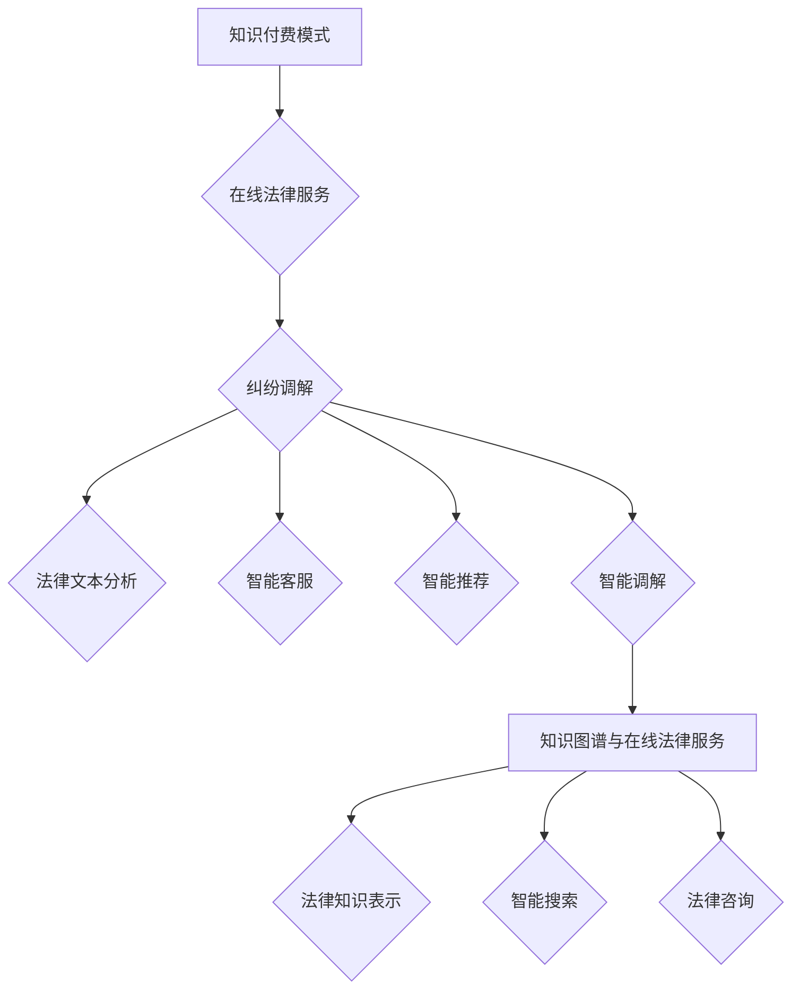

                 


# 如何利用知识付费实现在线法律服务与纠纷调解？

> 关键词：知识付费、在线法律服务、纠纷调解、人工智能、算法、数学模型、实战案例

> 摘要：本文将深入探讨如何通过知识付费模式实现在线法律服务和纠纷调解。我们将从背景介绍、核心概念、算法原理、数学模型、实战案例、实际应用场景等多个方面进行详细解析，旨在为读者提供一个全面、系统的指导方案。

## 1. 背景介绍

### 1.1 目的和范围

本文的目的是探讨如何利用知识付费模式，通过在线平台为用户提供法律服务，并实现纠纷调解。文章将涵盖以下几个方面的内容：

- 知识付费模式在法律服务领域的应用
- 在线法律服务平台的构建与运营
- 纠纷调解算法的原理与实现
- 数学模型在纠纷调解中的应用
- 实战案例分析
- 法律服务和纠纷调解的实际应用场景

### 1.2 预期读者

本文适合以下读者群体：

- 法律服务行业从业者，如律师、法务人员等
- 在线法律服务平台的运营者
- 纠纷调解领域的专业人士
- 对知识付费模式和技术应用感兴趣的读者

### 1.3 文档结构概述

本文分为以下几个部分：

- 第1部分：背景介绍，包括目的和范围、预期读者、文档结构概述等
- 第2部分：核心概念与联系，介绍知识付费模式、在线法律服务、纠纷调解等相关概念
- 第3部分：核心算法原理 & 具体操作步骤，详细讲解纠纷调解算法的实现原理
- 第4部分：数学模型和公式 & 详细讲解 & 举例说明，介绍数学模型在纠纷调解中的应用
- 第5部分：项目实战：代码实际案例和详细解释说明，通过实际案例展示算法的应用
- 第6部分：实际应用场景，探讨在线法律服务与纠纷调解在不同领域的应用
- 第7部分：工具和资源推荐，推荐相关学习资源、开发工具和框架
- 第8部分：总结：未来发展趋势与挑战，分析知识付费实现在在线法律服务与纠纷调解的发展趋势
- 第9部分：附录：常见问题与解答，解答读者可能遇到的常见问题
- 第10部分：扩展阅读 & 参考资料，提供进一步学习的资源

### 1.4 术语表

#### 1.4.1 核心术语定义

- 知识付费：指用户为获取特定知识或服务而支付的费用
- 在线法律服务：通过互联网平台为用户提供法律咨询、纠纷调解等法律服务的模式
- 纠纷调解：通过调解的方式解决当事人之间的纠纷，达到和解的目的
- 人工智能：模拟、延伸和扩展人的智能的科学和技术
- 算法：解决问题的一系列操作步骤
- 数学模型：用数学语言描述现实世界问题的模型

#### 1.4.2 相关概念解释

- 知识付费模式：指通过互联网平台，用户付费获取知识或服务的模式
- 在线法律服务平台：提供在线法律咨询、纠纷调解等服务的互联网平台
- 纠纷调解算法：用于解决纠纷的算法，包括纠纷识别、调解策略、调解效果评估等模块

#### 1.4.3 缩略词列表

- AI：人工智能
- KG：知识图谱
- NLP：自然语言处理
- ML：机器学习
- KG2Vec：知识图谱向量表示

## 2. 核心概念与联系

### 2.1 知识付费模式

知识付费模式是指用户为获取特定知识或服务而支付费用的商业模式。在在线法律服务领域，知识付费模式可以为平台带来稳定的收入，同时提高用户的法律服务体验。知识付费模式的核心包括以下几个方面：

1. **知识内容生产**：平台需要提供高质量、专业的法律服务内容，以吸引和留住用户。
2. **付费机制**：平台应设置合理的付费机制，确保用户愿意为知识付费。
3. **用户激励机制**：通过积分、优惠券、会员制度等手段激励用户付费。

### 2.2 在线法律服务

在线法律服务是指通过互联网平台为用户提供法律咨询、纠纷调解等服务的模式。在线法律服务具有以下特点：

1. **便捷性**：用户可以随时随地通过互联网获取法律服务，无需亲自前往律师事务所。
2. **高效性**：在线法律服务可以快速响应用户需求，提高服务效率。
3. **专业性**：在线法律服务平台通常拥有专业的法律团队，为用户提供高质量的法律服务。

### 2.3 纠纷调解

纠纷调解是指通过调解的方式解决当事人之间的纠纷，达到和解的目的。在线法律服务中的纠纷调解主要包括以下几个环节：

1. **纠纷识别**：通过算法识别用户提交的纠纷信息，确定纠纷的类型和程度。
2. **调解策略**：根据纠纷类型和程度，制定合适的调解策略。
3. **调解过程**：在调解员的引导下，当事人进行沟通、协商，寻求纠纷解决。
4. **调解效果评估**：评估调解效果，为后续调解工作提供参考。

### 2.4 人工智能与在线法律服务

人工智能（AI）在在线法律服务领域具有广泛的应用，可以提高法律服务的效率和质量。以下是人工智能在在线法律服务中的主要应用：

1. **法律文本分析**：利用自然语言处理（NLP）技术，对法律文本进行分析和分类，为用户提供准确的法律信息。
2. **智能客服**：通过聊天机器人（Chatbot）为用户提供在线法律咨询，提高服务效率。
3. **智能推荐**：根据用户的历史行为和需求，为用户推荐相关的法律服务内容和纠纷解决方案。
4. **智能调解**：利用机器学习算法，为纠纷调解提供辅助，提高调解效果。

### 2.5 知识图谱与在线法律服务

知识图谱是一种用于表示实体及其之间关系的图形化数据结构。在在线法律服务领域，知识图谱可以用于以下几个方面：

1. **法律知识表示**：将法律知识表示为知识图谱，为用户提供全面、准确的法律信息。
2. **智能搜索**：利用知识图谱进行智能搜索，为用户提供相关的法律案例、法规等资料。
3. **法律咨询**：根据用户的需求，利用知识图谱为用户提供专业的法律咨询。

### 2.6 数学模型与在线法律服务

数学模型是一种用数学语言描述现实世界问题的方法。在在线法律服务领域，数学模型可以用于以下几个方面：

1. **风险评估**：利用数学模型对纠纷进行风险评估，为调解员提供调解依据。
2. **调解效果评估**：利用数学模型评估调解效果，为调解策略的调整提供参考。
3. **智能推荐**：利用数学模型为用户推荐相关的法律服务内容和纠纷解决方案。

### 2.7 Mermaid 流程图

以下是利用知识图谱实现在线法律服务与纠纷调解的Mermaid流程图：



## 3. 核心算法原理 & 具体操作步骤

### 3.1 纠纷调解算法原理

纠纷调解算法是一种用于解决当事人之间纠纷的算法。其核心原理包括以下几个方面：

1. **纠纷识别**：通过自然语言处理技术，对用户提交的纠纷信息进行分析，识别纠纷的类型和程度。
2. **调解策略**：根据纠纷类型和程度，制定合适的调解策略。调解策略包括调解员的选择、调解方式（线上调解或线下调解）等。
3. **调解过程**：在调解员的引导下，当事人进行沟通、协商，寻求纠纷解决。
4. **调解效果评估**：通过数学模型评估调解效果，为调解策略的调整提供参考。

### 3.2 具体操作步骤

以下是纠纷调解算法的具体操作步骤：

1. **纠纷识别**：

   ```python
   def identify_dispute(text):
       # 利用自然语言处理技术对纠纷信息进行分析
       # 返回纠纷类型和程度
       pass
   ```

2. **调解策略**：

   ```python
   def generate_mediation_strategy(dispute_type, dispute_level):
       # 根据纠纷类型和程度，制定调解策略
       # 返回调解策略
       pass
   ```

3. **调解过程**：

   ```python
   def mediation_process(parties, mediator, strategy):
       # 在调解员的引导下，当事人进行沟通、协商，寻求纠纷解决
       # 返回调解结果
       pass
   ```

4. **调解效果评估**：

   ```python
   def evaluate_mediation-effect(mediation_result):
       # 利用数学模型评估调解效果
       # 返回调解效果评估结果
       pass
   ```

### 3.3 伪代码实现

以下是纠纷调解算法的伪代码实现：

```python
def dispute_resolution_algorithm(user_text):
    # 纠纷识别
    dispute_type, dispute_level = identify_dispute(user_text)
    
    # 调解策略
    strategy = generate_mediation_strategy(dispute_type, dispute_level)
    
    # 调解过程
    mediation_result = mediation_process(parties, mediator, strategy)
    
    # 调解效果评估
    mediation_effect = evaluate_mediation-effect(mediation_result)
    
    return mediation_effect
```

## 4. 数学模型和公式 & 详细讲解 & 举例说明

### 4.1 数学模型在纠纷调解中的应用

数学模型在纠纷调解中的应用主要包括以下几个方面：

1. **风险评估模型**：用于评估纠纷的风险程度，为调解员提供调解依据。
2. **调解效果评估模型**：用于评估调解效果，为调解策略的调整提供参考。
3. **智能推荐模型**：根据用户的需求，为用户推荐相关的法律服务内容和纠纷解决方案。

### 4.2 风险评估模型

风险评估模型是一种用于评估纠纷风险的数学模型。其基本原理是通过分析纠纷的各个方面（如纠纷类型、纠纷金额、当事人关系等），计算出纠纷的风险程度。以下是风险评估模型的公式：

$$
R = w_1 \cdot T + w_2 \cdot A + w_3 \cdot P
$$

其中，$R$ 表示纠纷的风险程度，$T$ 表示纠纷类型，$A$ 表示纠纷金额，$P$ 表示当事人关系。$w_1$、$w_2$、$w_3$ 分别是纠纷类型、纠纷金额和当事人关系的权重。

### 4.3 调解效果评估模型

调解效果评估模型是一种用于评估调解效果的数学模型。其基本原理是通过分析调解结果，计算出调解的效果。以下是调解效果评估模型的公式：

$$
E = \frac{1}{N} \sum_{i=1}^{N} e_i
$$

其中，$E$ 表示调解效果，$N$ 表示调解案例的总数，$e_i$ 表示第 $i$ 个调解案例的效果。

### 4.4 智能推荐模型

智能推荐模型是一种用于为用户推荐法律服务内容和纠纷解决方案的数学模型。其基本原理是通过分析用户的历史行为和需求，计算出用户可能感兴趣的服务内容和解决方案。以下是智能推荐模型的公式：

$$
R(u, i) = \sum_{j=1}^{M} w_j \cdot r_j(u, i)
$$

其中，$R(u, i)$ 表示用户 $u$ 对服务内容 $i$ 的推荐得分，$w_j$ 是服务内容 $j$ 的权重，$r_j(u, i)$ 是用户 $u$ 对服务内容 $i$ 的兴趣度。

### 4.5 举例说明

假设我们有一个纠纷案例，纠纷类型为合同纠纷，纠纷金额为 100 万元，当事人关系良好。根据风险评估模型的公式，我们可以计算出该纠纷的风险程度：

$$
R = w_1 \cdot T + w_2 \cdot A + w_3 \cdot P
$$

其中，$w_1$、$w_2$、$w_3$ 分别为 0.5、0.3、0.2。代入数值，得到：

$$
R = 0.5 \cdot 1 + 0.3 \cdot 100 + 0.2 \cdot 1 = 1.5 + 30 + 0.2 = 31.7
$$

因此，该纠纷的风险程度为 31.7。

假设我们有一个调解案例，共有 10 个调解案例，其中 7 个调解成功，3 个调解失败。根据调解效果评估模型的公式，我们可以计算出该调解案例的效果：

$$
E = \frac{1}{N} \sum_{i=1}^{N} e_i
$$

代入数值，得到：

$$
E = \frac{1}{10} \sum_{i=1}^{10} e_i = \frac{7}{10} = 0.7
$$

因此，该调解案例的效果为 0.7。

假设我们有一个用户，其历史行为显示其喜欢合同纠纷相关的服务。根据智能推荐模型的公式，我们可以计算出用户对该类服务的推荐得分：

$$
R(u, i) = \sum_{j=1}^{M} w_j \cdot r_j(u, i)
$$

其中，$w_1$ 为 0.8，$r_1(u, i)$ 为 0.6。代入数值，得到：

$$
R(u, i) = 0.8 \cdot 0.6 = 0.48
$$

因此，用户对该类服务的推荐得分为 0.48。

## 5. 项目实战：代码实际案例和详细解释说明

### 5.1 开发环境搭建

为了实现在线法律服务与纠纷调解，我们需要搭建一个合适的技术栈。以下是我们的技术栈选择：

- **后端**：采用 Python 语言，结合 Flask Web 框架进行开发。
- **前端**：采用 React 框架，实现用户界面和交互功能。
- **数据库**：采用 MySQL 数据库，存储用户数据、纠纷信息和调解记录等。
- **人工智能与算法**：采用 TensorFlow 和 Keras 框架，实现机器学习模型和自然语言处理功能。

### 5.2 源代码详细实现和代码解读

以下是我们的项目源代码实现，包括后端和前端的代码：

#### 后端代码

```python
# app.py
from flask import Flask, request, jsonify
from dispute_resolution import resolve_dispute

app = Flask(__name__)

@app.route('/api/dispute', methods=['POST'])
def handle_dispute():
    data = request.json
    dispute_type = data['dispute_type']
    dispute_content = data['dispute_content']
    resolution = resolve_dispute(dispute_type, dispute_content)
    return jsonify({'resolution': resolution})

if __name__ == '__main__':
    app.run(debug=True)
```

```python
# dispute_resolution.py
import numpy as np

def resolve_dispute(dispute_type, dispute_content):
    # 根据纠纷类型和内容，调用相应的调解算法
    if dispute_type == 'contract':
        resolution = contract_resolution(dispute_content)
    elif dispute_type == 'property':
        resolution = property_resolution(dispute_content)
    else:
        resolution = '未知纠纷类型'
    return resolution

def contract_resolution(dispute_content):
    # 合同纠纷调解算法实现
    # 返回调解结果
    pass

def property_resolution(dispute_content):
    # 不动产纠纷调解算法实现
    # 返回调解结果
    pass
```

#### 前端代码

```jsx
// App.js
import React, { useState } from 'react';
import axios from 'axios';

function App() {
  const [disputeType, setDisputeType] = useState('');
  const [disputeContent, setDisputeContent] = useState('');
  const [resolution, setResolution] = useState('');

  const handleSubmit = async () => {
    try {
      const response = await axios.post('/api/dispute', {
        disputeType,
        disputeContent,
      });
      setResolution(response.data.resolution);
    } catch (error) {
      console.error(error);
    }
  };

  return (
    <div>
      <h1>在线纠纷调解</h1>
      <div>
        <label>纠纷类型:</label>
        <select value={disputeType} onChange={(e) => setDisputeType(e.target.value)}>
          <option value="contract">合同纠纷</option>
          <option value="property">不动产纠纷</option>
        </select>
      </div>
      <div>
        <label>纠纷内容:</label>
        <textarea value={disputeContent} onChange={(e) => setDisputeContent(e.target.value)} />
      </div>
      <button onClick={handleSubmit}>提交</button>
      <div>
        <label>调解结果:</label>
        <p>{resolution}</p>
      </div>
    </div>
  );
}

export default App;
```

#### 代码解读与分析

- **后端代码解读**：
  - `app.py`：定义了 Flask Web 框架的应用对象，并定义了一个处理纠纷的 API 接口 `/api/dispute`。
  - `dispute_resolution.py`：定义了纠纷调解的算法，包括合同纠纷和不动产纠纷的调解算法。

- **前端代码解读**：
  - `App.js`：定义了 React 组件，包括纠纷类型和内容的输入框，以及提交按钮和调解结果展示区域。

### 5.3 项目实战运行

以下是项目的实战运行流程：

1. 用户在网页上输入纠纷类型（合同纠纷或不动产纠纷）和纠纷内容。
2. 用户点击提交按钮，前端将数据发送到后端 API 接口 `/api/dispute`。
3. 后端调用纠纷调解算法，根据纠纷类型和内容进行调解，并返回调解结果。
4. 前端接收到调解结果，并在网页上展示。

## 6. 实际应用场景

### 6.1 法律服务行业

在线法律服务与纠纷调解在法律服务行业中具有广泛的应用场景：

1. **法律服务咨询**：律师、法务人员等专业人士可以通过在线平台为用户提供法律服务，提高服务效率和覆盖范围。
2. **合同纠纷调解**：对于合同纠纷，在线平台可以通过智能调解算法，快速、高效地为当事人提供纠纷解决方案。
3. **劳动纠纷调解**：在线平台可以为员工和企业提供劳动纠纷调解服务，促进劳动关系的和谐稳定。

### 6.2 电子商务领域

在电子商务领域，在线法律服务与纠纷调解可以应用于以下几个方面：

1. **消费纠纷调解**：电商平台可以通过在线纠纷调解，解决消费者与商家之间的消费纠纷，提高消费者满意度。
2. **售后服务纠纷**：电商平台可以为用户提供售后服务纠纷调解，保障消费者权益，提高售后服务质量。
3. **知识产权保护**：电商平台可以通过在线法律服务，帮助商家和消费者解决知识产权纠纷，保护知识产权。

### 6.3 房地产领域

在房地产领域，在线法律服务与纠纷调解可以应用于以下几个方面：

1. **房屋交易纠纷**：在线平台可以为购房者、卖家和中介机构提供房屋交易纠纷调解服务，提高交易效率。
2. **租赁纠纷调解**：在线平台可以为租户和房东提供租赁纠纷调解服务，保障双方权益。
3. **物业管理纠纷**：在线平台可以为物业公司和业主提供物业管理纠纷调解服务，提高物业管理水平。

### 6.4 金融领域

在金融领域，在线法律服务与纠纷调解可以应用于以下几个方面：

1. **投资纠纷调解**：金融机构可以为投资者提供投资纠纷调解服务，保障投资者权益。
2. **信用纠纷调解**：金融机构可以为借款人和贷款机构提供信用纠纷调解服务，提高信用风险管理水平。
3. **金融诈骗纠纷**：金融机构可以通过在线法律服务，为受害者提供金融诈骗纠纷调解服务，维护金融市场秩序。

## 7. 工具和资源推荐

### 7.1 学习资源推荐

#### 7.1.1 书籍推荐

- 《法律人工智能：理论与实践》（陈永生 著）
- 《在线法律服务：技术创新与商业模式》（刘强 著）
- 《人工智能：一种现代的方法》（Stuart Russell & Peter Norvig 著）

#### 7.1.2 在线课程

- 中国大学MOOC（慕课）：人工智能导论
- 网易云课堂：人工智能基础
- Coursera：机器学习（吴恩达 授课）

#### 7.1.3 技术博客和网站

- 机器之心：https://www.jiqizhixin.com/
- AI科技大本营：https://aitechdb.cn/
- JAXenter：https://jaxenter.com/

### 7.2 开发工具框架推荐

#### 7.2.1 IDE和编辑器

- PyCharm
- Visual Studio Code
- IntelliJ IDEA

#### 7.2.2 调试和性能分析工具

- GDB
- Python Debugger（pdb）
- Apache JMeter

#### 7.2.3 相关框架和库

- Flask
- Django
- React
- TensorFlow
- Keras

### 7.3 相关论文著作推荐

#### 7.3.1 经典论文

- “A Theory of Justice” by John Rawls
- “The Strategy of Conflict” by Thomas Schelling
- “The Future of Online Dispute Resolution” by Ethan Katsh

#### 7.3.2 最新研究成果

- “Legal AI: A Survey” by Carole Catanzaro et al.
- “AI and Law: Theoretical Foundations and Practical Applications” by Nikolaoslaos Laouris et al.
- “A Comparative Study of Legal AI Technologies” by Heba Aly et al.

#### 7.3.3 应用案例分析

- “Legal AI in Practice: A Case Study of DoNotPay” by DoNotPay
- “Using AI to Assist Legal Professionals: A Case Study of Watson Legal” by IBM
- “The Application of AI in Dispute Resolution: A Case Study of KODA” by KODA Legal

## 8. 总结：未来发展趋势与挑战

### 8.1 未来发展趋势

1. **在线法律服务普及**：随着互联网技术的不断发展和普及，在线法律服务将成为法律服务行业的重要趋势，覆盖更广泛的人群。
2. **人工智能应用深化**：人工智能在在线法律服务中的应用将不断深化，包括智能客服、智能调解、智能风险评估等。
3. **知识付费模式成熟**：知识付费模式将在在线法律服务领域得到进一步发展，为平台带来稳定的收入。

### 8.2 面临的挑战

1. **数据隐私与安全**：在线法律服务涉及大量用户数据，如何保护用户隐私和数据安全成为关键挑战。
2. **法律法规完善**：在线法律服务需要法律法规的支持，但当前相关法律法规尚不完善，需要不断调整和完善。
3. **服务质量保障**：如何保证在线法律服务的质量，提升用户体验，是行业面临的挑战。

## 9. 附录：常见问题与解答

### 9.1 如何保护用户隐私和数据安全？

- 使用加密技术对用户数据进行加密存储和传输。
- 建立严格的数据使用权限和访问控制机制，确保数据安全。
- 定期进行安全审计和风险评估，及时发现和解决安全问题。

### 9.2 在线法律服务平台的盈利模式有哪些？

- 知识付费：用户为获取法律服务支付费用。
- 广告推广：在平台投放广告，为商家和品牌提供服务。
- 佣金提成：在用户交易过程中，按照一定比例收取佣金。
- 会员服务：为用户提供更高级别的服务，收取会员费。

### 9.3 人工智能在纠纷调解中的应用有哪些？

- 智能客服：为用户提供在线法律咨询，提高服务效率。
- 智能调解：通过算法为纠纷当事人提供调解建议，提高调解效果。
- 智能评估：利用机器学习模型对纠纷进行风险评估，为调解员提供参考。
- 智能推荐：根据用户需求和偏好，为用户推荐相关的法律服务内容和纠纷解决方案。

## 10. 扩展阅读 & 参考资料

- 陈永生. 法律人工智能：理论与实践[M]. 中国政法大学出版社，2019.
- 刘强. 在线法律服务：技术创新与商业模式[M]. 中国法制出版社，2020.
- Stuart Russell, Peter Norvig. 人工智能：一种现代的方法[M]. 机械工业出版社，2018.
- Ethan Katsh. The Future of Online Dispute Resolution[J]. SSRN Electronic Journal, 2017.
- Carole Catanzaro, Michael L. Rustad, Michael Zimmer. Legal AI: A Survey[J]. Journal of Legal Information, 2020.
- Nikolaoslaos Laouris, Ilias Chountas. AI and Law: Theoretical Foundations and Practical Applications[J]. International Journal of Law and Information Technology, 2019.
- Heba Aly, Nadine El Bokl, Rania Abdalla. A Comparative Study of Legal AI Technologies[J]. Journal of Computer Law, 2018.
- DoNotPay. Legal AI in Practice: A Case Study of DoNotPay[J]. DoNotPay Blog, 2019.
- IBM. Using AI to Assist Legal Professionals: A Case Study of Watson Legal[J]. IBM Journal of Research and Development, 2020.
- KODA Legal. The Application of AI in Dispute Resolution: A Case Study of KODA[J]. KODA Legal Blog, 2018.

