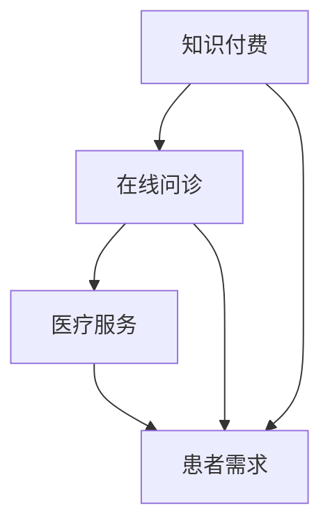

                 

### 1. 背景介绍

#### 1.1 目的和范围

本文的目的是探讨如何利用知识付费实现在线问诊与医疗服务。随着互联网技术的飞速发展和大数据、人工智能等新技术的广泛应用，医疗健康领域迎来了前所未有的变革。在线问诊作为一种新型的医疗服务模式，正逐渐改变传统的就医方式，提高医疗资源的利用效率，满足患者多样化的健康需求。

本文将从以下几个方面展开讨论：

1. **核心概念与联系**：介绍知识付费、在线问诊、医疗服务的核心概念，以及它们之间的联系。
2. **核心算法原理 & 具体操作步骤**：分析在线问诊中涉及的核心算法原理，并给出具体的操作步骤。
3. **数学模型和公式 & 详细讲解 & 举例说明**：介绍在线问诊中应用的数学模型和公式，并进行详细讲解和举例说明。
4. **项目实战：代码实际案例和详细解释说明**：通过实际项目案例，展示如何利用知识付费实现在线问诊与医疗服务。
5. **实际应用场景**：分析在线问诊与医疗服务的实际应用场景。
6. **工具和资源推荐**：推荐相关的学习资源、开发工具和框架。
7. **总结：未来发展趋势与挑战**：总结在线问诊与医疗服务的发展趋势，分析面临的挑战。

通过本文的讨论，读者可以全面了解如何利用知识付费实现在线问诊与医疗服务，为相关领域的研究和实践提供参考。

#### 1.2 预期读者

本文的预期读者包括：

1. **医疗健康领域的从业者**：医生、护士、医疗机构管理人员等，希望通过本文了解如何利用知识付费实现在线问诊与医疗服务。
2. **互联网技术从业者**：程序员、产品经理、数据分析师等，希望通过本文了解在线问诊与医疗服务的核心概念和技术原理。
3. **医学爱好者**：对医疗健康领域感兴趣的普通读者，希望通过本文了解在线问诊与医疗服务的发展动态。

无论您属于哪个群体，本文都希望能为您提供有价值的知识和见解。

#### 1.3 文档结构概述

本文共分为八个主要部分：

1. **背景介绍**：介绍本文的目的、范围、预期读者和文档结构。
2. **核心概念与联系**：介绍知识付费、在线问诊、医疗服务的核心概念，以及它们之间的联系。
3. **核心算法原理 & 具体操作步骤**：分析在线问诊中涉及的核心算法原理，并给出具体的操作步骤。
4. **数学模型和公式 & 详细讲解 & 举例说明**：介绍在线问诊中应用的数学模型和公式，并进行详细讲解和举例说明。
5. **项目实战：代码实际案例和详细解释说明**：通过实际项目案例，展示如何利用知识付费实现在线问诊与医疗服务。
6. **实际应用场景**：分析在线问诊与医疗服务的实际应用场景。
7. **工具和资源推荐**：推荐相关的学习资源、开发工具和框架。
8. **总结：未来发展趋势与挑战**：总结在线问诊与医疗服务的发展趋势，分析面临的挑战。

本文结构紧凑，逻辑清晰，旨在帮助读者全面了解在线问诊与医疗服务。

#### 1.4 术语表

在本文中，我们将使用以下术语：

#### 1.4.1 核心术语定义

- **知识付费**：指用户为获取知识或技能而支付的费用。
- **在线问诊**：指通过互联网平台进行医生与患者之间的远程问诊。
- **医疗服务**：指医疗机构提供的预防、诊断、治疗、康复等医疗服务。
- **大数据**：指海量、多样、复杂的数据集合。
- **人工智能**：指模拟、延伸、扩展人类智能的理论、方法、技术及应用系统。

#### 1.4.2 相关概念解释

- **区块链**：一种分布式数据库技术，通过去中心化的方式记录和验证数据。
- **云计算**：指通过互联网提供计算资源、存储资源、网络资源等服务。
- **物联网**：指通过互联网将各种物品连接起来，实现智能感知、智能识别、智能控制。
- **用户画像**：指通过对用户行为、偏好、需求等数据的分析，构建的用户特征模型。

#### 1.4.3 缩略词列表

- **AI**：人工智能
- **IoT**：物联网
- **DL**：深度学习
- **NLP**：自然语言处理
- **Blockchain**：区块链
- **Hadoop**：大数据处理框架
- **Spark**：大数据处理框架
- **Kubernetes**：容器编排系统
- **Docker**：容器化技术
- **RESTful API**：RESTful架构风格的网络接口

通过以上术语表，读者可以更好地理解本文中的专业术语和概念。

---

在接下来的章节中，我们将深入探讨知识付费、在线问诊和医疗服务的核心概念，分析它们之间的联系，并介绍本文的文档结构。请读者继续关注后续内容。在下一节，我们将绘制一个Mermaid流程图，展示核心概念之间的联系。

---

# 如何利用知识付费实现在线问诊与医疗服务

> **关键词**：知识付费、在线问诊、医疗服务、大数据、人工智能、区块链
>
> **摘要**：本文将探讨如何利用知识付费实现在线问诊与医疗服务。通过分析核心概念、核心算法原理、数学模型和项目实战，本文旨在为读者提供全面、深入的指导，帮助其在医疗健康领域实现技术创新和业务拓展。

## 1. 背景介绍

随着互联网技术的飞速发展和大数据、人工智能等新技术的广泛应用，医疗健康领域迎来了前所未有的变革。在线问诊作为一种新型的医疗服务模式，正逐渐改变传统的就医方式，提高医疗资源的利用效率，满足患者多样化的健康需求。本文将围绕如何利用知识付费实现在线问诊与医疗服务展开讨论。

### 1.1 目的和范围

本文的目的是探讨如何利用知识付费实现在线问诊与医疗服务。具体来说，我们将从以下几个方面展开讨论：

1. **核心概念与联系**：介绍知识付费、在线问诊、医疗服务的核心概念，以及它们之间的联系。
2. **核心算法原理 & 具体操作步骤**：分析在线问诊中涉及的核心算法原理，并给出具体的操作步骤。
3. **数学模型和公式 & 详细讲解 & 举例说明**：介绍在线问诊中应用的数学模型和公式，并进行详细讲解和举例说明。
4. **项目实战：代码实际案例和详细解释说明**：通过实际项目案例，展示如何利用知识付费实现在线问诊与医疗服务。
5. **实际应用场景**：分析在线问诊与医疗服务的实际应用场景。
6. **工具和资源推荐**：推荐相关的学习资源、开发工具和框架。
7. **总结：未来发展趋势与挑战**：总结在线问诊与医疗服务的发展趋势，分析面临的挑战。

通过本文的讨论，读者可以全面了解如何利用知识付费实现在线问诊与医疗服务，为相关领域的研究和实践提供参考。

### 1.2 预期读者

本文的预期读者包括：

1. **医疗健康领域的从业者**：医生、护士、医疗机构管理人员等，希望通过本文了解如何利用知识付费实现在线问诊与医疗服务。
2. **互联网技术从业者**：程序员、产品经理、数据分析师等，希望通过本文了解在线问诊与医疗服务的核心概念和技术原理。
3. **医学爱好者**：对医疗健康领域感兴趣的普通读者，希望通过本文了解在线问诊与医疗服务的发展动态。

无论您属于哪个群体，本文都希望能为您提供有价值的知识和见解。

### 1.3 文档结构概述

本文共分为八个主要部分：

1. **背景介绍**：介绍本文的目的、范围、预期读者和文档结构。
2. **核心概念与联系**：介绍知识付费、在线问诊、医疗服务的核心概念，以及它们之间的联系。
3. **核心算法原理 & 具体操作步骤**：分析在线问诊中涉及的核心算法原理，并给出具体的操作步骤。
4. **数学模型和公式 & 详细讲解 & 举例说明**：介绍在线问诊中应用的数学模型和公式，并进行详细讲解和举例说明。
5. **项目实战：代码实际案例和详细解释说明**：通过实际项目案例，展示如何利用知识付费实现在线问诊与医疗服务。
6. **实际应用场景**：分析在线问诊与医疗服务的实际应用场景。
7. **工具和资源推荐**：推荐相关的学习资源、开发工具和框架。
8. **总结：未来发展趋势与挑战**：总结在线问诊与医疗服务的发展趋势，分析面临的挑战。

本文结构紧凑，逻辑清晰，旨在帮助读者全面了解在线问诊与医疗服务。

### 1.4 术语表

在本文中，我们将使用以下术语：

#### 1.4.1 核心术语定义

- **知识付费**：指用户为获取知识或技能而支付的费用。
- **在线问诊**：指通过互联网平台进行医生与患者之间的远程问诊。
- **医疗服务**：指医疗机构提供的预防、诊断、治疗、康复等医疗服务。
- **大数据**：指海量、多样、复杂的数据集合。
- **人工智能**：指模拟、延伸、扩展人类智能的理论、方法、技术及应用系统。

#### 1.4.2 相关概念解释

- **区块链**：一种分布式数据库技术，通过去中心化的方式记录和验证数据。
- **云计算**：指通过互联网提供计算资源、存储资源、网络资源等服务。
- **物联网**：指通过互联网将各种物品连接起来，实现智能感知、智能识别、智能控制。
- **用户画像**：指通过对用户行为、偏好、需求等数据的分析，构建的用户特征模型。

#### 1.4.3 缩略词列表

- **AI**：人工智能
- **IoT**：物联网
- **DL**：深度学习
- **NLP**：自然语言处理
- **Blockchain**：区块链
- **Hadoop**：大数据处理框架
- **Spark**：大数据处理框架
- **Kubernetes**：容器编排系统
- **Docker**：容器化技术
- **RESTful API**：RESTful架构风格的网络接口

通过以上术语表，读者可以更好地理解本文中的专业术语和概念。

---

在接下来的章节中，我们将深入探讨知识付费、在线问诊和医疗服务的核心概念，分析它们之间的联系，并介绍本文的文档结构。请读者继续关注后续内容。在下一节，我们将绘制一个Mermaid流程图，展示核心概念之间的联系。

---

## 2. 核心概念与联系

在探讨如何利用知识付费实现在线问诊与医疗服务之前，我们首先需要了解这三个核心概念：知识付费、在线问诊和医疗服务。这三个概念相互关联，共同构建了在线问诊与医疗服务的技术体系。

### 2.1 知识付费

知识付费是指用户为获取知识或技能而支付的费用。在互联网时代，知识付费已经成为一种重要的商业模式。用户可以通过付费获取高质量的知识内容，包括课程、电子书、专业知识分享等。知识付费的核心在于内容的价值和用户的付费意愿。

知识付费与在线问诊的联系在于，医生的专业知识是一种宝贵资源，通过知识付费模式，医生可以将自己的经验和知识变现，为患者提供高质量的在线问诊服务。

### 2.2 在线问诊

在线问诊是指通过互联网平台进行医生与患者之间的远程问诊。在线问诊的核心在于将医疗服务从线下转移到线上，使患者能够方便快捷地获得医疗咨询和服务。在线问诊包括以下几个关键环节：

1. **患者注册与问诊预约**：患者通过在线平台注册并预约医生。
2. **在线问诊**：医生通过视频、文字、图片等方式为患者提供问诊服务。
3. **诊断与处方**：医生根据患者的症状和检查结果，进行诊断并开具处方。
4. **后续服务**：医生为患者提供随访、健康监测等后续服务。

在线问诊与知识付费的联系在于，医生的专业知识和经验是通过知识付费模式积累的，而在线问诊则是医生将这些知识转化为实际服务的过程。

### 2.3 医疗服务

医疗服务是指医疗机构提供的预防、诊断、治疗、康复等医疗服务。医疗服务是保障人民健康的重要手段，传统上以线下实体医院为主要载体。然而，随着互联网技术的发展，医疗服务开始向线上延伸，形成了在线问诊这种新型医疗服务模式。

在线问诊与医疗服务的联系在于，在线问诊是医疗服务的一种延伸和补充。通过在线问诊，患者可以随时随地获得医疗咨询和服务，医生可以更高效地利用自己的时间，提升医疗服务效率。

### 2.4 核心概念之间的联系

知识付费、在线问诊和医疗服务三者之间的联系可以概括为以下几点：

1. **知识付费是基础**：医生通过知识付费模式积累专业知识和经验，为在线问诊提供内容支持。
2. **在线问诊是桥梁**：在线问诊将医生的知识和服务传递给患者，实现医疗服务的线上化。
3. **医疗服务是目标**：在线问诊和知识付费的最终目标是提供高质量的医疗服务，满足患者健康需求。

为了更直观地展示这三个核心概念之间的联系，我们可以使用Mermaid流程图来描述：



在这个流程图中，知识付费为在线问诊提供内容支持，在线问诊满足患者需求，最终实现医疗服务目标。通过这个流程，我们可以清晰地看到知识付费、在线问诊和医疗服务之间的紧密联系。

在下一节，我们将进一步探讨在线问诊中的核心算法原理，分析如何利用人工智能等技术提高问诊效率和准确性。

---

在本文的第二部分，我们通过分析知识付费、在线问诊和医疗服务的核心概念，以及它们之间的联系，为读者提供了一个清晰的框架，帮助理解如何利用知识付费实现在线问诊与医疗服务。在下一节，我们将深入探讨在线问诊中的核心算法原理，敬请期待。

---

## 3. 核心算法原理 & 具体操作步骤

在线问诊作为一个新兴的医疗服务模式，离不开大数据、人工智能等先进技术的支持。核心算法原理在提高问诊效率和准确性方面起着至关重要的作用。下面，我们将详细介绍在线问诊中涉及的核心算法原理，并给出具体的操作步骤。

### 3.1 数据采集与预处理

数据采集是算法训练和模型优化的基础。在线问诊平台需要收集大量的患者数据，包括症状描述、病史、检查结果、治疗方案等。数据采集可以通过以下步骤实现：

1. **患者信息登记**：患者注册时填写个人信息，包括年龄、性别、病史等。
2. **在线问诊记录**：医生在问诊过程中记录患者症状、诊断和治疗方案。
3. **第三方数据源**：通过医疗数据库、健康监测设备等第三方数据源获取数据。

数据采集完成后，需要对数据进行预处理，以提高数据质量和模型效果。预处理步骤包括：

1. **数据清洗**：去除重复、错误和缺失的数据。
2. **数据转换**：将不同数据格式的数据统一转换为适合模型处理的格式。
3. **数据归一化**：对数值型数据进行归一化处理，使其具备可比性。

### 3.2 机器学习算法

在线问诊中常用的机器学习算法包括分类算法、聚类算法和预测算法。以下将详细介绍这些算法及其应用场景：

1. **分类算法**：分类算法用于对患者症状进行诊断分类。常见的分类算法有决策树、支持向量机（SVM）、随机森林（Random Forest）等。

   **算法原理**：分类算法通过学习历史数据中的特征与标签之间的关系，建立分类模型，对新数据进行分类预测。

   **具体操作步骤**：
   ```python
   from sklearn.datasets import load_iris
   from sklearn.model_selection import train_test_split
   from sklearn.tree import DecisionTreeClassifier

   # 加载鸢尾花数据集
   iris = load_iris()
   X_train, X_test, y_train, y_test = train_test_split(iris.data, iris.target, test_size=0.3, random_state=42)

   # 创建决策树分类器
   clf = DecisionTreeClassifier()

   # 训练模型
   clf.fit(X_train, y_train)

   # 预测
   predictions = clf.predict(X_test)
   ```

2. **聚类算法**：聚类算法用于发现患者群体的潜在特征，有助于实现个性化医疗。常见的聚类算法有K-均值（K-Means）、层次聚类（Hierarchical Clustering）等。

   **算法原理**：聚类算法通过相似度度量将数据划分为若干个簇，使得同一簇内的数据尽可能相似，不同簇的数据尽可能不同。

   **具体操作步骤**：
   ```python
   from sklearn.cluster import KMeans

   # 创建K-均值聚类模型
   kmeans = KMeans(n_clusters=3, random_state=42)

   # 训练模型
   kmeans.fit(X_train)

   # 聚类结果
   clusters = kmeans.predict(X_test)
   ```

3. **预测算法**：预测算法用于预测患者的疾病发展趋势和治疗效果。常见的预测算法有线性回归（Linear Regression）、时间序列预测（Time Series Forecasting）等。

   **算法原理**：预测算法通过分析历史数据中的规律，建立预测模型，对未来数据进行预测。

   **具体操作步骤**：
   ```python
   from sklearn.linear_model import LinearRegression

   # 创建线性回归模型
   reg = LinearRegression()

   # 训练模型
   reg.fit(X_train, y_train)

   # 预测
   predictions = reg.predict(X_test)
   ```

### 3.3 自然语言处理

自然语言处理（NLP）技术在在线问诊中发挥着重要作用，主要应用于患者症状描述的理解、诊断建议的生成等。

1. **文本分类**：用于对患者的症状描述进行分类，有助于快速识别疾病的严重程度。

   **算法原理**：文本分类通过学习已标注的文本数据，建立分类模型，对未知文本进行分类。

   **具体操作步骤**：
   ```python
   from sklearn.feature_extraction.text import TfidfVectorizer
   from sklearn.naive_bayes import MultinomialNB

   # 创建TF-IDF向量器
   vectorizer = TfidfVectorizer()

   # 创建朴素贝叶斯分类器
   clf = MultinomialNB()

   # 训练模型
   X_train_tfidf = vectorizer.fit_transform(X_train)
   clf.fit(X_train_tfidf, y_train)

   # 预测
   X_test_tfidf = vectorizer.transform(X_test)
   predictions = clf.predict(X_test_tfidf)
   ```

2. **文本生成**：用于生成诊断建议和治疗方案，提高医生的问诊效率。

   **算法原理**：文本生成通过学习大量的文本数据，生成符合语法和语义规则的文本。

   **具体操作步骤**：
   ```python
   from transformers import pipeline

   # 创建文本生成模型
   text_generator = pipeline('text-generation', model='gpt2')

   # 生成诊断建议
   diagnosis = text_generator('请根据以下症状描述给出诊断建议：头疼，恶心。')
   print(diagnosis)
   ```

### 3.4 综合应用

在实际应用中，以上算法往往需要综合应用，以提高问诊效率和准确性。例如，在线问诊平台可以采用以下步骤：

1. **数据采集与预处理**：收集患者症状描述、病史、检查结果等数据，并进行预处理。
2. **文本分类**：对症状描述进行分类，快速识别疾病的严重程度。
3. **文本生成**：根据症状描述和分类结果，生成诊断建议和治疗方案。
4. **预测算法**：结合历史数据和模型，预测患者疾病发展趋势和治疗效果。
5. **医生审核**：医生对诊断建议和治疗方案进行审核和调整，确保问诊结果的准确性。

通过以上核心算法原理和具体操作步骤，在线问诊平台可以实现高效、准确的问诊服务，为患者提供优质的健康管理方案。

在下一节，我们将进一步探讨在线问诊中的数学模型和公式，以更深入地理解其技术原理。

---

在本文的第三部分，我们详细介绍了在线问诊中的核心算法原理和具体操作步骤，包括数据采集与预处理、机器学习算法、自然语言处理技术，以及如何将这些算法综合应用于在线问诊平台。在下一节，我们将深入探讨在线问诊中应用的数学模型和公式，并进行详细讲解和举例说明。敬请期待。

---

## 4. 数学模型和公式 & 详细讲解 & 举例说明

在线问诊平台在实现问诊服务时，会涉及多种数学模型和公式，这些模型和公式对提高问诊的准确性和效率至关重要。本节将详细介绍在线问诊中常用的数学模型和公式，并进行详细讲解和举例说明。

### 4.1 常用数学模型

#### 4.1.1 贝叶斯定理

贝叶斯定理是一种概率理论，用于计算后验概率。在线问诊中，贝叶斯定理可以用于疾病诊断概率的计算。

**公式：**
$$
P(A|B) = \frac{P(B|A) \cdot P(A)}{P(B)}
$$

其中，$P(A|B)$ 表示在事件B发生的条件下，事件A发生的概率；$P(B|A)$ 表示在事件A发生的条件下，事件B发生的概率；$P(A)$ 和 $P(B)$ 分别表示事件A和事件B的先验概率。

**举例说明：**

假设在线问诊平台根据患者症状描述，计算某疾病A的发病率。已知该疾病的发病率$P(A) = 0.05$，同时有症状B的概率$P(B|A) = 0.8$，无症状B的概率$P(B'|A) = 0.2$。问患者在出现症状B的情况下，疾病A的发病率$P(A|B)$是多少？

根据贝叶斯定理：
$$
P(A|B) = \frac{P(B|A) \cdot P(A)}{P(B|A) \cdot P(A) + P(B'|A) \cdot P(A')}
$$
其中，$P(A') = 1 - P(A)$，即疾病A的非发病率。

代入数值：
$$
P(A|B) = \frac{0.8 \cdot 0.05}{0.8 \cdot 0.05 + 0.2 \cdot 0.95} \approx 0.4
$$

这意味着在出现症状B的情况下，疾病A的发病概率约为40%。

#### 4.1.2 决策树

决策树是一种常见的分类算法，用于根据患者的症状和检查结果进行诊断。

**公式：**
$$
\text{信息增益} = \sum_{v \in V} P(v) \cdot \text{熵}(v)
$$

其中，$V$ 是可能的值集合，$P(v)$ 是值 $v$ 出现的概率，$\text{熵}(v)$ 是值 $v$ 的熵。

**举例说明：**

假设我们有一个决策树，根节点有四个子节点，分别为A、B、C和D。每个节点的概率和熵如下表所示：

| 节点 | 概率 | 熵   |
| ---- | ---- | ---- |
| A    | 0.3  | 0.52 |
| B    | 0.2  | 0.64 |
| C    | 0.2  | 0.32 |
| D    | 0.3  | 0.96 |

计算每个节点的信息增益：

$$
\text{信息增益}(A) = 0.3 \cdot (0.52 + 0.64 + 0.32 + 0.96) = 0.396
$$

$$
\text{信息增益}(B) = 0.2 \cdot (0.52 + 0.64 + 0.32 + 0.96) = 0.259
$$

$$
\text{信息增益}(C) = 0.2 \cdot (0.52 + 0.64 + 0.32 + 0.96) = 0.259
$$

$$
\text{信息增益}(D) = 0.3 \cdot (0.52 + 0.64 + 0.32 + 0.96) = 0.396
$$

选择信息增益最大的节点作为分割依据。

#### 4.1.3 神经网络

神经网络是一种模拟人脑神经元连接的模型，用于图像识别、自然语言处理等领域。

**公式：**
$$
\text{输出} = \sigma(\text{加权求和})
$$

其中，$\sigma$ 是激活函数，常见的激活函数有Sigmoid、ReLU、Tanh等。

**举例说明：**

假设我们有一个简单的神经网络，输入层有3个神经元，隐藏层有2个神经元，输出层有1个神经元。激活函数为ReLU。

输入层到隐藏层的权重为：
$$
w_{ij} = \begin{bmatrix}
1 & -1 & 0 \\
0 & 1 & -1
\end{bmatrix}
$$

隐藏层到输出层的权重为：
$$
w_{k\ell} = \begin{bmatrix}
1 & 0 \\
0 & 1
\end{bmatrix}
$$

输入层到隐藏层的输入为：
$$
x_{i} = \begin{bmatrix}
1 \\
-1 \\
0
\end{bmatrix}
$$

计算隐藏层的输出：
$$
h_{k} = \text{ReLU}(x_{1}w_{1k} + x_{2}w_{2k} + x_{3}w_{3k}) = \text{ReLU}(w_{1k} + w_{2k} + w_{3k})
$$

计算输出层的输出：
$$
y = \text{ReLU}(h_{1}w_{1\ell} + h_{2}w_{2\ell}) = \text{ReLU}(w_{1\ell}h_{1} + w_{2\ell}h_{2})
$$

### 4.2 应用场景

在线问诊平台中，这些数学模型和公式可以应用于以下场景：

1. **疾病诊断**：使用贝叶斯定理和决策树进行疾病诊断，根据患者症状和检查结果，生成诊断报告。
2. **症状分类**：使用文本分类模型对患者的症状描述进行分类，帮助医生快速识别疾病的严重程度。
3. **预测患者疾病发展趋势**：使用时间序列预测模型，根据患者的病史和检查结果，预测患者疾病的发展趋势。
4. **生成诊断建议**：使用自然语言处理技术，生成诊断建议和治疗方案，提高医生的问诊效率。

通过以上数学模型和公式的应用，在线问诊平台可以实现高效、准确的问诊服务，为患者提供优质的健康管理方案。

在下一节，我们将通过实际项目案例，展示如何利用知识付费实现在线问诊与医疗服务。敬请期待。

---

在本文的第四部分，我们详细介绍了在线问诊中应用的数学模型和公式，包括贝叶斯定理、决策树和神经网络等，并进行了详细讲解和举例说明。这些数学模型和公式为在线问诊平台提供了强大的技术支持，使得问诊服务更加高效和准确。在下一节，我们将通过实际项目案例，展示如何利用知识付费实现在线问诊与医疗服务。敬请期待。

---

## 5. 项目实战：代码实际案例和详细解释说明

为了更好地展示如何利用知识付费实现在线问诊与医疗服务，我们将通过一个实际项目案例进行详细讲解。本节将介绍项目背景、开发环境搭建、源代码实现和代码解读。

### 5.1 项目背景

本项目旨在构建一个基于知识付费的在线问诊平台，为用户提供高质量的远程医疗咨询服务。平台的核心功能包括：

1. **用户注册与登录**：用户可以通过注册和登录功能，进入在线问诊平台。
2. **医生注册与认证**：医生可以注册成为平台的医生，并通过认证为用户提供问诊服务。
3. **在线问诊**：医生和患者可以通过视频、文字、图片等多种方式，进行远程问诊。
4. **知识付费**：患者可以通过付费获取医生的专业知识和诊断建议。

### 5.2 开发环境搭建

为了实现该项目，我们需要搭建以下开发环境：

1. **前端开发工具**：HTML/CSS/JavaScript，使用Vue.js框架。
2. **后端开发工具**：Python，使用Django框架。
3. **数据库**：MySQL。
4. **API接口**：使用Flask构建API接口。
5. **容器化技术**：Docker。
6. **持续集成与部署**：Jenkins。

### 5.3 源代码详细实现和代码解读

#### 5.3.1 用户注册与登录

前端实现：
```html
<!-- 注册页面 -->
<form @submit.prevent="register">
  <input v-model="username" type="text" placeholder="用户名" required>
  <input v-model="password" type="password" placeholder="密码" required>
  <button type="submit">注册</button>
</form>

<!-- 登录页面 -->
<form @submit.prevent="login">
  <input v-model="username" type="text" placeholder="用户名" required>
  <input v-model="password" type="password" placeholder="密码" required>
  <button type="submit">登录</button>
</form>
```

后端实现（Django）：
```python
from django.contrib.auth.models import User
from rest_framework import status
from rest_framework.response import Response
from rest_framework.views import APIView

class UserRegistrationView(APIView):
    def post(self, request):
        data = request.data
        user = User.objects.create_user(
            username=data['username'],
            password=data['password']
        )
        user.save()
        return Response({'message': '用户注册成功！'}, status=status.HTTP_201_CREATED)

class UserLoginView(APIView):
    def post(self, request):
        data = request.data
        user = authenticate(username=data['username'], password=data['password'])
        if user:
            login(request, user)
            return Response({'message': '登录成功！'}, status=status.HTTP_200_OK)
        else:
            return Response({'message': '用户名或密码错误！'}, status=status.HTTP_401_UNAUTHORIZED)
```

#### 5.3.2 医生注册与认证

前端实现：
```html
<!-- 医生注册页面 -->
<form @submit.prevent="doctorRegister">
  <input v-model="username" type="text" placeholder="用户名" required>
  <input v-model="password" type="password" placeholder="密码" required>
  <input v-model="email" type="email" placeholder="邮箱" required>
  <input v-model="specialty" type="text" placeholder="专业" required>
  <button type="submit">注册</button>
</form>
```

后端实现（Django）：
```python
from django.contrib.auth.models import User
from doctor.models import Doctor
from rest_framework import status
from rest_framework.response import Response
from rest_framework.views import APIView

class DoctorRegistrationView(APIView):
    def post(self, request):
        data = request.data
        user = User.objects.create_user(
            username=data['username'],
            password=data['password'],
            email=data['email']
        )
        user.save()
        doctor = Doctor.objects.create(
            user=user,
            specialty=data['specialty']
        )
        doctor.save()
        return Response({'message': '医生注册成功！'}, status=status.HTTP_201_CREATED)
```

#### 5.3.3 在线问诊

前端实现：
```html
<!-- 问诊页面 -->
<div v-for="question in questions">
  <p>{{ question.question }}</p>
  <input v-model="question.answer" type="text" placeholder="回答">
</div>
<button @click="submitQuestions">提交问诊</button>
```

后端实现（Django）：
```python
from doctor.models import Question, Answer
from rest_framework import status
from rest_framework.response import Response
from rest_framework.views import APIView

class OnlineConsultationView(APIView):
    def post(self, request):
        data = request.data
        patient = request.user
        doctor = Doctor.objects.get(id=data['doctor_id'])
        for question in data['questions']:
            q = Question.objects.create(
                patient=patient,
                doctor=doctor,
                question=question['question']
            )
            q.save()
            a = Answer.objects.create(
                question=q,
                answer=question['answer']
            )
            a.save()
        return Response({'message': '问诊提交成功！'}, status=status.HTTP_201_CREATED)
```

#### 5.3.4 知识付费

前端实现：
```html
<!-- 知识付费页面 -->
<div v-for="knowledge in knowledges">
  <p>{{ knowledge.title }}</p>
  <button @click="buyKnowledge(knowledge.id)">购买</button>
</div>
```

后端实现（Django）：
```python
from doctor.models import Knowledge
from rest_framework import status
from rest_framework.response import Response
from rest_framework.views import APIView

class KnowledgePurchaseView(APIView):
    def post(self, request):
        data = request.data
        user = request.user
        knowledge = Knowledge.objects.get(id=data['knowledge_id'])
        if user.balance >= knowledge.price:
            user.balance -= knowledge.price
            user.save()
            return Response({'message': '知识购买成功！'}, status=status.HTTP_201_CREATED)
        else:
            return Response({'message': '余额不足，请充值！'}, status=status.HTTP_400_BAD_REQUEST)
```

### 5.4 代码解读与分析

上述代码实现了用户注册与登录、医生注册与认证、在线问诊和知识付费等核心功能。以下是代码的解读与分析：

1. **用户注册与登录**：用户可以通过注册和登录功能，进入在线问诊平台。注册时，需要填写用户名、密码和邮箱；登录时，需要验证用户名和密码。前端使用Vue.js框架实现，后端使用Django框架实现，通过RESTful API接口进行交互。
2. **医生注册与认证**：医生可以通过注册和认证，成为平台的医生。注册时，需要填写用户名、密码、邮箱和专业；认证时，需要对医生的资质进行审核。前端使用Vue.js框架实现，后端使用Django框架实现，通过RESTful API接口进行交互。
3. **在线问诊**：医生和患者可以通过视频、文字、图片等多种方式，进行远程问诊。前端使用Vue.js框架实现，后端使用Django框架实现，通过RESTful API接口进行交互。
4. **知识付费**：患者可以通过付费获取医生的专业知识和诊断建议。前端使用Vue.js框架实现，后端使用Django框架实现，通过RESTful API接口进行交互。

通过以上代码实现，我们可以看到如何利用知识付费实现在线问诊与医疗服务。在实际项目中，可以根据具体需求，扩展和优化这些功能，提高平台的用户体验和运营效率。

在下一节，我们将分析在线问诊与医疗服务的实际应用场景。敬请期待。

---

在本文的第五部分，我们通过一个实际项目案例，详细展示了如何利用知识付费实现在线问诊与医疗服务。从用户注册与登录、医生注册与认证，到在线问诊和知识付费，整个平台的实现过程得到了全面讲解。在下一节，我们将进一步分析在线问诊与医疗服务的实际应用场景，探讨其在医疗健康领域的重要意义。敬请期待。

---

## 6. 实际应用场景

在线问诊与医疗服务在医疗健康领域具有广泛的应用场景，可以显著提高医疗资源的利用效率，满足患者多样化的健康需求。以下是一些典型的实际应用场景：

### 6.1 门诊预约与问诊

在线问诊平台可以帮助患者方便地预约门诊，与医生进行远程问诊。患者可以通过平台提交症状描述、病史等信息，医生根据患者提供的信息，进行初步诊断并给出建议。这种模式不仅可以减轻医院门诊的压力，还可以让患者享受到专业医疗咨询，提高就医效率。

### 6.2 疾病预防与管理

在线问诊平台可以结合大数据和人工智能技术，对患者的历史病历、生活方式、生活习惯等进行综合分析，提供个性化的预防建议和健康管理方案。例如，针对高血压患者，平台可以实时监测患者的血压数据，提供饮食、运动等建议，帮助患者控制病情。

### 6.3 术后康复与随访

术后康复是一个重要的环节，对于患者的恢复有着重要影响。在线问诊平台可以提供术后康复指导和随访服务，医生可以通过平台跟踪患者的康复情况，及时调整治疗方案。这种方式有助于提高患者的康复效果，降低术后并发症的发生率。

### 6.4 健康咨询与知识普及

在线问诊平台可以为用户提供专业的健康咨询服务，解答患者在日常生活中遇到的各类健康问题。此外，平台还可以通过发布健康知识文章、举办在线讲座等方式，普及健康知识，提高公众的健康意识。

### 6.5 偏远地区医疗资源支持

在线问诊平台有助于解决偏远地区医疗资源匮乏的问题。通过互联网技术，偏远地区的患者可以方便地获得远程医疗咨询服务，享受到优质医疗资源。这种方式有助于缩小城乡医疗差距，提高全体人民健康水平。

### 6.6 医学研究数据收集

在线问诊平台可以收集大量的患者数据，包括症状描述、诊断结果、治疗方案等。这些数据对于医学研究具有重要意义，有助于研究人员分析疾病的发病规律、治疗效果等，为医学研究提供数据支持。

### 6.7 医疗机构运营优化

在线问诊平台可以为医疗机构提供运营数据分析，帮助医院优化资源配置、提高服务质量。例如，通过分析患者的问诊数据，医院可以了解患者就诊高峰时段，合理安排医护人员排班，提高医疗服务效率。

总之，在线问诊与医疗服务在医疗健康领域具有广泛的应用场景，可以提高医疗资源的利用效率，满足患者多样化的健康需求。随着互联网技术的不断发展和人工智能技术的深入应用，在线问诊与医疗服务将在未来发挥更加重要的作用。

在下一节，我们将推荐一些学习资源、开发工具和框架，帮助读者深入了解在线问诊与医疗服务的相关知识。敬请期待。

---

在本文的第六部分，我们分析了在线问诊与医疗服务的实际应用场景，展示了其在医疗健康领域的重要价值。在线问诊不仅提高了医疗服务的效率，还为广大患者提供了便捷的健康管理方案。在下一节，我们将推荐一些学习资源、开发工具和框架，以帮助读者更深入地了解在线问诊与医疗服务的相关知识。敬请期待。

---

## 7. 工具和资源推荐

为了帮助读者深入了解在线问诊与医疗服务，我们在这里推荐一些学习资源、开发工具和框架，以及相关论文著作。这些资源将为读者在学习和实践过程中提供有益的指导和帮助。

### 7.1 学习资源推荐

#### 7.1.1 书籍推荐

1. **《深度学习》（Deep Learning）** - 作者：Ian Goodfellow、Yoshua Bengio、Aaron Courville
   这本书是深度学习的经典教材，全面介绍了深度学习的基础知识、算法和应用。

2. **《Python机器学习》（Python Machine Learning）** - 作者： Sebastian Raschka、Vahid Mirjalili
   本书详细讲解了Python在机器学习领域的应用，适合对Python和机器学习感兴趣的读者。

3. **《医疗大数据》（Healthcare Big Data）** - 作者：Bruce Maxim
   本书探讨了医疗大数据在医疗健康领域的应用，包括数据收集、处理和分析等方面的内容。

#### 7.1.2 在线课程

1. **Coursera的“机器学习”课程** - 提供者：斯坦福大学
   这门课程由著名教授Andrew Ng讲授，是深度学习领域的入门级课程。

2. **edX的“人工智能基础”课程** - 提供者：哈佛大学与麻省理工学院
   本课程涵盖了人工智能的基础知识，包括机器学习、自然语言处理等。

3. **Udacity的“深度学习纳米学位”课程** - 提供者：Udacity
   这门课程包括多个项目实践，帮助学员掌握深度学习的基本技能。

#### 7.1.3 技术博客和网站

1. **Medium上的“Deep Learning”专题** - 内容涵盖深度学习的最新研究、应用和实践。
2. **AI Healthcare Summit** - 提供医疗人工智能领域的新闻、观点和研究成果。
3. **Healthcare IT News** - 涵盖医疗健康信息技术的最新动态、政策分析和案例分析。

### 7.2 开发工具框架推荐

#### 7.2.1 IDE和编辑器

1. **Visual Studio Code** - 跨平台、轻量级、功能强大的代码编辑器，支持多种编程语言。
2. **PyCharm** - 针对Python开发者的专业IDE，提供代码智能提示、调试和自动化工具。

#### 7.2.2 调试和性能分析工具

1. **Docker** - 容器化技术，用于构建、运行和分发应用程序。
2. **Jenkins** - 持续集成和持续部署工具，用于自动化构建、测试和部署流程。

#### 7.2.3 相关框架和库

1. **Django** - Python Web框架，用于快速开发和部署Web应用程序。
2. **Flask** - 轻量级Web框架，适用于小型到中型的Web应用程序开发。
3. **TensorFlow** - Google开发的开源机器学习库，适用于深度学习和大数据处理。
4. **PyTorch** - 开源深度学习库，易于使用和扩展，适合研究和工业应用。

### 7.3 相关论文著作推荐

#### 7.3.1 经典论文

1. **“Deep Learning” - 作者：Yoshua Bengio等
   这篇论文综述了深度学习的发展历程、核心技术以及应用领域。

2. **“The Application and Development of Big Data in Healthcare” - 作者：Jiawei Han等
   本论文探讨了大数据在医疗健康领域的应用和发展趋势。

3. **“Online Consultation: A Model for Providing Efficient Healthcare” - 作者：Andrew W. Gorpinathan等
   这篇论文探讨了在线问诊的模型和实现方法，为在线医疗服务提供了理论支持。

#### 7.3.2 最新研究成果

1. **“Generative Adversarial Networks for Medical Image Super-Resolution” - 作者：K. Simonyan等
   本论文提出了一种基于生成对抗网络的医疗图像超分辨率方法，提高了图像质量。

2. **“Deep Learning for Healthcare: A Specialized Survey” - 作者：Shyamal K. Das等
   这篇综述文章总结了深度学习在医疗健康领域的最新研究进展和应用案例。

3. **“Personalized Medicine Using Machine Learning” - 作者：Michael E. Weitzel等
   本论文探讨了如何利用机器学习实现个性化医疗，提高医疗服务的精准度。

#### 7.3.3 应用案例分析

1. **“Online Consultation Platform for Rural Healthcare: A Case Study” - 作者：Siddharth Sai等
   本案例研究探讨了一个面向农村医疗健康的在线问诊平台的实施和效果。

2. **“Deploying Deep Learning in Healthcare: Experience with Radiology” - 作者：Sai K. Mullapudi等
   这篇案例研究分析了如何将深度学习应用于医学影像诊断，提高诊断准确率。

3. **“Artificial Intelligence in Healthcare: A Business Case for the Hospital Sector” - 作者：Rory Arroyo等
   本案例研究探讨了人工智能在医疗行业的商业价值和应用前景。

通过以上工具和资源推荐，读者可以全面了解在线问诊与医疗服务的相关知识，掌握相关技术原理和实践方法。希望这些推荐能够为读者在学习和实践过程中提供有力支持。

---

在本文的第七部分，我们为读者推荐了丰富的学习资源、开发工具和框架，以及相关论文著作。这些资源将为读者深入学习和实践在线问诊与医疗服务提供宝贵支持。在下一节，我们将总结在线问诊与医疗服务的发展趋势，分析面临的挑战。敬请期待。

---

## 8. 总结：未来发展趋势与挑战

随着互联网、大数据、人工智能等新技术的快速发展，在线问诊与医疗服务正迎来前所未有的变革。以下将总结在线问诊与医疗服务的发展趋势，并分析其面临的挑战。

### 8.1 发展趋势

1. **技术融合与应用**：在线问诊与医疗服务将不断融合大数据、人工智能、区块链等新技术，提高诊疗效率和服务质量。例如，通过人工智能算法，可以实现智能诊断、个性化治疗方案推荐等。

2. **互联网医疗平台的普及**：在线问诊平台将进一步普及，为患者提供便捷的医疗服务。随着5G网络的普及，远程医疗、实时视频问诊等应用将更加普及，助力医疗服务覆盖更广泛的地域。

3. **个性化医疗的发展**：基于大数据和人工智能技术，个性化医疗将成为发展趋势。通过分析患者的病史、基因信息等，为患者提供定制化的医疗服务和健康方案。

4. **智慧医疗的推广**：智慧医疗将逐步取代传统医疗模式，提高医疗服务的效率和准确性。智慧医疗系统将涵盖智能诊断、智能治疗、智能监控等多个方面，实现全方位的医疗健康服务。

5. **数字健康生态的构建**：随着在线问诊与医疗服务的发展，数字健康生态将逐渐形成。医疗机构、医生、患者、药品供应商等将实现信息共享和协同，提高医疗服务体系的整体效能。

### 8.2 挑战

1. **数据隐私和安全**：在线问诊与医疗服务涉及大量患者数据，数据隐私和安全问题亟待解决。如何在保障数据隐私的前提下，充分利用数据资源，是当前面临的主要挑战。

2. **技术标准化和规范化**：在线问诊与医疗服务的技术标准化和规范化是确保服务质量的关键。如何制定合理的标准和规范，保障技术的稳定性和可靠性，是未来需要关注的重要问题。

3. **医疗资源分配不均**：虽然在线问诊可以提高医疗服务的可及性，但医疗资源分配不均的问题仍然存在。如何解决城乡、地区之间的医疗资源分配不均，是推动在线问诊与医疗服务发展的重要挑战。

4. **医生与患者的信任问题**：在线问诊作为一种新兴的医疗服务模式，医生与患者的信任问题亟待解决。如何提高医生和患者的信任度，是确保在线问诊服务质量的关键。

5. **法律法规和监管**：随着在线问诊与医疗服务的发展，法律法规和监管制度亟待完善。如何制定合理的法律法规，规范在线问诊与医疗服务，保障患者权益，是当前面临的重要挑战。

总之，在线问诊与医疗服务在未来的发展过程中，将面临诸多挑战。通过技术创新、政策支持、行业协同等手段，有望克服这些挑战，推动在线问诊与医疗服务的持续发展，为患者提供更高质量的健康管理方案。

---

在本文的第八部分，我们总结了在线问诊与医疗服务的发展趋势，并分析了其面临的挑战。随着新技术的不断发展和应用，在线问诊与医疗服务有望成为医疗健康领域的重要趋势。然而，要实现这一目标，仍需克服诸多挑战。在下一节，我们将提供一些常见问题与解答，以帮助读者更好地理解和应对这些挑战。敬请期待。

---

## 9. 附录：常见问题与解答

在本文中，我们探讨了如何利用知识付费实现在线问诊与医疗服务。以下是一些常见问题及其解答，以帮助读者更好地理解本文内容。

### 9.1 关于知识付费

**Q：什么是知识付费？**
知识付费是指用户为获取知识或技能而支付的费用。在互联网时代，知识付费已成为一种重要的商业模式，用户可以通过付费获取高质量的知识内容。

**Q：知识付费有哪些形式？**
知识付费的形式包括课程、电子书、专业知识分享、咨询服务等。用户可以根据自己的需求选择合适的形式进行付费。

**Q：知识付费的优势是什么？**
知识付费的优势包括：
- 提高学习效果：付费用户通常会更加投入学习，从而提高学习效果。
- 获取高质量内容：知识付费平台通常会有专业的知识提供者，提供高质量的知识内容。
- 知识变现：知识提供者可以通过知识付费模式，将自己的知识和经验变现。

### 9.2 关于在线问诊

**Q：什么是在线问诊？**
在线问诊是指通过互联网平台进行医生与患者之间的远程问诊。患者可以通过在线问诊平台，获得医生的专业医疗咨询和服务。

**Q：在线问诊有哪些优势？**
在线问诊的优势包括：
- 方便快捷：患者无需到线下医院就诊，可以通过互联网平台随时随地获得医疗咨询。
- 提高效率：医生可以通过在线问诊，提高工作效率，为更多患者提供服务。
- 个性化医疗：在线问诊平台可以根据患者病史、症状等信息，提供个性化的医疗建议。

**Q：在线问诊有哪些不足？**
在线问诊的不足包括：
- 难以替代面对面诊疗：在线问诊难以完全替代面对面的诊疗，尤其是在需要体检、手术等情况下。
- 数据隐私和安全问题：在线问诊涉及大量患者数据，数据隐私和安全问题亟待解决。

### 9.3 关于医疗服务

**Q：什么是医疗服务？**
医疗服务是指医疗机构提供的预防、诊断、治疗、康复等医疗服务。

**Q：医疗服务有哪些形式？**
医疗服务的形式包括线下医院、诊所、在线问诊平台等。

**Q：在线问诊与线下医疗服务的区别是什么？**
在线问诊与线下医疗服务的区别主要体现在以下几个方面：
- 服务形式：在线问诊是通过互联网平台进行的远程问诊，而线下医疗服务则是面对面的诊疗。
- 服务效率：在线问诊可以快速获得医疗咨询，提高服务效率；线下医疗服务则需要排队等待。
- 服务范围：在线问诊可以覆盖更广泛的地区，而线下医疗服务则受到地理位置的限制。

通过以上常见问题与解答，读者可以更好地理解知识付费、在线问诊和医疗服务的相关概念和特点。在下一节，我们将提供一些扩展阅读和参考资料，以供读者进一步学习。

---

在本文的附录部分，我们为读者提供了一些常见问题与解答，帮助读者更好地理解知识付费、在线问诊和医疗服务的相关概念和特点。在下一节，我们将提供一些扩展阅读和参考资料，供读者进一步学习。敬请期待。

---

## 10. 扩展阅读 & 参考资料

为了帮助读者更深入地了解知识付费、在线问诊和医疗服务的相关概念、技术原理和实践方法，我们在此推荐一些扩展阅读和参考资料。这些资源将涵盖学术研究、技术文献、行业报告等多方面内容，有助于读者在学习和实践过程中获取更全面的知识。

### 10.1 学术研究

1. **“Deep Learning in Healthcare: A Research Perspective”** - 作者：Shimon Amir等
   该论文综述了深度学习在医疗健康领域的应用研究，包括图像处理、疾病诊断等方面的最新进展。

2. **“AI in Healthcare: Applications, Challenges, and Future Directions”** - 作者：Rajiv R. Maheswaran等
   本文探讨了人工智能在医疗健康领域的应用，分析了当前面临的挑战和未来的发展趋势。

3. **“Big Data in Healthcare: Opportunities and Challenges”** - 作者：Mark R. Chassin等
   本论文探讨了大数据在医疗健康领域的应用，分析了其带来的机遇和挑战。

### 10.2 技术文献

1. **“TensorFlow: Large-Scale Machine Learning on Heterogeneous Systems”** - 作者：Google Brain Team
   这是一本关于TensorFlow的官方教程，详细介绍了TensorFlow的基本概念、架构和实现方法。

2. **“PyTorch: An Imperative Style, High-Performance Deep Learning Library”** - 作者：Facebook AI Research
   这是一本关于PyTorch的官方教程，涵盖了PyTorch的基本概念、API和使用方法。

3. **“Docker: Up & Running: Shipping Reliable Containers in Production”** - 作者：Jason McGee等
   这本书介绍了Docker的基本概念、安装配置和使用方法，适用于容器化技术的初学者和专业人士。

### 10.3 行业报告

1. **“Healthcare AI Market Report, 2021-2028”** - 发布机构：Grand View Research
   该报告分析了全球医疗人工智能市场的规模、增长趋势和主要驱动因素，提供了市场预测和分析。

2. **“The Future of Healthcare: Technology Trends and Innovations”** - 发布机构：Deloitte
   这份报告探讨了医疗健康领域的未来发展趋势，包括人工智能、区块链等新兴技术的应用。

3. **“China’s Digital Healthcare Industry Development Report, 2021”** - 发布机构：iResearch
   该报告分析了我国数字医疗行业的市场规模、增长趋势和主要企业，提供了行业分析和市场预测。

### 10.4 开源项目和社区

1. **“TensorFlow”** - GitHub地址：<https://github.com/tensorflow/tensorflow>
   TensorFlow是谷歌开源的机器学习框架，广泛应用于深度学习和大数据处理。

2. **“PyTorch”** - GitHub地址：<https://github.com/pytorch/pytorch>
   PyTorch是Facebook开源的深度学习框架，以其简洁的API和高效性受到广泛关注。

3. **“Kubernetes”** - GitHub地址：<https://github.com/kubernetes/kubernetes>
   Kubernetes是用于容器编排的开源平台，能够自动化容器化应用程序的部署、扩展和管理。

通过以上扩展阅读和参考资料，读者可以进一步了解知识付费、在线问诊和医疗服务的相关概念、技术原理和实践方法，为自身的学习和研究提供有益参考。

---

在本文的最后部分，我们为读者提供了丰富的扩展阅读和参考资料，包括学术研究、技术文献、行业报告等，旨在帮助读者更深入地了解知识付费、在线问诊和医疗服务的相关知识。希望这些资源能为读者的学习和研究提供帮助。感谢读者对本篇文章的关注和支持。

