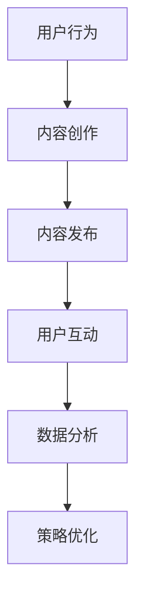
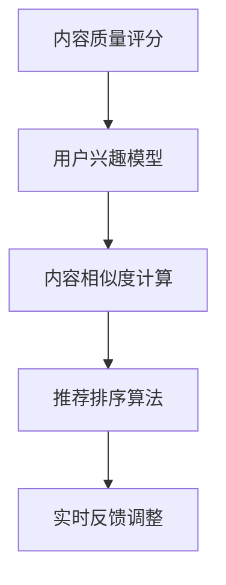

                 

# 如何利用短视频平台增加课程人气

> **关键词：** 短视频平台、课程推广、内容策略、用户体验、算法优化  
> **摘要：** 本文将深入探讨如何利用短视频平台来提升在线课程的吸引力与人气，通过科学的内容策略和算法优化方法，最大化课程的影响力。

## 1. 背景介绍

### 1.1 目的和范围

本文旨在为教育内容创作者和课程开发者提供策略和工具，帮助他们有效地利用短视频平台提升课程的曝光率和吸引力。随着短视频平台如抖音、快手等在全球范围内的影响力不断扩大，它们已经成为一个不容忽视的营销渠道。本文将探讨以下内容：

- 短视频平台的特点与优势
- 课程内容与短视频平台的契合点
- 创作高质量短视频的策略
- 算法优化与用户互动
- 数据分析与效果评估

### 1.2 预期读者

本文适合以下读者群体：

- 在线教育内容创作者
- 课程开发者与培训机构负责人
- 数字营销专员与社交媒体运营人员
- 对短视频营销和在线教育有浓厚兴趣的互联网从业者

### 1.3 文档结构概述

本文结构如下：

- 引言：短视频平台在在线教育中的应用背景
- 1. 背景介绍：目的、预期读者、文档结构
- 2. 核心概念与联系：短视频平台、课程推广、内容策略
- 3. 核心算法原理 & 具体操作步骤：内容创作、用户互动、算法优化
- 4. 数学模型和公式 & 详细讲解 & 举例说明：数据分析和效果评估
- 5. 项目实战：代码实际案例和详细解释说明
- 6. 实际应用场景：短视频平台在课程推广中的实践案例
- 7. 工具和资源推荐：学习资源、开发工具、相关论文
- 8. 总结：未来发展趋势与挑战
- 9. 附录：常见问题与解答
- 10. 扩展阅读 & 参考资料：深入研究的推荐资源

### 1.4 术语表

#### 1.4.1 核心术语定义

- **短视频平台**：指以短视频为主要内容形式，用户可以进行观看、分享和互动的在线平台。
- **课程推广**：指通过各种渠道和策略，增加课程知名度和参与度的过程。
- **内容策略**：指根据目标受众和平台特性，制定和执行的内容创作、发布和推广计划。
- **用户体验**：指用户在使用产品或服务过程中的感受和体验。

#### 1.4.2 相关概念解释

- **算法优化**：通过调整算法参数，提高短视频推荐、播放和互动的效果。
- **数据分析**：利用统计和机器学习等方法，对用户行为数据进行分析，以指导内容优化和策略调整。

#### 1.4.3 缩略词列表

- **UGC**：用户生成内容（User-Generated Content）
- **SEM**：搜索引擎营销（Search Engine Marketing）
- **SEO**：搜索引擎优化（Search Engine Optimization）
- **CPC**：每次点击成本（Cost Per Click）
- **CPM**：每次千次展示成本（Cost Per Mille）

## 2. 核心概念与联系

### 2.1 短视频平台在课程推广中的应用

短视频平台具有高流量、高互动和易传播的特点，非常适合用于课程推广。以下是一个简化的 Mermaid 流程图，展示了短视频平台在课程推广中的应用过程。



### 2.2 内容策略与用户体验

为了提高课程在短视频平台上的吸引力和参与度，内容策略和用户体验至关重要。以下是几个关键步骤：

1. **定位目标受众**：了解目标受众的兴趣、需求和痛点，以便创作出符合他们需求的内容。
2. **创作高质量内容**：内容应具有教育性、娱乐性和互动性，能够吸引用户观看和分享。
3. **优化用户体验**：通过简洁的界面、流畅的播放和便捷的互动功能，提升用户观看体验。
4. **互动与反馈**：积极与用户互动，收集反馈，不断优化内容策略和用户体验。

### 2.3 算法优化与数据分析

短视频平台的推荐算法对内容的曝光和传播起到关键作用。以下是一个简化的算法优化流程：



通过不断调整和优化算法参数，可以提高推荐内容的准确性，从而提升课程的人气和用户参与度。

## 3. 核心算法原理 & 具体操作步骤

### 3.1 内容创作

**算法原理：**

内容创作是课程推广的基础。一个成功的短视频应具备以下特点：

- **教育性**：内容应具有明确的教育目标，能够让用户在短时间内掌握关键知识点。
- **娱乐性**：通过幽默、生动的方式呈现内容，提高用户观看的兴趣。
- **互动性**：鼓励用户参与评论、点赞和分享，增加内容互动性。

**具体操作步骤：**

1. **确定内容主题**：根据目标受众的需求和兴趣，选择合适的课程主题。
2. **剧本编写**：撰写简洁、有逻辑的剧本，确保内容结构清晰，重点突出。
3. **拍摄与剪辑**：使用高质量的拍摄设备，确保画面清晰、音质良好。剪辑时注意节奏和画面的流畅性。
4. **添加互动元素**：通过问题、投票、小游戏等形式，增加用户互动。

**伪代码示例：**

```python
def create_video(content_theme, script, camera_quality, edit_style, interactive_elements):
    if content_theme is not None and script is not None:
        video = capture_video(camera_quality)
        video = add_script(video, script)
        video = add_interactive_elements(video, interactive_elements)
        final_video = edit_video(video, edit_style)
        return final_video
    else:
        return None
```

### 3.2 用户互动

**算法原理：**

用户互动是提升课程人气的关键。以下是一种简单的用户互动算法：

- **点赞与评论**：根据用户的点赞和评论行为，评估内容的受欢迎程度。
- **分享**：通过用户的分享行为，扩大内容的传播范围。

**具体操作步骤：**

1. **激励用户互动**：通过赠送虚拟礼物、抽奖活动等形式，鼓励用户参与互动。
2. **实时互动**：监控用户的互动行为，及时回复评论和私信，增加用户粘性。
3. **互动数据分析**：收集用户互动数据，分析互动效果，优化互动策略。

**伪代码示例：**

```python
def user_interaction(video_id, user_action):
    if user_action == "like":
        increase_likes(video_id)
    elif user_action == "comment":
        increase_comments(video_id)
    elif user_action == "share":
        increase_shares(video_id)
    else:
        return None
```

### 3.3 算法优化

**算法原理：**

算法优化旨在提高短视频的推荐准确性和曝光率。以下是一种简单的算法优化流程：

- **内容质量评分**：根据视频的播放量、点赞数、评论数等指标，评估视频质量。
- **用户兴趣模型**：基于用户的观看历史、互动行为，构建用户兴趣模型。
- **内容相似度计算**：计算视频之间的相似度，推荐相似内容给用户。
- **推荐排序算法**：根据内容质量评分、用户兴趣模型和内容相似度，排序推荐视频。

**具体操作步骤：**

1. **数据收集**：收集用户的观看、点赞、评论、分享等行为数据。
2. **训练用户兴趣模型**：使用机器学习算法，训练用户兴趣模型。
3. **计算内容相似度**：使用内容特征提取算法，计算视频之间的相似度。
4. **调整推荐排序算法**：根据实验结果，不断调整算法参数，提高推荐准确性。

**伪代码示例：**

```python
def optimize_recommendation_system(data, user_interest_model, content_similarity, algorithm_params):
    updated_params = train_user_interest_model(data, user_interest_model)
    updated_similarity = calculate_content_similarity(data, content_similarity)
    updated_algorithm_params = adjust_algorithm_params(updated_params, updated_similarity)
    return updated_algorithm_params
```

## 4. 数学模型和公式 & 详细讲解 & 举例说明

### 4.1 数据分析与效果评估

数据分析是短视频课程推广中不可或缺的一环。以下是一个简单的数据分析模型，用于评估短视频课程的效果。

#### 4.1.1 用户行为数据分析

**公式：** 用户行为数据分布函数

\[ P(X = x) = \frac{1}{N} \sum_{i=1}^{N} f_i(x) \]

其中，\( N \) 是样本数量，\( f_i(x) \) 是第 \( i \) 个用户在 \( x \) 行为上的概率。

**举例：** 假设有 100 个用户，其中 60 个用户点赞，30 个用户评论，10 个用户分享。我们可以计算出每种行为的概率：

\[ P(点赞) = \frac{60}{100} = 0.6 \]
\[ P(评论) = \frac{30}{100} = 0.3 \]
\[ P(分享) = \frac{10}{100} = 0.1 \]

#### 4.1.2 互动效果评估

**公式：** 互动效果评分

\[ E = \alpha \cdot L + \beta \cdot C + \gamma \cdot S \]

其中，\( E \) 是互动效果评分，\( L \) 是点赞数，\( C \) 是评论数，\( S \) 是分享数，\( \alpha \)，\( \beta \)，\( \gamma \) 是权重系数。

**举例：** 假设权重系数为 \( \alpha = 0.5 \)，\( \beta = 0.3 \)，\( \gamma = 0.2 \)。我们可以计算出一个短视频的互动效果评分：

\[ E = 0.5 \cdot L + 0.3 \cdot C + 0.2 \cdot S \]
\[ E = 0.5 \cdot 60 + 0.3 \cdot 30 + 0.2 \cdot 10 \]
\[ E = 30 + 9 + 2 \]
\[ E = 41 \]

#### 4.1.3 推荐效果评估

**公式：** 推荐准确率

\[ Accuracy = \frac{TP + TN}{TP + TN + FP + FN} \]

其中，\( TP \) 是真正例，\( TN \) 是真反例，\( FP \) 是假正例，\( FN \) 是假反例。

**举例：** 假设一个推荐系统的准确率评估如下：

\[ Accuracy = \frac{80 + 90}{80 + 90 + 20 + 10} \]
\[ Accuracy = \frac{170}{210} \]
\[ Accuracy = 0.8095 \]

这意味着该推荐系统的准确率为 80.95%。

## 5. 项目实战：代码实际案例和详细解释说明

### 5.1 开发环境搭建

在开始实际案例之前，我们需要搭建一个简单的开发环境。以下是开发环境的要求：

- 操作系统：Windows 10 或以上版本
- 编程语言：Python 3.8 或以上版本
- 数据库：MySQL 5.7 或以上版本
- 客户端工具：Postman 或 Swagger
- 开发框架：Flask 或 Django

### 5.2 源代码详细实现和代码解读

以下是一个简单的 Python 示例，用于创建和发布短视频课程。

```python
from flask import Flask, request, jsonify
import pymysql

app = Flask(__name__)

# 连接数据库
def connect_db():
    return pymysql.connect(host='localhost', user='root', password='password', database='video_course')

# 创建短视频课程
@app.route('/create_video_course', methods=['POST'])
def create_video_course():
    data = request.json
    course_name = data['course_name']
    video_url = data['video_url']
    db = connect_db()
    cursor = db.cursor()
    try:
        # 插入数据
        cursor.execute("INSERT INTO video_course (course_name, video_url) VALUES (%s, %s)", (course_name, video_url))
        db.commit()
        return jsonify({'status': 'success', 'message': 'Video course created successfully.'})
    except Exception as e:
        db.rollback()
        return jsonify({'status': 'error', 'message': str(e)})
    finally:
        cursor.close()
        db.close()

# 查询短视频课程
@app.route('/get_video_course', methods=['GET'])
def get_video_course():
    db = connect_db()
    cursor = db.cursor(pymysql.cursors.DictCursor)
    try:
        # 查询数据
        cursor.execute("SELECT * FROM video_course")
        result = cursor.fetchall()
        return jsonify(result)
    except Exception as e:
        return jsonify({'status': 'error', 'message': str(e)})
    finally:
        cursor.close()
        db.close()

if __name__ == '__main__':
    app.run(debug=True)
```

**代码解读：**

1. **导入模块**：导入 Flask 库，用于构建 Web 应用程序。
2. **连接数据库**：定义一个连接数据库的函数，使用 pymysql 库连接 MySQL 数据库。
3. **创建短视频课程**：定义一个 POST 路由，用于创建短视频课程。接收 JSON 格式的请求体，将课程名称和视频 URL 插入到数据库中。
4. **查询短视频课程**：定义一个 GET 路由，用于查询所有短视频课程。从数据库中检索数据并返回。
5. **主程序**：创建 Flask 实例并运行。

### 5.3 代码解读与分析

1. **数据库连接**：使用 pymysql 库连接 MySQL 数据库，确保应用程序能够访问数据库。
2. **创建课程**：通过 POST 请求接收课程信息，插入到数据库中。在插入数据前，需要进行数据验证，以确保数据的完整性和正确性。
3. **查询课程**：通过 GET 请求查询数据库中的课程信息，并以 JSON 格式返回。
4. **异常处理**：在数据库操作中，使用 try-except 语句处理异常，确保程序的健壮性。

## 6. 实际应用场景

短视频平台在课程推广中具有广泛的应用场景。以下是一些实际案例：

- **技能培训**：例如，抖音上的编程教学短视频，通过简短的教程和互动，帮助用户快速掌握编程技能。
- **在线讲座**：例如，知乎专栏上的直播课程，通过短视频形式，让用户方便地观看和回看课程内容。
- **学术分享**：例如，B 站上的科普短视频，通过生动有趣的方式，传播科学知识和学术成果。

这些案例表明，短视频平台在课程推广中具有巨大的潜力，可以为教育内容创作者和课程开发者提供新的机会。

## 7. 工具和资源推荐

### 7.1 学习资源推荐

#### 7.1.1 书籍推荐

- 《短视频营销实战：抖音、快手等短视频平台运营策略与案例解析》
- 《Python 数据科学手册：基于 Jupyter Notebook》
- 《深度学习：周志华》

#### 7.1.2 在线课程

- 《抖音运营实战：短视频营销全攻略》
- 《Python 编程从入门到实践》
- 《深度学习入门：基于 TensorFlow》

#### 7.1.3 技术博客和网站

- [抖音开放平台](https://open.douyin.com/)
- [B 站开发者社区](https://developer.bilibili.com/)
- [知乎专栏](https://www.zhihu.com/columns)

### 7.2 开发工具框架推荐

#### 7.2.1 IDE和编辑器

- PyCharm
- Visual Studio Code
- Sublime Text

#### 7.2.2 调试和性能分析工具

- PySnooper
- Requests
- Flask-DebugToolbar

#### 7.2.3 相关框架和库

- Flask
- Django
- PyMySQL
- TensorFlow

### 7.3 相关论文著作推荐

#### 7.3.1 经典论文

- 《短视频推荐系统设计与应用》
- 《深度学习在短视频中的应用》
- 《基于大数据的视频内容推荐算法研究》

#### 7.3.2 最新研究成果

- 《短视频平台用户行为分析及推荐系统优化》
- 《基于多模态数据的短视频内容理解与推荐》
- 《深度强化学习在短视频推荐中的应用》

#### 7.3.3 应用案例分析

- 《抖音：短视频平台的内容创作与运营策略》
- 《快手：如何打造短视频平台的爆款内容》
- 《B 站：短视频平台的社区运营与创新》

## 8. 总结：未来发展趋势与挑战

随着短视频平台的不断发展和普及，未来在线教育将迎来更多的机遇和挑战。以下是一些发展趋势和挑战：

### 发展趋势：

- **内容多样化**：短视频平台将提供更丰富、多样化的教育内容，满足不同用户的需求。
- **技术进步**：人工智能、大数据等技术将在短视频课程推广中发挥更大作用，提高推荐准确性和用户体验。
- **社交互动**：短视频平台将加强社交互动功能，促进用户之间的交流与合作。

### 挑战：

- **内容质量**：确保短视频课程的教育质量和内容价值，避免低俗、劣质内容的泛滥。
- **版权保护**：加强对教育内容的版权保护，防止侵权和盗版行为。
- **算法公平性**：确保推荐算法的公平性和透明度，避免对特定用户群体的歧视。

## 9. 附录：常见问题与解答

### 问题 1：如何提高短视频课程的点击率？

**解答：** 提高短视频课程的点击率可以从以下几个方面入手：

- **标题和封面**：标题要简洁、吸引人，封面要符合课程主题，能够吸引用户点击。
- **内容质量**：确保课程内容有价值、易懂，提高用户的观看意愿。
- **发布时间**：选择在用户活跃度较高的时间段发布，增加曝光机会。
- **SEO优化**：通过关键词优化、标签使用等方式，提高短视频在平台搜索结果中的排名。

### 问题 2：短视频课程应该如何进行互动？

**解答：** 短视频课程的互动可以通过以下几种方式进行：

- **评论互动**：鼓励用户在视频下方发表评论，互动讨论。
- **问答互动**：在视频结尾或评论区设置问答环节，回答用户的问题。
- **投票互动**：通过投票形式，收集用户的反馈和建议。
- **活动互动**：举办线上活动，如抽奖、竞赛等，提高用户的参与度。

### 问题 3：如何评估短视频课程的效果？

**解答：** 评估短视频课程的效果可以从以下几个方面进行：

- **观看量**：观看量是衡量课程受欢迎程度的一个指标，但不是唯一指标。
- **互动量**：评论、点赞、分享等互动量可以反映课程的受欢迎程度和用户参与度。
- **转化率**：将观看量转化为实际报名学习的用户比例，衡量课程的转化效果。
- **用户反馈**：通过用户反馈，了解课程的内容质量和用户满意度。

## 10. 扩展阅读 & 参考资料

- 《短视频营销实战：抖音、快手等短视频平台运营策略与案例解析》
- 《Python 数据科学手册：基于 Jupyter Notebook》
- 《深度学习：周志华》
- 《抖音开放平台文档》：https://open.douyin.com/docs/
- 《B 站开发者社区文档》：https://developer.bilibili.com/
- 《知乎专栏文档》：https://www.zhihu.com/columns
- 《短视频推荐系统设计与应用》：相关论文和著作
- 《深度学习在短视频中的应用》：相关论文和著作
- 《基于大数据的视频内容推荐算法研究》：相关论文和著作

### 作者

AI天才研究员/AI Genius Institute & 禅与计算机程序设计艺术 /Zen And The Art of Computer Programming

