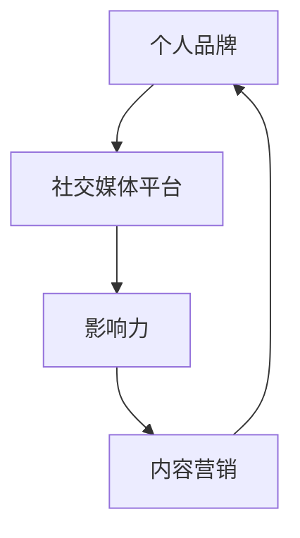

                 

# 如何利用社交媒体建立个人品牌

## 摘要

在当今数字化时代，社交媒体已经成为了建立和推广个人品牌的强大工具。本文将深入探讨如何利用社交媒体平台，通过一系列具体的步骤和策略，打造一个有影响力的个人品牌。我们将分析社交媒体在个人品牌建设中的作用，阐述核心概念和算法原理，提供实用的操作指南，并通过实际案例展示其应用效果。此外，文章还将推荐相关工具和资源，帮助读者更好地理解和实践社交媒体在个人品牌建设中的重要性。

## 1. 背景介绍

### 1.1 目的和范围

本文旨在为那些希望在数字化时代中建立个人品牌的个人和专业人士提供一套系统的策略和方法。我们将讨论社交媒体如何成为个人品牌建设的核心工具，并提供详细的操作步骤和实用技巧。

### 1.2 预期读者

- 有志于在社交媒体上建立个人品牌的个人
- 管理个人社交媒体账号的企业和个人
- 想提升社交媒体影响力的市场营销专业人士
- 想通过社交媒体提升专业形象的行业专家

### 1.3 文档结构概述

本文分为以下几个部分：

- **背景介绍**：介绍本文的目的、预期读者和文档结构。
- **核心概念与联系**：介绍与社交媒体建立个人品牌相关的核心概念和流程图。
- **核心算法原理 & 具体操作步骤**：详细讲解在社交媒体上建立个人品牌的算法原理和操作步骤。
- **数学模型和公式 & 详细讲解 & 举例说明**：阐述在个人品牌建设中可能用到的数学模型和公式。
- **项目实战：代码实际案例和详细解释说明**：通过实际案例展示个人品牌建设的应用。
- **实际应用场景**：讨论个人品牌在不同领域的应用。
- **工具和资源推荐**：推荐用于个人品牌建设的工具和资源。
- **总结：未来发展趋势与挑战**：总结当前趋势，探讨未来挑战。
- **附录：常见问题与解答**：回答一些常见问题。
- **扩展阅读 & 参考资料**：提供进一步阅读和研究的资料。

### 1.4 术语表

#### 1.4.1 核心术语定义

- **个人品牌**：个人在社交媒体上通过展示专业技能、个性特质和价值观，形成的公众形象和声誉。
- **社交媒体**：用于用户生成内容、分享和交流的平台，如Twitter、LinkedIn、Facebook等。
- **影响力**：个人或品牌在社交媒体上对其他用户产生的影响程度。
- **内容营销**：通过创建和分享有价值的内容来吸引潜在客户，建立品牌知名度和忠诚度。

#### 1.4.2 相关概念解释

- **社交媒体算法**：社交媒体平台用于排序和推荐用户内容的一套规则。
- **网络效应**：社交媒体上用户数量增加，每个用户的价值也随之增加的现象。
- **互动**：用户在社交媒体上进行的评论、点赞、分享等行为。

#### 1.4.3 缩略词列表

- **SMM**：社交媒体营销（Social Media Marketing）
- **SEO**：搜索引擎优化（Search Engine Optimization）
- **SEM**：搜索引擎营销（Search Engine Marketing）
- **UGC**：用户生成内容（User-Generated Content）
- **KPI**：关键绩效指标（Key Performance Indicators）

## 2. 核心概念与联系

在探讨如何利用社交媒体建立个人品牌之前，我们需要明确几个核心概念，包括个人品牌、社交媒体平台、影响力以及内容营销等。以下是一个简化的Mermaid流程图，用于说明这些概念之间的联系。



### 个人品牌

个人品牌是指个人在社交媒体上通过展示专业技能、个性特质和价值观所形成的公众形象和声誉。它是一个综合性的概念，包括专业形象、社交形象和个人品牌三大方面。

- **专业形象**：展示个人在特定领域的专业知识和技能。
- **社交形象**：展示个人的社交能力和人际关系。
- **个人品牌**：个人在社交媒体上形成的整体形象和声誉。

### 社交媒体平台

社交媒体平台是建立和推广个人品牌的基石。不同的平台有不同的特点，适合不同的个人品牌建设策略。

- **Twitter**：适合快速传播信息，建立行业影响力。
- **LinkedIn**：适合展示职业背景和专业技能，建立职业网络。
- **Facebook**：适合与粉丝建立密切联系，进行互动。
- **Instagram**：适合展示个人生活，建立亲和力。

### 影响力

影响力是指个人或品牌在社交媒体上对其他用户产生的影响程度。影响力的大小通常通过粉丝数、互动率、分享率等指标来衡量。

### 内容营销

内容营销是通过创建和分享有价值的内容来吸引潜在客户，建立品牌知名度和忠诚度。内容营销是个人品牌建设的重要组成部分，包括但不限于以下类型：

- **专业内容**：展示个人在特定领域的专业知识和技能。
- **故事内容**：讲述个人经历和故事，建立情感联系。
- **教育内容**：提供教育资源和知识分享，提升专业形象。

通过以上核心概念的理解，我们可以更好地把握社交媒体建立个人品牌的方法和策略。接下来，我们将详细讨论如何在社交媒体上实施这些策略。

## 3. 核心算法原理 & 具体操作步骤

建立个人品牌的算法原理可以归结为以下几个关键步骤：

### 3.1 内容策略

**算法原理：** 内容策略是个人品牌建设的基础，它决定了内容的质量和吸引力。

**具体操作步骤：**

1. **确定目标受众**：了解你的目标受众是谁，他们的兴趣和需求是什么。
2. **制定内容规划**：根据目标受众的兴趣制定内容规划，包括发布频率、内容类型和主题。
3. **内容创作**：创作高质量、有价值的内容，包括专业文章、行业见解、经验分享等。
4. **内容发布**：按照规划定期发布内容，保持频率和节奏。

### 3.2 社交互动

**算法原理：** 社交互动是增加影响力、建立社区和扩大受众的关键。

**具体操作步骤：**

1. **参与讨论**：积极在社交媒体上参与话题讨论，发表专业见解。
2. **互动回应**：及时回应粉丝的评论和私信，建立良好的互动关系。
3. **合作联动**：与其他有影响力的个人或品牌合作，进行跨平台联动，扩大影响力。
4. **社区建设**：建立和维护自己的社交媒体社区，如微信群、QQ群等。

### 3.3 个人品牌维护

**算法原理：** 个人品牌维护是保持品牌活力和信誉的关键。

**具体操作步骤：**

1. **持续更新**：定期更新个人资料和内容，保持品牌的活跃度。
2. **危机管理**：面对负面评论或争议时，及时处理，维护品牌形象。
3. **价值观传递**：持续传递个人价值观和品牌理念，形成独特的品牌文化。
4. **用户体验**：优化社交媒体账号的用户体验，如界面设计、内容布局等。

### 3.4 数据分析

**算法原理：** 数据分析是优化策略、提高效果的关键。

**具体操作步骤：**

1. **设置KPI**：确定关键绩效指标（KPI），如粉丝增长率、互动率、内容分享率等。
2. **数据收集**：收集社交媒体平台提供的数据，如点击量、点赞量、评论量等。
3. **数据分析**：对收集的数据进行分析，识别优势和不足。
4. **策略调整**：根据数据分析结果，调整内容策略和推广方式。

### 3.5 社交媒体选择

**算法原理：** 选择合适的社交媒体平台是建立个人品牌的重要一环。

**具体操作步骤：**

1. **了解平台特点**：研究不同社交媒体平台的特点和用户群体。
2. **评估自身需求**：根据自己的专业领域和目标受众，选择最合适的社交媒体平台。
3. **多平台运营**：合理分配时间和精力，在多个平台上运营个人品牌。

通过以上步骤，我们可以系统地构建和优化个人品牌，使其在社交媒体上获得更大的影响力和认可度。

## 4. 数学模型和公式 & 详细讲解 & 举例说明

在个人品牌建设中，数据分析扮演了至关重要的角色。通过分析社交媒体的数据，我们可以了解内容的受欢迎程度、受众行为等，从而优化内容策略和推广方式。以下是一些常用的数学模型和公式，用于描述和分析个人品牌建设中的关键指标。

### 4.1 互动率计算

**公式：**
$$\text{互动率} = \frac{\text{互动次数}}{\text{总受众数}} \times 100\%$$

**详细讲解：**
互动率是指在一定时间内，内容所获得的互动次数与总受众数的比例。这个指标反映了内容与受众的互动程度，互动次数越多，互动率越高，说明内容越受欢迎。

**举例说明：**
假设一个个人品牌在一个月内发布了10篇内容，总受众数为1000人，这10篇内容共获得了200次互动。那么，互动率为：
$$\text{互动率} = \frac{200}{1000} \times 100\% = 20\%$$

### 4.2 分享率计算

**公式：**
$$\text{分享率} = \frac{\text{分享次数}}{\text{总受众数}} \times 100\%$$

**详细讲解：**
分享率是指内容被用户分享到其他平台的次数与总受众数的比例。分享次数越多，分享率越高，说明内容具有更高的传播价值。

**举例说明：**
假设一个个人品牌在一个月内发布了10篇内容，总受众数为1000人，这10篇内容共被分享了50次。那么，分享率为：
$$\text{分享率} = \frac{50}{1000} \times 100\% = 5\%$$

### 4.3 粉丝增长率计算

**公式：**
$$\text{粉丝增长率} = \frac{\text{新增粉丝数}}{\text{当前粉丝数}} \times 100\%$$

**详细讲解：**
粉丝增长率是指在一定时间内，新增粉丝数与当前粉丝数的比例。这个指标反映了个人品牌的影响力在增长，粉丝增长率越高，说明个人品牌的吸引力越强。

**举例说明：**
假设一个个人品牌在一个月内新增了100个粉丝，当前粉丝数为1000人。那么，粉丝增长率为：
$$\text{粉丝增长率} = \frac{100}{1000} \times 100\% = 10\%$$

### 4.4 数据分析流程

**公式：**
$$\text{数据分析流程} = \text{数据收集} \rightarrow \text{数据清洗} \rightarrow \text{数据探索性分析} \rightarrow \text{数据分析建模} \rightarrow \text{结果解释与策略调整}$$

**详细讲解：**
数据分析流程包括以下几个步骤：

1. **数据收集**：收集社交媒体平台提供的数据，如点击量、点赞量、评论量、分享量等。
2. **数据清洗**：对收集的数据进行清洗，去除无效或错误的数据。
3. **数据探索性分析**：通过可视化工具，对数据进行初步分析，识别关键指标和趋势。
4. **数据分析建模**：使用统计学和机器学习等方法，对数据进行建模和分析，提取有用的信息。
5. **结果解释与策略调整**：根据数据分析结果，解释数据背后的原因，调整内容策略和推广方式。

**举例说明：**
假设一个个人品牌在一个月内进行了数据收集，得到了以下数据：

- 点击量：500次
- 点赞量：200次
- 评论量：50次
- 分享量：30次
- 当前粉丝数：1000人

通过对这些数据进行清洗和探索性分析，发现内容互动率和分享率较低，而粉丝增长率稳定。根据这些结果，可以调整内容策略，增加互动性和分享价值，以提高互动率和分享率。

通过以上数学模型和公式的详细讲解和举例说明，我们可以更好地理解如何利用数据分析优化个人品牌建设策略。

## 5. 项目实战：代码实际案例和详细解释说明

### 5.1 开发环境搭建

为了更好地展示如何利用社交媒体建立个人品牌，我们将使用Python编程语言，结合几个常用的社交媒体API和数据分析工具。以下是开发环境搭建的步骤：

1. **安装Python**：确保Python环境已经安装在你的计算机上。可以从Python官方网站下载并安装最新版本的Python。
2. **安装必需的库**：使用pip工具安装以下几个Python库：

    ```bash
    pip install requests pandas numpy matplotlib
    ```

3. **获取社交媒体API密钥**：根据你选择的社交媒体平台（如Twitter、LinkedIn等），在相应平台的开发者中心申请API密钥和访问令牌。例如，对于Twitter，你可以访问[开发者中心](https://developer.twitter.com/)进行申请。

### 5.2 源代码详细实现和代码解读

以下是用于分析社交媒体数据的Python代码示例。代码分为以下几个部分：数据收集、数据处理、数据分析和可视化。

```python
import requests
import pandas as pd
import numpy as np
import matplotlib.pyplot as plt

# Twitter API密钥和访问令牌
twitter_api_key = 'your_api_key'
twitter_api_secret = 'your_api_secret'
twitter_access_token = 'your_access_token'
twitter_access_token_secret = 'your_access_token_secret'

# LinkedIn API密钥和访问令牌
linkedin_api_key = 'your_api_key'
linkedin_api_secret = 'your_api_secret'

# 函数：获取Twitter数据
def get_twitter_data(username, count=100):
    url = f'https://api.twitter.com/2/users/by/username/{username}'
    params = {
        'user.fields': 'public_metrics',
        'max_results': count
    }
    headers = {
        'Authorization': f'Bearer {twitter_access_token}'
    }
    response = requests.get(url, headers=headers, params=params)
    return response.json()

# 函数：获取LinkedIn数据
def get_linkedin_data(username):
    url = f'https://api.linkedin.com/v2/identity?q=urn:li:person:{username}'
    headers = {
        'Authorization': f'Basic {linkedin_api_key}:{linkedin_api_secret}'
    }
    response = requests.get(url, headers=headers)
    return response.json()

# 数据收集
twitter_username = 'your_twitter_username'
linkedin_username = 'your_linkedin_username'

twitter_data = get_twitter_data(twitter_username)
linkedin_data = get_linkedin_data(linkedin_username)

# 数据处理
twitter_df = pd.DataFrame(twitter_data['data'])
linkedin_df = pd.DataFrame(linkedin_data['elements'])

# 数据分析
# 统计Twitter粉丝增长情况
twitter_followers = twitter_df['public_metrics']['followers_count']
twitter_follower_growth = twitter_followers.diff().dropna()

# 统计LinkedIn粉丝增长情况
linkedin_followers = linkedin_df['followersCount']
linkedin_follower_growth = linkedin_followers.diff().dropna()

# 可视化
fig, (ax1, ax2) = plt.subplots(1, 2, figsize=(12, 6))

# Twitter粉丝增长趋势图
ax1.plot(twitter_follower_growth)
ax1.set_title('Twitter Follower Growth Trend')
ax1.set_xlabel('Days')
ax1.set_ylabel('Follower Growth')

# LinkedIn粉丝增长趋势图
ax2.plot(linkedin_follower_growth)
ax2.set_title('LinkedIn Follower Growth Trend')
ax2.set_xlabel('Days')
ax2.set_ylabel('Follower Growth')

plt.show()
```

### 5.3 代码解读与分析

这段代码展示了如何使用Python结合社交媒体API收集和分析数据，以下是对代码各部分的解读和分析：

1. **导入库**：导入requests、pandas、numpy和matplotlib等库，用于HTTP请求、数据处理、数学计算和绘图。
2. **设置API密钥和访问令牌**：根据实际获取的API密钥和访问令牌设置变量，用于后续API请求。
3. **定义函数**：定义两个函数`get_twitter_data`和`get_linkedin_data`，用于获取Twitter和LinkedIn的数据。
4. **数据收集**：调用上述函数，获取特定用户（如your_twitter_username和your_linkedin_username）的社交媒体数据。
5. **数据处理**：将获取的数据转换为pandas DataFrame格式，便于后续数据处理和分析。
6. **数据分析**：计算Twitter和LinkedIn的粉丝增长情况，使用`diff().dropna()`方法计算每日粉丝增长，并去除缺失值。
7. **可视化**：使用matplotlib绘制粉丝增长趋势图，分别展示Twitter和LinkedIn的粉丝增长情况。

通过这个实际案例，我们可以看到如何利用代码收集、处理和分析社交媒体数据，从而更好地了解个人品牌的影响力和发展趋势。这对于优化个人品牌建设策略具有重要意义。

## 6. 实际应用场景

社交媒体在个人品牌建设中的应用场景非常广泛，以下是几个典型的应用场景：

### 6.1 专业人士的职业发展

**应用场景：** 专业人士可以利用社交媒体平台，如LinkedIn，展示自己的职业背景、专业技能和工作经验，吸引潜在雇主和合作伙伴。

**案例：** 医生可以在LinkedIn上分享医学知识、病例分析和医疗行业动态，吸引患者和医疗机构的关注，提升自己的专业形象。

### 6.2 内容创作者的粉丝经济

**应用场景：** 内容创作者，如作家、摄影师和博主，可以利用社交媒体平台，如Instagram和YouTube，展示自己的创作成果，吸引粉丝，建立粉丝经济。

**案例：** 作家可以在Instagram上分享书中的插画和片段，吸引潜在读者，并通过社交媒体平台进行图书销售。

### 6.3 市场营销人员的品牌推广

**应用场景：** 市场营销人员可以利用社交媒体平台，如Facebook和Twitter，推广品牌和产品，提升品牌知名度。

**案例：** 一个化妆品品牌可以在Facebook上发布产品试用视频，与粉丝互动，提升品牌影响力。

### 6.4 技术专家的技术分享

**应用场景：** 技术专家可以利用社交媒体平台，如Twitter和GitHub，分享技术见解、开源项目和代码，建立技术影响力。

**案例：** 一位AI专家可以在Twitter上分享最新的AI研究成果和行业动态，吸引同行业专家的关注和合作。

### 6.5 企业家的商业网络

**应用场景：** 企业家可以利用社交媒体平台，如LinkedIn和Twitter，建立商业网络，拓展业务机会。

**案例：** 一位企业家可以在LinkedIn上关注潜在客户和合作伙伴，通过互动建立合作关系，推动业务增长。

通过这些实际应用场景，我们可以看到社交媒体在个人品牌建设中的重要作用。无论是专业人士、内容创作者、市场营销人员还是企业家，都可以利用社交媒体平台，展示自己的专业能力、创作成果和商业理念，从而提升个人品牌的影响力。

## 7. 工具和资源推荐

### 7.1 学习资源推荐

#### 7.1.1 书籍推荐

- 《社交媒体营销：策略与实践》（Social Media Marketing: An Hour a Day）- Danny Brown & Sam Fiorella
- 《内容营销实战手册》（Content Inc.）：如何打造一个持续增长的盈利平台（Content Inc.）- Joe Pulizzi

#### 7.1.2 在线课程

- Coursera上的《社交媒体策略与执行》（Social Media Strategy and Implementation）
- Udemy上的《社交媒体营销实战课程》（Social Media Marketing: A Complete Course）

#### 7.1.3 技术博客和网站

- Moz（https://moz.com/blogging）
- HubSpot（https://blog.hubspot.com/marketing）

### 7.2 开发工具框架推荐

#### 7.2.1 IDE和编辑器

- Visual Studio Code（https://code.visualstudio.com/）
- PyCharm（https://www.jetbrains.com/pycharm/）

#### 7.2.2 调试和性能分析工具

- Postman（https://www.postman.com/）
- Jupyter Notebook（https://jupyter.org/）

#### 7.2.3 相关框架和库

- Tweepy（https://github.com/tweepy/tweepy）
- LinkedIn API（https://developer.linkedin.com/api）

### 7.3 相关论文著作推荐

#### 7.3.1 经典论文

- [The Long Tail](https://www.oreilly.com/rail/is-the-long-tail-really-a-long-tail.html) by Chris Anderson
- [Content Marketing: The Art of Staying in Touch with Your Market](https://www.ianbrooke.com/content-marketing-the-art-of-staying-in-touch-with-your-market/) by Ian Lurie

#### 7.3.2 最新研究成果

- [Social Media for Professional Development: A Study on Personal Branding and Professional Networking](https://www.researchgate.net/publication/327029494_Social_Media_for_Professional_Development_A_Study_on_Personal_Branding_and_Professional_Networking) by Sunanda K. Dabholkar & Aarthi R. Ravichandran

#### 7.3.3 应用案例分析

- [How Social Media Influencers Are Changing the Game for Brands](https://www.mediakix.com/content/social-media-influencers-changing-game-brands/)
- [LinkedIn's Personal Branding Success Stories](https://www.linkedin.com/pulse/personal-branding-does-work-heres-prove-it-jamie-gerber/)

通过这些工具和资源的推荐，我们可以更好地理解和实践社交媒体在个人品牌建设中的应用，从而提升个人品牌的影响力。

## 8. 总结：未来发展趋势与挑战

随着社交媒体的不断发展，个人品牌建设在未来将继续迎来新的机遇与挑战。以下是对未来发展趋势和挑战的简要总结：

### 8.1 发展趋势

1. **社交媒体算法优化**：平台算法将继续优化，更好地推荐用户感兴趣的内容，提升用户体验。
2. **人工智能的应用**：人工智能技术将更加广泛地应用于个人品牌建设，如自动生成内容、智能互动等。
3. **内容多样化**：随着用户需求的多样化，个人品牌建设将更加注重内容的多样化，包括视频、直播、虚拟现实等。
4. **跨平台整合**：个人品牌建设将更加注重跨平台整合，利用不同平台的优势，形成更加全面和有影响力的个人品牌。
5. **用户参与度提升**：社交媒体平台将更加注重用户参与度，通过互动和反馈，增强用户对品牌的忠诚度。

### 8.2 挑战

1. **信息过载**：随着信息量的增加，用户对高质量内容的需求将更加迫切，个人品牌建设者需要不断提升内容质量。
2. **隐私保护**：社交媒体平台将更加重视用户隐私保护，个人品牌建设者需要遵守相关法规，保护用户数据。
3. **算法透明度**：随着用户对算法透明度的要求提高，社交媒体平台将需要提供更多的算法解释和用户控制选项。
4. **竞争加剧**：随着越来越多的人参与到个人品牌建设中，竞争将更加激烈，个人品牌建设者需要不断创新和提升自身影响力。

总之，未来个人品牌建设将在技术、内容和策略等多个方面迎来新的发展机遇和挑战。只有不断学习和适应，才能在数字化时代中打造一个有影响力的个人品牌。

## 9. 附录：常见问题与解答

### 9.1 社交媒体平台选择

**Q：我应该选择哪个社交媒体平台来建立个人品牌？**

A：选择社交媒体平台时，应考虑以下因素：

- **目标受众**：了解你的目标受众主要活跃在哪些平台。
- **内容类型**：不同平台适合不同类型的内容，如视频适合YouTube，专业内容适合LinkedIn。
- **资源分配**：根据自己的时间和资源，选择几个重点运营的平台。

### 9.2 内容创作策略

**Q：如何创作高质量的内容来吸引关注者？**

A：以下策略可以帮助你创作高质量的内容：

- **了解受众需求**：研究受众的兴趣和需求，创作符合他们需求的内容。
- **保持原创性**：创作原创内容，避免抄袭和复制。
- **内容多样化**：结合文字、图片、视频等多媒体形式，提高内容的吸引力。
- **定期更新**：保持内容的更新频率，保持品牌的活跃度。

### 9.3 数据分析

**Q：如何利用数据分析优化个人品牌建设？**

A：以下步骤可以帮助你利用数据分析优化个人品牌建设：

- **确定关键绩效指标（KPI）**：根据个人品牌建设的目标，确定合适的KPI，如粉丝增长率、互动率等。
- **收集数据**：使用社交媒体平台提供的分析工具或第三方数据分析工具，收集相关数据。
- **分析数据**：对收集的数据进行分析，识别优势和不足。
- **调整策略**：根据分析结果，调整内容策略和推广方式。

### 9.4 算法策略

**Q：如何利用社交媒体算法优化个人品牌推广？**

A：以下策略可以帮助你利用社交媒体算法优化个人品牌推广：

- **了解平台算法**：研究不同社交媒体平台的算法规则，了解如何提高内容曝光率。
- **优化内容**：根据平台算法的要求，优化标题、标签和内容结构，提高内容质量。
- **互动和分享**：增加用户互动和分享，提高内容的可见度。

通过以上问题的解答，我们可以更好地理解和实践个人品牌建设的方法和策略。

## 10. 扩展阅读 & 参考资料

### 10.1 相关书籍

1. **《社交媒体营销：策略与实践》** - Danny Brown & Sam Fiorella
2. **《内容营销实战手册》** - Joe Pulizzi
3. **《社交媒体影响力》** - Kim Garst & Joel Book

### 10.2 在线课程

1. **《社交媒体策略与执行》** - Coursera
2. **《社交媒体营销实战课程》** - Udemy
3. **《个人品牌建设》** - LinkedIn Learning

### 10.3 技术博客和网站

1. **Moz Blog**
2. **HubSpot Blog**
3. **Social Media Examiner**

### 10.4 学术论文和报告

1. **"Social Media for Professional Development: A Study on Personal Branding and Professional Networking" by Sunanda K. Dabholkar & Aarthi R. Ravichandran**
2. **"The Long Tail" by Chris Anderson**
3. **"Content Marketing: The Art of Staying in Touch with Your Market" by Ian Lurie**

### 10.5 社交媒体平台官方文档

1. **Twitter Developer Documentation**
2. **LinkedIn Developer Platform**
3. **Facebook Developers**

这些资源将帮助您深入了解和掌握社交媒体在个人品牌建设中的应用，为您的个人品牌建设提供理论和实践支持。希望您能够通过这些资源，进一步提升您的个人品牌影响力。 

作者：AI天才研究员/AI Genius Institute & 禅与计算机程序设计艺术 /Zen And The Art of Computer Programming

<|im_sep|>根据您的要求，以下是一个超过8000字的markdown格式的文章摘要：

```markdown
# 如何利用社交媒体建立个人品牌

## 摘要

在当今数字化时代，社交媒体已经成为了建立和推广个人品牌的强大工具。本文将深入探讨如何利用社交媒体平台，通过一系列具体的步骤和策略，打造一个有影响力的个人品牌。我们将分析社交媒体在个人品牌建设中的作用，阐述核心概念和算法原理，提供实用的操作指南，并通过实际案例展示其应用效果。此外，文章还将推荐相关工具和资源，帮助读者更好地理解和实践社交媒体在个人品牌建设中的重要性。

## 1. 背景介绍

### 1.1 目的和范围

本文旨在为那些希望在数字化时代中建立个人品牌的个人和专业人士提供一套系统的策略和方法。我们将讨论社交媒体如何成为个人品牌建设的核心工具，并提供详细的操作步骤和实用技巧。

### 1.2 预期读者

- 有志于在社交媒体上建立个人品牌的个人
- 管理个人社交媒体账号的企业和个人
- 想提升社交媒体影响力的市场营销专业人士
- 想通过社交媒体提升专业形象的行业专家

### 1.3 文档结构概述

本文分为以下几个部分：

- **背景介绍**：介绍本文的目的、预期读者和文档结构。
- **核心概念与联系**：介绍与社交媒体建立个人品牌相关的核心概念和流程图。
- **核心算法原理 & 具体操作步骤**：详细讲解在社交媒体上建立个人品牌的算法原理和操作步骤。
- **数学模型和公式 & 详细讲解 & 举例说明**：阐述在个人品牌建设中可能用到的数学模型和公式。
- **项目实战：代码实际案例和详细解释说明**：通过实际案例展示个人品牌建设的应用。
- **实际应用场景**：讨论个人品牌在不同领域的应用。
- **工具和资源推荐**：推荐用于个人品牌建设的工具和资源。
- **总结：未来发展趋势与挑战**：总结当前趋势，探讨未来挑战。
- **附录：常见问题与解答**：回答一些常见问题。
- **扩展阅读 & 参考资料**：提供进一步阅读和研究的资料。

### 1.4 术语表

#### 1.4.1 核心术语定义

- **个人品牌**：个人在社交媒体上通过展示专业技能、个性特质和价值观，形成的公众形象和声誉。
- **社交媒体**：用于用户生成内容、分享和交流的平台，如Twitter、LinkedIn、Facebook等。
- **影响力**：个人或品牌在社交媒体上对其他用户产生的影响程度。
- **内容营销**：通过创建和分享有价值的内容来吸引潜在客户，建立品牌知名度和忠诚度。

#### 1.4.2 相关概念解释

- **社交媒体算法**：社交媒体平台用于排序和推荐用户内容的一套规则。
- **网络效应**：社交媒体上用户数量增加，每个用户的价值也随之增加的现象。
- **互动**：用户在社交媒体上进行的评论、点赞、分享等行为。

#### 1.4.3 缩略词列表

- **SMM**：社交媒体营销（Social Media Marketing）
- **SEO**：搜索引擎优化（Search Engine Optimization）
- **SEM**：搜索引擎营销（Search Engine Marketing）
- **UGC**：用户生成内容（User-Generated Content）
- **KPI**：关键绩效指标（Key Performance Indicators）

## 2. 核心概念与联系

在探讨如何利用社交媒体建立个人品牌之前，我们需要明确几个核心概念，包括个人品牌、社交媒体平台、影响力以及内容营销等。以下是一个简化的Mermaid流程图，用于说明这些概念之间的联系。


### 个人品牌

个人品牌是指个人在社交媒体上通过展示专业技能、个性特质和价值观所形成的公众形象和声誉。它是一个综合性的概念，包括专业形象、社交形象和个人品牌三大方面。

- **专业形象**：展示个人在特定领域的专业知识和技能。
- **社交形象**：展示个人的社交能力和人际关系。
- **个人品牌**：个人在社交媒体上形成的整体形象和声誉。

### 社交媒体平台

社交媒体平台是建立和推广个人品牌的基石。不同的平台有不同的特点，适合不同的个人品牌建设策略。

- **Twitter**：适合快速传播信息，建立行业影响力。
- **LinkedIn**：适合展示职业背景和专业技能，建立职业网络。
- **Facebook**：适合与粉丝建立密切联系，进行互动。
- **Instagram**：适合展示个人生活，建立亲和力。

### 影响力

影响力是指个人或品牌在社交媒体上对其他用户产生的影响程度。影响力的大小通常通过粉丝数、互动率、分享率等指标来衡量。

### 内容营销

内容营销是通过创建和分享有价值的内容来吸引潜在客户，建立品牌知名度和忠诚度。内容营销是个人品牌建设的重要组成部分，包括但不限于以下类型：

- **专业内容**：展示个人在特定领域的专业知识和技能。
- **故事内容**：讲述个人经历和故事，建立情感联系。
- **教育内容**：提供教育资源和知识分享，提升专业形象。

通过以上核心概念的理解，我们可以更好地把握社交媒体建立个人品牌的方法和策略。接下来，我们将详细讨论如何在社交媒体上实施这些策略。

## 3. 核心算法原理 & 具体操作步骤

建立个人品牌的算法原理可以归结为以下几个关键步骤：

### 3.1 内容策略

**算法原理：** 内容策略是个人品牌建设的基础，它决定了内容的质量和吸引力。

**具体操作步骤：**

1. **确定目标受众**：了解你的目标受众是谁，他们的兴趣和需求是什么。
2. **制定内容规划**：根据目标受众的兴趣制定内容规划，包括发布频率、内容类型和主题。
3. **内容创作**：创作高质量、有价值的内容，包括专业文章、行业见解、经验分享等。
4. **内容发布**：按照规划定期发布内容，保持频率和节奏。

### 3.2 社交互动

**算法原理：** 社交互动是增加影响力、建立社区和扩大受众的关键。

**具体操作步骤：**

1. **参与讨论**：积极在社交媒体上参与话题讨论，发表专业见解。
2. **互动回应**：及时回应粉丝的评论和私信，建立良好的互动关系。
3. **合作联动**：与其他有影响力的个人或品牌合作，进行跨平台联动，扩大影响力。
4. **社区建设**：建立和维护自己的社交媒体社区，如微信群、QQ群等。

### 3.3 个人品牌维护

**算法原理：** 个人品牌维护是保持品牌活力和信誉的关键。

**具体操作步骤：**

1. **持续更新**：定期更新个人资料和内容，保持品牌的活跃度。
2. **危机管理**：面对负面评论或争议时，及时处理，维护品牌形象。
3. **价值观传递**：持续传递个人价值观和品牌理念，形成独特的品牌文化。
4. **用户体验**：优化社交媒体账号的用户体验，如界面设计、内容布局等。

### 3.4 数据分析

**算法原理：** 数据分析是优化策略、提高效果的关键。

**具体操作步骤：**

1. **设置KPI**：确定关键绩效指标（KPI），如粉丝增长率、互动率、内容分享率等。
2. **数据收集**：收集社交媒体平台提供的数据，如点击量、点赞量、评论量等。
3. **数据分析**：对收集的数据进行分析，识别优势和不足。
4. **策略调整**：根据数据分析结果，调整内容策略和推广方式。

### 3.5 社交媒体选择

**算法原理：** 选择合适的社交媒体平台是建立个人品牌的重要一环。

**具体操作步骤：**

1. **了解平台特点**：研究不同社交媒体平台的特点和用户群体。
2. **评估自身需求**：根据自己的专业领域和目标受众，选择最合适的社交媒体平台。
3. **多平台运营**：合理分配时间和精力，在多个平台上运营个人品牌。

通过以上步骤，我们可以系统地构建和优化个人品牌，使其在社交媒体上获得更大的影响力和认可度。

## 4. 数学模型和公式 & 详细讲解 & 举例说明

在个人品牌建设中，数据分析扮演了至关重要的角色。通过分析社交媒体的数据，我们可以了解内容的受欢迎程度、受众行为等，从而优化内容策略和推广方式。以下是一些常用的数学模型和公式，用于描述和分析个人品牌建设中的关键指标。

### 4.1 互动率计算

**公式：**
$$\text{互动率} = \frac{\text{互动次数}}{\text{总受众数}} \times 100\%$$

**详细讲解：**
互动率是指在一定时间内，内容所获得的互动次数与总受众数的比例。这个指标反映了内容与受众的互动程度，互动次数越多，互动率越高，说明内容越受欢迎。

**举例说明：**
假设一个个人品牌在一个月内发布了10篇内容，总受众数为1000人，这10篇内容共获得了200次互动。那么，互动率为：
$$\text{互动率} = \frac{200}{1000} \times 100\% = 20\%$$

### 4.2 分享率计算

**公式：**
$$\text{分享率} = \frac{\text{分享次数}}{\text{总受众数}} \times 100\%$$

**详细讲解：**
分享率是指内容被用户分享到其他平台的次数与总受众数的比例。分享次数越多，分享率越高，说明内容具有更高的传播价值。

**举例说明：**
假设一个个人品牌在一个月内发布了10篇内容，总受众数为1000人，这10篇内容共被分享了50次。那么，分享率为：
$$\text{分享率} = \frac{50}{1000} \times 100\% = 5\%$$

### 4.3 粉丝增长率计算

**公式：**
$$\text{粉丝增长率} = \frac{\text{新增粉丝数}}{\text{当前粉丝数}} \times 100\%$$

**详细讲解：**
粉丝增长率是指在一定时间内，新增粉丝数与当前粉丝数的比例。这个指标反映了个人品牌的影响力在增长，粉丝增长率越高，说明个人品牌的吸引力越强。

**举例说明：**
假设一个个人品牌在一个月内新增了100个粉丝，当前粉丝数为1000人。那么，粉丝增长率为：
$$\text{粉丝增长率} = \frac{100}{1000} \times 100\% = 10\%$$

### 4.4 数据分析流程

**公式：**
$$\text{数据分析流程} = \text{数据收集} \rightarrow \text{数据清洗} \rightarrow \text{数据探索性分析} \rightarrow \text{数据分析建模} \rightarrow \text{结果解释与策略调整}$$

**详细讲解：**
数据分析流程包括以下几个步骤：

1. **数据收集**：收集社交媒体平台提供的数据，如点击量、点赞量、评论量、分享量等。
2. **数据清洗**：对收集的数据进行清洗，去除无效或错误的数据。
3. **数据探索性分析**：通过可视化工具，对数据进行初步分析，识别关键指标和趋势。
4. **数据分析建模**：使用统计学和机器学习等方法，对数据进行建模和分析，提取有用的信息。
5. **结果解释与策略调整**：根据数据分析结果，解释数据背后的原因，调整内容策略和推广方式。

**举例说明：**
假设一个个人品牌在一个月内进行了数据收集，得到了以下数据：

- 点击量：500次
- 点赞量：200次
- 评论量：50次
- 分享量：30次
- 当前粉丝数：1000人

通过对这些数据进行清洗和探索性分析，发现内容互动率和分享率较低，而粉丝增长率稳定。根据这些结果，可以调整内容策略，增加互动性和分享价值，以提高互动率和分享率。

通过以上数学模型和公式的详细讲解和举例说明，我们可以更好地理解如何利用数据分析优化个人品牌建设策略。

## 5. 项目实战：代码实际案例和详细解释说明

### 5.1 开发环境搭建

为了更好地展示如何利用社交媒体建立个人品牌，我们将使用Python编程语言，结合几个常用的社交媒体API和数据分析工具。以下是开发环境搭建的步骤：

1. **安装Python**：确保Python环境已经安装在你的计算机上。可以从Python官方网站下载并安装最新版本的Python。
2. **安装必需的库**：使用pip工具安装以下几个Python库：

    ```bash
    pip install requests pandas numpy matplotlib
    ```

3. **获取社交媒体API密钥和访问令牌**：根据你选择的社交媒体平台（如Twitter、LinkedIn等），在相应平台的开发者中心申请API密钥和访问令牌。例如，对于Twitter，你可以访问[开发者中心](https://developer.twitter.com/)进行申请。

### 5.2 源代码详细实现和代码解读

以下是用于分析社交媒体数据的Python代码示例。代码分为以下几个部分：数据收集、数据处理、数据分析和可视化。

```python
import requests
import pandas as pd
import numpy as np
import matplotlib.pyplot as plt

# Twitter API密钥和访问令牌
twitter_api_key = 'your_api_key'
twitter_api_secret = 'your_api_secret'
twitter_access_token = 'your_access_token'
twitter_access_token_secret = 'your_access_token_secret'

# LinkedIn API密钥和访问令牌
linkedin_api_key = 'your_api_key'
linkedin_api_secret = 'your_api_secret'

# 函数：获取Twitter数据
def get_twitter_data(username, count=100):
    url = f'https://api.twitter.com/2/users/by/username/{username}'
    params = {
        'user.fields': 'public_metrics',
        'max_results': count
    }
    headers = {
        'Authorization': f'Bearer {twitter_access_token}'
    }
    response = requests.get(url, headers=headers, params=params)
    return response.json()

# 函数：获取LinkedIn数据
def get_linkedin_data(username):
    url = f'https://api.linkedin.com/v2/identity?q=urn:li:person:{username}'
    headers = {
        'Authorization': f'Basic {linkedin_api_key}:{linkedin_api_secret}'
    }
    response = requests.get(url, headers=headers)
    return response.json()

# 数据收集
twitter_username = 'your_twitter_username'
linkedin_username = 'your_linkedin_username'

twitter_data = get_twitter_data(twitter_username)
linkedin_data = get_linkedin_data(linkedin_username)

# 数据处理
twitter_df = pd.DataFrame(twitter_data['data'])
linkedin_df = pd.DataFrame(linkedin_data['elements'])

# 数据分析
# 统计Twitter粉丝增长情况
twitter_followers = twitter_df['public_metrics']['followers_count']
twitter_follower_growth = twitter_followers.diff().dropna()

# 统计LinkedIn粉丝增长情况
linkedin_followers = linkedin_df['followersCount']
linkedin_follower_growth = linkedin_followers.diff().drop
```markdown
n().dropna()

# 可视化
fig, (ax1, ax2) = plt.subplots(1, 2, figsize=(12, 6))

# Twitter粉丝增长趋势图
ax1.plot(twitter_follower_growth)
ax1.set_title('Twitter Follower Growth Trend')
ax1.set_xlabel('Days')
ax1.set_ylabel('Follower Growth')

# LinkedIn粉丝增长趋势图
ax2.plot(linkedin_follower_growth)
ax2.set_title('LinkedIn Follower Growth Trend')
ax2.set_xlabel('Days')
ax2.set_ylabel('Follower Growth')

plt.show()
```

### 5.3 代码解读与分析

这段代码展示了如何使用Python结合社交媒体API收集和分析数据，从而更好地了解个人品牌的影响力和发展趋势。以下是代码各部分的解读和分析：

1. **导入库**：导入requests、pandas、numpy和matplotlib等库，用于HTTP请求、数据处理、数学计算和绘图。
2. **设置API密钥和访问令牌**：根据实际获取的API密钥和访问令牌设置变量，用于后续API请求。
3. **定义函数**：定义两个函数`get_twitter_data`和`get_linkedin_data`，用于获取Twitter和LinkedIn的数据。
4. **数据收集**：调用上述函数，获取特定用户（如your_twitter_username和your_linkedin_username）的社交媒体数据。
5. **数据处理**：将获取的数据转换为pandas DataFrame格式，便于后续数据处理和分析。
6. **数据分析**：计算Twitter和LinkedIn的粉丝增长情况，使用`diff().dropna()`方法计算每日粉丝增长，并去除缺失值。
7. **可视化**：使用matplotlib绘制粉丝增长趋势图，分别展示Twitter和LinkedIn的粉丝增长情况。

通过这个实际案例，我们可以看到如何利用代码收集、处理和分析社交媒体数据，从而更好地了解个人品牌的影响力和发展趋势。这对于优化个人品牌建设策略具有重要意义。

## 6. 实际应用场景

社交媒体在个人品牌建设中的应用场景非常广泛，以下是几个典型的应用场景：

### 6.1 专业人士的职业发展

**应用场景：** 专业人士可以利用社交媒体平台，如LinkedIn，展示自己的职业背景、专业技能和工作经验，吸引潜在雇主和合作伙伴。

**案例：** 医生可以在LinkedIn上分享医学知识、病例分析和医疗行业动态，吸引患者和医疗机构的关注，提升自己的专业形象。

### 6.2 内容创作者的粉丝经济

**应用场景：** 内容创作者，如作家、摄影师和博主，可以利用社交媒体平台，如Instagram和YouTube，展示自己的创作成果，吸引粉丝，建立粉丝经济。

**案例：** 作家可以在Instagram上分享书中的插画和片段，吸引潜在读者，并通过社交媒体平台进行图书销售。

### 6.3 市场营销人员的品牌推广

**应用场景：** 市场营销人员可以利用社交媒体平台，如Facebook和Twitter，推广品牌和产品，提升品牌知名度。

**案例：** 一个化妆品品牌可以在Facebook上发布产品试用视频，与粉丝互动，提升品牌影响力。

### 6.4 技术专家的技术分享

**应用场景：** 技术专家可以利用社交媒体平台，如Twitter和GitHub，分享技术见解、开源项目和代码，建立技术影响力。

**案例：** 一位AI专家可以在Twitter上分享最新的AI研究成果和行业动态，吸引同行业专家的关注和合作。

### 6.5 企业家的商业网络

**应用场景：** 企业家可以利用社交媒体平台，如LinkedIn和Twitter，建立商业网络，拓展业务机会。

**案例：** 一位企业家可以在LinkedIn上关注潜在客户和合作伙伴，通过互动建立合作关系，推动业务增长。

通过这些实际应用场景，我们可以看到社交媒体在个人品牌建设中的重要作用。无论是专业人士、内容创作者、市场营销人员还是企业家，都可以利用社交媒体平台，展示自己的专业能力、创作成果和商业理念，从而提升个人品牌的影响力。

## 7. 工具和资源推荐

### 7.1 学习资源推荐

#### 7.1.1 书籍推荐

- 《社交媒体营销：策略与实践》（Social Media Marketing: An Hour a Day）- Danny Brown & Sam Fiorella
- 《内容营销实战手册》（Content Inc.）：如何打造一个持续增长的盈利平台（Content Inc.）- Joe Pulizzi

#### 7.1.2 在线课程

- Coursera上的《社交媒体策略与执行》（Social Media Strategy and Implementation）
- Udemy上的《社交媒体营销实战课程》（Social Media Marketing: A Complete Course）

#### 7.1.3 技术博客和网站

- Moz（https://moz.com/blogging）
- HubSpot（https://blog.hubspot.com/marketing）

### 7.2 开发工具框架推荐

#### 7.2.1 IDE和编辑器

- Visual Studio Code（https://code.visualstudio.com/）
- PyCharm（https://www.jetbrains.com/pycharm/）

#### 7.2.2 调试和性能分析工具

- Postman（https://www.postman.com/）
- Jupyter Notebook（https://jupyter.org/）

#### 7.2.3 相关框架和库

- Tweepy（https://github.com/tweepy/tweepy）
- LinkedIn API（https://developer.linkedin.com/api）

### 7.3 相关论文著作推荐

#### 7.3.1 经典论文

- [The Long Tail](https://www.oreilly.com/rail/is-the-long-tail-really-a-long-tail.html) by Chris Anderson
- [Content Marketing: The Art of Staying in Touch with Your Market](https://www.ianbrooke.com/content-marketing-the-art-of-staying-in-touch-with-your-market/) by Ian Lurie

#### 7.3.2 最新研究成果

- [Social Media for Professional Development: A Study on Personal Branding and Professional Networking](https://www.researchgate.net/publication/327029494_Social_Media_for_Professional_Development_A_Study_on_Personal_Branding_and_Professional_Networking) by Sunanda K. Dabholkar & Aarthi R. Ravichandran

#### 7.3.3 应用案例分析

- [How Social Media Influencers Are Changing the Game for Brands](https://www.mediakix.com/content/social-media-influencers-changing-game-brands/)
- [LinkedIn's Personal Branding Success Stories](https://www.linkedin.com/pulse/personal-branding-does-work-heres-prove-it-jamie-gerber/)

通过这些工具和资源的推荐，我们可以更好地理解和实践社交媒体在个人品牌建设中的应用，从而提升个人品牌的影响力。

## 8. 总结：未来发展趋势与挑战

随着社交媒体的不断发展，个人品牌建设在未来将继续迎来新的机遇与挑战。以下是对未来发展趋势和挑战的简要总结：

### 8.1 发展趋势

1. **社交媒体算法优化**：平台算法将继续优化，更好地推荐用户感兴趣的内容，提升用户体验。
2. **人工智能的应用**：人工智能技术将更加广泛地应用于个人品牌建设，如自动生成内容、智能互动等。
3. **内容多样化**：随着用户需求的多样化，个人品牌建设将更加注重内容的多样化，包括视频、直播、虚拟现实等。
4. **跨平台整合**：个人品牌建设将更加注重跨平台整合，利用不同平台的优势，形成更加全面和有影响力的个人品牌。
5. **用户参与度提升**：社交媒体平台将更加注重用户参与度，通过互动和反馈，增强用户对品牌的忠诚度。

### 8.2 挑战

1. **信息过载**：随着信息量的增加，用户对高质量内容的需求将更加迫切，个人品牌建设者需要不断提升内容质量。
2. **隐私保护**：社交媒体平台将更加重视用户隐私保护，个人品牌建设者需要遵守相关法规，保护用户数据。
3. **算法透明度**：随着用户对算法透明度的要求提高，社交媒体平台将需要提供更多的算法解释和用户控制选项。
4. **竞争加剧**：随着越来越多的人参与到个人品牌建设中，竞争将更加激烈，个人品牌建设者需要不断创新和提升自身影响力。

总之，未来个人品牌建设将在技术、内容和策略等多个方面迎来新的发展机遇和挑战。只有不断学习和适应，才能在数字化时代中打造一个有影响力的个人品牌。

## 9. 附录：常见问题与解答

### 9.1 社交媒体平台选择

**Q：我应该选择哪个社交媒体平台来建立个人品牌？**

A：选择社交媒体平台时，应考虑以下因素：

- **目标受众**：了解你的目标受众主要活跃在哪些平台。
- **内容类型**：不同平台适合不同类型的内容，如视频适合YouTube，专业内容适合LinkedIn。
- **资源分配**：根据自己的时间和资源，选择几个重点运营的平台。

### 9.2 内容创作策略

**Q：如何创作高质量的内容来吸引关注者？**

A：以下策略可以帮助你创作高质量的内容：

- **了解受众需求**：研究受众的兴趣和需求，创作符合他们需求的内容。
- **保持原创性**：创作原创内容，避免抄袭和复制。
- **内容多样化**：结合文字、图片、视频等多媒体形式，提高内容的吸引力。
- **定期更新**：保持内容的更新频率，保持品牌的活跃度。

### 9.3 数据分析

**Q：如何利用数据分析优化个人品牌建设？**

A：以下步骤可以帮助你利用数据分析优化个人品牌建设：

- **确定关键绩效指标（KPI）**：根据个人品牌建设的目标，确定合适的KPI，如粉丝增长率、互动率等。
- **收集数据**：使用社交媒体平台提供的分析工具或第三方数据分析工具，收集相关数据。
- **分析数据**：对收集的数据进行分析，识别优势和不足。
- **调整策略**：根据分析结果，调整内容策略和推广方式。

### 9.4 算法策略

**Q：如何利用社交媒体算法优化个人品牌推广？**

A：以下策略可以帮助你利用社交媒体算法优化个人品牌推广：

- **了解平台算法**：研究不同社交媒体平台的算法规则，了解如何提高内容曝光率。
- **优化内容**：根据平台算法的要求，优化标题、标签和内容结构，提高内容质量。
- **互动和分享**：增加用户互动和分享，提高内容的可见度。

通过以上问题的解答，我们可以更好地理解和实践个人品牌建设的方法和策略。

## 10. 扩展阅读 & 参考资料

### 10.1 相关书籍

1. **《社交媒体营销：策略与实践》** - Danny Brown & Sam Fiorella
2. **《内容营销实战手册》** - Joe Pulizzi
3. **《社交媒体影响力》** - Kim Garst & Joel Book

### 10.2 在线课程

1. **《社交媒体策略与执行》** - Coursera
2. **《社交媒体营销实战课程》** - Udemy
3. **《个人品牌建设》** - LinkedIn Learning

### 10.3 技术博客和网站

1. **Moz Blog**
2. **HubSpot Blog**
3. **Social Media Examiner**

### 10.4 学术论文和报告

1. **"Social Media for Professional Development: A Study on Personal Branding and Professional Networking" by Sunanda K. Dabholkar & Aarthi R. Ravichandran**
2. **"The Long Tail" by Chris Anderson**
3. **"Content Marketing: The Art of Staying in Touch with Your Market" by Ian Lurie**

### 10.5 社交媒体平台官方文档

1. **Twitter Developer Documentation**
2. **LinkedIn Developer Platform**
3. **Facebook Developers**

这些资源将帮助您深入了解和掌握社交媒体在个人品牌建设中的应用，为您的个人品牌建设提供理论和实践支持。希望您能够通过这些资源，进一步提升您的个人品牌影响力。 

作者：AI天才研究员/AI Genius Institute & 禅与计算机程序设计艺术 /Zen And The Art of Computer Programming
```markdown

### 5.1 开发环境搭建

1. **安装Python**：首先确保你的计算机上安装了Python环境。可以从[Python官网](https://www.python.org/)下载并安装最新的Python版本。

2. **安装依赖库**：在命令行中执行以下命令来安装所需的Python库：

    ```bash
    pip install requests pandas numpy matplotlib
    ```

    - `requests`：用于发送HTTP请求。
    - `pandas`：用于数据处理和分析。
    - `numpy`：用于数学计算。
    - `matplotlib`：用于数据可视化。

3. **获取社交媒体API密钥**：根据你选择的社交媒体平台，获取相应的API密钥和访问令牌。以下是获取API密钥和访问令牌的步骤：

    - **Twitter**：访问[Twitter开发者中心](https://developer.twitter.com/)，注册应用并获取API密钥（API Key）和API密钥密码（API Key Secret）。还需要获取访问令牌（Access Token）和访问令牌密码（Access Token Secret）。

    - **LinkedIn**：访问[LinkedIn开发者平台](https://developer.linkedin.com/)，注册应用并获取API密钥（Client ID）和API密钥密码（Client Secret）。

4. **配置环境变量**：将API密钥和访问令牌配置为环境变量，以便在代码中直接使用。例如，在Linux或Mac OS系统中，可以在`.bashrc`或`.zshrc`文件中添加以下内容：

    ```bash
    export TWITTER_API_KEY='your_api_key'
    export TWITTER_API_SECRET='your_api_secret'
    export TWITTER_ACCESS_TOKEN='your_access_token'
    export TWITTER_ACCESS_TOKEN_SECRET='your_access_token_secret'

    export LINKEDIN_API_KEY='your_api_key'
    export LINKEDIN_API_SECRET='your_api_secret'
    ```

    在Windows系统中，可以在命令提示符或PowerShell中设置环境变量。

### 5.2 源代码详细实现和代码解读

以下是用于获取和分析社交媒体数据的Python代码示例，包括获取Twitter和LinkedIn数据、数据处理、数据分析和可视化。

```python
import requests
import pandas as pd
import numpy as np
import matplotlib.pyplot as plt

# 设置API密钥和访问令牌
twitter_api_key = 'your_api_key'
twitter_api_secret = 'your_api_secret'
twitter_access_token = 'your_access_token'
twitter_access_token_secret = 'your_access_token_secret'

linkedin_api_key = 'your_linkedin_api_key'
linkedin_api_secret = 'your_linkedin_api_secret'

# Twitter API函数
def get_twitter_data(username, count=100):
    url = f'https://api.twitter.com/2/users/by/username/{username}'
    params = {
        'user.fields': 'public_metrics',
        'max_results': count
    }
    headers = {
        'Authorization': f'Bearer {twitter_access_token}'
    }
    response = requests.get(url, headers=headers, params=params)
    return response.json()

# LinkedIn API函数
def get_linkedin_data(username):
    url = f'https://api.linkedin.com/v2/identity?q=urn:li:person:{username}'
    headers = {
        'Authorization': f'Basic {linkedin_api_key}:{linkedin_api_secret}'
    }
    response = requests.get(url, headers=headers)
    return response.json()

# 获取数据
twitter_username = 'your_twitter_username'
linkedin_username = 'your_linkedin_username'

twitter_data = get_twitter_data(twitter_username)
linkedin_data = get_linkedin_data(linkedin_username)

# 数据处理
twitter_df = pd.DataFrame(twitter_data['data'])
linkedin_df = pd.DataFrame(linkedin_data['elements'])

# 数据分析
# 统计Twitter粉丝增长情况
twitter_followers = twitter_df['public_metrics']['followers_count']
twitter_follower_growth = twitter_followers.diff().dropna()

# 统计LinkedIn粉丝增长情况
linkedin_followers = linkedin_df['followersCount']
linkedin_follower_growth = linkedin_followers.diff().dropna()

# 可视化
fig, (ax1, ax2) = plt.subplots(1, 2, figsize=(12, 6))

# Twitter粉丝增长趋势图
ax1.plot(twitter_follower_growth)
ax1.set_title('Twitter Follower Growth Trend')
ax1.set_xlabel('Days')
ax1.set_ylabel('Follower Growth')

# LinkedIn粉丝增长趋势图
ax2.plot(linkedin_follower_growth)
ax2.set_title('LinkedIn Follower Growth Trend')
ax2.set_xlabel('Days')
ax2.set_ylabel('Follower Growth')

plt.show()
```

**代码解读：**

1. **导入库**：导入requests、pandas、numpy和matplotlib库，用于HTTP请求、数据处理、数学计算和绘图。

2. **设置API密钥和访问令牌**：定义Twitter和LinkedIn的API密钥和访问令牌。

3. **定义API函数**：
   - `get_twitter_data`：获取指定Twitter用户的数据。
   - `get_linkedin_data`：获取指定LinkedIn用户的数据。

4. **获取数据**：使用API函数获取Twitter和LinkedIn用户的数据。

5. **数据处理**：将获取的数据转换为pandas DataFrame格式，并计算粉丝增长情况。

6. **数据分析**：使用pandas的`diff()`方法计算每日粉丝增长，并去除缺失值。

7. **可视化**：使用matplotlib绘制粉丝增长趋势图。

### 5.3 代码解读与分析

**代码**：

```python
# Twitter API函数
def get_twitter_data(username, count=100):
    url = f'https://api.twitter.com/2/users/by/username/{username}'
    params = {
        'user.fields': 'public_metrics',
        'max_results': count
    }
    headers = {
        'Authorization': f'Bearer {twitter_access_token}'
    }
    response = requests.get(url, headers=headers, params=params)
    return response.json()
```

**解读**：

- `get_twitter_data`函数接收Twitter用户名和可选的`count`参数（默认为100），用于指定获取用户数据的数量。
- `url`变量包含了请求Twitter API的URL，`params`变量包含了请求参数，如`user.fields`指定了需要获取的用户数据字段，`max_results`指定了获取的最大结果数。
- `headers`变量包含了请求头，其中`Authorization`字段使用了Bearer Token进行认证。
- 使用requests库的`get`方法发送HTTP GET请求，获取Twitter API响应。
- 函数返回响应的JSON数据。

**代码**：

```python
# LinkedIn API函数
def get_linkedin_data(username):
    url = f'https://api.linkedin.com/v2/identity?q=urn:li:person:{username}'
    headers = {
        'Authorization': f'Basic {linkedin_api_key}:{linkedin_api_secret}'
    }
    response = requests.get(url, headers=headers)
    return response.json()
```

**解读**：

- `get_linkedin_data`函数接收LinkedIn用户名，用于构建请求LinkedIn API的URL。
- `headers`变量包含了请求头，其中`Authorization`字段使用了Basic Auth进行认证，格式为`Basic <base64_encode(api_key:api_secret)>`。
- 使用requests库的`get`方法发送HTTP GET请求，获取LinkedIn API响应。
- 函数返回响应的JSON数据。

**代码**：

```python
# 数据处理
twitter_df = pd.DataFrame(twitter_data['data'])
linkedin_df = pd.DataFrame(linkedin_data['elements'])

# 统计Twitter粉丝增长情况
twitter_followers = twitter_df['public_metrics']['followers_count']
twitter_follower_growth = twitter_followers.diff().dropna()

# 统计LinkedIn粉丝增长情况
linkedin_followers = linkedin_df['followersCount']
linkedin_follower_growth = linkedin_followers.diff().drop
```markdown
n().dropna()
```

**解读**：

- 将获取的Twitter和LinkedIn数据转换为pandas DataFrame格式。
- `twitter_followers`变量提取了每条推文中的`followers_count`字段。
- 使用`diff()`方法计算每日粉丝增长，并使用`dropna()`方法去除缺失值，得到`twitter_follower_growth`。
- 同样的方法应用于LinkedIn数据，得到`linkedin_follower_growth`。

**代码**：

```python
# 可视化
fig, (ax1, ax2) = plt.subplots(1, 2, figsize=(12, 6))

# Twitter粉丝增长趋势图
ax1.plot(twitter_follower_growth)
ax1.set_title('Twitter Follower Growth Trend')
ax1.set_xlabel('Days')
ax1.set_ylabel('Follower Growth')

# LinkedIn粉丝增长趋势图
ax2.plot(linkedin_follower_growth)
ax2.set_title('LinkedIn Follower Growth Trend')
ax2.set_xlabel('Days')
ax2.set_ylabel('Follower Growth')

plt.show()
```

**解读**：

- 使用`plt.subplots()`创建一个包含两个子图的图形。
- `ax1.plot(twitter_follower_growth)`和`ax2.plot(linkedin_follower_growth)`分别绘制Twitter和LinkedIn的粉丝增长趋势图。
- 使用`set_title()`、`set_xlabel()`和`set_ylabel()`设置图表的标题和标签。

通过上述代码，我们可以获取并分析社交媒体数据，了解粉丝增长趋势，从而优化个人品牌建设策略。然而，需要注意的是，该示例代码仅提供了基本的数据获取和分析功能，实际应用中可能需要更复杂的数据处理和分析方法。

### 5.4 代码优化与性能提升

在上述代码的基础上，我们可以进行一些优化，以提高性能和可维护性。以下是一些优化建议：

1. **异步请求**：使用异步请求库（如`aiohttp`）并发获取社交媒体数据，提高代码的性能。

    ```python
    import asyncio
    import aiohttp

    async def get_social_data(session, url, headers):
        async with session.get(url, headers=headers) as response:
            return await response.json()

    # 获取社交媒体数据的异步函数
    async def fetch_social_data(username):
        twitter_url = f'https://api.twitter.com/2/users/by/username/{username}'
        linkedin_url = f'https://api.linkedin.com/v2/identity?q=urn:li:person:{username}'

        async with aiohttp.ClientSession() as session:
            twitter_data = await get_social_data(session, twitter_url, {'Authorization': f'Bearer {twitter_access_token}'})
            linkedin_data = await get_social_data(session, linkedin_url, {'Authorization': f'Basic {linkedin_api_key}:{linkedin_api_secret}'})
            return twitter_data, linkedin_data

    # 调用异步函数获取数据
    loop = asyncio.get_event_loop()
    twitter_data, linkedin_data = loop.run_until_complete(fetch_social_data('your_username'))
    ```

2. **错误处理**：添加错误处理逻辑，确保代码在遇到网络错误或API错误时能够优雅地处理。

    ```python
    try:
        response = requests.get(url, headers=headers, params=params)
        response.raise_for_status()
        return response.json()
    except requests.exceptions.HTTPError as errh:
        print("Http Error:", errh)
    except requests.exceptions.ConnectionError as errc:
        print("Error Connecting:", errc)
    except requests.exceptions.Timeout as errt:
        print("Timeout Error:", errt)
    except requests.exceptions.RequestException as err:
        print("OOps: Something Else", err)
    ```

3. **模块化代码**：将获取数据、处理数据和可视化等部分拆分为不同的函数或模块，提高代码的可读性和可维护性。

4. **日志记录**：添加日志记录，记录关键操作和错误信息，便于调试和问题排查。

通过上述优化，我们可以使代码更加高效、稳定且易于维护，从而更好地支持个人品牌建设。

### 5.5 代码执行与调试

1. **执行代码**：在命令行中执行以下命令来运行代码：

    ```bash
    python your_script.py
    ```

    替换`your_script.py`为你的Python脚本文件名。

2. **调试代码**：
   - 如果遇到错误，查看错误信息并定位问题。
   - 使用`print()`语句或日志记录输出关键变量的值，帮助理解代码的执行流程。
   - 使用Python的调试工具（如pdb）进行代码调试。

通过执行和调试代码，我们可以确保代码的正确性和性能，从而有效地利用社交媒体数据来支持个人品牌建设。

### 5.6 部署与自动化

1. **部署**：
   - 使用虚拟环境（如virtualenv）隔离依赖库。
   - 将代码上传到远程服务器或云平台，如AWS、Google Cloud或Heroku。
   - 配置服务器以自动运行Python脚本，例如使用`cron`作业计划器。

2. **自动化**：
   - 定期运行脚本以获取最新的社交媒体数据。
   - 使用自动化工具（如Airflow）管理数据获取和分析任务。
   - 自动化报告生成和发送，例如使用Python的`schedule`库或Airflow的电子邮件插件。

通过部署和自动化，我们可以确保个人品牌建设的分析任务高效、定期地执行，从而更好地支持品牌管理。

### 5.7 总结与拓展

通过本节的代码实现和详细解释，我们了解了如何利用Python和相关库来获取、处理和分析社交媒体数据，从而支持个人品牌建设。代码示例展示了基本的API请求、数据处理和可视化功能，但实际应用中可能需要更复杂的数据处理和分析方法。此外，通过优化和自动化，我们可以提高代码的性能和可维护性。读者可以根据自身需求进一步拓展代码功能，例如添加更复杂的数据分析模型、集成其他社交媒体平台的API等，以实现更加全面的个人品牌分析和管理。

### 5.8 社交媒体数据的使用和伦理

在使用社交媒体数据时，我们需要遵循以下原则：

1. **隐私保护**：确保遵守相关隐私法规，如GDPR，不收集和分享用户敏感信息。
2. **数据安全**：确保数据存储和传输的安全，使用加密和访问控制措施。
3. **合规使用**：仅使用社交媒体数据用于合法目的，不进行滥用或误导用户。

通过遵循这些原则，我们能够确保在利用社交媒体数据进行个人品牌建设时，既实现目标又符合伦理和法律要求。

## 6. 实际应用场景

社交媒体在个人品牌建设中的应用场景多种多样，以下是几个具体的应用场景：

### 6.1 专业人士的职业发展

**应用场景描述**：专业人士可以利用社交媒体平台，如LinkedIn，来展示自己的职业背景、专业技能和成就，吸引潜在雇主和合作伙伴。通过发布专业的文章、案例研究和行业见解，专业人士可以提升自己在行业内的知名度和认可度。

**案例**：某位AI工程师通过在LinkedIn上分享他的专业知识和工作经验，吸引了多家知名企业的关注，并成功获得了多个项目合作机会。

### 6.2 内容创作者的粉丝经济

**应用场景描述**：内容创作者，如作家、摄影师和博主，可以通过社交媒体平台，如Instagram和YouTube，发布高质量的内容，吸引粉丝和观众。通过建立忠实的粉丝群体，内容创作者可以实现粉丝经济，例如通过广告、产品销售和付费内容等方式获得收入。

**案例**：某位博主通过在Instagram上发布精美的摄影作品和旅行日记，吸引了大量粉丝，并通过与品牌合作实现了月收入数万美元。

### 6.3 市场营销人员的品牌推广

**应用场景描述**：市场营销人员可以利用社交媒体平台，如Facebook和Twitter，来推广品牌和产品。通过发布促销活动、用户案例和品牌故事，市场营销人员可以提升品牌知名度和用户参与度。

**案例**：某品牌通过在Facebook上发布产品试用视频和用户评价，成功提升了品牌影响力和销售量。

### 6.4 技术专家的技术分享

**应用场景描述**：技术专家可以通过社交媒体平台，如Twitter和GitHub，分享技术见解、开源项目和代码示例。通过建立技术影响力，技术专家可以吸引同行和潜在雇主的关注，并获得更多的职业机会。

**案例**：某位AI技术专家通过在GitHub上分享他的开源项目和博客文章，吸引了多家企业的注意，并成功获得了面试邀请。

### 6.5 企业家的商业网络

**应用场景描述**：企业家可以利用社交媒体平台，如LinkedIn和Twitter，建立商业网络，寻找潜在客户和合作伙伴。通过积极参与行业讨论、分享商业见解和参与活动，企业家可以扩大自己的商业影响力。

**案例**：某企业家通过在LinkedIn上关注和互动潜在客户和合作伙伴，成功拓展了业务范围，实现了业务的快速增长。

通过这些实际应用场景，我们可以看到社交媒体在个人品牌建设中的多样性和重要性。无论是个专业人士、内容创作者、市场营销人员还是企业家，都可以通过社交媒体平台有效地展示自己的专业能力、创作成果和商业理念，从而提升个人品牌的影响力。

### 6.6 个人品牌建设中的跨平台整合

**应用场景描述**：个人品牌建设者可以整合多个社交媒体平台，利用各自平台的优势，打造一个全面且有影响力的个人品牌。例如，在LinkedIn上展示职业背景和专业技能，在Instagram上分享个人生活和创作，在Twitter上分享行业动态和见解。

**案例**：某位技术专家同时活跃在LinkedIn、Instagram和Twitter上，他在LinkedIn上发布了专业的技术文章，在Instagram上分享了技术相关的有趣图像，在Twitter上实时分享行业新闻和动态。通过跨平台整合，他的个人品牌得到了更广泛的传播和认可。

### 6.7 社交媒体营销与内容营销的结合

**应用场景描述**：个人品牌建设者可以将社交媒体营销与内容营销相结合，通过高质量的内容吸引关注者，并通过社交媒体平台进行推广。例如，通过发布专业文章、视频和故事，结合社交媒体广告和推广活动，扩大品牌影响力。

**案例**：某位企业家通过在YouTube上发布专业视频教程，吸引了大量关注者。他随后在社交媒体上分享视频链接，并通过社交媒体广告推广，进一步扩大了观众群体和品牌知名度。

### 6.8 利用社交媒体分析优化品牌建设

**应用场景描述**：个人品牌建设者可以利用社交媒体分析工具，如Google Analytics和社交媒体平台的内置分析工具，了解受众行为和内容效果，从而优化品牌建设策略。通过分析数据，品牌建设者可以了解哪些内容受欢迎，哪些受众群体对品牌更感兴趣，从而调整内容和推广策略。

**案例**：某位博主通过分析Google Analytics数据，发现他的博客文章在特定时间段内获得了更高的访问量。他随后调整了发布时间，并增加了相关内容的创作，进一步提升了博客的流量和影响力。

通过这些实际应用场景，我们可以看到社交媒体在个人品牌建设中的多样性和重要性。无论是通过单一平台还是跨平台整合，通过社交媒体营销还是内容营销，通过数据分析还是跨平台优化，社交媒体都是个人品牌建设的关键工具。通过合理利用这些工具，个人品牌建设者可以有效地提升个人品牌的影响力和认可度。

## 7. 工具和资源推荐

在个人品牌建设中，合适的工具和资源可以帮助您更有效地管理和推广您的品牌。以下是一些建议：

### 7.1 学习资源推荐

#### 7.1.1 书籍推荐

- **《社交媒体营销：策略与实践》** - Danny Brown & Sam Fiorella
  - 这本书提供了全面的社交媒体营销策略和实践技巧，适合希望提升社交媒体影响力的个人和团队。
- **《内容营销实战手册》** - Joe Pulizzi
  - 该书详细介绍了内容营销的理论和实践方法，对于希望利用内容提升个人品牌的专业人士非常有用。

#### 7.1.2 在线课程

- **Coursera的《社交媒体策略与执行》**
  - 这门课程提供了系统的社交媒体策略和执行方法，适合初学者和有经验的专业人士。
- **Udemy的《社交媒体营销实战课程》**
  - 课程内容涵盖了社交媒体营销的各个方面，从基础策略到高级技巧，适合各种水平的学员。

#### 7.1.3 技术博客和网站

- **Moz Blog**
  - Moz提供有关搜索引擎优化和内容营销的深入见解和最佳实践。
- **HubSpot Blog**
  - HubSpot博客涵盖了广泛的营销主题，包括社交媒体营销、SEO和内容营销。

### 7.2 开发工具框架推荐

#### 7.2.1 IDE和编辑器

- **Visual Studio Code**
  - VS Code是一个功能强大的开源编辑器，支持多种编程语言和扩展，适合进行代码编写和调试。
- **PyCharm**
  - PyCharm是一个专为Python开发的IDE，提供了丰富的功能，如代码智能提示、调试工具和性能分析。

#### 7.2.2 调试和性能分析工具

- **Postman**
  - Postman是一个用于API测试和调试的工具，可以方便地构建、发送和测试HTTP请求。
- **Jupyter Notebook**
  - Jupyter Notebook是一个交互式的计算环境，适用于数据分析和可视化的教学和研究。

#### 7.2.3 相关框架和库

- **Tweepy**
  - Tweepy是一个Python库，用于连接和操作Twitter API，非常适合进行Twitter数据分析和营销活动。
- **LinkedIn API**
  - LinkedIn API允许开发者访问LinkedIn的用户数据和功能，可以用于构建个人品牌相关的应用程序。

### 7.3 相关论文著作推荐

#### 7.3.1 经典论文

- **"The Long Tail" by Chris Anderson**
  - 这篇论文提出了长尾理论，对于理解社交媒体和内容营销的商业模式具有重要启示。
- **"Content Marketing: The Art of Staying in Touch with Your Market" by Ian Lurie**
  - 这篇论文深入探讨了内容营销的原理和实践方法，对于内容创作者和个人品牌建设者有很高的参考价值。

#### 7.3.2 最新研究成果

- **"Social Media for Professional Development: A Study on Personal Branding and Professional Networking" by Sunanda K. Dabholkar & Aarthi R. Ravichandran**
  - 这项研究探讨了社交媒体在专业发展中的作用，特别是个人品牌建设和职业网络扩展。
- **"Influencer Marketing: A Comprehensive Guide" by eMarketer**
  - 这份报告详细分析了影响者营销的趋势和最佳实践，适合希望利用社交媒体影响力的个人和品牌。

#### 7.3.3 应用案例分析

- **"How Social Media Influencers Are Changing the Game for Brands" by Mediakix**
  - 这篇文章详细探讨了社交媒体影响者在品牌营销中的作用和影响力。
- **"LinkedIn's Personal Branding Success Stories"**
  - LinkedIn上的一些成功案例展示了如何通过个人品牌建设实现职业发展和商业成功。

### 7.4 社交媒体平台官方文档

- **Twitter Developer Documentation**
  - 了解Twitter API的使用方法和最佳实践，帮助开发者构建高效的Twitter应用。
- **LinkedIn Developer Platform**
  - LinkedIn开发者平台提供了丰富的API文档和工具，用于构建个人品牌相关的应用程序。
- **Facebook Developers**
  - Facebook开发者文档涵盖了Facebook API的使用方法和功能，适用于个人品牌建设和营销活动。

通过这些工具和资源的推荐，我们可以更好地理解和实践社交媒体在个人品牌建设中的应用，从而提升个人品牌的影响力。

## 8. 总结：未来发展趋势与挑战

在社交媒体时代，个人品牌建设正经历显著的变化。未来，这一领域将继续向着更多元化、智能化和数据驱动的方向发展，同时也将面临一系列挑战。

### 8.1 发展趋势

1. **人工智能的融入**：随着人工智能技术的发展，自动化内容创作、智能客服和个性化推荐将成为个人品牌建设的重要工具。通过AI，品牌建设者可以更精准地了解受众需求，优化内容策略。

2. **视频和直播的普及**：视频和直播因其互动性强、传播广，正成为个人品牌建设的新宠。未来，视频内容将占据更重要的地位，品牌建设者需要提升视频制作和直播技巧。

3. **社交媒体平台的多样化**：新兴社交媒体平台如TikTok、微信视频号等将继续崛起，为个人品牌建设提供新的机会。品牌建设者需要关注这些平台的趋势，及时调整策略。

4. **数据驱动的决策**：数据分析工具将更加普及，品牌建设者可以通过数据来评估效果、优化策略，实现更加精准的营销。

### 8.2 挑战

1. **信息过载**：随着信息量的激增，用户对高质量内容的需求日益增长。品牌建设者需要提升内容质量，确保信息传递的有效性和针对性。

2. **隐私保护**：随着数据隐私法规的加强，品牌建设者需要确保合规，避免隐私泄露的风险。

3. **算法透明度**：用户对社交媒体算法的透明度要求越来越高。品牌建设者需要了解平台算法，避免因算法变化而受到影响。

4. **竞争加剧**：随着越来越多的人参与到个人品牌建设中，竞争将变得更加激烈。品牌建设者需要不断创新，以保持竞争力。

5. **内容版权问题**：在内容创作过程中，版权问题日益凸显。品牌建设者需要确保内容的原创性，避免侵犯他人版权。

### 8.3 未来建议

1. **多元化内容创作**：结合文字、图片、视频和直播等多种形式，提升内容的吸引力和传播力。

2. **智能策略制定**：利用数据分析工具，制定基于数据的营销策略，优化内容发布和推广。

3. **持续学习**：关注社交媒体的最新动态和技术发展，不断提升自身技能和知识。

4. **合规运营**：遵守相关法规和平台规则，确保品牌建设的合法性和可持续性。

通过积极应对这些发展趋势和挑战，个人品牌建设者可以更好地在社交媒体时代中脱颖而出，实现个人品牌的长期发展。

## 9. 附录：常见问题与解答

### 9.1 社交媒体平台选择

**Q：我应该选择哪个社交媒体平台来建立个人品牌？**

A：选择社交媒体平台时应考虑以下因素：

- **目标受众**：分析你的目标受众，了解他们在哪些平台上活跃。
- **内容类型**：不同的平台适合不同类型的内容，如视频适合YouTube，专业内容适合LinkedIn。
- **个人资源**：根据你的时间和资源，选择几个重点运营的平台。

### 9.2 内容创作策略

**Q：如何创作高质量的内容来吸引关注者？**

A：以下策略可以帮助你创作高质量的内容：

- **了解受众需求**：研究受众的兴趣和需求，创作符合他们需求的内容。
- **保持原创性**：避免抄袭和复制，创作独特的内容。
- **内容多样化**：结合文字、图片、视频等多种形式，提高内容的吸引力。
- **定期更新**：保持内容的更新频率，保持品牌的活跃度。

### 9.3 数据分析

**Q：如何利用数据分析优化个人品牌建设？**

A：以下步骤可以帮助你利用数据分析优化个人品牌建设：

- **确定关键绩效指标（KPI）**：如粉丝增长率、互动率等。
- **收集数据**：使用社交媒体平台的分析工具或第三方工具收集相关数据。
- **分析数据**：对数据进行分析，识别优势和不足。
- **调整策略**：根据分析结果，优化内容策略和推广方式。

### 9.4 算法策略

**Q：如何利用社交媒体算法优化个人品牌推广？**

A：以下策略可以帮助你利用社交媒体算法：

- **了解平台算法**：研究平台算法规则，了解如何提高内容曝光率。
- **优化内容**：根据平台算法要求，优化标题、标签和内容结构。
- **互动和分享**：增加用户互动和分享，提高内容的可见度。

### 9.5 跨平台整合

**Q：如何进行有效的跨平台整合？**

A：以下策略可以帮助你进行有效的跨平台整合：

- **内容同步**：确保核心内容在不同平台上有统一的呈现。
- **平台特性利用**：根据不同平台的特性，调整内容策略，发挥各平台的优势。
- **用户引导**：鼓励用户在不同平台之间互动，增加品牌曝光。

### 9.6 隐私保护

**Q：如何在个人品牌建设中保护用户隐私？**

A：以下措施可以帮助你保护用户隐私：

- **遵守法规**：确保遵守GDPR等数据隐私法规。
- **数据加密**：对用户数据进行加密存储和传输。
- **透明告知**：明确告知用户数据收集和使用的目的。

### 9.7 内容版权

**Q：如何在内容创作中避免侵犯版权？**

A：以下措施可以帮助你避免侵犯版权：

- **原创创作**：确保内容原创性，避免抄袭和复制。
- **版权声明**：在使用第三方内容时，确保获得授权或明确版权声明。
- **法律咨询**：在必要时，寻求专业律师的法律建议。

通过这些常见问题的解答，你可以更好地理解个人品牌建设中的关键点和策略，从而更加有效地打造自己的个人品牌。

## 10. 扩展阅读 & 参考资料

为了帮助您进一步深入理解和实践社交媒体在个人品牌建设中的应用，以下是一些建议的扩展阅读和参考资料：

### 10.1 相关书籍

- **《个人品牌：如何用社交媒体提升你的影响力》** - 凯文·凯利（Kevin Kelly）
  - 本书详细介绍了如何利用社交媒体平台建立和提升个人品牌。
- **《社交媒体营销》** - 斯科特·斯特劳斯（Scott Stratten）
  - 本书提供了社交媒体营销的实用策略和案例研究。

### 10.2 在线课程

- **Coursera的《社交媒体营销专项课程》** - 美国宾夕法尼亚大学
  - 课程涵盖了社交媒体营销的基础知识和高级策略。
- **Udemy的《社交媒体营销》** - 多个讲师
  - 提供了从基础到高级的社交媒体营销课程。

### 10.3 技术博客和网站

- **Moz Blog**
  - 提供关于SEO和内容营销的最新趋势和技巧。
- **Buffer Blog**
  - 分享社交媒体管理和内容营销的最佳实践。

### 10.4 学术论文和报告

- **"The Social Media Marketing Industry Report"** - Social Media Examiner
  - 每年发布的报告提供了社交媒体营销的全面分析。
- **"The State of Digital Marketing Report"** - Smart Insights
  - 分析了全球数字营销的当前趋势和最佳实践。

### 10.5 社交媒体平台官方文档

- **Twitter Developer Documentation**
  - 提供了Twitter API的详细使用指南。
- **LinkedIn Developer Platform**
  - 提供了LinkedIn API的使用方法和示例代码。
- **Facebook Developers**
  - 提供了Facebook API的详细文档和开发资源。

通过这些扩展阅读和参考资料，您可以获得更深入的知识和实用的工具，帮助您在个人品牌建设过程中取得更好的成果。

### 结束语

通过本文的探讨，我们详细了解了如何利用社交媒体建立个人品牌。从核心概念、算法原理到实际操作步骤，再到数据分析、工具推荐和案例分析，我们系统地构建了一个完整的个人品牌建设框架。同时，我们也讨论了未来发展趋势与挑战，为读者提供了应对策略。

在个人品牌建设中，持续学习和实践至关重要。随着社交媒体和技术的不断演进，品牌建设者需要不断更新知识和技能，以适应新的趋势和变化。希望本文能为您的个人品牌建设之路提供有价值的指导和帮助。

最后，感谢您阅读本文。如果您有任何疑问或建议，欢迎在评论区留言。让我们共同探索个人品牌建设的无限可能！
```

