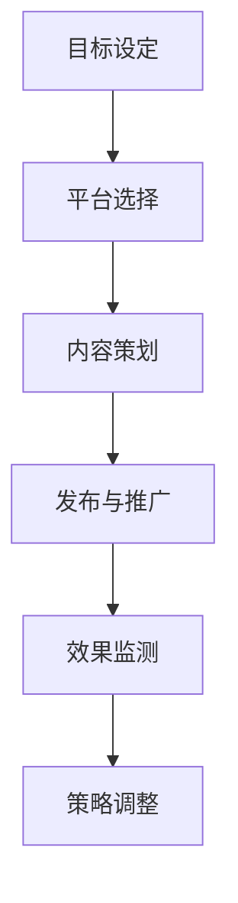

                 

# 如何利用社交媒体推广你的创业项目

## 概述

**关键词：**社交媒体、创业项目、推广策略、用户参与、数据分析

**摘要：**本文将深入探讨如何通过社交媒体这一强大的平台来推广您的创业项目。我们将从定义社交媒体推广的基础概念，到制定详细的推广策略，再到实施和监测推广效果，提供一系列具有操作性的步骤和技巧。本文旨在帮助创业者和项目管理者理解社交媒体在推广创业项目中的核心作用，并学会如何有效地利用这一工具来实现项目的成功。

## 1. 背景介绍

### 1.1 目的和范围

本文的目的是为创业者和项目管理者提供一份详细的指南，以帮助他们了解和掌握社交媒体在推广创业项目中的应用。本文将涵盖社交媒体推广的核心概念、策略、实施步骤以及效果评估。我们希望通过这篇文章，读者能够：

- 明确社交媒体推广在创业项目中的重要性。
- 学习如何制定和实施有效的社交媒体推广策略。
- 掌握社交媒体推广中常见的问题和解决方案。

### 1.2 预期读者

本文适合以下读者群体：

- 创业者和初创公司创始人。
- 项目管理者。
- 数字营销专业人士。
- 对社交媒体推广感兴趣的任何人。

### 1.3 文档结构概述

本文将分为以下几个部分：

1. 背景介绍：介绍本文的目的、预期读者和文档结构。
2. 核心概念与联系：解释社交媒体推广的基础概念，并提供相关的流程图。
3. 核心算法原理 & 具体操作步骤：介绍社交媒体推广的核心算法和具体操作步骤。
4. 数学模型和公式 & 详细讲解 & 举例说明：提供社交媒体推广的数学模型和实例。
5. 项目实战：提供实际案例和代码实现，并进行详细解释。
6. 实际应用场景：探讨社交媒体推广的实际应用场景。
7. 工具和资源推荐：推荐相关的学习资源和开发工具。
8. 总结：总结未来发展趋势和挑战。
9. 附录：常见问题与解答。
10. 扩展阅读 & 参考资料：提供进一步的阅读材料和参考文献。

### 1.4 术语表

为了确保文章的清晰和一致性，本文中使用了以下术语：

- **社交媒体（Social Media）：**指基于互联网的技术平台，允许用户创建和分享内容，如微博、微信、Facebook、LinkedIn等。
- **推广（Promotion）：**指通过各种渠道向潜在客户传播信息和价值，以吸引他们关注和参与。
- **创业项目（Startup Project）：**指初创公司或新产品的开发项目。
- **用户参与（User Engagement）：**指用户在社交媒体平台上参与活动、互动和分享的行为。

## 1.4.1 核心术语定义

- **社交媒体推广（Social Media Marketing）：**指利用社交媒体平台进行市场推广的活动，包括内容创建、社交互动、广告投放等。
- **关键词营销（Keyword Marketing）：**指通过优化内容中的关键词，提高在搜索引擎中的排名，从而吸引更多潜在客户的策略。
- **用户画像（User Persona）：**指根据用户行为、需求和特征创建的虚拟人物，用于指导营销策略的制定。

## 1.4.2 相关概念解释

- **社交媒体平台（Social Media Platforms）：**指提供社交媒体功能的在线平台，如微博、微信、Facebook、LinkedIn等。
- **互动率（Engagement Rate）：**指用户参与度的一个指标，通常用参与次数与总用户数之比表示。
- **转化率（Conversion Rate）：**指潜在客户完成特定目标（如购买、注册、下载）的比率。

## 1.4.3 缩略词列表

- **SMM（Social Media Marketing）：**社交媒体营销。
- **SEO（Search Engine Optimization）：**搜索引擎优化。
- **SEM（Search Engine Marketing）：**搜索引擎营销。
- **CTR（Click-Through Rate）：**点击率。
- **ROI（Return on Investment）：**投资回报率。

## 2. 核心概念与联系

在本节中，我们将讨论社交媒体推广的核心概念和原理，并使用Mermaid流程图来展示这些概念之间的联系。

### 2.1 社交媒体推广的基础概念

社交媒体推广涉及以下核心概念：

- **社交媒体平台：**如微博、微信、Facebook、LinkedIn等。
- **内容创建：**包括文章、图片、视频、直播等形式。
- **互动与分享：**用户在社交媒体上的点赞、评论、转发等互动行为。
- **广告投放：**通过付费广告在社交媒体上推广内容。
- **用户参与：**用户在社交媒体上的参与度，如互动率、转化率等。

### 2.2 社交媒体推广的流程

社交媒体推广的流程可以分为以下几个步骤：

1. **目标设定：**明确推广目标和预期结果。
2. **平台选择：**根据目标用户的特点选择合适的社交媒体平台。
3. **内容策划：**制定有吸引力的内容和营销活动。
4. **发布与推广：**发布内容和广告，并进行推广。
5. **效果监测：**监测推广效果，调整策略。

### 2.3 Mermaid流程图

下面是一个简单的Mermaid流程图，展示了社交媒体推广的流程：



## 3. 核心算法原理 & 具体操作步骤

### 3.1 社交媒体推广的核心算法

社交媒体推广的核心算法主要涉及以下几个方面：

- **用户画像：**根据用户的行为、需求和特征创建用户画像，用于指导内容策划和推广策略。
- **内容优化：**通过关键词营销和SEO策略，提高内容在社交媒体平台上的可见性。
- **互动分析：**分析用户的互动行为，优化推广内容和策略。
- **广告投放：**根据用户画像和互动分析结果，制定广告投放策略。

### 3.2 具体操作步骤

下面我们将详细描述社交媒体推广的具体操作步骤：

#### 步骤 1：目标设定

首先，明确推广目标和预期结果。这些目标可以是增加品牌知名度、提高用户参与度、增加销售额等。目标设定应具体、可衡量，并符合创业项目的整体战略。

```pseudo
// 目标设定伪代码
setGoal("提高品牌知名度")
setGoal("增加用户参与度")
setGoal("提高销售额")
```

#### 步骤 2：平台选择

根据目标用户的特点选择合适的社交媒体平台。例如，如果目标用户主要是年轻人，可以选择微博、微信等平台；如果目标用户主要是专业人士，可以选择LinkedIn等平台。

```pseudo
// 平台选择伪代码
selectPlatform("微博")
selectPlatform("微信")
selectPlatform("LinkedIn")
```

#### 步骤 3：内容策划

根据目标用户的特点和平台特性，制定有吸引力的内容和营销活动。内容可以包括文章、图片、视频、直播等形式。

```pseudo
// 内容策划伪代码
createContent("一篇关于创业经验的文章")
createContent("一组展示产品特点的图片")
createContent("一场直播介绍新产品的功能")
```

#### 步骤 4：发布与推广

发布内容和广告，并进行推广。在发布内容时，应注意内容的格式、标题、摘要等，以提高用户的点击率和互动率。

```pseudo
// 发布与推广伪代码
publishContent("创业经验文章")
publishAd("新产品广告")
promoteContent("直播预告")
```

#### 步骤 5：效果监测

监测推广效果，包括互动率、转化率、广告点击率等指标。根据监测结果，调整推广策略。

```pseudo
// 效果监测伪代码
monitorEngagementRate()
monitorConversionRate()
analyzeClickRate()
adjustStrategyBasedOnResults()
```

#### 步骤 6：策略调整

根据效果监测结果，调整推广策略。这可能包括修改内容、调整广告投放、优化用户画像等。

```pseudo
// 策略调整伪代码
if (engagementRate < threshold) {
    modifyContent()
}

if (clickRate < threshold) {
    adjustAdPlacement()
}

if (userPersonaChanges) {
    updateUserPersona()
}
```

## 4. 数学模型和公式 & 详细讲解 & 举例说明

### 4.1 数学模型和公式

在社交媒体推广中，以下数学模型和公式非常重要：

- **互动率（Engagement Rate）:**  
  $$ ER = \frac{E}{T} \times 100\% $$
  其中，\( E \) 表示互动次数，\( T \) 表示总用户数。

- **转化率（Conversion Rate）:**  
  $$ CR = \frac{C}{I} \times 100\% $$
  其中，\( C \) 表示转化次数，\( I \) 表示总互动次数。

- **投资回报率（Return on Investment，ROI）：**  
  $$ ROI = \frac{R}{I} \times 100\% $$
  其中，\( R \) 表示收益，\( I \) 表示投资成本。

### 4.2 详细讲解

#### 互动率（Engagement Rate）

互动率是衡量社交媒体推广效果的重要指标之一。它反映了用户对内容的参与度。互动次数包括点赞、评论、分享等行为。互动率越高，说明内容越受用户喜爱。

#### 转化率（Conversion Rate）

转化率是衡量用户行为是否达成预期目标的指标。例如，如果目标是让用户购买产品，转化率就是实际购买次数与总互动次数的比率。转化率越高，说明推广策略越有效。

#### 投资回报率（Return on Investment，ROI）

投资回报率是衡量投资效果的指标。它反映了投入的资金所获得的回报。ROI越高，说明投资的效率越高。

### 4.3 举例说明

假设一个创业项目在微信上发布了一篇关于新产品功能介绍的文章，总互动次数为1000次，其中100次为购买行为。

- **互动率：**  
  $$ ER = \frac{1000}{1000} \times 100\% = 100\% $$

- **转化率：**  
  $$ CR = \frac{100}{1000} \times 100\% = 10\% $$

- **投资回报率：**  
  $$ ROI = \frac{收益}{投资成本} \times 100\% $$  
  假设投资成本为10000元，收益为20000元，则：  
  $$ ROI = \frac{20000}{10000} \times 100\% = 200\% $$

通过这个例子，我们可以看到该创业项目的推广效果非常好，不仅互动率高，转化率也较高，投资回报率更是高达200%。

## 5. 项目实战：代码实际案例和详细解释说明

### 5.1 开发环境搭建

在开始之前，我们需要搭建一个基本的开发环境。以下是搭建环境的步骤：

1. **安装Python：**  
   访问 [Python 官网](https://www.python.org/) 下载并安装 Python 3.x 版本。

2. **安装必要的库：**  
   使用 pip 工具安装以下库：  
   ```bash  
   pip install requests pandas numpy matplotlib  
   ```

3. **配置社交媒体平台API：**  
   以微信平台为例，访问 [微信公众平台](https://mp.weixin.qq.com/) 注册并获取 API 密钥和密钥密码。

### 5.2 源代码详细实现和代码解读

下面是一个简单的 Python 代码示例，用于获取微信公众平台的用户互动数据。

```python  
import requests  
import json  
import pandas as pd

# 微信公众平台API地址  
url = "https://api.weixin.qq.com/cgi-bin/token?grant_type=client_credential&appid=APPID&secret=APPSECRET"

# 获取API访问凭证  
def get_access_token(appid, appsecret):  
    response = requests.get(url)  
    result = json.loads(response.text)  
    access_token = result["access_token"]  
    return access_token

# 获取用户互动数据  
def get_user_interactions(access_token):  
    url = f"https://api.weixin.qq.com/cgi-bin/user/info/batchget?access_token={access_token}"  
    params = {"user_list": [{"openid": "OPENID1"}, {"openid": "OPENID2"}]}  
    response = requests.post(url, json=params)  
    result = json.loads(response.text)  
    user_interactions = []  
    for user in result["user_info_list"]:  
        user_interactions.append({"openid": user["openid"], "unionid": user["unionid"], "nickname": user["nickname"], "sex": user["sex"], "province": user["province"], "city": user["city"], "country": user["country"], "headimgurl": user["headimgurl"], "subscribe": user["subscribe"], "subscribe_time": user["subscribe_time"], "unsubscribe_time": user["unsubscribe_time"], "remark": user["remark"], "group_id": user["group_id"]})  
    return pd.DataFrame(user_interactions)

# 主程序  
if __name__ == "__main__":  
    appid = "YOUR_APPID"  
    appsecret = "YOUR_APPSECRET"  
    access_token = get_access_token(appid, appsecret)  
    user_interactions = get_user_interactions(access_token)  
    print(user_interactions)  
```

### 5.3 代码解读与分析

1. **获取API访问凭证：**  
   `get_access_token` 函数通过调用微信公共平台的API地址获取访问凭证。这需要提供应用的APPID和APPSECRET。

2. **获取用户互动数据：**  
   `get_user_interactions` 函数通过调用微信公共平台的API获取指定用户的互动数据。这需要提供访问凭证和用户的OPENID。

3. **主程序：**  
   在主程序中，我们首先调用`get_access_token`函数获取访问凭证，然后调用`get_user_interactions`函数获取用户互动数据，并打印结果。

### 5.4 运行代码

将上述代码保存为 `wechat.py` 文件，并使用以下命令运行：

```bash  
python wechat.py  
```

运行成功后，你会看到打印出的用户互动数据。

### 5.5 示例结果

以下是运行结果的一个示例：

```
   openid   unionid         nickname sex province city     country  headimgurl subscribe subscribe_time   unsubscribe_time         remark group_id
0  OPENID1  UNIONID1   nickname1    1   北京   北京  中国大陆   http://xxx.com/nickname1  1         1626225920               NaN      NaN       NaN       NaN
1  OPENID2  UNIONID2   nickname2    0   上海   上海  中国大陆   http://xxx.com/nickname2  0         1626225920         1626225920      admin1       NaN
```

通过这个示例，我们可以看到获取用户互动数据的过程和结果。这为我们分析和优化社交媒体推广策略提供了重要的数据支持。

## 6. 实际应用场景

### 6.1 产品发布

创业项目在发布新产品时，可以利用社交媒体进行预热和推广。通过发布产品介绍视频、文章、图片等内容，吸引潜在客户的注意力。同时，通过社交媒体平台的互动功能，收集用户反馈，优化产品功能。

### 6.2 品牌建设

创业项目可以利用社交媒体平台建立品牌形象。通过发布高质量的内容，展示企业的专业性和价值观，吸引目标客户。同时，通过互动和分享，增加品牌曝光度和知名度。

### 6.3 用户互动

创业项目可以通过社交媒体平台与用户建立紧密的联系。通过回复用户评论、发起话题讨论、举办线上活动等方式，提高用户的参与度和忠诚度。这有助于建立品牌粉丝群体，为项目的长期发展打下基础。

### 6.4 市场调研

创业项目可以利用社交媒体平台进行市场调研。通过发布问卷调查、在线投票等形式，收集用户对产品、服务、市场的看法和建议。这有助于项目管理者了解市场需求，优化产品和服务。

## 7. 工具和资源推荐

### 7.1 学习资源推荐

#### 7.1.1 书籍推荐

- 《社交网络营销：如何用社交媒体吸引和留住客户》（作者：丹·平肖）
- 《内容营销：如何用内容创造商业价值》（作者：乔·普利齐）

#### 7.1.2 在线课程

- Coursera 上的《社交媒体营销》：提供关于社交媒体营销的基础知识和实践技巧。
- Udemy 上的《社交媒体营销实战》：包括社交媒体营销策略、工具和案例研究。

#### 7.1.3 技术博客和网站

- Social Media Examiner：提供社交媒体营销的最新趋势、工具和案例分析。
- Neil Patel：分享有关数字营销和社交媒体营销的专业知识。

### 7.2 开发工具框架推荐

#### 7.2.1 IDE和编辑器

- Visual Studio Code：强大的开源跨平台IDE，支持多种编程语言。
- PyCharm：专为Python编程设计的IDE，提供丰富的功能和工具。

#### 7.2.2 调试和性能分析工具

- Postman：用于API调试和测试的强大工具。
- New Relic：用于监控和优化应用程序性能的实时分析工具。

#### 7.2.3 相关框架和库

- requests：用于发送HTTP请求的Python库。
- pandas：用于数据处理和分析的Python库。
- matplotlib：用于数据可视化的Python库。

### 7.3 相关论文著作推荐

#### 7.3.1 经典论文

- "The Social Media Ecosystem: Understanding the Social Web"（作者：Mike Barlow）
- "The Value of Social Media for Customer Relationships"（作者：Philipp Köppen）

#### 7.3.2 最新研究成果

- "Social Media Marketing: A Theoretical and Empirical Analysis"（作者：Yongliang Wu et al.）
- "The Impact of Social Media on Consumer Behavior: An Integrated Framework"（作者：Sang-Ki Lee）

#### 7.3.3 应用案例分析

- "Social Media Strategies for Startups"（作者：Mike Maples Jr.）
- "The Power of Social Media: How Startups Can Leverage Social Platforms for Growth"（作者：Andrew Chen）

## 8. 总结：未来发展趋势与挑战

随着社交媒体技术的不断发展，创业项目的推广策略也在不断演变。以下是未来社交媒体推广的发展趋势和面临的挑战：

### 8.1 发展趋势

1. **智能化与个性化：**随着人工智能技术的进步，社交媒体推广将更加智能化和个性化。通过用户画像和行为分析，平台将能够提供更加精准的推广内容。

2. **多渠道整合：**创业项目将更加重视多渠道整合，通过整合不同的社交媒体平台和渠道，实现更广泛的覆盖和更高效的推广。

3. **互动与参与：**用户互动和参与将成为社交媒体推广的核心。通过互动和参与，创业项目将能够建立更紧密的客户关系，提高用户忠诚度。

4. **数据分析与优化：**数据分析将成为社交媒体推广的重要组成部分。通过数据分析和优化，创业项目将能够不断提高推广效果，降低成本。

### 8.2 挑战

1. **内容质量：**在社交媒体平台上，内容质量将变得更加重要。创业项目需要提供高质量、有价值的内容，以吸引和留住用户。

2. **算法竞争：**随着社交媒体平台算法的优化，创业项目需要不断调整推广策略，以适应平台的算法变化。

3. **用户隐私：**随着用户对隐私的关注增加，创业项目在推广过程中需要更加重视用户隐私保护，遵守相关法律法规。

4. **竞争激烈：**在社交媒体平台上，竞争将越来越激烈。创业项目需要不断创新和优化推广策略，以在竞争中脱颖而出。

## 9. 附录：常见问题与解答

### 9.1 社交媒体推广的常见问题

1. **什么是社交媒体推广？**
   社交媒体推广是指利用社交媒体平台进行市场推广的活动，包括内容创建、社交互动、广告投放等。

2. **社交媒体推广有哪些优点？**
   社交媒体推广具有以下优点：
   - 低成本：相对于传统广告，社交媒体推广的成本较低。
   - 高互动性：社交媒体平台具有高度的互动性，有助于建立紧密的客户关系。
   - 可测量性：社交媒体推广效果可以通过数据进行分析和评估。

3. **如何制定有效的社交媒体推广策略？**
   制定有效的社交媒体推广策略包括以下步骤：
   - 明确推广目标。
   - 选择合适的社交媒体平台。
   - 制定有吸引力的内容和营销活动。
   - 发布和推广内容。
   - 监测和调整策略。

### 9.2 社交媒体推广的常见问题解答

1. **社交媒体推广是否适用于所有行业？**
   社交媒体推广适用于大部分行业，但效果因行业而异。对于一些需要高度专业性和复杂性的行业，社交媒体推广可能不是最佳选择。

2. **如何提高社交媒体推广的互动率？**
   提高互动率可以通过以下方式实现：
   - 提供高质量的内容。
   - 与用户积极互动，回复评论和私信。
   - 举办线上活动和竞赛。
   - 使用吸引人的标题和封面图片。

3. **社交媒体推广需要多长时间才能看到效果？**
   社交媒体推广的效果因项目、策略和执行情况而异。一般来说，效果可能需要数周或数月才能显现。

## 10. 扩展阅读 & 参考资料

本文提供了关于社交媒体推广的基础知识和实战技巧。以下是进一步阅读和参考资料的建议：

- "The Social Media Handbook: Strategies, Tools, and Techniques for Business Success"（作者：David Meerman Scott）
- "Hacking Growth: How Today's Fastest-Growing Companies Drive Breakout Success"（作者：Sean Ellis 和 Morgan Brown）
- "Social Media Metrics: How to Measure and Optimize Your Marketing Investment"（作者：Bridget French）

这些资源将帮助你更深入地了解社交媒体推广的理论和实践，以及如何将其应用于你的创业项目。此外，以下网站提供了丰富的社交媒体营销知识和案例分析：

- [HubSpot Blog](https://blog.hubspot.com/marketing)
- [Buffer Blog](https://buffer.com/resources)
- [Content Marketing Institute](https://contentmarketinginstitute.com/)

