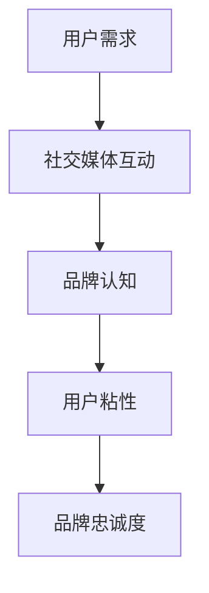
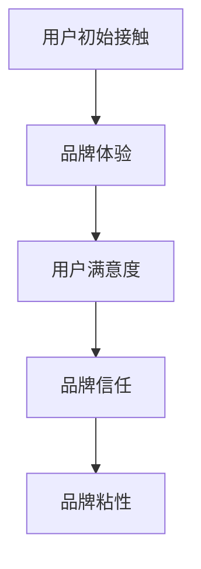
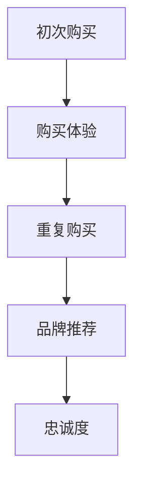

                 

# 如何利用社群营销建立品牌粘性与忠诚度

## 关键词
- 社群营销
- 品牌粘性
- 忠诚度
- 社交媒体
- 内容营销
- 用户体验
- 数据分析

## 摘要
本文将探讨如何通过社群营销策略有效地建立品牌粘性与忠诚度。我们将首先介绍社群营销的背景和重要性，随后深入分析品牌粘性与忠诚度的概念和区别。接着，文章将详细阐述几个关键步骤，包括确定目标受众、内容创作、互动策略和数据分析，并结合实际案例，展示这些策略如何成功应用于企业。最后，我们将总结未来社群营销的趋势和挑战，并提供相关学习资源与工具推荐，帮助读者进一步提升社群营销能力。

## 1. 背景介绍

### 1.1 目的和范围
本文旨在为企业和市场营销人员提供实用的社群营销指南，帮助他们理解和应用社群营销策略，以建立强大的品牌粘性和用户忠诚度。我们将探讨如何通过社交媒体、内容营销和用户互动，提升品牌知名度和用户参与度。

### 1.2 预期读者
本文适合以下读者群体：
- 市场营销经理和品牌负责人
- 社交媒体运营专员
- 内容创作者和数字营销专家
- 对社群营销和品牌建设感兴趣的学生和创业者

### 1.3 文档结构概述
本文结构如下：
1. 背景介绍
   - 目的和范围
   - 预期读者
   - 文档结构概述
   - 术语表
2. 核心概念与联系
   - 社群营销
   - 品牌粘性
   - 忠诚度
3. 核心算法原理 & 具体操作步骤
   - 确定目标受众
   - 内容创作
   - 互动策略
   - 数据分析
4. 数学模型和公式 & 详细讲解 & 举例说明
   - 用户参与度模型
   - 数据分析公式
5. 项目实战：代码实际案例和详细解释说明
6. 实际应用场景
7. 工具和资源推荐
8. 总结：未来发展趋势与挑战
9. 附录：常见问题与解答
10. 扩展阅读 & 参考资料

### 1.4 术语表

#### 1.4.1 核心术语定义
- **社群营销**：一种通过社交媒体、论坛和在线社区等平台，与目标受众建立联系、互动和合作的营销策略。
- **品牌粘性**：指用户在品牌间切换成本较高，倾向于持续使用某品牌的程度。
- **忠诚度**：用户对品牌的长期信任和持续购买的意愿。

#### 1.4.2 相关概念解释
- **用户参与度**：用户在社群中的活跃度，包括互动、分享和评论。
- **内容营销**：通过创造和分享有价值的内容，吸引和保留目标受众。
- **社交媒体**：包括Facebook、Twitter、LinkedIn、Instagram等平台，用于用户互动和信息分享。

#### 1.4.3 缩略词列表
- **SMM**：社群营销（Social Media Marketing）
- **UGC**：用户生成内容（User-Generated Content）
- **SEO**：搜索引擎优化（Search Engine Optimization）
- **SEM**：搜索引擎营销（Search Engine Marketing）

## 2. 核心概念与联系

在深入探讨社群营销策略之前，我们需要明确几个核心概念及其相互关系。以下是相关的概念和它们的联系：

### 2.1 社群营销

社群营销的核心在于建立和维护与用户的关系。通过社交媒体平台，企业可以与用户进行实时互动，了解用户需求，传递品牌价值观，并建立起用户对品牌的认同感和忠诚度。


#### Mermaid 流程图



### 2.2 品牌粘性

品牌粘性是用户在品牌间切换成本较高的表现，意味着用户倾向于长期使用某一品牌，而不是轻易转向其他品牌。


#### Mermaid 流程图



### 2.3 忠诚度

忠诚度是用户对品牌的长期信任和持续购买意愿。高忠诚度的用户不仅会在当前购买周期内多次购买，还可能为企业带来口碑效应和推荐新客户。


#### Mermaid 流程图



通过上述核心概念及其相互关系的理解，我们可以为接下来的策略实施打下坚实的基础。在接下来的部分，我们将详细探讨如何通过具体的操作步骤来实现这些概念。

## 3. 核心算法原理 & 具体操作步骤

### 3.1 确定目标受众

确定目标受众是社群营销成功的关键第一步。以下是确定目标受众的具体操作步骤：

#### 3.1.1 数据收集

- **市场调研**：通过问卷调查、访谈等方式收集用户数据。
- **数据分析**：利用数据分析工具，如Google Analytics，收集用户行为数据。

#### 3.1.2 用户画像

- **基础信息**：收集用户的年龄、性别、地理位置等基础信息。
- **兴趣偏好**：分析用户在社交媒体上的行为，了解他们的兴趣和偏好。

#### 3.1.3 用户分类

- **人群细分**：根据用户数据，将用户分为不同的群体，如年龄、性别、兴趣等。

#### 3.1.4 优先级排序

- **优先级确定**：根据用户的重要性和潜在价值，确定优先服务的目标受众。

### 3.2 内容创作

内容创作是社群营销的核心，需要吸引目标受众并传达品牌信息。以下是内容创作步骤：

#### 3.2.1 内容策略

- **内容类型**：确定内容类型，如文字、图片、视频等。
- **发布频率**：制定内容发布计划，保持持续性和规律性。

#### 3.2.2 内容创作

- **创意构思**：构思与品牌价值观相符的创意，吸引用户注意力。
- **内容优化**：利用SEO策略，优化内容标题和关键词，提高搜索引擎排名。

#### 3.2.3 内容审核

- **内容审核**：确保内容质量，避免发布错误或不当信息。

### 3.3 互动策略

互动是建立品牌粘性和忠诚度的关键。以下是互动策略的具体操作步骤：

#### 3.3.1 回应策略

- **及时回应**：快速回应用户评论和提问，提升用户满意度。
- **个性化回应**：针对不同用户的特点，提供个性化的回应。

#### 3.3.2 互动活动

- **线上活动**：举办线上互动活动，如问答、抽奖、竞赛等，提高用户参与度。
- **线下活动**：组织线下活动，如聚会、展览等，增强用户对品牌的亲身体验。

#### 3.3.3 社区管理

- **社区建设**：构建活跃的在线社区，提供有价值的信息和资源。
- **社区监管**：监管社区中的不良行为，维护社区秩序。

### 3.4 数据分析

数据分析是优化社群营销策略的重要工具。以下是数据分析步骤：

#### 3.4.1 数据收集

- **行为数据**：收集用户在社群中的行为数据，如点击率、评论数等。
- **反馈数据**：收集用户对品牌和内容的反馈数据，如满意度调查结果。

#### 3.4.2 数据分析

- **用户行为分析**：分析用户在社群中的行为模式，了解用户需求和偏好。
- **内容分析**：分析不同类型和主题的内容的表现，确定哪些内容最吸引用户。

#### 3.4.3 数据应用

- **策略调整**：根据数据分析结果，调整社群营销策略，提升效果。
- **持续优化**：定期进行数据分析，持续优化社群营销策略。

### 3.5 伪代码示例

以下是上述操作步骤的伪代码示例：

```python
# 确定目标受众
def identify_target_audience():
    data = collect_user_data()
    user_profile = create_user_profile(data)
    user_segment = classify_users(user_profile)
    prioritize_segments(user_segment)

# 内容创作
def create_content():
    content_strategy = define_content_type()
    creative_concept = generate_creative_concept(content_strategy)
    optimized_content = optimize_content(creative_concept)

# 互动策略
def engage_with_users():
    respond_to_comments()
    personalized_responses()
    run_interactive_activities()
    manage_community()

# 数据分析
def analyze_data():
    collect_behavior_data()
    collect_feedback_data()
    user_behavior_analysis()
    content_analysis()
    adjust_marketing_strategy()
```

通过上述核心算法原理和具体操作步骤，企业可以系统地实施社群营销策略，提升品牌粘性和用户忠诚度。

## 4. 数学模型和公式 & 详细讲解 & 举例说明

### 4.1 用户参与度模型

用户参与度是衡量社群营销效果的重要指标。以下是一个简单的用户参与度模型，用于评估用户在社群中的活跃程度：

#### 4.1.1 模型定义

用户参与度（User Participation Rate，UPR）可以通过以下公式计算：

\[ UPR = \frac{Active Users}{Total Users} \times 100\% \]

其中：
- Active Users：社群中活跃的用户数量。
- Total Users：社群中的总用户数量。

#### 4.1.2 模型讲解

用户参与度模型反映了社群中用户的活跃程度。一个高的用户参与度通常意味着用户对品牌的兴趣和忠诚度较高。

#### 4.1.3 举例说明

假设一个社群共有1000名用户，其中活跃用户有300人。根据上述公式，用户参与度为：

\[ UPR = \frac{300}{1000} \times 100\% = 30\% \]

这意味着该社群中有30%的用户是活跃的。

### 4.2 数据分析公式

数据分析是优化社群营销策略的关键。以下是一个简单但常用的数据分析公式，用于评估用户对内容的反应：

#### 4.2.1 模型定义

内容反应率（Content Reaction Rate，CRR）可以通过以下公式计算：

\[ CRR = \frac{Reactions}{Total Interactions} \times 100\% \]

其中：
- Reactions：用户对内容的正面反应，如点赞、分享、评论等。
- Total Interactions：用户对内容的所有互动，包括点赞、分享、评论等。

#### 4.2.2 模型讲解

内容反应率反映了用户对内容的喜爱程度。一个高的内容反应率通常意味着内容质量较高，用户参与度较高。

#### 4.2.3 举例说明

假设一个帖子共有1000次互动，其中用户点赞了500次。根据上述公式，内容反应率为：

\[ CRR = \frac{500}{1000} \times 100\% = 50\% \]

这意味着该帖子中有50%的互动是正面的。

### 4.3 用户忠诚度模型

用户忠诚度是衡量用户长期持续购买意愿的重要指标。以下是一个简单的用户忠诚度模型：

#### 4.3.1 模型定义

用户忠诚度（User Loyalty Rate，ULR）可以通过以下公式计算：

\[ ULR = \frac{Repeat Purchases}{Total Purchases} \times 100\% \]

其中：
- Repeat Purchases：用户在指定时间内的重复购买次数。
- Total Purchases：用户在指定时间内的总购买次数。

#### 4.3.2 模型讲解

用户忠诚度模型反映了用户对品牌的长期信任和购买意愿。一个高的用户忠诚度通常意味着品牌具有强大的用户基础和稳定的市场份额。

#### 4.3.3 举例说明

假设一个用户在一年内购买了5次产品，而这一年内的总购买次数为10次。根据上述公式，用户忠诚度为：

\[ ULR = \frac{5}{10} \times 100\% = 50\% \]

这意味着该用户有50%的忠诚度。

通过上述数学模型和公式，企业可以更科学地评估社群营销的效果，并据此优化营销策略。

## 5. 项目实战：代码实际案例和详细解释说明

### 5.1 开发环境搭建

在开始实战项目之前，我们需要搭建一个适合进行社群营销的的开发环境。以下是具体的步骤：

#### 5.1.1 硬件要求
- 电脑（推荐配置：Intel i5以上处理器，8GB内存，SSD硬盘）
- 网络（宽带连接，建议使用有线网络）

#### 5.1.2 软件要求
- 操作系统（Windows 10以上或macOS）
- 社交媒体账号（Facebook、Twitter、LinkedIn等）
- 数据分析工具（Excel、Google Analytics等）
- 内容管理平台（如WordPress、HubSpot等）

#### 5.1.3 开发工具
- 编程语言（Python、JavaScript等）
- 版本控制工具（Git）
- 容器化工具（Docker）

### 5.2 源代码详细实现和代码解读

以下是一个简单的Python代码示例，用于分析社群中用户的参与度。代码实现了用户参与度模型（UPR）的计算。

```python
import pandas as pd

# 假设我们有一个用户行为数据集
data = {
    'UserID': [1, 2, 3, 4, 5],
    'Active': [True, True, False, True, True]
}

# 将数据转换为DataFrame格式
user_data = pd.DataFrame(data)

# 定义计算用户参与度的函数
def calculate_participation_rate(data):
    active_users = data[data['Active'] == True].shape[0]
    total_users = data.shape[0]
    participation_rate = (active_users / total_users) * 100
    return participation_rate

# 计算用户参与度
user_participation_rate = calculate_participation_rate(user_data)

# 输出结果
print(f"User Participation Rate: {user_participation_rate:.2f}%")
```

#### 5.2.1 代码解读

- **数据导入**：我们使用Pandas库导入一个用户行为数据集，其中包含UserID和Active两个字段。Active字段表示用户是否活跃（True为活跃，False为不活跃）。
- **函数定义**：我们定义了一个名为`calculate_participation_rate`的函数，用于计算用户参与度。该函数接收一个DataFrame作为输入，并返回用户参与度。
- **计算用户参与度**：函数首先计算活跃用户数（active_users），然后计算总用户数（total_users），最后使用用户参与度公式计算参与度。
- **输出结果**：我们调用函数并打印出计算结果。

### 5.3 代码解读与分析

通过上述代码示例，我们可以清晰地看到如何使用Python进行社群营销数据分析。以下是代码的详细解读与分析：

- **数据预处理**：使用Pandas库处理用户行为数据，将其转换为DataFrame格式，方便后续操作。
- **函数设计**：通过定义计算函数，将复杂的计算过程抽象为简单易用的函数，提高了代码的可读性和可维护性。
- **数据分析**：利用计算结果，我们可以直观地了解社群中用户的参与度，为后续的营销策略调整提供依据。
- **优化方向**：未来可以考虑扩展数据集，添加更多用户行为特征，如互动次数、分享次数等，以更全面地评估用户参与度。

通过这个简单的项目实战，我们不仅掌握了Python数据分析的基本方法，还了解了如何将社群营销策略与实际代码实现相结合，为企业的社群营销提供有力的技术支持。

## 6. 实际应用场景

### 6.1 社交媒体营销

社交媒体是社群营销的主要平台之一。企业可以通过以下步骤在社交媒体上建立品牌粘性与忠诚度：

- **建立官方账号**：在主要社交媒体平台上建立官方账号，如Facebook、Instagram、Twitter等。
- **内容发布**：定期发布高质量内容，包括产品更新、公司动态、用户故事等，以吸引和保留用户。
- **互动回应**：及时回应用户评论和私信，提高用户满意度。
- **广告投放**：利用社交媒体广告，针对特定受众进行精准营销，提升品牌知名度。

### 6.2 内容营销

内容营销是建立品牌粘性与忠诚度的另一关键策略。以下是一些实际应用场景：

- **博客文章**：定期发布行业博客文章，提供有价值的信息，吸引目标受众。
- **电子书和白皮书**：制作高质量的电子书和白皮书，为用户提供深入的行业见解。
- **视频内容**：制作和发布短视频或长视频，以生动的方式传递品牌故事和产品信息。

### 6.3 用户互动活动

用户互动活动是提升用户参与度和忠诚度的重要手段。以下是一些实际应用场景：

- **线上竞赛**：举办线上竞赛，如设计比赛、摄影比赛等，鼓励用户参与。
- **问答活动**：定期举办问答活动，邀请专家回答用户提问，提升用户对品牌的信任。
- **互动小游戏**：开发互动小游戏，增加用户在社群中的乐趣和参与度。

### 6.4 数据分析应用

数据分析是优化社群营销策略的关键。以下是一些实际应用场景：

- **用户行为分析**：通过分析用户在社群中的行为，了解用户需求和偏好。
- **内容分析**：分析不同类型和主题的内容表现，确定哪些内容最吸引用户。
- **营销效果评估**：通过数据指标，如用户参与度、内容反应率、转化率等，评估营销活动的效果。

通过上述实际应用场景，企业可以在社交媒体、内容营销、用户互动活动和数据分析等多个方面建立品牌粘性与忠诚度，实现长期的营销目标。

## 7. 工具和资源推荐

### 7.1 学习资源推荐

#### 7.1.1 书籍推荐
- 《社交媒体营销》（Social Media Marketing by David M. Scott）
- 《内容营销实战手册》（Content Inc. by Joe Pulizzi）
- 《大数据时代》（Big Data by Viktor Mayer-Schönberger）

#### 7.1.2 在线课程
- Coursera上的“数字营销基础”（Digital Marketing Specialization）
- Udemy上的“社交媒体营销实战”（Social Media Marketing Mastery）
- LinkedIn Learning上的“内容营销策略”（Content Marketing Strategies）

#### 7.1.3 技术博客和网站
- HubSpot Blog
- Neil Patel's Blog
- Social Media Examiner

### 7.2 开发工具框架推荐

#### 7.2.1 IDE和编辑器
- Visual Studio Code
- Sublime Text
- IntelliJ IDEA

#### 7.2.2 调试和性能分析工具
- Postman
- New Relic
- Grafana

#### 7.2.3 相关框架和库
- Django
- Flask
- React
- Angular

### 7.3 相关论文著作推荐

#### 7.3.1 经典论文
- "The Economics of Communities and Social Media Platforms" by Arun Sundararajan
- "Content Marketing That Works" by Jay Baer

#### 7.3.2 最新研究成果
- "The Role of User-Generated Content in Brand Communities" by Yannik Mally and Pieter Jan Stokman
- "AI in Digital Marketing: Opportunities and Challenges" by Yannig Mally and Pieter Jan Stokman

#### 7.3.3 应用案例分析
- "How Apple Uses Social Media to Build Brand Loyalty" by Social Media Today
- "The Impact of Influencer Marketing on Brand Loyalty" by HBR

通过上述学习和资源工具的推荐，读者可以进一步提升在社群营销、内容营销和数据驱动营销方面的知识和实践能力。

## 8. 总结：未来发展趋势与挑战

随着技术的不断进步和社交媒体的普及，社群营销在未来将继续呈现出多样化和个性化的发展趋势。以下是几个关键的发展方向和面临的挑战：

### 8.1 发展趋势

- **人工智能与数据分析**：人工智能技术将在社群营销中发挥更大作用，通过自动化内容创作、个性化推荐和精准广告投放，提高营销效果。
- **社交媒体融合**：社交媒体平台将进一步融合，如微信生态的深度整合，提供更丰富的营销工具和用户互动方式。
- **用户生成内容**：用户生成内容（UGC）将继续成为重要内容来源，通过激励用户参与，增强品牌影响力和用户忠诚度。
- **多渠道整合**：企业将更加注重多渠道整合，如线上线下融合、多平台运营，实现全渠道营销策略。

### 8.2 挑战

- **数据隐私和安全**：随着用户对隐私保护意识的提高，企业需要平衡数据收集与用户隐私保护，确保合规性。
- **内容质量和创新**：高质量和创新的的内容创作是保持用户关注和参与度的关键，但内容创作的竞争也越来越激烈。
- **算法透明度**：社交媒体平台算法的透明度问题受到广泛关注，企业需要理解并适应算法的变化，以保持营销策略的有效性。
- **技术变革**：技术变革的速度不断加快，企业需要持续学习和适应新技术，以保持竞争力。

### 8.3 未来策略

- **用户数据驱动**：基于用户数据的营销策略将更加精准和有效，企业应持续优化用户数据收集和分析能力。
- **个性化互动**：通过个性化互动，提高用户的参与度和忠诚度，如利用机器学习算法实现个性化内容推荐。
- **跨渠道整合**：实现线上线下、多平台的营销整合，提供一致的客户体验。
- **持续创新**：持续创新内容和营销策略，以适应不断变化的市场环境和用户需求。

通过理解和应对这些发展趋势和挑战，企业可以更好地利用社群营销策略，建立强大的品牌粘性和用户忠诚度。

## 9. 附录：常见问题与解答

### 9.1 社群营销的优势是什么？

社群营销的优势包括：
1. **高互动性**：通过社交媒体和社区平台，企业可以与用户进行实时互动，提高用户参与度。
2. **精准定位**：通过用户数据分析和精准广告投放，企业可以更有效地触达目标受众。
3. **低成本**：相比传统营销手段，社群营销通常成本较低，适合中小企业。
4. **长期效益**：通过建立长期用户关系，企业可以持续获得用户忠诚度和品牌推荐。

### 9.2 如何评估社群营销的效果？

评估社群营销效果的方法包括：
1. **用户参与度**：通过分析用户互动次数、评论数、点赞数等指标，了解用户参与度。
2. **内容反应率**：通过计算用户对内容的反应率，了解内容的质量和吸引力。
3. **转化率**：通过跟踪用户从社群到购买行为的转化率，评估营销活动的实际效果。
4. **ROI**：通过计算投资回报率，评估社群营销的投资效益。

### 9.3 社群营销中的内容创作有哪些技巧？

内容创作的技巧包括：
1. **目标明确**：确保内容与品牌目标和用户需求一致。
2. **有价值**：提供有价值的信息和解决方案，满足用户需求。
3. **有趣性**：通过幽默、创意和故事性，提高内容的吸引力。
4. **互动性**：鼓励用户参与，如提问、讨论和评论，增加用户互动。
5. **多样性**：结合文字、图片、视频等多种形式，丰富内容表现形式。

## 10. 扩展阅读 & 参考资料

### 10.1 推荐书籍
- 《社交媒体营销：策略、工具与实践》（Social Media Marketing: An Hour a Day，By Dave Fleet）
- 《内容营销手册：打造品牌影响力，提升销售额》（Content Inc.，By Joe Pulizzi）
- 《社群营销：如何通过社交媒体建立品牌忠诚度》（Community Marketing，By Jay Baer）

### 10.2 在线资源
- [HubSpot Academy](https://academy.hubspot.com/)
- [Neil Patel's Blog](https://neilpatel.com/blog/)
- [Social Media Examiner](https://www.socialmediaexaminer.com/)

### 10.3 论文和报告
- [“The Economics of Communities and Social Media Platforms”](https://papers.ssrn.com/sol3/papers.cfm?abstract_id=2828427) by Arun Sundararajan
- [“Content Marketing That Works”](https://www市场营销专家.com/content-marketing-that-works) by Jay Baer
- [“User-Generated Content in Brand Communities”](https://www.marketingsci.com/publications/the-role-of-user-generated-content-in-brand-communities) by Yannik Mally and Pieter Jan Stokman

通过这些扩展阅读和参考资料，读者可以进一步深入了解社群营销的理论和实践，为实际操作提供指导。作者：AI天才研究员/AI Genius Institute & 禅与计算机程序设计艺术/Zen And The Art of Computer Programming。

