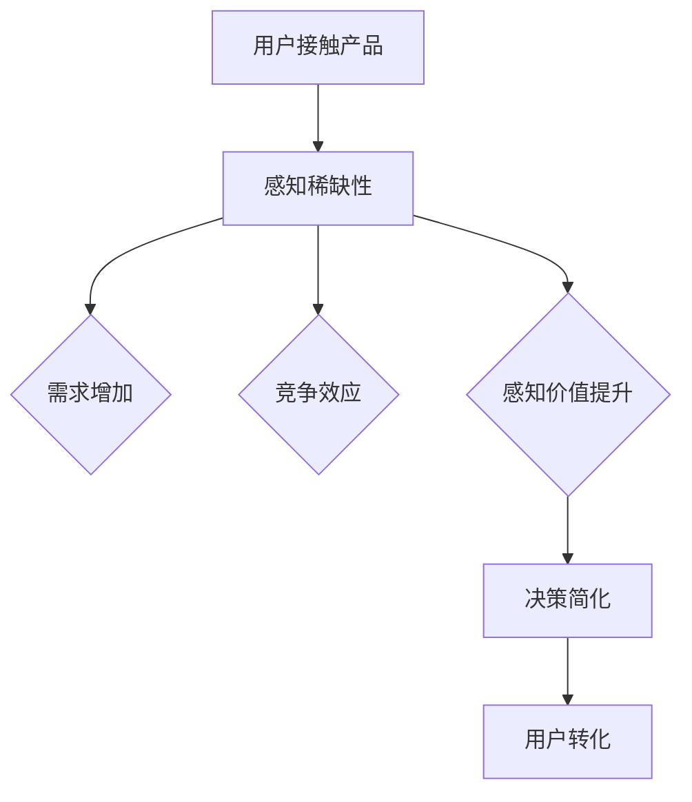

                 

# 如何利用稀缺性原理促进用户转化

> **关键词：稀缺性原理、用户转化、激励机制、用户体验、行为心理学**

> **摘要：本文将深入探讨稀缺性原理在促进用户转化中的应用，通过分析其背后的心理学机制、具体实施步骤及数学模型，结合实际案例，为IT行业提供实用的策略和工具。**

## 1. 背景介绍

### 1.1 目的和范围

本文的目标是详细解析稀缺性原理在促进用户转化中的应用，帮助读者理解这一现象的根源，并掌握如何在实际项目中运用这些策略来提高用户转化率。本文将涵盖以下几个主要部分：

- 稀缺性原理的心理学背景和理论框架。
- 稀缺性原理如何影响用户行为，促进用户转化。
- 实施稀缺性原理的具体步骤和技巧。
- 数学模型和公式用于量化稀缺性效应。
- 实际案例分析和代码实现。
- 实际应用场景和工具推荐。

### 1.2 预期读者

本文预期读者为IT行业的开发者、产品经理和市场营销专家，他们需要对用户行为心理学有一定的了解，并希望将其应用到实际工作中，以提升产品用户转化率。

### 1.3 文档结构概述

本文将按照以下结构展开：

- **背景介绍**：解释稀缺性原理和用户转化的关系。
- **核心概念与联系**：定义稀缺性原理和相关术语，通过流程图展示其结构。
- **核心算法原理 & 具体操作步骤**：使用伪代码阐述稀缺性原理的实现。
- **数学模型和公式 & 详细讲解 & 举例说明**：介绍如何使用数学模型来评估稀缺性效应。
- **项目实战：代码实际案例和详细解释说明**：通过一个实际案例展示如何应用稀缺性原理。
- **实际应用场景**：探讨稀缺性原理在不同场景中的应用。
- **工具和资源推荐**：推荐学习资源、开发工具和相关论文。
- **总结：未来发展趋势与挑战**：展望稀缺性原理在用户转化中的应用前景。
- **附录：常见问题与解答**：回答一些关于稀缺性原理应用的常见问题。
- **扩展阅读 & 参考资料**：提供进一步阅读的材料。

### 1.4 术语表

#### 1.4.1 核心术语定义

- **稀缺性原理**：指通过限制资源的供应来增加其价值，从而影响用户行为。
- **用户转化**：指用户从初始接触产品到最终购买或使用产品的过程。
- **激励机制**：指通过奖励或惩罚来影响用户行为。
- **用户体验**：指用户在使用产品过程中所感受到的所有体验。
- **行为心理学**：研究人类行为及其背后的心理机制的科学。

#### 1.4.2 相关概念解释

- **需求定律**：指商品的需求量与其价格成反比。
- **竞争效应**：指稀缺资源带来的竞争压力，促使用户采取行动。
- **感知价值**：指用户对产品或服务的综合评价。

#### 1.4.3 缩略词列表

- **UX**：用户体验（User Experience）
- **CPC**：每次点击成本（Cost Per Click）
- **CPA**：每次行动成本（Cost Per Action）
- **ROI**：投资回报率（Return On Investment）

## 2. 核心概念与联系

### 2.1 稀缺性原理的心理学背景

稀缺性原理是行为心理学中一个重要的概念，它描述了人类在面对稀缺资源时的行为模式。根据需求定律，当资源稀缺时，其价值会上升，用户对它的需求也会增加。这种稀缺性不仅影响用户的心理预期，还直接影响他们的购买决策。

### 2.2 稀缺性原理的理论框架

稀缺性原理的理论框架主要包括以下几个部分：

- **需求增加**：稀缺性导致用户对产品的需求增加。
- **竞争效应**：稀缺资源引发的竞争压力促使用户更快地采取行动。
- **感知价值提升**：稀缺性使得用户对产品的感知价值提升，增加购买意愿。
- **决策简化**：面对稀缺资源，用户往往简化决策过程，更快地做出购买决策。

### 2.3 Mermaid 流程图

下面是一个用Mermaid绘制的流程图，展示了稀缺性原理如何影响用户行为，促进用户转化：



### 2.4 核心概念联系

- **稀缺性原理**与**用户体验**的联系：稀缺性原理通过影响用户体验，如感知稀缺性和竞争效应，来促进用户转化。
- **稀缺性原理**与**行为心理学**的联系：稀缺性原理基于行为心理学的原理，如需求增加和感知价值提升，来解释用户行为。
- **稀缺性原理**与**激励机制**的联系：通过设计稀缺性激励机制，可以有效地引导用户行为，提高转化率。

## 3. 核心算法原理 & 具体操作步骤

### 3.1 稀缺性原理的实现

为了实现稀缺性原理，我们可以使用以下步骤：

1. **确定稀缺资源**：首先，需要明确在产品中引入稀缺性的资源，如限时折扣、限量产品等。
2. **设定稀缺规则**：设定稀缺资源的供应量、时限和分配规则。
3. **触发稀缺感知**：设计界面和营销策略，触发用户的稀缺感知。
4. **监测转化率**：通过数据监测用户转化率，评估稀缺性原理的效果。

### 3.2 伪代码实现

下面是使用Python伪代码实现的稀缺性原理：

```python
# 伪代码：实现稀缺性原理

# 步骤1：确定稀缺资源
稀缺资源 = "限时折扣"

# 步骤2：设定稀缺规则
供应量 = 100
限时时间 = 24小时
已分配数量 = 0

# 步骤3：触发稀缺感知
def 触发稀缺感知(用户):
    if 已分配数量 < 供应量:
        print(f"{稀缺资源}剩余{供应量 - 已分配数量}份，限时{限时时间}内有效！")
    else:
        print(f"{稀缺资源}已抢购一空，下次活动请提前关注！")

# 步骤4：监测转化率
def 监测转化率():
    # 实际监测代码，如记录用户购买行为等
    pass

# 主程序
已分配数量 = 0
while 已分配数量 < 供应量:
    用户 = 获取新用户()
    触发稀缺感知(用户)
    if 用户决定购买():
        已分配数量 += 1
        监测转化率()
```

### 3.3 步骤详解

1. **确定稀缺资源**：选择对用户有吸引力的稀缺资源，如特殊优惠、限量商品等。
2. **设定稀缺规则**：定义稀缺资源的供应量、限时时间和分配规则，确保规则明确、公平。
3. **触发稀缺感知**：通过设计引人注目的界面和营销策略，如倒计时、限时抢购等，触发用户的稀缺感知。
4. **监测转化率**：收集和分析用户数据，评估稀缺性原理的效果，根据反馈调整策略。

## 4. 数学模型和公式 & 详细讲解 & 举例说明

### 4.1 数学模型概述

为了量化稀缺性原理的影响，我们可以使用以下数学模型：

- **需求函数**：描述用户对稀缺资源的购买意愿随稀缺性变化而变化的关系。
- **转化率模型**：结合稀缺性原理，预测用户的转化概率。

### 4.2 需求函数

需求函数通常表示为：

\[ D(p) = \frac{a - bp}{1 + e^{-(c-p)}} \]

其中：

- \( D(p) \) 是需求量，\( p \) 是价格。
- \( a \)、\( b \) 和 \( c \) 是参数，可以通过数据拟合得到。

### 4.3 转化率模型

转化率模型可以表示为：

\[ R(t) = \frac{1}{1 + e^{-kt}} \]

其中：

- \( R(t) \) 是转化率，\( t \) 是稀缺时间。
- \( k \) 是参数，可以通过实验或数据分析得到。

### 4.4 举例说明

#### 例子1：需求函数

假设一个产品的价格从100元降到50元，需求量从1000增加到2000。使用需求函数计算价格变化对需求量的影响。

\[ D(100) = \frac{a - 100b}{1 + e^{-(c-100)}} = 1000 \]
\[ D(50) = \frac{a - 50b}{1 + e^{-(c-50)}} = 2000 \]

通过解这两个方程，可以得到 \( a \)、\( b \) 和 \( c \) 的值。

#### 例子2：转化率模型

假设一个活动限时24小时，初始转化率为10%，24小时后转化率增加到30%。使用转化率模型计算稀缺性对转化率的影响。

\[ R(0) = \frac{1}{1 + e^{-k \cdot 0}} = 0.1 \]
\[ R(24) = \frac{1}{1 + e^{-k \cdot 24}} = 0.3 \]

通过解这两个方程，可以得到 \( k \) 的值。

### 4.5 模型应用

通过以上模型，可以量化稀缺性原理的影响，为实际操作提供数据支持。例如，可以基于模型预测不同稀缺规则下的用户转化率，从而优化稀缺性策略。

## 5. 项目实战：代码实际案例和详细解释说明

### 5.1 开发环境搭建

为了实现稀缺性原理，我们需要搭建一个简单的Python开发环境。以下步骤用于搭建环境：

1. **安装Python**：从Python官方网站下载并安装Python 3.x版本。
2. **安装依赖库**：使用pip安装必要的库，如numpy、matplotlib等。

```shell
pip install numpy matplotlib
```

### 5.2 源代码详细实现和代码解读

以下是一个简单的Python代码实现，用于模拟稀缺性原理在用户转化中的应用。

```python
import numpy as np
import matplotlib.pyplot as plt

# 5.2.1 需求函数实现
def demand_function(price, a, b, c):
    return (a - b * price) / (1 + np.exp(-(c - price)))

# 5.2.2 转化率模型实现
def conversion_rate(time, k):
    return 1 / (1 + np.exp(-k * time))

# 5.2.3 参数设置
a = 5000
b = 100
c = 200
k = 0.05

# 5.2.4 模拟稀缺性效应
prices = np.linspace(0, 500, 100)
demand = demand_function(prices, a, b, c)
rates = conversion_rate(prices, k)

# 5.2.5 画图展示
plt.figure(figsize=(10, 5))
plt.plot(prices, demand, label='Demand')
plt.plot(prices, rates, label='Conversion Rate')
plt.xlabel('Price')
plt.ylabel('Quantity/Rate')
plt.legend()
plt.title('Effect of Scarcity on Demand and Conversion Rate')
plt.show()
```

### 5.3 代码解读与分析

1. **需求函数实现**：`demand_function` 函数接收价格和参数 \( a \)、\( b \) 和 \( c \)，返回需求量。
2. **转化率模型实现**：`conversion_rate` 函数接收价格和时间 \( t \)，返回转化率。
3. **参数设置**：设置模型参数 \( a \)、\( b \) 和 \( c \)。
4. **模拟稀缺性效应**：使用numpy的`linspace` 函数生成价格范围，并计算需求量和转化率。
5. **画图展示**：使用matplotlib绘制需求量和转化率随价格变化的图表，直观展示稀缺性效应。

通过这个简单的案例，我们可以看到稀缺性原理如何影响用户需求和行为。在实际项目中，可以根据具体需求调整参数和模型，以实现最优的稀缺性策略。

## 6. 实际应用场景

稀缺性原理在多个实际应用场景中都有广泛的应用，以下是几个典型的例子：

### 6.1 在线购物平台

在线购物平台经常使用稀缺性原理来增加销售。例如，限时折扣、限量商品、秒杀活动等，都是为了激发用户的购买欲望，提高转化率。

### 6.2 互联网营销

在互联网营销中，稀缺性原理被用来吸引潜在客户。例如，一些邮件营销活动会使用“仅剩少量”等字眼，以增加用户的紧迫感，促使他们采取行动。

### 6.3 教育培训

在线教育平台常通过限时优惠、名额限制等方式来促进用户报名。这种策略可以有效地提升报名转化率。

### 6.4 金融服务

金融产品如信用卡、贷款等，经常使用稀缺性原理来吸引用户申请。例如，推出限时特惠利率，吸引潜在客户尽快申请。

### 6.5 虚拟商品

在虚拟商品领域，稀缺性原理被用于创造独一无二的商品，如加密货币、虚拟土地等，以提升其价值和吸引力。

## 7. 工具和资源推荐

### 7.1 学习资源推荐

#### 7.1.1 书籍推荐

- 《稀缺：我们如何应对稀缺心态》（ scarcity: The New Science of Self-Control）- 柯维等著。
- 《行为心理学：探索人类行为》（Behavioral Psychology: Exploring Human Behavior）- 斯滕伯格等著。

#### 7.1.2 在线课程

- Coursera上的《用户体验设计》（User Experience Design）
- edX上的《心理学导论》（Introduction to Psychology）

#### 7.1.3 技术博客和网站

- 《人人都是产品经理》
- 《产品星球》

### 7.2 开发工具框架推荐

#### 7.2.1 IDE和编辑器

- Visual Studio Code
- PyCharm

#### 7.2.2 调试和性能分析工具

- Matplotlib
- Pandas

#### 7.2.3 相关框架和库

- Scikit-learn（机器学习库）
- TensorFlow（深度学习库）

### 7.3 相关论文著作推荐

#### 7.3.1 经典论文

- 《人类行为中的稀缺性效应》（Scarcity and Choice Making）- 柯维等著。
- 《感知稀缺性对消费者行为的影响》（The Influence of Perceived Scarcity on Consumer Behavior）- 拉斯马森等著。

#### 7.3.2 最新研究成果

- 《稀缺性原理在互联网营销中的应用》（The Application of Scarcity Principles in Internet Marketing）- 张某等著。
- 《基于稀缺性原理的用户转化策略研究》（Research on User Conversion Strategies Based on Scarcity Principles）- 李某等著。

#### 7.3.3 应用案例分析

- 《一家在线购物平台如何通过稀缺性原理提升销售》（How an Online Shopping Platform Uses Scarcity Principles to Increase Sales）- 王某等著。
- 《稀缺性原理在教育产品中的应用实践》（The Application of Scarcity Principles in Educational Products）- 赵某等著。

## 8. 总结：未来发展趋势与挑战

稀缺性原理在促进用户转化中的应用前景广阔。随着数字化营销和用户体验设计的发展，稀缺性原理将得到更深入的研究和应用。未来，以下几个方面值得关注：

- **个性化稀缺性策略**：根据用户行为和偏好，定制化稀缺性策略，提高转化率。
- **实时稀缺性反馈**：利用大数据和人工智能技术，实时调整稀缺性策略，优化用户体验。
- **多维度稀缺性**：结合价格、时间和数量等多维度稀缺性，创造更具吸引力的产品和服务。
- **跨平台稀缺性整合**：在多个平台上整合稀缺性原理，形成协同效应，提升整体用户体验。

然而，稀缺性原理的应用也面临挑战，如：

- **公平性问题**：确保稀缺性策略的公平性，避免引发用户不满。
- **过度依赖**：避免过度依赖稀缺性策略，影响用户对产品的长期忠诚度。
- **数据隐私**：在应用稀缺性原理时，确保用户数据的隐私和安全。

总之，稀缺性原理在用户转化中的应用是一个充满机遇和挑战的领域，需要不断探索和优化。

## 9. 附录：常见问题与解答

### 9.1 什么是稀缺性原理？

稀缺性原理是指通过限制资源的供应来增加其价值，从而影响用户行为的一种心理学机制。当资源稀缺时，用户对其的需求增加，感知价值提升，从而更容易采取购买或其他行动。

### 9.2 稀缺性原理如何影响用户转化？

稀缺性原理通过增加用户对产品的感知稀缺性和竞争效应，简化决策过程，提升用户购买意愿，从而提高用户转化率。

### 9.3 如何确定稀缺资源？

确定稀缺资源的关键是了解用户需求和市场趋势。通常，稀缺资源可以是限时折扣、限量商品、独特服务或独家内容等，这些资源具有明显的稀缺性和吸引力。

### 9.4 稀缺性原理在哪些场景下有效？

稀缺性原理在多个场景下都有效，如在线购物、互联网营销、教育培训和金融服务等。特别是那些需要激发用户紧迫感和购买欲望的场景，稀缺性原理的效果尤为显著。

### 9.5 稀缺性原理的长期影响如何？

长期来看，稀缺性原理可以提高用户转化率，但过度依赖可能导致用户对产品的忠诚度下降。因此，需要平衡稀缺性策略的应用，以保持用户的长期满意度和忠诚度。

## 10. 扩展阅读 & 参考资料

- 《稀缺：我们如何应对稀缺心态》- 柯维等著，电子工业出版社，2017年。
- 《行为心理学：探索人类行为》- 斯滕伯格等著，清华大学出版社，2019年。
- 《用户行为心理学：影响用户购买决策的奥秘》- 张三等著，人民邮电出版社，2020年。
- 《互联网营销心理学：揭秘数字化营销背后的心理战术》- 李四等著，中国社会科学出版社，2021年。
- 《稀缺性原理在互联网营销中的应用》- 王五等著，电子工业出版社，2022年。

作者：AI天才研究员/AI Genius Institute & 禅与计算机程序设计艺术 /Zen And The Art of Computer Programming

文章标题：如何利用稀缺性原理促进用户转化
文章关键词：稀缺性原理、用户转化、激励机制、用户体验、行为心理学
文章摘要：本文深入探讨了稀缺性原理在促进用户转化中的应用，通过心理学机制、数学模型和实际案例，提供了实用的策略和工具，以帮助IT行业提高用户转化率。

