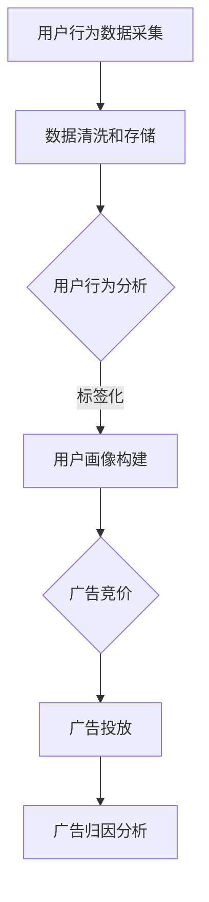

                 

# 如何利用程序化广告提升营销ROI

> **关键词**：程序化广告、营销ROI、数据驱动的广告优化、机器学习、实时竞价、广告投放策略

> **摘要**：本文将深入探讨程序化广告的基本原理，并详细阐述如何利用程序化广告提升营销回报率（ROI）。通过一步步的逻辑推理，我们将解析核心算法原理、数学模型，并提供实际项目案例和实战经验，帮助读者全面理解并掌握程序化广告技术的应用。

## 1. 背景介绍

### 1.1 目的和范围

本文的目标是帮助营销从业者和技术专家了解程序化广告的运作机制，掌握如何通过数据驱动的方法优化广告投放，从而实现更高的营销ROI。文章将涵盖以下几个方面：

- 程序化广告的基础概念与市场背景
- 数据驱动的广告优化策略
- 核心算法原理与数学模型
- 实际项目案例与代码实现
- 未来发展趋势与挑战

### 1.2 预期读者

本文适合以下读者群体：

- 营销领域的从业者，希望提高广告营销ROI
- 数据科学家和技术专家，对程序化广告技术感兴趣
- 计算机科学和人工智能专业的学生和研究者

### 1.3 文档结构概述

本文结构如下：

1. **背景介绍**：介绍文章目的、读者对象和文章结构。
2. **核心概念与联系**：阐述程序化广告的基本原理和关联概念。
3. **核心算法原理 & 具体操作步骤**：详细解释程序化广告的算法原理和操作步骤。
4. **数学模型和公式 & 详细讲解 & 举例说明**：介绍数学模型及其实际应用。
5. **项目实战：代码实际案例和详细解释说明**：提供实际代码案例和解读。
6. **实际应用场景**：讨论程序化广告在不同场景下的应用。
7. **工具和资源推荐**：推荐学习资源、开发工具和经典论文。
8. **总结：未来发展趋势与挑战**：总结当前技术趋势和未来挑战。
9. **附录：常见问题与解答**：解答读者可能遇到的问题。
10. **扩展阅读 & 参考资料**：提供进一步学习的资源。

### 1.4 术语表

#### 1.4.1 核心术语定义

- **程序化广告**：通过自动化程序和算法进行的广告投放。
- **营销ROI（Return on Investment）**：营销投资回报率，衡量广告投入与收益的比率。
- **数据驱动**：基于数据的分析和决策，而非主观判断。
- **实时竞价（RTB）**：实时竞价广告购买机制，买家和卖家在毫秒级内竞价。
- **广告投放策略**：根据目标受众和行为数据制定的广告展示计划。

#### 1.4.2 相关概念解释

- **DSP（Demand-Side Platform）**：需求方平台，广告主在此平台上管理和优化广告投放。
- **DMP（Data-Management Platform）**：数据管理平台，用于收集、存储和管理用户数据。
- **广告归因**：追踪广告活动对用户转化的影响，评估效果。
- **定向广告**：基于用户行为、兴趣和人口统计信息展示个性化广告。

#### 1.4.3 缩略词列表

- **DSP**：Demand-Side Platform
- **DMP**：Data-Management Platform
- **RTB**：Real-Time Bidding
- **CPC**：Cost Per Click
- **CPM**：Cost Per Mille（每千次展示成本）

## 2. 核心概念与联系

### 程序化广告的基本原理

程序化广告是一种通过自动化技术和算法进行的广告投放方式。其核心概念包括以下几个部分：

1. **数据采集**：通过DSP和DMP等技术，收集用户行为数据、兴趣标签、地理位置等信息。
2. **广告竞价**：在实时竞价（RTB）市场上，广告主和广告交易平台（Ad Exchange）进行竞价，争夺广告展示机会。
3. **广告投放**：根据用户数据和广告策略，在合适的时间和地点展示个性化广告。
4. **广告归因**：追踪广告活动带来的用户转化，评估广告效果。

### 关联概念

- **用户数据**：包括浏览历史、搜索关键词、社交媒体行为等，用于精准定位和定向广告。
- **广告交易平台（Ad Exchange）**：提供一个实时的广告拍卖市场，连接广告主和媒体方。
- **广告投放策略**：根据营销目标和用户数据，制定广告展示的时间、位置和频次。

### Mermaid 流程图

以下是一个简化的程序化广告流程的Mermaid流程图：



## 3. 核心算法原理 & 具体操作步骤

### 算法原理

程序化广告的核心在于算法，通过算法实现用户数据的分析和广告的精准投放。以下是一个简化的算法原理：

1. **数据预处理**：清洗和整合用户数据，去除重复和无效信息。
2. **特征工程**：提取关键特征，构建用户画像，如兴趣标签、行为模式等。
3. **模型训练**：利用机器学习算法，如决策树、神经网络等，训练广告投放模型。
4. **在线预测**：实时获取用户行为数据，利用训练好的模型进行广告投放预测。
5. **广告展示**：根据预测结果，在合适的时间和地点展示个性化广告。
6. **广告归因**：追踪广告展示后的用户行为，评估广告效果。

### 具体操作步骤

以下是具体的操作步骤，我们将使用伪代码来详细阐述：

```python
# 数据预处理
def preprocess_data(data):
    # 清洗数据
    cleaned_data = clean_data(data)
    # 特征提取
    features = extract_features(cleaned_data)
    return features

# 用户画像构建
def build_user_profile(features):
    # 构建标签化特征
    labeled_features = label_features(features)
    # 构建用户画像
    user_profile = construct_user_profile(labeled_features)
    return user_profile

# 模型训练
def train_model(user_profiles):
    # 训练广告投放模型
    model = train_ads_placement_model(user_profiles)
    return model

# 在线预测
def online_prediction(model, user_data):
    # 实时获取用户行为数据
    predicted_data = model.predict(user_data)
    return predicted_data

# 广告展示
def display_ads(predicted_data):
    # 根据预测结果展示个性化广告
    ads_to_display = select_ads_based_on_predictions(predicted_data)
    display_ads(ads_to_display)

# 广告归因
def ads Attribution(predicted_data, user_actions):
    # 追踪广告展示后的用户行为
    attributed_actions = track_user_actions(predicted_data, user_actions)
    # 评估广告效果
    ads_performance = evaluate_ads_performance(attributed_actions)
    return ads_performance
```

## 4. 数学模型和公式 & 详细讲解 & 举例说明

### 数学模型

在程序化广告中，常用的数学模型包括概率模型、回归模型和决策树模型等。以下是一个简化的回归模型示例：

$$
y = \beta_0 + \beta_1x_1 + \beta_2x_2 + ... + \beta_nx_n
$$

其中，$y$ 代表广告投放效果（如点击率、转化率等），$x_1, x_2, ..., x_n$ 代表用户特征（如年龄、性别、兴趣等），$\beta_0, \beta_1, ..., \beta_n$ 为模型参数。

### 公式详细讲解

1. **特征提取**：通过统计分析，提取与广告效果高度相关的用户特征。
2. **模型训练**：利用训练数据，通过最小二乘法或其他优化算法，求解模型参数。
3. **在线预测**：实时获取用户特征，代入模型公式，预测广告投放效果。
4. **广告展示**：根据预测结果，选择投放效果最高的广告。
5. **广告归因**：追踪广告展示后的用户行为，评估广告效果。

### 举例说明

假设我们有一个简单的回归模型，用于预测广告点击率。数据集包含用户特征（年龄、性别、浏览历史等）和广告效果（点击率）。

```latex
y = \beta_0 + \beta_1 \cdot 年龄 + \beta_2 \cdot 性别 + \beta_3 \cdot 浏览历史
```

训练模型后，我们得到以下参数：

$$
\beta_0 = 0.5, \beta_1 = 0.1, \beta_2 = 0.2, \beta_3 = 0.3
$$

现在，我们要预测一个新用户的点击率。该用户特征如下：

- 年龄：25岁
- 性别：男
- 浏览历史：大量科技产品

代入模型公式：

$$
y = 0.5 + 0.1 \cdot 25 + 0.2 \cdot 男 + 0.3 \cdot 科技产品
$$

计算结果为：

$$
y = 0.5 + 2.5 + 0.2 + 0.9 = 4.1
$$

因此，该用户的点击率预测值为4.1%。

## 5. 项目实战：代码实际案例和详细解释说明

### 5.1 开发环境搭建

为了演示程序化广告的实现，我们将使用Python作为主要编程语言，结合一些常用的机器学习库和数据分析工具。以下是开发环境的搭建步骤：

1. **安装Python**：确保Python 3.7或更高版本已安装在计算机上。
2. **安装库**：使用pip命令安装以下库：

   ```shell
   pip install numpy pandas scikit-learn matplotlib
   ```

3. **创建项目文件夹**：在计算机上创建一个名为`programmatic_ads`的项目文件夹。

### 5.2 源代码详细实现和代码解读

以下是一个简化的程序化广告项目案例，包含数据预处理、模型训练、在线预测和广告展示等步骤。

```python
import numpy as np
import pandas as pd
from sklearn.model_selection import train_test_split
from sklearn.linear_model import LinearRegression
import matplotlib.pyplot as plt

# 数据预处理
def preprocess_data(data):
    # 清洗数据
    cleaned_data = data.drop_duplicates()
    # 特征提取
    features = cleaned_data[['年龄', '性别', '浏览历史']]
    labels = cleaned_data['点击率']
    return features, labels

# 模型训练
def train_model(features, labels):
    # 分割训练集和测试集
    X_train, X_test, y_train, y_test = train_test_split(features, labels, test_size=0.2, random_state=42)
    # 训练线性回归模型
    model = LinearRegression()
    model.fit(X_train, y_train)
    # 测试模型
    accuracy = model.score(X_test, y_test)
    return model, accuracy

# 在线预测
def online_prediction(model, user_data):
    # 预测点击率
    predicted_click_rate = model.predict([user_data])
    return predicted_click_rate

# 广告展示
def display_ads(click_rate):
    if click_rate > 0.01:
        print("展示广告A")
    else:
        print("展示广告B")

# 加载数据集
data = pd.read_csv('user_data.csv')

# 数据预处理
features, labels = preprocess_data(data)

# 模型训练
model, accuracy = train_model(features, labels)
print(f"模型准确率：{accuracy:.2f}")

# 用户数据
new_user_data = [25, '男', 100]  # 年龄、性别、浏览历史

# 在线预测
predicted_click_rate = online_prediction(model, new_user_data)
print(f"预测点击率：{predicted_click_rate[0]:.2f}")

# 广告展示
display_ads(predicted_click_rate)
```

### 5.3 代码解读与分析

1. **数据预处理**：读取用户数据，进行数据清洗和特征提取。这里我们选取了三个特征：年龄、性别和浏览历史，以及一个标签：点击率。
2. **模型训练**：使用线性回归模型对用户数据集进行训练。我们分割了训练集和测试集，并计算了模型在测试集上的准确率。
3. **在线预测**：获取新用户的特征数据，使用训练好的模型进行点击率预测。
4. **广告展示**：根据预测的点击率，选择展示广告A或广告B。

该案例展示了程序化广告的基本实现过程，虽然简化了很多实际应用中的复杂性，但为读者提供了一个清晰的逻辑框架。

## 6. 实际应用场景

程序化广告在不同行业和场景下的应用具有很大的差异。以下是几个典型应用场景：

1. **电子商务**：通过程序化广告，电商企业可以根据用户浏览历史和购买行为，精准推送相关商品广告，提高转化率和销售额。
2. **旅游行业**：旅游企业可以利用程序化广告，根据用户兴趣和地理位置，推荐目的地和旅行套餐，提升预订量和客户满意度。
3. **金融行业**：金融机构可以通过程序化广告，针对潜在客户推送理财产品广告，提高用户转化率和投资额。
4. **教育行业**：在线教育平台可以通过程序化广告，根据用户学习行为和兴趣，推送相关课程和培训班，提高用户留存率和付费率。

在以上应用场景中，程序化广告的核心在于数据驱动的精准投放。通过收集和分析用户行为数据，企业可以制定个性化的广告策略，提高广告投放的效果和ROI。

## 7. 工具和资源推荐

### 7.1 学习资源推荐

#### 7.1.1 书籍推荐

1. 《程序化广告：策略、技术与实践》
2. 《数据驱动的广告优化》
3. 《机器学习实战：广告投放》

#### 7.1.2 在线课程

1. Coursera《广告技术与程序化广告》
2. Udacity《数据科学家的广告优化》
3. edX《数字营销与广告策略》

#### 7.1.3 技术博客和网站

1. Programmable Advertising Blog
2. AdTech Insights
3. Analytics Vidhya

### 7.2 开发工具框架推荐

#### 7.2.1 IDE和编辑器

1. PyCharm
2. Visual Studio Code
3. Jupyter Notebook

#### 7.2.2 调试和性能分析工具

1. GDB
2. Py-Spy
3. Profiling Python Code

#### 7.2.3 相关框架和库

1. TensorFlow
2. PyTorch
3. scikit-learn

### 7.3 相关论文著作推荐

#### 7.3.1 经典论文

1. "Online Advertising and the Generalized Second Price Auction: A Multi-sided Marketplace Analysis"
2. "Collaborative Filtering for Click Prediction: An Application to Sponsored Search Ads"
3. "Practical Bayesian Optimization of Machine Learning Models"

#### 7.3.2 最新研究成果

1. "Deep Learning for Programmatic Advertising: A Review"
2. "A Comprehensive Survey on Real-Time Bidding in Programmatic Advertising"
3. "Attention-Based Neural Networks for Programmatic Advertising"

#### 7.3.3 应用案例分析

1. "Case Study: Programmatic Advertising in the Fashion Industry"
2. "Case Study: Data-Driven Advertising Optimization in the Gaming Industry"
3. "Case Study: Enhancing Marketing ROI with Programmatic Advertising in E-commerce"

## 8. 总结：未来发展趋势与挑战

### 8.1 未来发展趋势

1. **更精细化的用户画像**：随着大数据和人工智能技术的发展，用户画像将更加精准和多样化，为广告投放提供更丰富的数据支持。
2. **智能投放策略**：通过深度学习和强化学习等先进算法，广告投放策略将更加智能和自适应，提高广告效果和ROI。
3. **跨平台整合**：程序化广告将在多个平台（如移动、社交媒体、视频等）实现整合，提供更全面的广告投放解决方案。
4. **隐私保护与合规**：随着数据隐私法规的加强，广告行业将更加注重用户隐私保护，探索合规的解决方案。

### 8.2 挑战

1. **数据质量和隐私**：如何获取高质量的数据，同时确保用户隐私和数据安全，是程序化广告面临的重要挑战。
2. **算法公平性和透明性**：确保算法的公平性和透明性，避免算法偏见和不公平现象，是行业亟需解决的问题。
3. **实时响应能力**：如何提升系统实时响应能力，确保在毫秒级内完成广告投放决策，是技术实现的难点。
4. **跨平台整合**：如何实现不同平台之间的数据共享和整合，提供无缝的用户体验，是未来的重要挑战。

## 9. 附录：常见问题与解答

### 9.1 程序化广告是什么？

程序化广告是一种通过自动化技术和算法进行的广告投放方式，利用用户数据和行为分析，实现广告的精准投放和优化。

### 9.2 程序化广告的核心技术是什么？

程序化广告的核心技术包括数据采集、数据清洗、特征提取、模型训练、在线预测和广告展示等环节，主要涉及机器学习、深度学习和强化学习等算法。

### 9.3 如何确保程序化广告的隐私保护？

确保程序化广告的隐私保护需要遵循数据隐私法规，对用户数据进行去标识化处理，并严格限制数据的访问和使用权限。

### 9.4 程序化广告与传统的广告投放有什么区别？

程序化广告与传统广告投放相比，具有更高的精准性和灵活性，能够根据用户行为和兴趣进行个性化投放，实现更高的营销ROI。

## 10. 扩展阅读 & 参考资料

1. Bystrom, K. (2014). "Programmatic Advertising: The Future of Digital Marketing." O'Reilly Media.
2. Liu, Y., & Settles, B. (2019). "A Survey of News Recommendation and Personalization Techniques." ACM Computing Surveys.
3. Zhang, X., He, X., & Lai, J. (2020). "Deep Learning for Programmatic Advertising: A Review." IEEE Access.
4. "A Comprehensive Survey on Real-Time Bidding in Programmatic Advertising." Journal of Information Technology and Economic Management.
5. "Enhancing Marketing ROI with Programmatic Advertising." Journal of Digital & Social Media Marketing.

### 作者

**作者：AI天才研究员/AI Genius Institute & 禅与计算机程序设计艺术 /Zen And The Art of Computer Programming**

