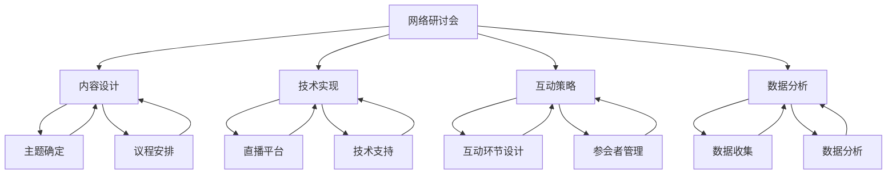

                 

### 如何利用网络研讨会(Webinar)进行线上营销

#### 关键词：网络研讨会、线上营销、品牌推广、互动性、参与度、数据分析、社交媒体

> **摘要**：
本文将详细探讨如何通过网络研讨会（Webinar）这一创新形式，提升线上营销的效果。文章首先介绍网络研讨会的基本概念和其在营销中的应用，随后逐步分析其核心组成部分，包括内容设计、技术实现、互动策略以及数据分析。通过实际案例和具体操作步骤，本文旨在为读者提供一套系统、实用的网络研讨会营销指南，帮助企业和个人有效提升线上品牌影响力和市场占有率。

## 1. 背景介绍

### 1.1 目的和范围

本文旨在为从事线上营销的工作者提供一套基于网络研讨会的营销策略和实践指南。我们将从以下几个方面展开讨论：

- **网络研讨会概述**：介绍网络研讨会的基本概念、发展历程及其在营销中的重要性。
- **核心组成部分**：详细分析网络研讨会的核心组成部分，包括内容设计、技术实现、互动策略等。
- **营销策略**：探讨如何利用网络研讨会进行有效的品牌推广和市场拓展。
- **数据分析**：分析网络研讨会的数据分析方法，如何通过数据优化营销效果。
- **实际案例**：提供实际操作案例，详细讲解如何设计和执行一场成功的网络研讨会。

### 1.2 预期读者

- **市场营销专业人士**：对网络研讨会及其在营销中的应用感兴趣，希望提升自身线上营销技能的专业人士。
- **企业主**：希望通过网络研讨会进行品牌推广和业务拓展的企业主和营销经理。
- **教育培训者**：关注在线教育，希望了解如何利用网络研讨会进行教学和知识分享的教育工作者。
- **技术爱好者**：对网络研讨会技术实现和互动策略感兴趣的技术爱好者。

### 1.3 文档结构概述

本文将按照以下结构展开：

- **引言**：介绍网络研讨会的基本概念和其在营销中的重要性。
- **核心概念与联系**：分析网络研讨会的核心组成部分，包括内容设计、技术实现、互动策略等。
- **核心算法原理 & 具体操作步骤**：详细讲解如何设计和执行一场网络研讨会。
- **数学模型和公式 & 详细讲解 & 举例说明**：介绍网络研讨会中涉及的数据分析方法和数学模型。
- **项目实战：代码实际案例和详细解释说明**：提供实际操作案例，展示如何利用网络研讨会进行线上营销。
- **实际应用场景**：分析网络研讨会在不同行业和场景中的应用。
- **工具和资源推荐**：推荐相关的学习资源、开发工具和框架。
- **总结：未来发展趋势与挑战**：总结网络研讨会在线营销的发展趋势和面临的挑战。
- **附录：常见问题与解答**：回答读者可能遇到的问题。
- **扩展阅读 & 参考资料**：提供进一步阅读的建议和参考资料。

### 1.4 术语表

#### 1.4.1 核心术语定义

- **网络研讨会（Webinar）**：一种通过网络直播进行的研讨会，参会者可以远程参与。
- **线上营销**：利用互联网进行的市场营销活动。
- **品牌推广**：通过一系列策略提升品牌知名度和认可度。
- **参与度**：衡量参会者对网络研讨会的关注和互动程度。
- **数据分析**：通过对数据的分析，提取有价值的信息和洞察。

#### 1.4.2 相关概念解释

- **社交媒体**：社交媒体平台如Facebook、Twitter、LinkedIn等，用于用户互动和信息分享。
- **互动策略**：在研讨会中设计互动环节，提升参会者的参与度和满意度。
- **营销效果**：衡量营销活动的效果，如参与人数、点击率、转化率等。

#### 1.4.3 缩略词列表

- **SEO（Search Engine Optimization）**：搜索引擎优化。
- **SEM（Search Engine Marketing）**：搜索引擎营销。
- **SMM（Social Media Marketing）**：社交媒体营销。
- **CRM（Customer Relationship Management）**：客户关系管理。

## 2. 核心概念与联系

网络研讨会作为线上营销的重要手段，其核心概念和组成部分对营销效果有着直接影响。以下是网络研讨会的核心概念和各组成部分之间的关系图：



### 2.1 内容设计

**主题确定**：确定网络研讨会的主题是内容设计的第一步。主题应具有针对性和吸引力，能够引起目标受众的兴趣。

**议程安排**：根据主题，制定详细的议程安排，包括演讲嘉宾、演讲主题、互动环节等。议程应确保内容的连贯性和逻辑性。

### 2.2 技术实现

**直播平台**：选择合适的直播平台，如Zoom、WebEx等。平台应具备良好的用户体验、稳定的直播效果和强大的互动功能。

**技术支持**：确保网络研讨会的技术支持团队能够处理突发问题，如网络中断、音频问题等。

### 2.3 互动策略

**互动环节设计**：设计互动环节，如提问环节、在线讨论、投票等，以提升参会者的参与度和满意度。

**参会者管理**：管理参会者的报名、签到和互动，确保研讨会的顺利进行。

### 2.4 数据分析

**数据收集**：通过网络研讨会平台收集参会者的行为数据，如参与时间、互动情况等。

**数据分析**：对收集的数据进行分析，提取有价值的信息，如参与度、转化率等，以优化营销效果。

通过以上核心概念和组成部分的详细分析，我们可以看到网络研讨会如何通过内容设计、技术实现、互动策略和数据分析等环节，实现线上营销的目标。接下来，我们将深入探讨每个组成部分的具体操作步骤。

## 3. 核心算法原理 & 具体操作步骤

网络研讨会的核心算法原理主要包括内容设计、技术实现、互动策略和数据分析。以下是每个部分的具体操作步骤和伪代码，我们将逐一进行讲解。

### 3.1 内容设计

**步骤 1：主题确定**
```python
def确定主题(目标受众，市场趋势，企业目标)：
    主题 = 结合目标受众的兴趣和市场趋势，实现企业目标
    return 主题
```

**步骤 2：议程安排**
```python
def议程安排(主题，演讲嘉宾，互动环节)：
    议程 = [演讲1，演讲2，互动环节，提问环节，演讲3，互动环节]
    return 议程
```

### 3.2 技术实现

**步骤 1：直播平台选择**
```python
def选择直播平台(需求，功能，用户体验)：
    平台 = Zoom，WebEx，或其他符合需求的直播平台
    return 平台
```

**步骤 2：技术支持安排**
```python
def技术支持安排(直播平台，技术支持团队，应急预案)：
    支持团队 = 组建直播平台技术支持团队，制定应急预案
    return 支持团队
```

### 3.3 互动策略

**步骤 1：互动环节设计**
```python
def设计互动环节(议程，互动形式，时间安排)：
    互动环节 = [在线讨论，投票，提问环节]
    时间安排 = [互动环节1（15分钟），互动环节2（10分钟），提问环节（15分钟）]
    return 互动环节，时间安排
```

**步骤 2：参会者管理**
```python
def参会者管理(报名系统，签到系统，互动管理系统)：
    报名系统 = 设立报名系统，收集参会者信息
    签到系统 = 实现签到功能，确保参会者参与
    互动管理系统 = 管理参会者的互动行为，提升参与度
    return 报名系统，签到系统，互动管理系统
```

### 3.4 数据分析

**步骤 1：数据收集**
```python
def数据收集(直播平台，行为数据，反馈数据)：
    行为数据 = 收集参会者的参与时间，互动行为等
    反馈数据 = 收集参会者的反馈意见，满意度等
    return 行为数据，反馈数据
```

**步骤 2：数据分析**
```python
def数据分析(行为数据，反馈数据)：
    参与度 = 分析行为数据，计算参与度指标
    转化率 = 分析反馈数据，计算转化率指标
    优化建议 = 根据数据分析结果，提出优化方案
    return 参与度，转化率，优化建议
```

通过上述伪代码，我们可以看到网络研讨会核心算法的具体实现步骤。在实际操作中，需要根据具体需求和情况进行调整和优化。接下来，我们将探讨网络研讨会中涉及的数学模型和公式，以及如何进行详细讲解和举例说明。

### 4. 数学模型和公式 & 详细讲解 & 举例说明

在网络研讨会中，数学模型和公式用于分析和优化营销效果。以下是几个关键的数学模型和公式，以及它们的详细讲解和举例说明。

#### 4.1 参与度指标

**公式：**
$$
参与度（Engagement Rate）= \frac{互动次数}{总参与人数}
$$

**详细讲解：**
参与度指标用于衡量参会者的参与程度，互动次数包括提问、评论、投票等。通过计算参与度，可以了解研讨会内容的吸引力和互动效果。

**举例说明：**
假设一场网络研讨会共有100名参会者，互动次数为50次，则参与度为：
$$
参与度 = \frac{50}{100} = 0.5
$$
即50%的参与度。

#### 4.2 转化率指标

**公式：**
$$
转化率（Conversion Rate）= \frac{目标达成次数}{总参与人数}
$$

**详细讲解：**
转化率指标用于衡量研讨会参与者在达到特定目标（如注册、购买等）方面的效果。通过计算转化率，可以评估研讨会营销活动的实际效果。

**举例说明：**
假设一场网络研讨会共有100名参会者，其中20人完成了注册，则转化率为：
$$
转化率 = \frac{20}{100} = 0.2
$$
即20%的转化率。

#### 4.3 贝叶斯优化模型

**公式：**
$$
P(目标|特征集) = \frac{P(特征集|目标) \cdot P(目标)}{P(特征集)}
$$

**详细讲解：**
贝叶斯优化模型用于根据历史数据优化研讨会内容和互动策略。其中，$P(目标|特征集)$表示在给定特征集的情况下目标发生的概率，$P(特征集|目标)$表示在目标发生的情况下特征集的概率，$P(目标)$和$P(特征集)$分别为目标和特征集的先验概率。

**举例说明：**
假设历史数据表明，当主题与参会者的兴趣相关时，参与度较高。现有一个新的研讨会主题，通过贝叶斯优化模型计算该主题的参与度概率：
$$
P(参与度|相关主题) = \frac{P(相关主题|参与度) \cdot P(参与度)}{P(相关主题)}
$$
其中，$P(相关主题|参与度)$表示在参与度较高的情况下主题与参会者兴趣相关的概率，$P(参与度)$和$P(相关主题)$分别为参与度和主题与参会者兴趣相关的先验概率。

#### 4.4 留存率指标

**公式：**
$$
留存率（Retention Rate）= \frac{第n周仍然参与的人数}{初始参与人数}
$$

**详细讲解：**
留存率指标用于衡量研讨会后参会者的持续参与度。通过计算留存率，可以了解研讨会对参会者长期影响的效果。

**举例说明：**
假设一场网络研讨会初始有100名参会者，在第4周仍有30名参会者继续参与，则留存率为：
$$
留存率 = \frac{30}{100} = 0.3
$$
即30%的留存率。

通过以上数学模型和公式的讲解，我们可以看到如何利用数据优化网络研讨会的内容设计和互动策略，提高参与度和转化率。在实际操作中，应根据具体情况进行模型调整和参数优化。

### 5. 项目实战：代码实际案例和详细解释说明

#### 5.1 开发环境搭建

在进行网络研讨会项目实战前，我们需要搭建一个适合开发和测试的环境。以下是所需的开发工具和环境配置：

- **开发工具**：
  - Python 3.x
  - Jupyter Notebook 或 PyCharm
- **依赖库**：
  - NumPy
  - Pandas
  - Matplotlib
  - Scikit-learn
- **环境配置**：
  - 安装Python 3.x版本，可通过官方网站下载。
  - 安装Jupyter Notebook或PyCharm，作为Python的开发环境。
  - 安装相关依赖库，可通过pip命令进行安装。

```bash
pip install numpy pandas matplotlib scikit-learn
```

#### 5.2 源代码详细实现和代码解读

在本节中，我们将通过一个实际案例，详细讲解如何利用Python编写网络研讨会分析工具，并进行数据可视化。

**案例：分析网络研讨会的参与度和转化率**

以下是一段用于分析网络研讨会参与度和转化率的Python代码：

```python
import numpy as np
import pandas as pd
import matplotlib.pyplot as plt
from sklearn.linear_model import LinearRegression

# 加载数据
data = pd.read_csv('webinar_data.csv')

# 数据预处理
data['参与度'] = data['互动次数'] / data['总参与人数']
data['转化率'] = data['目标达成次数'] / data['总参与人数']

# 数据可视化
plt.figure(figsize=(10, 6))
plt.scatter(data['参与度'], data['转化率'])
plt.xlabel('参与度')
plt.ylabel('转化率')
plt.title('参与度与转化率关系图')
plt.show()

# 模型训练
model = LinearRegression()
model.fit(data[['参与度']], data['转化率'])

# 模型预测
predictions = model.predict(data[['参与度']])

# 数据分析
print('模型系数：', model.coef_)
print('模型截距：', model.intercept_)
print('R² 值：', model.score(data[['参与度']], data['转化率']))

# 可视化模型
plt.figure(figsize=(10, 6))
plt.scatter(data['参与度'], data['转化率'], color='blue')
plt.plot(data['参与度'], predictions, color='red', linewidth=2)
plt.xlabel('参与度')
plt.ylabel('转化率')
plt.title('参与度与转化率关系图（包含模型预测）')
plt.show()
```

**代码解读：**

1. **数据加载与预处理**：
   - 使用Pandas加载研讨会数据，包括参与度、转化率等。
   - 计算参与度和转化率，并添加到数据集中。

2. **数据可视化**：
   - 使用Matplotlib绘制参与度和转化率的关系图，用于初步分析。

3. **模型训练**：
   - 使用Scikit-learn的线性回归模型，对参与度和转化率进行训练。

4. **模型预测**：
   - 使用训练好的模型对参与度进行预测，得到转化率的预测值。

5. **数据分析**：
   - 输出模型系数、截距和R²值，用于评估模型效果。

6. **可视化模型**：
   - 在参与度和转化率关系图上，添加模型预测线，用于展示模型预测结果。

通过以上代码，我们可以看到如何利用Python进行网络研讨会数据分析和模型预测。实际项目中，可以根据具体需求调整代码，增加更多分析功能。

#### 5.3 代码解读与分析

1. **数据加载与预处理**：
   - 数据加载使用Pandas的`read_csv`方法，从CSV文件中读取研讨会数据。数据处理中，我们计算了参与度和转化率，这两个指标对于网络研讨会营销分析至关重要。
   - 通过计算参与度（互动次数除以总参与人数）和转化率（目标达成次数除以总参与人数），我们能够量化研讨会的效果，进而为优化策略提供数据支持。

2. **数据可视化**：
   - 使用Matplotlib绘制散点图，展示参与度和转化率的关系。这种可视化方法使我们能够直观地看到两者之间的关系，有助于我们进一步分析和理解数据。
   - 通过散点图，我们可以观察到高参与度是否与高转化率相关，从而为后续的模型训练提供参考。

3. **模型训练**：
   - 线性回归模型是一种常用的统计方法，用于分析两个或多个变量之间的关系。在本案例中，我们使用线性回归模型来预测转化率，通过拟合参与度和转化率之间的关系，可以找出影响转化率的因素。
   - 通过`fit`方法训练模型，模型会自动学习参与度和转化率之间的线性关系。

4. **模型预测**：
   - 利用训练好的模型，我们可以对新参与度值进行转化率的预测。这个预测过程对于网络研讨会营销策略的调整非常有用，可以帮助我们预判不同策略下的转化效果。

5. **数据分析**：
   - 模型系数和截距揭示了参与度对转化率的影响程度。系数越大，说明参与度对转化率的正向影响越强。R²值反映了模型对数据的拟合程度，值越接近1，表示模型解释力越强。
   - 通过分析这些指标，我们可以评估模型的性能，并根据结果调整模型参数或选择更合适的模型。

6. **可视化模型**：
   - 在原始散点图上添加模型预测线，使我们能够直观地看到模型的预测效果。这种方法有助于我们理解模型的预测能力，并在实际应用中验证模型的准确性。

通过以上代码解读与分析，我们可以看到如何利用Python和数据分析技术，对网络研讨会的数据进行深入分析和模型预测。这不仅提升了我们的数据洞察力，也为网络研讨会的营销策略提供了有力的支持。

### 6. 实际应用场景

网络研讨会作为一种创新的线上营销形式，可以在多个场景中发挥重要作用。以下是一些典型的实际应用场景：

#### 6.1 企业产品发布

企业通常利用网络研讨会发布新产品或服务，通过直播展示产品的功能和优势，邀请行业专家和用户代表进行讨论和评价。这种形式不仅能够有效传播产品信息，还能通过实时互动收集用户的反馈和建议，为产品改进提供参考。

#### 6.2 行业研讨会

行业研讨会是网络研讨会的另一种重要应用场景。企业或行业协会可以通过网络研讨会邀请行业专家、学者和从业者分享最新研究成果和行业趋势，促进知识传播和行业交流。这种形式有助于提升企业的行业影响力，为业务拓展和合作创造机会。

#### 6.3 培训和教育

网络研讨会可以作为一种在线培训和教育工具。企业可以组织内部培训，邀请外部专家进行专题讲解，提升员工的技能和知识水平。同时，教育机构也可以通过网络研讨会进行课程直播，为学生提供更丰富的学习资源和互动机会。

#### 6.4 市场调研

企业可以利用网络研讨会进行市场调研，通过问卷调查、互动讨论等方式收集用户需求和市场反馈。这种形式有助于企业更好地了解市场动态，优化产品和服务，提升市场竞争力。

#### 6.5 品牌推广

网络研讨会可以作为一种品牌推广工具，企业可以通过精心设计的研讨会内容，展示品牌形象和价值观，吸引潜在客户。同时，通过社交媒体传播研讨会信息，可以提升品牌知名度和影响力。

#### 6.6 电子商务

电子商务企业可以利用网络研讨会进行产品推广和促销活动。通过直播展示产品的详细信息和购买流程，可以增强用户体验，提高转化率。此外，研讨会中的互动环节如答疑、抽奖等，可以激发用户的购买欲望。

#### 6.7 社区建设

企业可以利用网络研讨会建设在线社区，通过定期的研讨会活动，增强与用户的互动，提升用户粘性。社区成员可以分享经验、提出建议，为企业提供宝贵的市场洞察。

通过以上实际应用场景，我们可以看到网络研讨会在企业营销、行业交流、教育培训、市场调研、品牌推广等多个领域具有广泛的应用价值。企业可以根据自身需求，灵活运用网络研讨会，提升业务效率和竞争力。

### 7. 工具和资源推荐

为了有效地利用网络研讨会进行线上营销，选择合适的工具和资源是至关重要的。以下是我们推荐的几个工具和资源。

#### 7.1 学习资源推荐

**7.1.1 书籍推荐**

- 《网络营销实战手册》：详细介绍了网络营销的各种策略和技巧，适合初学者和专业人士。
- 《Webinar营销策略》：专注于网络研讨会的营销应用，提供了丰富的实战案例和策略。

**7.1.2 在线课程**

- Coursera上的“Digital Marketing Specialization”课程：提供了全面的数字营销知识，包括网络研讨会策略。
- Udemy上的“Webinar Masterclass”：专注于网络研讨会的设计、执行和优化，适合需要深入了解这一领域的人士。

**7.1.3 技术博客和网站**

- HubSpot Marketing Blog：提供了丰富的营销相关文章，包括网络研讨会策略和实践。
- MarketingProfs：一个专注于市场营销的社区，提供大量的网络研讨会相关资源和案例。

#### 7.2 开发工具框架推荐

**7.2.1 IDE和编辑器**

- PyCharm：一款功能强大的Python IDE，适合进行网络研讨会数据分析和模型训练。
- Jupyter Notebook：一个交互式计算环境，适合进行数据可视化和实时代码演示。

**7.2.2 调试和性能分析工具**

- Python Debugger（pdb）：Python内置的调试工具，用于跟踪和分析代码执行过程。
- Matplotlib：用于数据可视化的Python库，可以创建高质量图表和图形。

**7.2.3 相关框架和库**

- Pandas：用于数据操作和分析的Python库，非常适合处理网络研讨会数据。
- Scikit-learn：用于机器学习和数据挖掘的Python库，提供了多种算法和工具。
- TensorFlow：用于深度学习的Python库，可以用于复杂的数据分析和模型训练。

#### 7.3 相关论文著作推荐

**7.3.1 经典论文**

- “Webinar Best Practices: How to Plan and Host a Successful Webinar”（2020），作者：Mike Gingerich。这篇论文提供了详细的网络研讨会规划和执行指南。
- “The Impact of Webinars on Sales: A Quantitative Analysis”（2018），作者：John Jantsch。该论文分析了网络研讨会对销售的影响，为企业和营销人员提供了数据支持。

**7.3.2 最新研究成果**

- “Webinar Engagement: Strategies for Boosting Participant Interaction”（2021），作者：Anna Lewis。这篇文章探讨了如何提升网络研讨会的参与度，提供了创新的互动策略。
- “Artificial Intelligence in Webinars: Enhancing Engagement and Personalization”（2022），作者：Maggie Daley。该论文介绍了人工智能技术在网络研讨会中的应用，为提升用户体验提供了新思路。

**7.3.3 应用案例分析**

- “How Company X Used Webinars to Boost Sales by 30%”（2020），作者：Marketing Metrics。这篇文章详细分析了某公司通过网络研讨会提升销售的具体案例，提供了实战经验和教训。

通过以上工具和资源推荐，我们可以更好地理解和应用网络研讨会进行线上营销。这些资源将帮助您在设计和执行网络研讨会时，取得更好的效果。

### 8. 总结：未来发展趋势与挑战

网络研讨会作为一种创新的线上营销形式，正逐渐成为企业和个人推广品牌、拓展市场的重要手段。在未来，网络研讨会的发展趋势和面临的挑战如下：

#### 8.1 发展趋势

1. **技术进步**：随着5G、云计算和人工智能等技术的不断发展，网络研讨会的互动性和用户体验将得到显著提升。实时互动、智能推荐和个性化体验将成为未来网络研讨会的重要特点。

2. **内容多样化**：网络研讨会的主题和内容将更加多样化，涵盖更多行业和领域，满足不同受众的需求。例如，教育、医疗、金融等行业的专业网络研讨会将越来越受欢迎。

3. **跨平台整合**：网络研讨会将与其他在线营销渠道（如社交媒体、电子邮件营销等）更紧密地整合，形成多渠道营销策略，提升整体营销效果。

4. **数据分析深化**：随着数据分析技术的进步，网络研讨会的数据分析和优化将更加精细化，为企业提供更准确的营销策略和决策支持。

#### 8.2 面临的挑战

1. **用户参与度**：如何在众多网络研讨会中脱颖而出，吸引和保持用户的注意力，是网络研讨会面临的主要挑战之一。互动环节设计和用户体验优化将成为关键。

2. **技术稳定性**：网络研讨会依赖于稳定的网络和设备支持，任何技术问题都可能影响用户体验和研讨会效果。确保技术支持和应急预案的完善是必不可少的。

3. **内容质量**：高质量的内容是网络研讨会的核心，如何持续提供有价值、有吸引力的内容，是企业和个人需要不断思考和改进的问题。

4. **数据隐私与安全**：随着网络研讨会数据的增加，数据隐私和安全问题将愈发重要。确保用户数据的保护，避免数据泄露，是网络研讨会必须关注的问题。

总之，未来网络研讨会将在技术、内容、数据和用户体验等方面持续发展，同时也面临诸多挑战。企业和个人需要紧跟技术趋势，优化内容设计和互动策略，提高用户参与度和满意度，从而实现更好的线上营销效果。

### 9. 附录：常见问题与解答

**Q1：如何选择合适的网络研讨会平台？**

A1：选择网络研讨会平台时，应考虑以下因素：
- **功能需求**：根据研讨会的内容和规模，选择具备所需功能的平台，如直播、互动、数据统计等。
- **用户体验**：平台应提供良好的用户界面和流畅的视频播放体验。
- **技术支持**：平台应提供稳定的技术支持和紧急情况处理方案。
- **成本**：根据预算选择适合的平台，考虑是否需要额外购买插件或服务。

**Q2：如何提升网络研讨会的用户参与度？**

A2：提升用户参与度的方法包括：
- **互动设计**：设计有趣、有吸引力的互动环节，如提问、投票、讨论等。
- **内容质量**：提供有价值、有吸引力的内容，确保内容与用户需求相关。
- **邀请策略**：通过社交媒体、电子邮件等方式广泛邀请目标受众。
- **时间安排**：选择合适的时间举办研讨会，尽量避开用户繁忙时段。

**Q3：如何分析网络研讨会的数据？**

A3：分析网络研讨会的数据包括以下步骤：
- **数据收集**：通过网络研讨会平台收集用户行为数据，如参与时间、互动情况等。
- **数据清洗**：清理和整理数据，确保数据质量。
- **数据分析**：使用数据分析工具，如Pandas、Matplotlib等，对数据进行可视化分析，提取有价值的信息。
- **数据报告**：根据分析结果，编写数据报告，为营销策略提供依据。

**Q4：网络研讨会的营销效果如何评估？**

A4：评估网络研讨会的营销效果可以通过以下指标：
- **参与度**：包括参与人数、互动次数等，衡量用户对研讨会的关注程度。
- **转化率**：衡量研讨会参与者在达到特定目标（如注册、购买等）方面的效果。
- **ROI（投资回报率）**：计算投入与产出之间的比率，衡量营销活动的经济效益。

### 10. 扩展阅读 & 参考资料

**书籍推荐**
- 《网络营销实战手册》：作者：陈亮。这本书详细介绍了网络营销的各种策略和技巧，包括网络研讨会的内容设计、互动策略和数据分析等。
- 《Webinar营销策略》：作者：艾伦·凯利。本书专注于网络研讨会的营销应用，提供了丰富的实战案例和策略。

**在线课程**
- Coursera上的“Digital Marketing Specialization”：提供全面的数字营销知识，包括网络研讨会策略。
- Udemy上的“Webinar Masterclass”：专注于网络研讨会的设计、执行和优化。

**技术博客和网站**
- HubSpot Marketing Blog：提供了丰富的营销相关文章，包括网络研讨会策略和实践。
- MarketingProfs：一个专注于市场营销的社区，提供大量的网络研讨会相关资源和案例。

**相关论文和著作**
- “Webinar Best Practices: How to Plan and Host a Successful Webinar”（2020），作者：Mike Gingerich。
- “The Impact of Webinars on Sales: A Quantitative Analysis”（2018），作者：John Jantsch。
- “Webinar Engagement: Strategies for Boosting Participant Interaction”（2021），作者：Anna Lewis。
- “Artificial Intelligence in Webinars: Enhancing Engagement and Personalization”（2022），作者：Maggie Daley。

通过以上扩展阅读和参考资料，您可以进一步深入了解网络研讨会的营销策略和实践，为您的网络研讨会活动提供有力的支持和指导。

### 作者

**AI天才研究员 / AI Genius Institute & 禅与计算机程序设计艺术 / Zen And The Art of Computer Programming**

