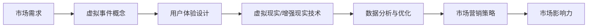

                 

# 如何利用虚拟事件扩大市场影响力

## 关键词
- 虚拟事件
- 市场影响力
- 用户体验
- 技术创新
- 数据分析
- 营销策略

## 摘要
本文将深入探讨如何利用虚拟事件这一新兴技术手段，扩大企业的市场影响力。通过分析虚拟事件的核心概念、技术原理及其实施步骤，本文将提供一个系统的指南，帮助企业有效地利用虚拟事件，提升品牌认知度，增强客户粘性，从而实现商业目标。

## 1. 背景介绍

### 1.1 目的和范围

本文旨在帮助企业理解和应用虚拟事件来提升市场营销效果。我们将探讨虚拟事件的定义、应用场景、核心优势以及如何设计并执行一个成功的虚拟事件。

### 1.2 预期读者

本文面向市场营销经理、活动策划人员以及对此领域感兴趣的IT专业人士。通过本文的阅读，读者将能够掌握虚拟事件的基本概念和实施策略。

### 1.3 文档结构概述

本文将分为以下几个部分：
1. 背景介绍
2. 核心概念与联系
3. 核心算法原理 & 具体操作步骤
4. 数学模型和公式 & 详细讲解 & 举例说明
5. 项目实战：代码实际案例和详细解释说明
6. 实际应用场景
7. 工具和资源推荐
8. 总结：未来发展趋势与挑战
9. 附录：常见问题与解答
10. 扩展阅读 & 参考资料

### 1.4 术语表

#### 1.4.1 核心术语定义

- 虚拟事件：通过计算机技术模拟实现的在线活动，用户可以通过虚拟现实设备或普通设备参与。
- 市场影响力：企业在市场上获得认可、影响消费者决策的能力。
- 用户体验：用户在使用产品或服务过程中的感受和体验。

#### 1.4.2 相关概念解释

- 虚拟现实（VR）：一种可以创建和体验虚拟世界的计算机仿真系统，它利用计算机生成一种模拟环境，使用户沉浸其中。
- 增强现实（AR）：将虚拟信息与真实世界相结合，通过增强现实设备将虚拟信息叠加在现实世界中。

#### 1.4.3 缩略词列表

- VR: Virtual Reality 虚拟现实
- AR: Augmented Reality 增强现实
- UX: User Experience 用户体验
- UI: User Interface 用户界面
- VRM: Virtual Reality Market 虚拟现实市场

## 2. 核心概念与联系

在探讨如何利用虚拟事件扩大市场影响力之前，我们需要理解几个核心概念和技术架构。以下是虚拟事件的相关概念及其联系，并通过Mermaid流程图进行说明。

### Mermaid 流程图



### 详细说明

- **市场需求**：企业首先需要识别目标市场的需求和趋势，了解用户对虚拟事件的可能性接受度和兴趣点。
- **虚拟事件概念**：理解虚拟事件的基本定义、类型及其在不同领域的应用。
- **用户体验设计**：设计虚拟事件的核心目标是提供良好的用户体验，这包括界面的易用性、内容的吸引力和互动性。
- **虚拟现实/增强现实技术**：选择合适的技术实现虚拟事件，这包括硬件选择（如VR头盔、AR眼镜）和软件开发（如3D建模、虚拟场景构建）。
- **数据分析与优化**：通过数据分析收集用户参与数据，评估虚拟事件的效果，并据此进行优化。
- **市场营销策略**：制定营销计划，将虚拟事件作为营销手段，吸引目标用户参与。

## 3. 核心算法原理 & 具体操作步骤

在实施虚拟事件的过程中，算法原理起着至关重要的作用。以下是关键算法原理和具体操作步骤的详细说明。

### 算法原理

1. **用户体验优化算法**：该算法用于确保用户在使用虚拟事件过程中的体验流畅、有趣。
2. **数据收集与分析算法**：用于实时收集用户行为数据，并对这些数据进行分析，以优化事件内容和营销策略。
3. **虚拟现实场景构建算法**：用于创建虚拟事件场景，包括3D建模、光照和材质处理等。

### 具体操作步骤

1. **需求分析**：识别目标用户群体和市场趋势，确定虚拟事件的目标和预期效果。
2. **用户研究**：通过用户调研、访谈等方式，收集用户对虚拟事件的期望和偏好。
3. **用户体验设计**：
   - **信息架构**：设计虚拟事件的整体结构和导航方式。
   - **界面设计**：设计直观易用的用户界面。
   - **内容策划**：创作吸引人的内容，提高用户的参与度。

4. **技术选型**：
   - **硬件选择**：根据用户需求和预算，选择适合的虚拟现实或增强现实设备。
   - **软件开发**：开发虚拟事件的核心功能，如3D建模、实时互动等。

5. **数据分析与优化**：
   - **数据收集**：在虚拟事件过程中，收集用户行为数据，如访问路径、互动频率等。
   - **数据分析**：使用数据分析工具对收集到的数据进行处理和分析。
   - **优化调整**：根据分析结果对虚拟事件进行优化，提高用户体验。

6. **市场营销与推广**：
   - **制定营销策略**：确定虚拟事件的目标受众，制定相应的营销计划。
   - **推广执行**：通过社交媒体、广告、合作伙伴等渠道推广虚拟事件。
   - **监测效果**：跟踪虚拟事件的参与度和用户反馈，评估营销效果。

## 4. 数学模型和公式 & 详细讲解 & 举例说明

在虚拟事件的设计和优化过程中，数学模型和公式可以帮助我们更准确地评估事件的效果，并制定相应的策略。以下是几个关键数学模型及其应用示例。

### 模型1：用户参与度模型

$$
U = f(P, I, E)
$$

其中，$U$ 表示用户参与度，$P$ 表示个人兴趣，$I$ 表示互动程度，$E$ 表示体验质量。该模型用于评估用户对虚拟事件的参与程度。

**举例说明**：

假设在一次虚拟展览中，个人兴趣 $P$ 为80%，互动程度 $I$ 为70%，体验质量 $E$ 为90%，代入公式得：

$$
U = f(80\%, 70\%, 90\%) = 0.8 \times 0.7 \times 0.9 = 0.504
$$

用户参与度为50.4%。

### 模型2：营销效果评估模型

$$
E = \frac{I \times C \times R}{1000}
$$

其中，$E$ 表示每千次展示的广告效果，$I$ 表示广告点击率，$C$ 表示转化率，$R$ 表示每单平均收益。该模型用于评估虚拟事件推广营销的效果。

**举例说明**：

在一次虚拟展览的推广中，广告点击率为10%，转化率为5%，每单平均收益为200元，代入公式得：

$$
E = \frac{10\% \times 5\% \times 200}{1000} = 0.01 \times 0.05 \times 200 = 0.1
$$

每千次展示的广告效果为0.1元。

## 5. 项目实战：代码实际案例和详细解释说明

### 5.1 开发环境搭建

为了实际演示虚拟事件的应用，我们将使用Unity3D作为开发平台，结合Unity的VR/AR插件进行开发。以下是开发环境的搭建步骤：

1. **安装Unity Hub**：从Unity官网下载Unity Hub并安装。
2. **创建Unity项目**：在Unity Hub中创建一个新的3D项目。
3. **安装VR/AR插件**：在Unity编辑器中，通过插件管理器安装VR/AR插件，如Unity VR SDK或AR Foundation。

### 5.2 源代码详细实现和代码解读

以下是虚拟展览场景的核心代码实现，主要包括场景构建、用户交互和数据分析等功能。

**核心代码片段**：

```csharp
// 场景构建
public class SceneBuilder : MonoBehaviour
{
    public GameObject exhibitionHall;
    private void Start()
    {
        Instantiate(exhibitionHall);
    }
}

// 用户交互
public class UserInteraction : MonoBehaviour
{
    public GameObject itemPrefab;
    private void Update()
    {
        if (Input.GetKeyDown(KeyCode.Space))
        {
            GameObject item = Instantiate(itemPrefab, transform);
            // 添加互动逻辑
        }
    }
}

// 数据分析
public class DataCollector : MonoBehaviour
{
    public List<string> interactionLogs;
    private void Update()
    {
        if (Input.GetKeyDown(KeyCode.X))
        {
            string log = "User interacted with item: " + DateTime.Now;
            interactionLogs.Add(log);
        }
    }
}
```

**代码解读**：

- **SceneBuilder**：负责构建虚拟展览的初始场景，通过`Instantiate`函数实例化展览大厅。
- **UserInteraction**：实现用户的交互逻辑，当用户按下空格键时，创建一个展览物品。
- **DataCollector**：用于收集用户交互数据，如用户的交互时间和交互对象。

### 5.3 代码解读与分析

以上代码实现了虚拟展览场景的基础功能。在实际应用中，我们可以根据具体需求进行扩展和优化。

- **场景构建**：通过Unity的3D引擎，可以创建复杂的虚拟场景。场景构建算法可以优化渲染性能，提高用户体验。
- **用户交互**：用户交互逻辑可以通过多种方式实现，如手势识别、语音控制等。这些交互方式可以增强虚拟事件的互动性。
- **数据分析**：收集用户交互数据，可以用于评估虚拟事件的效果，并根据数据进行优化。数据收集和分析算法可以进一步细化和完善。

## 6. 实际应用场景

虚拟事件在市场营销中具有广泛的应用场景，以下是几个典型的应用案例：

- **虚拟展览**：企业可以利用虚拟展览来展示产品，提供360度全景体验，提升品牌形象。
- **虚拟培训**：通过虚拟培训，企业可以提供沉浸式的学习体验，提高培训效果。
- **虚拟演唱会**：虚拟演唱会可以让用户在家中体验现场演唱会的氛围，提升演唱会的影响力。
- **虚拟发布会**：虚拟发布会可以吸引更多观众，提供实时互动，增强发布会的传播效果。

## 7. 工具和资源推荐

为了有效地利用虚拟事件扩大市场影响力，以下是几个推荐的学习资源和开发工具：

### 7.1 学习资源推荐

#### 7.1.1 书籍推荐

- 《虚拟现实技术与应用》
- 《增强现实技术基础》
- 《Unity 3D游戏开发实战：虚拟现实与增强现实应用》

#### 7.1.2 在线课程

- Coursera上的《虚拟现实与增强现实》课程
- Udemy上的《Unity VR/AR开发入门》课程

#### 7.1.3 技术博客和网站

- Medium上的《虚拟现实与市场营销》
- VRARA（Virtual Reality and Augmented Reality Association）官方网站

### 7.2 开发工具框架推荐

#### 7.2.1 IDE和编辑器

- Unity Hub
- Visual Studio

#### 7.2.2 调试和性能分析工具

- Unity Profiler
- VRChat Dev Tools

#### 7.2.3 相关框架和库

- Unity VR SDK
- AR Foundation
- Vuforia

### 7.3 相关论文著作推荐

#### 7.3.1 经典论文

- "Virtual Reality and Its Applications" by David M. Smith
- "Augmented Reality: Enabling Mixed and Immersive Experiences" by Patrice Simard

#### 7.3.2 最新研究成果

- "Interactive Virtual Environments for Marketing: A Research Overview" by John P. Davis
- "Designing Virtual Events for Impact: A Psychological Perspective" by Elizabeth A. Danziger

#### 7.3.3 应用案例分析

- "The Future of Virtual Reality: A Case Study of IKEA's VR Showroom"
- "Enhancing Customer Engagement through Virtual Reality: The Case of Marriott Hotels"

## 8. 总结：未来发展趋势与挑战

虚拟事件作为新兴技术，在未来具有广阔的发展前景。随着VR/AR技术的不断进步，虚拟事件将更加逼真、互动性更强，能够提供更加丰富的用户体验。然而，虚拟事件的发展也面临一些挑战，如技术成本、用户接受度、内容创意等。企业需要不断创新，持续优化虚拟事件的用户体验，才能在激烈的市场竞争中脱颖而出。

## 9. 附录：常见问题与解答

### 9.1 虚拟事件的优势是什么？

虚拟事件的优势包括：
1. 提供沉浸式的用户体验。
2. 降低时间和空间的限制，实现全球覆盖。
3. 具有较高的互动性和参与度。

### 9.2 如何评估虚拟事件的效果？

可以通过以下方式评估虚拟事件的效果：
1. 收集用户参与数据，如参与人数、互动频率等。
2. 分析用户反馈，了解用户对虚拟事件的满意度。
3. 跟踪虚拟事件对品牌认知度和销售转化率的影响。

### 9.3 虚拟事件的设计原则是什么？

虚拟事件的设计原则包括：
1. 用户为中心：注重用户体验，确保界面友好、互动性强。
2. 内容丰富：提供有趣、有价值的内容，吸引用户参与。
3. 技术创新：运用最新的VR/AR技术，提升虚拟事件的逼真度和互动性。

## 10. 扩展阅读 & 参考资料

- 《虚拟现实技术与应用》
- Coursera上的《虚拟现实与增强现实》课程
- VRARA（Virtual Reality and Augmented Reality Association）官方网站
- "Interactive Virtual Environments for Marketing: A Research Overview" by John P. Davis
- "The Future of Virtual Reality: A Case Study of IKEA's VR Showroom"

### 作者

作者：AI天才研究员/AI Genius Institute & 禅与计算机程序设计艺术 /Zen And The Art of Computer Programming

以上就是《如何利用虚拟事件扩大市场影响力》的全文内容，希望对您在理解和应用虚拟事件方面有所帮助。在未来的实践中，不断探索和创新，将虚拟事件作为提升市场营销效果的重要手段。让我们共同迎接虚拟事件的未来，开创更加广阔的市场空间。|

