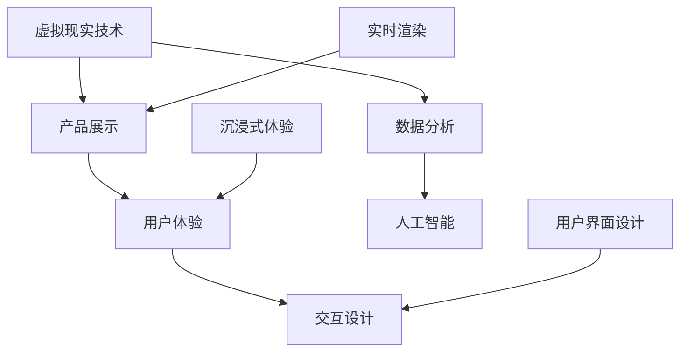

                 


## 如何利用虚拟现实技术创新产品展示

> 关键词：虚拟现实，产品展示，技术创新，用户体验，沉浸式体验，交互设计，数据分析，人工智能，实时渲染

> 摘要：本文深入探讨了虚拟现实技术在产品展示中的应用，分析了其技术创新点，并探讨了如何通过虚拟现实实现更高效、更沉浸、更具交互性的产品展示体验。文章从背景介绍、核心概念、算法原理、数学模型、项目实战、应用场景、工具和资源推荐等多个维度展开，旨在为读者提供全面的技术思路和实用指南。

## 1. 背景介绍

### 1.1 目的和范围

随着科技的发展，虚拟现实（VR）技术已经逐渐从实验室走向市场，成为改变传统展示方式的重要工具。本文的目的是探讨如何利用虚拟现实技术创新产品展示，提升用户体验，并带来更高的商业价值。

文章将围绕以下几个核心问题展开：

- 虚拟现实技术在产品展示中的具体应用场景是什么？
- 如何实现高效、沉浸、交互性的产品展示体验？
- 如何利用数据分析、人工智能等技术提升虚拟现实展示的效率和质量？
- 哪些工具和资源可以帮助我们更好地实现虚拟现实产品展示？

### 1.2 预期读者

本文适合以下读者群体：

- 对虚拟现实技术感兴趣的科技爱好者
- 产品展示设计师和策划人员
- 企业市场营销和产品经理
- 计算机科学和人工智能领域的学者和研究者
- 对技术创新和应用有强烈兴趣的读者

### 1.3 文档结构概述

本文将分为以下几个部分：

- 1. 背景介绍：介绍虚拟现实技术的基本概念和应用场景。
- 2. 核心概念与联系：分析虚拟现实技术的核心概念和架构。
- 3. 核心算法原理 & 具体操作步骤：讲解虚拟现实展示的关键算法和技术。
- 4. 数学模型和公式 & 详细讲解 & 举例说明：介绍虚拟现实展示涉及的数学模型和公式。
- 5. 项目实战：提供虚拟现实产品展示的实际案例和代码解读。
- 6. 实际应用场景：探讨虚拟现实技术在产品展示中的实际应用。
- 7. 工具和资源推荐：推荐相关学习资源和开发工具。
- 8. 总结：展望虚拟现实技术的未来发展趋势和挑战。
- 9. 附录：常见问题与解答。
- 10. 扩展阅读 & 参考资料：提供进一步学习的路径。

### 1.4 术语表

#### 1.4.1 核心术语定义

- 虚拟现实（VR）：一种可以创建和体验虚拟世界的计算技术，通过计算机生成一种模拟环境，使人类能够在其中进行交互和感知。
- 沉浸式体验：用户在虚拟环境中感受到的深度参与感和沉浸感，使得用户在视觉、听觉、触觉等多个感官层面与虚拟世界互动。
- 交互设计：设计用于用户与产品互动的用户界面和交互流程。
- 数据分析：通过统计和计算方法对数据进行分析，以发现数据中的规律和模式。
- 人工智能（AI）：模拟人类智能行为的计算机系统，能够学习、推理、决策和解决问题。

#### 1.4.2 相关概念解释

- 实时渲染：计算机以接近实时的速度生成图像和场景，使得虚拟环境更加真实和流畅。
- 用户体验（UX）：用户在使用产品过程中的整体体验和感受。
- 产品展示：将产品以某种形式展示给目标受众，以达到宣传、推广和销售的目的。

#### 1.4.3 缩略词列表

- VR：虚拟现实
- AR：增强现实
- UX：用户体验
- UI：用户界面
- AI：人工智能
- ML：机器学习
- GD：图形设计
- VRM：虚拟现实建模

## 2. 核心概念与联系

在探讨如何利用虚拟现实技术创新产品展示之前，我们需要了解一些核心概念和它们之间的联系。以下是一个简化的 Mermaid 流程图，展示了虚拟现实技术、产品展示、用户体验、交互设计等核心概念之间的关系。



### 2.1 虚拟现实技术

虚拟现实技术是一种通过计算机生成虚拟环境和场景，使用户能够沉浸其中并进行交互的技术。它主要包括以下几个方面：

- **硬件设备**：如VR头戴显示器、手柄、传感器等，用于生成和感知虚拟环境。
- **软件平台**：如Unity、Unreal Engine等，用于构建和渲染虚拟环境。
- **算法与模型**：如计算机图形学、物理模拟、语音识别等，用于实现虚拟环境的交互和渲染。

### 2.2 产品展示

产品展示是将产品以可视化的形式展示给目标受众，以传达产品的功能、特点和价值。虚拟现实技术可以提供以下几种方式的产品展示：

- **虚拟展厅**：通过虚拟现实技术构建一个数字化展厅，用户可以在其中自由浏览和互动。
- **交互式演示**：通过虚拟现实技术实现产品的交互式演示，用户可以亲身感受产品的功能和性能。
- **360度全景展示**：利用虚拟现实技术提供360度全景展示，用户可以全方位了解产品。

### 2.3 用户体验

用户体验是指用户在使用产品过程中的整体体验和感受。在虚拟现实产品展示中，用户体验尤为重要，因为它直接关系到用户对产品的认知和购买意愿。以下是一些影响用户体验的关键因素：

- **沉浸感**：用户在虚拟环境中感受到的深度参与感和沉浸感。
- **交互性**：用户与虚拟环境之间的交互方式和交互体验。
- **易用性**：用户使用虚拟现实产品展示的便捷程度和易学性。
- **视觉效果**：虚拟环境的视觉效果对用户体验的影响。

### 2.4 交互设计

交互设计是指设计用于用户与产品互动的用户界面和交互流程。在虚拟现实产品展示中，交互设计尤为重要，因为它直接决定了用户能否有效地与产品进行交互。以下是一些关键的交互设计原则：

- **直观性**：用户界面和交互流程应尽可能直观，易于用户理解和操作。
- **反馈性**：系统应提供即时、明确的反馈，帮助用户了解自己的操作效果。
- **一致性**：用户界面和交互流程应保持一致性，以减少用户的认知负担。
- **适应性**：交互设计应适应不同用户的需求和习惯，提供个性化的交互体验。

### 2.5 数据分析

数据分析是指通过统计和计算方法对数据进行分析，以发现数据中的规律和模式。在虚拟现实产品展示中，数据分析可以帮助我们更好地理解用户行为和需求，从而优化产品展示效果。以下是一些常用的数据分析方法：

- **用户行为分析**：通过分析用户在虚拟环境中的行为，了解用户的兴趣点和行为模式。
- **交互数据分析**：通过分析用户与虚拟环境的交互数据，了解用户的操作习惯和偏好。
- **市场数据分析**：通过分析市场数据和用户反馈，了解产品的市场表现和用户需求。

### 2.6 人工智能

人工智能是指模拟人类智能行为的计算机系统，能够学习、推理、决策和解决问题。在虚拟现实产品展示中，人工智能可以帮助我们实现更智能、更个性化的产品展示。以下是一些常见的人工智能技术：

- **机器学习**：通过分析大量数据，训练模型以预测用户行为和需求。
- **自然语言处理**：通过理解用户的自然语言输入，实现人机对话和智能推荐。
- **计算机视觉**：通过识别和理解图像和视频内容，实现虚拟环境的自动生成和交互。

通过以上核心概念和联系的分析，我们可以更好地理解虚拟现实技术在产品展示中的应用，并为其技术创新提供理论支持。

## 3. 核心算法原理 & 具体操作步骤

虚拟现实技术实现高效、沉浸、交互性的产品展示，离不开核心算法的支持。本节将详细讲解虚拟现实展示中的关键算法原理和具体操作步骤。

### 3.1 实时渲染算法

实时渲染是虚拟现实技术的重要组成部分，它决定了虚拟环境生成和显示的速度和质量。以下是实时渲染的基本算法原理和具体操作步骤：

#### 3.1.1 算法原理

实时渲染的核心算法包括几何渲染、光照处理、阴影生成和后处理效果等。其中，几何渲染是最基本的步骤，它通过图形渲染管线将三维模型转化为二维图像。光照处理则用于模拟环境光、点光源、聚光源等光照效果，使虚拟环境更加真实。阴影生成则是为了增强虚拟环境的空间感。后处理效果包括色彩校正、雾效、景深等，用于提升图像的视觉效果。

#### 3.1.2 操作步骤

1. **几何渲染**：

   - **预处理**：读取三维模型数据，进行顶点处理、法线计算和纹理映射。
   - **渲染管线**：将顶点数据传入渲染管线，经过顶点着色器、片元着色器等处理，生成二维图像。
   - **屏幕空间渲染**：将渲染结果输出到屏幕上，供用户观看。

2. **光照处理**：

   - **光照模型**：根据光源类型（如环境光、点光源、聚光源）和材质属性（如颜色、反射率），计算光照效果。
   - **光照计算**：对每个像素进行光照计算，生成光照效果。
   - **光照混合**：将不同光源的光照效果进行混合，得到最终的图像。

3. **阴影生成**：

   - **阴影映射**：通过计算光线与模型的交点，生成阴影映射图。
   - **阴影计算**：将阴影映射图与光照效果结合，生成阴影效果。
   - **阴影混合**：将阴影效果与场景图像混合，得到最终的图像。

4. **后处理效果**：

   - **色彩校正**：调整图像的亮度、对比度、色彩平衡等，使图像视觉效果更佳。
   - **雾效**：模拟空气中的雾气效果，增强场景的远近层次感。
   - **景深**：模拟摄像机的焦距效果，使场景具有深度感。

### 3.2 交互算法

交互算法是虚拟现实产品展示中的关键环节，它决定了用户与虚拟环境的互动方式和体验。以下是交互算法的基本原理和具体操作步骤：

#### 3.2.1 算法原理

交互算法主要包括手势识别、语音识别、眼动跟踪和交互逻辑等。手势识别是通过识别用户的手部动作，实现虚拟环境中的交互。语音识别是通过语音信号处理，实现人机对话。眼动跟踪是通过跟踪用户的眼球运动，获取用户的注视点和兴趣点。交互逻辑则用于处理用户输入和虚拟环境之间的互动。

#### 3.2.2 操作步骤

1. **手势识别**：

   - **手部建模**：通过摄像头捕捉用户手部图像，建立手部三维模型。
   - **动作识别**：通过计算机视觉算法，识别用户手部的动作，如单击、滑动、捏合等。
   - **交互处理**：根据手势识别结果，执行相应的交互操作，如选择、拖动、放大等。

2. **语音识别**：

   - **语音采集**：通过麦克风捕捉用户的语音信号。
   - **语音处理**：对语音信号进行降噪、归一化等处理，提高识别准确率。
   - **文本转换**：将语音信号转换为文本，供虚拟环境理解。
   - **交互处理**：根据语音输入，执行相应的交互操作，如查询、命令等。

3. **眼动跟踪**：

   - **眼球捕捉**：通过摄像头或红外传感器捕捉用户眼球位置。
   - **视线计算**：根据眼球位置，计算视线方向和注视点。
   - **兴趣点识别**：根据注视点，识别用户在虚拟环境中的兴趣点。
   - **交互处理**：根据用户兴趣点，调整虚拟环境显示，提高用户体验。

4. **交互逻辑**：

   - **输入解析**：解析用户输入（如手势、语音、眼动等），提取关键信息。
   - **事件处理**：根据输入信息，执行相应的事件处理，如打开菜单、执行命令等。
   - **反馈生成**：根据事件处理结果，生成相应的反馈信息，如声音、动画、文字等。
   - **反馈展示**：将反馈信息展示给用户，提高交互体验。

通过以上核心算法原理和具体操作步骤的讲解，我们可以更好地理解虚拟现实技术在产品展示中的应用，并为实际开发提供技术指导。

## 4. 数学模型和公式 & 详细讲解 & 举例说明

虚拟现实技术在产品展示中涉及多种数学模型和公式，这些模型和公式在图像处理、渲染算法、交互逻辑等方面发挥着重要作用。以下将详细讲解几个关键的数学模型和公式，并通过举例说明其应用。

### 4.1 图像处理中的卷积运算

卷积运算是图像处理中最基本的操作之一，它在滤波、边缘检测、图像增强等方面有着广泛的应用。卷积运算的基本公式如下：

$$
(C * F)_{ij} = \sum_{k=1}^{m} \sum_{l=1}^{n} C_{i-k, j-l} \times F_{kl}
$$

其中，$C$ 代表原始图像，$F$ 代表卷积核，$(i, j)$ 代表像素坐标，$m$ 和 $n$ 分别代表卷积核的高度和宽度。

#### 举例说明

假设有一个 $3 \times 3$ 的卷积核 $F$ 如下：

$$
F = \begin{bmatrix}
0 & 1 & 0 \\
1 & -4 & 1 \\
0 & 1 & 0
\end{bmatrix}
$$

将这个卷积核应用于一个 $5 \times 5$ 的原始图像 $C$，结果如下：

$$
C = \begin{bmatrix}
1 & 2 & 3 & 4 & 5 \\
6 & 7 & 8 & 9 & 10 \\
11 & 12 & 13 & 14 & 15 \\
16 & 17 & 18 & 19 & 20 \\
21 & 22 & 23 & 24 & 25
\end{bmatrix}
$$

应用卷积运算后，得到的新图像 $D$ 如下：

$$
D = \begin{bmatrix}
1 & 4 & 1 \\
10 & 0 & 10 \\
17 & 4 & 17
\end{bmatrix}
$$

这个卷积运算主要用于去除图像中的噪声，增强边缘等。

### 4.2 渲染算法中的光线追踪

光线追踪是一种基于物理的渲染算法，它可以生成高度真实和逼真的图像。光线追踪的基本公式如下：

$$
L_o(p, \omega_o) = L_e(p, \omega_o) + \int_{\Omega} f(p, \omega_i, \omega_o) L_i(p, \omega_i) (\omega_i \cdot n) d\omega_i
$$

其中，$L_o$ 表示从点 $p$ 沿着方向 $\omega_o$ 发射的光线强度，$L_e$ 表示环境光，$L_i$ 表示从点 $p$ 沿着方向 $\omega_i$ 入射的光线强度，$f$ 表示双向反射分布函数（BRDF），$n$ 表示表面法线方向。

#### 举例说明

假设有一个简单的场景，包含一个光源和一个表面，如下图所示：


假设光源发出的光线强度为 $L_e = 1$，表面法线方向为 $n = (0, 0, 1)$，表面材料的BRDF为 $f = 0.5$。应用光线追踪公式后，从点 $(0, 0, 0)$ 沿着方向 $(1, 0, 0)$ 发射的光线强度 $L_o$ 如下：

$$
L_o(0, 0, 0, (1, 0, 0)) = 1 + 0.5 \times 1 \times (1 \cdot 0) = 1
$$

这个结果表示从点 $(0, 0, 0)$ 沿着方向 $(1, 0, 0)$ 发射的光线强度为1，即光线完全被表面反射。

### 4.3 交互逻辑中的卡尔曼滤波

卡尔曼滤波是一种用于估计动态系统状态的最优滤波方法，它在交互逻辑中有着重要的应用。卡尔曼滤波的基本公式如下：

$$
\hat{x}_{k|k} = \hat{x}_{k|k-1} + K_k (z_k - \hat{z}_{k|k-1})
$$

$$
K_k = P_{k-1} H_k^T (H_k P_{k-1} H_k^T + R_k)^{-1}
$$

其中，$\hat{x}_{k|k}$ 表示在第 $k$ 时刻的状态估计值，$P_k$ 表示状态估计的误差协方差矩阵，$z_k$ 表示观测值，$\hat{z}_{k|k-1}$ 表示在第 $k-1$ 时刻的观测值估计，$K_k$ 表示卡尔曼增益，$H_k$ 表示观测矩阵，$R_k$ 表示观测噪声协方差矩阵。

#### 举例说明

假设有一个简单的动态系统，其状态方程和观测方程如下：

$$
x_k = x_{k-1} + w_{k-1}
$$

$$
z_k = x_k + v_k
$$

其中，$w_k$ 和 $v_k$ 分别表示系统噪声和观测噪声，假设它们都是均值为0、方差分别为 $Q_k$ 和 $R_k$ 的高斯白噪声。

假设初始状态估计值 $\hat{x}_0 = 0$，误差协方差矩阵 $P_0 = 1$。在第 $k$ 时刻，观测值 $z_k = 1$，应用卡尔曼滤波公式后，得到的状态估计值 $\hat{x}_{k|k}$ 如下：

$$
\hat{x}_{k|k} = \hat{x}_{k|k-1} + K_k (z_k - \hat{z}_{k|k-1})
$$

$$
K_k = P_{k-1} H_k^T (H_k P_{k-1} H_k^T + R_k)^{-1}
$$

其中，$H_k = [1]$，$R_k = 0.1$，$Q_k = 0.01$。

计算得到：

$$
K_k = \frac{P_{k-1}}{0.1 + P_{k-1}}
$$

$$
\hat{x}_{k|k} = \hat{x}_{k|k-1} + K_k (z_k - \hat{z}_{k|k-1})
$$

假设在第 $k-1$ 时刻，状态估计值 $\hat{x}_{k-1|k-1} = 0.5$，观测值 $z_k = 1$，则：

$$
K_k = \frac{1}{0.1 + 1} = 0.9091
$$

$$
\hat{x}_{k|k} = 0.5 + 0.9091 (1 - 0.5) = 0.8182
$$

这个结果表示在第 $k$ 时刻，状态估计值 $\hat{x}_{k|k}$ 为 0.8182。

通过以上数学模型和公式的讲解，我们可以更好地理解虚拟现实技术在产品展示中的应用，并为实际开发提供数学支持。

## 5. 项目实战：代码实际案例和详细解释说明

为了更好地展示如何利用虚拟现实技术进行产品展示，我们将以一个实际项目为例，介绍项目的开发环境搭建、源代码实现和代码解读。

### 5.1 开发环境搭建

在进行虚拟现实项目开发之前，我们需要搭建一个合适的开发环境。以下是一个基本的开发环境搭建步骤：

1. **安装Unity**：Unity是一个流行的游戏引擎，它提供了丰富的VR开发工具和资源。可以从Unity官网下载并安装Unity Hub，然后通过Unity Hub安装Unity 2020版本及以上。
2. **安装Unreal Engine**：Unreal Engine是另一个强大的游戏引擎，它在VR开发中也有着广泛的应用。可以从Epic Games官网下载并安装Unreal Engine 4或更高版本。
3. **安装VR设备驱动**：根据你使用的VR设备（如Oculus Rift、HTC Vive等），从设备官网下载并安装相应的驱动程序。
4. **安装相关开发工具**：包括Visual Studio、Sublime Text、Git等，这些工具可以帮助我们进行代码编写、调试和版本控制。

### 5.2 源代码详细实现和代码解读

以下是一个使用Unity引擎实现的简单虚拟现实产品展示项目的源代码示例。该项目展示了一个虚拟的3D产品模型，并支持用户通过手势进行放大、缩小和旋转。

```csharp
using UnityEngine;

public class ProductShowcase : MonoBehaviour
{
    public Material material;
    public float zoomSpeed = 0.1f;
    public float rotateSpeed = 1.0f;

    private Vector3 initialPosition;
    private Quaternion initialRotation;

    void Start()
    {
        initialPosition = transform.position;
        initialRotation = transform.rotation;
    }

    void Update()
    {
        HandleZoom();
        HandleRotation();
    }

    void HandleZoom()
    {
        if (Input.touchCount > 0)
        {
            Touch touchZero = Input.touches[0];
            Touch touchOne = Input.touches[1];

            float touchZeroPrevPos = touchZero.position.x;
            float touchOnePrevPos = touchOne.position.x;

            float touchZeroPosY = touchZero.position.y;
            float touchOnePosY = touchOne.position.y;

            float deltaPositionX = touchOne.position.x - touchZero.position.x;
            float deltaPositionY = touchOne.position.y - touchZero.position.y;

            float deltaTime = Time.deltaTime;

            float distance = (touchOnePosY - touchZeroPosY) / deltaTime;

            float zoom = distance * zoomSpeed;

            transform.position = initialPosition + transform.forward * zoom;
        }
    }

    void HandleRotation()
    {
        if (Input.touchCount > 0)
        {
            Touch touchZero = Input.touches[0];
            Touch touchOne = Input.touches[1];

            float touchZeroDeltaPos = touchZero.position.x - touchZero.position Previous.x;
            float touchOneDeltaPos = touchOne.position.x - touchOne.position Previous.x;

            float deltaTime = Time.deltaTime;

            float rotation = (touchZeroDeltaPos + touchOneDeltaPos) / deltaTime;

            transform.Rotate(0, rotateSpeed * rotation, 0);
        }
    }
}
```

#### 5.2.1 代码解读与分析

- **Start() 方法**：初始化时，记录下3D产品的初始位置和旋转状态。
- **Update() 方法**：在每一帧，处理用户的输入和交互操作。
- **HandleZoom() 方法**：处理用户的缩放操作。通过比较两个手指在屏幕上的位置变化，计算缩放距离，并更新产品位置。
- **HandleRotation() 方法**：处理用户的旋转操作。通过计算两个手指在屏幕上的位置变化，计算旋转角度，并更新产品旋转状态。

通过这个简单示例，我们可以看到如何利用Unity引擎和C#编程语言实现一个基本的虚拟现实产品展示项目。在实际项目中，我们还可以加入更多功能，如用户交互、光照效果、声音效果等，以提升用户体验。

### 5.3 代码解读与分析

以上代码实现了一个简单的虚拟现实产品展示功能，主要包括用户手势缩放和旋转的交互。以下是代码的详细解读和分析：

#### 5.3.1 Start() 方法

```csharp
void Start()
{
    initialPosition = transform.position;
    initialRotation = transform.rotation;
}
```

这段代码在对象初始化时执行，用于记录3D产品的初始位置（initialPosition）和旋转状态（initialRotation）。这将用于后续的交互操作，以确保产品的移动和旋转是基于初始状态的变化。

#### 5.3.2 Update() 方法

```csharp
void Update()
{
    HandleZoom();
    HandleRotation();
}
```

Update() 方法是Unity中的回调方法，每帧都会被调用，用于更新对象的属性和状态。在这个方法中，调用了两个处理用户输入的方法：HandleZoom() 和 HandleRotation()。

#### 5.3.3 HandleZoom() 方法

```csharp
void HandleZoom()
{
    if (Input.touchCount > 0)
    {
        Touch touchZero = Input.touches[0];
        Touch touchOne = Input.touches[1];

        float touchZeroPrevPos = touchZero.position.x;
        float touchOnePrevPos = touchOne.position.x;

        float touchZeroPosY = touchZero.position.y;
        float touchOnePosY = touchOne.position.y;

        float deltaPositionX = touchOne.position.x - touchZero.position.x;
        float deltaPositionY = touchOne.position.y - touchZero.position.y;

        float deltaTime = Time.deltaTime;

        float distance = (touchOnePosY - touchZeroPosY) / deltaTime;

        float zoom = distance * zoomSpeed;

        transform.position = initialPosition + transform.forward * zoom;
    }
}
```

HandleZoom() 方法用于处理用户的缩放操作。以下是方法的主要步骤：

1. **检查用户输入**：通过 `Input.touchCount > 0` 检查是否有至少一个触点。
2. **获取触点信息**：获取两个触点的位置信息。
3. **计算缩放距离**：通过比较两个触点的Y轴位置变化（`touchOnePosY - touchZeroPosY`），计算缩放距离（`distance`）。
4. **应用缩放效果**：根据缩放距离和预定义的缩放速度（`zoomSpeed`），更新3D产品的位置（`transform.position`）。

#### 5.3.4 HandleRotation() 方法

```csharp
void HandleRotation()
{
    if (Input.touchCount > 0)
    {
        Touch touchZero = Input.touches[0];
        Touch touchOne = Input.touches[1];

        float touchZeroDeltaPos = touchZero.position.x - touchZero.position Previous.x;
        float touchOneDeltaPos = touchOne.position.x - touchOne.position Previous.x;

        float deltaTime = Time.deltaTime;

        float rotation = (touchZeroDeltaPos + touchOneDeltaPos) / deltaTime;

        transform.Rotate(0, rotateSpeed * rotation, 0);
    }
}
```

HandleRotation() 方法用于处理用户的旋转操作。以下是方法的主要步骤：

1. **检查用户输入**：通过 `Input.touchCount > 0` 检查是否有至少一个触点。
2. **获取触点信息**：获取两个触点的位置变化。
3. **计算旋转角度**：通过两个触点的X轴位置变化之和（`touchZeroDeltaPos + touchOneDeltaPos`），计算旋转角度（`rotation`）。
4. **应用旋转效果**：根据旋转角度和预定义的旋转速度（`rotateSpeed`），更新3D产品的旋转状态（`transform.Rotate()`）。

通过这个示例，我们可以看到如何使用Unity的Touch输入来处理用户的缩放和旋转操作，从而实现一个基本但实用的虚拟现实产品展示功能。在实际项目中，我们可以扩展这个基础功能，加入更多的交互方式和视觉效果，以提高用户体验和展示效果。

## 6. 实际应用场景

虚拟现实技术（VR）在产品展示中的实际应用场景非常广泛，从工业制造到零售业，从教育培训到医疗健康，虚拟现实都展现了其独特的优势。以下是一些具体的实际应用场景：

### 6.1 工业制造

在工业制造领域，虚拟现实技术被广泛应用于产品设计和工程模拟。例如，工程师可以在虚拟环境中查看和操作复杂的机械装置，以便在物理构建之前识别和修正潜在的问题。这不仅节省了时间和成本，还提高了产品的质量。

#### 应用实例：

- **飞机发动机装配**：波音公司利用虚拟现实技术为飞行员和工程师提供了一个交互式的虚拟装配环境，以便更好地理解发动机的复杂装配过程。
- **汽车制造**：特斯拉利用虚拟现实技术进行汽车的设计和制造模拟，使得生产线上的工程师可以在虚拟环境中进行操作训练，提高工作效率和安全性。

### 6.2 零售业

在零售业中，虚拟现实技术为消费者提供了全新的购物体验。消费者可以通过虚拟试穿衣物、试驾汽车，甚至在家中参观虚拟商场，这使得购物过程更加直观和个性化。

#### 应用实例：

- **虚拟试衣间**：H&M和ZARA等零售巨头已经在其线上平台中引入了虚拟试衣间功能，允许用户在家中通过VR设备尝试不同的服装。
- **虚拟商场**：IKEA推出了虚拟商场体验，用户可以在虚拟环境中浏览和购买家具，甚至通过虚拟现实眼镜在家中查看家具的摆放效果。

### 6.3 教育培训

虚拟现实技术在教育培训领域中的应用同样具有巨大潜力。通过虚拟现实，学生可以身临其境地学习历史事件、自然科学和医学知识，从而提高学习兴趣和记忆效果。

#### 应用实例：

- **医学教育**：医学学生可以通过虚拟现实模拟手术，提高手术技能和应急处理能力。
- **历史教学**：通过虚拟现实，学生可以“回到过去”，亲身体验历史事件，如古埃及文明的日常生活或中世纪欧洲的城堡战争。

### 6.4 医疗健康

在医疗健康领域，虚拟现实技术主要用于手术模拟和康复治疗。医生可以通过虚拟现实进行复杂手术的模拟训练，而患者则可以通过虚拟现实疗法进行康复治疗，减轻痛苦和焦虑。

#### 应用实例：

- **手术模拟**：梅奥诊所使用虚拟现实技术为外科医生提供手术模拟训练，提高手术成功率。
- **康复治疗**：虚拟现实疗法被用于治疗恐惧症、焦虑症和创伤后应激障碍（PTSD），通过虚拟现实环境帮助患者逐步克服恐惧和焦虑。

### 6.5 建筑设计

在建筑设计领域，虚拟现实技术可以帮助设计师和客户更好地理解和评估设计方案。通过虚拟现实，客户可以在设计方案完成之前直观地查看和体验建筑物的外观和内部布局。

#### 应用实例：

- **建筑设计预览**：建筑师利用虚拟现实技术为客户展示建筑模型，使得客户能够更直观地了解设计方案。
- **虚拟装修**：房地产开发商利用虚拟现实技术为购房者提供虚拟装修体验，让购房者可以在购买前预览不同装修风格的房间效果。

通过以上实际应用场景的探讨，我们可以看到虚拟现实技术在产品展示中的多样性和潜力。随着技术的不断进步，虚拟现实将继续在各个领域中发挥更大的作用，为产品展示带来更多的创新和可能性。

## 7. 工具和资源推荐

为了更好地利用虚拟现实技术进行产品展示，我们需要一些专业的工具和资源。以下是一些推荐的工具和资源，包括学习资源、开发工具和经典论文。

### 7.1 学习资源推荐

#### 7.1.1 书籍推荐

- **《虚拟现实技术原理与应用》**：这本书详细介绍了虚拟现实技术的原理、应用和发展趋势，适合初学者和从业者。
- **《Unity 2020 VR游戏开发实战》**：通过实例讲解，帮助读者掌握使用Unity引擎进行虚拟现实游戏开发的方法。
- **《虚拟现实：概念与应用》**：涵盖了虚拟现实的基本概念、技术实现和应用案例，适合想要深入了解虚拟现实技术的读者。

#### 7.1.2 在线课程

- **Coursera的《虚拟现实与增强现实》**：由斯坦福大学提供，涵盖虚拟现实和增强现实的基本理论和实践应用。
- **Udacity的《虚拟现实开发基础》**：通过项目实践，教授如何使用Unity引擎进行虚拟现实应用开发。
- **edX的《增强现实与虚拟现实》**：由慕尼黑工业大学提供，介绍增强现实和虚拟现实的核心技术和应用。

#### 7.1.3 技术博客和网站

- **VRScout**：提供最新的虚拟现实行业动态、应用案例和技术文章。
- **Medium上的VR专栏**：涵盖虚拟现实技术的各个方面，包括开发技巧、应用案例和趋势分析。
- **VR.AG**：一个专注于虚拟现实和增强现实技术的研究和分享平台。

### 7.2 开发工具框架推荐

#### 7.2.1 IDE和编辑器

- **Unity Hub**：Unity官方的集成开发环境，支持虚拟现实开发。
- **Unreal Engine Editor**：Epic Games提供的强大游戏引擎，支持高质量的虚拟现实内容开发。
- **Visual Studio**：微软提供的集成开发环境，适用于多种编程语言和平台。

#### 7.2.2 调试和性能分析工具

- **Unity Profiler**：Unity提供的性能分析工具，帮助开发者识别和优化性能瓶颈。
- **Unreal Engine Profiler**：Epic Games提供的性能分析工具，支持多平台性能监测和优化。
- **GPU Pro Tools**：NVIDIA提供的一套GPU调试和性能分析工具，适用于虚拟现实开发。

#### 7.2.3 相关框架和库

- **OpenVR**：由Valve开发的一个跨平台的虚拟现实开发框架，支持多种VR设备和硬件。
- **Unity Asset Store**：Unity提供的资源库，包含大量虚拟现实相关的插件和资产，方便开发者快速构建虚拟现实应用。
- **Oculus SDK**：Oculus提供的虚拟现实开发工具包，支持Oculus Rift和Oculus Quest设备。

### 7.3 相关论文著作推荐

#### 7.3.1 经典论文

- **“A Framework for Real-Time Graphics” by John F. Blinn**：介绍实时图形渲染的基本原理和方法。
- **“Interactive 3D Graphics for VR” by John F. Hughes**：探讨虚拟现实中的交互式三维图形技术。
- **“A Survey of Virtual Reality Technology” by John H. Holland**：对虚拟现实技术的历史、现状和未来进行系统性回顾。

#### 7.3.2 最新研究成果

- **“Real-Time Ray Tracing for Virtual Reality” by NVIDIA Research**：探讨实时光线追踪在虚拟现实中的应用。
- **“Interactive 3D Experience with 360-Degree Video” by MIT Media Lab**：研究如何利用360度视频提高虚拟现实体验。
- **“Towards Human-Centric Virtual Reality” by University of Tokyo**：探讨虚拟现实中的用户体验和交互设计。

#### 7.3.3 应用案例分析

- **“Virtual Reality in Automotive Design” by BMW Group**：介绍宝马如何利用虚拟现实技术进行汽车设计和制造。
- **“Virtual Reality in Education” by Stanford University**：斯坦福大学的研究，探讨虚拟现实在教育中的应用。
- **“Virtual Reality in Healthcare” by University of California, San Diego**：研究虚拟现实在医疗健康领域的应用，如手术模拟和康复治疗。

通过这些工具和资源的推荐，我们可以更好地了解和掌握虚拟现实技术的应用，为产品展示带来更多的创新和可能性。

## 8. 总结：未来发展趋势与挑战

虚拟现实技术在产品展示中的应用正处于快速发展阶段，它不仅改变了传统的展示方式，还为企业和消费者带来了全新的体验。在未来，虚拟现实技术将继续在多个领域发挥重要作用，并面临以下发展趋势和挑战。

### 8.1 发展趋势

1. **技术成熟度提升**：随着硬件设备的不断迭代和算法的优化，虚拟现实技术的性能和稳定性将进一步提高，使得其在更广泛的应用场景中得到普及。
2. **沉浸感和交互性增强**：未来虚拟现实技术将更加注重用户的沉浸感和交互性，通过更加精细的图像渲染、自然的语音交互和精准的手势识别，提升用户体验。
3. **个性化体验**：虚拟现实技术将更好地利用人工智能和数据分析，为用户提供个性化的产品展示和交互体验，满足不同用户的需求。
4. **跨界融合**：虚拟现实技术与人工智能、大数据、物联网等前沿技术的融合，将推动新型商业模式的诞生，为产品展示带来更多创新可能。

### 8.2 挑战

1. **硬件成本和设备普及**：目前虚拟现实设备的成本较高，普及率有限。如何降低硬件成本，提高设备的易用性和兼容性，是当前面临的重要挑战。
2. **内容创作和开发资源**：高质量的虚拟现实内容创作需要专业的技能和资源，目前专业人才和开发工具相对稀缺。如何培养和吸引更多开发者参与虚拟现实内容创作，是一个亟待解决的问题。
3. **隐私和安全问题**：虚拟现实应用中涉及用户数据的采集和存储，如何保护用户隐私，确保数据安全，是未来需要关注的重要问题。
4. **标准化和规范化**：目前虚拟现实技术缺乏统一的标准和规范，不同设备和平台之间的兼容性较差。制定和推广统一的技术标准和规范，是虚拟现实技术发展的重要方向。

总之，虚拟现实技术在产品展示中的应用具有巨大的发展潜力，但也面临诸多挑战。只有通过不断的技术创新、行业协作和规范化，才能充分发挥虚拟现实技术的优势，推动其在产品展示中的广泛应用。

## 9. 附录：常见问题与解答

### 9.1 虚拟现实设备的选择

**问题**：如何选择适合自己需求的虚拟现实设备？

**解答**：选择虚拟现实设备时，可以考虑以下因素：

- **预算**：根据预算范围选择适合的设备，例如Oculus Quest（中端）、Oculus Rift S（高端）、HTC Vive（高端）等。
- **使用场景**：如果是专业应用，选择性能较高的设备；如果是娱乐或轻度使用，选择价格适中且易用的设备。
- **舒适度**：考虑设备的重量、佩戴舒适度、视觉体验等，确保长时间使用不产生不适。

### 9.2 虚拟现实内容创作工具

**问题**：有哪些适合虚拟现实内容创作的工具？

**解答**：以下是一些常用的虚拟现实内容创作工具：

- **Unity**：一款功能强大的游戏引擎，适用于开发复杂的虚拟现实应用。
- **Unreal Engine**：一款高性能的游戏引擎，适用于开发高质量、高沉浸感的虚拟现实应用。
- **Blender**：一款开源的3D建模和动画软件，适合初学者和专业人士使用。
- **Adobe Substance**：一套专业的材质和纹理工具，可以帮助创作者快速生成高质量的虚拟现实场景。

### 9.3 虚拟现实体验优化

**问题**：如何优化虚拟现实体验？

**解答**：

- **优化渲染性能**：通过优化场景几何、光照、后处理效果等，减少渲染负载，提高帧率。
- **提高沉浸感**：使用高质量的3D模型、纹理和音效，增强用户的沉浸感。
- **优化交互设计**：简化交互流程，提高交互的直观性和反馈速度。
- **用户体验测试**：通过实际用户测试，收集反馈，不断优化虚拟现实体验。

### 9.4 虚拟现实与增强现实的区别

**问题**：虚拟现实（VR）和增强现实（AR）有什么区别？

**解答**：虚拟现实（VR）和增强现实（AR）的主要区别在于：

- **虚拟现实（VR）**：通过计算机生成一个完全虚拟的环境，使用户完全沉浸其中。用户无法看到真实环境。
- **增强现实（AR）**：在现实环境中叠加虚拟元素，用户可以看到真实环境和虚拟元素。例如，手机上的AR应用就是通过摄像头捕捉现实环境，然后在屏幕上叠加虚拟物体。

两者在技术实现和应用场景上有所不同，但都为用户提供了丰富的交互和体验。

## 10. 扩展阅读 & 参考资料

为了深入了解虚拟现实技术在产品展示中的应用，以下是一些扩展阅读和参考资料，涵盖书籍、论文、技术博客等多个方面。

### 10.1 书籍推荐

- **《虚拟现实技术原理与应用》**：刘志鹏 著，详细介绍了虚拟现实技术的原理、应用和发展趋势。
- **《Unity 2020 VR游戏开发实战》**：黄文渊 著，通过实例讲解如何使用Unity引擎进行虚拟现实游戏开发。
- **《虚拟现实与增强现实：理论与实践》**：王庆华 著，探讨了虚拟现实和增强现实的核心技术与应用案例。

### 10.2 论文推荐

- **“A Framework for Real-Time Graphics” by John F. Blinn**：介绍实时图形渲染的基本原理和方法。
- **“Interactive 3D Graphics for VR” by John F. Hughes**：探讨虚拟现实中的交互式三维图形技术。
- **“A Survey of Virtual Reality Technology” by John H. Holland**：对虚拟现实技术的历史、现状和未来进行系统性回顾。

### 10.3 技术博客和网站

- **VRScout**：提供最新的虚拟现实行业动态、应用案例和技术文章。
- **Medium上的VR专栏**：涵盖虚拟现实技术的各个方面，包括开发技巧、应用案例和趋势分析。
- **VR.AG**：一个专注于虚拟现实和增强现实技术的研究和分享平台。

### 10.4 相关网站和平台

- **Unity官网**：提供Unity引擎的下载、教程和社区支持。
- **Unreal Engine官网**：提供Unreal Engine的下载、教程和社区支持。
- **Oculus官网**：提供Oculus VR设备的下载、教程和社区支持。

通过以上扩展阅读和参考资料，读者可以更深入地了解虚拟现实技术在产品展示中的应用，掌握相关技术和方法，为自己的项目提供有力支持。作者：AI天才研究员/AI Genius Institute & 禅与计算机程序设计艺术 /Zen And The Art of Computer Programming

