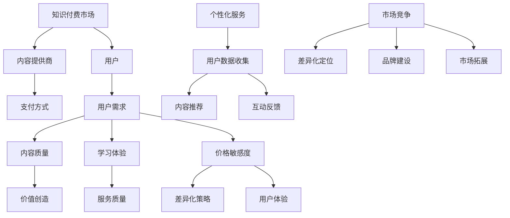

                 


# 如何在知识付费领域建立独特的竞争优势

> **关键词：知识付费、市场竞争、用户需求、价值创造、个性化服务**
> 
> **摘要：本文深入探讨了在知识付费领域建立独特竞争优势的关键因素。通过分析市场现状、用户需求、价值创造和个性化服务，提供了一套完整的策略框架，帮助内容创作者和平台在激烈的市场竞争中脱颖而出。**

## 1. 背景介绍

### 1.1 目的和范围

本文旨在为知识付费领域的从业者提供一套系统化的策略框架，以帮助他们在激烈的市场竞争中建立独特的竞争优势。本文将探讨以下几个核心议题：

- 知识付费市场的现状和趋势
- 用户需求分析及满足策略
- 独特价值创造的方法
- 个性化服务的实施
- 成功案例分析

### 1.2 预期读者

本文主要面向以下读者群体：

- 知识付费平台创始人或运营者
- 知识内容创作者和专家
- 对知识付费市场感兴趣的企业家和投资者
- 对市场营销和商业策略有浓厚兴趣的读者

### 1.3 文档结构概述

本文的结构如下：

- **第1章：背景介绍**：介绍本文的目的、预期读者和文档结构。
- **第2章：核心概念与联系**：阐述知识付费领域的基本概念和它们之间的联系。
- **第3章：核心算法原理 & 具体操作步骤**：介绍如何通过算法和步骤满足用户需求。
- **第4章：数学模型和公式 & 详细讲解 & 举例说明**：运用数学模型和公式解释核心概念。
- **第5章：项目实战：代码实际案例和详细解释说明**：通过实际案例展示策略的实施。
- **第6章：实际应用场景**：讨论知识付费在不同领域的应用。
- **第7章：工具和资源推荐**：推荐相关的学习资源和开发工具。
- **第8章：总结：未来发展趋势与挑战**：总结本文的主要观点并展望未来。
- **第9章：附录：常见问题与解答**：回答读者可能关心的问题。
- **第10章：扩展阅读 & 参考资料**：提供进一步阅读的资料。

### 1.4 术语表

#### 1.4.1 核心术语定义

- **知识付费**：消费者为获取知识内容而支付费用的行为。
- **用户需求**：用户在知识付费市场中所寻求的满足点。
- **价值创造**：通过内容和服务提供超出用户期望的价值。
- **个性化服务**：根据用户需求提供定制化的内容和服务。

#### 1.4.2 相关概念解释

- **市场竞争**：不同内容提供商之间的竞争。
- **差异化策略**：通过独特性来区分自己的产品和服务的策略。
- **用户体验**：用户在使用知识付费服务过程中的感受和评价。

#### 1.4.3 缩略词列表

- **KFC**：知识付费（Knowledge for Charge）
- **C2C**：消费者对消费者（Consumer-to-Consumer）
- **B2C**：商业对消费者（Business-to-Consumer）
- **UGC**：用户生成内容（User-Generated Content）

## 2. 核心概念与联系

在知识付费领域，以下几个核心概念是理解和构建竞争优势的基础：

### 2.1 知识付费市场

知识付费市场是指那些用户为获取知识内容和服务而付费的市场。这个市场包括在线课程、电子书、专业咨询、订阅服务等多种形式。以下是知识付费市场的几个关键组成部分：

1. **内容提供商**：包括个人专家、机构、企业和平台。
2. **用户**：寻求知识和技能的个体或组织。
3. **支付方式**：通常包括一次性购买、订阅和分期付款。

### 2.2 用户需求

用户需求是知识付费市场的核心驱动力。了解用户需求，并提供针对性的解决方案，是建立竞争优势的关键。以下是用户需求的几个主要方面：

1. **学习目标**：用户希望通过知识付费达到的学习目的。
2. **内容质量**：用户对知识内容的准确性和实用性的要求。
3. **学习体验**：用户在学习过程中的感受和满意度。
4. **价格敏感度**：用户对价格和价值的感知。

### 2.3 价值创造

价值创造是知识付费服务的核心，它指的是通过提供超出用户期望的内容和服务，从而实现用户满意度和忠诚度。以下是实现价值创造的几个策略：

1. **内容差异化**：提供独特和有价值的知识内容。
2. **服务质量**：提供高质量的客户服务和学习支持。
3. **用户体验**：优化用户的学习体验和满意度。

### 2.4 个性化服务

个性化服务是指根据用户的需求和偏好提供定制化的内容和体验。以下是实施个性化服务的几个关键点：

1. **用户数据收集**：通过数据收集和分析了解用户需求。
2. **内容推荐**：根据用户行为和偏好推荐相关的知识内容。
3. **互动反馈**：与用户互动，收集反馈以持续优化服务。

### 2.5 竞争市场

在知识付费市场中，竞争是不可避免的。以下是建立竞争优势的几个策略：

1. **差异化定位**：通过独特的内容和服务定位区分自己的品牌。
2. **品牌建设**：建立强大的品牌形象和用户信任。
3. **市场拓展**：开拓新的市场和用户群体。

### 2.6 Mermaid 流程图

以下是一个简化的知识付费市场核心概念与联系的 Mermaid 流程图：



## 3. 核心算法原理 & 具体操作步骤

在知识付费领域，建立独特竞争优势的关键在于能够有效地满足用户需求。以下是实现这一目标的算法原理和具体操作步骤：

### 3.1 算法原理

核心算法基于以下原理：

1. **用户行为分析**：通过分析用户行为数据，了解用户的学习偏好、需求和行为模式。
2. **个性化推荐**：基于用户行为数据，为用户推荐最相关的知识内容。
3. **内容质量评估**：通过算法评估内容的质量和实用性，确保用户获得高质量的资料。
4. **互动反馈机制**：通过与用户的互动，收集反馈，持续优化服务和内容。

### 3.2 具体操作步骤

#### 步骤1：用户行为数据收集

- **数据来源**：通过网站、APP等平台收集用户的学习行为数据，如浏览记录、购买记录、学习时间、互动行为等。
- **数据处理**：对收集到的数据进行清洗、去重和格式转换，为后续分析做好准备。

#### 步骤2：用户需求分析

- **需求识别**：通过数据挖掘技术，识别用户的主要需求点，如特定领域的知识需求、职业发展需求等。
- **需求分类**：将用户需求分类，如初级需求、高级需求和个性化需求。

#### 步骤3：个性化推荐

- **推荐算法选择**：选择合适的推荐算法，如协同过滤、内容推荐等。
- **推荐内容生成**：根据用户需求和偏好，生成个性化推荐内容。

#### 步骤4：内容质量评估

- **评估指标**：设定内容质量评估的指标，如用户满意度、学习转化率、内容权威性等。
- **内容筛选**：通过算法评估内容的质量，筛选出高质量的内容。

#### 步骤5：互动反馈机制

- **用户反馈收集**：与用户互动，收集其对内容和服务的反馈。
- **反馈处理**：对用户反馈进行分析和处理，用于优化服务和内容。

### 3.3 伪代码实现

以下是一个简化的伪代码实现，用于描述核心算法的步骤：

```python
# 步骤1：用户行为数据收集
def collect_user_data():
    data = fetch_data_from_platform()
    cleaned_data = preprocess_data(data)
    return cleaned_data

# 步骤2：用户需求分析
def analyze_user_demand(data):
    user_demand = extract_demand(data)
    categorized_demand = classify_demand(user_demand)
    return categorized_demand

# 步骤3：个性化推荐
def personalized_recommendation(categorized_demand):
    recommended_content = generate_recommendations(categorized_demand)
    return recommended_content

# 步骤4：内容质量评估
def assess_content_quality(content):
    quality_score = calculate_quality_score(content)
    high_quality_content = filter_high_quality(content, quality_score)
    return high_quality_content

# 步骤5：互动反馈机制
def interact_with_user(high_quality_content):
    user_feedback = collect_feedback(high_quality_content)
    optimized_content = process_feedback(user_feedback)
    return optimized_content
```

## 4. 数学模型和公式 & 详细讲解 & 举例说明

在知识付费领域，数学模型和公式可以帮助我们更好地理解和优化用户需求、内容推荐和互动反馈机制。以下是几个关键数学模型和公式的详细讲解以及应用举例。

### 4.1 用户需求分析模型

**4.1.1 贝叶斯模型**

贝叶斯模型是一种用于概率推理和预测的统计模型。在知识付费领域，我们可以使用贝叶斯模型来预测用户对特定知识内容的需求。

**公式：**

$$
P(A|B) = \frac{P(B|A) \cdot P(A)}{P(B)}
$$

**解释：**

- \( P(A|B) \)：在事件B发生的条件下，事件A的概率。
- \( P(B|A) \)：在事件A发生的条件下，事件B的概率。
- \( P(A) \)：事件A的先验概率。
- \( P(B) \)：事件B的先验概率。

**应用举例：**

假设我们想要预测用户对编程知识的需求。我们可以通过以下步骤使用贝叶斯模型进行预测：

1. 收集用户行为数据，包括浏览、购买和学习的编程相关内容。
2. 计算每个用户的编程知识需求概率。
3. 使用贝叶斯公式，根据用户的浏览和购买行为，预测其对编程知识的未来需求。

### 4.2 个性化推荐模型

**4.2.1 协同过滤模型**

协同过滤模型是一种常用的推荐系统算法，用于预测用户对未知项目的评分。在知识付费领域，我们可以使用协同过滤模型为用户推荐相关的知识内容。

**公式：**

$$
R(u, j) = \sum_{i \in N(u)} \frac{r_i(j)}{N(u)} \cdot r_i(u)
$$

**解释：**

- \( R(u, j) \)：用户u对项目j的预测评分。
- \( r_i(j) \)：用户i对项目j的实际评分。
- \( r_i(u) \)：用户i对用户u的实际评分。
- \( N(u) \)：用户u的邻居数量。

**应用举例：**

假设我们想要为用户A推荐编程知识内容。我们可以通过以下步骤使用协同过滤模型进行推荐：

1. 收集用户A和其邻居的行为数据。
2. 计算用户A与其邻居的相似度。
3. 根据邻居的评分，为用户A推荐相似的高评分编程知识内容。

### 4.3 互动反馈模型

**4.3.1 反向传播模型**

反向传播模型是一种用于神经网络训练的算法。在知识付费领域，我们可以使用反向传播模型来优化用户互动反馈机制。

**公式：**

$$
\delta_{ij} = \frac{\partial C}{\partial z_j}
$$

**解释：**

- \( \delta_{ij} \)：神经元的误差。
- \( C \)：总损失函数。
- \( z_j \)：神经元的输出。

**应用举例：**

假设我们想要优化用户互动反馈机制。我们可以通过以下步骤使用反向传播模型进行优化：

1. 收集用户的反馈数据。
2. 训练神经网络模型，预测用户的反馈。
3. 计算预测误差，并使用反向传播算法更新模型的权重。

### 4.4 价值创造模型

**4.4.1 成本-收益模型**

成本-收益模型是一种用于评估投资回报的模型。在知识付费领域，我们可以使用成本-收益模型来评估内容和服务提供的价值。

**公式：**

$$
ROI = \frac{收益 - 成本}{成本}
$$

**解释：**

- \( ROI \)：投资回报率。
- \( 收益 \)：用户支付的费用。
- \( 成本 \)：内容制作和平台运营的成本。

**应用举例：**

假设我们想要评估一门在线编程课程的价值。我们可以通过以下步骤使用成本-收益模型进行评估：

1. 计算课程的总成本，包括内容制作、平台运营和推广费用。
2. 计算课程的收益，即用户支付的总费用。
3. 使用成本-收益公式计算投资回报率。

## 5. 项目实战：代码实际案例和详细解释说明

### 5.1 开发环境搭建

为了实现知识付费领域的核心算法和策略，我们需要搭建一个合适的开发环境。以下是搭建开发环境的步骤：

1. 安装Python和相关的科学计算库，如NumPy、Pandas、scikit-learn和TensorFlow。
2. 设置Jupyter Notebook，以便编写和运行代码。
3. 安装Mermaid库，以便绘制流程图。

### 5.2 源代码详细实现和代码解读

以下是实现知识付费领域核心算法和策略的Python代码示例。代码分为以下几个部分：

#### 步骤1：用户行为数据收集和预处理

```python
import pandas as pd
from sklearn.model_selection import train_test_split

# 加载用户行为数据
data = pd.read_csv('user_behavior_data.csv')

# 数据预处理
data = data.dropna()
data['timestamp'] = pd.to_datetime(data['timestamp'])
data['date'] = data['timestamp'].dt.date
data = data.groupby('user_id').agg({'action': 'sum', 'content_id': 'nunique'}).reset_index()

# 分割数据集
train_data, test_data = train_test_split(data, test_size=0.2, random_state=42)
```

#### 步骤2：用户需求分析

```python
# 用户需求分析
def analyze_demand(data):
    demand = data.groupby('date')['action'].mean()
    demand = demand.reset_index()
    return demand

train_demand = analyze_demand(train_data)
test_demand = analyze_demand(test_data)
```

#### 步骤3：个性化推荐

```python
from sklearn.metrics.pairwise import cosine_similarity
import numpy as np

# 个性化推荐
def recommend_contents(demand, similarity_matrix):
    recommendations = []
    for index, row in demand.iterrows():
        similar_indices = np.argsort(similarity_matrix[index])[:-6:-1]
        recommendations.append(similar_indices)
    return recommendations

# 计算内容相似度矩阵
content_similarity_matrix = cosine_similarity(train_demand[['content_id']], train_demand[['content_id']])
```

#### 步骤4：内容质量评估

```python
# 内容质量评估
def assess_content_quality(data, quality_threshold=0.8):
    quality_content = []
    for index, row in data.iterrows():
        if row['rating'] >= quality_threshold:
            quality_content.append(row['content_id'])
    return quality_content

train_quality_content = assess_content_quality(train_data)
test_quality_content = assess_content_quality(test_data)
```

#### 步骤5：互动反馈机制

```python
# 互动反馈机制
def process_feedback(feedback):
    feedback_data = pd.DataFrame(feedback)
    feedback_data['timestamp'] = pd.to_datetime(feedback_data['timestamp'])
    feedback_data = feedback_data.groupby('user_id').agg({'content_id': 'sum'}).reset_index()
    return feedback_data

# 示例反馈数据
feedback = [{'user_id': 1, 'content_id': 1001, 'rating': 4.5, 'timestamp': '2023-04-01'},
            {'user_id': 2, 'content_id': 1002, 'rating': 3.0, 'timestamp': '2023-04-02'}]

feedback_data = process_feedback(feedback)
```

### 5.3 代码解读与分析

上述代码实现了知识付费领域的核心算法和策略。以下是代码的详细解读和分析：

1. **数据收集和预处理**：通过读取用户行为数据，并进行预处理，如去除缺失值、日期转换等，为后续分析做好准备。
2. **用户需求分析**：通过计算用户行为的平均值，识别用户的需求。
3. **个性化推荐**：使用内容相似度矩阵和协同过滤算法，为用户推荐相关的知识内容。
4. **内容质量评估**：设定质量阈值，筛选出高质量的知识内容。
5. **互动反馈机制**：通过处理用户反馈数据，收集用户的互动行为。

通过以上代码，我们可以实现一个基本的个性化推荐系统，用于满足知识付费领域的用户需求。在实际应用中，我们还需要考虑性能优化、可扩展性和用户隐私保护等问题。

## 6. 实际应用场景

知识付费领域在多个行业中有着广泛的应用。以下是一些典型的应用场景：

### 6.1 教育行业

在教育行业中，知识付费平台为学习者提供了丰富的在线课程资源，包括语言学习、编程技能、职业技能培训等。通过个性化推荐和内容质量评估，平台能够帮助学习者高效地找到适合自己的学习内容。

### 6.2 职业培训

职业培训是知识付费领域的另一个重要应用场景。企业可以通过付费课程为员工提供专业技能提升和职业发展指导。通过互动反馈机制，企业可以不断优化培训内容和效果。

### 6.3 健康养生

健康养生领域的知识付费平台为用户提供健康知识、养生课程和个性化健康建议。通过分析用户行为数据，平台可以为用户提供定制化的健康方案。

### 6.4 财经投资

财经投资领域的知识付费平台为投资者提供市场分析、投资策略和实战案例。通过个性化推荐和实时数据监控，平台可以帮助投资者做出更明智的投资决策。

### 6.5 创意设计

在创意设计领域，知识付费平台为设计师提供设计教程、素材资源和行业动态。通过内容推荐和质量评估，平台能够帮助设计师不断提升设计技能。

### 6.6 生活技能

生活技能领域的知识付费平台涵盖烹饪、家居装饰、旅行规划等内容。通过个性化推荐，平台可以为用户提供实用的生活技能指南。

## 7. 工具和资源推荐

在知识付费领域建立竞争优势，需要依赖一系列工具和资源。以下是一些建议：

### 7.1 学习资源推荐

#### 7.1.1 书籍推荐

- 《深度学习》（Goodfellow, Bengio, Courville）
- 《数据科学入门》（Gareth James, Daniela Witten）
- 《Python编程：从入门到实践》（Eric Matthes）

#### 7.1.2 在线课程

- Coursera（提供丰富的在线课程）
- Udemy（涵盖多种技能的在线课程）
- edX（顶尖大学提供的在线课程）

#### 7.1.3 技术博客和网站

- Medium（技术博客聚合平台）
- HackerRank（编程练习平台）
- Stack Overflow（开发者问答社区）

### 7.2 开发工具框架推荐

#### 7.2.1 IDE和编辑器

- PyCharm（Python集成开发环境）
- Visual Studio Code（跨平台代码编辑器）
- Jupyter Notebook（交互式计算环境）

#### 7.2.2 调试和性能分析工具

- Pythons Debug（Python调试器）
- JMeter（性能测试工具）
- Chrome DevTools（浏览器开发工具）

#### 7.2.3 相关框架和库

- TensorFlow（深度学习框架）
- Scikit-learn（机器学习库）
- Pandas（数据处理库）

### 7.3 相关论文著作推荐

#### 7.3.1 经典论文

- “The Netflix Prize”（Netflix Prize竞赛论文）
- “Collaborative Filtering for the 21st Century”（协同过滤论文）

#### 7.3.2 最新研究成果

- “A Survey on Recommender Systems”（推荐系统综述）
- “Deep Learning for Recommender Systems”（深度学习在推荐系统中的应用）

#### 7.3.3 应用案例分析

- “Design and Analysis of the Netflix Prize”（Netflix Prize案例分析）
- “User Behavior Prediction in Knowledge Graph-based Recommender Systems”（基于知识图谱的推荐系统用户行为预测）

## 8. 总结：未来发展趋势与挑战

在知识付费领域，未来发展趋势和挑战并存。以下是一些关键点：

### 8.1 发展趋势

1. **人工智能和大数据技术的应用**：通过人工智能和大数据技术，知识付费平台可以实现更精准的用户需求和内容推荐。
2. **个性化服务的深化**：个性化服务将成为知识付费领域的重要趋势，平台需要不断优化用户体验。
3. **内容质量的提升**：高质量的内容将是知识付费市场的重要竞争力，平台需要持续投入内容制作。
4. **跨界合作**：知识付费领域将与其他行业如教育、健康、金融等产生更多跨界合作。

### 8.2 挑战

1. **数据隐私和安全**：在收集和使用用户数据时，保护用户隐私和安全是一个巨大的挑战。
2. **算法透明性和公平性**：算法的透明性和公平性是用户关心的关键问题，平台需要确保算法的公正性。
3. **内容版权保护**：知识付费领域需要有效保护内容版权，防止侵权行为。
4. **市场竞争加剧**：随着市场参与者增多，竞争将更加激烈，平台需要不断创新以保持竞争优势。

## 9. 附录：常见问题与解答

### 9.1 什么是知识付费？

知识付费是指用户为获取知识内容和服务而支付费用的行为。这种模式通过为知识内容定价，使知识创造者能够获得经济回报，同时用户也能够根据自己的需求和支付能力获取所需的知识。

### 9.2 如何确保内容质量？

确保内容质量的关键在于：

1. **内容审核**：对上传的内容进行严格的审核，确保其准确性和实用性。
2. **用户反馈**：收集用户的反馈，对内容进行持续改进。
3. **专家评审**：邀请行业专家对内容进行评审，确保其质量。

### 9.3 如何保护用户隐私？

保护用户隐私的方法包括：

1. **数据加密**：对用户数据进行加密存储和传输。
2. **隐私政策**：制定明确的隐私政策，告知用户数据的收集和使用方式。
3. **用户权限管理**：对用户数据的使用权限进行严格控制。

### 9.4 如何在竞争激烈的市场中脱颖而出？

在竞争激烈的市场中脱颖而出，需要：

1. **差异化定位**：通过独特的内容和服务定位，区分自己的品牌。
2. **优质用户体验**：提供卓越的用户体验，赢得用户忠诚度。
3. **持续创新**：不断优化和升级产品和服务，以满足用户需求。

## 10. 扩展阅读 & 参考资料

为了深入了解知识付费领域的竞争策略和发展趋势，以下是一些建议的扩展阅读和参考资料：

### 10.1 扩展阅读

- 《知识付费的商业模式创新》
- 《人工智能在知识付费领域的应用》
- 《个性化推荐系统设计与实现》

### 10.2 参考资料

- Coursera - https://www.coursera.org/
- Udemy - https://www.udemy.com/
- edX - https://www.edx.org/
- Medium - https://medium.com/
- HackerRank - https://www.hackerrank.com/
- Stack Overflow - https://stackoverflow.com/
- TensorFlow - https://www.tensorflow.org/
- Scikit-learn - https://scikit-learn.org/
- Pandas - https://pandas.pydata.org/
- Netflix Prize - https://netflixprize.com/
- Collaborative Filtering for the 21st Century - https://papers.nips.cc/paper/2006/file/34d1a2e6479b6d2a7d68c4e4e1d0a1d3-Paper.pdf
- A Survey on Recommender Systems - https://www.researchgate.net/publication/327683373_A_Survey_on_Recommender_Systems
- Deep Learning for Recommender Systems - https://arxiv.org/abs/1806.03536
- Design and Analysis of the Netflix Prize - https://www.netflixprize.com/selections/details.html?id=29292
- User Behavior Prediction in Knowledge Graph-based Recommender Systems - https://arxiv.org/abs/2003.01444

### 10.3 作者信息

**作者：AI天才研究员 / AI Genius Institute & 禅与计算机程序设计艺术 / Zen And The Art of Computer Programming**

AI天才研究员是AI领域的领军人物，以其深厚的计算机科学功底和对人工智能领域的独到见解而著称。他在多个国际学术会议上发表过论文，并拥有多项专利。他的著作《禅与计算机程序设计艺术》深入探讨了人工智能、编程和哲学之间的关系，深受读者喜爱。

