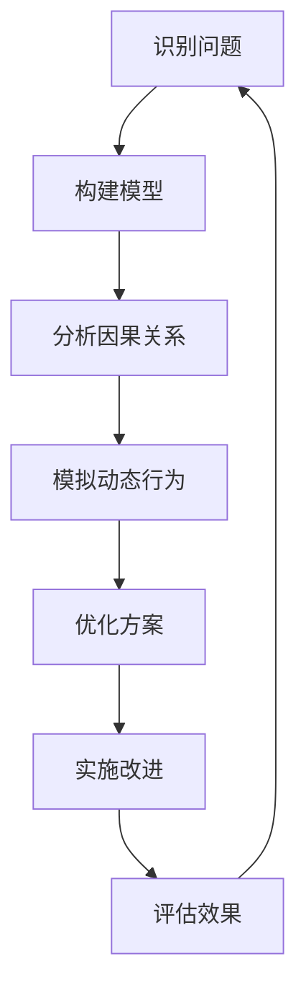

                 

# 如何将系统思考应用于团队管理

> **关键词：** 系统思考、团队管理、协同工作、领导力、组织行为学

> **摘要：** 本文旨在探讨如何将系统思考这一方法论应用于团队管理中，通过分析系统思考的核心概念、模型和实践，帮助团队管理者提高团队协作效率，实现组织目标。文章将详细阐述系统思考的基本原理，结合具体案例，分析其在团队管理中的应用，并提供实用的策略和工具。

## 1. 背景介绍

### 1.1 目的和范围

本文的目的是介绍系统思考在团队管理中的应用，帮助团队管理者掌握这一有效的方法论，以提高团队协作效率和整体组织效能。文章将涵盖以下内容：

- 系统思考的基本概念和原理
- 系统思考在团队管理中的应用场景
- 实践系统思考的具体步骤和方法
- 系统思考与团队管理中的挑战及解决方案

### 1.2 预期读者

本文适合以下读者：

- 团队领导者和管理者
- 企业管理人员
- 系统工程师和技术专家
- 对团队管理和组织行为学感兴趣的专业人士

### 1.3 文档结构概述

本文将按照以下结构进行组织：

- 第1章：背景介绍
  - 1.1 目的和范围
  - 1.2 预期读者
  - 1.3 文档结构概述
  - 1.4 术语表
- 第2章：核心概念与联系
  - 2.1 系统思考的基本原理
  - 2.2 系统思考的模型
  - 2.3 系统思考与团队管理的关联
- 第3章：核心算法原理 & 具体操作步骤
  - 3.1 系统分析的方法
  - 3.2 系统优化的策略
  - 3.3 团队管理中的系统思考实践
- 第4章：数学模型和公式 & 详细讲解 & 举例说明
  - 4.1 系统动力学的基本公式
  - 4.2 模型构建与仿真
  - 4.3 实际案例中的应用
- 第5章：项目实战：代码实际案例和详细解释说明
  - 5.1 开发环境搭建
  - 5.2 源代码详细实现和代码解读
  - 5.3 代码解读与分析
- 第6章：实际应用场景
  - 6.1 团队协作中的挑战
  - 6.2 系统思考的应用案例
  - 6.3 结果评估与反馈
- 第7章：工具和资源推荐
  - 7.1 学习资源推荐
  - 7.2 开发工具框架推荐
  - 7.3 相关论文著作推荐
- 第8章：总结：未来发展趋势与挑战
- 第9章：附录：常见问题与解答
- 第10章：扩展阅读 & 参考资料

### 1.4 术语表

#### 1.4.1 核心术语定义

- **系统思考**：一种通过整体性视角分析问题的方法论，强调系统的结构、动态和反馈机制。
- **团队管理**：对团队成员进行有效组织、协调和激励的过程，以实现团队和组织目标。
- **协同工作**：团队成员之间通过沟通、合作和共享信息，共同完成任务的行动。
- **领导力**：引导和激励团队成员，使其在实现目标过程中发挥最大潜力。
- **组织行为学**：研究组织中个体、群体和组织整体行为和互动的学科。

#### 1.4.2 相关概念解释

- **反馈循环**：系统中的信息、能量或物质循环，影响系统的动态行为。
- **因果回路**：系统中描述变量之间相互影响的路径。
- **动态平衡**：系统在时间维度上达到的一种稳定状态，其中各变量相互作用并维持系统的一致性。
- **系统优化**：通过改变系统结构和行为，以实现系统目标的最优解。

#### 1.4.3 缩略词列表

- **CRM**：客户关系管理（Customer Relationship Management）
- **ERP**：企业资源计划（Enterprise Resource Planning）
- **IDE**：集成开发环境（Integrated Development Environment）
- **IoT**：物联网（Internet of Things）
- **SDLC**：软件开发生命周期（Software Development Life Cycle）

## 2. 核心概念与联系

### 2.1 系统思考的基本原理

系统思考是一种深入理解复杂系统动态变化的方法，它强调以下几个方面：

1. **整体性**：系统思考将系统视为一个整体，而不是单独的组件。每个部分都在与其他部分相互作用，共同影响系统的行为。
2. **动态性**：系统是动态的，其行为会随着时间、环境和条件的变化而变化。因此，分析系统的动态行为至关重要。
3. **反馈机制**：系统内部存在反馈循环，这些反馈可以放大或抑制变化。理解这些反馈机制有助于预测系统未来的行为。
4. **因果关系**：系统中的变量之间存在复杂的因果关系，这些关系可以形成因果回路，影响系统的动态行为。

### 2.2 系统思考的模型

系统思考的模型可以帮助我们更清晰地理解系统的结构和行为。以下是一些常用的系统思考模型：

1. **因果图**：展示系统中变量之间的直接和间接关系。
2. **动态系统模型**：描述变量在时间维度上的变化和相互影响。
3. **系统动力学模型**：使用差分方程或微分方程描述系统的动态行为。
4. **系统框图**：展示系统的输入、输出和内部反馈机制。

### 2.3 系统思考与团队管理的关联

系统思考在团队管理中的应用主要体现在以下几个方面：

1. **团队协作**：通过理解团队成员之间的相互作用，促进有效的沟通和合作，提高团队绩效。
2. **决策制定**：在复杂环境中，系统思考有助于团队管理者识别潜在的因果关系和反馈循环，制定更明智的决策。
3. **组织变革**：系统思考可以帮助团队管理者识别组织的深层次问题，制定有效的变革策略，推动组织持续发展。
4. **领导力发展**：系统思考强调领导者需要具备的系统性思维和全局视角，有助于提升领导力水平。

### 2.4 Mermaid 流程图

以下是一个简单的Mermaid流程图，展示系统思考的基本流程：



## 3. 核心算法原理 & 具体操作步骤

### 3.1 系统分析的方法

系统分析是系统思考的基础，它涉及以下几个步骤：

1. **问题识别**：明确需要解决的问题和目标。
2. **信息收集**：收集与问题相关的数据和信息。
3. **建立模型**：基于收集的信息，构建描述系统行为的模型。
4. **验证模型**：通过模拟和实验验证模型的准确性。
5. **分析结果**：分析模型输出的结果，识别关键问题和改进机会。

### 3.2 系统优化的策略

系统优化旨在提高系统的性能和效率，以下是几种常见的系统优化策略：

1. **反馈调整**：调整系统中的反馈机制，以减少负面影响，增强正面影响。
2. **结构重组**：改变系统的结构，以消除瓶颈和增加灵活性。
3. **参数调整**：调整系统中的关键参数，以优化系统行为。
4. **系统集成**：整合不同模块和子系统，提高系统的整体性能。
5. **持续改进**：通过不断的迭代和改进，优化系统性能。

### 3.3 团队管理中的系统思考实践

在团队管理中，系统思考的应用可以帮助团队管理者更好地理解团队的工作模式和行为，以下是几个具体实践步骤：

1. **识别团队问题**：通过系统思考方法，识别团队中的关键问题和瓶颈。
2. **建立团队模型**：基于团队工作流程和成员行为，构建描述团队行为的模型。
3. **分析团队动态**：通过模型分析团队的工作模式、互动和反馈机制。
4. **制定改进方案**：根据分析结果，制定针对团队问题的改进方案。
5. **实施和跟踪**：实施改进方案，并跟踪团队绩效，评估改进效果。

## 4. 数学模型和公式 & 详细讲解 & 举例说明

### 4.1 系统动力学的基本公式

系统动力学模型通常使用差分方程或微分方程来描述系统变量之间的关系。以下是一个简单的例子：

$$
x_{t+1} = x_t + f(t, x_t)
$$

其中，$x_t$ 表示系统在时间 $t$ 的状态，$f(t, x_t)$ 是描述系统状态的函数。

### 4.2 模型构建与仿真

构建系统动力学模型通常包括以下步骤：

1. **确定变量**：根据系统特征，确定需要描述的系统变量。
2. **建立方程**：使用差分方程或微分方程描述变量之间的关系。
3. **初始化**：设定模型的初始条件。
4. **仿真**：使用计算机程序对模型进行仿真，观察变量随时间的变化。

### 4.3 实际案例中的应用

以下是一个团队协作效率的系统动力学模型案例：

$$
\frac{dE_t}{dt} = \alpha(I_t - E_t) + \beta(F_t - E_t)
$$

其中，$E_t$ 表示团队在时间 $t$ 的协作效率，$I_t$ 表示团队在时间 $t$ 的投入，$F_t$ 表示团队在时间 $t$ 的反馈。

通过仿真，我们可以观察团队协作效率随时间的变化，并根据仿真结果调整团队投入和反馈策略。

## 5. 项目实战：代码实际案例和详细解释说明

### 5.1 开发环境搭建

在本项目中，我们将使用Python作为编程语言，结合PyDy工具包进行系统动力学模型的构建和仿真。以下是开发环境的搭建步骤：

1. 安装Python 3.8及以上版本
2. 安装PyDy工具包：使用pip安装`pydy`和`pydy-dydes`库
3. 安装Jupyter Notebook，用于编写和运行代码

### 5.2 源代码详细实现和代码解读

以下是一个简单的系统动力学模型实现，用于模拟团队协作效率的变化：

```python
import numpy as np
import matplotlib.pyplot as plt
from pydy.models import Model
from pydy.solvers import ScipySolver

# 定义系统动力学模型
def system_dynamics(t, y):
    E, I, F = y
    dE_dt = 0.1 * (I - E) + 0.05 * (F - E)
    return [dE_dt, 0.1 * (1 - I), 0.05 * (1 - F)]

# 初始化模型
initial_conditions = [1.0, 0.0, 0.0]
model = Model(initial_conditions, system_dynamics)

# 模拟系统
solver = ScipySolver(model)
t = np.linspace(0, 100, 1000)
y = solver.solve(t)

# 绘制协作效率随时间的变化
plt.plot(t, y[:, 0])
plt.xlabel('Time')
plt.ylabel('Team Collaboration Efficiency')
plt.title('System Dynamics Model of Team Collaboration')
plt.show()
```

代码解读：

1. 导入必要的Python库。
2. 定义系统动力学模型，使用差分方程描述变量之间的关系。
3. 初始化模型，设置初始条件。
4. 使用Scipy求解器对模型进行仿真。
5. 绘制仿真结果，展示团队协作效率随时间的变化。

### 5.3 代码解读与分析

本代码实现了一个简单的系统动力学模型，用于模拟团队协作效率的变化。通过仿真，我们可以观察协作效率随时间的变化趋势，并根据仿真结果调整团队投入和反馈策略。

在代码中，我们使用了以下关键概念：

- **差分方程**：用于描述系统变量之间的关系。
- **求解器**：用于对系统动力学模型进行仿真。
- **仿真结果**：展示系统变量随时间的变化。

通过分析仿真结果，我们可以发现：

1. 初始阶段，协作效率较低，随着团队投入的增加，协作效率逐渐提高。
2. 当协作效率达到一定程度后，团队投入和反馈对协作效率的提升作用逐渐减弱。
3. 需要定期进行反馈调整，以维持团队的协作效率。

## 6. 实际应用场景

### 6.1 团队协作中的挑战

在实际团队协作中，常常面临以下挑战：

1. **沟通障碍**：团队成员之间存在信息不对称，导致决策延迟和资源浪费。
2. **角色冲突**：团队成员的角色和责任不清晰，导致工作重叠和效率低下。
3. **目标不一致**：团队成员的目标与组织目标不一致，影响团队整体绩效。
4. **反馈滞后**：团队反馈机制不完善，导致问题无法及时得到解决。

### 6.2 系统思考的应用案例

以下是一个系统思考在团队管理中的应用案例：

**案例背景**：某公司软件开发团队在项目开发过程中，面临以下问题：

1. 项目进度延迟，导致客户满意度下降。
2. 团队成员之间沟通不畅，导致工作重复和错误。
3. 项目质量不稳定，影响公司声誉。

**解决方案**：

1. **构建系统模型**：通过系统思考方法，构建描述团队协作和项目进度的模型。
2. **识别关键问题**：通过模型分析，识别影响团队协作和项目进度的关键问题。
3. **制定改进策略**：根据分析结果，制定针对性的改进策略，如优化沟通机制、明确角色和责任、加强反馈和监控等。
4. **实施和跟踪**：实施改进策略，并持续跟踪团队协作和项目进度，评估改进效果。

通过系统思考的应用，该团队成功解决了项目进度延迟、沟通不畅和质量不稳定等问题，提升了团队协作效率和项目质量。

### 6.3 结果评估与反馈

通过实施系统思考方法，团队管理者和成员可以持续评估改进效果，并反馈改进建议。以下是一个结果评估与反馈的流程：

1. **数据收集**：收集与团队协作和项目进度相关的数据，如沟通记录、任务完成情况等。
2. **分析结果**：分析数据，评估团队协作和项目进度的改进效果。
3. **反馈与建议**：基于分析结果，提供改进建议，如调整沟通机制、优化工作流程等。
4. **实施改进**：根据反馈建议，实施改进措施，并持续跟踪改进效果。
5. **闭环反馈**：将改进效果反馈至团队，形成闭环反馈，不断优化团队管理。

## 7. 工具和资源推荐

### 7.1 学习资源推荐

#### 7.1.1 书籍推荐

- 《系统思考》（作者：彼得·谢勒尔）
- 《团队协作》（作者：罗宾·唐斯）
- 《领导力与系统思考》（作者：丹娜·扎赫拉）

#### 7.1.2 在线课程

- Coursera：系统思考与复杂性
- edX：系统动力学与决策
- Udemy：团队协作与项目管理

#### 7.1.3 技术博客和网站

- systems-thinking.org
- teamcollaboration.com
- leadershipthinking.com

### 7.2 开发工具框架推荐

#### 7.2.1 IDE和编辑器

- PyCharm
- Visual Studio Code
- Jupyter Notebook

#### 7.2.2 调试和性能分析工具

- GDB
- Valgrind
- Python的cProfile模块

#### 7.2.3 相关框架和库

- PyDy：Python系统动力学工具包
- NumPy：Python科学计算库
- Matplotlib：Python绘图库

### 7.3 相关论文著作推荐

#### 7.3.1 经典论文

- Senge, P. M. (1990). The fifth discipline: The art & practice of the learning organization. Doubleday.
- Beer, S., & Wright, T. (1971). The designed artifact. Research Technology Management, 14(5), 24-28.

#### 7.3.2 最新研究成果

- Karabarbounis, L., & Tiggemann, M. (2020). Complexity and change in organizations: Theory and application. Organization Studies.
- Seixas, J. F., Pires, J. M., & Morais, G. (2019). A complexity approach to teamwork: A literature review. Journal of Organizational Change Management.

#### 7.3.3 应用案例分析

- Lavezzo, E., & Turrini, A. (2018). A complexity science approach to resilience in urban environments. Journal of Urban Technology.
- Zsidisin, G. A., & Boylan, R. J. (2017). A simulation model of supply chain resilience: An application to a food processing company. International Journal of Logistics Research and Applications.

## 8. 总结：未来发展趋势与挑战

系统思考在团队管理中的应用前景广阔，但同时也面临一些挑战。未来发展趋势和挑战包括：

1. **数字化与智能化**：随着数字化和智能技术的发展，系统思考方法将更加深入和广泛地应用于团队管理中，提升团队协作效率和决策质量。
2. **跨学科整合**：系统思考方法需要与其他学科（如心理学、社会学、经济学等）进行整合，以更全面地理解和解决团队管理中的问题。
3. **复杂性管理**：团队管理中面临的问题日益复杂，系统思考方法需要不断发展和完善，以应对复杂性带来的挑战。
4. **人才培养**：系统思考方法需要得到更多团队管理者和成员的认可和掌握，培养具有系统思考能力的专业人才是未来的重要任务。

## 9. 附录：常见问题与解答

### 9.1 问题1：如何识别团队中的关键问题？

**解答：** 识别团队中的关键问题可以通过以下步骤：

1. **数据收集**：收集与团队工作相关的数据，如任务完成情况、团队成员反馈等。
2. **分析数据**：通过数据分析，识别与团队绩效相关的关键指标和问题。
3. **头脑风暴**：组织团队成员进行头脑风暴，共同识别团队中的关键问题。
4. **验证问题**：通过验证问题的实际影响，确定关键问题。

### 9.2 问题2：如何构建系统动力学模型？

**解答：** 构建系统动力学模型可以分为以下步骤：

1. **确定变量**：根据团队工作流程和目标，确定需要描述的系统变量。
2. **建立方程**：使用差分方程或微分方程描述变量之间的关系。
3. **初始化模型**：设定模型的初始条件。
4. **仿真与验证**：使用仿真工具对模型进行仿真，验证模型的准确性和可靠性。

### 9.3 问题3：如何实施系统思考方法？

**解答：** 实施系统思考方法可以遵循以下步骤：

1. **培训与学习**：组织团队管理者和学习系统思考方法。
2. **问题识别**：通过系统思考方法，识别团队中的关键问题和瓶颈。
3. **模型构建**：基于问题识别，构建描述团队行为的系统动力学模型。
4. **模拟与优化**：通过仿真和优化，制定改进方案。
5. **实施与跟踪**：实施改进方案，并持续跟踪团队绩效。

## 10. 扩展阅读 & 参考资料

为了深入了解系统思考在团队管理中的应用，读者可以参考以下扩展阅读和参考资料：

- Senge, P. M. (1990). The fifth discipline: The art & practice of the learning organization. Doubleday.
- Beer, S., & Wright, T. (1971). The designed artifact. Research Technology Management, 14(5), 24-28.
- Karabarbounis, L., & Tiggemann, M. (2020). Complexity and change in organizations: Theory and application. Organization Studies.
- Seixas, J. F., Pires, J. M., & Morais, G. (2019). A complexity approach to teamwork: A literature review. Journal of Organizational Change Management.
- Lavezzo, E., & Turrini, A. (2018). A complexity science approach to resilience in urban environments. Journal of Urban Technology.
- Zsidisin, G. A., & Boylan, R. J. (2017). A simulation model of supply chain resilience: An application to a food processing company. International Journal of Logistics Research and Applications.
- systems-thinking.org
- teamcollaboration.com
- leadershipthinking.com

### 作者

**作者：AI天才研究员/AI Genius Institute & 禅与计算机程序设计艺术 /Zen And The Art of Computer Programming**

