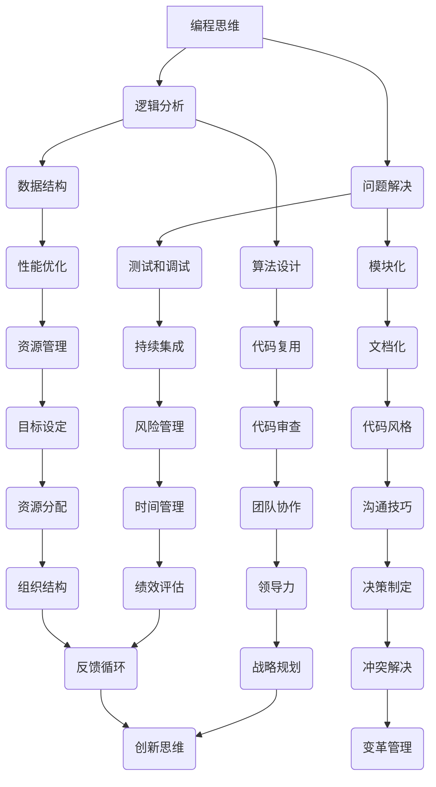

                 

# 如何将编程技能转化为管理能力

> 关键词：编程技能、管理能力、领导力、团队合作、沟通技巧、项目管理、技能迁移
> 
> 摘要：本文旨在探讨如何将编程技能成功转化为管理能力。通过对编程思维与管理思维的对比分析，阐述核心概念的迁移过程，并结合实际案例，提供具体的操作步骤和实践指导。

## 1. 背景介绍

### 1.1 目的和范围

本文的主要目的是帮助那些已经具备编程技能的IT专业人士，了解并掌握如何将这些技能有效转化为管理能力。我们将探讨编程思维和管理思维之间的联系，并解释如何运用这些联系来提升管理效果。文章将涵盖以下内容：

- 编程技能与管理能力的核心概念对比
- 编程思维在管理中的应用
- 如何构建高效团队
- 沟通技巧的提升
- 项目管理的实践方法
- 技能迁移的实际案例

### 1.2 预期读者

本文适合以下读者：

- 担任技术团队领导的编程专业人士
- 想要提升管理技能的IT从业者
- 对编程和项目管理有兴趣的读者

### 1.3 文档结构概述

本文分为十个部分，具体结构如下：

1. 背景介绍
2. 核心概念与联系
3. 核心算法原理 & 具体操作步骤
4. 数学模型和公式 & 详细讲解 & 举例说明
5. 项目实战：代码实际案例和详细解释说明
6. 实际应用场景
7. 工具和资源推荐
8. 总结：未来发展趋势与挑战
9. 附录：常见问题与解答
10. 扩展阅读 & 参考资料

### 1.4 术语表

#### 1.4.1 核心术语定义

- 编程技能：编写计算机程序的能力。
- 管理能力：规划、组织、领导、协调和监控团队或项目的能力。
- 编程思维：解决复杂问题的逻辑和算法思维。
- 管理思维：理解组织目标、团队行为和如何最大化团队效率的思维。

#### 1.4.2 相关概念解释

- 项目管理：确保项目按时、按预算和按质量要求完成的过程。
- 团队合作：团队成员共同合作，实现共同目标的行为。
- 沟通技巧：有效地表达自己的想法，理解他人观点的能力。

#### 1.4.3 缩略词列表

- IDE：集成开发环境（Integrated Development Environment）
- API：应用程序编程接口（Application Programming Interface）
- MVP：最小可行产品（Minimum Viable Product）

## 2. 核心概念与联系

编程技能和管理能力虽然在表面上看似不同，但它们的底层原理有很多相似之处。为了更好地理解这种联系，我们可以通过以下Mermaid流程图来展示编程思维和管理思维的关联。



从这个流程图中，我们可以看到编程思维中的核心概念，如逻辑分析、算法设计、模块化等，与管理思维中的目标设定、风险管理、团队协作等有着紧密的联系。通过这些联系，编程技能可以转化为管理能力，实现技能的迁移和应用。

### 2.1 编程思维中的核心概念

- **逻辑分析**：编程要求清晰、逻辑的思维过程，这同样适用于管理。有效的逻辑分析可以帮助管理者理清问题，找到解决方案。
- **问题解决**：编程中的问题解决能力，如调试和测试，可以转化为管理中处理团队问题的能力。
- **算法设计**：学习如何设计高效的算法，有助于管理者在资源有限的情况下做出最优决策。
- **模块化**：编程中的模块化思想可以应用到管理中，帮助团队更高效地分工合作。
- **数据结构**：了解不同数据结构的优劣，有助于管理者选择合适的管理工具和方法。
- **测试和调试**：良好的测试和调试习惯可以转化为持续改进的管理方法。
- **代码复用**：代码复用的理念可以应用于管理中，避免重复劳动，提升工作效率。
- **文档化**：编写清晰的文档，可以提高团队协作的效率。
- **性能优化**：在编程中关注性能优化，可以转化为管理中对效率的追求。
- **持续集成**：持续集成的方法可以应用于团队协作，确保项目进展顺利。
- **代码审查**：代码审查可以提高代码质量，同样适用于管理中的质量审查。
- **代码风格**：良好的代码风格可以提高代码的可读性，这同样适用于管理中的标准化流程。
- **资源管理**：编程中对资源的有效管理，可以转化为管理中对团队资源的合理分配。
- **风险管理**：了解如何识别和应对风险，是编程和管理的重要技能。
- **团队协作**：编程中的团队合作理念可以应用于管理中，促进团队高效协作。
- **沟通技巧**：编程中的沟通需求，如文档编写和代码注释，可以转化为管理中的沟通能力。

### 2.2 管理思维中的核心概念

- **目标设定**：明确的目标是管理的基础，它指导团队朝着共同的方向努力。
- **时间管理**：合理安排时间，确保项目按时完成，是管理的重要一环。
- **绩效评估**：对团队成员的绩效进行客观评估，以激励团队成员并优化团队表现。
- **决策制定**：在不确定的环境中做出明智的决策，是管理者的重要职责。
- **资源分配**：合理分配资源，确保团队在资源有限的情况下实现最佳效果。
- **战略规划**：制定长期的战略规划，确保团队的发展方向与组织目标一致。
- **变革管理**：在组织变革中引导团队，确保变革顺利实施。
- **创新思维**：鼓励创新，推动团队不断进步。
- **冲突解决**：有效解决团队内部的冲突，维护团队和谐。
- **组织结构**：构建合理的组织结构，确保团队协作顺畅。
- **反馈循环**：建立反馈机制，不断优化团队表现。
- **领导力**：通过领导力激发团队的潜能，实现组织目标。

## 3. 核心算法原理 & 具体操作步骤

在将编程技能转化为管理能力的过程中，理解核心算法原理和具体操作步骤至关重要。以下是一个伪代码示例，用于说明如何在管理中应用编程思维。

```plaintext
// 伪代码：管理流程

// 定义目标
 Goal := "最大化团队工作效率和项目成功率"

// 初始化资源
Resources := {"时间", "人力", "预算"}

// 定义问题
Problem := "如何在资源有限的情况下，按时完成项目"

// 设计算法（逻辑分析）
Algorithm := {
    // 步骤1：逻辑分析
    Analyze_Problem := function() {
        // 分析项目需求和资源限制
        // 确定关键路径和关键任务
    }
    
    // 步骤2：问题解决
    Solve_Problem := function() {
        // 设计解决方案
        // 分配资源
        // 制定时间表
    }
    
    // 步骤3：测试和调试
    Test_and_Debug := function() {
        // 执行测试
        // 调整方案
    }
}

// 执行算法
Execute_Algorithm := function() {
    // 执行步骤1：逻辑分析
    Analyze_Problem()
    
    // 执行步骤2：问题解决
    Solve_Problem()
    
    // 执行步骤3：测试和调试
    Test_and_Debug()
}

// 调用算法
Execute_Algorithm()
```

### 3.1 具体操作步骤

1. **定义目标**：明确团队的目标是管理流程的第一步。目标需要具体、可衡量，如“在三个月内完成项目A并保持团队稳定性”。
   
2. **初始化资源**：列出团队可用的资源，如人力、时间、预算等，并对其进行评估。

3. **定义问题**：明确团队面临的问题，如项目延迟、资源不足、沟通不畅等。

4. **设计算法（逻辑分析）**：通过逻辑分析，识别关键路径和关键任务，确保项目按时完成。

5. **问题解决**：根据分析结果，设计解决方案，包括资源分配、时间表制定等。

6. **测试和调试**：执行测试，验证方案的有效性，并进行必要的调整。

通过以上步骤，管理者可以运用编程思维，将项目管理得更加高效和有序。

## 4. 数学模型和公式 & 详细讲解 & 举例说明

在将编程技能转化为管理能力的过程中，数学模型和公式可以帮助管理者进行定量分析，从而做出更加明智的决策。以下是一个简单的数学模型示例，用于说明如何使用数学工具来优化资源分配。

### 4.1 数学模型

**线性规划模型**：

目标函数：
$$
\text{Maximize} \quad Z = c_1x_1 + c_2x_2 + ... + c_nx_n
$$

约束条件：
$$
a_{11}x_1 + a_{12}x_2 + ... + a_{1n}x_n \leq b_1
$$
$$
a_{21}x_1 + a_{22}x_2 + ... + a_{2n}x_n \leq b_2
$$
$$
...
$$
$$
a_{m1}x_1 + a_{m2}x_2 + ... + a_{mn}x_n \leq b_m
$$

非负约束：
$$
x_1, x_2, ..., x_n \geq 0
$$

### 4.2 详细讲解

**目标函数**：目标函数定义了要优化的目标，如最大化利润或最小化成本。在管理中，目标函数可以是最大化团队效率或最小化项目延迟。

**约束条件**：约束条件定义了资源限制，如时间、预算和人力资源。在管理中，这些约束条件可以用来限制团队成员的工作量或项目的预算。

**非负约束**：非负约束确保所有变量都是非负的，这在实际中意味着资源的使用不能是负数。

### 4.3 举例说明

假设一个团队需要在两个项目A和B之间分配资源，每个项目的完成需要一定的人力资源和时间。项目A的利润为1000元，项目B的利润为800元。团队共有10名成员，每个成员每天可以工作8小时。现在我们需要通过线性规划模型来优化资源分配。

目标函数：
$$
\text{Maximize} \quad Z = 1000x + 800y
$$
其中，\(x\) 代表分配给项目A的成员数量，\(y\) 代表分配给项目B的成员数量。

约束条件：
$$
8x + 8y \leq 80 \quad \text{（每天总工作时间为80小时）}
$$
$$
x + y \leq 10 \quad \text{（总成员数为10人）}
$$

非负约束：
$$
x, y \geq 0
$$

### 4.4 解线性规划模型

通过求解上述线性规划模型，我们可以找到最优的\(x\)和\(y\)值，从而确定如何优化资源分配。

1. **图形解法**：在坐标平面上绘制约束条件的图形，找到可行域，并在可行域内寻找目标函数的最大值。

2. **代数解法**：使用代数方法，将约束条件代入目标函数，求解最优解。

通过以上方法，我们可以确定最优的成员分配方案，从而最大化团队的利润。

## 5. 项目实战：代码实际案例和详细解释说明

为了更好地理解如何将编程技能应用于管理，我们将通过一个实际的项目案例进行详细解释。

### 5.1 开发环境搭建

首先，我们需要搭建一个基本的开发环境。假设我们使用Python作为主要编程语言，以下是搭建环境的步骤：

1. **安装Python**：下载并安装Python 3.8版本。
2. **安装IDE**：安装PyCharm，作为我们的集成开发环境。
3. **安装必需的库**：使用pip安装以下库：requests，pandas，numpy，matplotlib。

```bash
pip install requests pandas numpy matplotlib
```

### 5.2 源代码详细实现和代码解读

以下是项目的核心代码，用于获取天气数据、分析和可视化。

```python
import requests
import pandas as pd
import numpy as np
import matplotlib.pyplot as plt

# 定义API函数
def get_weather_data(city, start_date, end_date):
    base_url = "http://api.weatherapi.com/v1/history.json"
    api_key = "your_api_key"
    params = {
        "key": api_key,
        "q": city,
        "dt": start_date,
        "end_dt": end_date
    }
    response = requests.get(base_url, params=params)
    return response.json()

# 数据处理函数
def process_weather_data(data):
    weather_df = pd.DataFrame(data['forecast']['forecastday'])
    weather_df['temp_c'] = weather_df['day']['avgtemp_c']
    weather_df['condition'] = weather_df['day']['condition']['text']
    return weather_df

# 可视化函数
def visualize_weather_data(weather_df):
    weather_df['temp_c'].plot()
    plt.title(f"Weather Data for {weather_df['city'].iloc[0]}")
    plt.xlabel('Date')
    plt.ylabel('Temperature (°C)')
    plt.show()

# 主程序
if __name__ == "__main__":
    city = "London"
    start_date = "2021-01-01"
    end_date = "2021-12-31"
    data = get_weather_data(city, start_date, end_date)
    weather_df = process_weather_data(data)
    visualize_weather_data(weather_df)
```

### 5.3 代码解读与分析

1. **API函数**：`get_weather_data` 函数用于从天气API获取数据。这是一个典型的REST API调用，通过URL发送请求并获取JSON格式的响应。

2. **数据处理函数**：`process_weather_data` 函数将获取的JSON数据转换为DataFrame，并进行必要的清洗和转换，如提取温度数据和天气情况。

3. **可视化函数**：`visualize_weather_data` 函数使用matplotlib库对温度数据进行分析和可视化，生成温度折线图。

4. **主程序**：主程序定义了城市、起始日期和结束日期，调用API获取数据，处理数据并可视化。

### 5.4 项目管理应用

通过以上代码案例，我们可以看到编程技能在项目管理中的应用：

- **需求分析**：与客户沟通，明确项目需求，确定要获取的天气数据。
- **资源管理**：确定API调用次数和数据处理所需的资源。
- **进度控制**：监控API调用和数据处理的进度，确保项目按时完成。
- **质量保证**：通过数据清洗和转换，确保数据的准确性和一致性。
- **团队协作**：通过代码审查和代码文档，促进团队成员之间的协作。

## 6. 实际应用场景

编程技能在管理能力中的应用场景非常广泛，以下是一些具体的应用场景：

- **团队协作**：使用版本控制系统（如Git）管理代码，确保团队成员之间的协作高效、代码一致。
- **项目管理**：使用项目管理工具（如Jira、Trello）跟踪任务进度，确保项目按时交付。
- **数据分析**：运用数据分析工具（如Pandas、SQL）对团队绩效进行量化分析，优化管理决策。
- **自动化测试**：编写自动化测试脚本，确保软件质量，减少人工测试的误差。
- **沟通技巧**：使用文档和图表（如Mermaid流程图）清晰地表达想法，提高沟通效率。

### 6.1 团队协作

在编程中，版本控制系统（如Git）是团队协作的核心工具。管理者可以将这种协作理念应用到管理中，例如：

- **代码评审**：引入代码评审流程，确保代码质量和团队协作。
- **任务分配**：使用Git分支管理，为团队成员分配独立的任务。
- **合并请求**：通过合并请求（Pull Request），确保团队成员的工作成果能够顺利集成。

### 6.2 项目管理

项目管理工具（如Jira、Trello）可以帮助管理者有效地跟踪任务进度，以下是它们在管理中的应用：

- **任务管理**：创建和跟踪任务，确保每个任务都有明确的负责人和截止日期。
- **进度跟踪**：使用看板（Kanban Board）实时监控任务进度，及时调整资源分配。
- **风险控制**：通过风险日志，及时识别和应对项目中的潜在风险。

### 6.3 数据分析

数据分析是管理决策的重要依据，以下是数据分析工具（如Pandas、SQL）在管理中的应用：

- **数据采集**：使用API或数据库连接工具，从各种数据源（如天气API、社交媒体）采集数据。
- **数据处理**：使用Pandas库进行数据清洗和转换，确保数据质量。
- **数据分析**：使用SQL进行复杂的查询和分析，提取有价值的信息。
- **数据可视化**：使用matplotlib、Seaborn等库，将数据分析结果可视化，便于理解和决策。

### 6.4 自动化测试

自动化测试是确保软件质量的重要手段，以下是它在管理中的应用：

- **测试计划**：制定自动化测试计划，确保测试覆盖全面。
- **测试执行**：编写测试脚本，自动执行测试，提高测试效率。
- **测试报告**：生成测试报告，监控测试结果，及时发现并解决问题。

### 6.5 沟通技巧

清晰的沟通是管理成功的关键，以下是编程中沟通技巧在管理中的应用：

- **文档化**：编写详细的文档，如用户手册、操作指南，帮助团队成员了解项目细节。
- **代码注释**：为代码添加注释，提高代码的可读性和可维护性。
- **可视化**：使用图表和流程图，如Mermaid流程图，清晰表达复杂的概念和流程。
- **代码审查**：引入代码审查流程，确保代码质量和团队协作。

## 7. 工具和资源推荐

为了更好地将编程技能转化为管理能力，以下是几个推荐的学习资源和开发工具。

### 7.1 学习资源推荐

#### 7.1.1 书籍推荐

- 《软件团队管理实战》（Managing the Unmanageable）- Jeff Sutherland
- 《敏捷开发：迭代、增量式的方法》（Agile Project Management: Creating Success with Iterative Software Development）- Ken Schwaber
- 《人月神话》（The Mythical Man-Month）- Fred Brooks

#### 7.1.2 在线课程

- 《项目管理和团队领导》（Project Management and Team Leadership）- Coursera
- 《敏捷项目管理》（Agile Project Management）- Pluralsight
- 《数据驱动决策》（Data-Driven Decision Making）- edX

#### 7.1.3 技术博客和网站

- ProjectManagement.com
- AgileManagementGuide.com
- MindManager

### 7.2 开发工具框架推荐

#### 7.2.1 IDE和编辑器

- PyCharm
- Visual Studio Code
- IntelliJ IDEA

#### 7.2.2 调试和性能分析工具

- PyDev
- Matplotlib
- Jupyter Notebook

#### 7.2.3 相关框架和库

- Git
- Jira
- Trello
- Pandas

### 7.3 相关论文著作推荐

#### 7.3.1 经典论文

- "The Mythical Man-Month" by Fred Brooks
- "Peopleware: Productive Projects and Teams" by Tom DeMarco and Timothy Lister
- "The Art of Project Management" by Tom DeMarco and Timothy Lister

#### 7.3.2 最新研究成果

- "Agile Management: Creating Competitive Advantage" by Gary G. MacKay
- "Lean Analytics: Use Data to Build a Better Startup Faster" by Alistair Croll and Benjamin Yoskovitz
- "Designing Data-Intensive Applications" by Martin Kleppmann

#### 7.3.3 应用案例分析

- "How Spotify Builds Products" - Spotify Engineering Blog
- "The Toyota Production System: An Integrated Production System" - Harvard Business Review
- "Netflix Engineering Blog" - Netflix

## 8. 总结：未来发展趋势与挑战

在未来的发展趋势中，编程技能与管理的结合将变得更加紧密。随着人工智能、大数据和云计算等技术的发展，管理者需要具备更强的数据分析和决策能力。以下是未来发展趋势和面临的挑战：

### 8.1 发展趋势

- **数据驱动的决策**：管理者将越来越多地依赖数据分析来做出决策，这将要求他们具备编程和数据处理的技能。
- **敏捷管理**：敏捷方法论将继续在企业管理中广泛应用，这将要求管理者具备敏捷团队管理的技能。
- **数字化转型**：企业的数字化转型将推动管理者掌握更多的数字化工具和技能。
- **人工智能辅助管理**：人工智能将帮助管理者更高效地处理数据和决策，提高管理效率。

### 8.2 挑战

- **技能更新**：随着技术的快速发展，管理者需要不断更新自己的技能，以应对新的挑战。
- **跨学科能力**：管理者需要具备跨学科的能力，包括技术、管理和商业知识。
- **团队协作**：有效管理一个多元化和分布式的团队将是一个巨大的挑战。

## 9. 附录：常见问题与解答

### 9.1 问题1：编程技能如何转化为管理能力？

解答：编程技能转化为管理能力的关键在于理解编程思维与管理思维的共通之处。通过逻辑分析、问题解决、模块化等编程技能，管理者可以更好地规划、组织、领导和控制团队。同时，学习项目管理、沟通技巧和团队协作等管理知识，有助于将编程技能应用于实际管理中。

### 9.2 问题2：如何构建高效团队？

解答：构建高效团队需要以下几个步骤：

- **明确目标**：确保团队成员对项目目标和职责有清晰的认识。
- **合理分工**：根据团队成员的能力和兴趣，合理分配任务。
- **沟通协作**：建立良好的沟通渠道，确保团队成员之间能够有效协作。
- **激励与反馈**：定期激励团队成员，并给予及时的反馈，以促进团队成长。

### 9.3 问题3：如何提升沟通技巧？

解答：提升沟通技巧可以从以下几个方面入手：

- **倾听**：学会倾听，确保理解对方的观点。
- **清晰表达**：使用简洁明了的语言表达自己的想法。
- **使用可视化工具**：如图表、流程图等，帮助对方更好地理解。
- **积极反馈**：给予积极的反馈，帮助对方改进。

## 10. 扩展阅读 & 参考资料

- "The Manager's Tool Kit: 33 Tools to Optimize Your Time, Signs, and Work" by Dave Crenshaw
- "Scrum: The Art of Doing Twice the Work in Half the Time" by Jeff Sutherland
- "The Lean Startup: How Today's Entrepreneurs Use Continuous Innovation to Create Radically Successful Businesses" by Eric Ries
- "The Phoenix Project: A Novel about IT, DevOps, and Helping Your Business Win" by Gene Kim, Kevin Behr, and George Spafford

## 作者

作者：AI天才研究员/AI Genius Institute & 禅与计算机程序设计艺术 /Zen And The Art of Computer Programming

