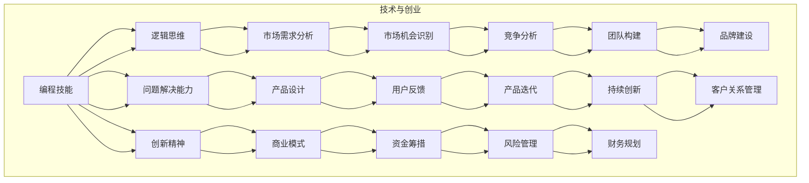

                 

# 如何将编程热情转化为创业动力

> 关键词：编程、热情、创业、动力、转型
> 
> 摘要：本文旨在探讨如何将个人对编程的深厚热情转化为创业的强大动力。我们将从动机分析、市场调研、技术沉淀、团队构建、资金筹措以及风险管理等方面，一步步剖析编程者如何成功转型为创业者。希望通过本文，读者能够找到适合自己的创业路径，实现人生价值的飞跃。

## 1. 背景介绍

### 1.1 目的和范围

本文旨在帮助那些对编程充满热情的个体，将这种热情转化为创业动力，最终实现个人价值的最大化。我们不仅会探讨如何识别和培养创业所需的动机，还会详细讲解如何进行市场调研、技术沉淀、团队构建、资金筹措以及风险管理。文章的适用对象为有志于从编程开发者转型为创业者的专业人士。

### 1.2 预期读者

预期读者包括但不限于以下群体：
- 对编程有着深厚兴趣的技术爱好者；
- 在编程领域有所成就，希望拓宽职业道路的专业人士；
- 愿意探索新领域，寻求创业机会的企业家。

### 1.3 文档结构概述

本文的结构如下：
1. **背景介绍**：介绍文章的目的和适用读者，以及文章的整体结构。
2. **核心概念与联系**：通过Mermaid流程图展示编程与创业之间的联系。
3. **核心算法原理与具体操作步骤**：详细介绍如何从编程思维转向创业思维。
4. **数学模型和公式**：运用数学模型分析创业中的关键因素。
5. **项目实战**：通过实际案例展示如何实现编程向创业的转化。
6. **实际应用场景**：探讨创业在不同行业中的应用。
7. **工具和资源推荐**：推荐学习和实践所需的学习资源、工具和框架。
8. **总结**：总结创业趋势和挑战，为读者提供未来发展的方向。
9. **附录**：常见问题解答，帮助读者解决创业过程中的困惑。
10. **扩展阅读**：提供相关的扩展资料和参考文献。

### 1.4 术语表

#### 1.4.1 核心术语定义

- **编程热情**：对编写程序代码的强烈兴趣和热爱。
- **创业动力**：推动个人创立企业、实现商业目标的内在驱动力。
- **市场调研**：对潜在市场进行系统的考察和分析。
- **技术沉淀**：在某一技术领域积累的深厚知识和经验。
- **团队构建**：组建具有协作能力和专业素质的团队。

#### 1.4.2 相关概念解释

- **创业**：创立新的企业，通过创新和商业化实现价值。
- **转型**：从一个职业领域或角色向另一个领域或角色转变。
- **商业模型**：企业如何创造、传递和获取价值的策略。

#### 1.4.3 缩略词列表

- **IDE**：集成开发环境（Integrated Development Environment）
- **SDK**：软件开发工具包（Software Development Kit）
- **API**：应用程序接口（Application Programming Interface）

## 2. 核心概念与联系

### 2.1 编程与创业的关系

编程与创业之间存在紧密的联系。编程作为现代技术领域的基础，不仅为创业者提供了实现商业想法的技术手段，还培养了他们的逻辑思维、问题解决能力和创新精神。以下是一个Mermaid流程图，展示了编程与创业之间的核心概念和联系：



通过上述流程图，我们可以清晰地看到编程技能如何转化为创业所需的能力和策略。编程不仅提供了技术基础，还推动了创业过程中的创新和成长。

## 3. 核心算法原理与具体操作步骤

### 3.1 从编程思维转向创业思维

从编程思维转向创业思维是一个系统性的过程，需要个体在多个方面进行转变。以下是具体的操作步骤：

#### 3.1.1 自我评估

- **步骤1**：首先，进行自我评估，明确自己的编程技能和优势。列出自己在编程领域擅长和感兴趣的技术方向。
  
  ```pseudo
  function self_evaluation() {
      skills = ["算法与数据结构", "前端开发", "后端开发", "数据库管理", "人工智能"];
      print("您的编程技能：", skills);
  }
  ```

- **步骤2**：评估自己的创业潜力，思考自己在创业过程中可能面临的挑战，并制定应对策略。

  ```pseudo
  function assess_potential() {
      challenges = ["资金短缺", "市场竞争", "团队管理"];
      strategies = ["寻求投资", "差异化竞争", "培养团队"];
      print("您可能面临的挑战：", challenges);
      print("应对策略：", strategies);
  }
  ```

#### 3.1.2 市场调研

- **步骤3**：进行市场调研，了解目标市场的需求和趋势。使用互联网工具收集数据，分析用户需求、市场规模和竞争对手。

  ```pseudo
  function market_research() {
      requirements = ["用户访谈", "在线调查", "数据分析"];
      data_tools = ["Google Analytics", "SurveyMonkey", "Tableau"];
      print("市场调研工具：", data_tools);
  }
  ```

#### 3.1.3 产品设计

- **步骤4**：基于市场调研的结果，设计产品原型。明确产品的功能、用户界面和用户体验。

  ```pseudo
  function design_product() {
      features = ["用户注册", "数据存储", "实时通信"];
      interface = ["简洁直观", "易用性强", "响应速度快"];
      user_experience = ["满意度高", "操作流畅", "安全性好"];
      print("产品原型设计：", features, interface, user_experience);
  }
  ```

#### 3.1.4 团队构建

- **步骤5**：构建创业团队，寻找具有互补技能的合作伙伴。明确团队成员的角色和职责，建立有效的沟通和协作机制。

  ```pseudo
  function build_team() {
      roles = ["技术负责人", "产品经理", "市场运营", "财务专员"];
      responsibilities = ["技术实现", "产品设计", "市场拓展", "财务规划"];
      collaboration = ["定期会议", "信息共享", "任务分配"];
      print("团队角色与职责：", roles, responsibilities, collaboration);
  }
  ```

#### 3.1.5 资金筹措

- **步骤6**：制定资金筹措计划，寻求投资机会。了解不同的融资方式，如天使投资、风险投资、众筹等。

  ```pseudo
  function raise_funds() {
      funding_methods = ["天使投资", "风险投资", "股权众筹"];
      pitch_deck = ["产品演示", "市场分析", "商业模式"];
      follow_up = ["持续沟通", "反馈调整", "关系维护"];
      print("资金筹措计划：", funding_methods, pitch_deck, follow_up);
  }
  ```

#### 3.1.6 风险管理

- **步骤7**：识别和评估创业过程中可能遇到的风险，制定风险管理计划。确保在突发情况下能够迅速应对。

  ```pseudo
  function manage_risks() {
      risks = ["市场变化", "技术风险", "法律风险"];
      mitigation = ["市场调研", "技术储备", "合规审查"];
      contingency = ["资金储备", "备用方案", "紧急响应"];
      print("风险管理计划：", risks, mitigation, contingency);
  }
  ```

通过上述操作步骤，编程者可以逐步实现从编程思维向创业思维的转变，为成功创业奠定坚实基础。

## 4. 数学模型和公式与详细讲解

在创业过程中，数学模型和公式可以帮助创业者进行定量分析，为决策提供依据。以下是几个关键的数学模型和公式，以及它们的详细讲解和举例说明。

### 4.1 市场需求分析模型

市场需求分析是创业过程中至关重要的一步。我们可以使用需求预测模型来估算市场的潜在需求。

#### 4.1.1 基本模型：线性回归

线性回归模型用于预测市场需求的增长趋势。其公式如下：

\[ y = ax + b \]

其中：
- \( y \) 是市场需求量；
- \( x \) 是时间；
- \( a \) 是斜率，表示需求的增长速率；
- \( b \) 是截距，表示起始需求量。

#### 4.1.2 示例

假设某初创公司想要预测未来三个月的市场需求。根据过去三个月的数据，我们得到以下线性回归模型：

\[ y = 2x + 50 \]

根据该模型，我们可以预测未来三个月的需求量：

- 第一个月：\( y = 2 \times 1 + 50 = 52 \)
- 第二个月：\( y = 2 \times 2 + 50 = 54 \)
- 第三个月：\( y = 2 \times 3 + 50 = 56 \)

### 4.2 成本收益分析模型

在创业过程中，进行成本收益分析可以帮助创业者确定项目的可行性。以下是一个简单的成本收益分析模型。

#### 4.2.1 成本收益模型

成本收益模型的基本公式为：

\[ \text{净利润} = \text{收入} - \text{成本} \]

其中：
- 收入（\( R \)）：产品或服务的销售额；
- 成本（\( C \)）：生产成本、运营成本和其他相关费用。

#### 4.2.2 示例

假设一家初创公司的产品月销售额为100万元，月成本为70万元。那么，其月净利润为：

\[ \text{净利润} = 100\text{万元} - 70\text{万元} = 30\text{万元} \]

### 4.3 投资回报率模型

投资回报率（ROI）模型用于评估投资的盈利能力。其公式如下：

\[ \text{ROI} = \frac{\text{净利润}}{\text{投资成本}} \times 100\% \]

其中：
- 净利润（\( NP \)）：项目运行后的总收益减去总成本；
- 投资成本（\( IC \)）：项目启动所需的初始投资。

#### 4.3.2 示例

假设一家公司投入50万元启动某项目，运营一年后净利润为30万元。那么，其投资回报率为：

\[ \text{ROI} = \frac{30\text{万元}}{50\text{万元}} \times 100\% = 60\% \]

### 4.4 供应链管理模型

供应链管理是创业过程中不可或缺的一部分。以下是一个简单的供应链管理模型，用于优化供应链流程。

#### 4.4.1 供应链管理模型

供应链管理模型的基本公式为：

\[ \text{供应链效率} = \frac{\text{供应链输出}}{\text{供应链输入}} \]

其中：
- 供应链输出（\( O \)）：供应链完成的订单数量；
- 供应链输入（\( I \)）：供应链所消耗的资源，如原材料、人力、时间等。

#### 4.4.2 示例

假设某公司每月完成的订单数量为1000个，每月消耗的原材料、人力和时间分别为1000元、1000小时和1000平方米。那么，其供应链效率为：

\[ \text{供应链效率} = \frac{1000}{1000 + 1000 + 1000} = \frac{1000}{3000} = 0.33 \]

通过上述数学模型和公式的应用，创业者可以更加准确地评估市场、成本、投资回报以及供应链效率，从而为决策提供科学依据。

## 5. 项目实战：代码实际案例和详细解释说明

### 5.1 开发环境搭建

在开始实际项目开发之前，我们需要搭建一个适合创业项目的开发环境。以下是具体的步骤：

1. **安装开发工具**：
   - **IDE**：选择适合编程语言的集成开发环境（如Visual Studio Code、IntelliJ IDEA等）。
   - **版本控制**：安装Git客户端，以便进行代码管理和协作开发。
   - **数据库**：安装MySQL或PostgreSQL数据库，用于数据存储和管理。

2. **配置开发环境**：
   - 在IDE中配置代码格式化工具（如Prettier、ESLint等）。
   - 安装必要的开发插件，如调试工具、代码检查器等。

3. **项目初始化**：
   - 使用模板或框架（如Spring Boot、Django等）创建项目结构。
   - 配置项目的依赖管理和构建工具（如Maven、Gradle等）。

### 5.2 源代码详细实现和代码解读

以下是一个简单的创业项目——一个在线购物平台的后端API实现。我们将使用Spring Boot框架进行开发。

#### 5.2.1 数据库设计

首先，我们需要设计数据库模型。以下是商品表（`Product`）的示例：

```sql
CREATE TABLE `product` (
  `id` BIGINT AUTO_INCREMENT PRIMARY KEY,
  `name` VARCHAR(255) NOT NULL,
  `description` TEXT,
  `price` DECIMAL(10, 2) NOT NULL,
  `stock` INT NOT NULL
);
```

#### 5.2.2 接口设计

接下来，我们设计商品管理接口。以下是RESTful API的示例：

```java
@RestController
@RequestMapping("/api/products")
public class ProductController {

    @Autowired
    private ProductService productService;

    @GetMapping
    public List<Product> getAllProducts() {
        return productService.getAllProducts();
    }

    @PostMapping
    public Product createProduct(@RequestBody Product product) {
        return productService.createProduct(product);
    }

    @PutMapping("/{id}")
    public Product updateProduct(@PathVariable Long id, @RequestBody Product product) {
        return productService.updateProduct(id, product);
    }

    @DeleteMapping("/{id}")
    public void deleteProduct(@PathVariable Long id) {
        productService.deleteProduct(id);
    }
}
```

#### 5.2.3 服务实现

在`ProductService`中，我们实现具体的业务逻辑：

```java
@Service
public class ProductService {

    @Autowired
    private ProductRepository productRepository;

    public List<Product> getAllProducts() {
        return productRepository.findAll();
    }

    public Product createProduct(Product product) {
        return productRepository.save(product);
    }

    public Product updateProduct(Long id, Product product) {
        Product existingProduct = productRepository.findById(id).orElseThrow(() -> new ResourceNotFoundException("Product not found with id: " + id));
        existingProduct.setName(product.getName());
        existingProduct.setDescription(product.getDescription());
        existingProduct.setPrice(product.getPrice());
        existingProduct.setStock(product.getStock());
        return productRepository.save(existingProduct);
    }

    public void deleteProduct(Long id) {
        Product existingProduct = productRepository.findById(id).orElseThrow(() -> new ResourceNotFoundException("Product not found with id: " + id));
        productRepository.delete(existingProduct);
    }
}
```

#### 5.2.4 代码解读

- **ProductController**：这是一个控制器类，负责处理与商品相关的HTTP请求。通过调用`ProductService`类的方法，实现对商品的增删改查操作。
- **ProductService**：这是一个服务类，负责实现具体的业务逻辑。通过调用`ProductRepository`类的方法，实现对商品数据库的操作。
- **ProductRepository**：这是一个仓库类，继承了`JpaRepository`接口，提供了CRUD操作的方法。

### 5.3 代码解读与分析

以上代码实现了一个简单的商品管理功能。通过对代码的解读，我们可以看到：

- **分层架构**：代码遵循了分层架构的设计原则，分别实现了控制器层、服务层和仓库层，使得代码结构清晰、易于维护。
- **依赖注入**：通过Spring的依赖注入机制，控制器和服务层可以轻松地使用仓库层提供的功能。
- **RESTful API**：接口设计符合RESTful风格，使用标准的HTTP方法进行操作，便于前后端分离开发。
- **异常处理**：通过自定义异常处理类，实现对异常情况的优雅处理，提高了系统的健壮性。

通过这个实际案例，我们可以看到如何将编程技能应用于创业项目，实现技术向商业价值的转化。

## 6. 实际应用场景

编程者成功转型为创业者后，可以在多个行业和领域实现商业价值。以下是一些典型的实际应用场景：

### 6.1 教育行业

编程者可以创办在线教育平台，提供编程语言、算法和数据结构等课程。通过视频教程、直播课程和互动平台，吸引全球学员，实现教育资源的共享和商业变现。

### 6.2 医疗健康

利用人工智能技术，创业者可以开发智能诊断系统、健康管理平台和在线咨询服务。这些产品不仅能够提高医疗效率，还能降低医疗成本，具有巨大的市场潜力。

### 6.3 物流与供应链

通过大数据分析和物联网技术，创业者可以打造智能物流系统和供应链管理平台。优化物流路线、提高库存管理效率，降低企业运营成本。

### 6.4 金融科技

编程者可以开发区块链支付系统、智能投顾平台和金融风控系统。利用区块链的透明性和不可篡改性，提高金融交易的安全性和效率。

### 6.5 文娱产业

基于人工智能和虚拟现实技术，创业者可以开发智能推荐系统、虚拟现实游戏和直播平台。这些产品将极大地丰富用户娱乐体验，提升行业竞争力。

### 6.6 环境保护

利用物联网和大数据技术，创业者可以开发环境监测系统、智能能源管理系统和环保设备。这些产品有助于提高资源利用效率，实现可持续发展。

### 6.7 社交媒体

通过算法和大数据分析，创业者可以开发个性化推荐系统、社交网络平台和广告投放平台。这些产品将提升用户的参与度和粘性，为企业带来可观的商业价值。

在这些实际应用场景中，编程者的技术专长和创新思维可以转化为商业机会，推动行业的发展。通过不断学习和实践，创业者可以在各自的领域中取得成功。

## 7. 工具和资源推荐

### 7.1 学习资源推荐

#### 7.1.1 书籍推荐

1. **《创业维艰》**：作者是本·霍洛维茨，通过讲述个人创业经历，揭示了创业过程中的挑战和应对策略。
2. **《创业真经》**：作者杰夫·贝索斯，讲述了亚马逊创始人如何在竞争激烈的市场中取得成功的商业哲学。
3. **《精益创业》**：作者埃里克·莱斯，介绍了如何通过快速迭代和用户反馈实现创业项目的成功。

#### 7.1.2 在线课程

1. **Coursera上的《创业入门》**：由斯坦福大学提供，涵盖了创业基础、商业模式设计、市场调研等课程。
2. **Udacity的《产品设计与开发》**：通过项目实战，学习如何设计并开发受欢迎的产品。
3. **edX的《商业分析和决策》**：由MIT提供，教授数据分析在商业决策中的应用。

#### 7.1.3 技术博客和网站

1. **Medium上的《TechCrunch》**：提供最新的科技创业新闻和分析。
2. **LinkedIn上的《创业家》**：汇集了全球创业者的经验和故事。
3. **Reddit上的《r/startups》**：讨论创业相关的各种话题。

### 7.2 开发工具框架推荐

#### 7.2.1 IDE和编辑器

1. **Visual Studio Code**：适用于多种编程语言，功能丰富，插件支持强大。
2. **IntelliJ IDEA**：专为Java和Android开发设计，代码智能提示和调试功能出色。
3. **PyCharm**：适用于Python开发，具有强大的代码编辑和调试工具。

#### 7.2.2 调试和性能分析工具

1. **JMeter**：用于性能测试和负载测试，适用于Web应用程序。
2. **GDB**：GNU Debugger，用于C/C++程序的调试。
3. **Postman**：API测试工具，方便进行接口测试。

#### 7.2.3 相关框架和库

1. **Spring Boot**：用于构建独立的、生产级的Java应用。
2. **Django**：用于快速开发和部署Python Web应用。
3. **React**：用于构建用户界面的JavaScript库。

### 7.3 相关论文著作推荐

#### 7.3.1 经典论文

1. **《创新的本质》**：作者C.K. Prahalad，探讨了创新对企业战略的重要性。
2. **《网络外部性》**：作者Robert Metcalfe，阐述了网络效应对产品成功的关键影响。
3. **《竞争优势》**：作者Michael Porter，提出了五种竞争力分析模型。

#### 7.3.2 最新研究成果

1. **《区块链技术与应用》**：探讨了区块链在金融、供应链等领域的应用。
2. **《人工智能：一种现代方法》**：介绍了人工智能的最新理论和技术。
3. **《物联网架构与标准》**：分析了物联网的关键技术和发展趋势。

#### 7.3.3 应用案例分析

1. **《Airbnb的创业之路》**：详细描述了Airbnb从初创到全球知名品牌的历程。
2. **《滴滴出行的商业逻辑》**：分析了滴滴出行在共享出行领域的商业模式和战略布局。
3. **《京东的供应链管理实践》**：探讨了京东如何通过供应链管理提升竞争力。

通过这些工具和资源的推荐，编程者可以不断提升自己的创业技能，为成功转型为创业者奠定坚实基础。

## 8. 总结：未来发展趋势与挑战

随着科技的不断进步，编程者的创业路径也日趋多样化。未来，编程者可以从以下几个方面把握创业趋势，迎接新的挑战：

### 8.1 技术趋势

- **人工智能与大数据**：人工智能和大数据技术将继续推动各行各业的发展。编程者可以利用这些技术，开发智能产品和服务，提高商业效率。
- **物联网与边缘计算**：物联网和边缘计算将使设备和系统能够更加智能和高效地交互。创业者可以探索这些领域的应用，提供创新解决方案。
- **区块链**：区块链技术的应用范围将不断扩展，从金融到供应链管理，再到数字身份验证，创业者可以利用区块链提供的安全性和透明性，打造新型商业模式。

### 8.2 市场动态

- **全球化**：随着全球市场的开放，创业者可以瞄准国际市场，拓展业务版图。但同时，也需要应对不同地区的文化和法律挑战。
- **数字化转型**：越来越多的企业正在数字化转型，这为编程者提供了丰富的创业机会。创业者可以开发数字化工具和平台，帮助企业实现转型。

### 8.3 社会责任

- **可持续发展**：随着人们环保意识的提高，创业者可以关注可持续发展，开发绿色技术和产品，为社会和环境做出贡献。
- **社会创新**：社会创新将成为未来创业的重要方向。创业者可以通过创新解决方案，解决社会问题，创造社会价值。

### 8.4 面临的挑战

- **技术快速迭代**：技术的快速迭代要求创业者不断学习和更新知识，以适应市场需求。
- **市场竞争**：随着创业环境的日益竞争，创业者需要具备独特的商业视角和创新能力，才能在市场中脱颖而出。
- **资金筹措**：创业过程中，资金筹措是一个重大挑战。创业者需要掌握各种融资手段，如天使投资、风险投资和众筹等。

通过把握这些趋势，积极应对挑战，编程者可以更好地将编程热情转化为创业动力，实现人生价值。

## 9. 附录：常见问题与解答

### 9.1 编程者如何判断自己是否适合创业？

**解答**：可以通过以下方式判断：
1. **兴趣**：对编程和技术有深厚的兴趣，愿意不断学习和探索。
2. **决心**：有强烈的创业意愿和决心，愿意承担风险和挑战。
3. **技能**：具备一定的编程技能和创业所需的其他技能，如市场分析、团队管理、财务管理等。
4. **资源**：有一定的资源，如资金、人脉、时间等，支持创业初期的发展。

### 9.2 创业过程中如何进行有效的市场调研？

**解答**：
1. **明确目标**：确定调研的具体目标，如用户需求、市场规模、竞争对手等。
2. **收集数据**：通过用户访谈、在线调查、市场分析工具（如Google Analytics）等收集数据。
3. **分析数据**：对收集的数据进行定量和定性分析，提取有价值的信息。
4. **验证假设**：根据分析结果，验证自己的商业假设，并不断调整和优化。

### 9.3 创业过程中如何管理资金？

**解答**：
1. **预算规划**：制定详细的预算计划，包括收入、支出、现金流等。
2. **资金筹措**：寻找合适的融资方式，如天使投资、风险投资、政府补助等。
3. **费用控制**：严格控制各项费用，避免不必要的开支。
4. **风险管理**：制定风险管理计划，应对可能出现的资金短缺等问题。

### 9.4 创业过程中如何构建和管理团队？

**解答**：
1. **明确角色**：为团队成员分配明确的角色和职责，确保职责清晰。
2. **招聘与培训**：寻找合适的人才，并提供培训，提高团队整体能力。
3. **沟通与协作**：建立有效的沟通和协作机制，确保团队成员之间的信息畅通。
4. **激励机制**：制定激励机制，鼓励团队成员的积极性和创造力。

通过解答这些问题，编程者可以更好地准备和应对创业过程中的各种挑战。

## 10. 扩展阅读 & 参考资料

### 10.1 参考书籍

1. **《创业维艰》**：作者本·霍洛维茨，提供了丰富的创业经验和实战技巧。
2. **《精益创业》**：作者埃里克·莱斯，介绍了如何通过迭代和用户反馈实现创业项目的成功。
3. **《创业真经》**：作者杰夫·贝索斯，分享了亚马逊创始人的商业哲学和创业经验。

### 10.2 在线课程

1. **Coursera上的《创业入门》**：由斯坦福大学提供，涵盖了创业基础、商业模式设计、市场调研等课程。
2. **Udacity的《产品设计与开发》**：通过项目实战，学习如何设计并开发受欢迎的产品。
3. **edX的《商业分析和决策》**：由MIT提供，教授数据分析在商业决策中的应用。

### 10.3 技术博客和网站

1. **Medium上的《TechCrunch》**：提供最新的科技创业新闻和分析。
2. **LinkedIn上的《创业家》**：汇集了全球创业者的经验和故事。
3. **Reddit上的《r/startups》**：讨论创业相关的各种话题。

### 10.4 相关论文和研究报告

1. **《创新的本质》**：作者C.K. Prahalad，探讨了创新对企业战略的重要性。
2. **《网络外部性》**：作者Robert Metcalfe，阐述了网络效应对产品成功的关键影响。
3. **《人工智能：一种现代方法》**：介绍了人工智能的最新理论和技术。

通过这些扩展阅读和参考资料，读者可以进一步深入了解创业领域的相关知识和实践。

---

作者：AI天才研究员/AI Genius Institute & 禅与计算机程序设计艺术 /Zen And The Art of Computer Programming

