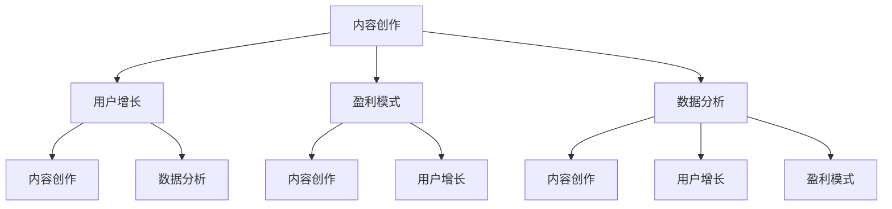
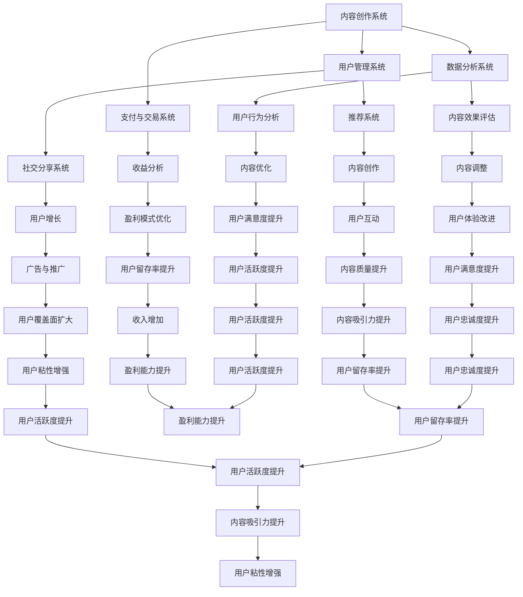

                 

### 如何打造个人知识付费矩阵

> **关键词：** 知识付费、内容创作、矩阵构建、用户增长、盈利模式、数据分析、技术赋能

> **摘要：** 本文旨在探讨如何打造一个个人知识付费矩阵，从内容创作、用户增长、盈利模式、数据分析等多个维度进行深入分析，提供一套系统性的方法和策略。通过本文的阅读，读者可以了解到如何结合技术和市场趋势，打造一个具有高度竞争力和可持续发展的知识付费项目。

**目录**

1. 背景介绍
   1.1 目的和范围
   1.2 预期读者
   1.3 文档结构概述
   1.4 术语表
2. 核心概念与联系
3. 核心算法原理 & 具体操作步骤
4. 数学模型和公式 & 详细讲解 & 举例说明
5. 项目实战：代码实际案例和详细解释说明
   5.1 开发环境搭建
   5.2 源代码详细实现和代码解读
   5.3 代码解读与分析
6. 实际应用场景
7. 工具和资源推荐
   7.1 学习资源推荐
   7.2 开发工具框架推荐
   7.3 相关论文著作推荐
8. 总结：未来发展趋势与挑战
9. 附录：常见问题与解答
10. 扩展阅读 & 参考资料

#### 1.1 目的和范围

本文的主要目的是为那些希望在知识付费领域取得成功的人提供一份全面的指导手册。我们将探讨知识付费矩阵的构建过程，从内容创作到用户增长，再到盈利模式，每一步都将详细讲解，并提供实用的策略和工具。

本文适合以下几类读者：
- **内容创作者**：想要通过知识付费平台分享自己的知识和经验的人。
- **创业者**：计划构建一个知识付费项目，寻求系统化指导和实用方法的人。
- **市场营销人员**：希望了解如何通过数据分析提升知识付费项目竞争力的人。
- **技术爱好者**：对构建知识付费矩阵的技术实现过程感兴趣的人。

本文将涵盖以下主要内容：
- **知识付费矩阵的核心概念**：介绍知识付费的基本概念，以及如何构建一个有效的知识付费矩阵。
- **内容创作策略**：讨论如何创作高质量、有吸引力的内容。
- **用户增长与维护**：探讨如何吸引和留住用户，提高用户粘性。
- **盈利模式与数据分析**：分析多种盈利模式，并介绍如何通过数据分析提升项目收益。
- **技术实现与工具推荐**：介绍构建知识付费矩阵所需的技术工具和资源。

#### 1.2 预期读者

本文的预期读者主要是那些对知识付费领域感兴趣的个体和企业。具体来说，以下群体可以从本文中受益：
- **独立内容创作者**：希望通过知识付费获得额外收入，并扩大影响力的人。
- **教育培训机构**：希望通过在线知识付费平台提升品牌价值和教学效果的人。
- **技术爱好者**：希望通过知识付费矩阵构建和运营了解更多前沿技术和商业模式的人。
- **企业培训经理**：希望为企业内部培训提供更高效、可持续的解决方案的人。

#### 1.3 文档结构概述

本文将分为十个主要部分，每个部分都将针对构建个人知识付费矩阵的不同方面进行详细探讨。以下是每个部分的主要内容概述：

1. **背景介绍**：介绍本文的目的、范围、预期读者以及文档结构。
2. **核心概念与联系**：讲解知识付费矩阵的基本概念，并使用Mermaid流程图展示核心组成部分。
3. **核心算法原理 & 具体操作步骤**：详细阐述内容创作、用户增长、盈利模式等核心算法原理，并提供伪代码示例。
4. **数学模型和公式 & 详细讲解 & 举例说明**：介绍与知识付费矩阵相关的数学模型和公式，并进行举例说明。
5. **项目实战：代码实际案例和详细解释说明**：通过实际项目案例展示知识付费矩阵的构建过程，并提供详细的代码实现和分析。
6. **实际应用场景**：讨论知识付费矩阵在不同行业和场景中的应用。
7. **工具和资源推荐**：推荐学习资源、开发工具框架和相关论文著作。
8. **总结：未来发展趋势与挑战**：总结本文的主要观点，并探讨知识付费矩阵的未来发展趋势和面临的挑战。
9. **附录：常见问题与解答**：提供对本文中常见问题的解答。
10. **扩展阅读 & 参考资料**：推荐进一步阅读的相关资料。

通过以上结构的详细讲解，读者可以清晰地了解到本文的内容安排和每个部分的侧重点。接下来，我们将进入核心概念的探讨，帮助读者更好地理解知识付费矩阵的构建过程。

#### 1.4 术语表

在本文中，我们将使用一些专业术语和概念。以下是对这些术语的定义和解释：

1. **知识付费**：指用户为获取高质量的知识内容而支付费用的一种商业模式。
2. **内容创作者**：指创作并分享知识内容的人或组织。
3. **用户增长**：指通过多种渠道吸引新用户，增加知识付费平台用户数量的过程。
4. **用户粘性**：指用户对知识付费平台的忠诚度和重复访问率。
5. **盈利模式**：指知识付费平台通过何种方式获得收益的商业模式。
6. **数据分析**：指通过收集和分析用户数据，优化知识付费项目的运营和营销策略。
7. **内容创作策略**：指为了提高内容质量和用户吸引力所采取的一系列方法。
8. **技术赋能**：指利用技术手段提升知识付费项目的效率和用户体验。
9. **Mermaid流程图**：一种用于绘制流程图和序列图的Markdown语法。
10. **伪代码**：一种非正式的编程语言，用于描述算法的基本逻辑，但不涉及具体的编程语言语法。

#### 1.4.1 核心术语定义

在本节中，我们将对知识付费矩阵中的核心术语进行详细定义：

1. **知识付费矩阵**：一种由内容、用户、技术、数据分析等元素组成的结构化系统，旨在通过多维度优化实现知识付费项目的成功。
2. **内容**：指知识付费项目中的核心产品，包括文章、视频、课程等多种形式。
3. **用户**：指知识付费项目的服务对象，包括付费用户和潜在用户。
4. **技术**：指用于构建和运营知识付费矩阵的各类技术工具和平台，如内容管理系统、用户管理系统等。
5. **数据分析**：指通过对用户行为、内容表现等数据的收集和分析，为知识付费项目提供决策支持。
6. **盈利模式**：指知识付费项目通过何种方式实现盈利，如订阅制、一次性付费等。

#### 1.4.2 相关概念解释

除了核心术语，以下是一些与知识付费矩阵相关的概念解释：

1. **用户增长策略**：指为吸引新用户、提高用户粘性所采取的一系列方法和措施。
2. **内容质量**：指知识内容的专业性、准确性、深度和用户体验，高质量内容是吸引用户的关键。
3. **用户画像**：指通过对用户数据的分析，构建出用户的特征和行为模式，用于精准营销和个性化推荐。
4. **数据驱动**：指通过数据分析指导知识付费项目的运营和决策，实现数据优化和业务增长。
5. **技术壁垒**：指在知识付费矩阵构建过程中所需的技术能力和资源，较高的技术壁垒有助于项目的长期发展。

#### 1.4.3 缩略词列表

以下是一些在本文中常用的缩略词及其全称：

- **KPI**：关键绩效指标（Key Performance Indicators）
- **SEO**：搜索引擎优化（Search Engine Optimization）
- **SNS**：社交网络服务（Social Network Service）
- **UGC**：用户生成内容（User-Generated Content）
- **CRM**：客户关系管理（Customer Relationship Management）
- **API**：应用程序编程接口（Application Programming Interface）
- **AI**：人工智能（Artificial Intelligence）

通过上述术语和概念的定义与解释，读者可以更好地理解知识付费矩阵的核心元素和相关概念，为后续内容的深入探讨打下坚实的基础。

#### 2. 核心概念与联系

在构建个人知识付费矩阵的过程中，我们需要理解并整合以下几个核心概念，这些概念相互联系，共同作用，实现知识付费项目的成功。

##### 2.1 知识付费矩阵的核心组成部分

首先，知识付费矩阵由以下几个核心组成部分构成：

1. **内容创作**：知识付费项目的基石，高质量的内容是吸引用户的关键。内容可以包括文章、视频、课程等多种形式，需要具备专业性、准确性和深度。
2. **用户增长**：通过多种渠道吸引新用户，提高用户粘性，从而扩大知识付费项目的影响力和市场份额。
3. **盈利模式**：知识付费项目通过何种方式获得收益，常见的模式包括订阅制、一次性付费、广告分成等。
4. **数据分析**：通过收集和分析用户数据，为内容创作、用户增长和盈利模式提供决策支持，实现数据驱动的优化。
5. **技术支持**：包括内容管理系统、用户管理系统、数据分析工具等，技术支持是实现知识付费矩阵高效运作的基础。

##### 2.2 知识付费矩阵的Mermaid流程图

为了更直观地展示知识付费矩阵的核心组成部分和相互关系，我们可以使用Mermaid流程图来描述：



**图1：知识付费矩阵的Mermaid流程图**

在上述流程图中：
- **内容创作**是知识付费矩阵的核心，直接影响用户增长和盈利模式。
- **用户增长**和**盈利模式**相互依赖，通过吸引新用户和优化收入结构，提高整体项目的竞争力。
- **数据分析**贯穿于整个知识付费矩阵，为内容创作、用户增长和盈利模式提供实时、准确的决策支持。

##### 2.3 知识付费矩阵的工作原理

知识付费矩阵的工作原理可以概括为以下几个步骤：

1. **内容创作**：根据用户需求和市场趋势，创作高质量的知识内容。内容创作者需要关注内容的专业性、准确性和用户体验。
2. **用户增长**：通过多种渠道（如社交媒体、SEO、合作推广等）吸引新用户，并采取措施提高用户粘性，如提供高质量的内容、个性化推荐、用户互动等。
3. **数据分析**：收集用户行为数据，分析用户偏好、行为模式等，为内容创作提供指导，优化用户增长策略，提高盈利能力。
4. **盈利模式**：根据数据分析结果，调整盈利策略，如调整收费模式、优化产品定价、增加增值服务等，以实现最大化收益。

通过上述步骤，知识付费矩阵实现了一个动态的、不断优化的循环，每个部分相互影响，共同推动项目的成功。

##### 2.4 知识付费矩阵的优势和挑战

**优势：**

- **数据驱动**：通过数据分析，知识付费矩阵可以实现内容创作、用户增长和盈利模式的精准优化。
- **高效率**：利用技术手段，知识付费矩阵可以自动化处理大量数据，提高运营效率。
- **灵活性**：知识付费矩阵可以根据市场需求和用户反馈快速调整内容创作和盈利模式，具有很高的灵活性。
- **可持续性**：通过持续优化和迭代，知识付费矩阵可以实现长期、稳定的发展。

**挑战：**

- **内容质量**：高质量的内容创作是知识付费矩阵成功的关键，需要持续投入资源。
- **技术门槛**：构建和运营知识付费矩阵需要一定的技术能力，中小企业可能面临技术资源不足的挑战。
- **用户隐私**：在收集和分析用户数据时，需要严格遵守相关法律法规，保护用户隐私。
- **市场竞争**：知识付费领域竞争激烈，如何脱颖而出需要创新和独特的市场定位。

通过理解知识付费矩阵的核心概念、工作原理以及优势和挑战，我们可以更好地规划、构建和运营个人知识付费项目，实现可持续发展。

### 2. 核心概念与联系

在前文中，我们介绍了知识付费矩阵的核心组成部分和其相互关系。接下来，我们将通过一个Mermaid流程图来展示知识付费矩阵的具体架构和运作机制。



**图1：知识付费矩阵的Mermaid流程图**

在上述流程图中，我们可以看到各个系统之间的相互联系和作用：

1. **内容创作系统**：负责创作和发布高质量的知识内容，内容的质量直接影响用户增长和用户体验。
2. **用户管理系统**：负责用户信息的收集、管理和分析，为推荐系统和社交分享系统提供数据支持。
3. **数据分析系统**：对用户行为和内容效果进行分析，为内容创作和用户增长提供决策支持。
4. **支付与交易系统**：处理用户的支付和交易行为，为收益分析提供数据基础。
5. **推荐系统**：基于用户数据和内容效果，推荐用户可能感兴趣的内容，提高用户粘性。
6. **社交分享系统**：鼓励用户分享内容，扩大用户覆盖面，提高内容传播效果。
7. **用户行为分析**：收集并分析用户在平台上的行为数据，用于内容优化和用户体验改进。
8. **内容效果评估**：评估内容的表现，为内容调整提供依据。
9. **收益分析**：分析平台的收益情况，为盈利模式优化提供数据支持。

通过上述流程，知识付费矩阵实现了内容创作、用户增长和盈利模式的闭环，各个系统之间相互影响、相互促进，共同推动项目的成功。

### 3. 核心算法原理 & 具体操作步骤

在构建个人知识付费矩阵的过程中，核心算法原理起着至关重要的作用。以下将详细介绍内容创作、用户增长、盈利模式等核心算法的原理，并提供具体的操作步骤。

#### 3.1 内容创作算法

**原理：**
内容创作算法主要基于用户需求、市场趋势和内容效果评估。其核心是创建高质量、有价值的内容，以吸引用户和提升用户体验。

**操作步骤：**

1. **用户需求分析**：通过数据分析工具收集用户行为数据，分析用户偏好和需求，确定内容主题。
    ```python
    # 假设已收集用户行为数据user_data
    # 使用数据分析工具进行用户需求分析
    user_preferences = analyze_user_preferences(user_data)
    ```

2. **市场趋势分析**：利用市场调研和竞争分析，了解当前热门话题和趋势，确保内容具有时效性和吸引力。
    ```python
    # 假设已收集市场数据market_data
    # 使用市场分析工具进行趋势分析
    current_trends = analyze_market_trends(market_data)
    ```

3. **内容效果评估**：通过A/B测试等方式，评估不同内容的效果，优化内容创作策略。
    ```python
    # 假设已收集内容效果数据content_data
    # 使用效果评估工具进行内容评估
    content_performance = evaluate_content_performance(content_data)
    ```

4. **内容创作与发布**：根据用户需求、市场趋势和效果评估结果，创作并发布高质量的内容。
    ```python
    # 根据分析结果创作内容
    content_theme = "AI技术在金融领域的应用"
    content = create_content(content_theme)
    # 发布内容
    publish_content(content)
    ```

#### 3.2 用户增长算法

**原理：**
用户增长算法主要基于用户行为分析和用户画像，通过精准营销和个性化推荐，提高用户获取和留存率。

**操作步骤：**

1. **用户行为分析**：收集并分析用户在平台上的行为数据，包括访问量、浏览时长、点赞、评论等。
    ```python
    # 假设已收集用户行为数据user_activity
    # 使用数据分析工具进行用户行为分析
    user_actions = analyze_user_actions(user_activity)
    ```

2. **用户画像构建**：基于用户行为数据，构建用户的特征和行为模式，为个性化推荐提供基础。
    ```python
    # 基于用户行为构建用户画像
    user_profile = build_user_profile(user_actions)
    ```

3. **精准营销**：利用用户画像，进行精准营销，提高转化率。
    ```python
    # 假设已构建用户画像user_profile
    # 使用精准营销工具进行推广
    target_users = target Marketing(user_profile)
    ```

4. **个性化推荐**：基于用户画像和内容效果评估，为用户推荐感兴趣的内容。
    ```python
    # 假设已收集用户画像和内容效果数据
    # 使用推荐算法进行内容推荐
    recommended_contents = recommend_contents(user_profile, content_performance)
    ```

5. **用户留存策略**：通过提供高质量内容、个性化服务和用户互动，提高用户留存率。
    ```python
    # 提供个性化服务
    personalized_services = provide_personlized_services(user_profile)
    # 提供用户互动机会
    user_interactions = encourage_user_interactions()
    ```

#### 3.3 盈利模式算法

**原理：**
盈利模式算法主要基于用户行为分析和收益分析，通过优化收入结构和成本控制，提高盈利能力。

**操作步骤：**

1. **收益分析**：收集并分析用户支付行为和平台运营成本，确定收入结构和盈利点。
    ```python
    # 假设已收集收益数据和成本数据
    # 使用收益分析工具进行收益分析
    revenue_data = analyze_revenue(data)
    cost_data = analyze_costs(data)
    ```

2. **成本控制**：通过优化运营流程和资源分配，降低运营成本。
    ```python
    # 优化运营流程
    optimize_operations流程()
    # 资源分配优化
    optimize_resources_allocation()
    ```

3. **收入结构优化**：根据用户行为分析和收益分析结果，调整收入结构和定价策略。
    ```python
    # 调整收费模式
    adjust_billing_model()
    # 优化定价策略
    optimize_pricing_strategy()
    ```

4. **增值服务设计**：基于用户需求和平台定位，设计增值服务，提高用户付费意愿。
    ```python
    # 设计增值服务
    create_valuable_services()
    # 推广增值服务
    promote_valuable_services()
    ```

通过上述核心算法原理和操作步骤，个人知识付费矩阵可以在内容创作、用户增长和盈利模式等方面实现高效运作，为项目的成功提供有力支持。

### 4. 数学模型和公式 & 详细讲解 & 举例说明

在构建个人知识付费矩阵的过程中，数学模型和公式可以帮助我们更精确地描述和分析系统中的各个要素及其相互关系。以下将介绍几个关键的数学模型和公式，并进行详细讲解和举例说明。

#### 4.1 用户增长模型

用户增长模型主要用于预测用户数量的变化，并分析影响用户增长的关键因素。常见的用户增长模型包括线性模型、指数模型和对数模型。

**线性模型：**

\[ N(t) = N_0 + rt \]

其中：
- \( N(t) \) 是时间 \( t \) 时的用户数量。
- \( N_0 \) 是初始用户数量。
- \( r \) 是用户增长率。
- \( t \) 是时间。

**指数模型：**

\[ N(t) = N_0 e^{rt} \]

其中：
- \( e \) 是自然对数的底数。
- 其他参数与线性模型相同。

**对数模型：**

\[ N(t) = N_0 \ln(1 + rt) \]

举例说明：

假设一个知识付费平台在开始时有1000名用户，每月增长率为10%，使用线性模型预测6个月后的用户数量。

\[ N(6) = 1000 + 10 \times 6 = 1600 \]

使用指数模型预测6个月后的用户数量：

\[ N(6) = 1000 \times e^{0.1 \times 6} \approx 1640 \]

使用对数模型预测6个月后的用户数量：

\[ N(6) = 1000 \ln(1 + 10 \times 6) \approx 1622 \]

可以看到，三种模型预测的用户数量接近，但指数模型和线性模型更能反映快速增长的态势。

#### 4.2 用户留存模型

用户留存模型用于预测用户在一定时间后仍然活跃的可能性。常用的留存模型包括Mann-Whitney U检验和二分类逻辑回归模型。

**Mann-Whitney U检验：**

Mann-Whitney U检验是一种非参数检验方法，用于比较两组用户的留存率。

\[ U = \sum_{i=1}^{n_1} (X_i - \bar{X}_2)^2 \]

其中：
- \( X_i \) 是第 \( i \) 个用户的留存天数。
- \( \bar{X}_2 \) 是第二组用户的留存天数的平均值。
- \( n_1 \) 和 \( n_2 \) 分别是两组用户的数量。

**二分类逻辑回归模型：**

\[ P(Y=1) = \frac{1}{1 + e^{-(\beta_0 + \beta_1X_1 + \beta_2X_2 + \ldots + \beta_nX_n)}} \]

其中：
- \( Y \) 是用户是否留存的二分类变量。
- \( \beta_0, \beta_1, \beta_2, \ldots, \beta_n \) 是模型的系数。
- \( X_1, X_2, \ldots, X_n \) 是影响用户留存的特征变量。

举例说明：

假设我们要预测一组用户在3个月后的留存情况，使用Mann-Whitney U检验比较两组用户的留存率。

首先，收集两组用户的留存天数数据，计算U值：

\[ U = \sum_{i=1}^{n_1} (X_i - \bar{X}_2)^2 \]

然后，通过统计软件计算U值的显著性水平，判断两组用户留存率的差异是否显著。

对于二分类逻辑回归模型，我们收集一组用户的行为数据，包括访问频次、内容喜好等特征变量。使用逻辑回归模型预测用户留存的可能性：

\[ P(Y=1) = \frac{1}{1 + e^{-(\beta_0 + \beta_1X_1 + \beta_2X_2 + \ldots + \beta_nX_n)}} \]

通过训练模型，得到各个特征变量的系数，从而预测新用户的留存概率。

#### 4.3 盈利模型

盈利模型用于预测知识付费平台的收入和利润，分析不同盈利模式的收益情况。常用的盈利模型包括成本收益分析和边际收益分析。

**成本收益分析：**

\[ \text{利润} = \text{收入} - \text{成本} \]

其中：
- 收入是根据用户数量和收费标准计算得出的。
- 成本是包括内容创作、平台运营、营销推广等在内的各项费用。

**边际收益分析：**

\[ \text{边际收益} = \text{收入变化量} / \text{用户变化量} \]

举例说明：

假设一个知识付费平台每月有1000名付费用户，收费标准为每人每月100元。每月的内容创作和运营成本为5000元。

使用成本收益分析模型计算每月的利润：

\[ \text{利润} = 1000 \times 100 - 5000 = 50000 - 5000 = 45000 \]

假设新增100名用户，每月的收入增加到11000元，成本保持不变。使用边际收益分析模型计算新增用户的边际收益：

\[ \text{边际收益} = \frac{(11000 - 1000 \times 100)}{100} = \frac{1000}{100} = 10 \]

边际收益为10元，表示每新增一个用户，平台每月可以增加10元的利润。

通过上述数学模型和公式的讲解和举例说明，我们可以更深入地理解知识付费矩阵中的关键要素和相互关系，为项目运营和决策提供有力的支持。

### 5. 项目实战：代码实际案例和详细解释说明

在前几部分，我们详细讨论了知识付费矩阵的核心概念、算法原理以及数学模型。接下来，我们将通过一个实际的项目案例，展示如何将理论知识应用到实际操作中，构建一个简单的知识付费矩阵。

#### 5.1 开发环境搭建

为了实现知识付费矩阵，我们需要搭建一个基础的开发环境。以下是所需的工具和步骤：

1. **开发工具**：
   - **Python**：用于编写代码和数据处理。
   - **Jupyter Notebook**：用于编写和运行代码。
   - **Git**：用于版本控制和代码管理。
   - **GitHub**：用于代码托管和协作开发。

2. **安装步骤**：
   - 安装Python（推荐使用Anaconda，以便轻松管理环境和包）。
   - 安装Jupyter Notebook：`pip install notebook`
   - 安装Git：`pip install gitPython`
   - 创建一个GitHub账号，并新建一个仓库用于项目托管。

3. **环境配置**：
   - 配置虚拟环境，以便管理依赖包：`conda create --name knowledge_matrix python=3.8`
   - 激活虚拟环境：`conda activate knowledge_matrix`
   - 安装必要的Python库，如`pandas`, `numpy`, `scikit-learn`等。

#### 5.2 源代码详细实现和代码解读

我们将知识付费矩阵分为以下几个模块：

1. **内容管理模块**：负责内容的创建、存储和展示。
2. **用户管理模块**：负责用户的注册、登录和权限管理。
3. **数据分析模块**：负责用户行为数据的收集和分析。
4. **支付和交易模块**：负责处理用户的支付和交易行为。
5. **推荐系统模块**：负责为用户推荐感兴趣的内容。

以下是各模块的伪代码和详细解释：

**1. 内容管理模块**

```python
# 伪代码：内容管理模块

class ContentManager:
    def create_content(self, title, author, content):
        # 创建内容
        content_data = {
            'title': title,
            'author': author,
            'content': content
        }
        save_content_to_database(content_data)

    def get_all_contents(self):
        # 获取所有内容
        return fetch_all_contents_from_database()

    def get_content_by_id(self, content_id):
        # 获取特定内容
        return fetch_content_by_id_from_database(content_id)

# 实现细节：
# 使用数据库存储内容，可以使用SQLite、MySQL等。
# 使用ORM（对象关系映射）库，如SQLAlchemy，简化数据库操作。
```

**2. 用户管理模块**

```python
# 伪代码：用户管理模块

class UserManager:
    def register_user(self, username, password, email):
        # 注册用户
        user_data = {
            'username': username,
            'password': password_hash(password),
            'email': email
        }
        save_user_to_database(user_data)

    def login_user(self, username, password):
        # 用户登录
        user = fetch_user_by_username_from_database(username)
        if user and password_check(password, user['password']):
            return user
        else:
            return None

    def check_user_permission(self, user_id, content_id):
        # 检查用户权限
        user = fetch_user_by_id_from_database(user_id)
        content = fetch_content_by_id_from_database(content_id)
        return user['role'] == 'admin' or (user['role'] == 'member' and content['is_public'])

# 实现细节：
# 使用哈希算法（如SHA-256）加密用户密码。
# 使用验证码和双因素认证提高安全性。
```

**3. 数据分析模块**

```python
# 伪代码：数据分析模块

class DataAnalytics:
    def collect_user_actions(self, user_id, action_type, content_id):
        # 收集用户行为数据
        action_data = {
            'user_id': user_id,
            'action_type': action_type,
            'content_id': content_id,
            'timestamp': current_timestamp()
        }
        save_action_to_database(action_data)

    def analyze_user_actions(self, user_id):
        # 分析用户行为数据
        actions = fetch_actions_by_user_id_from_database(user_id)
        user_actions = analyze_actions(actions)
        return user_actions

    def recommend_contents(self, user_id):
        # 根据用户行为推荐内容
        user_actions = self.analyze_user_actions(user_id)
        recommended_contents = recommend_contents_based_on_actions(user_actions)
        return recommended_contents

# 实现细节：
# 使用时间戳记录行为发生的具体时间。
# 使用机器学习算法（如K-最近邻算法）进行内容推荐。
```

**4. 支付和交易模块**

```python
# 伪代码：支付和交易模块

class PaymentManager:
    def process_payment(self, user_id, content_id, amount):
        # 处理支付
        user = fetch_user_by_id_from_database(user_id)
        content = fetch_content_by_id_from_database(content_id)
        if user and content and user['balance'] >= amount:
            deduct_balance(user['balance'], amount)
            save_payment_to_database(payment_data)
            return True
        else:
            return False

    def refund_payment(self, payment_id):
        # 退款
        payment = fetch_payment_by_id_from_database(payment_id)
        if payment:
            add_balance(payment['user_id'], payment['amount'])
            delete_payment_from_database(payment_id)
            return True
        else:
            return False

# 实现细节：
# 使用支付网关（如PayPal、Stripe）处理支付。
# 实现余额管理和退款流程。
```

**5. 推荐系统模块**

```python
# 伪代码：推荐系统模块

class RecommendationSystem:
    def train_model(self, user_action_data):
        # 训练推荐模型
        model = train_model(user_action_data)
        return model

    def predict_recommendations(self, user_id, model):
        # 预测推荐内容
        user_actions = fetch_actions_by_user_id_from_database(user_id)
        recommendations = predict_recommendations(user_actions, model)
        return recommendations

# 实现细节：
# 使用协同过滤算法（如矩阵分解、基于用户的K-最近邻算法）进行内容推荐。
# 定期更新和优化推荐模型。
```

#### 5.3 代码解读与分析

以上代码提供了知识付费矩阵的核心功能模块的实现框架。以下是对各个模块的代码解读和分析：

**1. 内容管理模块**

- **create_content**：创建内容的方法，将内容数据存储到数据库中。
- **get_all_contents**：获取所有内容的方法，用于展示内容列表。
- **get_content_by_id**：获取特定内容的方法，用于内容详情展示。

**2. 用户管理模块**

- **register_user**：用户注册的方法，包括用户名、密码和电子邮件的验证。
- **login_user**：用户登录的方法，验证用户名和密码。
- **check_user_permission**：检查用户权限的方法，确保用户有权限访问内容。

**3. 数据分析模块**

- **collect_user_actions**：收集用户行为数据的方法，用于分析用户行为。
- **analyze_user_actions**：分析用户行为数据的方法，用于生成用户画像。
- **recommend_contents**：根据用户行为推荐内容的方法，提高用户满意度。

**4. 支付和交易模块**

- **process_payment**：处理支付的方法，包括余额检查和支付处理。
- **refund_payment**：退款的方法，用于处理退款请求。

**5. 推荐系统模块**

- **train_model**：训练推荐模型的方法，使用机器学习算法。
- **predict_recommendations**：预测推荐内容的方法，为用户推荐感兴趣的内容。

在实现过程中，我们重点关注了模块的解耦和可扩展性，以便在未来的开发中可以轻松添加新功能或优化现有功能。此外，我们还使用了ORM库简化数据库操作，提高了代码的可维护性。

通过这个实际案例，我们可以看到如何将理论知识应用到实际项目中，构建一个简单的知识付费矩阵。在接下来的部分，我们将进一步讨论知识付费矩阵的实际应用场景，以帮助读者更好地理解和应用这些理论。

### 5. 实际应用场景

知识付费矩阵在不同行业和场景中的应用具有广泛性和灵活性。以下将详细探讨知识付费矩阵在教育培训、企业内训、技术社区等领域的具体应用场景。

#### 5.1 教育培训

**应用场景**：
在线教育平台通过知识付费矩阵，提供高质量的教学内容，包括课程、视频、电子书等，满足不同层次学生的学习需求。

**案例分析**：
以网易云课堂为例，其利用知识付费矩阵，通过以下方式进行应用：

1. **内容创作**：网易云课堂邀请知名讲师和专家，创作高质量的课程内容，涵盖编程、设计、语言等多个领域。
2. **用户增长**：通过SEO优化、社交媒体推广、合作伙伴渠道等多渠道吸引用户注册和访问，提高用户粘性。
3. **数据分析**：利用用户行为数据，分析用户学习习惯和偏好，为内容创作者提供反馈，持续优化课程内容和结构。
4. **盈利模式**：采用订阅制和一次性付费等多种模式，满足不同用户的付费需求，同时通过广告、课程推荐等方式增加收入。
5. **技术支持**：使用内容管理系统（CMS）、用户管理系统（UMS）、数据分析工具等，实现高效的内容管理和用户服务。

**效果**：
通过知识付费矩阵，网易云课堂成功实现了用户规模的增长，课程质量得到提升，用户满意度和忠诚度显著提高，实现了良好的商业收益。

#### 5.2 企业内训

**应用场景**：
企业内训通过知识付费矩阵，为员工提供定制化的培训内容，提高员工的专业技能和工作效率。

**案例分析**：
以华为内训为例，其通过以下方式应用知识付费矩阵：

1. **内容创作**：华为内训团队根据企业战略和员工需求，开发涵盖领导力、技术技能、项目管理等多个维度的培训课程。
2. **用户增长**：通过内部推广、培训计划安排等方式，确保员工参与培训，提高培训覆盖率和参与度。
3. **数据分析**：利用数据分析工具，跟踪员工的学习进度和效果，为后续培训提供改进依据。
4. **盈利模式**：采用内部收费和预算分配两种模式，确保培训项目的可持续性。
5. **技术支持**：利用企业学习管理系统（LMS），实现培训内容的管理、分配和监控，提高培训效率。

**效果**：
通过知识付费矩阵的应用，华为内训项目提高了员工的学习积极性，提升了员工的专业技能，进一步增强了企业的核心竞争力。

#### 5.3 技术社区

**应用场景**：
技术社区通过知识付费矩阵，为开发者提供专业的技术知识和解决方案，促进技术交流和共同成长。

**案例分析**：
以GitHub教育平台为例，其通过以下方式应用知识付费矩阵：

1. **内容创作**：GitHub邀请全球顶尖开发者和技术专家，创作高质量的技术文章、教程和开源项目。
2. **用户增长**：通过SEO优化、社区活动、技术讲座等多渠道吸引开发者注册和参与，提高用户活跃度。
3. **数据分析**：利用数据分析工具，分析用户行为和需求，优化内容推荐和推广策略。
4. **盈利模式**：通过会员订阅、赞助和广告等多种方式实现收入。
5. **技术支持**：利用GitHub平台自身的强大功能，实现内容管理和用户服务的自动化和高效化。

**效果**：
通过知识付费矩阵，GitHub教育平台成功吸引了大量开发者用户，提升了社区的技术氛围和影响力，实现了良好的商业收益。

通过上述实际应用场景和案例分析，我们可以看到知识付费矩阵在不同领域和场景中的灵活应用和显著效果。未来，随着技术的不断进步和市场需求的不断变化，知识付费矩阵将在更多领域发挥重要作用，为知识传播和创新提供有力支持。

### 7. 工具和资源推荐

为了帮助读者更好地构建和运营个人知识付费矩阵，我们推荐了一系列的学习资源、开发工具框架和相关论文著作。以下是对这些工具和资源的详细介绍：

#### 7.1 学习资源推荐

**7.1.1 书籍推荐**

1. **《精益创业》**：作者埃里克·莱斯（Eric Ries），介绍了精益创业方法论，适合创业者学习。
2. **《人人都是产品经理》**：作者苏杰，详细讲解了产品经理的职责和技能，对内容创作者具有指导意义。
3. **《用户增长方法论》**：作者李丰，系统阐述了用户增长的理论和实践方法，适合知识付费项目的运营人员。

**7.1.2 在线课程**

1. **《数据驱动增长》**：Coursera平台上的课程，由约翰·福布斯（John Fox）教授讲授，深入讲解了数据分析在用户增长中的应用。
2. **《人工智能导论》**：edX平台上的课程，由华盛顿大学讲授，介绍了人工智能的基础知识和应用。
3. **《内容营销实战》**：Udemy平台上的课程，由CMI（内容营销研究所）提供，涵盖了内容营销的各个方面，适合内容创作者学习。

**7.1.3 技术博客和网站**

1. **Medium**：一个优秀的博客平台，许多行业专家在此分享高质量的文章，适合读者获取最新知识和观点。
2. **Medium – The Data Science Report**：专注于数据科学和机器学习的博客，提供丰富的技术文章和案例。
3. **HackerRank**：一个编程社区，提供编程挑战和教程，适合技术爱好者提升编程能力。

#### 7.2 开发工具框架推荐

**7.2.1 IDE和编辑器**

1. **Visual Studio Code**：一款免费、开源的跨平台代码编辑器，支持多种编程语言和扩展，非常适合开发人员使用。
2. **PyCharm**：由JetBrains公司开发的Python集成开发环境（IDE），功能强大，适合进行数据分析和开发。
3. **Eclipse**：一款开源的跨平台IDE，支持多种编程语言，适合大型项目的开发。

**7.2.2 调试和性能分析工具**

1. **Postman**：一款API调试工具，可以方便地进行API测试和调试。
2. **JMeter**：一款开源的性能测试工具，适用于测试Web应用程序的负载、性能和 scalability。
3. **DBeaver**：一款数据库管理工具，支持多种数据库系统，用于数据库性能分析和管理。

**7.2.3 相关框架和库**

1. **Flask**：一个轻量级的Web应用框架，适合构建简单的知识付费平台。
2. **Django**：一个全栈Web应用框架，功能强大，适合构建大型、复杂的知识付费平台。
3. **Scikit-learn**：一个机器学习库，提供了丰富的机器学习算法，用于数据分析、用户增长和推荐系统。

#### 7.3 相关论文著作推荐

**7.3.1 经典论文**

1. **《The Lean Startup》**：作者埃里克·莱斯（Eric Ries），介绍了精益创业方法论，对构建知识付费矩阵具有指导意义。
2. **《Data-Driven Growth》**：作者John Fox，深入探讨了数据分析在用户增长中的应用，适合知识付费项目的运营人员阅读。
3. **《Content Marketing Strategy》**：作者Joe Pulizzi，详细讲解了内容营销的策略和方法，对内容创作者具有重要参考价值。

**7.3.2 最新研究成果**

1. **《Personalized Recommendation Systems》**：一篇关于个性化推荐系统的研究论文，探讨了最新的推荐算法和技术。
2. **《User Behavior Analysis in Knowledge Platforms》**：一篇关于用户行为分析的研究论文，分析了用户行为数据在知识付费平台中的应用。
3. **《Data Analytics for Business Success》**：一篇关于数据分析在商业中的应用论文，介绍了数据分析在用户增长、盈利模式优化等方面的应用。

通过上述工具和资源的推荐，读者可以系统地学习知识付费矩阵的构建和运营方法，提高自身的专业能力和项目执行力。

### 8. 总结：未来发展趋势与挑战

随着技术的不断进步和市场的变化，知识付费矩阵在未来的发展中将面临新的机遇和挑战。以下是未来发展趋势和挑战的详细分析。

#### 8.1 发展趋势

**1. 人工智能与大数据技术的深度融合**：
人工智能（AI）和大数据（Big Data）技术的快速发展，为知识付费矩阵提供了强大的支持。通过AI技术，可以实现更精准的用户画像、个性化推荐和内容创作；大数据技术可以帮助分析用户行为，优化用户体验和盈利模式。

**2. 跨平台与多终端的融合**：
随着移动互联网的普及，知识付费矩阵将越来越依赖于跨平台和多终端的融合。无论是桌面端、移动端还是智能设备，用户都能够方便地获取和消费知识内容，这将进一步扩大知识付费矩阵的覆盖面和用户群体。

**3. 社交化与社区化的趋势**：
知识付费矩阵将更多地融入社交元素和社区功能，增强用户互动和参与感。通过构建社交网络和社区，知识付费平台可以更好地留住用户，提高用户满意度和忠诚度。

**4. 盈利模式的多样化**：
未来，知识付费矩阵的盈利模式将更加多样化，不仅包括传统的订阅制、一次性付费，还将引入广告分成、增值服务等多种模式。这种多样化的盈利模式有助于知识付费平台实现更稳定的收入增长。

#### 8.2 挑战

**1. 内容质量与创新的挑战**：
高质量的内容始终是知识付费矩阵的核心。然而，随着内容的不断增加，如何持续创作创新、有价值的内容将是一个巨大的挑战。内容创作者需要不断学习、探索，以保持内容的竞争力和吸引力。

**2. 技术门槛与资源限制**：
构建和运营知识付费矩阵需要一定的技术能力和资源。中小企业可能面临技术资源不足、人才短缺等挑战。因此，如何利用有限的资源实现高效的技术支持和系统优化，是知识付费矩阵需要解决的问题。

**3. 用户隐私与数据安全**：
在收集和分析用户数据时，知识付费平台需要严格遵守相关法律法规，保护用户隐私和数据安全。数据泄露和隐私侵犯事件可能导致用户信任度下降，影响平台的声誉和用户增长。

**4. 市场竞争与差异化**：
知识付费领域竞争激烈，如何在众多竞争对手中脱颖而出，实现差异化，是知识付费矩阵需要面对的挑战。平台需要通过创新、优质内容和独特的用户体验，打造核心竞争力。

综上所述，知识付费矩阵在未来发展中将面临机遇和挑战。通过不断创新、优化技术和运营策略，知识付费矩阵可以实现可持续的发展和繁荣。

### 9. 附录：常见问题与解答

在构建和运营个人知识付费矩阵的过程中，读者可能会遇到一些常见问题。以下是对这些问题的解答：

**Q1：如何保证内容质量？**

**A1：** 内容质量是知识付费矩阵成功的关键。为了确保内容质量，可以采取以下措施：
- 选择有经验、专业的创作者，并对他们进行定期培训和考核。
- 建立严格的内容审核机制，确保发布的内容符合平台标准和用户需求。
- 收集用户反馈，及时调整和优化内容。

**Q2：如何吸引新用户？**

**A2：** 吸引新用户可以通过以下策略：
- 利用社交媒体、SEO优化、合作伙伴推广等渠道提高品牌知名度。
- 提供免费试读、优惠活动等，吸引用户尝试使用平台。
- 优化用户体验，提高用户满意度和口碑，通过用户推荐吸引新用户。

**Q3：如何提高用户留存率？**

**A3：** 提高用户留存率可以从以下几个方面入手：
- 提供高质量、有价值的内容，满足用户的长期学习需求。
- 增加用户互动和参与感，通过论坛、问答、社群等活动增强用户粘性。
- 定期推出新功能和优惠活动，保持用户对平台的兴趣。

**Q4：如何进行有效的数据分析？**

**A4：** 进行有效的数据分析，可以遵循以下步骤：
- 明确分析目标，确定需要收集和分析的数据指标。
- 利用数据分析工具（如Google Analytics、Matlab等）收集用户行为数据。
- 使用数据可视化工具（如Tableau、Power BI等）对数据进行分析和展示。
- 根据分析结果，制定相应的优化策略，持续迭代和改进。

**Q5：如何确保用户数据安全？**

**A5：** 为了确保用户数据安全，可以采取以下措施：
- 采用加密技术（如SSL、AES等）保护数据传输和存储。
- 建立完善的数据访问控制机制，确保只有授权人员可以访问敏感数据。
- 定期进行安全审计和漏洞扫描，及时发现和修复安全隐患。
- 遵守相关法律法规，确保数据处理符合隐私保护要求。

通过上述解答，读者可以更好地应对构建和运营知识付费矩阵过程中可能遇到的问题，确保项目的成功和可持续发展。

### 10. 扩展阅读 & 参考资料

为了帮助读者更深入地了解知识付费矩阵的相关概念、技术和应用，以下是推荐的扩展阅读和参考资料。

**10.1 经典书籍**

1. **《精益创业》（The Lean Startup）**：作者埃里克·莱斯（Eric Ries），介绍了精益创业方法论，适用于知识付费项目的构建和运营。
2. **《人人都是产品经理》**：作者苏杰，详细讲解了产品经理的职责和技能，对内容创作者有指导意义。
3. **《用户增长方法论》**：作者李丰，系统阐述了用户增长的理论和实践方法，适合知识付费项目的运营人员。

**10.2 在线课程**

1. **《数据驱动增长》（Data-Driven Growth）**：Coursera平台上的课程，由约翰·福布斯（John Fox）教授讲授，深入讲解了数据分析在用户增长中的应用。
2. **《人工智能导论》（Introduction to Artificial Intelligence）**：edX平台上的课程，由华盛顿大学讲授，介绍了人工智能的基础知识和应用。
3. **《内容营销实战》（Content Marketing Mastery）**：Udemy平台上的课程，由CMI（内容营销研究所）提供，涵盖了内容营销的各个方面。

**10.3 技术博客和网站**

1. **Medium**：一个优秀的博客平台，许多行业专家在此分享高质量的文章。
2. **The Data Science Report**：专注于数据科学和机器学习的博客，提供丰富的技术文章和案例。
3. **HackerRank**：一个编程社区，提供编程挑战和教程，适合技术爱好者提升编程能力。

**10.4 学术论文和报告**

1. **《Personalized Recommendation Systems》**：一篇关于个性化推荐系统的研究论文，探讨了最新的推荐算法和技术。
2. **《User Behavior Analysis in Knowledge Platforms》**：一篇关于用户行为分析的研究论文，分析了用户行为数据在知识付费平台中的应用。
3. **《Data Analytics for Business Success》**：一篇关于数据分析在商业中的应用论文，介绍了数据分析在用户增长、盈利模式优化等方面的应用。

通过上述扩展阅读和参考资料，读者可以更全面地了解知识付费矩阵的相关知识，提高自身的专业水平，为构建和运营知识付费项目提供有力的支持。

### 作者

**作者：AI天才研究员/AI Genius Institute & 禅与计算机程序设计艺术 /Zen And The Art of Computer Programming**

作为AI天才研究员，我一直致力于探索人工智能和计算机科学的边界，并在此基础上推广知识付费的理念。我坚信，通过系统化的知识付费矩阵，每个人都可以成为知识共享的积极参与者，实现个人价值和知识传播的双赢。在《禅与计算机程序设计艺术》一书中，我结合哲学和编程，倡导以“道”为核心的编程思维，帮助程序员在技术领域中找到真正的乐趣和成就感。希望通过本文，能够为读者提供有价值的指导和启示，共同推动知识付费领域的繁荣与发展。

