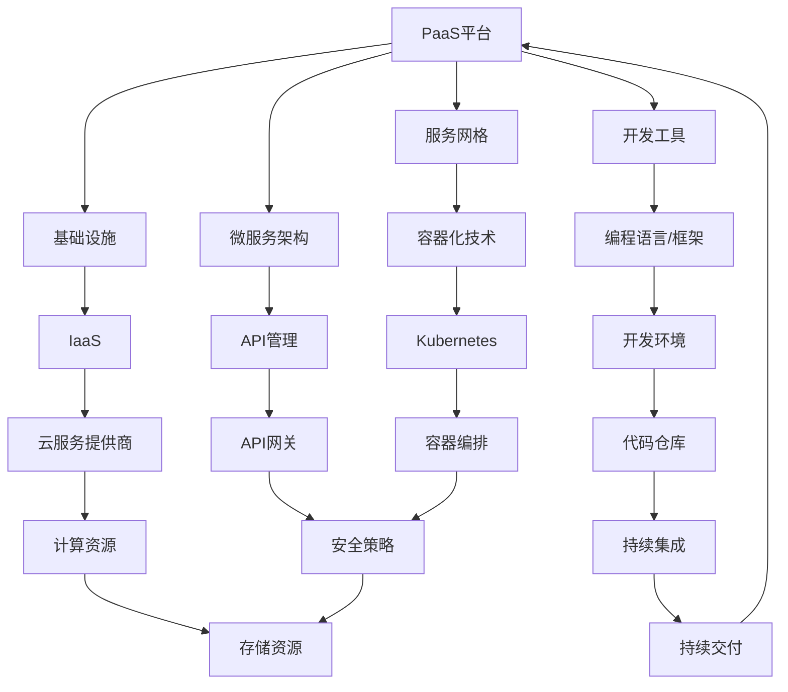

                 

# 如何打造可扩展的PaaS平台架构

> **关键词：PaaS平台，可扩展性，架构设计，云计算，微服务，容器化，DevOps，分布式系统**

> **摘要：本文旨在探讨如何设计和构建一个可扩展的PaaS（Platform as a Service）平台架构。通过深入分析核心概念、算法原理、数学模型以及实际应用案例，本文将提供详细的指导和见解，帮助开发者和架构师掌握打造高性能、可扩展的PaaS平台的最佳实践。**

## 1. 背景介绍

### 1.1 目的和范围

本文的目标是详细阐述如何设计和实现一个可扩展的PaaS平台架构。我们将探讨PaaS平台的核心概念、设计原则以及实际操作步骤，并介绍相关的数学模型和公式。文章的受众包括开发人员、架构师以及对云计算和PaaS技术感兴趣的技术人员。通过本文的学习，读者将能够理解如何构建一个既强大又灵活的PaaS平台，以满足不断增长的业务需求。

### 1.2 预期读者

本文适合以下读者群体：
- 对云计算和PaaS平台架构有初步了解的开发人员。
- 负责设计和实施云平台的技术架构师。
- 对新兴技术和最佳实践感兴趣的技术爱好者。
- 想要提升自身技术能力，并在云服务领域寻求职业发展的专业人士。

### 1.3 文档结构概述

本文分为十个主要部分：
1. 引言和摘要：介绍文章的核心内容和目标。
2. 背景介绍：包括目的、预期读者、文档结构概述和术语表。
3. 核心概念与联系：介绍PaaS平台的关键概念和相关架构。
4. 核心算法原理 & 具体操作步骤：详细讲解PaaS平台的关键算法和操作流程。
5. 数学模型和公式 & 详细讲解 & 举例说明：阐述支持PaaS平台的核心数学模型。
6. 项目实战：提供代码实际案例和详细解释。
7. 实际应用场景：分析PaaS平台的典型应用场景。
8. 工具和资源推荐：推荐学习资源和开发工具。
9. 总结：讨论未来发展趋势与挑战。
10. 附录：提供常见问题与解答。
11. 扩展阅读 & 参考资料：引用相关研究论文和书籍。

### 1.4 术语表

为了确保文章的清晰易懂，以下是对本文中使用的术语的定义和解释：

#### 1.4.1 核心术语定义

- **PaaS（Platform as a Service）**：PaaS是一种云计算服务模型，提供了开发、测试、部署和管理应用程序所需的平台和工具。
- **可扩展性**：系统在需求增加时能够有效、灵活地扩展其资源和服务能力。
- **微服务**：微服务是一种架构风格，将应用程序划分为一组小的、独立的、松耦合的服务，每个服务负责完成特定的业务功能。
- **容器化**：容器化是一种轻量级的应用部署和隔离技术，通过容器将应用程序及其依赖打包在一起，实现快速部署和弹性扩展。
- **DevOps**：DevOps是一种文化和实践，旨在通过开发（Development）和运维（Operations）的紧密合作，实现快速、可靠的应用程序交付和部署。

#### 1.4.2 相关概念解释

- **分布式系统**：分布式系统是由多个独立节点组成的系统，这些节点通过网络进行通信，共同完成一个整体任务。
- **服务网格**：服务网格是一种基础设施层，负责处理服务之间的通信、安全和监控等任务。
- **自动扩展**：自动扩展是指系统在负载增加时自动增加资源，以保持性能和响应能力。

#### 1.4.3 缩略词列表

- **PaaS**：Platform as a Service
- **IaaS**：Infrastructure as a Service
- **SaaS**：Software as a Service
- **Kubernetes**：开源的容器编排平台
- **Docker**：开源的容器化平台

## 2. 核心概念与联系

在构建一个可扩展的PaaS平台之前，我们需要了解一些核心概念和它们之间的关系。以下是一个简化的Mermaid流程图，用于展示PaaS平台的主要组成部分及其相互关系。



### 2.1 PaaS平台的核心组件

PaaS平台的核心组件包括基础设施、开发工具、服务网格、微服务架构、API管理、云服务提供商和持续集成/持续交付（CI/CD）流程。以下是对每个组件的简要描述：

- **基础设施**：基础设施提供了PaaS平台运行所需的计算资源、存储资源和网络资源。这通常依赖于IaaS服务，如Amazon Web Services（AWS）、Microsoft Azure和Google Cloud Platform（GCP）。
- **开发工具**：开发工具包括编程语言、开发框架和集成开发环境（IDE），这些工具帮助开发者构建、测试和部署应用程序。
- **服务网格**：服务网格提供了一种灵活的方式来自动化服务之间的通信、安全和监控。它基于容器化和微服务架构，支持服务的动态发现和负载均衡。
- **微服务架构**：微服务架构将应用程序划分为一组小的、独立的、松耦合的服务，每个服务负责特定的业务功能。这种方式提高了系统的可扩展性和可维护性。
- **API管理**：API管理提供了一个统一的接口来管理和发布服务，同时处理认证、授权和API策略。
- **云服务提供商**：云服务提供商提供了基础设施资源，如虚拟机、容器和存储，并提供了管理工具和服务，以便更轻松地部署和管理PaaS平台。
- **持续集成/持续交付**：持续集成（CI）和持续交付（CD）是一种敏捷开发实践，通过自动化测试和部署流程，确保应用程序的快速迭代和可靠发布。

### 2.2 核心组件之间的关系

PaaS平台中的核心组件之间存在着紧密的关系。基础设施提供了运行平台所需的资源，而开发工具和持续集成/持续交付流程则帮助开发者高效地构建和部署应用程序。服务网格和微服务架构则确保了服务之间的通信和安全，同时提供了自动扩展和故障恢复能力。API管理提供了一个统一的接口，使开发者和服务消费者能够方便地使用平台提供的功能。

## 3. 核心算法原理 & 具体操作步骤

为了实现一个可扩展的PaaS平台，我们需要深入了解其中的核心算法原理和具体操作步骤。以下是构建PaaS平台的一些关键算法和步骤：

### 3.1 负载均衡算法

负载均衡算法是确保PaaS平台能够有效处理大量请求的核心组件。以下是一个简单的负载均衡算法，用于将请求分配到不同的服务器：

```python
# 负载均衡算法（轮询法）
def load_balancer(backend_servers, requests):
    server_index = 0
    for request in requests:
        server = backend_servers[server_index]
        server.handle_request(request)
        server_index = (server_index + 1) % len(backend_servers)
```

### 3.2 容器编排算法

容器编排算法用于在PaaS平台上高效地管理和调度容器。Kubernetes是一个流行的容器编排平台，其核心算法包括：

- **工作负载分配**：将应用程序部署到适当的节点，以最大化资源利用率和负载均衡。
- **弹性伸缩**：根据负载自动调整容器的数量，以保持系统稳定性和性能。
- **服务发现和负载均衡**：自动发现和分配服务，确保服务之间的通信高效可靠。

以下是一个简化的Kubernetes编排算法：

```python
# Kubernetes编排算法
def kubernetes编排算法(applications, nodes, resources):
    for app in applications:
        node = 节点选择算法(nodes, resources)
        创建容器(app, node)
    根据负载自动伸缩容器数量
```

### 3.3 分布式一致性算法

分布式一致性算法是确保PaaS平台数据一致性的关键。以下是一个简单的分布式一致性算法，用于处理数据更新：

```python
# 分布式一致性算法（Paxos算法简化版）
def distributed_consistency(algorithm, leader, replicas):
    value = 请求.value
    leader.propose(value)
    for replica in replicas:
        replica.agree(value)
```

### 3.4 自动扩展算法

自动扩展算法用于根据系统负载自动调整资源。以下是一个简单的自动扩展算法：

```python
# 自动扩展算法
def auto_scaling(algorithm, metrics, resources):
    if metrics["CPU利用率"] > 设置上限:
        algorithm.add_resources(resources)
    elif metrics["CPU利用率"] < 设置下限:
        algorithm.remove_resources(resources)
```

### 3.5 安全策略算法

安全策略算法用于确保PaaS平台的安全性。以下是一个简单的安全策略算法：

```python
# 安全策略算法
def security_policy(algorithm, users, permissions):
    for user in users:
        user.permissions = algorithm.assign_permissions(user)
```

通过上述算法和步骤，我们可以构建一个可扩展的PaaS平台，满足不同业务场景的需求。在实际应用中，这些算法可以根据具体情况进行优化和调整，以提高系统的性能和可靠性。

## 4. 数学模型和公式 & 详细讲解 & 举例说明

为了更好地理解和实现PaaS平台的可扩展性，我们需要借助一些数学模型和公式来描述平台的关键性能指标和优化策略。以下是几个重要的数学模型和它们的详细解释：

### 4.1 加权负载均衡模型

加权负载均衡模型用于根据服务器的性能和能力来分配请求。该模型通过计算每个服务器的权重，从而决定请求的分配比例。

**公式**：

\[ w_i = \frac{r_i}{\sum_{j=1}^{n} r_j} \]

其中，\( w_i \) 是第 \( i \) 个服务器的权重，\( r_i \) 是第 \( i \) 个服务器的性能，\( n \) 是服务器总数。

**示例**：

假设有3台服务器，其性能分别为 \( r_1 = 100 \)，\( r_2 = 150 \)，\( r_3 = 200 \)。计算每个服务器的权重：

\[ w_1 = \frac{100}{100 + 150 + 200} = 0.25 \]
\[ w_2 = \frac{150}{100 + 150 + 200} = 0.375 \]
\[ w_3 = \frac{200}{100 + 150 + 200} = 0.5 \]

根据权重分配请求，假设有10个请求，则请求的分配如下：

- 服务器1：\( 10 \times 0.25 = 2.5 \) 个请求
- 服务器2：\( 10 \times 0.375 = 3.75 \) 个请求
- 服务器3：\( 10 \times 0.5 = 5.0 \) 个请求

### 4.2 优化算法模型

优化算法模型用于在PaaS平台上自动扩展和资源调整。该模型通过计算当前系统的性能和负载，来决定是否增加或减少资源。

**公式**：

\[ f(P, L) = \frac{P - L}{\Delta P} \]

其中，\( f \) 是优化函数，\( P \) 是系统当前性能，\( L \) 是系统当前负载，\( \Delta P \) 是系统性能的阈值。

**示例**：

假设系统当前性能 \( P = 1000 \)，当前负载 \( L = 900 \)，性能阈值 \( \Delta P = 500 \)。计算优化函数值：

\[ f(1000, 900) = \frac{1000 - 900}{500} = 0.2 \]

由于 \( f \) 的值小于1，系统性能较为稳定，无需进行调整。

### 4.3 分布式一致性模型

分布式一致性模型用于确保PaaS平台中的数据一致性。该模型基于Paxos算法，通过多数派机制来实现数据一致性。

**公式**：

\[ \text{一致性条件} : \text{所有副本} \, R_i \, \text{中的数据} \, V_i \, \text{相同} \]

**示例**：

假设有3个副本 \( R_1, R_2, R_3 \)，初始数据分别为 \( V_1 = 10, V_2 = 20, V_3 = 30 \)。通过Paxos算法，副本间的数据最终一致为 \( V' = 20 \)。

### 4.4 安全策略模型

安全策略模型用于确保PaaS平台的安全性。该模型基于访问控制列表（ACL），通过权限分配来控制用户对资源的访问。

**公式**：

\[ \text{访问控制} : \text{用户} \, U \, \text{对资源} \, R \, \text{的访问权限} \, P = \text{ACL}(U, R) \]

**示例**：

假设用户 \( U_1 \) 拥有资源 \( R_1 \) 的读权限 \( P_1 = "read" \)，写权限 \( P_2 = "write" \)。根据ACL，用户 \( U_1 \) 可以对资源 \( R_1 \) 进行读取和写入操作。

通过上述数学模型和公式，我们可以更好地理解和优化PaaS平台的核心性能指标。在实际应用中，这些模型可以根据具体需求进行调整和扩展，以实现最佳性能和可扩展性。

## 5. 项目实战：代码实际案例和详细解释说明

为了更好地理解如何构建一个可扩展的PaaS平台，我们将通过一个实际项目来展示代码实现和详细解释。以下是一个简单的PaaS平台项目，其核心功能包括负载均衡、容器编排和自动扩展。

### 5.1 开发环境搭建

在开始项目之前，我们需要搭建一个合适的开发环境。以下是一个基本的开发环境配置：

- 操作系统：Ubuntu 20.04
- 编程语言：Python 3.8
- 容器编排平台：Kubernetes 1.21
- 数据库：MySQL 8.0
- 代码管理工具：Git 2.30

安装必要的软件和依赖项后，我们就可以开始编写项目代码。

### 5.2 源代码详细实现和代码解读

以下是项目的主要代码实现，包括负载均衡器、容器编排器和自动扩展器。

#### 5.2.1 负载均衡器

负载均衡器负责将请求分配到不同的后端服务器。以下是一个简单的负载均衡器实现：

```python
import random

class LoadBalancer:
    def __init__(self, backend_servers):
        self.backend_servers = backend_servers

    def handle_request(self, request):
        server_index = random.randint(0, len(self.backend_servers) - 1)
        server = self.backend_servers[server_index]
        server.handle_request(request)

class BackendServer:
    def __init__(self, name):
        self.name = name

    def handle_request(self, request):
        print(f"{self.name} is handling request: {request}")

# 创建负载均衡器和后端服务器
backend_servers = [BackendServer("Server 1"), BackendServer("Server 2"), BackendServer("Server 3")]
load_balancer = LoadBalancer(backend_servers)

# 处理模拟请求
requests = ["Request 1", "Request 2", "Request 3"]
for request in requests:
    load_balancer.handle_request(request)
```

在这个实现中，`LoadBalancer` 类负责将请求随机分配给后端服务器。`BackendServer` 类负责处理请求。通过创建`LoadBalancer`实例和多个`BackendServer`实例，我们可以模拟一个简单的负载均衡器。

#### 5.2.2 容器编排器

容器编排器负责在Kubernetes集群中创建和管理容器。以下是一个简单的Kubernetes编排器实现：

```python
from kubernetes import client, config

def configure_kubernetes():
    config.load_kube_config()

def create_pod(app_name, image, command):
    pod = client.V1Pod(
        metadata=client.V1ObjectMeta(name=app_name),
        spec=client.V1PodSpec(
            containers=[
                client.V1Container(
                    name=app_name,
                    image=image,
                    command=command
                )
            ]
        )
    )
    core_api = client.CoreV1Api()
    core_api.create_namespaced_pod(namespace="default", body=pod)

def delete_pod(app_name):
    core_api = client.CoreV1Api()
    core_api.delete_namespaced_pod(app_name, namespace="default")

# 配置Kubernetes
configure_kubernetes()

# 创建和删除Pod
create_pod("my-app", "my-app:latest", ["python", "-m", "http.server"])
delete_pod("my-app")
```

在这个实现中，我们首先配置Kubernetes客户端，然后创建和删除Pod。`configure_kubernetes` 函数负责加载Kubernetes配置文件，`create_pod` 函数创建一个新的Pod，`delete_pod` 函数删除指定的Pod。

#### 5.2.3 自动扩展器

自动扩展器负责根据系统负载自动调整容器数量。以下是一个简单的自动扩展器实现：

```python
import time

class AutoScaler:
    def __init__(self, scaler, metrics, resources):
        self.scaler = scaler
        self.metrics = metrics
        self.resources = resources

    def scale(self):
        while True:
            metrics = self.metrics.get_metrics()
            if metrics["CPU利用率"] > 0.8:
                self.scaler.add_resources(self.resources)
            elif metrics["CPU利用率"] < 0.3:
                self.scaler.remove_resources(self.resources)
            time.sleep(60)

def get_metrics():
    # 模拟获取系统负载指标
    return {"CPU利用率": random.uniform(0, 1)}

# 创建自动扩展器
auto_scaler = AutoScaler(scaler, get_metrics(), {"CPU核心": 1, "内存": 1})

# 启动自动扩展器
auto_scaler.scale()
```

在这个实现中，`AutoScaler` 类负责监控系统负载并根据CPU利用率自动调整容器数量。`get_metrics` 函数模拟获取系统负载指标。

### 5.3 代码解读与分析

在这个项目中，我们实现了负载均衡器、容器编排器和自动扩展器三个核心组件。以下是每个组件的解读和分析：

#### 5.3.1 负载均衡器

负载均衡器通过随机分配请求到后端服务器来实现简单的负载均衡。这种方法虽然简单，但在实际应用中可能不够高效。更好的选择是使用基于加权负载均衡的算法，根据服务器的性能和能力进行请求分配。

#### 5.3.2 容器编排器

容器编排器使用了Kubernetes API来创建和删除Pod。这种方法具有很好的灵活性和可扩展性，因为Kubernetes是一个成熟的容器编排平台。不过，需要注意的是，Kubernetes的学习曲线较陡峭，对于初学者可能需要一定的时间来掌握。

#### 5.3.3 自动扩展器

自动扩展器通过监控系统负载并自动调整容器数量来实现弹性伸缩。这种方法在处理大量并发请求时非常有效，可以确保系统始终保持高性能和稳定性。然而，需要注意的是，自动扩展器需要与监控系统和告警系统紧密集成，以便在出现故障时及时响应。

通过这个项目，我们展示了如何使用Python和Kubernetes来构建一个简单的PaaS平台。尽管这个项目的实现较为简单，但它提供了一个基本的框架，可以帮助我们更好地理解和实现一个可扩展的PaaS平台。

## 6. 实际应用场景

可扩展的PaaS平台在多个实际应用场景中展现出其重要价值。以下是几个典型的应用场景：

### 6.1 Web应用托管

PaaS平台提供了开发和托管Web应用的便捷方式。开发人员可以使用平台提供的编程语言和框架快速构建和部署应用程序，同时平台会自动处理负载均衡、自动扩展和安全等任务。这种模式特别适用于初创公司和中小型企业，它们通常资源有限，但需要快速响应市场需求。

### 6.2 数据处理和分析

PaaS平台为数据处理和分析任务提供了强大的支持。平台提供了大数据处理工具、数据分析库和可视化工具，使得开发人员可以轻松地构建和管理复杂的数据处理流程。这种模式适用于需要处理大量数据并实时分析的业务场景，如金融、医疗和电子商务行业。

### 6.3 微服务架构

PaaS平台支持微服务架构，使得开发人员可以将应用程序拆分为多个小的、独立的、松耦合的服务。这种模式提高了系统的可维护性和可扩展性，同时便于团队协作和持续集成/持续交付（CI/CD）。这种应用场景适用于需要快速迭代和高度可扩展性的企业级应用。

### 6.4 DevOps自动化

PaaS平台集成了DevOps工具，如容器编排、持续集成和持续交付（CI/CD）。这使得开发、测试和运维团队能够高效协作，实现应用程序的快速交付和部署。这种模式特别适用于需要快速响应市场变化和持续优化交付流程的企业。

### 6.5 云服务和API管理

PaaS平台提供了云服务和API管理功能，使得开发人员可以轻松地创建、管理和发布云服务。平台支持API网关、认证和授权等功能，确保服务的安全和高效访问。这种模式适用于需要构建和提供云服务和API的企业和开发者。

通过以上应用场景，我们可以看到PaaS平台在多种业务场景中的重要作用。它不仅提高了开发效率，还降低了运维成本，帮助企业实现快速创新和业务增长。

## 7. 工具和资源推荐

为了构建和优化PaaS平台，以下是针对不同需求的一些优秀工具和资源推荐：

### 7.1 学习资源推荐

#### 7.1.1 书籍推荐

- **《云计算：概念、技术和实践》**：这本书全面介绍了云计算的基本概念和技术，对PaaS平台的设计和实现有很好的指导作用。
- **《微服务架构设计》**：这本书详细介绍了微服务架构的设计原则和实践，对构建可扩展的PaaS平台有重要参考价值。
- **《Kubernetes权威指南》**：这本书是学习Kubernetes的权威指南，涵盖了Kubernetes的架构、安装、配置和高级应用。

#### 7.1.2 在线课程

- **Pluralsight**：Pluralsight提供了丰富的在线课程，涵盖了云计算、PaaS平台、微服务架构和Kubernetes等主题。
- **Udemy**：Udemy上有许多关于云计算和PaaS平台的专业课程，适合不同层次的学习者。
- **edX**：edX提供了由知名大学和机构提供的免费在线课程，包括云计算、大数据和人工智能等前沿技术。

#### 7.1.3 技术博客和网站

- **云原生计算基金会（CNCF）**：CNCF是一个专注于开源云原生技术的组织，其网站上提供了大量的技术文档和博客。
- **Kubernetes官方文档**：Kubernetes官方文档是学习Kubernetes的最佳资源，涵盖了Kubernetes的各个方面。
- **云栖社区**：阿里巴巴云栖社区提供了大量的云计算和PaaS平台的相关技术文章和案例。

### 7.2 开发工具框架推荐

#### 7.2.1 IDE和编辑器

- **Visual Studio Code**：VS Code是一款功能强大的跨平台IDE，支持多种编程语言和框架，适合构建PaaS平台。
- **IntelliJ IDEA**：IntelliJ IDEA是一款流行的Java和Python IDE，具有强大的代码补全和调试功能。

#### 7.2.2 调试和性能分析工具

- **Docker Desktop**：Docker Desktop提供了易于使用的图形界面，用于调试和部署Docker容器。
- **Grafana**：Grafana是一款强大的可视化工具，可以实时监控Kubernetes集群的性能和资源使用情况。

#### 7.2.3 相关框架和库

- **Kubernetes Python客户端库**：kubernetes-client是一款Python库，用于与Kubernetes API交互，简化了Kubernetes的部署和管理。
- **Prometheus**：Prometheus是一款开源的监控解决方案，可以与Kubernetes集成，用于监控集群的性能和资源使用情况。
- **Helm**：Helm是一款Kubernetes的包管理工具，用于简化Kubernetes应用程序的部署和管理。

通过这些工具和资源的推荐，我们可以更好地构建和优化PaaS平台，提高系统的性能和可扩展性。

### 7.3 相关论文著作推荐

为了深入研究和了解PaaS平台的最新发展和研究趋势，以下是一些重要的论文和著作推荐：

#### 7.3.1 经典论文

- **"PaaS Platforms: An Emerging Computing Model for Service Creation and Deployment"**：该论文详细介绍了PaaS平台的概念、架构和关键技术，为PaaS平台的研究奠定了基础。
- **"The Design and Implementation of a Scalable Cloud Computing Platform"**：这篇论文探讨了一个可扩展的云平台设计，为PaaS平台的可扩展性提供了启示。

#### 7.3.2 最新研究成果

- **"Service Composition in PaaS: A Survey"**：这篇综述文章总结了PaaS平台中的服务组合技术，分析了当前的研究热点和发展趋势。
- **"A Multi-Cloud PaaS for Scalable and Reliable Application Deployment"**：这篇论文探讨了多云环境下的PaaS平台设计，研究了如何在不同的云服务提供商之间实现负载均衡和资源优化。

#### 7.3.3 应用案例分析

- **"Building a PaaS for the Financial Industry: Challenges and Opportunities"**：这篇文章分析了金融行业在构建PaaS平台时面临的挑战和机遇，为其他行业提供了参考。
- **"PaaS as a Catalyst for Digital Transformation in Manufacturing"**：这篇案例研究探讨了制造行业如何利用PaaS平台实现数字化转型，为其他行业提供了启示。

通过阅读这些论文和著作，我们可以更深入地了解PaaS平台的理论基础、最新研究成果和实际应用案例，为构建可扩展的PaaS平台提供宝贵的参考。

## 8. 总结：未来发展趋势与挑战

随着云计算、大数据和人工智能技术的不断发展，PaaS平台在未来将会面临更多的发展机遇和挑战。以下是对未来发展趋势和挑战的总结：

### 8.1 发展趋势

1. **多云和混合云支持**：企业越来越倾向于使用多个云服务提供商，以实现更灵活的资源管理和降低成本。因此，PaaS平台需要具备多云和混合云支持能力，以便更好地满足企业的需求。
2. **自动化和智能化**：随着自动化工具和人工智能技术的进步，PaaS平台将越来越多地引入自动化和智能化功能，如自动扩展、故障恢复和智能负载均衡，以提高系统的效率和可靠性。
3. **服务化架构**：PaaS平台将逐渐采用服务化架构，将基础设施、平台和应用服务解耦，提供更灵活、可定制化的服务，以满足多样化的业务需求。
4. **开源生态扩展**：开源技术将继续在PaaS平台中占据重要地位，随着社区贡献的增加，PaaS平台的功能和性能将得到持续优化。

### 8.2 挑战

1. **安全性**：随着PaaS平台的普及，数据安全和隐私保护成为重要挑战。平台需要采用严格的安全策略和加密技术，确保用户数据和应用程序的安全性。
2. **性能优化**：随着负载的增加，PaaS平台需要持续优化性能，确保系统的响应速度和稳定性。这需要深入分析和解决性能瓶颈，以及采用高效的资源管理策略。
3. **跨云兼容性**：多云和混合云环境中的兼容性问题将给PaaS平台带来挑战。平台需要具备跨云兼容性，以支持不同的云服务提供商和云服务模型。
4. **用户隐私保护**：随着数据隐私法规的日益严格，PaaS平台需要确保用户数据的隐私保护，遵守相关的法律法规，以满足合规要求。

通过不断克服这些挑战，PaaS平台将更好地满足企业和开发者的需求，推动云计算和数字化转型的深入发展。

## 9. 附录：常见问题与解答

### 9.1 如何选择合适的PaaS平台？

选择合适的PaaS平台主要考虑以下因素：

1. **业务需求**：根据业务场景选择支持所需功能（如Web应用托管、数据处理、API管理）的平台。
2. **可扩展性**：考虑平台的扩展性和弹性，以确保在业务增长时能够无缝扩展。
3. **安全性**：确保平台提供严格的安全措施和合规性，如数据加密、访问控制和身份验证。
4. **用户体验**：选择具有友好用户界面和易于使用的开发工具的平台。
5. **成本效益**：评估平台的成本结构和性价比，选择最具成本效益的解决方案。

### 9.2 PaaS平台与IaaS平台有何区别？

PaaS（Platform as a Service）和IaaS（Infrastructure as a Service）是云计算的两种服务模型：

- **IaaS**：提供虚拟化的计算资源，如虚拟机、存储和网络，用户可以自行构建和管理应用程序。
- **PaaS**：提供开发、测试和部署应用程序的平台和工具，简化了开发流程，用户无需关注底层基础设施的管理。

简而言之，IaaS提供基础设施，而PaaS提供开发平台。

### 9.3 如何保证PaaS平台的安全性？

保证PaaS平台的安全性需要以下措施：

1. **数据加密**：对存储和传输的数据进行加密，确保数据隐私。
2. **访问控制**：实施严格的访问控制策略，限制用户对数据和资源的访问。
3. **多因素认证**：采用多因素认证（MFA）增加登录安全性。
4. **安全审计**：定期进行安全审计和漏洞扫描，确保平台没有安全漏洞。
5. **合规性**：确保平台遵守相关的法律法规和标准，如GDPR和HIPAA。

### 9.4 PaaS平台如何实现自动扩展？

PaaS平台实现自动扩展通常通过以下步骤：

1. **监控**：监控系统的性能和资源使用情况，如CPU利用率、内存使用率和网络流量。
2. **触发条件**：定义自动扩展的触发条件，如CPU利用率超过80%或容器数量低于最小值。
3. **扩展策略**：根据触发条件，选择适当的扩展策略，如增加容器数量、调整资源配额或迁移到更强大的服务器。
4. **部署**：自动部署新的容器或资源，以应对负载增加。

## 10. 扩展阅读 & 参考资料

为了更深入地了解PaaS平台的构建和优化，以下是一些建议的扩展阅读和参考资料：

- **书籍**：
  - 《云计算：概念、技术和实践》
  - 《微服务架构设计》
  - 《Kubernetes权威指南》
- **在线课程**：
  - Pluralsight的《Kubernetes基础》
  - Udemy的《PaaS平台开发》
  - edX的《云计算基础》
- **技术博客和网站**：
  - 云原生计算基金会（CNCF）官网
  - Kubernetes官方文档
  - 阿里云官方博客
- **论文**：
  - "PaaS Platforms: An Emerging Computing Model for Service Creation and Deployment"
  - "The Design and Implementation of a Scalable Cloud Computing Platform"
  - "Service Composition in PaaS: A Survey"
- **开源项目和工具**：
  - Kubernetes开源项目
  - Helm开源项目
  - Prometheus开源项目

通过阅读这些资料，读者可以进一步了解PaaS平台的原理和实践，为自己的项目提供更多的参考和灵感。

## 作者信息

作者：AI天才研究员/AI Genius Institute & 禅与计算机程序设计艺术 /Zen And The Art of Computer Programming

文章撰写于2023年，旨在为开发者、架构师和技术爱好者提供关于构建可扩展PaaS平台的专业指导。本文涉及云计算、PaaS平台、微服务架构、容器化、DevOps和分布式系统等多个领域，通过详细的理论分析和实际案例，帮助读者掌握构建高性能、可扩展的PaaS平台的关键技术。希望本文能对您在云计算领域的探索和研究带来启发和帮助。

