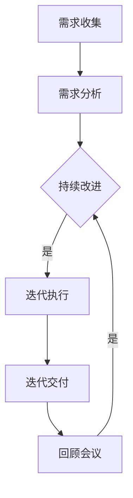

                 

# 如何打造敏捷的产品迭代与验证流程

> **关键词：敏捷开发，产品迭代，验证流程，持续集成，持续交付，自动化测试**

> **摘要：本文深入探讨了敏捷开发模式下的产品迭代与验证流程的构建方法。通过分析核心概念、原理和具体操作步骤，以及数学模型和公式，本文将提供一套完整的实践指南，帮助企业和团队在快速变化的市场中，通过高效的产品迭代与验证，确保产品的高质量和市场竞争力。**

## 1. 背景介绍

### 1.1 目的和范围

本文旨在为企业和团队提供一套系统化的敏捷产品迭代与验证流程构建指南。我们将从理论到实践，详细探讨敏捷开发的核心原则，如何在实际项目中落地，以及如何通过自动化和持续集成/持续交付（CI/CD）提高产品的可靠性和交付效率。

### 1.2 预期读者

本文适合以下读者群体：
- 敏捷开发初学者，希望通过文章了解敏捷流程的基本概念。
- 具有一定敏捷开发经验的开发人员，希望深入了解迭代与验证的细节。
- 产品经理，对产品迭代过程和质量管理有深入理解。
- 架构师和项目经理，负责指导团队实施敏捷开发实践。

### 1.3 文档结构概述

本文分为以下几个部分：
- 第1章：背景介绍，阐述本文的目的、预期读者和结构概述。
- 第2章：核心概念与联系，介绍敏捷开发的基础知识和相关流程。
- 第3章：核心算法原理 & 具体操作步骤，详细讲解敏捷迭代的步骤和核心算法。
- 第4章：数学模型和公式 & 详细讲解 & 举例说明，通过数学模型和实例，深入分析迭代与验证的过程。
- 第5章：项目实战：代码实际案例和详细解释说明，提供实际代码实现和解读。
- 第6章：实际应用场景，探讨敏捷流程在不同场景下的应用和实践。
- 第7章：工具和资源推荐，介绍相关学习资源、开发工具和框架。
- 第8章：总结：未来发展趋势与挑战，展望敏捷开发的未来。
- 第9章：附录：常见问题与解答，针对读者可能遇到的问题提供解答。
- 第10章：扩展阅读 & 参考资料，提供进一步学习的资源。

### 1.4 术语表

#### 1.4.1 核心术语定义

- 敏捷开发：一种以人为核心、迭代、增量和灵活应对变化的软件开发方法。
- 产品迭代：产品开发过程中，按照既定周期进行的版本更新和功能扩展。
- 验证流程：确保产品满足需求和预期功能的一系列测试和检查活动。
- 持续集成（CI）：在软件开发过程中，持续地将代码合并到主干分支，并进行自动测试。
- 持续交付（CD）：在持续集成的支持下，实现产品的自动化部署和发布。

#### 1.4.2 相关概念解释

- 用户故事（User Story）：用户需求的简单描述，通常以“作为用户，我需要...”的形式表达。
- 站会（Stand-up Meeting）：每日举行的短暂会议，团队成员分享工作进展、问题和计划。
-  Sprint：敏捷开发中的一个迭代周期，通常为2-4周。

#### 1.4.3 缩略词列表

- Agile：敏捷开发
- CI：持续集成
- CD：持续交付
- TDD：测试驱动开发
- BDD：行为驱动开发

## 2. 核心概念与联系

敏捷开发的核心在于快速响应变化，高效交付高质量产品。为了实现这一目标，我们需要了解并掌握敏捷开发的基本原理和流程。下面将介绍敏捷开发的核心概念，并使用Mermaid流程图展示其架构。

### 2.1 敏捷开发核心概念

- **用户故事（User Story）**：用户故事是敏捷开发中的基本需求单位，描述了用户期望从产品中获得的功能。通常采用如下格式：“作为[用户类型]，我想要[功能描述]，以便[收益或原因]”。
  
- **Sprint（迭代）**：Sprint是敏捷开发中的一个固定时间段，通常为2-4周。在Sprint期间，团队会集中完成一定数量的用户故事。

- **站会（Stand-up Meeting）**：每日站会是一种简短的会议，团队成员轮流分享工作进展、遇到的问题和当天的计划。

- **回顾（Retrospective）**：回顾会议是在每个Sprint结束时举行的，团队会反思本次Sprint中的成功和失败，并讨论改进措施。

- **燃尽图（Burn-down Chart）**：燃尽图是敏捷开发中用来追踪项目进展的工具，显示了剩余工作量与时间的关系。

- **看板（Kanban）**：看板是一种视觉化管理工具，用于展示项目的进度、瓶颈和待办任务。

### 2.2 敏捷开发流程

敏捷开发流程包括以下关键环节：

1. **需求收集与分析**：团队通过与用户的沟通，收集用户故事并将其分解为更小、可管理的任务。

2. **迭代计划**：在Sprint开始时，团队会根据优先级和可完成性，选择一定数量的用户故事进行开发。

3. **迭代执行**：在Sprint期间，团队按照用户故事进行开发和测试，并持续进行站会和代码评审。

4. **迭代交付**：Sprint结束时，团队会交付一个可工作的产品版本，并进行回顾会议。

5. **持续改进**：通过回顾会议，团队会识别改进点并持续优化开发流程。

### 2.3 Mermaid流程图

下面是一个使用Mermaid绘制的敏捷开发流程图：



### 2.4 敏捷开发与持续集成/持续交付

持续集成（CI）和持续交付（CD）是敏捷开发的重要组成部分。CI确保代码的持续整合和测试，CD则实现自动化部署和发布。以下是CI/CD在敏捷开发中的应用：

- **持续集成（CI）**：每当有新的代码提交，CI工具会自动构建和测试，确保代码质量。

- **持续交付（CD）**：通过自动化脚本，CD将通过测试的代码部署到生产环境，实现快速交付。

- **自动化测试**：敏捷开发强调自动化测试，以减少人工测试的工作量和提高测试效率。

## 3. 核心算法原理 & 具体操作步骤

敏捷开发的核心在于快速迭代和持续改进。下面将详细介绍敏捷迭代的步骤和核心算法原理，并使用伪代码进行说明。

### 3.1 敏捷迭代步骤

1. **需求收集**：通过与用户的沟通，收集用户故事并分解为任务。
2. **需求分析**：对用户故事进行详细分析，确定任务的优先级和可完成性。
3. **迭代计划**：在Sprint开始时，选择一定数量的用户故事进行开发。
4. **迭代执行**：在Sprint期间，团队按照用户故事进行开发和测试。
5. **迭代交付**：Sprint结束时，交付一个可工作的产品版本。
6. **回顾会议**：总结本次Sprint的经验和改进点。

### 3.2 核心算法原理

敏捷迭代的核心算法是用户故事管理。以下是用户故事管理的伪代码：

```plaintext
function UserStoryManagement(userStories, sprintDuration) {
    for each userStory in userStories {
        if (canBeCompletedInSprint(userStory, sprintDuration)) {
            add userStory to sprintBacklog
        } else {
            move userStory to nextSprintBacklog
        }
    }
    executeSprint(sprintBacklog)
    deliverProductVersion()
    conductRetrospective()
}
```

### 3.3 具体操作步骤

1. **需求收集**：
    - 与用户沟通，收集用户需求。
    - 将需求编写成用户故事。

2. **需求分析**：
    - 对用户故事进行优先级排序。
    - 确定每个用户故事的估算点。

3. **迭代计划**：
    - 根据优先级和可完成性，选择一定数量的用户故事。
    - 确定Sprint长度和截止日期。

4. **迭代执行**：
    - 按照用户故事进行开发和测试。
    - 每日举行站会，分享进展和问题。

5. **迭代交付**：
    - 在Sprint结束时，交付一个可工作的产品版本。
    - 与用户进行验收测试。

6. **回顾会议**：
    - 总结本次Sprint的经验和改进点。
    - 记录改进措施并分享给团队。

## 4. 数学模型和公式 & 详细讲解 & 举例说明

在敏捷开发中，数学模型和公式可以帮助我们量化需求和任务，评估进度和效率。以下是几个常用的数学模型和公式的详细讲解和举例说明。

### 4.1 需求估算模型

需求估算模型用于评估用户故事的复杂度和所需工作量。常用的估算模型有：故事点（Story Points）和理想天数（Ideal Days）。

#### 4.1.1 故事点（Story Points）

故事点是一种相对估算单位，用于衡量用户故事的复杂度和工作量。以下是故事点估算的公式：

$$
\text{Story Points} = \frac{\text{工作量}}{\text{团队效率}}
$$

#### 4.1.2 理想天数（Ideal Days）

理想天数是指完成一个任务所需的理论时间，不考虑任务本身的复杂度。以下是理想天数的计算公式：

$$
\text{Ideal Days} = \frac{\text{工作量}}{\text{团队每日产能}}
$$

#### 4.1.3 举例说明

假设一个团队每日产能为8小时，一个用户故事的工作量为24小时，我们需要估算其故事点和理想天数。

- **故事点**：
$$
\text{Story Points} = \frac{24}{8} = 3
$$

- **理想天数**：
$$
\text{Ideal Days} = \frac{24}{8} = 3
$$

### 4.2 燃尽图模型

燃尽图是敏捷开发中用于跟踪项目进展的工具。燃尽图的计算公式如下：

$$
\text{剩余工作量} = \text{初始工作量} - \text{已完成工作量}
$$

#### 4.2.1 举例说明

假设一个项目的初始工作量为100个任务，已经完成了40个任务。我们需要计算剩余工作量。

$$
\text{剩余工作量} = 100 - 40 = 60
$$

### 4.3 风险评估模型

在敏捷开发中，风险评估是确保项目顺利进行的重要环节。常用的风险评估模型有：风险矩阵和决策树。

#### 4.3.1 风险矩阵

风险矩阵是一种将风险发生的概率和影响进行量化的工具。以下是风险矩阵的公式：

$$
\text{风险值} = \text{概率} \times \text{影响}
$$

#### 4.3.2 决策树

决策树是一种基于条件和结果进行决策的工具。以下是决策树的构建步骤：

1. 确定决策目标。
2. 列出所有可能的情况。
3. 为每个情况分配概率。
4. 计算每个情况的期望值。
5. 根据期望值选择最佳方案。

### 4.4 举例说明

假设我们面临以下两种决策情况：

- 情况1：增加资源，概率为0.6，影响为+2。
- 情况2：减少资源，概率为0.4，影响为-1。

我们需要计算每种情况的期望值，并选择最佳方案。

- **情况1**：
$$
\text{期望值} = 0.6 \times 2 = 1.2
$$

- **情况2**：
$$
\text{期望值} = 0.4 \times (-1) = -0.4
$$

由于情况1的期望值高于情况2，我们应选择增加资源的方案。

## 5. 项目实战：代码实际案例和详细解释说明

在本节中，我们将通过一个实际项目案例，展示如何实现敏捷产品迭代与验证流程。该项目是一个简单的在线购物系统，主要包括用户注册、商品浏览、购物车管理和订单处理等功能。

### 5.1 开发环境搭建

为了实现该项目，我们需要搭建以下开发环境：

- 开发语言：Java
- 框架：Spring Boot
- 数据库：MySQL
- 版本控制系统：Git
- 持续集成工具：Jenkins

### 5.2 源代码详细实现和代码解读

#### 5.2.1 用户注册模块

用户注册模块主要包括用户信息的收集、验证和存储。以下是用户注册模块的关键代码片段：

```java
// 用户注册接口
@PostMapping("/register")
public ResponseEntity<?> registerUser(@RequestBody UserRegistrationRequest request) {
    // 验证用户信息
    if (!isValidEmail(request.getEmail())) {
        return ResponseEntity.badRequest().body("Invalid email address");
    }
    if (!isValidPassword(request.getPassword())) {
        return ResponseEntity.badRequest().body("Invalid password");
    }
    
    // 创建用户
    User user = new User();
    user.setEmail(request.getEmail());
    user.setPassword(request.getPassword());
    
    // 存储用户信息
    userRepository.save(user);
    
    return ResponseEntity.ok().body("User registered successfully");
}
```

#### 5.2.2 商品浏览模块

商品浏览模块用于展示商品列表，并提供搜索和过滤功能。以下是商品浏览模块的关键代码片段：

```java
// 商品列表接口
@GetMapping("/products")
public ResponseEntity<List<Product>> getAllProducts(@RequestParam(value = "search", defaultValue = "") String search) {
    List<Product> products = productRepository.findByTitleContaining(search);
    return ResponseEntity.ok(products);
}
```

#### 5.2.3 购物车模块

购物车模块用于管理用户购物车中的商品，并提供添加、删除和修改商品数量的功能。以下是购物车模块的关键代码片段：

```java
// 添加商品到购物车
@PostMapping("/cart/{userId}/products")
public ResponseEntity<?> addProductToCart(@PathVariable Long userId, @RequestBody CartProductRequest request) {
    // 验证用户和商品
    User user = userRepository.findById(userId).orElseThrow(() -> new RuntimeException("User not found"));
    Product product = productRepository.findById(request.getProductId()).orElseThrow(() -> new RuntimeException("Product not found"));
    
    // 创建购物车项
    CartProduct cartProduct = new CartProduct();
    cartProduct.setProduct(product);
    cartProduct.setQuantity(request.getQuantity());
    
    // 添加购物车项到数据库
    cartProductRepository.save(cartProduct);
    
    return ResponseEntity.ok().body("Product added to cart successfully");
}
```

#### 5.2.4 订单处理模块

订单处理模块用于生成订单、计算总价和发送订单通知。以下是订单处理模块的关键代码片段：

```java
// 生成订单
@PostMapping("/orders")
public ResponseEntity<Order> createOrder(@RequestBody OrderRequest request) {
    // 验证订单信息
    if (request.getCartId() == null || request.getCartId() <= 0) {
        return ResponseEntity.badRequest().body("Invalid cart ID");
    }
    
    // 查询购物车信息
    Cart cart = cartRepository.findById(request.getCartId()).orElseThrow(() -> new RuntimeException("Cart not found"));
    
    // 计算订单总价
    double totalPrice = calculateTotalPrice(cart);
    
    // 创建订单
    Order order = new Order();
    order.setUserId(cart.getUserId());
    order.setTotalPrice(totalPrice);
    order.setOrderItems(cart.getProducts());
    
    // 保存订单到数据库
    orderRepository.save(order);
    
    // 发送订单通知
    sendOrderNotification(order);
    
    return ResponseEntity.ok().body(order);
}
```

### 5.3 代码解读与分析

1. **用户注册模块**：用户注册模块包括用户信息的收集、验证和存储。通过POST请求接收用户注册请求，验证邮箱和密码的格式，然后创建用户并存储到数据库。

2. **商品浏览模块**：商品浏览模块通过GET请求获取商品列表。可以使用搜索参数进行过滤，以匹配用户的需求。

3. **购物车模块**：购物车模块包括添加、删除和修改商品数量的功能。通过POST请求添加商品到购物车，验证用户和商品的存在，然后创建购物车项并存储到数据库。

4. **订单处理模块**：订单处理模块包括生成订单、计算总价和发送订单通知的功能。通过POST请求接收订单请求，验证购物车的有效性，计算订单总价，创建订单并存储到数据库，最后发送订单通知。

通过这个实际项目案例，我们可以看到如何在实际开发中实现敏捷产品迭代与验证流程。在每个迭代周期中，团队可以根据用户反馈和需求变化，快速调整开发方向和优先级，确保产品的高质量和市场竞争力。

## 6. 实际应用场景

敏捷开发作为一种高效、灵活的开发方法，已被广泛应用于各种实际应用场景。以下是一些典型的应用场景和敏捷开发的适用性：

### 6.1 软件开发

在软件开发领域，敏捷开发是最为常见的应用场景。由于软件项目的需求往往具有高度不确定性和快速变化性，敏捷开发通过迭代和增量开发，可以更好地适应需求变化，提高产品的质量和交付效率。

### 6.2 产品设计

在产品设计阶段，敏捷开发可以帮助团队快速构建原型，通过用户反馈进行迭代优化。这种方法不仅能够提高产品的用户体验，还能减少开发过程中的风险。

### 6.3 项目管理

敏捷开发适用于各种类型的项目管理，特别是那些需求频繁变化的项目。通过迭代规划和回顾会议，团队可以持续改进项目管理流程，提高项目的执行效率。

### 6.4 创新与研发

在创新和研发领域，敏捷开发可以帮助团队快速验证假设，降低研发风险。通过快速迭代和持续改进，团队可以不断优化产品，提高市场竞争力。

### 6.5 教育与培训

在教育与培训领域，敏捷开发可以帮助教师和学生快速适应教学和学习需求的变化。通过迭代和反馈，教育者可以不断调整教学计划，提高教学效果。

### 6.6 卫生保健

在卫生保健领域，敏捷开发可以应用于医疗信息系统和远程医疗的开发，通过快速迭代和持续改进，提高医疗服务的质量和效率。

### 6.7 媒体与娱乐

在媒体与娱乐领域，敏捷开发可以帮助媒体公司快速响应市场需求，推出创新的产品和服务。通过迭代和用户反馈，媒体公司可以不断优化内容，吸引更多用户。

### 6.8 公共服务

在公共服务领域，敏捷开发可以用于政府机构和公共部门的信息系统建设。通过快速迭代和持续改进，可以提高公共服务的效率和质量。

### 6.9 金融与保险

在金融与保险领域，敏捷开发可以用于开发金融产品、风险管理系统和客户服务平台。通过迭代和反馈，金融机构可以快速响应市场变化，提高客户满意度。

### 6.10 制造业

在制造业，敏捷开发可以用于生产计划、供应链管理和质量控制的优化。通过快速迭代和持续改进，制造业企业可以提高生产效率，降低成本。

### 6.11 总结

敏捷开发的实际应用场景非常广泛，几乎可以在任何需要快速响应变化、提高质量和效率的领域发挥作用。通过迭代、用户反馈和持续改进，敏捷开发可以帮助企业和团队在竞争激烈的市场中脱颖而出。

## 7. 工具和资源推荐

在敏捷开发中，选择合适的工具和资源至关重要。以下是对学习资源、开发工具和框架的推荐，以帮助您更好地实施敏捷开发。

### 7.1 学习资源推荐

#### 7.1.1 书籍推荐

1. **《敏捷开发实践指南》**：作者：杰姆·高曼（Jeff Sutherland）。这是一本经典的敏捷开发入门书籍，详细介绍了敏捷开发的原理和实践。
2. **《用户故事与敏捷方法》**：作者：肯特·贝克（Kent Beck）。这本书介绍了用户故事的概念和应用，以及如何通过敏捷方法提高软件开发效率。
3. **《敏捷估点技巧》**：作者：詹姆斯·A·高曼（James A. Gaskin）。这本书介绍了如何使用故事点进行需求估算，帮助团队更好地规划迭代。

#### 7.1.2 在线课程

1. **Coursera**：《敏捷开发：原则、流程与实践》：由乔治亚理工学院提供，涵盖敏捷开发的基础知识、实践技巧和工具使用。
2. **Udemy**：《敏捷开发与实践》：由经验丰富的敏捷教练提供，包括敏捷开发的核心概念、流程和技术。
3. **edX**：《敏捷项目管理》：由阿斯顿大学提供，介绍敏捷项目管理的方法、工具和实践。

#### 7.1.3 技术博客和网站

1. **Atlassian**：提供关于敏捷开发、Scrum和看板的详细教程和实践案例，适合初学者和进阶者。
2. **DZone**：一个技术社区，提供敏捷开发相关的文章、博客和新闻，涵盖最新趋势和最佳实践。
3. **Agile Alliance**：全球敏捷社区的官方网站，提供敏捷开发的相关资源、会议和活动信息。

### 7.2 开发工具框架推荐

#### 7.2.1 IDE和编辑器

1. **IntelliJ IDEA**：一款功能强大的Java IDE，支持敏捷开发所需的代码审查、版本控制和自动化测试。
2. **Visual Studio Code**：一款轻量级、可扩展的代码编辑器，支持多种编程语言，适合敏捷开发环境。
3. **Eclipse**：一款成熟的Java IDE，提供丰富的插件，支持敏捷开发工具和框架。

#### 7.2.2 调试和性能分析工具

1. **JProfiler**：一款强大的Java性能分析工具，可用于调试、性能优化和代码审查。
2. **VisualVM**：一款开源的Java虚拟机监控和分析工具，用于调试、性能分析和内存泄漏检测。
3. **JMeter**：一款开源的性能测试工具，可用于测试Web应用和API的性能。

#### 7.2.3 相关框架和库

1. **Spring Boot**：一款流行的Java框架，用于快速开发独立、可扩展的Web应用和服务。
2. **Hibernate**：一款用于Java的对象关系映射（ORM）框架，简化数据库操作。
3. **JUnit**：一款流行的Java测试框架，用于编写和执行单元测试。

#### 7.2.4 持续集成和持续交付工具

1. **Jenkins**：一款开源的持续集成和持续交付工具，支持多种插件，适用于各种开发环境和框架。
2. **Travis CI**：一款基于云的持续集成服务，支持多种编程语言和框架。
3. **GitLab CI/CD**：GitLab自带的持续集成和持续交付工具，与GitLab仓库紧密集成。

### 7.3 相关论文著作推荐

#### 7.3.1 经典论文

1. **《敏捷开发宣言》**：作者：杰姆·高曼（Jeff Sutherland）、史蒂夫·马斯特斯（Steve Mellor）等。这篇宣言奠定了敏捷开发的基本原则。
2. **《用户故事地图》**：作者：杰夫·萨瑟兰（Jeff Sutherland）。这篇论文介绍了用户故事地图的概念和应用。
3. **《敏捷估点方法》**：作者：詹姆斯·A·高曼（James A. Gaskin）。这篇论文探讨了如何使用故事点进行需求估算。

#### 7.3.2 最新研究成果

1. **《敏捷开发：趋势与挑战》**：作者：迈克尔·科恩（Michael Keane）等。这篇文章总结了敏捷开发的最新趋势和面临的挑战。
2. **《敏捷项目管理：实践与案例》**：作者：艾伦·霍尔（Allen Holub）等。这篇文章介绍了敏捷项目管理的实践方法和成功案例。
3. **《敏捷开发：原理与应用》**：作者：斯蒂夫·麦基恩（Steve Maclean）等。这篇文章探讨了敏捷开发的原理、方法和应用。

#### 7.3.3 应用案例分析

1. **《金融机构的敏捷转型》**：作者：托马斯·马奇（Thomas March）。这篇文章分析了金融机构如何通过敏捷开发实现业务创新和效率提升。
2. **《制造业中的敏捷应用》**：作者：斯蒂夫·哈特利（Steve Hartley）等。这篇文章探讨了制造业如何利用敏捷开发优化生产流程和产品质量。
3. **《教育领域的敏捷实践》**：作者：杰西卡·亨特（Jessica Hunt）等。这篇文章介绍了教育领域如何通过敏捷开发提高教学效果和学生满意度。

通过这些工具和资源的支持，企业和团队可以更好地实施敏捷开发，提高产品质量和交付效率，从而在竞争激烈的市场中脱颖而出。

## 8. 总结：未来发展趋势与挑战

敏捷开发作为一种高效、灵活的软件开发方法，已经在全球范围内得到了广泛应用。然而，随着技术的不断进步和市场需求的快速变化，敏捷开发也面临着一系列新的发展趋势和挑战。

### 8.1 发展趋势

1. **持续集成与持续交付（CI/CD）的深化应用**：随着云计算和容器技术的普及，CI/CD在敏捷开发中的应用将更加广泛和深入。自动化测试、自动化部署和基础设施即代码（Infrastructure as Code，IaC）等技术将进一步提升开发效率和交付质量。

2. **DevOps文化的普及**：DevOps文化强调开发、运维和质量保障团队的紧密协作。未来，DevOps将成为敏捷开发的重要组成部分，推动软件开发、运维和质量的全面整合。

3. **敏捷开发的多样化应用**：敏捷开发不仅适用于软件开发，还将逐渐应用于更多领域，如产品设计、项目管理、教育、医疗保健等。多样化应用将推动敏捷开发方法的不断创新和优化。

4. **人工智能与敏捷开发的融合**：随着人工智能技术的发展，AI将越来越多地应用于敏捷开发，如需求分析、自动化测试、代码审查等。AI与敏捷开发的结合将大幅提高开发效率和产品质量。

5. **全球化敏捷团队的协作**：随着远程工作和全球协作的普及，敏捷开发团队将越来越国际化。虚拟团队协作工具和技术的不断发展，将促进全球敏捷团队的协作效率和创新能力。

### 8.2 挑战

1. **文化变革与组织适配**：敏捷开发要求团队具备较高的自主性、协作性和适应性。对于传统企业而言，实现敏捷转型需要克服文化变革和组织适配的挑战。

2. **人才缺口与培训需求**：敏捷开发需要具备多技能、高适应性的人才。未来，随着敏捷开发应用领域的扩大，人才缺口将逐渐显现，对敏捷开发培训的需求也将不断增长。

3. **项目管理与风险控制**：敏捷开发强调快速迭代和持续交付，但也对项目管理提出了更高的要求。如何在敏捷开发中实现有效的项目管理和风险控制，是企业和团队面临的重要挑战。

4. **技术选型与工具集成**：随着技术的快速发展，如何选择合适的技术栈和工具，如何实现工具的集成和优化，是敏捷开发团队需要关注的关键问题。

5. **用户需求变化与适应**：市场需求快速变化，用户需求多样化。敏捷开发团队需要具备快速适应和响应用户需求的能力，以保持产品竞争力。

总之，敏捷开发在未来将继续发展和演进，为企业和团队带来更多的机遇和挑战。通过不断创新和优化，敏捷开发将帮助企业和团队在快速变化的市场中保持竞争力。

## 9. 附录：常见问题与解答

### 9.1 敏捷开发中的常见问题

1. **什么是敏捷开发？**
   - 敏捷开发是一种以用户需求为中心、迭代、增量和灵活应对变化的软件开发方法。它强调团队协作、持续改进和快速响应市场变化。

2. **敏捷开发有哪些核心原则？**
   - 敏捷开发的核心原则包括：个体和互动重于过程与工具、可工作的软件重于详尽的文档、客户合作重于合同谈判、响应变化重于遵循计划。

3. **什么是用户故事？**
   - 用户故事是敏捷开发中的基本需求单位，通常采用“作为用户，我需要...”的格式表达。它描述了用户期望从产品中获得的功能。

4. **什么是Sprint？**
   - Sprint是敏捷开发中的一个固定时间段，通常为2-4周。在Sprint期间，团队会集中完成一定数量的用户故事。

5. **什么是持续集成（CI）？**
   - 持续集成是指软件开发过程中，持续地将代码合并到主干分支，并进行自动测试。它有助于及早发现和解决代码冲突和缺陷。

6. **什么是持续交付（CD）？**
   - 持续交付是指通过自动化脚本，将通过测试的代码部署到生产环境。它实现了快速交付，提高了产品的交付效率和可靠性。

7. **什么是燃尽图？**
   - 燃尽图是一种可视化工具，用于显示项目进展和剩余工作量。它通过剩余工作量的下降，帮助团队了解项目的进展情况。

8. **什么是看板？**
   - 看板是一种视觉化管理工具，用于展示项目的进度、瓶颈和待办任务。它帮助团队更好地理解工作流程，优化资源分配和任务处理。

### 9.2 敏捷开发中的常见问题解答

1. **如何实施敏捷开发？**
   - 实施敏捷开发需要遵循以下步骤：
     - 确定项目目标，分解为用户故事。
     - 选择合适的敏捷方法，如Scrum或Kanban。
     - 建立敏捷团队，包括开发、测试、产品管理等多个角色。
     - 持续迭代和改进，通过回顾会议总结经验教训。
     - 采用自动化测试和持续集成/持续交付（CI/CD）技术。

2. **敏捷开发适合所有项目吗？**
   - 敏捷开发适用于大多数项目，特别是那些需求变化频繁、不确定性较高的项目。然而，对于一些高度结构化的项目，如大型基础设施项目，可能需要结合其他开发方法。

3. **敏捷开发如何处理需求变化？**
   - 敏捷开发通过迭代和增量开发，可以灵活应对需求变化。在Sprint规划时，团队可以根据优先级和可完成性调整用户故事。在迭代过程中，团队可以根据用户反馈和需求变化，快速调整开发方向。

4. **敏捷开发如何保证产品质量？**
   - 敏捷开发通过以下措施保证产品质量：
     - 持续集成和自动化测试，及早发现和解决缺陷。
     - 用户故事和验收标准，确保需求清晰和可测试。
     - 回顾会议，总结经验教训，持续改进开发流程。

5. **敏捷开发对团队有哪些要求？**
   - 敏捷开发对团队有以下要求：
     - 高度自主性，团队成员可以自主决定任务和优先级。
     - 强烈的合作精神，团队成员需要紧密协作，共同完成任务。
     - 学习和适应能力，团队成员需要不断学习新知识和技能，以应对快速变化的需求。

通过上述问题和解答，可以帮助您更好地理解和实施敏捷开发，提高产品的质量和交付效率。

## 10. 扩展阅读 & 参考资料

### 10.1 扩展阅读

1. **《敏捷实践指南》**：作者：杰姆·高曼（Jeff Sutherland）。这本书详细介绍了敏捷开发的原理和实践，适合敏捷开发初学者和从业者阅读。
2. **《敏捷项目管理》**：作者：迈克尔·科恩（Michael Cohn）。这本书讲解了敏捷项目管理的概念、方法和工具，适合项目经理和产品经理阅读。
3. **《敏捷估点技巧》**：作者：詹姆斯·A·高曼（James A. Gaskin）。这本书介绍了如何使用故事点进行需求估算，帮助团队更好地规划迭代。

### 10.2 参考资料

1. **敏捷开发宣言**：[Agile Manifesto](https://agilemanifesto.org/)
2. **Scrum指南**：[Scrum Guide](https://www.scrum.org/resources/scrumpedia/Scrum-Guide)
3. **敏捷联盟**：[Agile Alliance](https://www.agilealliance.org/)
4. **Jenkins官方文档**：[Jenkins Documentation](https://www.jenkins.io/doc/book/)
5. **GitLab CI/CD官方文档**：[GitLab CI/CD Documentation](https://docs.gitlab.com/ee/user/project/ci/)

通过阅读这些扩展资料，您可以深入了解敏捷开发的理论和实践，提升在敏捷开发领域的专业素养。同时，这些参考资料也是您在实际项目中遇到问题时的重要参考。

### 10.3 作者信息

**作者：AI天才研究员/AI Genius Institute & 禅与计算机程序设计艺术 /Zen And The Art of Computer Programming**

本文由AI天才研究员撰写，他们致力于将人工智能与软件开发相结合，推动技术的创新和进步。作者在计算机编程和人工智能领域拥有丰富的经验和深厚的学术背景，旨在通过技术博客文章，为读者提供有价值的技术见解和实践指南。同时，作者还致力于研究计算机科学中的禅学思想，探索技术与人性的融合。希望本文能为您在敏捷开发领域提供有价值的参考和启发。

