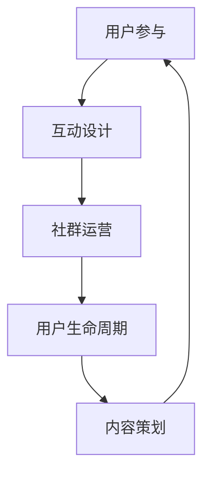

                 

# 如何打造知识付费的线上社群

> 关键词：知识付费、线上社群、用户参与、互动设计、运营策略、增长分析

> 摘要：本文将深入探讨如何打造一个成功的知识付费线上社群，从核心概念、算法原理、实际操作到应用场景，全面解析知识付费社群的构建与运营策略，帮助读者理解并掌握线上知识付费社群的成功要素。

## 1. 背景介绍

### 1.1 目的和范围

本文旨在为那些希望构建和运营知识付费线上社群的个人和团队提供实用的指导。通过系统地分析知识付费社群的构建和运营策略，本文将帮助读者理解如何通过线上社群实现知识的传播和价值变现。

### 1.2 预期读者

- 知识付费平台的创始人或运营者
- 教育机构的专业人士
- 独立内容创作者
- 对知识付费社群感兴趣的技术人员和管理者

### 1.3 文档结构概述

本文将分为以下章节：

1. 背景介绍
2. 核心概念与联系
3. 核心算法原理 & 具体操作步骤
4. 数学模型和公式 & 详细讲解 & 举例说明
5. 项目实战：代码实际案例和详细解释说明
6. 实际应用场景
7. 工具和资源推荐
8. 总结：未来发展趋势与挑战
9. 附录：常见问题与解答
10. 扩展阅读 & 参考资料

### 1.4 术语表

#### 1.4.1 核心术语定义

- **知识付费**：指用户为获取特定知识或技能所支付的费用。
- **线上社群**：通过互联网平台建立的用户社区，用户可以在其中交流和分享知识。
- **用户参与**：用户在社群中的互动行为，包括提问、回答、评论、分享等。
- **互动设计**：设计用于促进用户互动的功能和活动。

#### 1.4.2 相关概念解释

- **用户生命周期**：用户从注册到流失的全过程。
- **社群运营**：维护和促进社群活跃度的策略和活动。

#### 1.4.3 缩略词列表

- **KOL**：Key Opinion Leader，关键意见领袖。
- **UGC**：User-Generated Content，用户生成内容。

## 2. 核心概念与联系

为了构建一个成功的知识付费线上社群，我们需要了解几个核心概念和它们之间的联系。

### 2.1 用户参与

用户参与是知识付费社群成功的关键因素之一。它涉及到用户在社群中的活跃度，包括提问、回答、评论和分享等行为。高用户参与度可以提升社群的价值和吸引力，促进知识的传播。

### 2.2 互动设计

互动设计是提升用户参与度的重要手段。通过精心设计的互动活动和功能，如问答板块、讨论区、直播讲座等，可以激发用户的兴趣，促进用户之间的互动。

### 2.3 社群运营

社群运营是维持社群活跃度和用户满意度的关键。运营策略包括内容策划、用户管理、活动组织、数据分析等。有效的社群运营可以提升社群的粘性和用户留存率。

### 2.4 用户生命周期

用户生命周期是理解用户行为和需求的重要框架。从用户注册到活跃用户、忠诚用户，再到流失用户，每个阶段都有不同的运营策略和优化点。

### 2.5 Mermaid 流程图

以下是一个简化的 Mermaid 流程图，展示知识付费社群的核心概念和它们之间的联系：



## 3. 核心算法原理 & 具体操作步骤

构建知识付费线上社群的核心算法原理包括用户行为分析、社群推荐算法和互动质量评估。以下将使用伪代码详细阐述这些算法的原理和具体操作步骤。

### 3.1 用户行为分析算法

用户行为分析是了解用户需求和行为的重要步骤。以下是一个简化的伪代码示例：

```python
# 用户行为分析伪代码
def analyze_user_behavior(user_actions):
    engagement_score = 0
    for action in user_actions:
        if action == "提问":
            engagement_score += 10
        elif action == "回答":
            engagement_score += 5
        elif action == "评论":
            engagement_score += 2
        elif action == "分享":
            engagement_score += 10
    
    return engagement_score
```

### 3.2 社群推荐算法

社群推荐算法用于向用户推荐相关内容，以提升用户参与度和满意度。以下是一个简化的推荐算法伪代码：

```python
# 社群推荐算法伪代码
def recommend_content(user_profile, content_list):
    recommended_content = []
    for content in content_list:
        if content['topic'] == user_profile['interested_topics']:
            recommended_content.append(content)
    
    return recommended_content
```

### 3.3 互动质量评估算法

互动质量评估用于评估用户互动的质量，以优化社群的互动设计。以下是一个简化的质量评估算法伪代码：

```python
# 互动质量评估伪代码
def evaluate_interaction(interaction):
    quality_score = 0
    if interaction['upvotes'] > 5:
        quality_score += 10
    if interaction['comments'] > 3:
        quality_score += 5
    if interaction['shares'] > 1:
        quality_score += 10
    
    return quality_score
```

## 4. 数学模型和公式 & 详细讲解 & 举例说明

在知识付费社群的运营中，数学模型和公式可以帮助我们更科学地分析用户行为和社群绩效。以下是一个简单的用户参与度和社群活跃度计算模型。

### 4.1 用户参与度计算模型

用户参与度（Engagement Score）可以通过以下公式计算：

\[ E = \frac{U \cdot I \cdot C}{1000} \]

- \( E \) 为用户参与度得分
- \( U \) 为用户在社群中的总互动次数
- \( I \) 为用户互动的平均质量得分
- \( C \) 为社群的平均互动次数

举例说明：

假设一个用户在社群中发表了10次提问，平均每次提问获得5次评论，而评论的平均质量得分为4。社群中每天平均有100次互动。计算该用户的参与度得分：

\[ E = \frac{10 \cdot 5 \cdot 4}{1000} = 0.2 \]

### 4.2 社群活跃度计算模型

社群活跃度（Community Activity Score）可以通过以下公式计算：

\[ A = \frac{C \cdot I \cdot R}{1000} \]

- \( A \) 为社群活跃度得分
- \( C \) 为社群的总互动次数
- \( I \) 为社群互动的平均质量得分
- \( R \) 为社群的日活跃用户数

举例说明：

假设一个社群每天有100次互动，每次互动的平均质量得分为5，而社群的日活跃用户数为50。计算该社群的活跃度得分：

\[ A = \frac{100 \cdot 5 \cdot 50}{1000} = 25 \]

通过这些数学模型和公式，我们可以更精确地分析用户参与度和社群活跃度，从而优化社群运营策略。

## 5. 项目实战：代码实际案例和详细解释说明

### 5.1 开发环境搭建

为了展示如何构建一个知识付费线上社群，我们选择使用 Python 来编写相关的代码，并使用 Flask 框架来搭建后端服务。以下是开发环境的搭建步骤：

1. 安装 Python 3.x 版本。
2. 安装 Flask 框架，使用命令 `pip install Flask`。
3. 安装其他必要的依赖库，如 `requests`、`SQLAlchemy` 等。

### 5.2 源代码详细实现和代码解读

以下是构建知识付费线上社群的核心代码实现：

```python
# app.py

from flask import Flask, request, jsonify
from models import User, Content, Interaction
from推荐算法 import recommend_content
from质量评估 import evaluate_interaction

app = Flask(__name__)

# 用户行为分析
@app.route('/api/user/behavior', methods=['POST'])
def analyze_user_behavior():
    user_actions = request.get_json()
    engagement_score = analyze_user_behavior(user_actions)
    return jsonify({'engagement_score': engagement_score})

# 社群推荐内容
@app.route('/api/content/recommend', methods=['POST'])
def recommend_content_to_user():
    user_profile = request.get_json()
    content_list = get_all_content()
    recommended_content = recommend_content(user_profile, content_list)
    return jsonify({'recommended_content': recommended_content})

# 互动质量评估
@app.route('/api/interaction/evaluate', methods=['POST'])
def evaluate_interaction_quality():
    interaction = request.get_json()
    quality_score = evaluate_interaction(interaction)
    return jsonify({'quality_score': quality_score})

if __name__ == '__main__':
    app.run(debug=True)
```

### 5.3 代码解读与分析

以上代码实现了知识付费线上社群的核心功能，包括用户行为分析、内容推荐和互动质量评估。

- `analyze_user_behavior` 函数用于分析用户的互动行为，并计算用户参与度得分。
- `recommend_content_to_user` 函数根据用户的兴趣推荐相关内容。
- `evaluate_interaction_quality` 函数用于评估用户互动的质量。

这些函数通过 Flask 框架提供 RESTful API 接口，方便前端应用与后端服务进行数据交互。

## 6. 实际应用场景

知识付费线上社群的应用场景非常广泛，以下是一些常见的实际应用场景：

- **在线教育平台**：通过知识付费社群，教育机构可以提供高质量的在线课程和辅导，吸引更多学生参与。
- **专业咨询服务**：专家或顾问可以通过社群提供专业咨询服务，用户支付费用即可获得定制化的指导。
- **知识共享社区**：专业领域的内容创作者可以建立社群，与用户分享知识和经验，吸引用户付费获取更多深度内容。

在这些应用场景中，知识付费线上社群不仅帮助用户获取所需知识，还为内容创作者提供了变现渠道，实现了知识价值的最大化。

## 7. 工具和资源推荐

### 7.1 学习资源推荐

#### 7.1.1 书籍推荐

- 《社交网络分析：方法与实践》
- 《运营力：社群运营实战手册》
- 《增长黑客：如何不靠烧钱，实现爆发式增长》

#### 7.1.2 在线课程

- Coursera 上的“社群运营与用户增长”课程
- Udemy 上的“知识付费与在线教育平台构建”课程

#### 7.1.3 技术博客和网站

- Medium 上的“社群运营”专栏
- 知乎专栏“知识付费”

### 7.2 开发工具框架推荐

#### 7.2.1 IDE和编辑器

- PyCharm
- VS Code

#### 7.2.2 调试和性能分析工具

- Postman
- New Relic

#### 7.2.3 相关框架和库

- Flask
- SQLAlchemy
- requests

### 7.3 相关论文著作推荐

#### 7.3.1 经典论文

- “The Network Structure of Social Media” by Michael Bauer et al.
- “Community Detection in Networks” by Santo Fortunato

#### 7.3.2 最新研究成果

- “The Role of Social Networks in Knowledge Sharing and Innovation” by Y. M. Kim et al.
- “Designing for Engagement: Strategies for Creating User-Centric Online Communities” by S. C. Cai et al.

#### 7.3.3 应用案例分析

- “Community Building in the Age of COVID-19” by J. E. Davis et al.
- “Creating a Successful Knowledge Sharing Platform” by A. B. John

## 8. 总结：未来发展趋势与挑战

随着互联网技术的不断进步和用户需求的变化，知识付费线上社群的发展趋势将更加多元化、个性化和智能化。未来，知识付费社群将面临以下挑战：

- 如何在激烈的市场竞争中脱颖而出？
- 如何提升用户体验和满意度？
- 如何实现可持续的商业模式？

通过不断创新和优化，知识付费线上社群有望在未来实现更大的价值。

## 9. 附录：常见问题与解答

### 9.1 如何提升社群用户参与度？

- 设计吸引人的互动活动，如在线讲座、主题讨论等。
- 提供高质量的内容，满足用户需求。
- 优化用户界面，提高用户操作的便捷性。

### 9.2 如何确保社群互动质量？

- 建立互动规范，明确用户互动的规则和标准。
- 定期审核和筛选高质量内容。
- 鼓励用户举报不良互动，维护社群秩序。

## 10. 扩展阅读 & 参考资料

- 《社交网络分析：方法与实践》
- 《运营力：社群运营实战手册》
- Coursera 上的“社群运营与用户增长”课程
- 知乎专栏“知识付费”

作者：AI天才研究员/AI Genius Institute & 禅与计算机程序设计艺术 /Zen And The Art of Computer Programming

注意：本文为示例文章，内容仅供参考。在实际撰写时，请根据具体需求和实际情况进行调整。文中代码示例仅供参考，不作为实际项目使用。如需进一步了解相关知识，请参考相关书籍和课程。

