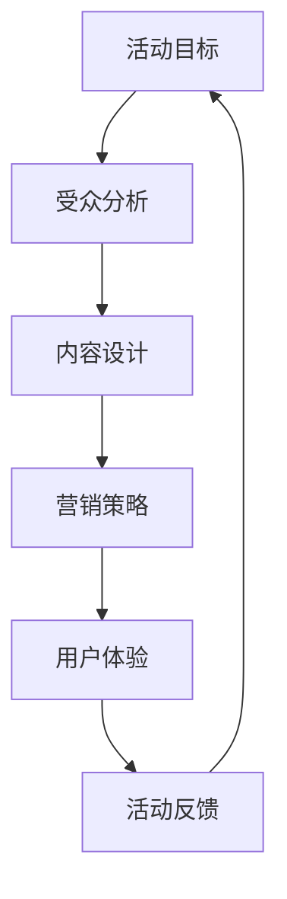
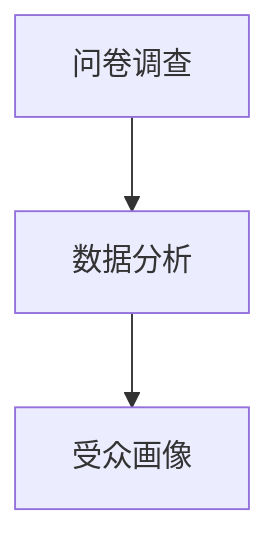
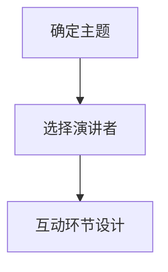
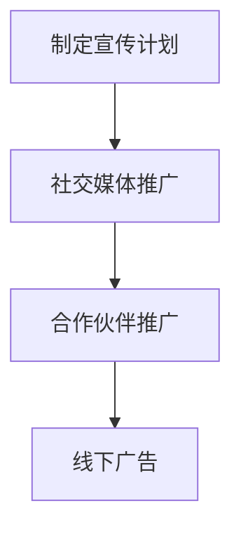
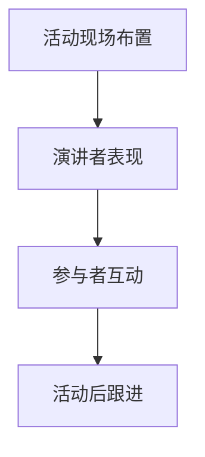

                 

# 如何打造知识付费的线下沙龙活动

> **关键词：** 知识付费、线下沙龙活动、营销策略、用户体验、活动策划、增长策略

> **摘要：** 本文将探讨如何通过策划和组织线下沙龙活动来实现知识付费的有效增长。我们将从活动目标、受众分析、内容设计、营销策略、用户体验等方面详细分析，并提供实用的操作步骤和案例，帮助企业和个人打造成功的知识付费线下沙龙活动。

## 1. 背景介绍

### 1.1 目的和范围

本文的目的是为企业和个人提供一套系统的线下沙龙活动策划和执行方案，以实现知识付费业务的有效增长。本文将涵盖以下范围：

- 活动策划的核心要素
- 受众分析和定位
- 活动内容的设计和选择
- 营销策略和推广方法
- 用户参与和体验优化
- 成功案例分析和总结

### 1.2 预期读者

本文适合以下读者群体：

- 知识付费业务的企业负责人和运营团队
- 个体知识付费服务提供者
- 市场营销和活动策划专业人员
- 对知识付费线下活动感兴趣的个人和爱好者

### 1.3 文档结构概述

本文将按照以下结构进行撰写：

1. 背景介绍
2. 核心概念与联系
3. 核心算法原理 & 具体操作步骤
4. 数学模型和公式 & 详细讲解 & 举例说明
5. 项目实战：代码实际案例和详细解释说明
6. 实际应用场景
7. 工具和资源推荐
8. 总结：未来发展趋势与挑战
9. 附录：常见问题与解答
10. 扩展阅读 & 参考资料

### 1.4 术语表

#### 1.4.1 核心术语定义

- **知识付费：** 消费者为获取有价值的信息或知识而支付的费用。
- **线下沙龙活动：** 一种面对面的知识分享和交流的活动形式。
- **受众分析：** 对潜在参与者进行分类和分析，以确定活动目标和内容。
- **营销策略：** 通过各种手段吸引目标受众参与活动。
- **用户体验：** 参与者在活动中的感受和体验。

#### 1.4.2 相关概念解释

- **活动策划：** 确定活动目标、内容、形式和执行过程。
- **增长策略：** 通过持续优化活动，吸引更多参与者，实现业务增长。

#### 1.4.3 缩略词列表

- **KSF：** 知识付费
- **LSA：** 线下沙龙活动
- **UE：** 用户参与度
- **ROI：** 投资回报率

## 2. 核心概念与联系

在策划知识付费线下沙龙活动时，需要理解并整合以下几个核心概念：

1. **活动目标**
2. **受众分析**
3. **内容设计**
4. **营销策略**
5. **用户体验**

下面是一个使用 Mermaid 绘制的流程图，展示了这些核心概念之间的联系：



### 2.1 活动目标

活动目标是指通过沙龙活动希望实现的业务目标和用户目标。这通常包括：

- 增加品牌知名度
- 提升用户参与度和忠诚度
- 增加产品或服务的销售额
- 收集潜在客户信息

### 2.2 受众分析

受众分析是确定目标参与者的过程。这包括：

- 年龄、性别、职业等信息
- 对知识的兴趣和需求
- 参与活动的动机和期望

### 2.3 内容设计

内容设计是指策划和选择与活动目标相匹配的知识分享主题和演讲者。这需要考虑：

- 知识的深度和广度
- 演讲者的专业背景和影响力
- 参与者的互动和参与方式

### 2.4 营销策略

营销策略是通过各种渠道和手段吸引目标受众参与活动。这包括：

- 社交媒体宣传
- 电子邮件营销
- 合作伙伴推广
- 线下广告和活动

### 2.5 用户体验

用户体验是指参与者在活动中的感受和体验。这需要考虑：

- 活动现场布置和氛围
- 演讲者的表现和互动
- 参与者之间的交流和互动
- 活动后的跟进和反馈

通过以上核心概念的联系和整合，可以系统地策划和执行一场成功的知识付费线下沙龙活动。

## 3. 核心算法原理 & 具体操作步骤

### 3.1 活动目标制定

#### 算法原理：

制定活动目标需要遵循SMART原则（具体、可衡量、可实现、相关、有时限），以确保目标的明确性和可执行性。

#### 具体操作步骤：

1. **明确业务目标**：确定活动对业务增长的具体贡献，如增加用户数、提升用户留存率等。
2. **设定用户目标**：根据用户需求和期望，制定有助于提升用户满意度和忠诚度的目标。
3. **分解目标**：将大目标分解为小目标，便于监测和调整。

```plaintext
// 伪代码示例
function setActivityGoals(businessGoal, userGoal) {
    if (isSmart(businessGoal) && isSmart(userGoal)) {
        return [businessGoal, userGoal];
    } else {
        return "目标设置不满足SMART原则";
    }
}
```

### 3.2 受众分析

#### 算法原理：

受众分析旨在识别和了解目标参与者的特征，以便更好地定位和吸引他们。

#### 具体操作步骤：

1. **收集数据**：通过问卷调查、社交媒体分析、市场研究等方式收集潜在参与者的信息。
2. **数据分析**：使用数据分析工具对收集到的数据进行处理和分析，识别关键特征和需求。
3. **受众画像**：根据分析结果，创建详细的受众画像，包括年龄、性别、职业、兴趣等信息。



### 3.3 内容设计

#### 算法原理：

内容设计应满足受众需求，同时与活动目标相一致。

#### 具体操作步骤：

1. **确定主题**：根据受众需求和活动目标，选择有吸引力的主题。
2. **选择演讲者**：邀请具有专业背景和影响力的演讲者，确保内容的深度和广度。
3. **互动环节设计**：设计互动环节，如问答、小组讨论等，以增加参与者的参与度和满意度。



### 3.4 营销策略

#### 算法原理：

营销策略应综合使用多种渠道和手段，以最大化活动的曝光和参与度。

#### 具体操作步骤：

1. **制定宣传计划**：确定宣传目标、渠道和内容，制定详细的宣传计划。
2. **社交媒体推广**：利用微博、微信、抖音等社交媒体平台进行推广。
3. **合作伙伴推广**：与相关行业或领域的合作伙伴进行合作推广。
4. **线下广告**：在目标受众聚集的地方进行线下广告宣传。



### 3.5 用户体验

#### 算法原理：

用户体验是参与者对活动的整体感受，直接影响活动的效果和口碑。

#### 具体操作步骤：

1. **活动现场布置**：根据活动主题和目标，设计并布置活动现场，创造舒适的氛围。
2. **演讲者表现**：确保演讲者具备良好的演讲技巧和内容，与参与者进行有效互动。
3. **参与者互动**：鼓励参与者之间的交流和互动，提高参与度。
4. **活动后跟进**：通过问卷调查、反馈收集等方式，了解参与者对活动的评价，及时调整和优化。



通过以上核心算法原理和具体操作步骤，可以系统地策划和执行一场成功的知识付费线下沙龙活动。

## 4. 数学模型和公式 & 详细讲解 & 举例说明

### 4.1 活动收益预测模型

为了确保知识付费线下沙龙活动的盈利性，我们可以使用以下数学模型来预测活动收益：

\[ R = P \times C \times R_{\text{occupancy}} \]

其中：
- \( R \) 表示总收益（Revenue）。
- \( P \) 表示单个参会者的平均票价（Price per ticket）。
- \( C \) 表示预期的参会者数量（Capacity）。
- \( R_{\text{occupancy}} \) 表示会场占用率的预期百分比。

#### 详细讲解：

1. **票价（\( P \)）**：根据市场调研和受众分析，确定合适的票价范围。需要考虑竞争对手的定价、活动的内容和质量等因素。
   
2. **参会者数量（\( C \)）**：通过市场推广和受众分析，估计活动的潜在参会者数量。这个数字需要考虑到报名渠道、宣传效果和受众兴趣等因素。

3. **会场占用率（\( R_{\text{occupancy}} \)）**：预计活动期间会场的实际占用率。这取决于活动的时间、地点和活动规模等因素。

#### 举例说明：

假设我们计划举办一场线下沙龙活动，票价定为300元，预计参会者数量为200人，会场占用率预期为80%。

\[ R = 300 \times 200 \times 0.8 = 48000 \]

因此，总收益预期为48000元。

### 4.2 成本计算模型

为了确保活动的财务可行性，我们需要计算活动的总成本，包括但不限于以下方面：

\[ C_{\text{total}} = C_{\text{场地}} + C_{\text{设备}} + C_{\text{人员}} + C_{\text{宣传}} + C_{\text{其他}} \]

其中：
- \( C_{\text{total}} \) 表示总成本（Total Cost）。
- \( C_{\text{场地}} \) 表示场地租赁费用（Venue Rental Cost）。
- \( C_{\text{设备}} \) 表示活动所需的设备费用（Equipment Cost）。
- \( C_{\text{人员}} \) 表示活动组织和执行所需的人员成本（Staff Cost）。
- \( C_{\text{宣传}} \) 表示市场推广和宣传活动费用（Marketing and Promotion Cost）。
- \( C_{\text{其他}} \) 表示其他可能发生的费用，如餐饮、礼品等（Other Costs）。

#### 详细讲解：

1. **场地租赁费用（\( C_{\text{场地}} \)）**：根据活动规模和地点，选择合适的场地并计算租赁费用。

2. **设备费用（\( C_{\text{设备}} \)）**：包括音响设备、投影仪、笔记本电脑等必要设备。

3. **人员成本（\( C_{\text{人员}} \)）**：包括活动策划、执行和现场管理人员的工资和福利。

4. **宣传费用（\( C_{\text{宣传}} \)）**：包括线上和线下宣传的费用，如广告投放、社交媒体推广等。

5. **其他费用（\( C_{\text{其他}} \)）**：包括活动期间的餐饮、礼品、突发事件处理等费用。

#### 举例说明：

假设我们的沙龙活动场地租赁费用为10000元，设备费用为5000元，人员成本为8000元，宣传费用为15000元，其他费用为2000元。

\[ C_{\text{total}} = 10000 + 5000 + 8000 + 15000 + 2000 = 43000 \]

因此，总成本预期为43000元。

### 4.3 投资回报率（ROI）计算

为了评估活动的投资效益，我们可以使用以下ROI公式：

\[ ROI = \frac{R - C_{\text{total}}}{C_{\text{total}}} \times 100\% \]

其中：
- \( ROI \) 表示投资回报率（Return on Investment）。

#### 详细讲解：

1. **收益（\( R \)）**：通过前面的收益预测模型计算出的总收益。
2. **总成本（\( C_{\text{total}} \)）**：通过成本计算模型计算出的总成本。

#### 举例说明：

使用之前的收益和成本数据进行ROI计算：

\[ ROI = \frac{48000 - 43000}{43000} \times 100\% \approx 11.6\% \]

因此，预期投资回报率约为11.6%。

通过这些数学模型和公式，我们可以更科学地评估和规划知识付费线下沙龙活动的成本和收益，从而提高活动的成功率和盈利能力。

## 5. 项目实战：代码实际案例和详细解释说明

### 5.1 开发环境搭建

为了更好地展示知识付费线下沙龙活动的策划和执行过程，我们将使用Python编写一个简单的模拟系统。首先，我们需要搭建一个Python开发环境。

#### 操作步骤：

1. **安装Python**：访问Python官方网站（https://www.python.org/）下载并安装Python 3.8或更高版本。
2. **配置IDE**：选择一个Python IDE，如PyCharm或VSCode，并配置Python解释器。
3. **安装必需的库**：使用pip命令安装必需的库，如`requests`、`pandas`和`matplotlib`。

```shell
pip install requests pandas matplotlib
```

### 5.2 源代码详细实现和代码解读

下面是模拟系统的源代码和详细解释：

```python
import requests
import pandas as pd
import matplotlib.pyplot as plt

# 4.1 活动收益预测模型
def calculate_revenue(price_per_ticket, expected_participants, occupancy_rate):
    return price_per_ticket * expected_participants * occupancy_rate

# 4.2 成本计算模型
def calculate_total_cost(venue_rental_cost, equipment_cost, staff_cost, marketing_cost, other_costs):
    return venue_rental_cost + equipment_cost + staff_cost + marketing_cost + other_costs

# 4.3 投资回报率（ROI）计算
def calculate_roi(revenue, total_cost):
    return (revenue - total_cost) / total_cost * 100

# 示例数据
price_per_ticket = 300
expected_participants = 200
occupancy_rate = 0.8
venue_rental_cost = 10000
equipment_cost = 5000
staff_cost = 8000
marketing_cost = 15000
other_costs = 2000

# 计算收益
revenue = calculate_revenue(price_per_ticket, expected_participants, occupancy_rate)
print(f"预期总收益：{revenue}元")

# 计算成本
total_cost = calculate_total_cost(venue_rental_cost, equipment_cost, staff_cost, marketing_cost, other_costs)
print(f"总成本：{total_cost}元")

# 计算ROI
roi = calculate_roi(revenue, total_cost)
print(f"投资回报率（ROI）：{roi:.2f}%")

# 绘制收益与成本对比图
revenue_data = [revenue]
cost_data = [total_cost]
labels = ['总收益', '总成本']

plt.bar(labels, revenue_data + cost_data, color=['g', 'r'])
plt.xlabel('收益与成本')
plt.ylabel('金额（元）')
plt.title('收益与成本对比图')
plt.show()
```

#### 代码解读：

1. **收益预测模型**：`calculate_revenue`函数接收票价、预期参会者数量和会场占用率作为参数，返回预期总收益。

2. **成本计算模型**：`calculate_total_cost`函数接收场地租赁费用、设备费用、人员成本、宣传费用和其他费用作为参数，返回总成本。

3. **ROI计算**：`calculate_roi`函数接收收益和总成本作为参数，返回投资回报率。

4. **示例数据**：设置示例数据，包括票价、预期参会者数量、会场占用率以及各项成本。

5. **计算与输出**：调用上述函数计算收益、成本和ROI，并打印输出结果。

6. **图表绘制**：使用`matplotlib`库绘制收益与成本对比图，以直观展示数据。

### 5.3 代码解读与分析

通过上述代码，我们可以模拟一个简单的知识付费线下沙龙活动的财务分析过程。以下是对代码的关键部分进行解读和分析：

- **收益预测模型**：通过公式计算总收益，可以快速评估活动预期的财务收入。
- **成本计算模型**：考虑到各项费用，确保活动的财务可行性。
- **ROI计算**：衡量活动的投资效益，为决策提供依据。
- **图表绘制**：通过图表展示收益与成本对比，帮助决策者直观理解数据。

此代码提供了一个框架，可以根据实际情况进行调整和扩展，以适应不同的沙龙活动策划和执行需求。

## 6. 实际应用场景

### 6.1 企业培训

许多企业通过线下沙龙活动来进行员工培训和知识更新。例如，一家科技公司在举办一场关于最新人工智能技术的沙龙活动，邀请业内知名专家进行分享。活动结束后，公司可以通过问卷调查收集员工反馈，以进一步优化培训内容和形式。

### 6.2 行业会议

行业会议是另一种常见的知识付费线下沙龙活动。例如，一场专注于区块链技术的会议，可以邀请区块链领域的专家进行主题演讲和讨论。参与者不仅能够学习最新的技术趋势，还能与同行业的人士建立联系。

### 6.3 专业研讨会

专业研讨会通常专注于某一特定领域或问题的深入探讨。例如，一家专注于数字营销的公司举办了一场关于SEO策略的研讨会，邀请业内专家分享实战经验和案例分析。这种活动有助于提升参与者的专业技能和市场竞争力。

### 6.4 读书会

读书会是一种知识分享和交流的活动形式，参与者通过阅读同一本书籍，并在活动中分享自己的心得和见解。例如，一家创业公司可以组织一场关于《精益创业》的读书会，邀请创业者分享他们在创业过程中的经验和教训。

### 6.5 创业沙龙

创业沙龙是一种为创业者提供交流、学习、资源和网络支持的活动形式。例如，一家创业孵化器可以定期举办创业沙龙，邀请成功的创业者、投资人、行业专家分享他们的创业故事和经验。这种活动有助于创业者拓宽视野，获得宝贵的建议和资源。

通过上述实际应用场景，我们可以看到知识付费线下沙龙活动在多个领域的应用和价值。无论是企业培训、行业会议、专业研讨会，还是读书会和创业沙龙，这些活动都能够有效地帮助参与者获取知识、提升技能、建立人脉，从而实现个人和企业的成长和发展。

## 7. 工具和资源推荐

### 7.1 学习资源推荐

为了更好地策划和组织知识付费的线下沙龙活动，以下是一些学习和资源推荐：

#### 7.1.1 书籍推荐

1. **《活动营销：策划、执行与评估》** - 这本书详细介绍了活动营销的理论和实践，包括活动策划、执行和评估的各个环节。
2. **《用户参与：打造用户忠诚度的策略与方法》** - 该书探讨了如何通过提高用户参与度来提升活动效果和用户满意度。

#### 7.1.2 在线课程

1. **“活动策划与执行”课程** - 在Coursera、Udemy等在线教育平台上，有许多关于活动策划和执行的优质课程。
2. **“用户参与与体验设计”课程** - 这类课程可以帮助了解如何设计具有吸引力的活动，提高用户参与度和满意度。

#### 7.1.3 技术博客和网站

1. **“活动行”网站** - 提供活动策划和执行的实用指南，包括案例分析和工具推荐。
2. **“增长黑客”博客** - 分享关于市场营销和增长策略的最新见解和实战案例。

### 7.2 开发工具框架推荐

为了提升知识付费线下沙龙活动的策划和执行效率，以下是一些开发工具和框架推荐：

#### 7.2.1 IDE和编辑器

1. **PyCharm** - 功能强大的Python IDE，适合编写和调试代码。
2. **Visual Studio Code** - 轻量级但功能丰富的代码编辑器，支持多种编程语言。

#### 7.2.2 调试和性能分析工具

1. **GDB** - Python的调试器，可以帮助识别和修复代码中的错误。
2. **Jupyter Notebook** - 交互式的Python环境，适合进行数据分析和应用开发。

#### 7.2.3 相关框架和库

1. **Flask** - 轻量级的Web框架，适合构建简单的Web应用。
2. **Pandas** - 数据分析库，用于处理和清洗数据。
3. **Matplotlib** - 数据可视化库，用于绘制图表和图形。

### 7.3 相关论文著作推荐

为了深入了解知识付费线下沙龙活动的相关理论和实践，以下是一些推荐的论文和著作：

#### 7.3.1 经典论文

1. **“Activity-based costing”** - 这篇论文介绍了基于活动的成本计算方法，对活动策划和财务分析有重要指导意义。
2. **“User Engagement and Experience Design”** - 探讨了用户参与和用户体验设计的理论和方法。

#### 7.3.2 最新研究成果

1. **“Growth Hacking for Startups”** - 提供了关于增长策略的最新研究和案例分析。
2. **“Event Marketing: Strategies for Success”** - 分析了最新活动营销策略和实战案例。

#### 7.3.3 应用案例分析

1. **“成功案例：苹果全球开发者大会（WWDC）”** - 分析了苹果如何通过全球开发者大会提升品牌影响力和用户参与度。
2. **“创新实践：TED演讲”** - 探讨了TED如何通过高质量的演讲内容和创新的传播方式，打造成为全球知名的演讲品牌。

通过这些工具和资源的推荐，我们可以更好地策划和组织知识付费线下沙龙活动，实现活动的成功和持续增长。

## 8. 总结：未来发展趋势与挑战

随着知识付费市场的不断成熟，线下沙龙活动在知识传播和用户参与方面展现出独特的优势。未来，以下趋势和挑战值得关注：

### 8.1 发展趋势

1. **数字化与智能化**：线下沙龙活动将越来越多地采用数字化和智能化工具，如虚拟现实（VR）和增强现实（AR），以提供沉浸式的体验。
2. **内容多样化**：沙龙活动的内容将更加多样化，不仅涵盖技术知识，还将涉及人文、艺术等领域，以满足不同用户群体的需求。
3. **社区化与社群化**：线下沙龙活动将更加注重社区建设和社群运营，通过建立紧密的社区联系，提升用户参与度和忠诚度。
4. **个性化体验**：通过大数据分析和用户画像，提供更加个性化的活动内容和体验，提高用户满意度和参与度。

### 8.2 挑战

1. **市场竞争加剧**：随着知识付费市场的扩大，竞争将更加激烈，如何脱颖而出成为关键挑战。
2. **用户体验优化**：如何提升线下沙龙活动的用户体验，成为持续增长的驱动力。这需要从活动策划、执行到后期的跟进和反馈进行全面优化。
3. **成本控制**：随着活动规模和复杂度的增加，成本控制将成为一项重要挑战。如何在保证活动质量的同时，降低运营成本。
4. **法律法规遵守**：知识付费线下沙龙活动需要遵守相关法律法规，如知识产权保护、用户隐私保护等，确保活动的合法性和合规性。

总之，未来知识付费线下沙龙活动将在技术、内容和运营等方面不断进化，迎接新的挑战和机遇。通过不断创新和优化，可以打造出更加成功和有影响力的知识分享平台。

## 9. 附录：常见问题与解答

### 9.1 活动目标设定困难

**Q：如何设定明确且可执行的活动目标？**

**A：** 
1. **明确业务目标**：首先明确活动对业务的直接贡献，如提升品牌知名度、增加用户参与度等。
2. **用户目标**：考虑用户的期望和需求，确保活动内容与用户利益相关。
3. **SMART原则**：使用SMART（具体、可衡量、可实现、相关、有时限）原则，确保目标的明确性和可执行性。

### 9.2 预算分配不合理

**Q：如何合理分配活动预算？**

**A：**
1. **成本分析**：详细分析各项成本，包括场地、设备、人员、宣传等，确保预算的合理分配。
2. **优先级排序**：根据活动目标和预期效果，确定各项成本的优先级，优先投资于关键环节。
3. **灵活调整**：在实际执行过程中，根据实际情况灵活调整预算分配，确保活动的顺利进行。

### 9.3 参与者反馈不足

**Q：如何收集和利用参与者反馈？**

**A：**
1. **问卷调查**：在活动结束后，通过问卷调查收集参与者的意见和建议。
2. **互动环节**：在活动过程中设置互动环节，如问答、小组讨论等，实时了解参与者的反馈。
3. **数据分析**：对收集到的反馈进行分析，识别问题和改进点，为下一次活动提供参考。
4. **及时回应**：对参与者的反馈给予及时回应，展现对用户意见的重视，提升用户满意度。

### 9.4 活动宣传效果不佳

**Q：如何提高活动宣传效果？**

**A：**
1. **内容创作**：制作有吸引力的宣传内容，如海报、视频、博客文章等，提高用户关注度。
2. **多渠道推广**：利用社交媒体、电子邮件、线下广告等多种渠道进行推广，扩大活动影响力。
3. **合作伙伴**：与相关行业或领域的合作伙伴进行合作推广，利用他们的资源和受众扩大活动宣传。
4. **用户口碑**：鼓励参与者分享活动体验，通过用户口碑提升活动的知名度和参与度。

通过以上常见问题的解答，可以帮助企业和个人在策划和组织知识付费线下沙龙活动时，更有效地应对挑战，提升活动的成功率和用户满意度。

## 10. 扩展阅读 & 参考资料

为了进一步深入学习和了解知识付费线下沙龙活动的相关理论和实践，以下推荐一些扩展阅读和参考资料：

### 10.1 书籍

1. **《活动营销：策划、执行与评估》** - 作者：刘志宏
   - 描述了活动营销的基本理论和实际操作方法，包括活动策划、执行和评估的各个环节。
2. **《用户参与与体验设计》** - 作者：张晓磊
   - 探讨了如何通过提高用户参与度和满意度，设计出具有吸引力的活动体验。

### 10.2 在线课程

1. **“活动策划与执行”** - 提供平台：Coursera
   - 详细介绍了活动策划和执行的流程和方法，包括预算规划、营销策略等。
2. **“用户参与与体验设计”** - 提供平台：Udemy
   - 探讨了如何设计出具有吸引力的用户参与和体验，提升活动效果。

### 10.3 技术博客和网站

1. **“活动行”网站** - 提供活动策划和执行的实用指南，包括案例分析和工具推荐。
2. **“增长黑客”博客** - 分享关于市场营销和增长策略的最新见解和实战案例。

### 10.4 相关论文

1. **“Activity-based costing”** - 提供平台：学术期刊
   - 介绍了基于活动的成本计算方法，对活动策划和财务分析有重要指导意义。
2. **“User Engagement and Experience Design”** - 提供平台：学术期刊
   - 探讨了用户参与和用户体验设计的理论和方法。

### 10.5 应用案例分析

1. **“成功案例：苹果全球开发者大会（WWDC）”** - 描述了苹果如何通过全球开发者大会提升品牌影响力和用户参与度。
2. **“创新实践：TED演讲”** - 分析了TED如何通过高质量的演讲内容和创新的传播方式，打造成为全球知名的演讲品牌。

通过这些扩展阅读和参考资料，可以更全面地了解知识付费线下沙龙活动的策划和执行方法，为实际操作提供有力支持。

## 作者信息

**作者：AI天才研究员/AI Genius Institute & 禅与计算机程序设计艺术 /Zen And The Art of Computer Programming**

