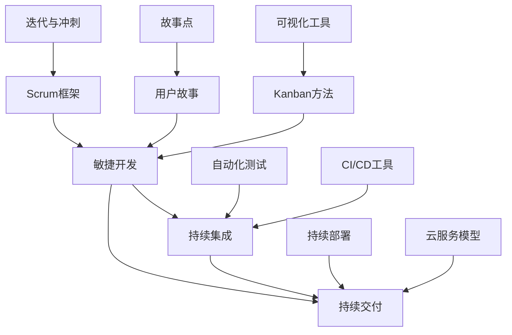

                 

# 如何打造高效的产品开发流程

> **关键词：** 产品开发、敏捷方法、团队协作、流程优化、持续集成、持续交付

> **摘要：** 本文将探讨如何通过优化产品开发流程，提高软件开发团队的工作效率和质量。我们将深入分析敏捷开发、持续集成与持续交付等核心概念，并通过具体案例进行实践指导，帮助读者构建一个高效、灵活且可扩展的产品开发流程。

## 1. 背景介绍

### 1.1 目的和范围

本文旨在为软件开发团队提供一套系统性、实用性的产品开发流程优化指南。我们希望通过本文的阐述，帮助读者理解并实践高效的产品开发方法，从而提升团队的整体生产力。

本文将涵盖以下内容：

- 敏捷开发方法论及其核心原则
- 持续集成与持续交付的原理和实践
- 产品开发流程的优化策略
- 实战案例分析与经验总结

### 1.2 预期读者

本文适合以下读者群体：

- 软件开发团队的领导者和管理者
- 软件工程师和技术专家
- 项目经理和产品经理
- 对软件工程有兴趣的爱好者

### 1.3 文档结构概述

本文结构如下：

- 第1章：背景介绍，概述本文的目的、内容和结构。
- 第2章：核心概念与联系，介绍敏捷开发、持续集成和持续交付等核心概念。
- 第3章：核心算法原理与具体操作步骤，详细讲解敏捷开发的方法和工具。
- 第4章：数学模型和公式，探讨产品开发过程中的关键数学模型。
- 第5章：项目实战，通过具体案例展示流程优化效果。
- 第6章：实际应用场景，分析不同场景下的流程优化方法。
- 第7章：工具和资源推荐，推荐学习资源和开发工具。
- 第8章：总结：未来发展趋势与挑战。
- 第9章：附录，解答常见问题。
- 第10章：扩展阅读与参考资料，提供进一步学习资源。

### 1.4 术语表

#### 1.4.1 核心术语定义

- **敏捷开发（Agile Development）：** 一种以人为核心、迭代、渐进的开发方法。
- **持续集成（Continuous Integration，CI）：** 通过自动化构建和测试，确保代码库的稳定性。
- **持续交付（Continuous Delivery，CD）：** 实现自动化部署和交付，确保产品的高质量。
- **Scrum：** 一种敏捷开发框架，强调迭代、快速反馈和团队协作。
- **用户故事（User Story）：** 用户视角下的需求描述。

#### 1.4.2 相关概念解释

- **迭代（Iteration）：** 软件开发中的周期性工作单元，通常持续数周。
- **冲刺（Sprint）：** Scrum中的迭代周期，通常持续2-4周。
- **看板（Kanban）：** 一种可视化项目管理工具，用于优化工作流程。
- **故事点（Story Points）：** 用于估算任务工作量的单位。

#### 1.4.3 缩略词列表

- **CI/CD：** 持续集成/持续交付
- **SaaS：** 软件即服务
- **PaaS：** 平台即服务
- **IaaS：** 基础设施即服务

## 2. 核心概念与联系

为了更好地理解高效产品开发流程，我们需要首先掌握几个核心概念，并了解它们之间的相互关系。以下是这些核心概念及其相互关系的Mermaid流程图：



### 2.1 敏捷开发（Agile Development）

敏捷开发是一种以人为核心、迭代、渐进的开发方法。其核心理念包括：

- **个体和互动高于过程和工具：** 重视团队成员的互动和协作，而非依赖特定的工具或流程。
- **可工作的软件高于详尽的文档：** 产出可工作的软件是最高优先级，文档只是辅助。
- **客户协作高于合同谈判：** 与客户的紧密合作，确保需求及时调整和响应。
- **响应变化高于遵循计划：** 面对变化，敏捷团队更倾向于快速适应和调整。

### 2.2 持续集成与持续交付

持续集成（CI）和持续交付（CD）是敏捷开发的重要支柱。它们的核心目标是确保代码库的稳定性和产品的质量。

- **持续集成（CI）：** 通过自动化构建和测试，将代码库中的更改频繁集成，以发现和修复问题。CI的主要步骤包括代码提交、构建、测试和反馈。
  
  **伪代码示例：**
  ```
  function CI_Process(code_change) {
      build_code(code_change)
      run_tests()
      if (test_failed()) {
          notify_dev_team()
      }
  }
  ```

- **持续交付（CD）：** 在CI的基础上，实现自动化部署和交付，确保产品的高质量。CD的主要步骤包括代码审查、自动化测试、部署和监控。

  **伪代码示例：**
  ```
  function CD_Process(code_change) {
      review_code()
      run_tests()
      if (all_tests_passed()) {
          deploy_to_production()
      }
  }
  ```

### 2.3 Scrum框架

Scrum是一种敏捷开发框架，强调迭代、快速反馈和团队协作。Scrum的核心组件包括：

- **Scrum团队：** 由产品负责人、Scrum Master和开发团队组成。
- **用户故事：** 用户视角下的需求描述。
- **迭代（Sprint）：** 通常持续2-4周，每个迭代产出一个可工作的产品增量。
- **回顾会议：** 每个迭代结束时进行的反思和改进会议。

### 2.4 其他核心概念

- **Kanban方法：** 一种可视化项目管理工具，用于优化工作流程。通过看板，团队可以直观地了解任务的进展和瓶颈。

  **伪代码示例：**
  ```
  function Kanban_Process(task) {
      if (task_in_queue()) {
          start_task()
      } else if (task_in_progress()) {
          continue_task()
      } else if (task_in_review()) {
          review_task()
      } else if (task_completed()) {
          finish_task()
      }
  }
  ```

- **迭代与冲刺：** 迭代是软件开发中的周期性工作单元，通常持续数周。每个迭代产出一个可工作的产品增量。

- **故事点：** 用于估算任务工作量的单位，帮助团队规划迭代工作。

  **伪代码示例：**
  ```
  function Estimate_Workload(task) {
      story_points = calculate_points(task)
      return story_points
  }
  ```

## 3. 核心算法原理与具体操作步骤

在敏捷开发中，核心算法原理包括用户故事的编写、迭代规划、任务估算和进度跟踪。以下是这些核心算法原理的具体操作步骤：

### 3.1 用户故事的编写

用户故事是一种简单、清晰的需求描述方式，通常采用以下格式：

```
As a [用户类型], I want [功能]，so that [目标价值]。
```

编写用户故事时，应遵循以下原则：

- **用户为中心：** 强调用户的需求和体验。
- **简单明了：** 避免复杂和冗长的描述。
- **可测试性：** 确保用户故事可以被测试。

**伪代码示例：**
```
function Write_Story(story) {
    if (story_format_match("As a [用户类型], I want [功能]，so that [目标价值]")) {
        return true
    } else {
        return false
    }
}
```

### 3.2 迭代规划

迭代规划是敏捷开发中的重要环节。以下是迭代规划的步骤：

1. **确定迭代目标：** 根据产品愿景和用户需求，确定本次迭代的总体目标。
2. **用户故事排序：** 根据优先级和难度，对用户故事进行排序。
3. **任务分配：** 根据用户故事的估算工作量，分配任务给团队成员。
4. **迭代时间规划：** 确定迭代的时间范围，通常为2-4周。

**伪代码示例：**
```
function Sprint_Planning(stories) {
    sorted_stories = Sort_Stories(stories)
    for (story in sorted_stories) {
        if (story_prioritized()) {
            assign_task_to_dev(story)
        }
    }
    set_sprint_duration()
}
```

### 3.3 任务估算

任务估算是敏捷开发中的关键步骤。以下是任务估算的步骤：

1. **故事分解：** 将用户故事分解为更细粒度的任务。
2. **故事点估算：** 使用故事点对任务进行估算。
3. **任务优先级排序：** 根据故事点和优先级，对任务进行排序。

**伪代码示例：**
```
function Estimate_Task(story) {
    tasks = Decompose_Story(story)
    for (task in tasks) {
        story_points = Calculate_Points(task)
        set_task_priorities(story_points)
    }
    sorted_tasks = Sort_Tasks(tasks)
    return sorted_tasks
}
```

### 3.4 进度跟踪

进度跟踪是确保迭代顺利进行的重要手段。以下是进度跟踪的步骤：

1. **每日站会：** 团队成员每日进行简短会议，讨论任务进展和问题。
2. **看板更新：** 使用看板工具，实时更新任务状态和进展。
3. **迭代回顾：** 迭代结束时，进行反思和改进会议。

**伪代码示例：**
```
function Track_Progress(tasks) {
    daily_meeting()
    update_kanban_board(tasks)
    if (sprint_end()) {
        retrospective_meeting()
    }
}
```

## 4. 数学模型和公式与详细讲解与举例说明

在产品开发过程中，数学模型和公式扮演着重要角色，尤其在任务估算、进度管理和风险评估等方面。以下是一些关键的数学模型和公式，并结合具体例子进行详细讲解。

### 4.1 任务估算中的故事点（Story Points）

故事点是一种用于估算任务工作量的单位，它有助于团队规划和优先级排序。故事点的估算通常基于以下公式：

$$
\text{Story Points} = \frac{\text{任务复杂性}}{\text{团队工作效率}}
$$

**例子：** 假设一个团队的工作效率为2人天/故事点，一个任务被认为具有中等复杂性，那么该任务的估算故事点为：

$$
\text{Story Points} = \frac{3}{2} = 1.5
$$

### 4.2 进度跟踪中的进度函数（Progress Function）

进度函数用于衡量团队在迭代期间的工作进度，通常采用以下公式：

$$
\text{Progress} = \frac{\text{已完成任务数量}}{\text{总任务数量}}
$$

**例子：** 假设一个迭代包含10个任务，已完成5个任务，那么当前的进度为：

$$
\text{Progress} = \frac{5}{10} = 0.5
$$

### 4.3 风险评估中的标准差（Standard Deviation）

在项目管理和风险评估中，标准差用于衡量任务完成时间的波动性。标准差的计算公式为：

$$
\sigma = \sqrt{\frac{\sum_{i=1}^{n} (x_i - \mu)^2}{n}}
$$

其中，\( x_i \)为每个任务的实际完成时间，\( \mu \)为平均完成时间，\( n \)为任务数量。

**例子：** 假设一个项目包含5个任务，实际完成时间分别为5天、7天、6天、8天和6天，平均完成时间为6.4天，那么标准差为：

$$
\sigma = \sqrt{\frac{(5-6.4)^2 + (7-6.4)^2 + (6-6.4)^2 + (8-6.4)^2 + (6-6.4)^2}{5}} \approx 0.816
$$

### 4.4 项目的整体进度预测（Project Progress Forecast）

通过结合进度函数和标准差，可以预测项目的整体进度。预测公式为：

$$
\text{Expected Completion Time} = \mu + \sigma \cdot \text{Z-score}
$$

其中，\( \text{Z-score} \)为正态分布的标准化分数，通常取值为2或3（对应95%或99%的置信水平）。

**例子：** 假设当前进度函数为0.5，标准差为0.816，取95%置信水平，预测项目完成时间为：

$$
\text{Expected Completion Time} = 6.4 + 0.816 \cdot 2 \approx 7.82 \text{天}
$$

## 5. 项目实战：代码实际案例和详细解释说明

### 5.1 开发环境搭建

为了实践敏捷开发、持续集成和持续交付，我们将使用以下开发环境：

- **编程语言：** Java
- **集成开发环境（IDE）：** IntelliJ IDEA
- **版本控制工具：** Git
- **构建工具：** Maven
- **自动化测试工具：** JUnit
- **持续集成工具：** Jenkins
- **持续交付工具：** Docker

首先，确保安装了Java开发环境、IntelliJ IDEA和Git。然后，创建一个新项目，并使用Maven配置项目的依赖关系。以下是一个简单的Maven项目结构示例：

```
project/
|-- src/
|   |-- main/
|   |   |-- java/
|   |   |   |-- com/
|   |   |   |   |-- example/
|   |   |   |   |   |-- App.java
|   |-- test/
|   |   |-- java/
|   |   |   |-- com/
|   |   |   |   |-- example/
|   |   |   |   |   |-- AppTest.java
|-- pom.xml
```

### 5.2 源代码详细实现和代码解读

**5.2.1 App.java**

以下是一个简单的Java应用程序，用于计算两个数的和：

```java
package com.example;

public class App {
    public static int add(int a, int b) {
        return a + b;
    }
}
```

**5.2.2 AppTest.java**

为了确保App类的add方法正确工作，我们编写了以下JUnit测试用例：

```java
package com.example;

import org.junit.jupiter.api.Test;
import static org.junit.jupiter.api.Assertions.assertEquals;

public class AppTest {
    @Test
    public void testAdd() {
        assertEquals(5, App.add(2, 3));
        assertEquals(0, App.add(-1, 1));
        assertEquals(100, App.add(50, 50));
    }
}
```

### 5.3 代码解读与分析

**5.3.1 App.java**

App.java中的App类定义了一个名为add的方法，该方法接受两个整数参数，并返回它们的和。这是一种简单的业务逻辑实现。

**5.3.2 AppTest.java**

AppTest.java中的测试用例用于验证add方法的正确性。通过使用JUnit的assertEquals方法，我们确保add方法在不同输入情况下都能返回正确的结果。这有助于确保代码的质量和可靠性。

### 5.4 持续集成与持续交付

为了实现持续集成和持续交付，我们将在Jenkins上配置一个CI/CD流水线。以下是一个简单的Jenkinsfile示例：

```groovy
pipeline {
    agent any

    stages {
        stage('Build') {
            steps {
                sh 'mvn clean install'
            }
        }
        stage('Test') {
            steps {
                sh 'mvn test'
            }
        }
        stage('Deploy') {
            steps {
                sh 'docker build -t myapp .'
                sh 'docker run -d -p 8080:8080 myapp'
            }
        }
    }
}
```

**5.4.1 Build阶段**

Build阶段使用Maven构建项目，并执行所有的测试用例。如果构建失败或测试失败，流水线将停止并报告错误。

**5.4.2 Test阶段**

Test阶段继续执行Maven的测试目标，确保所有测试用例通过。

**5.4.3 Deploy阶段**

Deploy阶段使用Docker构建和运行应用程序。这确保了应用程序的版本控制和易于部署。

### 5.5 代码解读与分析

**5.5.1 Jenkinsfile**

Jenkinsfile定义了一个简单的CI/CD流水线，包括三个阶段：构建（Build）、测试（Test）和部署（Deploy）。这种流水线确保了代码在提交后立即构建、测试和部署，从而提高了开发效率和产品质量。

## 6. 实际应用场景

敏捷开发、持续集成和持续交付在软件行业中得到了广泛应用，以下是一些典型的实际应用场景：

### 6.1 startup公司

对于初创公司，敏捷开发方法可以帮助团队快速响应市场变化，持续迭代产品。持续集成和持续交付确保了代码库的稳定性和产品的质量，从而提高了客户满意度。

### 6.2 大型企业

大型企业通常拥有复杂的系统和技术栈。敏捷开发方法可以帮助企业分阶段实现技术升级和优化，持续集成和持续交付则确保了各个系统的稳定性和兼容性。

### 6.3 云服务提供商

云服务提供商需要快速部署和更新服务，以满足不断变化的市场需求。敏捷开发方法可以帮助团队快速响应客户需求，持续集成和持续交付则确保了服务的稳定性和可用性。

### 6.4 产品开发团队

产品开发团队可以使用敏捷开发方法来优化项目规划和管理，持续集成和持续交付则确保了产品的质量。通过使用看板工具，团队可以直观地了解任务的进展和瓶颈，从而提高工作效率。

## 7. 工具和资源推荐

### 7.1 学习资源推荐

**7.1.1 书籍推荐**

- 《敏捷软件开发：实践者之路》（Agile Software Development: Principles, Patterns, and Practices）
- 《持续交付：发布可靠软件的系统化方法》（Continuous Delivery: Reliable Software Releases through Build, Test, and Deployment Automation）
- 《Scrum精髓：实践指南》（Scrum: The Art of Doing Twice the Work in Half the Time）

**7.1.2 在线课程**

- 《敏捷软件开发基础》（Agile Software Development Foundations）- Coursera
- 《持续集成与持续交付》（Continuous Integration and Continuous Deployment）- Pluralsight
- 《敏捷项目管理》（Agile Project Management）- LinkedIn Learning

**7.1.3 技术博客和网站**

- 《敏捷方法与实践》（Agile Methodology and Practices）- Agile Alliance
- 《持续集成与持续交付》（Continuous Integration and Continuous Deployment）- JAXenter
- 《敏捷开发》（Agile Development）- InfoQ

### 7.2 开发工具框架推荐

**7.2.1 IDE和编辑器**

- IntelliJ IDEA
- Visual Studio Code
- Eclipse

**7.2.2 调试和性能分析工具**

- JUnit
- JMeter
- New Relic

**7.2.3 相关框架和库**

- Spring Boot
- Docker
- Kubernetes

### 7.3 相关论文著作推荐

**7.3.1 经典论文**

- 《敏捷开发宣言》（Manifesto for Agile Software Development）
- 《持续集成：成功的软件开发实践》（Continuous Integration: Improving Software Quality and Reducing Risk）

**7.3.2 最新研究成果**

- 《基于敏捷开发的软件项目管理研究》（Research on Software Project Management Based on Agile Development）
- 《持续交付在金融领域的应用》（Application of Continuous Delivery in the Financial Industry）

**7.3.3 应用案例分析**

- 《从传统开发到敏捷开发的转型》（Transition from Traditional Development to Agile Development）
- 《敏捷方法在医疗设备行业的实践》（Practice of Agile Methodology in the Medical Device Industry）

## 8. 总结：未来发展趋势与挑战

### 8.1 发展趋势

- **云计算和边缘计算的融合：** 云计算和边缘计算的结合将进一步提升软件开发的效率和灵活性。
- **人工智能和机器学习的应用：** AI和ML技术将在软件开发中发挥越来越重要的作用，如自动化测试、代码审查和智能规划等。
- **DevOps的普及：** DevOps文化的普及将推动持续集成和持续交付的广泛应用，进一步优化产品开发流程。

### 8.2 挑战

- **技术栈的复杂度：** 随着技术的不断发展，软件系统的复杂度将不断提高，对团队的技术能力和项目管理能力提出更高要求。
- **团队协作的挑战：** 敏捷开发强调团队协作，但如何有效地协调不同职能团队之间的工作，仍是一个挑战。
- **持续学习的压力：** 随着技术的快速发展，软件开发团队需要不断学习新技术和方法，以保持竞争力。

## 9. 附录：常见问题与解答

### 9.1 什么是敏捷开发？

敏捷开发是一种以人为核心、迭代、渐进的开发方法，强调快速响应变化、持续交付高质量产品。

### 9.2 持续集成和持续交付有什么区别？

持续集成（CI）侧重于代码的集成和测试，确保代码库的稳定性。持续交付（CD）则侧重于自动化部署和交付，确保产品的质量。

### 9.3 如何选择敏捷开发框架？

根据项目需求和团队特点，可以选择Scrum、Kanban或其他适合的敏捷开发框架。

### 9.4 敏捷开发中的用户故事如何编写？

用户故事应采用以下格式：“As a [用户类型], I want [功能]，so that [目标价值]”。

### 9.5 如何进行任务估算？

任务估算可以使用故事点、人天或其他单位进行。通常，团队会根据历史数据和专家经验进行估算。

## 10. 扩展阅读 & 参考资料

- 《敏捷开发：原则、实践与模式》（Agile Software Development: Principles, Patterns, and Practices）
- 《持续交付：成功发布可靠软件的系统化方法》（Continuous Delivery: Reliable Software Releases through Build, Test, and Deployment Automation）
- 《Scrum精髓：实践指南》（Scrum: The Art of Doing Twice the Work in Half the Time）
- 《敏捷方法与实践》（Agile Methodology and Practices）- Agile Alliance
- 《持续集成与持续交付》（Continuous Integration and Continuous Deployment）- JAXenter
- 《敏捷开发》（Agile Development）- InfoQ
- 《云计算与边缘计算融合应用研究》（Research on Application of Cloud Computing and Edge Computing）
- 《人工智能在软件开发中的应用研究》（Research on Application of Artificial Intelligence in Software Development）
- 《DevOps文化在软件开发中的应用》（Application of DevOps Culture in Software Development）
- 《软件复杂度评估方法研究》（Research on Software Complexity Evaluation Methods）
- 《团队协作与项目管理挑战》（Challenges of Team Collaboration and Project Management）
- 《持续学习与技能提升策略》（Continuous Learning and Skill Improvement Strategies）

