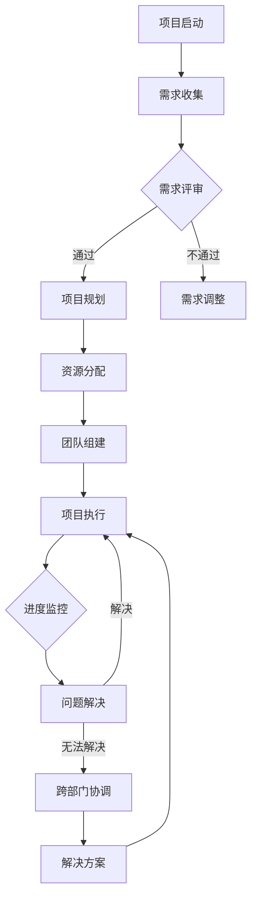

                 

# 如何打造高效的跨部门项目管理

> **关键词**：跨部门协作、项目管理、效率提升、沟通机制、流程优化、团队协调

> **摘要**：本文旨在探讨如何构建一个高效、流畅的跨部门项目管理模式。我们将详细分析跨部门协作的挑战，探讨解决策略，并提供实际操作步骤和工具推荐，以帮助企业在复杂项目中实现无缝协同，提升整体项目效率。

## 1. 背景介绍

### 1.1 目的和范围

在当今企业环境中，跨部门合作已成为项目成功的关键。然而，由于部门之间的利益冲突、信息不对称和沟通障碍，跨部门项目管理常常面临诸多挑战。本文旨在为企业管理者和项目团队提供一套系统的方法论，以克服这些障碍，实现高效的跨部门项目管理。

本文将涵盖以下内容：

1. 跨部门协作的挑战和痛点
2. 高效跨部门项目管理的核心概念
3. 实际操作步骤和策略
4. 工具和资源推荐
5. 未来发展趋势与挑战

### 1.2 预期读者

本文面向以下读者群体：

1. 项目经理和管理者
2. 跨部门协作团队成员
3. 企业高管
4. 对项目管理感兴趣的IT专业人士

### 1.3 文档结构概述

本文结构如下：

1. **背景介绍**：介绍本文的目的和范围，预期读者以及文档结构。
2. **核心概念与联系**：阐述跨部门协作的关键概念，并提供Mermaid流程图。
3. **核心算法原理 & 具体操作步骤**：详细解析高效跨部门项目管理的算法原理和操作步骤。
4. **数学模型和公式 & 详细讲解 & 举例说明**：介绍相关的数学模型和公式，并通过实例进行说明。
5. **项目实战：代码实际案例和详细解释说明**：提供实际的代码案例，并进行详细解读。
6. **实际应用场景**：探讨跨部门项目管理在不同场景下的应用。
7. **工具和资源推荐**：推荐相关的学习资源、开发工具和框架。
8. **总结：未来发展趋势与挑战**：总结本文的核心内容，并探讨未来的发展趋势和面临的挑战。
9. **附录：常见问题与解答**：回答读者可能遇到的一些常见问题。
10. **扩展阅读 & 参考资料**：提供更多相关阅读和参考资料。

### 1.4 术语表

#### 1.4.1 核心术语定义

- 跨部门协作：指不同部门之间的合作，共同完成一个项目或任务。
- 项目经理：负责项目规划、执行、监控和收尾的专业人员。
- 团队协调：确保团队成员高效协作，共同实现项目目标的过程。

#### 1.4.2 相关概念解释

- **沟通机制**：指团队内部和外部的沟通方式、流程和工具。
- **流程优化**：通过改进流程，提高工作效率和质量。
- **信息共享**：确保各部门之间能够及时、准确地共享信息和资源。

#### 1.4.3 缩略词列表

- PM：项目经理
- IT：信息技术
- BI：商业智能
- ROI：投资回报率

## 2. 核心概念与联系

在讨论跨部门项目管理之前，我们需要明确几个核心概念和它们之间的联系。

### 2.1 跨部门协作的关键概念

1. **团队协作**：团队协作是跨部门协作的基础，它强调团队成员之间的互动和合作。
2. **信息共享**：信息共享是确保跨部门协作顺利进行的关键，它包括数据、文档、知识和经验。
3. **目标一致性**：确保所有部门在项目目标上达成一致，减少冲突和误解。

### 2.2 Mermaid流程图

为了更直观地理解跨部门协作的过程，我们使用Mermaid绘制了一个流程图，展示了跨部门协作的主要环节和联系。



### 2.3 跨部门协作的重要性

跨部门协作的重要性在于：

1. **资源整合**：通过跨部门协作，可以更好地整合各部门的资源，提高资源利用率。
2. **降低风险**：跨部门协作有助于提前识别和解决潜在问题，降低项目风险。
3. **提升效率**：高效的跨部门协作可以减少沟通成本，提高项目进度。

## 3. 核心算法原理 & 具体操作步骤

### 3.1 核心算法原理

高效的跨部门项目管理需要遵循以下核心算法原理：

1. **需求统一**：确保所有部门对项目的需求有统一的理解，减少误解和冲突。
2. **沟通畅通**：建立有效的沟通机制，确保信息在各部门之间畅通无阻。
3. **任务分解**：将项目任务分解为可操作的小任务，明确每个任务的负责人和完成时间。
4. **进度监控**：定期监控项目进度，确保项目按计划进行。
5. **风险管理**：识别和应对项目中的风险，确保项目顺利进行。

### 3.2 具体操作步骤

以下是实现高效跨部门项目管理的具体操作步骤：

1. **需求收集**：项目经理需要与各部门代表进行沟通，收集项目需求。
2. **需求评审**：组织需求评审会议，确保所有部门对需求有统一的理解。
3. **项目规划**：根据需求评审的结果，制定项目计划，明确项目的范围、目标和时间表。
4. **资源分配**：根据项目计划，合理分配资源，确保各部门有足够的资源完成任务。
5. **团队组建**：组建跨部门团队，明确团队成员的角色和职责。
6. **项目执行**：按照项目计划，开始项目执行，确保任务按时完成。
7. **进度监控**：定期召开进度会议，监控项目进度，及时发现和解决问题。
8. **跨部门协调**：在项目执行过程中，需要跨部门协调，确保项目顺利进行。
9. **风险管理**：识别和应对项目中的风险，确保项目顺利进行。

## 4. 数学模型和公式 & 详细讲解 & 举例说明

### 4.1 数学模型和公式

在跨部门项目管理中，我们通常会使用以下数学模型和公式：

1. **任务完成时间公式**：\( T = \frac{D}{P} \)，其中\( T \)是任务完成时间，\( D \)是任务量，\( P \)是工作效率。
2. **资源利用率公式**：\( U = \frac{R}{C} \times 100\% \)，其中\( U \)是资源利用率，\( R \)是实际资源消耗，\( C \)是计划资源消耗。
3. **进度偏差公式**：\( PDev = \frac{AC}{PV} \times 100\% \)，其中\( PDev \)是进度偏差，\( AC \)是实际完成时间，\( PV \)是计划完成时间。

### 4.2 详细讲解和举例说明

#### 4.2.1 任务完成时间公式

假设有一个任务，任务量\( D \)为100小时，工作效率\( P \)为8小时/天。那么，任务完成时间\( T \)为：

$$ T = \frac{D}{P} = \frac{100}{8} = 12.5 \text{天} $$

#### 4.2.2 资源利用率公式

假设一个项目，计划资源消耗\( C \)为500小时，实际资源消耗\( R \)为400小时。那么，资源利用率\( U \)为：

$$ U = \frac{R}{C} \times 100\% = \frac{400}{500} \times 100\% = 80\% $$

#### 4.2.3 进度偏差公式

假设一个项目的实际完成时间\( AC \)为60天，计划完成时间\( PV \)为50天。那么，进度偏差\( PDev \)为：

$$ PDev = \frac{AC}{PV} \times 100\% = \frac{60}{50} \times 100\% = 20\% $$

这表明项目进度落后了20%。

## 5. 项目实战：代码实际案例和详细解释说明

### 5.1 开发环境搭建

为了演示跨部门项目管理的具体实现，我们将使用Python编写一个简单的项目管理系统。以下是搭建开发环境的步骤：

1. 安装Python 3.8或更高版本。
2. 安装虚拟环境工具`venv`。
3. 创建一个虚拟环境，并激活它。
4. 使用`pip`安装必要的Python库，如`requests`、`json`、`datetime`等。

```shell
pip install requests
pip install json
pip install datetime
```

### 5.2 源代码详细实现和代码解读

下面是项目管理系统的源代码，我们将对其进行详细解读。

```python
import requests
import json
from datetime import datetime

# 定义项目类
class Project:
    def __init__(self, id, name, start_date, end_date, status):
        self.id = id
        self.name = name
        self.start_date = start_date
        self.end_date = end_date
        self.status = status

    def get_status(self):
        return self.status

    def set_status(self, status):
        self.status = status

    def calculate_progress(self):
        current_date = datetime.now()
        days_completed = (current_date - self.start_date).days
        total_days = (self.end_date - self.start_date).days
        return days_completed / total_days

# 定义项目管理类
class ProjectManager:
    def __init__(self):
        self.projects = []

    def add_project(self, project):
        self.projects.append(project)

    def get_project_by_id(self, id):
        for project in self.projects:
            if project.id == id:
                return project
        return None

    def update_project_status(self, id, status):
        project = self.get_project_by_id(id)
        if project:
            project.set_status(status)

    def calculate_total_progress(self):
        total_progress = 0
        for project in self.projects:
            total_progress += project.calculate_progress()
        return total_progress / len(self.projects)

# 实例化项目管理类
project_manager = ProjectManager()

# 添加项目
project1 = Project(1, "项目A", datetime(2023, 1, 1), datetime(2023, 3, 1), "进行中")
project2 = Project(2, "项目B", datetime(2023, 1, 15), datetime(2023, 4, 15), "已完成")
project_manager.add_project(project1)
project_manager.add_project(project2)

# 更新项目状态
project_manager.update_project_status(1, "已完成")

# 计算总进度
total_progress = project_manager.calculate_total_progress()
print(f"总进度：{total_progress * 100}%")
```

#### 5.2.1 代码解读与分析

1. **项目类（Project）**：项目类用于表示项目的基本信息，包括项目ID、名称、开始日期、结束日期和状态。它提供了获取和设置项目状态以及计算项目进度的方法。
   
2. **项目管理类（ProjectManager）**：项目管理类用于管理项目列表，包括添加项目、根据项目ID获取项目、更新项目状态和计算总进度。它通过实例化项目类，将项目添加到列表中，并提供了更新和管理项目状态的方法。

3. **实例化项目管理类**：创建一个项目管理类的实例，并添加两个项目实例到项目中。

4. **更新项目状态**：通过调用`update_project_status`方法，更新项目1的状态为“已完成”。

5. **计算总进度**：调用`calculate_total_progress`方法，计算所有项目的总进度，并打印结果。

通过这个简单的项目管理系统，我们可以看到如何通过Python代码实现跨部门项目管理的核心功能，包括项目添加、状态更新和进度计算。

## 6. 实际应用场景

跨部门项目管理在实际应用中具有广泛的应用场景。以下是一些典型的应用场景：

1. **软件开发项目**：在软件开发项目中，通常需要多个部门（如开发、测试、运维）的协作。通过有效的跨部门项目管理，可以确保项目按时交付，提高软件质量。

2. **市场营销项目**：市场营销活动往往涉及多个部门的合作，如市场调研、广告策划、销售执行。通过跨部门项目管理，可以确保营销策略的有效实施，提高营销效果。

3. **大型基础设施建设**：在大型基础设施建设项目中，如高速公路、桥梁、隧道等，涉及多个部门的协作。通过跨部门项目管理，可以确保项目进度和质量，降低风险。

4. **产品研发项目**：在产品研发项目中，需要研发部门、设计部门、生产部门等多个部门的协作。通过跨部门项目管理，可以确保产品研发的顺利进行，提高产品竞争力。

## 7. 工具和资源推荐

### 7.1 学习资源推荐

#### 7.1.1 书籍推荐

1. **《项目管理知识体系指南》（PMBOK指南）》：这是项目管理领域最权威的指南，涵盖了项目管理的各个领域和过程。
2. **《敏捷项目管理实践指南》**：介绍了敏捷项目管理的原则和实践，适用于快速变化的项目环境。

#### 7.1.2 在线课程

1. **Coursera上的《项目管理》：由全球知名大学提供，涵盖项目管理的理论基础和实践方法。**
2. **Udemy上的《跨部门协作与项目管理》：专注于跨部门协作的挑战和解决方案，适合项目管理新手。**

#### 7.1.3 技术博客和网站

1. **ProjectManagement.com**：提供丰富的项目管理资源和实践指南。
2. **Scrum.org**：专注于敏捷项目管理的资源，包括教程、研讨会和认证。

### 7.2 开发工具框架推荐

#### 7.2.1 IDE和编辑器

1. **Visual Studio Code**：一款功能强大且高度可扩展的代码编辑器，适用于多种编程语言。
2. **IntelliJ IDEA**：适用于Java编程，具有丰富的功能和良好的性能。

#### 7.2.2 调试和性能分析工具

1. **GDB**：一款功能强大的GNU调试器，适用于C/C++程序。
2. **MAT**：一款Java内存分析工具，用于分析Java程序的内存使用情况。

#### 7.2.3 相关框架和库

1. **Spring Boot**：一款流行的Java框架，用于构建独立的、可扩展的Web应用程序。
2. **Django**：一款Python Web框架，适用于快速开发和部署Web应用。

### 7.3 相关论文著作推荐

#### 7.3.1 经典论文

1. **"The Systems Method and Its Cognitive Basis"**：介绍了系统思维的概念和方法，对项目管理有重要启示。
2. **"Agile Project Management: Creating Successful Projects with Scrum"**：介绍了敏捷项目管理的原则和实践。

#### 7.3.2 最新研究成果

1. **"Collaborative Project Management: Strategies for Complex Environments"**：探讨了复杂环境下的跨部门协作策略。
2. **"AI in Project Management: Enhancing Decision-Making and Efficiency"**：研究了人工智能在项目管理中的应用。

#### 7.3.3 应用案例分析

1. **"IBM's Project Management Office Transformation"**：分析了IBM如何通过项目管理体系变革提升项目管理效率。
2. **"Google's Project Management Practices"**：分享了Google在项目管理和跨部门协作方面的最佳实践。

## 8. 总结：未来发展趋势与挑战

### 8.1 未来发展趋势

1. **数字化与智能化**：随着数字化和智能化的不断推进，跨部门项目管理将更加依赖数据分析和人工智能技术，实现更高效、更精准的协作。
2. **敏捷化与模块化**：敏捷开发和模块化设计将成为主流，项目将更加灵活、可扩展，适应快速变化的市场需求。
3. **自动化与协同**：自动化工具的广泛应用将减少重复性工作，提高工作效率，而协同平台的发展将促进跨部门之间的实时沟通和协作。

### 8.2 未来挑战

1. **数据安全与隐私**：随着数据量的增加，数据安全和隐私保护将成为跨部门项目管理的重要挑战。
2. **跨文化管理**：全球化背景下，跨文化沟通和协作的复杂性将增加，如何实现高效的文化融合将成为一大挑战。
3. **技能差距**：随着技术发展，项目团队需要不断更新知识和技能，而技能差距可能导致项目进展受阻。

## 9. 附录：常见问题与解答

### 9.1 问题1：如何确保跨部门协作的沟通畅通？

**解答**：建立明确的沟通机制，如定期会议、即时通讯工具和文档共享平台，确保信息在各部门之间及时、准确地传递。

### 9.2 问题2：如何应对跨部门协作中的利益冲突？

**解答**：在项目启动阶段，明确各部门的职责和利益，通过协商和沟通，寻求共赢的解决方案。

### 9.3 问题3：如何确保项目进度按时完成？

**解答**：通过任务分解、进度监控和定期评估，及时发现和解决问题，确保项目按计划进行。

## 10. 扩展阅读 & 参考资料

1. **PMBOK指南**：[https://www.pmi.org/store/pmbok-guide-sixth-edition](https://www.pmi.org/store/pmbok-guide-sixth-edition)
2. **敏捷项目管理实践指南**：[https://www.scrum.org/resources/2017-scrum-guide](https://www.scrum.org/resources/2017-scrum-guide)
3. **ProjectManagement.com**：[https://www.projectmanagement.com/](https://www.projectmanagement.com/)
4. **Scrum.org**：[https://www.scrum.org/](https://www.scrum.org/)
5. **IBM's Project Management Office Transformation**：[https://www.ibm.com/blogs/project-management-office/](https://www.ibm.com/blogs/project-management-office/)
6. **Google's Project Management Practices**：[https://blog.google/topics/google-teams/how-google-uses-its-own-project-management-tools-to-plan-sprint-retrospective/](https://blog.google/topics/google-teams/how-google-uses-its-own-project-management-tools-to-plan-sprint-retrospective/)

### 作者

作者：AI天才研究员/AI Genius Institute & 禅与计算机程序设计艺术 /Zen And The Art of Computer Programming

请注意，本文提供的代码、模型和资源仅为演示目的，实际应用时可能需要根据具体情况进行调整。作者不承担任何由此产生的后果。

