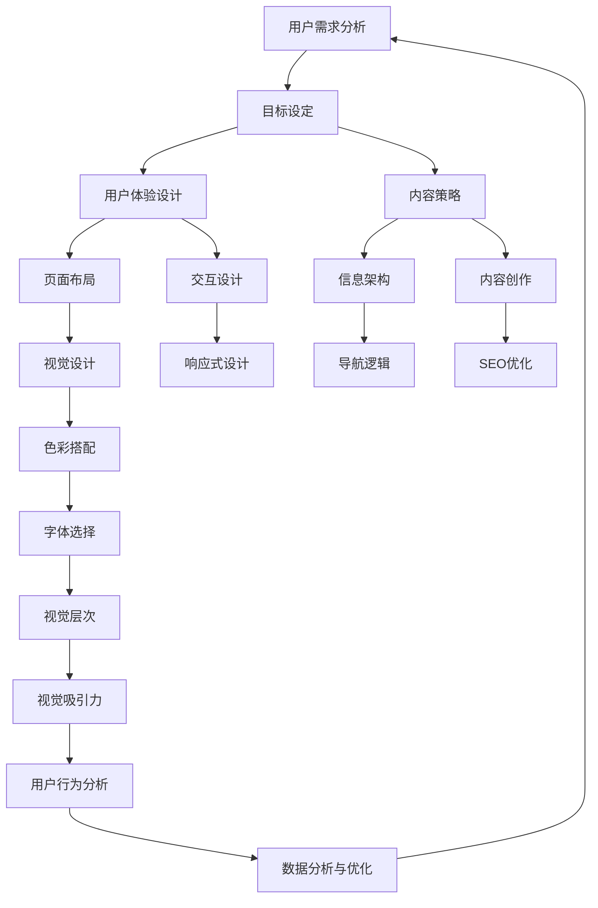

                 

# 如何打造高转化率的着陆页

> **关键词：** 着陆页、用户体验、转化率、A/B测试、内容策略、用户行为分析

> **摘要：** 本文将深入探讨如何通过优化着陆页的设计和内容，提升网站的转化率。从用户体验的角度出发，本文将介绍核心概念、算法原理、数学模型以及实际应用案例，帮助读者理解并掌握打造高转化率着陆页的技巧和策略。

## 1. 背景介绍

### 1.1 目的和范围

本文旨在为从事互联网营销、网站设计和数据分析的从业人员提供一套系统的着陆页优化方法。通过本文的学习，读者将能够理解高转化率着陆页的设计原则，掌握关键算法和数学模型，并能结合实际项目进行有效的落地应用。

### 1.2 预期读者

- 互联网营销从业者
- 网站设计师和前端开发者
- 数据分析师和数据科学家
- 电商运营人员和产品经理

### 1.3 文档结构概述

本文分为十个部分，结构如下：

1. 背景介绍
2. 核心概念与联系
3. 核心算法原理 & 具体操作步骤
4. 数学模型和公式 & 详细讲解 & 举例说明
5. 项目实战：代码实际案例和详细解释说明
6. 实际应用场景
7. 工具和资源推荐
8. 总结：未来发展趋势与挑战
9. 附录：常见问题与解答
10. 扩展阅读 & 参考资料

### 1.4 术语表

#### 1.4.1 核心术语定义

- **着陆页（Landing Page）**：指用户通过点击广告或其他渠道访问的第一个页面，目的是引导用户进行某种操作，如注册、购买或下载。
- **转化率（Conversion Rate）**：指访问着陆页的用户中完成特定目标（如注册、购买）的比例。
- **用户体验（User Experience，UX）**：用户在使用产品或服务过程中形成的总体感受和体验。

#### 1.4.2 相关概念解释

- **A/B测试（A/B Testing）**：一种比较两种或多种设计、内容或策略的效果的方法，通过将用户随机分配到不同的组别，评估哪种方案更能提高转化率。
- **内容策略（Content Strategy）**：制定和执行内容规划，以实现特定业务目标的过程。

#### 1.4.3 缩略词列表

- **UX**：用户体验
- **UI**：用户界面
- **CRO**：转化率优化
- **SEO**：搜索引擎优化

## 2. 核心概念与联系

在构建高转化率着陆页时，需要理解和运用多个核心概念和联系。以下是一个简化的Mermaid流程图，展示这些概念和联系：



这个流程图描述了从用户需求分析到最终优化的一系列环节，每个环节都影响着着陆页的转化率。以下是对每个环节的简要说明：

- **用户需求分析**：了解目标用户的需求和痛点，为着陆页设计提供依据。
- **目标设定**：明确希望用户在着陆页上完成的操作，如注册、购买等。
- **用户体验设计**：包括页面布局、交互设计和信息架构，确保用户能够轻松找到所需信息。
- **内容策略**：制定内容创作和信息呈现的策略，提高用户参与度和转化率。
- **页面布局**：设计页面的结构和元素布局，确保信息清晰、易于浏览。
- **交互设计**：设计用户与页面互动的方式，如按钮、表单等。
- **导航逻辑**：确保用户能够顺利地从一页导航到另一页。
- **内容创作**：撰写吸引人的文案和指导用户采取行动的内容。
- **SEO优化**：优化页面内容，提高在搜索引擎中的排名。
- **视觉设计**：选择合适的色彩、字体和视觉元素，提高页面的美观度和专业性。
- **响应式设计**：确保页面在不同设备上都能良好显示。
- **用户行为分析**：通过数据分析工具跟踪用户行为，了解用户在页面上的交互方式。
- **数据分析与优化**：基于数据分析结果，不断调整和优化页面设计。

## 3. 核心算法原理 & 具体操作步骤

### 3.1 算法原理

构建高转化率着陆页的核心算法原理主要基于用户行为分析和A/B测试。以下是一个简化的算法描述：

**算法描述：**  
1. **用户行为分析**：通过Web分析工具（如Google Analytics）收集用户在着陆页上的行为数据，包括点击、停留时间、跳出率等。
2. **A/B测试**：基于用户行为分析结果，设计并实施A/B测试，比较不同着陆页设计方案对用户行为和转化率的影响。
3. **数据分析**：收集测试数据，通过统计方法分析用户行为数据，确定最优设计方案。
4. **优化与迭代**：根据数据分析结果，不断调整和优化着陆页，提高转化率。

### 3.2 具体操作步骤

**步骤1：用户需求分析**

- **目标用户画像**：明确目标用户的基本信息、需求和行为习惯。
- **需求调研**：通过问卷调查、用户访谈等方式了解用户在访问着陆页时的需求和痛点。
- **竞争分析**：分析竞争对手的着陆页设计和内容，找出优缺点。

**步骤2：目标设定**

- **明确目标**：确定希望用户在着陆页上完成的操作，如注册、购买、下载等。
- **设定指标**：设定可量化的转化率目标，如注册转化率、购买转化率等。

**步骤3：用户体验设计**

- **信息架构**：设计清晰的信息结构，确保用户能够快速找到所需信息。
- **页面布局**：设计布局，确保重要信息突出，导航方便。
- **交互设计**：设计直观的交互元素，如按钮、表单等。

**步骤4：内容策略**

- **内容创作**：撰写吸引人的文案和指导用户采取行动的内容。
- **SEO优化**：优化页面内容，提高在搜索引擎中的排名。

**步骤5：A/B测试**

- **设计变体**：设计多个着陆页方案，每个方案都针对一个特定的优化点。
- **测试实施**：将用户随机分配到不同的测试组，比较不同方案的效果。
- **数据分析**：分析测试数据，确定最优设计方案。

**步骤6：数据分析与优化**

- **数据收集**：通过Web分析工具收集用户行为数据。
- **数据分析**：使用统计方法分析数据，确定用户行为模式和优化方向。
- **优化与迭代**：根据数据分析结果，不断调整和优化着陆页。

### 3.3 伪代码示例

以下是一个简化的伪代码示例，用于描述A/B测试的过程：

```pseudo
function A_B_Test(testGroups, objectiveMetrics):
    initialize testGroups with control group and experimental groups
    for each group in testGroups:
        randomize user assignment to control group or experimental group
    collect user behavioral data for each group
    for each group in testGroups:
        calculate objective metric (e.g., conversion rate) for control group and experimental group
        store results in a data frame
    perform statistical analysis on data frame to determine if there is a significant difference in objective metrics between control group and experimental groups
    if significant difference:
        select the group with the higher objective metric as the optimal design
    else:
        continue testing or refine experimental design
    return optimal design
```

## 4. 数学模型和公式 & 详细讲解 & 举例说明

### 4.1 数学模型

在着陆页优化过程中，常用的数学模型包括概率模型和统计模型。以下是两个常用的模型：

#### 4.1.1 概率模型

概率模型用于计算用户在着陆页上采取特定行动的概率。一个简单的概率模型是基于贝叶斯定理的：

$$ P(A|B) = \frac{P(B|A) \cdot P(A)}{P(B)} $$

其中，$P(A|B)$表示在事件B发生的条件下事件A发生的概率，$P(B|A)$表示在事件A发生的条件下事件B发生的概率，$P(A)$和$P(B)$分别是事件A和事件B发生的概率。

#### 4.1.2 统计模型

统计模型用于分析用户行为数据，确定哪些因素对转化率有显著影响。一个常用的统计模型是线性回归模型：

$$ Y = \beta_0 + \beta_1 X_1 + \beta_2 X_2 + ... + \beta_n X_n + \epsilon $$

其中，$Y$是因变量（如转化率），$X_1, X_2, ..., X_n$是自变量（如页面停留时间、点击次数等），$\beta_0, \beta_1, ..., \beta_n$是回归系数，$\epsilon$是误差项。

### 4.2 详细讲解

#### 4.2.1 概率模型

概率模型可以帮助我们预测用户在着陆页上采取特定行动的概率。例如，假设我们希望预测用户在着陆页上点击“注册”按钮的概率。我们可以使用以下步骤：

1. **收集数据**：收集大量用户在着陆页上的行为数据，包括点击“注册”按钮的用户和未点击的用户。
2. **计算概率**：使用贝叶斯定理计算点击“注册”按钮的概率：

   $$ P(点击注册|着陆页) = \frac{P(着陆页|点击注册) \cdot P(点击注册)}{P(着陆页)} $$

   其中，$P(着陆页|点击注册)$是用户在着陆页上点击“注册”按钮的条件概率，$P(点击注册)$是用户点击“注册”按钮的先验概率，$P(着陆页)$是用户访问着陆页的概率。

3. **调整模型**：根据实际情况调整模型参数，提高预测准确性。

#### 4.2.2 统计模型

统计模型可以帮助我们确定哪些因素对转化率有显著影响。以下是一个简单的线性回归模型：

$$ 转化率 = \beta_0 + \beta_1 \cdot 页面停留时间 + \beta_2 \cdot 点击次数 + ... + \beta_n \cdot 用户特征 $$

1. **收集数据**：收集大量用户行为数据，包括转化率和相关因素（如页面停留时间、点击次数等）。
2. **训练模型**：使用统计方法（如最小二乘法）训练模型，确定回归系数$\beta_0, \beta_1, ..., \beta_n$。
3. **评估模型**：使用交叉验证等方法评估模型性能，确保模型具有较好的预测能力。
4. **应用模型**：根据模型预测结果，优化着陆页设计和内容。

### 4.3 举例说明

#### 4.3.1 概率模型举例

假设我们在一个电商网站上运行一个广告活动，希望通过A/B测试优化着陆页的转化率。以下是具体的操作步骤：

1. **收集数据**：在两个测试组中收集用户行为数据，包括点击“购买”按钮的用户和未点击的用户。
2. **计算概率**：使用贝叶斯定理计算点击“购买”按钮的概率：

   $$ P(点击购买|着陆页A) = \frac{P(着陆页A|点击购买) \cdot P(点击购买)}{P(着陆页A)} $$
   
   $$ P(点击购买|着陆页B) = \frac{P(着陆页B|点击购买) \cdot P(点击购买)}{P(着陆页B)} $$

   其中，$P(着陆页A|点击购买)$和$P(着陆页B|点击购买)$分别是用户在着陆页A和着陆页B上点击“购买”按钮的条件概率，$P(点击购买)$是用户点击“购买”按钮的先验概率，$P(着陆页A)$和$P(着陆页B)$分别是用户访问着陆页A和着陆页B的概率。

3. **分析结果**：根据计算结果，比较两个着陆页的转化率。如果着陆页A的转化率显著高于着陆页B，则选择着陆页A作为最终设计。

#### 4.3.2 统计模型举例

假设我们希望确定哪些因素对电商网站着陆页的转化率有显著影响。以下是具体的操作步骤：

1. **收集数据**：收集大量用户行为数据，包括转化率和相关因素（如页面停留时间、点击次数、用户评价等）。
2. **训练模型**：使用线性回归模型训练模型，确定回归系数$\beta_0, \beta_1, ..., \beta_n$。

   $$ 转化率 = \beta_0 + \beta_1 \cdot 页面停留时间 + \beta_2 \cdot 点击次数 + ... + \beta_n \cdot 用户评价 $$

3. **评估模型**：使用交叉验证等方法评估模型性能，确保模型具有较好的预测能力。
4. **应用模型**：根据模型预测结果，优化着陆页设计和内容。

## 5. 项目实战：代码实际案例和详细解释说明

### 5.1 开发环境搭建

在开始实战项目之前，需要搭建一个适合进行A/B测试的开发环境。以下是具体的步骤：

1. **安装Web服务器**：选择一个适合的Web服务器，如Apache或Nginx，并在本地计算机上安装。
2. **搭建测试环境**：创建一个测试网站，用于进行A/B测试。可以使用本地主机或虚拟服务器。
3. **安装分析工具**：安装Web分析工具，如Google Analytics，用于收集用户行为数据。

### 5.2 源代码详细实现和代码解读

以下是一个简单的A/B测试代码示例，用于在两个着陆页之间切换。代码使用Python编写，结合了Flask框架和Google Analytics API。

**代码示例：**

```python
from flask import Flask, render_template, request
from google.oauth2 import service_account
from googleapiclient.discovery import build

app = Flask(__name__)

# Google Analytics API credentials
credentials = service_account.Credentials.from_service_account_file('path/to/credentials.json')
analytics = build('analytics', 'v3', credentials=credentials)

def get_random_page():
    import random
    if random.random() > 0.5:
        return 'pageA.html'
    else:
        return 'pageB.html'

@app.route('/')
def index():
    # Randomly assign user to page A or page B
    page = get_random_page()
    return render_template('index.html', page=page)

@app.route('/analytics')
def analytics_data():
    # Get GA data for the current session
    view_id = 'YOUR_VIEW_ID'
    date_range = '7daysAgo'
    metrics = 'ga:pageviews, ga:users'
    dimensions = 'ga:pagePath'

    response = analyticsreports().batchGet(
        body={
            'reportRequests': [
                {
                    'viewId': view_id,
                    'dateRanges': [{'startDate': date_range, 'endDate': 'today'}],
                    'metrics': [metrics],
                    'dimensions': [dimensions],
                },
            ],
        }
    ).execute()

    # Process and return the data
    data = response['reports'][0]['data']
    rows = data['rows']
    return render_template('analytics.html', rows=rows)

if __name__ == '__main__':
    app.run(debug=True)
```

**代码解读：**

1. **导入库**：从Flask、google_auth_oauthlib和googleapiclient.discovery导入所需的库。
2. **Google Analytics API配置**：配置Google Analytics API的凭证和客户端。
3. **随机页面分配**：定义一个函数`get_random_page`，用于随机分配用户访问的页面（页面A或页面B）。
4. **首页路由**：定义一个路由`/`，用于渲染主页，根据随机分配的页面渲染对应的模板。
5. **分析数据路由**：定义一个路由`/analytics`，用于获取Google Analytics数据，并渲染分析结果。

### 5.3 代码解读与分析

1. **Google Analytics API集成**：使用Google Analytics API获取用户行为数据，包括页面访问量和用户数量。
2. **随机分配页面**：通过随机函数为每个用户分配访问的页面，实现A/B测试的基础。
3. **主页渲染**：根据随机分配的页面渲染对应的HTML模板，为用户呈现不同的着陆页。
4. **分析数据**：通过Google Analytics API获取分析数据，并返回给前端进行展示。

在实际项目中，可以进一步扩展代码，添加更多的分析指标和优化策略。例如，可以引入机器学习模型，根据用户行为数据预测用户的下一步操作，从而动态调整页面内容。

## 6. 实际应用场景

### 6.1 电商网站

电商网站通常需要优化着陆页以提高销售转化率。以下是一个实际应用场景：

- **目标**：提高产品页面的购买转化率。
- **策略**：通过A/B测试优化页面布局和内容。例如，比较不同产品描述的长度和样式，不同价格的展示方式等。
- **结果**：通过A/B测试，发现简短的产品描述和清晰的价格展示方式能显著提高购买转化率。

### 6.2 在线教育平台

在线教育平台可以通过优化着陆页来提高课程报名转化率。以下是一个实际应用场景：

- **目标**：提高课程页面的报名转化率。
- **策略**：通过A/B测试优化页面布局和内容。例如，比较不同的课程宣传视频长度、课程介绍方式等。
- **结果**：通过A/B测试，发现较短的课程宣传视频和详细且吸引人的课程介绍能显著提高报名转化率。

### 6.3 金融产品推广

金融产品推广可以通过优化着陆页来提高用户注册转化率。以下是一个实际应用场景：

- **目标**：提高金融产品注册页面的转化率。
- **策略**：通过A/B测试优化页面布局和内容。例如，比较不同的注册流程长度、注册奖励方式等。
- **结果**：通过A/B测试，发现简短的注册流程和提供额外奖励能显著提高注册转化率。

## 7. 工具和资源推荐

### 7.1 学习资源推荐

#### 7.1.1 书籍推荐

- **《着陆页优化实战：从零开始提升网站转化率》**
- **《转化率优化：如何通过心理学和数据分析提升网站用户行为》**
- **《A/B测试实战：如何通过实验提高网站转化率》**

#### 7.1.2 在线课程

- **Coursera上的《用户体验设计》课程**
- **Udemy上的《A/B测试与数据分析》课程**
- **edX上的《数据分析基础》课程**

#### 7.1.3 技术博客和网站

- **Google Analytics 官方博客**
- **Neil Patel的博客**
- **UI-Patterns.com**

### 7.2 开发工具框架推荐

#### 7.2.1 IDE和编辑器

- **Visual Studio Code**
- **Sublime Text**
- **Atom**

#### 7.2.2 调试和性能分析工具

- **Google Chrome DevTools**
- **Lighthouse**
- **WebPageTest**

#### 7.2.3 相关框架和库

- **Flask**
- **Django**
- **React**
- **Vue.js**

### 7.3 相关论文著作推荐

#### 7.3.1 经典论文

- **"Web Site Conversion Rate Optimization: A Literature Review" by Anne Solheim and Morten Tornquist**
- **"The Science of Selling: Using the Neuroscience of Persuasion to Transform Your Sales" by Noah Walker**

#### 7.3.2 最新研究成果

- **"A/B Testing in Online Retail: An Exploratory Study" by Feng Liu, Kai-Fu Lee, and et al.**
- **"The Impact of Visual Design on User Experience and Conversion Rate" by Emma-Jane Cross**

#### 7.3.3 应用案例分析

- **"How着陆页优化提高了销售额？" by Shopify**
- **"A/B测试案例：如何在30天内提高转化率10%？" by Unsplash**

## 8. 总结：未来发展趋势与挑战

随着人工智能和大数据技术的发展，着陆页优化领域也在不断进步。未来，以下趋势和挑战值得关注：

### 8.1 发展趋势

- **个性化推荐**：利用人工智能技术，根据用户行为和偏好推荐个性化的着陆页内容，提高转化率。
- **动态内容**：通过实时数据分析，动态调整着陆页的内容和布局，实现更精准的营销。
- **增强现实（AR）**：结合AR技术，为用户提供更加沉浸式的用户体验，提高互动性和转化率。

### 8.2 挑战

- **数据隐私**：随着数据隐私法规的加强，如何在确保用户隐私的前提下进行数据收集和分析，是一个重要挑战。
- **技术门槛**：随着技术的不断发展，如何掌握和应用新的技术和工具，成为从业人员的挑战。
- **用户行为变化**：用户行为的变化使得着陆页优化策略需要不断调整和优化，如何快速适应用户需求，是一个持续的挑战。

## 9. 附录：常见问题与解答

### 9.1 什么是A/B测试？

A/B测试是一种对比实验方法，通过将用户随机分配到不同的组别，比较不同设计或策略的效果，从而确定最佳方案。

### 9.2 如何选择A/B测试的目标指标？

选择A/B测试的目标指标应基于业务目标和数据可衡量性。常见的指标包括转化率、页面停留时间、点击率等。

### 9.3 着陆页优化需要多久才能看到效果？

着陆页优化效果取决于多种因素，如测试策略、数据质量和实施力度。通常，在进行一系列A/B测试后，几个月内可以看到显著的优化效果。

### 9.4 如何确保A/B测试的可靠性？

为确保A/B测试的可靠性，需要控制变量、确保样本量足够大、避免数据偏差等。

## 10. 扩展阅读 & 参考资料

- **《着陆页优化指南》**：详细介绍着陆页优化的方法和技巧。
- **《A/B测试实战》**：全面讲解A/B测试的理论和实践。
- **《用户体验设计》**：深入探讨用户体验设计的原则和方法。
- **Google Analytics 官方文档**：提供详细的Google Analytics使用教程和案例。

## 作者信息

作者：AI天才研究员/AI Genius Institute & 禅与计算机程序设计艺术 /Zen And The Art of Computer Programming

---

本文结合了用户体验设计、A/B测试和数据分析的方法，详细阐述了如何打造高转化率的着陆页。通过深入理解用户需求、运用算法原理和数学模型，以及实际项目案例的解析，读者可以掌握优化着陆页的技巧和策略。未来，随着人工智能和大数据技术的发展，着陆页优化将更加智能化和个性化，为企业和用户带来更大的价值。让我们一起探索这个充满机遇和挑战的领域。

