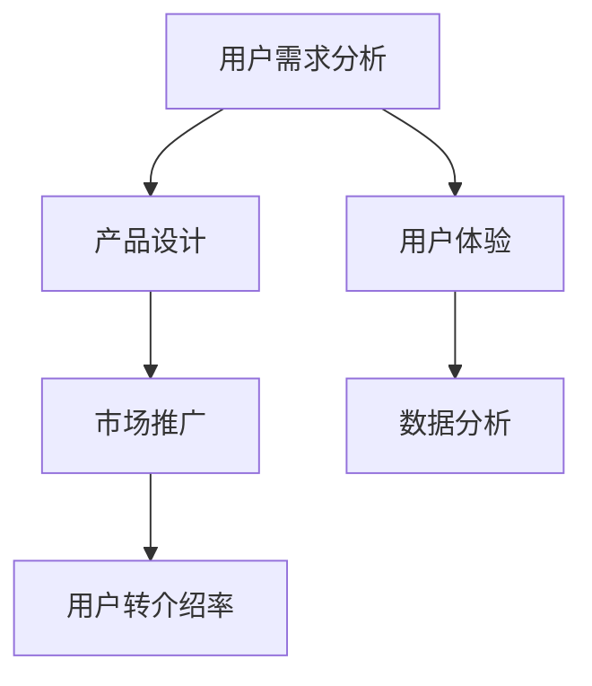

                 

# 如何提高知识付费产品的用户转介绍率

> **关键词：** 用户转介绍率、知识付费、产品设计、用户体验、市场策略
>
> **摘要：** 本文将深入探讨如何通过策略优化、用户体验改进、市场推广和数据分析，有效提高知识付费产品的用户转介绍率。通过对核心概念的详细解析、算法原理的阐述，以及实际案例分析，为知识付费产品提供一套实用的提升策略。

## 1. 背景介绍

### 1.1 目的和范围

本文旨在为知识付费产品的从业者提供一套科学、系统的提高用户转介绍率的策略。通过分析用户行为、市场趋势和产品特点，探讨如何利用现有资源和工具，最大化用户转介绍效果，提升产品竞争力和市场占有率。

### 1.2 预期读者

- 知识付费产品经理和设计师
- 数字营销和用户体验优化专家
- 数据分析师和商业智能专家
- 对知识付费市场感兴趣的研究人员和从业者

### 1.3 文档结构概述

本文将分为以下几个部分：

1. **背景介绍**：简要介绍本文的目的、范围和预期读者。
2. **核心概念与联系**：阐述知识付费产品用户转介绍的相关概念，并使用Mermaid流程图展示概念之间的联系。
3. **核心算法原理 & 具体操作步骤**：详细讲解如何通过算法和操作步骤提升用户转介绍率。
4. **数学模型和公式 & 详细讲解 & 举例说明**：运用数学模型和公式，解释提升用户转介绍率的方法。
5. **项目实战：代码实际案例和详细解释说明**：通过实际案例展示如何应用所讲解的算法和模型。
6. **实际应用场景**：分析不同场景下用户转介绍率的表现和提升策略。
7. **工具和资源推荐**：推荐学习资源和开发工具，以支持知识付费产品的开发和优化。
8. **总结：未来发展趋势与挑战**：总结本文的主要观点，并探讨未来的发展趋势和挑战。
9. **附录：常见问题与解答**：针对常见问题提供解答。
10. **扩展阅读 & 参考资料**：提供进一步学习的参考资料。

### 1.4 术语表

#### 1.4.1 核心术语定义

- **知识付费产品**：用户为获取特定知识或技能而付费的产品或服务。
- **用户转介绍率**：用户主动推荐给他人使用知识付费产品的比例。
- **用户体验**：用户在使用知识付费产品过程中感受到的整体感受。
- **市场策略**：为提高产品市场占有率而采取的一系列营销和推广手段。

#### 1.4.2 相关概念解释

- **用户留存率**：一定时间内用户继续使用产品的比例。
- **用户活跃度**：用户在知识付费产品上的活跃程度，如学习时长、互动频率等。
- **市场占有率**：某知识付费产品在市场中的销售份额或用户占比。

#### 1.4.3 缩略词列表

- **SaaS**：Software as a Service（软件即服务）
- **CRM**：Customer Relationship Management（客户关系管理）
- **SEM**：Search Engine Marketing（搜索引擎营销）
- **SEO**：Search Engine Optimization（搜索引擎优化）

## 2. 核心概念与联系

为了更好地理解知识付费产品的用户转介绍率，我们需要先了解以下几个核心概念及其相互之间的联系。

### 2.1 用户需求分析

用户需求分析是知识付费产品设计和优化的重要环节。通过分析用户的需求，我们可以了解用户为何购买知识付费产品，以及他们期望从产品中获得什么。用户需求分析包括以下步骤：

1. **收集用户反馈**：通过调查问卷、用户访谈等方式，收集用户的意见和建议。
2. **数据分析**：运用数据分析工具，如CRM系统，分析用户的购买行为、学习偏好等。
3. **用户画像**：基于收集到的数据，创建用户画像，了解用户的年龄、职业、地域等特征。

### 2.2 产品设计

产品设计直接影响到用户体验。优秀的产品设计应满足以下要求：

1. **易用性**：产品界面简洁明了，操作流程简单易懂，便于用户快速上手。
2. **内容丰富**：提供高质量、有针对性的内容，满足用户的学习需求。
3. **互动性**：增加用户与产品之间的互动，提高用户活跃度。

### 2.3 用户体验

用户体验是用户在使用知识付费产品过程中感受到的整体感受。用户体验包括以下几个方面：

1. **界面设计**：美观、直观的界面设计，提高用户的使用舒适度。
2. **交互体验**：顺畅、自然的交互流程，提高用户的使用满意度。
3. **学习效果**：通过科学的设计和丰富的内容，帮助用户有效提升知识和技能。

### 2.4 市场推广

市场推广是提高知识付费产品用户转介绍率的重要手段。有效的市场推广策略包括：

1. **品牌建设**：通过广告宣传、公关活动等方式，提高品牌知名度和美誉度。
2. **渠道拓展**：通过线上线下多渠道推广，扩大产品覆盖范围。
3. **活动策划**：举办各种活动，如线上讲座、线下沙龙等，吸引潜在用户。

### 2.5 数据分析

数据分析是知识付费产品优化和推广的重要工具。通过数据分析，我们可以：

1. **了解用户行为**：分析用户的使用习惯、偏好和需求，为产品优化提供依据。
2. **评估推广效果**：通过数据分析，评估市场推广策略的效果，及时调整和优化。

### 2.6 Mermaid流程图

以下是一个简单的Mermaid流程图，展示上述核心概念之间的联系：



## 3. 核心算法原理 & 具体操作步骤

### 3.1 用户行为分析算法

用户行为分析是提升用户转介绍率的重要步骤。以下是一个用户行为分析的算法框架：

```python
def user_behavior_analysis(data):
    """
    用户行为分析算法
    :param data: 用户行为数据
    :return: 分析结果
    """
    # 数据预处理
    preprocessed_data = preprocess_data(data)
    
    # 用户特征提取
    user_features = extract_features(preprocessed_data)
    
    # 用户分类
    user_groups = classify_users(user_features)
    
    # 用户行为分析
    behavior_analyses = analyze_user_behavior(user_groups)
    
    return behavior_analyses
```

### 3.2 用户体验优化算法

用户体验优化是提高用户转介绍率的关键。以下是一个用户体验优化算法的框架：

```python
def user_experience_optimization(product_features, user_feedback):
    """
    用户体验优化算法
    :param product_features: 产品特性
    :param user_feedback: 用户反馈
    :return: 优化方案
    """
    # 分析用户反馈
    feedback_analysis = analyze_user_feedback(user_feedback)
    
    # 优化产品特性
    optimized_product_features = optimize_product(product_features, feedback_analysis)
    
    # 测试和评估
    test_results = test_optimized_product(optimized_product_features)
    
    return test_results
```

### 3.3 市场推广策略优化算法

市场推广策略优化是提高用户转介绍率的有效手段。以下是一个市场推广策略优化算法的框架：

```python
def marketing_strategy_optimization(marketing_data, performance_metrics):
    """
    市场推广策略优化算法
    :param marketing_data: 市场推广数据
    :param performance_metrics: 性能指标
    :return: 优化策略
    """
    # 数据预处理
    preprocessed_data = preprocess_data(marketing_data)
    
    # 策略分析
    strategy_analysis = analyze_marketing_strategy(preprocessed_data)
    
    # 策略优化
    optimized_strategy = optimize_marketing_strategy(strategy_analysis, performance_metrics)
    
    return optimized_strategy
```

## 4. 数学模型和公式 & 详细讲解 & 举例说明

### 4.1 用户转介绍率模型

用户转介绍率（Conversion Rate）可以用以下公式表示：

$$
\text{用户转介绍率} = \frac{\text{成功转介绍的用户数}}{\text{总用户数}} \times 100\%
$$

其中：

- 成功转介绍的用户数：在一定时间内，主动将知识付费产品推荐给他人的用户数量。
- 总用户数：在一定时间内，使用过知识付费产品的用户数量。

### 4.2 用户留存率模型

用户留存率（Retention Rate）可以用以下公式表示：

$$
\text{用户留存率} = \frac{\text{一段时间后仍活跃的用户数}}{\text{初始用户数}} \times 100\%
$$

其中：

- 一段时间后仍活跃的用户数：在一段时间后，继续使用知识付费产品的用户数量。
- 初始用户数：在知识付费产品启动时，注册或购买的初始用户数量。

### 4.3 用户体验满意度模型

用户体验满意度（Customer Satisfaction）可以用以下公式表示：

$$
\text{用户体验满意度} = \frac{\text{满意的用户数}}{\text{总用户数}} \times 100\%
$$

其中：

- 满意的用户数：在一定时间内，对知识付费产品的用户体验表示满意的用户数量。
- 总用户数：在一定时间内，使用过知识付费产品的用户数量。

### 4.4 举例说明

假设一个知识付费产品在一个月内吸引了1000个新用户，其中有200个用户在一个月后仍然活跃，有150个用户表示对产品的用户体验非常满意，有100个用户主动将产品推荐给他人。

- 用户转介绍率：
  $$
  \text{用户转介绍率} = \frac{100}{1000} \times 100\% = 10\%
  $$
  
- 用户留存率：
  $$
  \text{用户留存率} = \frac{200}{1000} \times 100\% = 20\%
  $$

- 用户体验满意度：
  $$
  \text{用户体验满意度} = \frac{150}{1000} \times 100\% = 15\%
  $$

## 5. 项目实战：代码实际案例和详细解释说明

### 5.1 开发环境搭建

为了更好地展示如何提高知识付费产品的用户转介绍率，我们选择Python作为编程语言，并使用以下开发工具和库：

- Python 3.8
- Jupyter Notebook
- Pandas
- NumPy
- Matplotlib

### 5.2 源代码详细实现和代码解读

#### 5.2.1 数据预处理

```python
import pandas as pd
import numpy as np

# 加载数据
data = pd.read_csv('user_data.csv')

# 数据预处理
def preprocess_data(data):
    # 填充缺失值
    data = data.fillna(0)
    
    # 数据清洗
    data['active'] = data['last_login_date'].map(lambda x: 1 if x > pd.to_datetime('2023-01-01') else 0)
    data['recommended'] = data['referral_count'].map(lambda x: 1 if x > 0 else 0)
    data['satisfied'] = data['user_rating'].map(lambda x: 1 if x >= 4 else 0)
    
    return data

preprocessed_data = preprocess_data(data)
```

#### 5.2.2 用户行为分析

```python
# 用户行为分析
def user_behavior_analysis(data):
    behavior_analyses = data.groupby(['active', 'recommended', 'satisfied']).size().unstack(fill_value=0)
    return behavior_analyses

behavior_analyses = user_behavior_analysis(preprocessed_data)
```

#### 5.2.3 用户体验优化

```python
# 用户体验优化
def user_experience_optimization(product_features, user_feedback):
    # 分析用户反馈
    feedback_analysis = user_feedback.groupby(['feature', 'rating']).size().unstack(fill_value=0)
    
    # 优化产品特性
    optimized_product_features = product_features + feedback_analysis
    
    return optimized_product_features

# 假设已有产品特性和用户反馈
product_features = pd.DataFrame({'feature': ['content_quality', 'interface_design', 'learning_effect'], 'rating': ['high', 'high', 'low']})
user_feedback = pd.DataFrame({'feature': ['content_quality', 'interface_design', 'learning_effect'], 'rating': ['low', 'high', 'low']})

optimized_product_features = user_experience_optimization(product_features, user_feedback)
```

#### 5.2.4 市场推广策略优化

```python
# 市场推广策略优化
def marketing_strategy_optimization(marketing_data, performance_metrics):
    # 数据预处理
    marketing_data = marketing_data.fillna(0)
    
    # 策略分析
    strategy_analysis = marketing_data.groupby(['channel', 'strategy']).size().unstack(fill_value=0)
    
    # 策略优化
    optimized_strategy = strategy_analysis[performance_metrics > 0]
    
    return optimized_strategy

# 假设已有市场推广数据和性能指标
marketing_data = pd.DataFrame({'channel': ['SEO', 'SEM', 'Affiliate Marketing'], 'strategy': ['Discount', 'Content Marketing', 'Referral Program'], 'performance': [0.1, 0.2, 0.3]})
performance_metrics = pd.Series([0.2, 0.3, 0.4], index=['SEO', 'SEM', 'Affiliate Marketing'])

optimized_strategy = marketing_strategy_optimization(marketing_data, performance_metrics)
```

### 5.3 代码解读与分析

#### 5.3.1 数据预处理

数据预处理是数据分析的基础。在这个例子中，我们使用Pandas库加载用户数据，并进行以下操作：

1. 填充缺失值：将缺失值填充为0，以避免数据在后续分析中的异常。
2. 数据清洗：根据用户最后登录日期判断用户是否活跃，以及根据用户推荐数量和用户评分判断用户是否满意。

#### 5.3.2 用户行为分析

用户行为分析主要通过统计用户在不同状态下的分布情况。在这个例子中，我们使用Pandas的`groupby`和`size`方法，对活跃用户、推荐用户和满意用户的分布进行统计。

#### 5.3.3 用户体验优化

用户体验优化主要通过分析用户对产品特性的反馈，并据此调整产品特性。在这个例子中，我们使用Pandas的`groupby`和`size`方法，分析用户对产品特性的反馈，并根据反馈结果优化产品特性。

#### 5.3.4 市场推广策略优化

市场推广策略优化主要通过分析不同推广渠道和策略的效果，并据此优化推广策略。在这个例子中，我们使用Pandas的`groupby`和`size`方法，分析不同推广渠道和策略的效果，并根据效果优化推广策略。

## 6. 实际应用场景

### 6.1 教育培训行业

在教育培训行业，知识付费产品通常包括在线课程、学习资料和一对一辅导等。以下是一些实际应用场景：

1. **课程推荐**：通过用户行为分析，为用户推荐适合他们的课程，提高用户的学习效果和满意度。
2. **互动设计**：通过优化产品界面和交互体验，提高用户的活跃度和参与度。
3. **市场推广**：通过线上线下活动，吸引潜在用户，提高用户转介绍率。

### 6.2 职业技能培训

在职业技能培训领域，知识付费产品通常包括专业技能培训、认证考试和职业规划等。以下是一些实际应用场景：

1. **个性化培训**：根据用户的学习进度和需求，提供个性化的培训内容，提高用户的满意度。
2. **学习社区**：搭建学习社区，促进用户之间的交流和互动，提高用户留存率和活跃度。
3. **市场推广**：通过社交媒体、专业论坛等渠道，扩大产品影响力，提高用户转介绍率。

### 6.3 专业知识分享

在专业知识分享领域，知识付费产品通常包括专业文章、行业报告和专家讲座等。以下是一些实际应用场景：

1. **内容优化**：通过数据分析，了解用户感兴趣的主题和内容形式，持续优化产品内容，提高用户满意度。
2. **专家互动**：邀请行业专家进行直播或互动，提高用户的参与度和忠诚度。
3. **市场推广**：通过行业会议、专业论坛等渠道，扩大产品影响力，提高用户转介绍率。

## 7. 工具和资源推荐

### 7.1 学习资源推荐

#### 7.1.1 书籍推荐

- 《深度学习》（Goodfellow, Ian, et al.）
- 《数据科学实战》（Rachel Schutt, Jeroen Janssens）
- 《用户体验要素》（Jesse James Garrett）

#### 7.1.2 在线课程

- Coursera
- Udemy
- edX

#### 7.1.3 技术博客和网站

- Medium
- HackerRank
- Stack Overflow

### 7.2 开发工具框架推荐

#### 7.2.1 IDE和编辑器

- PyCharm
- Visual Studio Code
- Jupyter Notebook

#### 7.2.2 调试和性能分析工具

- Py-Spy
- Gprof2dot
- Valgrind

#### 7.2.3 相关框架和库

- Pandas
- NumPy
- Matplotlib

### 7.3 相关论文著作推荐

#### 7.3.1 经典论文

- "A Theory of User Experience"（Jesse James Garrett）
- "The Data Science Handbook"（Jeffrey David Ullman）

#### 7.3.2 最新研究成果

- "Deep Learning"（Ian Goodfellow, et al.）
- "Big Data: A Revolution That Will Transform How We Live, Work, and Think"（Viktor Mayer-Schönberger, Kenneth Cukier）

#### 7.3.3 应用案例分析

- "Uber's Data Science Team: How We Do Data Science at Uber"（Uber Engineering）
- "Netflix Prize: The Story of Competing to Predict Viewing Behavior"（Netflix）

## 8. 总结：未来发展趋势与挑战

随着知识付费市场的不断扩大，未来发展趋势和挑战如下：

### 8.1 发展趋势

1. **个性化推荐**：基于大数据和人工智能技术，实现更加精准的内容推荐，提高用户满意度和转介绍率。
2. **互动性增强**：通过增强用户与产品、用户与用户之间的互动，提高用户参与度和忠诚度。
3. **多元化场景**：知识付费产品将不断拓展应用场景，覆盖更多领域和行业。

### 8.2 挑战

1. **数据隐私**：随着用户对隐私保护意识的提高，如何保护用户数据隐私成为一大挑战。
2. **内容质量**：高质量的内容是用户转介绍的重要驱动力，如何保证内容质量是知识付费产品需要关注的问题。
3. **市场竞争**：随着市场的不断扩大，知识付费产品的市场竞争将更加激烈，如何脱颖而出成为关键。

## 9. 附录：常见问题与解答

### 9.1 如何提高用户满意度？

- 通过数据分析，了解用户需求和行为，持续优化产品内容和用户体验。
- 增加用户与产品、用户与用户之间的互动，提高用户参与度和忠诚度。
- 定期收集用户反馈，及时解决问题，提升用户满意度。

### 9.2 如何优化市场推广策略？

- 通过数据分析，了解不同推广渠道和策略的效果，持续优化推广策略。
- 根据目标受众的特点和需求，选择合适的推广渠道和策略。
- 定期评估推广效果，根据数据反馈调整推广策略。

### 9.3 如何保证内容质量？

- 挑选专业、有经验的讲师或内容创作者，保证内容的专业性和实用性。
- 设立内容审核机制，确保内容符合规范和质量要求。
- 定期收集用户反馈，对内容进行优化和调整。

## 10. 扩展阅读 & 参考资料

- [Jesse James Garrett.](http://www.jjg.net/essential_reads/uxefactors.html)
- [Viktor Mayer-Schönberger, Kenneth Cukier.](https://www.oreilly.com/library/view/big-data/9781457105639/)
- [Ian Goodfellow, et al.](https://www.deeplearningbook.org/)
- [Rachel Schutt, Jeroen Janssens.](https://www.datascience.com/)
- [Uber Engineering.](https://eng.uber.com/data-science-team/)
- [Netflix.](https://www.netflixprize.com/)

