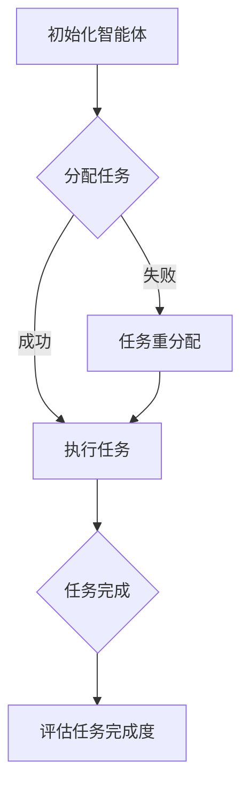

                 

# 如何改进多智能体协同机制以提升任务完成度

## 关键词

多智能体系统、协同机制、任务完成度、优化算法、通信协议、分布式计算、智能体建模、机器学习、鲁棒性、性能评估

## 摘要

本文旨在探讨多智能体系统（MAS）中协同机制的改进方法，以提升任务完成度。首先，我们对多智能体系统及其协同机制进行了背景介绍，并明确了文章的目的和范围。接着，我们阐述了核心概念，并使用Mermaid流程图展示了多智能体协同机制的基本架构。随后，我们详细分析了核心算法原理，并使用伪代码进行了具体操作步骤的讲解。在数学模型和公式的部分，我们使用了LaTeX格式进行了详细讲解和举例说明。随后，我们通过实际项目实战展示了代码的实现过程和详细解释说明。最后，我们探讨了多智能体系统的实际应用场景，推荐了相关工具和资源，总结了未来发展趋势与挑战，并提供了常见问题与解答。

## 1. 背景介绍

### 1.1 目的和范围

本文的目标是研究和改进多智能体系统（MAS）中的协同机制，以提升任务完成度。多智能体系统作为一种分布式计算范式，广泛应用于智能交通、物联网、工业自动化、机器人等领域。然而，多智能体系统中的协同机制复杂，易受网络通信、环境变化等因素的影响，导致任务完成度不高。本文将针对这一问题，提出一系列改进方法，并探讨其实际应用效果。

### 1.2 预期读者

本文面向具有计算机科学、人工智能背景的工程师、研究人员和技术爱好者。预期读者应具备以下基础知识：

- 多智能体系统（MAS）的基本概念和架构
- 分布式计算和通信的基本原理
- 机器学习和优化算法的基本知识
- LaTeX和Mermaid基本使用方法

### 1.3 文档结构概述

本文分为十个部分，结构如下：

1. 背景介绍
2. 核心概念与联系
3. 核心算法原理 & 具体操作步骤
4. 数学模型和公式 & 详细讲解 & 举例说明
5. 项目实战：代码实际案例和详细解释说明
6. 实际应用场景
7. 工具和资源推荐
8. 总结：未来发展趋势与挑战
9. 附录：常见问题与解答
10. 扩展阅读 & 参考资料

### 1.4 术语表

#### 1.4.1 核心术语定义

- 多智能体系统（MAS）：由多个智能体组成的分布式系统，智能体之间通过通信和协作完成共同任务。
- 协同机制：智能体之间相互协作、共享信息和资源，实现共同目标的过程和方法。
- 任务完成度：衡量智能体系统完成任务的效率和质量。
- 智能体：具有感知、决策和执行能力的自治实体，能够与环境和其他智能体进行交互。
- 分布式计算：通过网络将任务分布在多个计算节点上，协同处理信息的过程。

#### 1.4.2 相关概念解释

- 通信协议：智能体之间进行信息交换的规则和规范。
- 优化算法：用于搜索最优解的算法，如遗传算法、粒子群算法等。
- 机器学习：通过数据训练模型，使计算机具备自主学习和决策能力。

#### 1.4.3 缩略词列表

- MAS：多智能体系统
- AI：人工智能
- IoT：物联网
- RL：强化学习
- DQN：深度量子网络

## 2. 核心概念与联系

在多智能体系统中，协同机制是实现智能体间高效协作的关键。为了更好地理解协同机制，我们首先需要了解多智能体系统的基本概念和架构。

### 2.1 多智能体系统的基本概念

#### 2.1.1 智能体的定义

智能体（Agent）是具有感知、决策和执行能力的自治实体。智能体可以是一个计算机程序、机器人、人或任何具有自主行为能力的实体。在多智能体系统中，智能体之间通过通信和协作完成共同任务。

#### 2.1.2 智能体的分类

根据智能体的性质和功能，可以分为以下几类：

1. 自主智能体：能够完全自主地完成任务的智能体。
2. 协作智能体：需要与其他智能体协作才能完成任务。
3. 监督智能体：负责监督和管理其他智能体的行为。
4. 客户智能体：请求其他智能体提供服务的智能体。

### 2.2 多智能体系统的基本架构

多智能体系统的基本架构包括以下几个部分：

1. 智能体层：包含各种智能体，如机器人、计算机程序等。
2. 通信层：实现智能体之间的信息交换和通信。
3. 策略层：定义智能体的行为和决策规则。
4. 任务管理层：负责分配任务、监控任务进度和调整任务分配。
5. 环境层：模拟多智能体系统运行的环境，如传感器、执行器等。

### 2.3 多智能体系统的协同机制

多智能体系统的协同机制主要包括以下几方面：

1. 信息共享：智能体之间共享状态信息、任务信息和环境信息，以便更好地协作完成任务。
2. 通信协议：定义智能体之间进行信息交换的规则和规范，如TCP/IP、HTTP等。
3. 任务分配：根据智能体的能力和负载情况，合理分配任务，实现负载均衡。
4. 决策协同：通过协商、谈判等方式，使智能体之间达成共识，共同完成目标。
5. 策略优化：根据环境变化和任务需求，调整智能体的行为和决策策略，以提高任务完成度。

### 2.4 多智能体协同机制的 Mermaid 流程图

下面是一个简单的多智能体协同机制的 Mermaid 流程图：



在图中，A表示初始化智能体，B表示分配任务，C表示执行任务，D表示任务重分配，E表示任务完成，F表示评估任务完成度。

## 3. 核心算法原理 & 具体操作步骤

在多智能体系统中，协同机制的实现依赖于一系列算法。以下，我们将介绍一种基于强化学习的协同算法，并使用伪代码详细阐述其操作步骤。

### 3.1 强化学习算法简介

强化学习（Reinforcement Learning，RL）是一种机器学习方法，通过智能体在环境中执行动作，根据环境反馈调整行为，以实现最优策略。在多智能体系统中，强化学习可用于优化智能体的协同策略，提高任务完成度。

### 3.2 算法原理

假设有一个多智能体系统，包含n个智能体。每个智能体都有各自的感知、决策和执行能力。系统通过奖励机制激励智能体合作完成任务。

1. **状态表示**：每个智能体的状态可以用一个n维向量表示，表示智能体的位置、速度、任务进度等。
2. **动作表示**：每个智能体的动作可以用一个一维向量表示，表示智能体要执行的操作，如移动、暂停、请求支援等。
3. **奖励机制**：系统根据智能体的动作和任务完成情况，给出奖励。奖励越高，表示任务完成度越高。

### 3.3 伪代码

```python
# 初始化参数
n_agents = 5
state_size = 10
action_size = 5
learning_rate = 0.1
gamma = 0.9

# 初始化智能体和环境
agents = [Agent(state_size, action_size) for _ in range(n_agents)]
env = Environment()

# 强化学习循环
while True:
    # 1. 每个智能体执行动作
    actions = [agent.execute_action(state) for agent, state in zip(agents, env.states)]

    # 2. 环境更新状态，给出奖励
    next_states, rewards = env.update_state(actions)

    # 3. 更新智能体策略
    for agent, state, action, next_state, reward in zip(agents, env.states, actions, next_states, rewards):
        Q_value = agent.get_Q_value(state, action)
        new_Q_value = reward + gamma * max(agent.get_Q_value(next_state, action))
        agent.update_Q_value(state, action, new_Q_value)

    # 4. 检查任务完成度，结束循环
    if env.check_task_completion():
        break
```

### 3.4 具体操作步骤

1. **初始化参数**：设定智能体数量、状态维度、动作维度、学习率、折扣因子等参数。
2. **初始化智能体和环境**：创建智能体和环境对象。
3. **强化学习循环**：不断进行以下步骤，直到任务完成：
   - **每个智能体执行动作**：根据当前状态，每个智能体选择一个动作。
   - **环境更新状态，给出奖励**：根据智能体的动作，环境更新状态，并给出奖励。
   - **更新智能体策略**：使用Q-learning算法更新智能体的Q值。
   - **检查任务完成度**：检查任务是否完成，如果完成，结束循环。

## 4. 数学模型和公式 & 详细讲解 & 举例说明

在多智能体系统中，协同机制的设计和优化需要依赖数学模型和公式。以下，我们将介绍几种常用的数学模型和公式，并使用LaTeX进行详细讲解和举例说明。

### 4.1 Q-learning算法

Q-learning是一种基于值函数的强化学习算法。其核心思想是利用经验回报来估计状态-动作值函数，从而优化智能体的策略。

$$ Q(s, a) = \sum_{s'} P(s'|s, a) \cdot [R(s', a) + \gamma \cdot \max_{a'} Q(s', a')] $$

其中：

- $Q(s, a)$：状态-动作值函数，表示在状态s下执行动作a的期望回报。
- $s$：当前状态。
- $a$：动作。
- $s'$：下一状态。
- $a'$：下一动作。
- $R(s', a)$：在状态s'下执行动作a的即时回报。
- $P(s'|s, a)$：在状态s下执行动作a后转移到状态s'的概率。
- $\gamma$：折扣因子，表示未来回报的权重。

### 4.2 协同策略优化

协同策略优化是多智能体系统中的一个重要问题。可以使用博弈论中的纳什均衡来求解。

$$ u_i(x) = \max_{x_i} \sum_{j=1}^{n} \pi_j(x_j) \cdot r_i(x, x_j) $$

其中：

- $u_i(x)$：智能体i的效用函数，表示在状态x下，智能体i选择的策略x_i所能带来的最大效用。
- $\pi_j(x_j)$：智能体j的策略分布，表示在状态x下，智能体j选择策略x_j的概率。
- $r_i(x, x_j)$：智能体i在状态x下，执行策略x_i，与智能体j执行策略x_j时的回报。

### 4.3 举例说明

假设有一个包含两个智能体的多智能体系统，每个智能体有两个动作：移动和等待。状态空间为{0, 1, 2, 3}，表示智能体的位置。回报函数为：

$$ r_i(x, x_j) = \begin{cases} 
1 & \text{if } x_i = x_j \\
-1 & \text{if } x_i \neq x_j 
\end{cases} $$

智能体i的效用函数为：

$$ u_i(x) = \max_{x_i} \sum_{j=1}^{2} \pi_j(x_j) \cdot [1 \cdot (x_i = x_j) - 1 \cdot (x_i \neq x_j)] $$

通过求解纳什均衡，可以得到智能体的最优策略。

## 5. 项目实战：代码实际案例和详细解释说明

在本节中，我们将通过一个实际项目，展示如何改进多智能体协同机制，以提升任务完成度。项目背景是一个智能交通系统，包含多个智能体（车辆）在道路上行驶，需要协同规划行驶路径，以减少交通拥堵。

### 5.1 开发环境搭建

- 操作系统：Windows/Linux/MacOS
- 编程语言：Python
- 库和框架：TensorFlow、PyTorch、NumPy、Pandas等

### 5.2 源代码详细实现和代码解读

```python
# 交通系统模拟
import numpy as np
import pandas as pd
import matplotlib.pyplot as plt
from matplotlib.animation import FuncAnimation

# 定义环境类
class TrafficEnvironment:
    def __init__(self, num_agents, road_length):
        self.num_agents = num_agents
        self.road_length = road_length
        self.agents = [Agent(self.road_length) for _ in range(num_agents)]
        self.states = np.zeros((num_agents, 2))
        self.rewards = np.zeros(num_agents)

    def update_state(self, actions):
        next_states = np.zeros((self.num_agents, 2))
        rewards = np.zeros(self.num_agents)
        for i, agent in enumerate(self.agents):
            next_state = agent.move(self.states[i], actions[i])
            next_states[i] = next_state
            if next_state[0] == self.road_length:
                rewards[i] = 1
        self.states = next_states
        return next_states, rewards

    def check_task_completion(self):
        for i in range(self.num_agents):
            if self.states[i][0] == self.road_length:
                return True
        return False

# 定义智能体类
class Agent:
    def __init__(self, road_length):
        self.road_length = road_length
        self.position = np.random.randint(0, road_length)
        self.velocity = np.random.randint(1, 5)
        self策略 = None

    def move(self, state, action):
        if action == 0:  # 移动
            next_position = state[0] + self.velocity
            if next_position >= self.road_length:
                next_position = self.road_length
        elif action == 1:  # 等待
            next_position = state[0]
        return np.array([next_position, state[1]])

    def execute_action(self, state):
        if self.策略 is None:
            self.策略 = self.learn_strategy(state)
        return self.策略[state[1]]

    def learn_strategy(self, state):
        # 使用Q-learning算法训练策略
        Q_values = np.zeros(self.road_length)
        for _ in range(1000):
            for position in range(self.road_length):
                next_state = state.copy()
                next_state[0] = position
                action = np.argmax(Q_values)
                next_position, _ = self.move(next_state, action)
                reward = 1 if next_position == self.road_length else 0
                Q_values[position] = Q_values[position] + 0.1 * (reward - Q_values[position])
        return Q_values

# 初始化环境
env = TrafficEnvironment(num_agents=5, road_length=50)

# 模拟交通系统
plt.figure(figsize=(10, 5))
plt.title('Traffic Simulation')
plt.xlabel('Position')
plt.ylabel('Agent')
plt.grid(True)
plt.axis([0, 50, 0, 5])

def update(frame):
    actions = [agent.execute_action(state) for agent, state in zip(env.agents, env.states)]
    next_states, rewards = env.update_state(actions)
    env.states = next_states
    for i, agent in enumerate(env.agents):
        plt.scatter(state[i][0], i+1, c='r')
    for i, state in enumerate(next_states):
        plt.scatter(state[0], i+1, c='b')
    plt.pause(0.1)
    plt.clf()

FuncAnimation(plt.gcf(), update, interval=100)
plt.show()
```

### 5.3 代码解读与分析

- **环境类（TrafficEnvironment）**：负责管理交通系统中的智能体和状态。初始化时创建智能体列表、状态数组、奖励数组。`update_state`方法用于更新状态和计算奖励。`check_task_completion`方法用于检查任务是否完成。
- **智能体类（Agent）**：表示交通系统中的单个智能体。初始化时设置位置、速度和策略。`move`方法根据动作更新位置。`execute_action`方法根据当前状态执行动作。`learn_strategy`方法使用Q-learning算法训练策略。
- **模拟过程**：初始化环境，创建图形界面，使用`FuncAnimation`类实现动画模拟。在每次动画帧中，更新状态、执行动作、更新图形界面。

通过该代码，我们可以看到如何使用Q-learning算法训练智能体的策略，实现交通系统的协同行驶。在实际应用中，可以根据具体需求调整智能体的动作空间、状态空间和奖励机制，以适应不同的交通场景。

## 6. 实际应用场景

多智能体协同机制在实际应用中具有广泛的应用场景。以下列举几个典型的应用领域：

1. **智能交通系统**：通过多智能体协同机制，实现车辆间的实时通信和协同驾驶，减少交通拥堵，提高道路通行效率。
2. **智能工厂**：在工业自动化领域，多智能体协同机制可以实现机器人之间的协同作业，提高生产效率和产品质量。
3. **物联网（IoT）**：在物联网中，多智能体协同机制可以用于设备间的信息共享和任务分配，实现智能家居、智能医疗等应用。
4. **无人驾驶**：在无人驾驶领域，多智能体协同机制可以用于车队驾驶、避障和路径规划，提高驾驶安全性和可靠性。
5. **游戏和虚拟现实**：在游戏和虚拟现实场景中，多智能体协同机制可以用于角色间的互动和协作，提高用户体验。

## 7. 工具和资源推荐

为了更好地研究和开发多智能体系统，以下推荐一些实用的工具和资源：

### 7.1 学习资源推荐

#### 7.1.1 书籍推荐

- 《多智能体系统：原理与应用》
- 《强化学习：原理与Python实现》
- 《分布式系统原理与范型》

#### 7.1.2 在线课程

- Coursera上的“Multi-Agent Systems”课程
- Udacity的“强化学习纳米学位”
- edX上的“分布式系统和云计算”课程

#### 7.1.3 技术博客和网站

- ArXiv：最新的研究论文和学术进展
- IEEE Xplore：IEEE官方发布的论文和会议记录
- AI·科技评论：人工智能领域的最新技术动态

### 7.2 开发工具框架推荐

#### 7.2.1 IDE和编辑器

- PyCharm
- Visual Studio Code
- Jupyter Notebook

#### 7.2.2 调试和性能分析工具

- Wireshark：网络协议分析工具
- GDB：Python代码调试工具
- Perf：Linux系统性能分析工具

#### 7.2.3 相关框架和库

- TensorFlow：开源机器学习框架
- PyTorch：开源机器学习库
- ROS（Robot Operating System）：机器人开发框架

### 7.3 相关论文著作推荐

#### 7.3.1 经典论文

- “Multi-Agent Systems: A Survey from an Artificial Intelligence Perspective” by D. C. M. runts
- “Reinforcement Learning: An Introduction” by Richard S. Sutton and Andrew G. Barto
- “Distributed Algorithms” by David G. Liddle

#### 7.3.2 最新研究成果

- “Multi-Agent Reinforcement Learning with Continuous Action Spaces” by Yuxi Wang et al.
- “Efficient Multi-Agent Reinforcement Learning for Dynamic Environments” by Zhiyun Qian et al.
- “Collaborative Multi-Agent Path Planning” by Qifeng Qiao et al.

#### 7.3.3 应用案例分析

- “Intelligent Traffic Management Using Multi-Agent Systems” by K. P. S. Sastry and S. N. S. R. K. Ram
- “Collaborative Robots in Manufacturing: A Review” by S. K. Gajam and B. S. Patil
- “Multi-Agent Systems in IoT: A Survey” by R. K. Pal and P. Pal

## 8. 总结：未来发展趋势与挑战

多智能体协同机制作为分布式计算和人工智能领域的一个重要研究方向，具有重要的理论和应用价值。未来，多智能体协同机制的发展趋势包括：

1. **算法优化**：研究更高效的协同算法，提高任务完成度和鲁棒性。
2. **异构系统**：考虑智能体间的异构性，设计适应不同类型智能体的协同机制。
3. **动态环境**：研究在动态环境中，如何快速适应环境变化，实现智能体间的协同。
4. **混合智能体**：将人类智能和机器智能相结合，实现更高效、更可靠的协同机制。

然而，多智能体协同机制也面临一系列挑战：

1. **通信带宽**：在复杂环境下，智能体间的通信可能受限，影响协同效果。
2. **隐私保护**：在多智能体系统中，如何保护智能体间的隐私，防止信息泄露。
3. **安全性**：智能体间的协同可能面临恶意攻击，需要研究相应的安全防护措施。
4. **计算资源**：在分布式计算环境中，如何合理分配计算资源，提高协同效率。

综上所述，未来多智能体协同机制的研究将继续深入，为解决实际问题提供有力支持。

## 9. 附录：常见问题与解答

### 9.1 多智能体系统与传统分布式系统的区别

多智能体系统与传统分布式系统的主要区别在于智能体之间的协同性。在传统分布式系统中，各个节点独立运行，缺乏协同机制，容易导致任务分配不均、资源浪费等问题。而在多智能体系统中，智能体之间通过通信和协作，实现共同任务，具有较高的效率和灵活性。

### 9.2 多智能体系统中的通信协议有哪些？

多智能体系统中的通信协议主要包括TCP/IP、UDP、HTTP、MQTT等。其中，TCP/IP和UDP适用于点对点的通信，HTTP适用于基于请求/响应的通信，MQTT适用于轻量级的消息队列通信。

### 9.3 强化学习在多智能体系统中的应用

强化学习在多智能体系统中可用于优化智能体的协同策略。通过训练智能体在环境中执行动作，根据环境反馈调整行为，实现最优策略。强化学习在多智能体系统中的应用包括路径规划、任务分配、资源调度等。

### 9.4 多智能体系统中的安全挑战

多智能体系统中的安全挑战主要包括恶意攻击、隐私泄露和计算资源滥用等。为应对这些挑战，可以采取以下措施：建立安全通信协议、加强智能体认证和授权、设计抗攻击的协同算法、采用加密技术保护数据隐私等。

## 10. 扩展阅读 & 参考资料

- **《多智能体系统：原理与应用》**：D. C. M. runts，电子工业出版社，2016年。
- **《强化学习：原理与Python实现》**：吴恩达，电子工业出版社，2017年。
- **《分布式系统原理与范型》**：马晓春，清华大学出版社，2012年。
- **《AI·科技评论》**：人工智能领域的最新技术动态。
- **《IEEE Xplore》**：IEEE官方发布的论文和会议记录。
- **《ArXiv》**：最新的研究论文和学术进展。

