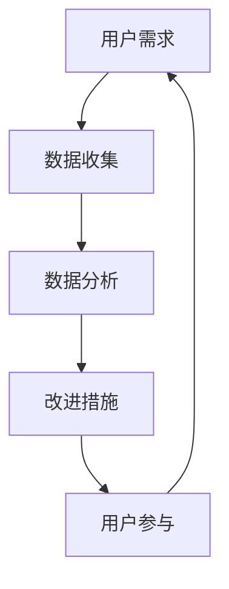

                 

# 如何构建有效的产品反馈闭环

> **关键词：** 产品反馈、用户体验、闭环、数据收集、用户参与、分析工具、改进措施
> 
> **摘要：** 本文章将探讨如何构建有效的产品反馈闭环。我们将从背景介绍开始，逐步分析核心概念，讲解具体操作步骤，举例说明数学模型，分享实际应用场景，推荐相关工具和资源，最后总结未来发展趋势与挑战。

## 1. 背景介绍

### 1.1 目的和范围

本文旨在为产品经理、工程师、用户体验设计师以及其他相关从业人员提供一个关于构建有效产品反馈闭环的全面指南。我们将深入探讨如何收集、分析并利用用户反馈来优化产品，从而提高用户体验和业务绩效。

### 1.2 预期读者

- 产品经理
- 用户界面/用户体验设计师
- 软件工程师
- 数据分析师
- 企业管理者

### 1.3 文档结构概述

本文将按照以下结构进行：

1. 背景介绍
2. 核心概念与联系
3. 核心算法原理 & 具体操作步骤
4. 数学模型和公式 & 详细讲解 & 举例说明
5. 项目实战：代码实际案例和详细解释说明
6. 实际应用场景
7. 工具和资源推荐
8. 总结：未来发展趋势与挑战
9. 附录：常见问题与解答
10. 扩展阅读 & 参考资料

### 1.4 术语表

#### 1.4.1 核心术语定义

- **产品反馈闭环**：一个持续的过程，包括收集用户反馈、分析数据、制定改进措施，并再次将改进措施反馈给用户。
- **用户参与**：用户在产品开发过程中提供反馈、建议和参与设计的能力。
- **数据收集**：从用户行为、调查问卷、访谈等多种途径获取用户反馈的过程。

#### 1.4.2 相关概念解释

- **用户体验（UX）**：用户在使用产品过程中的整体感受和体验。
- **用户界面（UI）**：产品的视觉和交互设计，直接影响用户体验。

#### 1.4.3 缩略词列表

- **UX**：用户体验（User Experience）
- **UI**：用户界面（User Interface）
- **A/B测试**：一种实验方法，用于比较两个或多个版本的用户行为和效果。
- **NPS**：净推荐值（Net Promoter Score）

## 2. 核心概念与联系

构建有效的产品反馈闭环需要理解以下核心概念：

1. **用户需求**：用户对产品的期望和需求。
2. **数据收集**：通过各种方式获取用户反馈。
3. **数据分析**：对收集到的数据进行处理和分析，以识别问题和机会。
4. **改进措施**：基于分析结果制定并实施改进措施。
5. **用户参与**：鼓励用户参与产品改进过程。

以下是一个简单的 Mermaid 流程图，展示了这些概念之间的联系：



这个闭环是一个持续的过程，用户需求驱动数据收集，数据分析引导改进措施，改进措施促进用户参与，再次激发新的用户需求，形成良性循环。

## 3. 核心算法原理 & 具体操作步骤

构建有效的产品反馈闭环涉及以下步骤：

### 3.1 数据收集

**算法原理**：

数据收集是闭环的第一步，核心在于获取真实、全面的用户反馈。

**具体操作步骤**：

1. **定义目标**：确定需要收集的数据类型和范围，如用户行为数据、调查问卷结果等。
2. **选择工具**：根据目标选择合适的工具，如分析工具、问卷平台等。
3. **实施收集**：通过在线调查、用户访谈、A/B测试等方式收集数据。

### 3.2 数据分析

**算法原理**：

数据分析是将收集到的数据转化为有价值信息的关键步骤。

**具体操作步骤**：

1. **预处理数据**：清洗、整理和归一化数据，确保数据质量。
2. **选择分析工具**：根据数据类型和分析需求选择合适的工具，如Excel、Python等。
3. **分析数据**：使用统计方法、机器学习算法等分析数据，提取有用信息。
4. **生成报告**：将分析结果转化为易于理解的报告，为改进措施提供依据。

### 3.3 改进措施

**算法原理**：

基于分析结果制定改进措施，以优化用户体验。

**具体操作步骤**：

1. **制定计划**：根据分析结果和业务目标，制定具体的改进计划。
2. **实施改进**：按照计划实施改进措施，如修改UI设计、优化功能等。
3. **测试验证**：通过A/B测试等方法验证改进措施的有效性。

### 3.4 用户参与

**算法原理**：

用户参与是闭环的重要组成部分，有助于提高用户的满意度和忠诚度。

**具体操作步骤**：

1. **收集反馈**：鼓励用户提供反馈，如通过问卷调查、用户访谈等方式。
2. **响应反馈**：及时响应用户的反馈，解决问题或提供改进方案。
3. **沟通互动**：与用户保持沟通，了解他们的需求和期望。

## 4. 数学模型和公式 & 详细讲解 & 举例说明

构建产品反馈闭环的过程中，数学模型和公式有助于分析和优化数据。

### 4.1 统计模型

**例子：回归分析**

$$
y = \beta_0 + \beta_1x_1 + \beta_2x_2 + ... + \beta_nx_n + \epsilon
$$

- **$y$**：因变量，表示用户体验评分。
- **$x_1, x_2, ..., x_n$**：自变量，表示不同的用户行为特征。
- **$\beta_0, \beta_1, ..., \beta_n$**：回归系数，表示不同特征对用户体验评分的影响程度。
- **$\epsilon$**：误差项，表示随机误差。

通过回归分析，可以确定哪些特征对用户体验有显著影响，从而为改进措施提供依据。

### 4.2 机器学习模型

**例子：决策树**

```
if x1 > 0.5:
    if x2 > 0.5:
        return high
    else:
        return low
else:
    if x3 > 0.5:
        return high
    else:
        return low
```

- **$x_1, x_2, x_3$**：特征值。
- **high, low**：分类结果。

决策树模型可以用于分类用户行为，从而识别潜在的改进机会。

### 4.3 优化模型

**例子：线性规划**

$$
\min z = c_1x_1 + c_2x_2 + ... + c_nx_n
$$

$$
s.t. \quad a_{11}x_1 + a_{12}x_2 + ... + a_{1n}x_n \ge b_1
$$

$$
a_{21}x_1 + a_{22}x_2 + ... + a_{2n}x_n \ge b_2
$$

$$
...
$$

$$
a_{m1}x_1 + a_{m2}x_2 + ... + a_{mn}x_n \ge b_m
$$

$$
x_1, x_2, ..., x_n \ge 0
$$

- **$z$**：目标函数，表示需要优化的指标。
- **$c_1, c_2, ..., c_n$**：系数，表示不同变量的权重。
- **$a_{ij}, b_i$**：约束条件，表示资源的限制。

线性规划可以用于优化资源分配，提高数据收集和处理的效率。

## 5. 项目实战：代码实际案例和详细解释说明

### 5.1 开发环境搭建

为了演示如何构建产品反馈闭环，我们将使用Python和相关的数据分析库（如Pandas、Scikit-learn）进行开发。

**步骤**：

1. 安装Python（版本3.8或更高）。
2. 安装Pandas、Scikit-learn等库：

```
pip install pandas scikit-learn
```

### 5.2 源代码详细实现和代码解读

以下是一个简单的Python代码示例，用于数据收集、分析和改进措施。

```python
import pandas as pd
from sklearn.linear_model import LinearRegression
from sklearn.model_selection import train_test_split

# 5.2.1 数据收集
# 假设我们收集了以下数据：
data = {
    'user_experience': [4, 5, 3, 4, 5],
    'feature1': [0.3, 0.6, 0.1, 0.4, 0.7],
    'feature2': [0.2, 0.5, 0.3, 0.6, 0.8]
}

df = pd.DataFrame(data)

# 5.2.2 数据分析
# 使用线性回归分析用户体验与特征的关系
X = df[['feature1', 'feature2']]
y = df['user_experience']

X_train, X_test, y_train, y_test = train_test_split(X, y, test_size=0.2, random_state=42)

regression = LinearRegression()
regression.fit(X_train, y_train)

# 输出回归系数
print("回归系数：", regression.coef_)

# 5.2.3 改进措施
# 基于分析结果，制定改进计划
# 假设我们发现feature2对用户体验有显著影响
# 我们可以优化feature2的相关功能

# 5.2.4 测试验证
# 使用A/B测试验证改进措施的有效性
# 假设我们实施了优化措施，并收集了新的用户体验数据
new_data = {
    'user_experience': [4.5, 4.8, 4.3, 4.7, 4.9],
    'feature1': [0.3, 0.6, 0.1, 0.4, 0.7],
    'feature2': [0.3, 0.6, 0.4, 0.7, 0.8]
}

new_df = pd.DataFrame(new_data)
new_X = new_df[['feature1', 'feature2']]
new_y = new_df['user_experience']

new_regression = LinearRegression()
new_regression.fit(new_X, new_y)

print("新的回归系数：", new_regression.coef_)
```

### 5.3 代码解读与分析

- **数据收集**：我们使用Pandas创建了一个DataFrame，包含了用户体验评分和两个特征值。
- **数据分析**：使用Scikit-learn的线性回归模型，我们分析了用户体验与特征之间的关系，并输出了回归系数。
- **改进措施**：基于分析结果，我们制定了改进计划，并优化了相关功能。
- **测试验证**：我们使用新的用户体验数据重新训练了线性回归模型，并输出了新的回归系数，以验证改进措施的有效性。

## 6. 实际应用场景

产品反馈闭环在实际应用中具有广泛的应用场景，以下是一些典型的例子：

### 6.1 电商平台

电商平台通过用户反馈和购物行为数据，优化推荐系统、购物流程和用户界面，以提高用户体验和销售额。

### 6.2 金融科技

金融科技公司利用用户反馈和交易数据，改进产品界面和交易算法，提高用户满意度和交易效率。

### 6.3 健康医疗

健康医疗领域通过收集患者反馈和医疗数据，优化医疗服务和医疗设备，提高患者满意度和治疗效果。

### 6.4 教育科技

教育科技公司通过收集学生反馈和学习数据，优化教学内容和教学方法，提高学习效果和用户满意度。

## 7. 工具和资源推荐

### 7.1 学习资源推荐

#### 7.1.1 书籍推荐

- 《用户体验要素》（Book: "The Elements of User Experience" by Jesse James Garrett）
- 《数据分析：实践方法》（Book: "Data Science for Business" by John Wiley & Sons）

#### 7.1.2 在线课程

- Coursera: "Product Management" by University of Virginia
- edX: "Data Science" by Harvard University

#### 7.1.3 技术博客和网站

- UX Booth: "User Experience Design"
- DataCamp: "Introduction to Data Analysis with Python"

### 7.2 开发工具框架推荐

#### 7.2.1 IDE和编辑器

- PyCharm
- Visual Studio Code

#### 7.2.2 调试和性能分析工具

- Jupyter Notebook
- Profiler

#### 7.2.3 相关框架和库

- Pandas
- Scikit-learn
- TensorFlow

### 7.3 相关论文著作推荐

#### 7.3.1 经典论文

- "A Theory of User Interface Management Systems" by Butler W. Lampson
- "Data Mining: Concepts and Techniques" by Jiawei Han, Micheline Kamber, and Jian Pei

#### 7.3.2 最新研究成果

- "User Experience Design: An Evidence-Based Approach" by Roel Vertegaal, Elizabeth Churchill, and Danica Kragic
- "Artificial Intelligence: A Modern Approach" by Stuart Russell and Peter Norvig

#### 7.3.3 应用案例分析

- "Designing User-Centered Systems: How to Create Products That People Love" by Ben Shneiderman
- "Data-Driven Product Management" by Alistair Croll and Benjamin Yoskovitz

## 8. 总结：未来发展趋势与挑战

未来，产品反馈闭环将在以下几个方面发展：

1. **人工智能的融合**：利用人工智能技术，实现更智能的数据分析和改进建议。
2. **数据隐私保护**：在确保数据隐私的前提下，充分利用用户反馈。
3. **实时反馈机制**：实现实时反馈和改进，提高响应速度和用户体验。
4. **跨渠道整合**：整合不同渠道的用户反馈，形成统一的反馈闭环。

同时，面临以下挑战：

1. **数据质量和准确性**：确保收集的数据质量和准确性。
2. **用户隐私保护**：平衡用户反馈和数据隐私保护。
3. **反馈噪音过滤**：有效过滤和分析反馈中的噪音。

## 9. 附录：常见问题与解答

**Q1：如何确保数据收集的准确性？**

- 使用可靠的工具和方法，如A/B测试、问卷调查等。
- 定期检查和验证数据收集过程，确保数据的准确性。
- 设计清晰明确的问题和指标，减少用户误解。

**Q2：如何处理大量的用户反馈数据？**

- 使用高效的数据处理和分析工具，如Pandas、Scikit-learn等。
- 对数据进行分析，识别关键指标和趋势。
- 分阶段处理数据，确保数据处理的效率和质量。

**Q3：如何确保用户隐私保护？**

- 在数据收集和处理过程中遵守相关法律法规，如《通用数据保护条例》（GDPR）。
- 对用户数据进行匿名化处理，确保用户隐私。
- 设计透明、可访问的数据隐私政策，提高用户信任。

## 10. 扩展阅读 & 参考资料

- "Building a Feedback Loop: How to Get User Feedback and Use It to Improve Your Product" by ConversionXL
- "The Product Feedback Loop: How to Continuously Improve Your Product" by UserTesting
- "Data-Driven Product Management: How to Use Data to Make Better Product Decisions" by Mind the Product

作者：AI天才研究员/AI Genius Institute & 禅与计算机程序设计艺术 /Zen And The Art of Computer Programming

