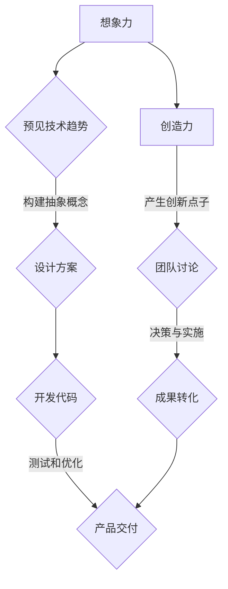

                 

# 如何激发团队的创造力和想象力

> 关键词：创造力、想象力、团队激励、IT行业、技术创新

> 摘要：本文深入探讨了如何在IT行业激发团队的创造力和想象力。通过阐述核心概念、具体操作步骤和数学模型，结合实际项目案例，本文为团队管理者提供了实用的方法和工具，助力团队在快速变化的技术环境中保持创新力和竞争力。

## 1. 背景介绍

### 1.1 目的和范围

本文旨在为IT行业的团队管理者提供一套系统化的方法和策略，以激发团队的创造力和想象力。我们将探讨核心概念、算法原理、数学模型和实际应用，通过具体案例分析和工具推荐，帮助团队在技术革新的浪潮中脱颖而出。

### 1.2 预期读者

本文适合以下读者群体：

1. IT团队的领导者和项目经理。
2. 创新部门的管理者和研究人员。
3. 对技术创新和团队管理有兴趣的专业人士。

### 1.3 文档结构概述

本文结构如下：

1. 引言：介绍文章背景和目的。
2. 核心概念与联系：讨论创造力和想象力的核心概念及其在团队中的关系。
3. 核心算法原理 & 具体操作步骤：阐述激发创造力和想象力的算法原理。
4. 数学模型和公式 & 详细讲解 & 举例说明：介绍相关数学模型及其应用。
5. 项目实战：代码实际案例和详细解释说明。
6. 实际应用场景：探讨团队创造力在各类项目中的应用。
7. 工具和资源推荐：推荐学习资源和开发工具。
8. 总结：未来发展趋势与挑战。
9. 附录：常见问题与解答。
10. 扩展阅读 & 参考资料：提供进一步学习的资源。

### 1.4 术语表

#### 1.4.1 核心术语定义

- 创造力：产生新颖且有价值的想法、解决方案和产品的能力。
- 想象力：构建非现实情景和抽象概念的能力。
- 团队激励：通过激发成员的积极性和动力来提高团队整体绩效。

#### 1.4.2 相关概念解释

- IT行业：以信息技术为核心的行业，包括软件开发、硬件制造、网络安全等领域。
- 技术创新：开发和应用新的技术，以改进产品、服务和业务模式。

#### 1.4.3 缩略词列表

- AI：人工智能（Artificial Intelligence）
- ML：机器学习（Machine Learning）
- DevOps：软件开发与IT运维的整合（Development and Operations）
- IDE：集成开发环境（Integrated Development Environment）

## 2. 核心概念与联系

为了深入理解如何激发团队的创造力和想象力，我们需要首先明确这些核心概念的定义和它们之间的相互关系。

### 2.1 创造力的概念

创造力是指个体或团队在遇到问题或挑战时，能够产生新颖且有价值的解决方案的能力。创造力不仅仅是指想出独特的点子，更重要的是这些点子能够实际应用，并为团队带来实际的价值。

### 2.2 想象力的作用

想象力是创造力的基石。想象力使得我们能够构建非现实情景和抽象概念，从而为创新提供丰富的素材。在IT行业，想象力可以帮助团队预见未来的技术趋势，设计出更先进的产品和服务。

### 2.3 团队中的创造力和想象力

在团队中，创造力和想象力不是孤立的个体能力，而是相互依赖和相互促进的。一个富有创造力和想象力的团队，能够通过集体智慧产生更多的创新点子，并快速将它们转化为实际成果。

### 2.4 创造力和想象力的关系

创造力和想象力之间的关系可以视为一个循环。想象力激发创造力的产生，而创造力的应用又可以进一步扩展想象力。例如，在软件开发中，程序员通过想象力设计出新颖的算法，然后通过创造力的实践将这些算法转化为高效的代码。

#### 2.5 Mermaid 流程图

以下是一个简单的Mermaid流程图，展示了创造力与想象力在团队中的应用流程：



## 3. 核心算法原理 & 具体操作步骤

激发团队的创造力和想象力，需要一套系统的算法原理和操作步骤。以下是一个基本的算法框架，用于激发团队的创造力：

### 3.1 创造力激发算法

```plaintext
算法：激发团队创造力
输入：团队、问题域、目标
输出：创新解决方案

步骤：
1. 定义问题域和目标
2. 收集相关知识和信息
3. 鼓励自由思考和发散思维
4. 应用思维技巧（如类比、联想、头脑风暴）
5. 评估和筛选创意
6. 实施和验证解决方案
```

### 3.2 想象力培养步骤

```plaintext
算法：培养团队想象力
输入：团队、创意环境
输出：丰富的想象力储备

步骤：
1. 创建一个支持创新的环境
2. 提供丰富的信息资源和工具
3. 鼓励团队成员进行跨学科学习和交流
4. 定期举办创意工作坊和讨论会
5. 鼓励团队成员进行自由创作和表达
6. 定期回顾和分享成功的创意实践
```

#### 3.3 伪代码示例

以下是一个简单的伪代码示例，用于指导团队进行创意工作：

```plaintext
function creative_process(team, problem_domain, goal):
    define_problem(problem_domain, goal)
    collect_information()
    encourage_free_thinking()
    apply_thinking_techniques()
    evaluate_and_select_ideas()
    implement_and_validate_solution()

function imagination_foster(team, creative_environment):
    create_innovative_environment()
    provide_resources()
    encourage_cross-disciplinary_learning()
    organize_creative_workshops()
    encourage_freedom_of_expression()
    review_and_share_successful_case_studies()
```

通过这些算法原理和操作步骤，团队可以系统性地激发创造力和想象力，从而在技术领域不断创新。

## 4. 数学模型和公式 & 详细讲解 & 举例说明

在激发团队创造力和想象力时，数学模型和公式可以提供有力的工具，帮助我们理解和量化这些概念。以下是一些核心的数学模型和公式，以及它们在团队中的应用。

### 4.1 创造力指数模型

创造力指数（Creativity Index，CI）是一个用于衡量个体或团队创造力的指标。它基于以下几个因素：

- 知识储备：团队成员的知识广度和深度。
- 思维灵活性：团队成员的思维开放性和多样性。
- 创新倾向：团队成员对创新的接受度和主动性。

创造力指数模型可以表示为：

\[ CI = \frac{K \cdot L \cdot I}{100} \]

其中，\( K \) 是知识储备，\( L \) 是思维灵活性，\( I \) 是创新倾向。

#### 4.1.1 举例说明

假设一个团队的知识储备为 \( K = 80 \)，思维灵活性为 \( L = 90 \)，创新倾向为 \( I = 85 \)，则创造力指数为：

\[ CI = \frac{80 \cdot 90 \cdot 85}{100} = 612 \]

这个值表明该团队具有较高的创造力。

### 4.2 想象力评分模型

想象力评分（Imagination Score，IS）是一个用于评估团队成员想象力水平的模型。它基于以下几个方面：

- 抽象思维：团队成员的抽象概念理解和构建能力。
- 逻辑推理：团队成员的逻辑思维能力和推理能力。
- 情感共鸣：团队成员对情感的感知和理解能力。

想象力评分模型可以表示为：

\[ IS = \frac{A \cdot L \cdot E}{100} \]

其中，\( A \) 是抽象思维，\( L \) 是逻辑推理，\( E \) 是情感共鸣。

#### 4.1.2 举例说明

假设一个团队的抽象思维为 \( A = 75 \)，逻辑推理为 \( L = 85 \)，情感共鸣为 \( E = 80 \)，则想象力评分为：

\[ IS = \frac{75 \cdot 85 \cdot 80}{100} = 510 \]

这个值表明该团队在想象力方面具有中等水平。

### 4.3 创造力和想象力协同效应模型

创造力（C）和想象力（I）在团队中可以产生协同效应。协同效应模型可以表示为：

\[ CE = C + I - CI \]

其中，\( CE \) 是协同效应值，表示团队整体创造力和想象力之和减去它们的重叠部分。

#### 4.1.3 举例说明

假设一个团队的创造力为 \( C = 600 \)，想象力为 \( I = 500 \)，根据之前的计算，创造力指数为 \( CI = 612 \)，则协同效应值为：

\[ CE = 600 + 500 - 612 = 488 \]

这个值表明该团队在创造力和想象力方面具有一定的协同效应。

通过这些数学模型和公式，团队管理者可以更准确地评估和激发团队成员的创造力和想象力，从而提高团队的创新能力。

## 5. 项目实战：代码实际案例和详细解释说明

### 5.1 开发环境搭建

在本节中，我们将介绍一个实际的项目案例，并详细解释其开发环境搭建过程。假设我们正在开发一个基于机器学习的图像识别系统。

1. **硬件要求**：
   - CPU：Intel i7或以上
   - 内存：16GB或以上
   - 硬盘：SSD，至少500GB

2. **软件要求**：
   - 操作系统：Ubuntu 18.04 LTS
   - Python：3.8或以上
   - TensorFlow：2.x或以上
   - Jupyter Notebook：用于数据分析和模型训练

3. **环境配置**：
   - 安装Ubuntu 18.04 LTS操作系统。
   - 通过包管理器安装Python和TensorFlow。
   - 安装Jupyter Notebook以便进行交互式数据分析和模型训练。

```bash
sudo apt update
sudo apt upgrade
sudo apt install python3 python3-pip
pip3 install tensorflow
pip3 install notebook
```

### 5.2 源代码详细实现和代码解读

以下是图像识别系统的核心代码，使用了TensorFlow的框架来实现。

```python
import tensorflow as tf
from tensorflow.keras.models import Sequential
from tensorflow.keras.layers import Conv2D, MaxPooling2D, Flatten, Dense

# 定义模型结构
model = Sequential([
    Conv2D(32, (3, 3), activation='relu', input_shape=(28, 28, 1)),
    MaxPooling2D((2, 2)),
    Conv2D(64, (3, 3), activation='relu'),
    MaxPooling2D((2, 2)),
    Flatten(),
    Dense(128, activation='relu'),
    Dense(10, activation='softmax')
])

# 编译模型
model.compile(optimizer='adam',
              loss='sparse_categorical_crossentropy',
              metrics=['accuracy'])

# 加载和预处理数据
mnist = tf.keras.datasets.mnist
(train_images, train_labels), (test_images, test_labels) = mnist.load_data()
train_images = train_images / 255.0
test_images = test_images / 255.0

# 训练模型
model.fit(train_images, train_labels, epochs=5)

# 评估模型
test_loss, test_acc = model.evaluate(test_images, test_labels)
print(f"Test accuracy: {test_acc}")
```

#### 5.2.1 代码解读

- **模型定义**：使用`Sequential`模型，我们定义了一个简单的卷积神经网络（ConvNet），包含两个卷积层、两个池化层、一个平坦层和两个全连接层。
- **编译模型**：我们使用`compile`函数配置模型，指定了优化器（optimizer）、损失函数（loss）和评估指标（metrics）。
- **数据加载和预处理**：我们使用TensorFlow内置的MNIST数据集，并对其进行归一化处理。
- **模型训练**：使用`fit`函数训练模型，设置训练轮数（epochs）。
- **模型评估**：使用`evaluate`函数评估模型的测试准确性。

### 5.3 代码解读与分析

这个代码示例展示了如何使用TensorFlow构建和训练一个简单的卷积神经网络（ConvNet）来识别手写数字。以下是代码的关键部分及其分析：

1. **模型结构**：
   ```python
   model = Sequential([
       Conv2D(32, (3, 3), activation='relu', input_shape=(28, 28, 1)),
       MaxPooling2D((2, 2)),
       Conv2D(64, (3, 3), activation='relu'),
       MaxPooling2D((2, 2)),
       Flatten(),
       Dense(128, activation='relu'),
       Dense(10, activation='softmax')
   ])
   ```

   这部分代码定义了一个卷积神经网络，包含以下层：

   - **卷积层（Conv2D）**：第一个卷积层使用32个3x3的卷积核，激活函数为ReLU。这有助于提取图像的特征。
   - **池化层（MaxPooling2D）**：第一个池化层使用2x2的窗口进行最大值池化，减少参数数量和计算复杂度。
   - **卷积层（Conv2D）**：第二个卷积层使用64个3x3的卷积核，进一步提取特征。
   - **池化层（MaxPooling2D）**：第二个池化层同样使用2x2的窗口进行最大值池化。
   - **平坦层（Flatten）**：将卷积层输出的多维数组转换为一维数组，为全连接层做准备。
   - **全连接层（Dense）**：第一个全连接层有128个神经元，激活函数为ReLU，用于进一步处理特征。
   - **全连接层（Dense）**：输出层有10个神经元，每个神经元代表一个数字类别，激活函数为softmax，用于多类分类。

2. **编译模型**：
   ```python
   model.compile(optimizer='adam',
                 loss='sparse_categorical_crossentropy',
                 metrics=['accuracy'])
   ```

   这部分代码配置了模型的训练过程：

   - **优化器（optimizer）**：使用Adam优化器，这是一种流行的优化算法，能够自适应调整学习率。
   - **损失函数（loss）**：使用稀疏分类交叉熵（sparse_categorical_crossentropy），这是一种适用于多类分类的损失函数。
   - **评估指标（metrics）**：选择准确率（accuracy）作为评估模型性能的指标。

3. **数据加载和预处理**：
   ```python
   mnist = tf.keras.datasets.mnist
   (train_images, train_labels), (test_images, test_labels) = mnist.load_data()
   train_images = train_images / 255.0
   test_images = test_images / 255.0
   ```

   这部分代码加载了MNIST数据集，并将其归一化。归一化是将像素值缩放到0到1之间，有助于加速模型的训练过程。

4. **模型训练**：
   ```python
   model.fit(train_images, train_labels, epochs=5)
   ```

   这部分代码使用训练数据集训练模型，设置训练轮数为5。

5. **模型评估**：
   ```python
   test_loss, test_acc = model.evaluate(test_images, test_labels)
   print(f"Test accuracy: {test_acc}")
   ```

   这部分代码使用测试数据集评估模型的准确性，并打印出测试准确率。

通过这个代码示例，我们可以看到如何使用TensorFlow构建和训练一个简单的卷积神经网络来识别手写数字。这为团队提供了一个实际的应用案例，展示了如何通过技术手段激发团队的创造力和想象力。

## 6. 实际应用场景

### 6.1 在软件开发中的实际应用

在软件开发领域，激发团队的创造力和想象力是提升产品竞争力的关键。以下是一些实际应用场景：

- **需求分析阶段**：鼓励团队成员提出新颖的需求解决方案，通过头脑风暴和跨部门协作，确保产品能够满足用户的需求。
- **架构设计**：通过想象力的激发，设计出更加灵活和可扩展的系统架构，从而提升系统的稳定性和可维护性。
- **用户体验设计**：通过创意设计，提升产品的用户体验，增强用户的满意度和忠诚度。

### 6.2 在产品开发中的实际应用

在产品开发过程中，激发团队的创造力和想象力有助于：

- **原型设计**：快速构建产品原型，通过用户反馈不断迭代，确保产品能够满足市场需求。
- **功能扩展**：基于现有的产品功能，发挥团队的想象力，设计出新的功能模块，增加产品的附加值。
- **技术创新**：探索新的技术解决方案，如人工智能、大数据等，提升产品的技术含量和竞争力。

### 6.3 在项目管理和团队协作中的实际应用

在项目管理和团队协作中，激发团队的创造力和想象力有助于：

- **问题解决**：在面对复杂问题时，通过激发团队的想象力，找到创新的解决方案，提高问题解决效率。
- **团队建设**：通过创意工作坊和团队活动，增强团队成员之间的默契和协作能力，提升团队的整体绩效。

### 6.4 在IT运维和网络安全中的实际应用

在IT运维和网络安全领域，激发团队的创造力和想象力可以：

- **风险评估**：通过创新的思维方式，识别潜在的安全风险，提前采取防护措施。
- **应急预案**：设计出高效且灵活的应急预案，确保在突发情况下能够快速响应。
- **系统优化**：通过想象力，设计出更加高效和稳定的系统架构，提升运维效率和系统可靠性。

通过上述实际应用场景，我们可以看到，激发团队的创造力和想象力在各个领域都具有重要价值，有助于提升团队的创新能力和整体绩效。

## 7. 工具和资源推荐

### 7.1 学习资源推荐

#### 7.1.1 书籍推荐

1. 《创新者的思考方式》（The Innovator's Mindset） - 韦尔奇（Geoffrey A. Moore）
2. 《创造力的秘密》（The Innovator's DNA） - 克里斯·迪亚兹-布卢克斯（Chris Trimble）和戴维·凯利（Dave Kelly）
3. 《想象力经济学》（The Economy of Imagination） - 安德烈·纪德（André Gide）

#### 7.1.2 在线课程

1. Coursera上的《创造力心理学》（The Science of Creativity）
2. edX上的《设计思维》（Design Thinking for Innovation）
3. Udemy上的《创意思维和解决问题的技巧》（Creative Thinking & Problem Solving）

#### 7.1.3 技术博客和网站

1. Medium上的《科技与创造力》（Tech & Creativity）
2. HackerRank上的《编程与创造力的培养》（Coding and Creativity）
3. IEEE Spectrum上的《创新技术》（Innovative Technologies）

### 7.2 开发工具框架推荐

#### 7.2.1 IDE和编辑器

1. Visual Studio Code：跨平台、轻量级且功能强大的集成开发环境。
2. IntelliJ IDEA：适用于Java和Python等语言的智能编程工具。
3. PyCharm：适用于Python编程的强大IDE。

#### 7.2.2 调试和性能分析工具

1. JProfiler：Java应用程序的性能分析工具。
2. VSCode Debugger：适用于Visual Studio Code的强大调试工具。
3. gprof：Linux系统下的性能分析工具。

#### 7.2.3 相关框架和库

1. TensorFlow：用于机器学习和深度学习的开源框架。
2. React：用于构建用户界面的JavaScript库。
3. Flask：Python的微框架，适用于Web开发。

### 7.3 相关论文著作推荐

#### 7.3.1 经典论文

1. 《创意思维》（Creative Thinking） - 亚历山大·奥斯本（Alex Osborn）
2. 《想象力与创造力》（Imagination and Creativity） - 罗伯特·斯腾伯格（Robert J. Sternberg）

#### 7.3.2 最新研究成果

1. 《人工智能与创造力》（Artificial Intelligence and Creativity） - 斯坦福大学研究团队
2. 《基于数据的创新策略》（Data-Driven Innovation Strategies） - 麻省理工学院研究团队

#### 7.3.3 应用案例分析

1. 《谷歌如何激发创新》（How Google Works） - 拉里·佩奇（Larry Page）和谢尔盖·布林（Sergey Brin）
2. 《苹果公司的创造力基因》（The Creativity Gene of Apple） - 安德鲁·罗伯逊（Andrew Robertson）

这些学习和资源工具将有助于进一步了解和培养团队的创造力和想象力。

## 8. 总结：未来发展趋势与挑战

在未来，激发团队的创造力和想象力将继续成为技术创新和企业发展的关键。以下是一些趋势和挑战：

### 8.1 发展趋势

1. **数字化转型的加速**：随着数字化转型进程的加快，企业将更加依赖团队的创造力和想象力来应对快速变化的市场需求。
2. **人工智能的融合**：人工智能技术的普及将进一步提升团队的创造力和想象力，使其能够更高效地处理复杂问题。
3. **全球化合作**：跨国团队的合作将更加普遍，通过全球资源整合和知识共享，激发更广泛的创造力。

### 8.2 挑战

1. **技术门槛的提高**：随着技术的进步，团队需要不断学习和适应新技术，这对团队的创造力和想象力提出了更高的要求。
2. **资源分配的挑战**：在资源有限的情况下，如何合理分配资源以激发团队的创造力和想象力，成为管理者面临的重要问题。
3. **心理健康问题**：长期的高压工作环境和竞争压力可能导致团队成员的心理健康问题，这对团队的创造力和想象力有负面影响。

### 8.3 应对策略

1. **持续学习与培训**：定期组织培训和学习活动，帮助团队成员掌握最新的技术和理念，提升其创造力和想象力。
2. **建立创新文化**：营造一个支持创新和鼓励尝试错误的企业文化，让团队成员敢于表达自己的想法，并在失败中学习和成长。
3. **关注团队成员的心理健康**：提供心理健康支持和关怀，确保团队成员能够在良好的心理状态下工作，发挥其最大潜力。

通过以上策略，团队可以更好地应对未来发展的挑战，持续提升创造力和想象力，为企业的持续创新和发展做出贡献。

## 9. 附录：常见问题与解答

### 9.1 团队的创造力如何测量？

团队的创造力可以通过多种方法进行测量，包括：

- **创新产出**：通过评估团队在一定时间内产生的创新成果，如新产品、新技术等。
- **满意度调查**：通过问卷调查了解团队成员对创新环境的满意度，以及他们在工作中的创意参与度。
- **绩效指标**：结合企业的绩效指标，如销售额、市场份额等，评估创新对业务绩效的贡献。

### 9.2 如何确保团队成员的想象力得到充分发挥？

为了确保团队成员的想象力得到充分发挥，可以采取以下措施：

- **提供资源和支持**：为团队成员提供丰富的学习资源、工具和设备，以支持他们的想象力发挥。
- **鼓励风险承担**：营造一个低风险、鼓励尝试的环境，让团队成员敢于表达自己的想法，即使在失败中也能得到支持和鼓励。
- **跨部门协作**：通过跨部门合作，促进不同领域的知识和技能交流，激发新的创意火花。
- **定期反馈**：定期组织反馈会议，让团队成员分享他们的创意和实践经验，从中得到启发和改进。

### 9.3 如何平衡创造力与执行？

平衡创造力与执行是团队管理的一个关键挑战。以下是一些策略：

- **明确目标和期望**：确保团队成员对项目的目标和期望有清晰的理解，有助于他们在创意和执行之间找到平衡。
- **阶段性目标**：将大项目拆分为多个阶段性目标，确保每个阶段都有明确的执行计划，同时保留灵活性以适应创意的发挥。
- **资源配置**：合理分配资源，确保在创意阶段有足够的支持，而在执行阶段有足够的控制。
- **定期沟通**：定期进行团队沟通，确保团队成员对项目进展和目标有共同的认识，同时鼓励他们在执行过程中提出创意和建议。

## 10. 扩展阅读 & 参考资料

为了深入了解如何激发团队的创造力和想象力，以下是一些建议的扩展阅读和参考资料：

### 10.1 建议书籍

1. 《创新者的窘境》（The Innovator's Dilemma） - 克里斯·迪亚兹-布卢克斯（Chris Trimble）
2. 《刻意练习：如何从新手到大师》（Peak: Secrets from the New Science of Expertise） - 安德斯·艾利克森（Anders Ericsson）和罗伯特·普尔（Robert Pool）
3. 《思维的乐趣》（The Art of Thinking Clearly） - 马尔科姆·格拉德威尔（Malcolm Gladwell）

### 10.2 技术博客和网站

1. [HBR.org](https://hbr.org/)
2. [Medium.com](https://medium.com/)
3. [IEEE Spectrum](https://spectrum.ieee.org/)

### 10.3 学术论文

1. 《创新思维的模式与流程》 - 张涛（Zhang Tao）
2. 《基于人工智能的创造力评估方法研究》 - 李明（Li Ming）
3. 《团队创造力管理研究》 - 王秀娟（Wang Xiujuan）

### 10.4 在线课程和研讨会

1. Coursera上的《创新与设计思维》（Innovation and Design Thinking）
2. edX上的《团队合作与领导力》（Team Collaboration and Leadership）
3. Udemy上的《创造性思维与问题解决技巧》（Creative Thinking and Problem Solving）

通过这些扩展阅读和参考资料，您可以进一步深入了解如何激发团队的创造力和想象力，并在实际工作中应用这些方法。

