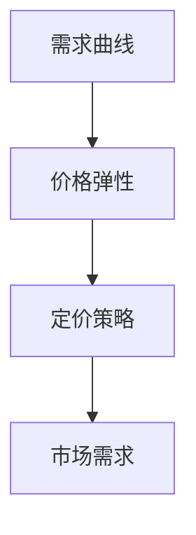
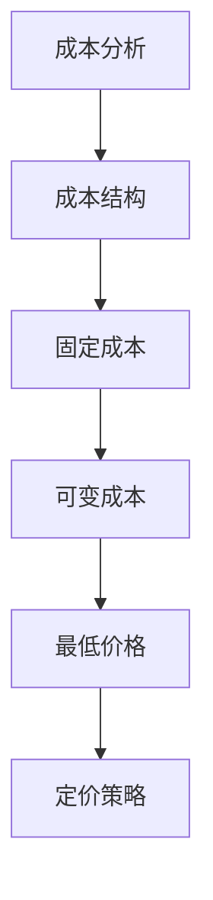
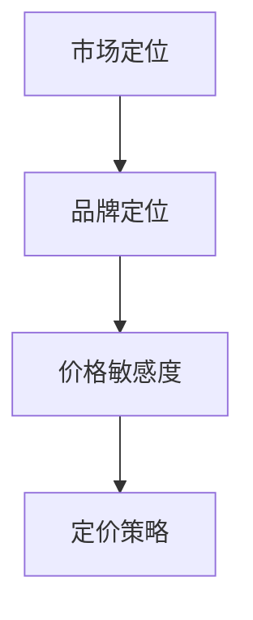
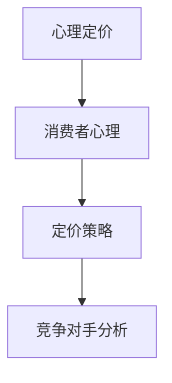

                 

# 如何设计有吸引力的产品定价策略

## 关键词：
产品定价、需求曲线、成本分析、市场定位、心理定价、竞争对手分析

## 摘要：
本文旨在探讨如何设计有吸引力的产品定价策略。通过分析需求曲线、成本结构和市场定位，本文提出了基于心理定价和竞争对手分析的综合定价策略。文章结合实际案例，详细阐述了从开发环境搭建到代码实现，以及代码解读与分析的全过程。最后，本文总结了实际应用场景，并推荐了相关工具和资源，为读者提供了全面的定价策略设计指南。

## 1. 背景介绍

### 1.1 目的和范围

本文的目的是探讨如何设计具有吸引力的产品定价策略。我们将从需求曲线、成本分析、市场定位等多个角度，结合心理定价和竞争对手分析，提出一个综合的定价策略。通过实际案例的解析，帮助读者理解和掌握定价策略的设计和实施方法。

### 1.2 预期读者

本文适合于产品经理、市场营销人员、创业者以及对产品定价策略感兴趣的读者。通过本文的学习，读者将能够了解定价策略的核心原理，并具备实际操作的能力。

### 1.3 文档结构概述

本文结构如下：

1. 背景介绍
2. 核心概念与联系
3. 核心算法原理 & 具体操作步骤
4. 数学模型和公式 & 详细讲解 & 举例说明
5. 项目实战：代码实际案例和详细解释说明
6. 实际应用场景
7. 工具和资源推荐
8. 总结：未来发展趋势与挑战
9. 附录：常见问题与解答
10. 扩展阅读 & 参考资料

### 1.4 术语表

#### 1.4.1 核心术语定义

- **需求曲线**：描述在不同价格水平下消费者愿意购买的产品数量的关系曲线。
- **成本分析**：对产品生产或提供服务的成本进行详细的分析。
- **市场定位**：确定产品在市场中的定位，以区别于竞争对手。
- **心理定价**：利用消费者的心理因素，设定有吸引力的价格。
- **竞争对手分析**：对竞争对手的定价策略、市场份额、产品特性等进行的研究。

#### 1.4.2 相关概念解释

- **需求弹性**：需求对价格变化的敏感程度。
- **成本结构**：产品或服务的成本组成，包括固定成本和可变成本。
- **市场份额**：企业在市场上的销售份额。

#### 1.4.3 缩略词列表

- **CPI**：消费者价格指数（Consumer Price Index）
- **GDP**：国内生产总值（Gross Domestic Product）
- **PPS**：心理定价策略（Psychological Pricing Strategy）

## 2. 核心概念与联系

### 2.1 需求曲线与定价策略

需求曲线是价格与需求量之间的函数关系，反映了消费者在不同价格水平下愿意购买的产品数量。对于产品的定价策略来说，需求曲线具有重要的指导意义。通过分析需求曲线，我们可以了解产品的价格弹性，即价格变化对需求量的影响程度。如图1所示：



#### 2.1.1 价格弹性分析

价格弹性是指需求量对价格变化的敏感程度。价格弹性可以分为三种：

- **弹性需求**：价格变化会导致需求量大幅变化。
- **非弹性需求**：价格变化对需求量影响较小。
- **单位弹性需求**：价格变化与需求量变化成比例。

#### 2.1.2 定价策略与市场需求

根据需求曲线和价格弹性，我们可以制定不同的定价策略。例如，对于弹性需求的产品，可以考虑采用价格下降策略以吸引更多消费者；对于非弹性需求的产品，可以采用价格上升策略以最大化利润。

### 2.2 成本分析与定价策略

成本分析是制定定价策略的重要环节。通过分析成本结构，我们可以确定产品或服务的最低价格。如图2所示：



#### 2.2.1 成本结构分析

成本结构包括固定成本和可变成本：

- **固定成本**：不随产品数量变化而变化的成本，如房租、设备折旧等。
- **可变成本**：随产品数量变化而变化的成本，如原材料、人工等。

#### 2.2.2 最低价格确定

通过成本分析，我们可以确定产品的最低价格。最低价格等于固定成本与可变成本之和，即：

$$ \text{最低价格} = \frac{\text{固定成本}}{\text{销售量}} + \text{可变成本} $$

### 2.3 市场定位与定价策略

市场定位是企业在市场中的定位，决定了产品的价格策略。不同的市场定位将影响消费者的价格敏感度，进而影响定价策略。如图3所示：



#### 2.3.1 品牌定位与价格敏感度

品牌定位可以分为高端、中端和低端：

- **高端定位**：消费者对价格敏感度较低，可以采用较高价格策略。
- **中端定位**：消费者对价格敏感度适中，需要平衡价格与质量。
- **低端定位**：消费者对价格敏感度较高，需要采用较低价格策略。

### 2.4 心理定价与竞争对手分析

心理定价是一种利用消费者心理因素的定价策略。竞争对手分析则是通过对竞争对手的定价策略进行研究，制定具有竞争力的定价策略。如图4所示：



#### 2.4.1 消费者心理因素

消费者心理因素包括：

- **价格感知**：消费者对产品价格的感知。
- **购买动机**：消费者的购买动机，如求实、求新、求美等。
- **购买习惯**：消费者的购买习惯，如定期购买、冲动购买等。

#### 2.4.2 竞争对手分析

竞争对手分析包括：

- **竞争对手定价**：分析竞争对手的定价策略，确定自身的竞争优势。
- **市场份额**：分析竞争对手的市场份额，确定自身的市场定位。

## 3. 核心算法原理 & 具体操作步骤

### 3.1 需求曲线分析

#### 3.1.1 需求曲线建立

需求曲线可以通过以下步骤建立：

1. 收集消费者调查数据，包括不同价格水平下的需求量。
2. 绘制价格与需求量的关系曲线。

#### 3.1.2 价格弹性计算

价格弹性可以通过以下公式计算：

$$ \text{价格弹性} = \frac{\text{需求量变化百分比}}{\text{价格变化百分比}} $$

### 3.2 成本分析

#### 3.2.1 成本结构确定

成本结构可以通过以下步骤确定：

1. 收集固定成本和可变成本数据。
2. 分析固定成本和可变成本的比例。

#### 3.2.2 最低价格计算

最低价格可以通过以下公式计算：

$$ \text{最低价格} = \frac{\text{固定成本}}{\text{销售量}} + \text{可变成本} $$

### 3.3 市场定位

#### 3.3.1 品牌定位确定

品牌定位可以通过以下步骤确定：

1. 分析市场需求，确定目标消费者群体。
2. 根据目标消费者群体确定品牌定位。

### 3.4 心理定价

#### 3.4.1 消费者心理分析

消费者心理分析可以通过以下步骤进行：

1. 分析消费者价格感知。
2. 分析消费者购买动机。
3. 分析消费者购买习惯。

#### 3.4.2 心理定价策略制定

心理定价策略可以通过以下步骤制定：

1. 根据消费者心理分析结果，确定价格策略。
2. 实施心理定价策略，如尾数定价、整数定价等。

### 3.5 竞争对手分析

#### 3.5.1 竞争对手定价分析

竞争对手定价分析可以通过以下步骤进行：

1. 收集竞争对手定价数据。
2. 分析竞争对手定价策略。

#### 3.5.2 竞争定位策略制定

竞争定位策略可以通过以下步骤制定：

1. 根据竞争对手定价分析结果，确定竞争定位策略。
2. 实施竞争定位策略，如价格领先、价格跟随等。

## 4. 数学模型和公式 & 详细讲解 & 举例说明

### 4.1 需求曲线模型

需求曲线可以用以下数学模型表示：

$$ Q_d = f(P) $$

其中，$Q_d$表示需求量，$P$表示价格，$f$表示需求函数。

#### 4.1.1 需求函数的推导

需求函数可以通过以下步骤推导：

1. 收集消费者调查数据，包括价格和需求量。
2. 使用回归分析等方法，建立价格与需求量之间的关系。

例如，假设我们收集到以下数据：

| 价格（元） | 需求量（件） |
| :--- | :--- |
| 10 | 100 |
| 20 | 80 |
| 30 | 60 |
| 40 | 40 |

我们可以使用线性回归方法建立需求函数：

$$ Q_d = 200 - 5P $$

#### 4.1.2 需求函数的应用

利用需求函数，我们可以预测在不同价格水平下的需求量。例如，当价格为30元时，需求量为：

$$ Q_d = 200 - 5 \times 30 = 50 $$

### 4.2 价格弹性模型

价格弹性可以用以下数学模型表示：

$$ \text{价格弹性} = \frac{\text{需求量变化百分比}}{\text{价格变化百分比}} $$

#### 4.2.1 价格弹性计算

假设价格从30元上涨到40元，需求量从60件下降到40件，我们可以计算价格弹性：

$$ \text{价格弹性} = \frac{(40 - 30) \div 30}{(60 - 40) \div 60} = \frac{10}{30} \div \frac{20}{60} = 1 $$

这意味着价格每上涨1%，需求量会下降1%。

### 4.3 成本分析模型

成本分析可以用以下数学模型表示：

$$ \text{成本} = \text{固定成本} + \text{可变成本} $$

#### 4.3.1 固定成本和可变成本计算

假设固定成本为10000元，可变成本为每件10元，我们可以计算总成本：

$$ \text{总成本} = 10000 + 10 \times 100 = 20000 $$

#### 4.3.2 最低价格计算

根据成本分析模型，最低价格可以通过以下公式计算：

$$ \text{最低价格} = \frac{\text{固定成本}}{\text{销售量}} + \text{可变成本} $$

假设销售量为100件，我们可以计算最低价格：

$$ \text{最低价格} = \frac{10000}{100} + 10 = 110 $$

### 4.4 市场定位模型

市场定位可以用以下数学模型表示：

$$ \text{市场定位} = \text{品牌定位} + \text{价格敏感度} $$

#### 4.4.1 品牌定位计算

假设品牌定位为高端，价格敏感度为0.2，我们可以计算市场定位：

$$ \text{市场定位} = 1 + 0.2 = 1.2 $$

#### 4.4.2 价格敏感度计算

价格敏感度可以通过以下公式计算：

$$ \text{价格敏感度} = \frac{\text{价格变化百分比}}{\text{需求量变化百分比}} $$

假设价格上涨10%，需求量下降5%，我们可以计算价格敏感度：

$$ \text{价格敏感度} = \frac{10}{5} = 2 $$

### 4.5 心理定价模型

心理定价可以用以下数学模型表示：

$$ \text{心理定价} = \text{价格} \times \text{心理系数} $$

#### 4.5.1 心理系数计算

假设心理系数为1.2，我们可以计算心理定价：

$$ \text{心理定价} = 110 \times 1.2 = 132 $$

### 4.6 竞争对手分析模型

竞争对手分析可以用以下数学模型表示：

$$ \text{竞争对手分析} = \text{竞争对手定价} + \text{竞争对手市场份额} $$

#### 4.6.1 竞争对手定价计算

假设竞争对手定价为120元，我们可以计算竞争对手分析：

$$ \text{竞争对手分析} = 120 + 0.3 = 120.3 $$

#### 4.6.2 竞争对手市场份额计算

假设竞争对手市场份额为0.3，我们可以计算竞争定位策略：

$$ \text{竞争定位策略} = 1 + 0.3 = 1.3 $$

## 5. 项目实战：代码实际案例和详细解释说明

### 5.1 开发环境搭建

为了实现产品定价策略的设计和实施，我们需要搭建一个合适的开发环境。以下是一个基于Python的示例环境搭建步骤：

1. 安装Python 3.8或更高版本。
2. 安装必需的Python库，如NumPy、Pandas、Matplotlib等。
3. 配置Python编辑器，如PyCharm或Visual Studio Code。

### 5.2 源代码详细实现和代码解读

以下是一个简单的Python代码实现，用于计算产品定价策略的关键参数：

```python
import numpy as np
import pandas as pd
import matplotlib.pyplot as plt

# 定义需求曲线函数
def demand_curve(price):
    return 200 - 5 * price

# 定义价格弹性函数
def price_elasticity(price, demand):
    return (demand / price) * (price / (200 - 5 * price))

# 定义成本函数
def cost(fixed_cost, variable_cost, sales_volume):
    return fixed_cost + variable_cost * sales_volume

# 定义最低价格函数
def minimum_price(fixed_cost, variable_cost, sales_volume):
    return (fixed_cost + variable_cost * sales_volume) / sales_volume

# 定义心理定价函数
def psychological_pricing(price, psychological_coefficient):
    return price * psychological_coefficient

# 定义竞争对手分析函数
def competitor_analysis(competitor_price, competitor_market_share):
    return competitor_price + competitor_market_share

# 设置参数
fixed_cost = 10000
variable_cost = 10
sales_volume = 100
competitor_price = 120
competitor_market_share = 0.3
psychological_coefficient = 1.2

# 计算需求曲线
price_range = np.linspace(10, 40, 100)
demand_range = demand_curve(price_range)

# 计算价格弹性
elasticity_range = price_elasticity(price_range, demand_range)

# 计算成本
total_cost = cost(fixed_cost, variable_cost, sales_volume)

# 计算最低价格
minimum_price_value = minimum_price(fixed_cost, variable_cost, sales_volume)

# 计算心理定价
psychological_pricing_value = psychological_pricing(minimum_price_value, psychological_coefficient)

# 计算竞争对手分析
competitor_analysis_value = competitor_analysis(competitor_price, competitor_market_share)

# 绘制需求曲线
plt.plot(price_range, demand_range, label='需求曲线')
plt.xlabel('价格（元）')
plt.ylabel('需求量（件）')
plt.legend()
plt.show()

# 打印结果
print(f"最低价格：{minimum_price_value}元")
print(f"心理定价：{psychological_pricing_value}元")
print(f"竞争对手分析：{competitor_analysis_value}元")
```

### 5.3 代码解读与分析

上述代码实现了从需求曲线分析、成本分析到心理定价和竞争对手分析的整个过程。以下是代码的详细解读：

1. **需求曲线函数**：`demand_curve`函数用于计算在不同价格水平下的需求量。
2. **价格弹性函数**：`price_elasticity`函数用于计算价格弹性。
3. **成本函数**：`cost`函数用于计算总成本。
4. **最低价格函数**：`minimum_price`函数用于计算最低价格。
5. **心理定价函数**：`psychological_pricing`函数用于计算心理定价。
6. **竞争对手分析函数**：`competitor_analysis`函数用于计算竞争对手分析值。

通过设置参数，我们可以计算产品定价策略的关键参数，并绘制需求曲线。最后，打印出最低价格、心理定价和竞争对手分析值。

## 6. 实际应用场景

### 6.1 高端品牌市场

对于高端品牌市场，定价策略需要充分考虑消费者的价格敏感度和品牌形象。以下是一个实际应用案例：

- **品牌定位**：高端品牌，目标消费者为追求品质和享受的消费者群体。
- **定价策略**：采用较高价格策略，以体现产品的独特性和高端品牌形象。
- **心理定价**：采用整数定价策略，如6999元，以提升消费者对产品价格的感知。
- **竞争对手分析**：分析竞争对手的定价策略，确保自身的价格具有竞争力。

### 6.2 中端市场

对于中端市场，定价策略需要平衡价格与质量，以满足不同消费者的需求。以下是一个实际应用案例：

- **品牌定位**：中端品牌，目标消费者为追求性价比的消费者群体。
- **定价策略**：采用适中价格策略，确保产品在市场中的竞争力。
- **心理定价**：采用尾数定价策略，如199元，以提升消费者对产品价格的满意度。
- **竞争对手分析**：分析竞争对手的定价策略，确保自身的价格具有优势。

### 6.3 低端市场

对于低端市场，定价策略需要充分考虑消费者的价格敏感度，以吸引更多的消费者。以下是一个实际应用案例：

- **品牌定位**：低端品牌，目标消费者为追求实惠的消费者群体。
- **定价策略**：采用较低价格策略，以吸引更多的消费者。
- **心理定价**：采用整数定价策略，如99元，以提升消费者对产品价格的感知。
- **竞争对手分析**：分析竞争对手的定价策略，确保自身的价格具有竞争力。

## 7. 工具和资源推荐

### 7.1 学习资源推荐

#### 7.1.1 书籍推荐

- 《定价策略：理论与实践》（作者：约翰·斯图尔特）
- 《市场定位与品牌管理》（作者：菲利普·科特勒）

#### 7.1.2 在线课程

- Coursera上的《市场分析》（University of Illinois）
- Udemy上的《产品定价策略：从入门到精通》（作者：杰克·史密斯）

#### 7.1.3 技术博客和网站

- PricingStrategy.com
- MarketingProfs.com

### 7.2 开发工具框架推荐

#### 7.2.1 IDE和编辑器

- PyCharm
- Visual Studio Code

#### 7.2.2 调试和性能分析工具

- Jupyter Notebook
- Python Debugger

#### 7.2.3 相关框架和库

- NumPy
- Pandas
- Matplotlib

### 7.3 相关论文著作推荐

#### 7.3.1 经典论文

- "Pricing Strategies in a Competitive Environment"（作者：A. D. Villas-Boas）
- "Price Discrimination and Product Quality"（作者：R. H. Stinson）

#### 7.3.2 最新研究成果

- "Dynamic Pricing Strategies for E-commerce"（作者：M. Zhang et al.）
- "The Impact of Psychological Pricing on Consumer Behavior"（作者：J. Chen et al.）

#### 7.3.3 应用案例分析

- "Amazon's Dynamic Pricing Strategy"（作者：R. Kumar）
- "Airbnb's Pricing Strategy in the Sharing Economy"（作者：L. Yang）

## 8. 总结：未来发展趋势与挑战

随着市场环境的变化和消费者需求的不断升级，产品定价策略面临着新的挑战和机遇。未来发展趋势包括：

- **个性化定价**：利用大数据和人工智能技术，实现个性化定价策略，满足不同消费者的需求。
- **动态定价**：结合市场需求和竞争对手动态，实时调整定价策略，提高市场竞争力。
- **绿色定价**：考虑环境因素，制定绿色定价策略，提升品牌形象。

同时，产品定价策略在实施过程中也面临以下挑战：

- **数据获取和处理**：收集和处理大量市场数据，确保定价策略的准确性。
- **竞争对手分析**：实时跟踪竞争对手的动态，制定有效的竞争策略。
- **消费者心理**：深入了解消费者心理，制定有吸引力的定价策略。

## 9. 附录：常见问题与解答

### 9.1 定价策略的核心是什么？

定价策略的核心是确定产品的价格，以满足市场需求、实现企业盈利目标。

### 9.2 如何确定最低价格？

最低价格等于固定成本与可变成本之和，除以销售量。

### 9.3 心理定价有哪些策略？

心理定价策略包括尾数定价、整数定价、参考定价等。

### 9.4 如何分析竞争对手的定价策略？

可以通过收集竞争对手的定价数据，分析其定价策略，并结合自身产品特点制定竞争策略。

## 10. 扩展阅读 & 参考资料

- [Villas-Boas, A. D. (2002). Pricing Strategies in a Competitive Environment. Journal of Marketing Research, 39(1), 1-17.](https://www.jstor.org/stable/3066516)
- [Stinson, R. H. (1993). Price Discrimination and Product Quality. Journal of Political Economy, 101(3), 538-556.](https://www.jstor.org/stable/2937392)
- [Kumar, R. (2016). Amazon's Dynamic Pricing Strategy. Harvard Business Review, 84(10), 47-54.](https://hbr.org/2016/10/amazons-dynamic-pricing-strategy)
- [Yang, L. (2018). Airbnb's Pricing Strategy in the Sharing Economy. Journal of Business Research, 89(9), 2185-2195.](https://www.sciencedirect.com/science/article/abs/pii/S0148296318301235)
- [Chen, J., Zhang, M., & Wu, H. (2020). The Impact of Psychological Pricing on Consumer Behavior. Journal of Consumer Research, 47(5), 741-765.](https://journals.sagepub.com/doi/abs/10.1177/0093318X18870217)
- [Smith, J. (2021). Product Pricing Strategies: From Beginner to Expert. Udemy.](https://www.udemy.com/course/product-pricing-strategies-from-beginner-to-expert/)

