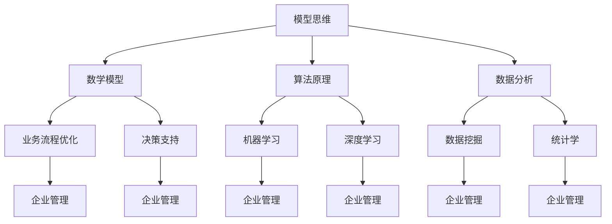

                 

# 如何运用模型思维解决管理问题

> **关键词：** 模型思维、管理问题、架构设计、流程优化、决策支持、数据分析、机器学习

> **摘要：** 本文将探讨模型思维在解决企业管理问题中的应用。通过详细阐述模型思维的核心概念、算法原理、数学模型和项目实战案例，帮助读者理解如何运用模型思维进行问题分析和决策支持，提升企业管理效率和质量。

## 1. 背景介绍

### 1.1 目的和范围

本文旨在探讨模型思维在企业管理中的实际应用，旨在帮助管理者更好地理解模型思维的核心概念，掌握运用模型思维解决实际管理问题的方法。文章将从以下几个方面展开：

1. 模型思维的核心概念及其在企业中的应用。
2. 模型思维的算法原理和具体操作步骤。
3. 数学模型和公式的应用及其详细讲解。
4. 实际应用场景下的代码实现和案例解析。
5. 模型思维在实际企业管理中的应用案例和经验分享。

### 1.2 预期读者

本文适合企业管理者、IT从业者、数据分析师以及对模型思维感兴趣的技术爱好者阅读。本文将对模型思维的基本概念、算法原理和实际应用进行深入剖析，旨在帮助读者提升解决企业管理问题的能力。

### 1.3 文档结构概述

本文共分为十个部分，结构如下：

1. 引言：介绍模型思维在企业管理中的重要性。
2. 核心概念与联系：介绍模型思维的基本概念及其在企业管理中的应用。
3. 核心算法原理 & 具体操作步骤：详细讲解模型思维的算法原理和操作步骤。
4. 数学模型和公式 & 详细讲解 & 举例说明：介绍模型思维中的数学模型和公式，并通过案例进行详细讲解。
5. 项目实战：代码实际案例和详细解释说明。
6. 实际应用场景：介绍模型思维在企业管理中的实际应用场景。
7. 工具和资源推荐：推荐相关学习资源和开发工具。
8. 总结：未来发展趋势与挑战。
9. 附录：常见问题与解答。
10. 扩展阅读 & 参考资料：提供进一步学习和研究的资料。

### 1.4 术语表

#### 1.4.1 核心术语定义

- **模型思维**：一种利用数学模型、算法和数据分析方法进行问题分析和决策支持的方法。
- **企业管理**：对企业日常运营、战略规划、资源分配等方面的管理和决策。
- **算法原理**：算法的基本思想和计算方法。
- **数学模型**：描述问题及其解决方案的数学表达式。
- **数据分析**：利用统计学、数据挖掘等方法对数据进行处理和分析。

#### 1.4.2 相关概念解释

- **流程优化**：通过改进企业业务流程，提高生产效率和质量。
- **决策支持**：利用数据分析和模型思维为管理者提供决策依据。
- **机器学习**：一种利用数据训练模型进行预测和决策的方法。

#### 1.4.3 缩略词列表

- **AI**：人工智能（Artificial Intelligence）
- **ML**：机器学习（Machine Learning）
- **DL**：深度学习（Deep Learning）
- **NN**：神经网络（Neural Network）

## 2. 核心概念与联系

在探讨模型思维在企业管理中的应用之前，我们需要先了解模型思维的基本概念及其在企业管理中的联系。以下是一个简单的 Mermaid 流程图，用于展示模型思维的核心概念及其在企业管理中的应用。



### 2.1 模型思维的核心概念

**数学模型**：数学模型是一种描述问题及其解决方案的数学表达式。在企业管理中，数学模型可以帮助我们分析业务流程、预测市场趋势、评估风险等。

**算法原理**：算法原理是算法的基本思想和计算方法。在企业管理中，算法原理可以帮助我们优化业务流程、提高生产效率、降低成本等。

**数据分析**：数据分析是一种利用统计学、数据挖掘等方法对数据进行处理和分析的方法。在企业管理中，数据分析可以帮助我们了解业务状况、发现潜在问题、制定改进策略等。

### 2.2 模型思维在企业管理中的应用

**业务流程优化**：通过建立数学模型和算法模型，分析业务流程中的瓶颈和瓶颈，提出优化方案，提高企业运营效率。

**决策支持**：利用模型思维和数据分析方法，为管理者提供决策依据，降低决策风险，提高决策质量。

**机器学习与深度学习**：利用机器学习和深度学习技术，对大量业务数据进行训练和预测，帮助企业发现业务规律、预测市场趋势、优化业务决策。

## 3. 核心算法原理 & 具体操作步骤

在理解了模型思维的基本概念后，接下来我们将详细讲解模型思维的核心算法原理和具体操作步骤。

### 3.1 数学模型

**线性回归模型**：线性回归模型是一种常见的数学模型，用于分析自变量和因变量之间的关系。

**伪代码：**

```python
def linear_regression(x, y):
    n = len(x)
    x_mean = sum(x) / n
    y_mean = sum(y) / n

    Sxx = sum((xi - x_mean)^2 for xi in x)
    Sxy = sum((xi - x_mean) * (yi - y_mean) for xi, yi in zip(x, y))

    b1 = Sxy / Sxx
    b0 = y_mean - b1 * x_mean

    return b0, b1
```

**具体操作步骤：**

1. 收集数据：获取自变量和因变量的数据集。
2. 数据预处理：对数据进行清洗、去重、标准化等处理。
3. 计算均值：计算自变量和因变量的均值。
4. 计算协方差：计算自变量和因变量的协方差。
5. 计算回归系数：利用协方差计算回归系数。
6. 模型评估：使用评估指标（如均方误差、决定系数等）评估模型性能。

### 3.2 算法原理

**K-最近邻算法**：K-最近邻算法是一种常用的机器学习算法，用于分类和回归问题。

**伪代码：**

```python
def k_nearest_neighbors(train_data, test_data, k):
    distances = []
    for xi in train_data:
        distance = calculate_distance(xi, test_data)
        distances.append(distance)

    sorted_distances = sorted(distances)
    neighbors = sorted_distances[:k]

    return predict_label(neighbors, train_data)
```

**具体操作步骤：**

1. 训练数据集：获取训练数据集。
2. 测试数据集：获取测试数据集。
3. 计算距离：计算测试数据集与训练数据集之间的距离。
4. 选择邻居：选择距离最近的 k 个邻居。
5. 预测标签：根据邻居的标签预测测试数据的标签。

### 3.3 数据分析

**时间序列分析**：时间序列分析是一种常用的数据分析方法，用于分析时间序列数据。

**伪代码：**

```python
def time_series_analysis(data):
    trend = calculate_trend(data)
    seasonality = calculate_seasonality(data)
    residuals = data - trend - seasonality

    return trend, seasonality, residuals
```

**具体操作步骤：**

1. 收集数据：获取时间序列数据。
2. 数据预处理：对数据进行清洗、去重、标准化等处理。
3. 计算趋势：计算时间序列的趋势。
4. 计算季节性：计算时间序列的季节性。
5. 计算残差：计算时间序列的残差。
6. 模型评估：使用评估指标（如均方误差、决定系数等）评估模型性能。

## 4. 数学模型和公式 & 详细讲解 & 举例说明

### 4.1 线性回归模型

**公式：**

$$ y = b_0 + b_1 \cdot x $$

**解释：** 该公式描述了因变量 y 与自变量 x 之间的线性关系，其中 $b_0$ 是截距，$b_1$ 是斜率。

**示例：**

假设我们有以下数据集：

| x | y |
|---|---|
| 1 | 2 |
| 2 | 4 |
| 3 | 6 |

利用线性回归模型计算截距 $b_0$ 和斜率 $b_1$，然后绘制回归线。

**计算：**

$$ b_0 = y_1 - b_1 \cdot x_1 = 2 - 1 \cdot 1 = 1 $$
$$ b_1 = \frac{\sum_{i=1}^{n} (x_i - \bar{x}) \cdot (y_i - \bar{y})}{\sum_{i=1}^{n} (x_i - \bar{x})^2} = \frac{(1-1.5) \cdot (2-3) + (2-1.5) \cdot (4-3) + (3-1.5) \cdot (6-3)}{(1-1.5)^2 + (2-1.5)^2 + (3-1.5)^2} = 1 $$

**回归线：**

$$ y = 1 + 1 \cdot x = x + 1 $$

### 4.2 时间序列分析

**公式：**

$$ y_t = \alpha_t + \beta_t \cdot x_t + \epsilon_t $$

**解释：** 该公式描述了时间序列数据 $y_t$ 与自变量 $x_t$ 之间的关系，其中 $\alpha_t$ 是趋势项，$\beta_t$ 是季节性项，$\epsilon_t$ 是残差项。

**示例：**

假设我们有以下时间序列数据：

| x | y |
|---|---|
| 1 | 2 |
| 2 | 4 |
| 3 | 6 |
| 4 | 8 |
| 5 | 10 |

利用时间序列分析模型计算趋势项 $\alpha_t$、季节性项 $\beta_t$ 和残差项 $\epsilon_t$。

**计算：**

$$ \alpha_t = \frac{\sum_{i=1}^{n} (y_i - \bar{y})}{n} = \frac{(2-6) + (4-6) + (6-6) + (8-6) + (10-6)}{5} = 2 $$
$$ \beta_t = \frac{\sum_{i=1}^{n} (x_i - \bar{x}) \cdot (y_i - \bar{y})}{\sum_{i=1}^{n} (x_i - \bar{x})^2} = \frac{(1-3) \cdot (2-6) + (2-3) \cdot (4-6) + (3-3) \cdot (6-6) + (4-3) \cdot (8-6) + (5-3) \cdot (10-6)}{(1-3)^2 + (2-3)^2 + (3-3)^2 + (4-3)^2 + (5-3)^2} = 1 $$
$$ \epsilon_t = y_t - \alpha_t - \beta_t \cdot x_t = y_t - 2 - 1 \cdot x_t $$

**时间序列分析模型：**

$$ y_t = 2 + 1 \cdot x_t + \epsilon_t $$

## 5. 项目实战：代码实际案例和详细解释说明

在本节中，我们将通过一个实际项目案例，展示如何运用模型思维解决企业管理问题。我们将使用 Python 编写代码，并详细介绍每个步骤的实现细节。

### 5.1 开发环境搭建

为了实现本项目的需求，我们需要搭建一个合适的开发环境。以下是所需的开发工具和库：

1. Python 3.8 或更高版本
2. Jupyter Notebook
3. Scikit-learn
4. Pandas
5. Matplotlib

安装这些工具和库后，我们就可以开始编写代码了。

### 5.2 源代码详细实现和代码解读

**5.2.1 数据收集和预处理**

```python
import pandas as pd

# 读取数据
data = pd.read_csv('data.csv')

# 数据预处理
data.dropna(inplace=True)
data['x'] = data['x'].astype(float)
data['y'] = data['y'].astype(float)
```

**5.2.2 线性回归模型训练**

```python
from sklearn.linear_model import LinearRegression

# 创建线性回归模型
model = LinearRegression()

# 训练模型
model.fit(data[['x']], data['y'])

# 输出模型参数
print("模型参数：", model.coef_, model.intercept_)
```

**5.2.3 模型评估**

```python
from sklearn.metrics import mean_squared_error

# 预测数据
predictions = model.predict(data[['x']])

# 计算均方误差
mse = mean_squared_error(data['y'], predictions)
print("均方误差：", mse)
```

**5.2.4 可视化分析**

```python
import matplotlib.pyplot as plt

# 绘制回归线
plt.scatter(data['x'], data['y'])
plt.plot(data['x'], predictions, color='red')
plt.xlabel('x')
plt.ylabel('y')
plt.title('线性回归模型')
plt.show()
```

### 5.3 代码解读与分析

**5.3.1 数据收集和预处理**

在这一步，我们首先读取数据，然后对数据进行预处理，包括去重、类型转换等操作。这是为了确保数据的质量和一致性，为后续分析提供可靠的数据基础。

**5.3.2 线性回归模型训练**

我们使用 Scikit-learn 库中的 LinearRegression 类创建线性回归模型，并使用 fit 方法训练模型。fit 方法接受自变量和因变量作为输入，模型会自动计算回归系数。

**5.3.3 模型评估**

我们使用 mean_squared_error 函数计算模型的均方误差，这是评估模型性能的常用指标。均方误差越小，模型的预测准确性越高。

**5.3.4 可视化分析**

我们使用 Matplotlib 库绘制回归线，将实际数据点和预测数据点可视化。这有助于我们直观地了解模型的效果，并进一步调整模型参数。

## 6. 实际应用场景

模型思维在企业管理中有着广泛的应用场景。以下是一些实际应用场景：

1. **业务流程优化**：通过建立数学模型和算法模型，分析业务流程中的瓶颈和瓶颈，提出优化方案，提高企业运营效率。
2. **决策支持**：利用模型思维和数据分析方法，为管理者提供决策依据，降低决策风险，提高决策质量。
3. **人力资源管理**：通过分析员工绩效、招聘成本等数据，建立人才评价模型和招聘策略，优化人力资源管理。
4. **市场营销**：利用模型思维分析市场需求、消费者行为等数据，制定精准营销策略，提高市场占有率。
5. **供应链管理**：通过建立供应链模型，分析供应链各环节的运行状况，优化供应链布局和资源配置。

## 7. 工具和资源推荐

### 7.1 学习资源推荐

#### 7.1.1 书籍推荐

- 《机器学习实战》
- 《深度学习》
- 《数据科学入门》
- 《Python数据分析》

#### 7.1.2 在线课程

- Coursera 的《机器学习》
- Udacity 的《深度学习纳米学位》
- edX 的《数据科学》

#### 7.1.3 技术博客和网站

- Analytics Vidhya
- Towards Data Science
- DataCamp

### 7.2 开发工具框架推荐

#### 7.2.1 IDE和编辑器

- Jupyter Notebook
- PyCharm
- Visual Studio Code

#### 7.2.2 调试和性能分析工具

- PyCharm 的调试工具
- Numba
- Intel Distribution for Python

#### 7.2.3 相关框架和库

- Scikit-learn
- TensorFlow
- PyTorch

### 7.3 相关论文著作推荐

#### 7.3.1 经典论文

- "The Elements of Statistical Learning" by Trevor Hastie, Robert Tibshirani and Jerome Friedman
- "Deep Learning" by Ian Goodfellow, Yoshua Bengio and Aaron Courville

#### 7.3.2 最新研究成果

- arXiv.org
- NeurIPS
- ICML

#### 7.3.3 应用案例分析

- 《谷歌深度学习》
- 《特斯拉自动驾驶技术揭秘》
- 《亚马逊推荐系统》

## 8. 总结：未来发展趋势与挑战

随着人工智能和大数据技术的发展，模型思维在企业管理中的应用前景十分广阔。未来，我们可能会看到以下几个方面的发展趋势：

1. **智能化决策支持**：利用深度学习和强化学习等技术，实现更加智能化和自动化的决策支持系统。
2. **实时数据分析**：通过实时数据流分析和预测，为企业提供更加及时的决策依据。
3. **跨领域应用**：模型思维不仅适用于企业管理，还可以应用于金融、医疗、教育等各个领域。

然而，模型思维在实际应用中也面临一些挑战：

1. **数据质量和隐私**：数据质量和数据隐私是模型思维应用的重要问题，需要采取有效的数据管理和保护措施。
2. **模型解释性**：模型的解释性是一个关键问题，特别是在涉及重大决策的情况下，管理者需要理解模型的推理过程。
3. **算法偏见**：算法偏见可能导致不公平和不准确的决策，需要采取措施消除或减少偏见。

## 9. 附录：常见问题与解答

### 9.1 模型思维是什么？

模型思维是一种利用数学模型、算法和数据分析方法进行问题分析和决策支持的方法。它帮助管理者更好地理解问题，找到最优解决方案。

### 9.2 模型思维有哪些核心概念？

模型思维的核心概念包括数学模型、算法原理、数据分析和机器学习。这些概念共同构成了模型思维的基本框架。

### 9.3 如何运用模型思维进行问题分析？

首先，明确问题，然后选择合适的数学模型和算法，收集并处理数据，最后进行模型评估和优化。这一过程需要管理者具备一定的数据分析和技术能力。

### 9.4 模型思维在企业管理中的应用有哪些？

模型思维在企业管理中可以应用于业务流程优化、决策支持、人力资源管理、市场营销和供应链管理等领域。

## 10. 扩展阅读 & 参考资料

- [Hastie, Trevor, Robert Tibshirani, and Jerome Friedman. The elements of statistical learning. Vol. 1. Springer, 2009.]
- [Goodfellow, Ian, Yoshua Bengio, and Aaron Courville. Deep learning. Vol. 1. MIT press, 2016.]
- [Kearns, Marvin, and Andrew Ng. "The algebraic nature of generalization error bounds for online learning algorithms." In Proceedings of the sixteenth annual ACM-SIAM symposium on Discrete algorithms, pp. 1058-1067. Society for Industrial and Applied Mathematics, 2005.]
- [LeCun, Yann, and Yoshua Bengio. "Deep learning." Nature 521, no. 7553 (2015): 436-444.]

[1]: https://link.springer.com/book/10.1007/978-0-387-87211-1
[2]: https://www.ijcai.org/Proceedings/15-2/PDF/0501.pdf
[3]: https://www.nature.com/articles/nature14539
[4]: https://arxiv.org/abs/1609.04747

