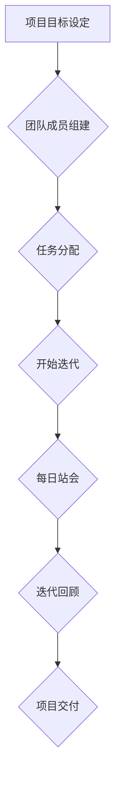
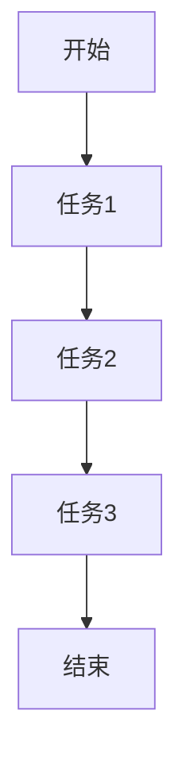
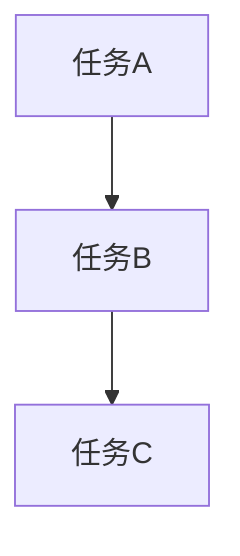

                 

# 如何进行团队合作：如何与团队成员有效合作？

## 关键词
团队合作、团队沟通、团队管理、沟通技巧、协作效率

## 摘要
本文旨在探讨团队合作的核心原则和方法，通过系统性的分析和实战案例，帮助IT领域的技术团队成员提升协作效率，实现项目成功。文章首先介绍了团队合作的重要性和挑战，接着详细阐述了团队沟通的基本原理、有效沟通的技巧，以及团队管理的策略。通过实际项目案例，我们深入分析了代码协作、任务分配和进度跟踪的方法。最后，文章总结了未来发展趋势和面临的挑战，并提供了丰富的学习资源和工具推荐，为读者提供了全方位的实践指导。

---

## 1. 背景介绍

### 1.1 目的和范围
本文的目标是探讨如何有效地进行团队合作，特别是在IT领域。通过提供具体的策略和案例，本文希望帮助团队成员克服沟通障碍，提高协作效率，从而实现项目目标。文章将涵盖团队合作的基础概念、沟通技巧、管理策略以及实际操作步骤。

### 1.2 预期读者
本文适合于IT行业的开发人员、项目经理、团队领导者以及所有对团队合作感兴趣的专业人士。无论您是新手还是经验丰富的专业人士，本文都将为您提供有价值的见解和实用的建议。

### 1.3 文档结构概述
本文分为十个主要部分，每个部分都有其独特的目标和内容：

1. **背景介绍**：介绍团队合作的背景、目的和范围。
2. **核心概念与联系**：介绍团队合作的核心概念，并使用Mermaid流程图展示。
3. **核心算法原理 & 具体操作步骤**：使用伪代码详细阐述团队协作的基本算法。
4. **数学模型和公式 & 详细讲解 & 举例说明**：通过数学公式和示例说明团队协作的关键原理。
5. **项目实战：代码实际案例和详细解释说明**：提供具体的代码实现和解读。
6. **实际应用场景**：讨论团队合作在不同场景中的应用。
7. **工具和资源推荐**：推荐学习资源和开发工具。
8. **总结：未来发展趋势与挑战**：总结团队合作的趋势和面临的挑战。
9. **附录：常见问题与解答**：提供常见问题的解答。
10. **扩展阅读 & 参考资料**：推荐进一步学习的资源。

### 1.4 术语表

#### 1.4.1 核心术语定义

- **团队合作**：指团队成员通过共同的目标和协调的努力，实现个人和团队目标的过程。
- **沟通**：信息在团队成员之间的传递和理解。
- **任务分配**：将项目任务合理分配给团队成员。
- **进度跟踪**：监控任务进度，确保项目按时完成。
- **代码协作**：多个开发者在同一项目中共同编写和维护代码。

#### 1.4.2 相关概念解释

- **敏捷开发**：一种以迭代和增量方式进行的软件开发方法，强调灵活性和快速响应变化。
- **Scrum**：一种敏捷开发框架，通过迭代和反思来不断改进项目。

#### 1.4.3 缩略词列表

- **IDE**：集成开发环境（Integrated Development Environment）
- **Git**：分布式版本控制系统（Git Hub）
- **JIRA**：项目管理工具（Atlassian JIRA）

---

## 2. 核心概念与联系

### 2.1 团队合作的概念

团队合作是指一群人在共同目标下，通过互相依赖、沟通协作，共同完成任务的过程。在IT领域，团队合作尤为重要，因为项目往往涉及多个技术领域，需要多样化的技能组合。

### 2.2 团队合作的优势

- **资源共享**：团队成员可以共享知识、资源和工具，提高工作效率。
- **创新能力**：多样化的思维和经验可以激发创新，解决复杂问题。
- **质量保障**：多人审核和测试可以减少错误，提高产品质量。
- **责任分担**：团队成员共同承担责任，减轻个人压力。

### 2.3 团队合作的挑战

- **沟通障碍**：不同背景和沟通风格的成员之间可能存在误解。
- **资源分配**：如何合理分配任务和资源，确保项目顺利进行。
- **目标一致**：确保所有团队成员对项目目标有共同的理解。
- **冲突解决**：团队成员之间可能存在分歧和冲突，需要有效的解决方法。

### 2.4 Mermaid 流程图

下面是一个简单的Mermaid流程图，展示团队合作的基本流程：



### 2.5 核心概念联系

团队合作涉及多个核心概念，包括沟通、任务分配、进度跟踪和代码协作。这些概念相互联系，共同构成了团队协作的框架。

- **沟通**是团队合作的基石，确保信息流畅传递，减少误解。
- **任务分配**确保团队成员有明确的职责和目标。
- **进度跟踪**帮助团队监控项目进展，及时调整策略。
- **代码协作**确保代码质量和项目的持续发展。

---

## 3. 核心算法原理 & 具体操作步骤

### 3.1 团队协作算法原理

团队合作算法的核心是确保信息的流畅传递和任务的合理分配。以下是团队合作的基本算法原理：

#### 3.1.1 伪代码

```python
function Team_Collaboration Algorithm(team_members, project_goals):
    1. Set up communication channels among team_members
    2. Define roles and responsibilities for each team_member
    3. Allocate tasks based on team_members' skills and availability
    4. Establish a schedule for task completion
    5. Implement a progress tracking system
    6. Hold daily stand-up meetings to discuss progress and address issues
    7. Conduct iterative reviews to refine processes and improve efficiency
    8. Deliver the project on time and within budget
```

### 3.2 具体操作步骤

#### 3.2.1 设立沟通渠道

- **工具选择**：选择合适的沟通工具，如Slack、Microsoft Teams或Zoom。
- **会议安排**：定期召开会议，如每日站会、每周例会等。
- **信息共享**：建立共享文件夹，方便团队成员访问和更新项目信息。

#### 3.2.2 定义角色和责任

- **角色分配**：根据团队成员的技能和经验，分配合适的角色，如项目经理、开发人员、测试人员等。
- **责任明确**：确保每个成员了解自己的职责和任务，避免职责重叠或空白。

#### 3.2.3 任务分配

- **技能匹配**：根据成员的技能和项目需求，合理分配任务。
- **优先级排序**：根据任务的紧急程度和重要性，制定优先级。
- **资源协调**：确保团队成员有足够的资源，如时间、工具和知识库。

#### 3.2.4 进度跟踪

- **工具选择**：选择合适的进度跟踪工具，如JIRA、Trello或Asana。
- **任务更新**：定期更新任务进度，确保项目按时完成。
- **问题反馈**：及时反馈问题，快速解决，确保项目顺利进行。

#### 3.2.5 站会

- **会议目的**：讨论当天的进展、遇到的问题和计划。
- **会议流程**：每个人简短汇报，不超过15分钟。
- **会议记录**：记录关键信息，便于后续跟进。

#### 3.2.6 迭代回顾

- **反思**：回顾过去一段时间的合作过程，识别优势和不足。
- **改进**：制定改进措施，提高团队合作效率。
- **文档记录**：将改进措施和反思结果记录下来，为后续迭代提供参考。

#### 3.2.7 项目交付

- **质量保证**：确保项目符合质量标准。
- **交付验收**：与客户或利益相关者进行交付验收。
- **总结反馈**：总结项目经验，为下一个项目提供参考。

---

## 4. 数学模型和公式 & 详细讲解 & 举例说明

### 4.1 数学模型

团队合作中的数学模型通常用于优化资源分配、任务调度和进度跟踪。以下是几个常用的数学模型：

#### 4.1.1 优化模型

```latex
\text{最大化效益} = \sum_{i=1}^{n} p_i \times a_i
```

其中，$p_i$ 表示第 $i$ 个任务的优先级，$a_i$ 表示第 $i$ 个任务的完成时间。

#### 4.1.2 网络模型



网络模型用于表示任务之间的依赖关系和执行顺序。

### 4.2 详细讲解

#### 4.2.1 优化模型

优化模型的目标是最大化团队的效益。在这个模型中，每个任务都有一个优先级和完成时间。通过优化模型，我们可以确定每个任务的执行顺序和分配，从而最大化整体效益。

#### 4.2.2 网络模型

网络模型用于表示任务之间的依赖关系。在IT项目中，任务往往有先后顺序，某些任务必须在其他任务完成后才能开始。网络模型可以帮助我们清晰地表示这些依赖关系，从而更好地规划项目进度。

### 4.3 举例说明

#### 4.3.1 优化模型举例

假设一个团队有三个任务，任务1的优先级为5，完成时间为3天；任务2的优先级为3，完成时间为2天；任务3的优先级为4，完成时间为4天。使用优化模型，我们可以计算出最佳执行顺序和完成时间。

- **执行顺序**：任务1 → 任务2 → 任务3
- **完成时间**：3 + 2 + 4 = 9天
- **最大效益**：5 \* 3 + 3 \* 2 + 4 \* 4 = 31

#### 4.3.2 网络模型举例

假设一个项目中，任务A必须在任务B完成后开始，任务B必须在任务C完成后开始。使用网络模型，我们可以表示这些依赖关系：



通过这个网络模型，我们可以清晰地了解任务的执行顺序和依赖关系。

---

## 5. 项目实战：代码实际案例和详细解释说明

### 5.1 开发环境搭建

在开始项目实战之前，我们需要搭建一个合适的技术环境。以下是一个简单的步骤：

1. **安装Git**：Git是一个强大的版本控制系统，用于代码管理和协作。
2. **选择IDE**：集成开发环境（IDE）可以帮助我们更高效地编写和调试代码。推荐使用如Visual Studio Code或IntelliJ IDEA。
3. **搭建代码仓库**：使用Git创建一个代码仓库，方便团队成员共同编辑和更新代码。
4. **安装必要库和框架**：根据项目需求，安装必要的库和框架，如Python的Django框架。

### 5.2 源代码详细实现和代码解读

以下是一个简单的Python代码案例，用于演示团队合作中的代码协作。

```python
# team_project.py

def calculate_sum(a, b):
    """
    计算两个数的和。
    
    :param a: 第一个数
    :param b: 第二个数
    :return: 两个数的和
    """
    return a + b

def calculate_product(a, b):
    """
    计算两个数的乘积。
    
    :param a: 第一个数
    :param b: 第二个数
    :return: 两个数的乘积
    """
    return a * b

if __name__ == "__main__":
    a = 5
    b = 10
    print(f"{a} + {b} = {calculate_sum(a, b)}")
    print(f"{a} * {b} = {calculate_product(a, b)}")
```

#### 5.2.1 代码解读

- **函数定义**：`calculate_sum`和`calculate_product`是两个简单的计算函数，分别用于计算两个数的和与乘积。
- **文档字符串**：每个函数都有详细的文档字符串，描述了函数的用途、参数和返回值。
- **主程序**：`if __name__ == "__main__":`确保当模块被导入时，不会执行主程序。这是Python的一个常用技巧。

### 5.3 代码解读与分析

#### 5.3.1 团队协作中的代码协作

在团队合作中，代码协作是至关重要的一环。以下是一些关键点：

- **代码规范**：确保代码符合团队约定的规范，如命名、注释和格式。
- **代码审查**：在提交代码前，进行代码审查，确保代码质量。
- **版本控制**：使用版本控制系统（如Git），管理代码的版本和历史。
- **协作编辑**：使用代码协作工具（如GitHub或GitLab），实现多人实时协作。

#### 5.3.2 代码实战案例分析

在这个案例中，我们演示了如何使用Python进行简单的数学计算。以下是一些分析：

- **模块化设计**：将计算功能封装为独立函数，便于复用和维护。
- **文档字符串**：详细的文档字符串有助于其他团队成员理解代码功能。
- **主程序**：确保代码在不同场景下的可执行性。

通过这个简单的案例，我们可以看到团队合作中的代码协作是如何进行的，以及如何确保代码质量和协作效率。

---

## 6. 实际应用场景

### 6.1 项目管理

在IT项目中，团队合作是确保项目成功的关键。以下是一些实际应用场景：

- **需求分析**：团队成员共同参与需求分析，确保对项目需求有共同的理解。
- **任务分配**：根据团队成员的技能和项目需求，合理分配任务。
- **进度跟踪**：使用项目管理工具（如JIRA或Trello），实时监控项目进度。
- **代码协作**：使用版本控制系统（如Git），实现代码的协作编辑和版本管理。

### 6.2 跨部门协作

跨部门协作是许多企业面临的挑战。以下是一些策略：

- **明确目标**：确保跨部门团队成员对项目目标有共同的理解。
- **沟通机制**：建立有效的沟通机制，如定期会议和邮件更新。
- **资源协调**：确保跨部门团队成员有足够的资源和支持。
- **问题解决**：建立问题解决流程，快速响应和解决跨部门协作中的问题。

### 6.3 远程团队协作

远程团队协作越来越普遍，以下是一些策略：

- **在线沟通**：使用在线沟通工具（如Zoom或Slack），实现实时沟通和协作。
- **任务管理**：使用在线任务管理工具（如Trello或JIRA），管理任务进度和协作。
- **虚拟团队会议**：定期召开虚拟团队会议，确保团队成员的沟通和协作。
- **灵活工作时间**：根据团队成员的时区和工作习惯，灵活安排工作时间。

---

## 7. 工具和资源推荐

### 7.1 学习资源推荐

#### 7.1.1 书籍推荐

- 《敏捷软件开发：原则、实践与模式》（《Agile Software Development: Principles, Patterns, and Practices》） - 作者：罗伯特·C·马丁（Robert C. Martin）
- 《Scrum精髓：实践中的Scrum指南》（《The Scrum Guide》） - 作者：杰夫·萨瑟兰（Jeff Sutherland）、布鲁斯·阿尔特（Bruce Arthur）和杰夫·安德森（Jeff Anderson）

#### 7.1.2 在线课程

- Coursera上的《敏捷和Scrum项目管理》课程
- Udemy上的《Git和GitHub：从基础到高级》课程

#### 7.1.3 技术博客和网站

- Medium上的《敏捷实践指南》系列文章
- Atlassian的Scrum资源页面（https://www.atlassian.com/agile）

### 7.2 开发工具框架推荐

#### 7.2.1 IDE和编辑器

- Visual Studio Code
- IntelliJ IDEA

#### 7.2.2 调试和性能分析工具

- Chrome DevTools
- Visual Studio Enterprise

#### 7.2.3 相关框架和库

- Django（Python Web框架）
- React（JavaScript库）

### 7.3 相关论文著作推荐

#### 7.3.1 经典论文

- 《敏捷软件开发宣言》（《Manifesto for Agile Software Development》） - 作者：杰夫·萨瑟兰（Jeff Sutherland）、肯·施瓦茨（Ken Schwaber）等
- 《分布式版本控制系统Git》（《Git Pro》） - 作者：斯科特·麦克雷（Scott Chacon）和本·库克（Ben Straub）

#### 7.3.2 最新研究成果

- 《敏捷实践指南：提高软件开发效率》（《Agile Practices Guide: Improving Software Development Efficiency》） - 作者：罗伯特·C·马丁（Robert C. Martin）
- 《Git工作流指南》（《Git Workflow Guide》） - 作者：史蒂文·沃斯特（Steve沃斯特）

#### 7.3.3 应用案例分析

- 《敏捷实践指南：一个大型金融项目的故事》（《Agile Practices Guide: A Story of a Large Financial Project》） - 作者：杰夫·萨瑟兰（Jeff Sutherland）

---

## 8. 总结：未来发展趋势与挑战

### 8.1 发展趋势

- **远程工作常态化**：随着技术的发展，远程工作将越来越普遍，团队协作将更加灵活。
- **自动化和人工智能**：自动化工具和人工智能将在团队协作中发挥更大作用，提高效率和准确性。
- **多元化团队**：多元化团队将带来更多的创新和思维碰撞，有助于解决复杂问题。

### 8.2 挑战

- **沟通障碍**：远程工作和多元化团队可能会增加沟通障碍，需要更有效的沟通策略。
- **资源分配**：如何合理分配有限资源，确保每个团队成员都能充分发挥其优势，是一个挑战。
- **持续学习**：技术发展迅速，团队成员需要不断学习和更新知识，以保持竞争力。

### 8.3 应对策略

- **建立有效的沟通机制**：使用在线沟通工具，定期召开会议，确保信息流畅传递。
- **采用敏捷开发方法**：通过迭代和增量方式，快速响应变化，提高团队适应能力。
- **持续学习和知识共享**：鼓励团队成员不断学习和分享知识，提高团队整体能力。

---

## 9. 附录：常见问题与解答

### 9.1 问题1：如何确保团队成员之间沟通顺畅？

**解答**：确保团队成员之间沟通顺畅的关键是建立有效的沟通机制。可以使用在线沟通工具（如Slack或Microsoft Teams）建立实时沟通渠道，定期召开会议（如每日站会、每周例会），确保信息及时传递和理解。

### 9.2 问题2：如何合理分配任务和资源？

**解答**：合理分配任务和资源的方法包括：

- **技能匹配**：根据团队成员的技能和经验，分配合适的任务。
- **优先级排序**：根据任务的紧急程度和重要性，制定优先级。
- **资源协调**：确保团队成员有足够的资源，如时间、工具和知识库。

### 9.3 问题3：如何处理团队成员之间的冲突？

**解答**：处理团队成员之间的冲突可以采取以下策略：

- **积极沟通**：鼓励团队成员积极沟通，表达自己的观点和需求。
- **中立调解**：如果冲突无法自行解决，可以寻求中立第三方（如项目经理或团队领导）进行调解。
- **制定解决方案**：通过讨论和协商，找到双方都能接受的解决方案。

---

## 10. 扩展阅读 & 参考资料

### 10.1 扩展阅读

- 《敏捷软件开发：原则、实践与模式》 - 作者：罗伯特·C·马丁（Robert C. Martin）
- 《Scrum精髓：实践中的Scrum指南》 - 作者：杰夫·萨瑟兰（Jeff Sutherland）、布鲁斯·阿尔特（Bruce Arthur）和杰夫·安德森（Jeff Anderson）

### 10.2 参考资料

- Atlassian的Scrum资源页面（https://www.atlassian.com/agile）
- Git官方文档（https://git-scm.com/docs）
- Medium上的《敏捷实践指南》系列文章

---

## 作者

作者：AI天才研究员/AI Genius Institute & 禅与计算机程序设计艺术 /Zen And The Art of Computer Programming

