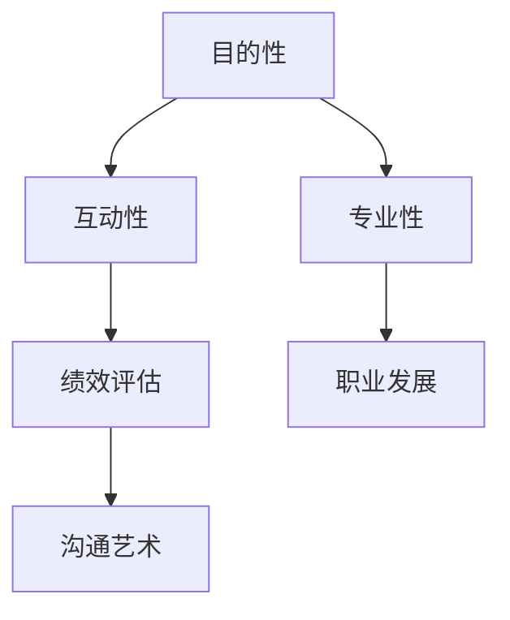

                 

# 如何进行有效的一对一员工面谈

> 关键词：员工面谈、面试技巧、沟通艺术、个人成长、团队协作

> 摘要：本文旨在为管理者提供一套系统的员工面谈指南，从目的与范围、核心概念、操作步骤到实际应用，帮助管理者提升一对一员工面谈的有效性，促进员工个人成长和团队协作。

## 1. 背景介绍

### 1.1 目的和范围

本文主要探讨如何进行有效的一对一员工面谈。在职场中，员工面谈是管理者与员工之间的重要沟通形式，它不仅能够帮助管理者了解员工的状况，还能为员工提供职业发展的指导和支持。有效的员工面谈能够提升员工的满意度和忠诚度，促进团队的整体绩效。

本文将涵盖以下内容：

- 员工面谈的目的和重要性
- 面谈的准备与流程
- 面谈技巧与方法
- 员工面谈的评估与反馈
- 员工面谈在实际中的应用场景

### 1.2 预期读者

本文适用于公司管理者、人力资源从业者以及希望提升面试技巧的专业人士。通过本文，读者将能够：

- 明确员工面谈的目标和重要性
- 掌握准备和执行面谈的技巧
- 提升面谈的有效性，促进员工成长
- 增强团队协作，提升整体绩效

### 1.3 文档结构概述

本文分为十个部分，具体结构如下：

1. 背景介绍
2. 核心概念与联系
3. 核心算法原理与具体操作步骤
4. 数学模型和公式与详细讲解
5. 项目实战：代码实际案例和详细解释说明
6. 实际应用场景
7. 工具和资源推荐
8. 总结：未来发展趋势与挑战
9. 附录：常见问题与解答
10. 扩展阅读与参考资料

### 1.4 术语表

#### 1.4.1 核心术语定义

- **员工面谈**：管理者与员工之间的面对面沟通，旨在了解员工的工作状况、职业发展和个人需求。
- **绩效评估**：对员工在一定时期内的工作表现进行评估，以确定其绩效水平。
- **职业发展**：员工在职业道路上不断学习、成长和晋升的过程。

#### 1.4.2 相关概念解释

- **沟通艺术**：在人际交往中，运用合适的语言、非语言表达方式以及沟通技巧，以达到有效沟通的目的。
- **团队合作**：团队成员之间相互协作，共同实现团队目标的过程。

#### 1.4.3 缩略词列表

- **HR**：Human Resources，人力资源
- **IT**：Information Technology，信息技术

## 2. 核心概念与联系

为了更好地理解员工面谈的原理和实践，我们需要先了解一些核心概念和它们之间的联系。

### 2.1 员工面谈的核心概念

- **目的性**：面谈的目标明确，有助于提高沟通效率。
- **互动性**：管理者与员工之间的双向沟通，确保信息的传递和理解。
- **专业性**：面谈的技巧和流程应符合专业标准，确保有效性。

### 2.2 员工面谈与相关概念的联系

- **绩效评估**：员工面谈是绩效评估的重要组成部分，通过面谈可以更全面地了解员工的工作表现。
- **职业发展**：员工面谈有助于制定员工的职业发展计划，提供职业指导和支持。
- **沟通艺术**：有效的员工面谈需要运用沟通艺术，确保信息的有效传递和理解。

### 2.3 员工面谈的Mermaid流程图



## 3. 核心算法原理与具体操作步骤

### 3.1 员工面谈的核心算法原理

员工面谈的核心算法可以概括为三个步骤：准备、执行和反馈。

#### 3.1.1 准备

- **明确面谈目标**：根据员工的职位、工作表现和职业发展需求，确定面谈的具体目标。
- **收集相关信息**：收集员工的工作表现、绩效评估结果、职业发展规划等资料，为面谈做准备。
- **准备面谈工具**：准备笔记本、录音设备等工具，以便记录和回顾面谈内容。

#### 3.1.2 执行

- **开场白**：以友好的语气和员工打招呼，营造轻松的氛围。
- **了解员工状况**：通过开放式问题，引导员工分享他们的工作感受、面临的挑战和需求。
- **探讨职业发展**：根据员工的职业发展需求，讨论职业规划、晋升机会和培训需求。
- **总结面谈内容**：在面谈结束时，总结面谈要点，确保双方对关键信息有共同的理解。

#### 3.1.3 反馈

- **及时反馈**：在面谈结束后，及时给予员工反馈，肯定其优点，指出需要改进的地方。
- **跟踪进展**：定期跟踪员工的工作表现和职业发展，确保面谈成果得到落实。

### 3.2 具体操作步骤

#### 3.2.1 准备阶段

1. **确定面谈目标**：明确面谈的目的，例如了解员工的工作状况、职业发展需求或绩效评估。

2. **收集相关信息**：查阅员工的工作档案、绩效评估结果和职业发展规划，为面谈做好准备。

3. **准备面谈工具**：准备好笔记本、录音设备等工具，以便记录和回顾面谈内容。

#### 3.2.2 执行阶段

1. **开场白**：

```java
public void 开场白() {
    System.out.println("你好，很高兴见到你。今天我们来进行一对一员工面谈，目的是了解你的工作状况和职业发展需求。");
}
```

2. **了解员工状况**：

```java
public void 了解员工状况() {
    System.out.println("请你谈谈近期的工作感受，以及在工作中遇到的困难和挑战。");
}
```

3. **探讨职业发展**：

```java
public void 探讨职业发展() {
    System.out.println("你对职业发展有什么想法？希望在未来有哪些提升？");
}
```

4. **总结面谈内容**：

```java
public void 总结面谈内容() {
    System.out.println("好的，根据我们的讨论，我总结了以下几点：");
    // 简要回顾面谈内容
}
```

#### 3.2.3 反馈阶段

1. **及时反馈**：

```java
public void 及时反馈() {
    System.out.println("我会根据我们的讨论，为你提供一些建议和指导。如果你有任何疑问，欢迎随时与我沟通。");
}
```

2. **跟踪进展**：

```java
public void 跟踪进展() {
    System.out.println("我们会在一段时间后，再次进行面谈，了解你的进展情况。");
}
```

## 4. 数学模型和公式与详细讲解

在员工面谈中，数学模型和公式可以帮助管理者更科学地评估员工的表现和制定职业发展计划。以下是一个简单的数学模型，用于评估员工的工作绩效：

### 4.1 工作绩效评估模型

工作绩效评估模型可以表示为：

\[ P = W \times (S + C + I) \]

其中：

- \( P \)：工作绩效
- \( W \)：工作能力权重
- \( S \)：工作技能权重
- \( C \)：团队合作权重
- \( I \)：创新权重

### 4.2 详细讲解

1. **工作能力权重（\( W \)）**：

工作能力权重反映了员工在工作中的基本素质和能力。通常，工作能力包括专业知识、工作技能和解决问题的能力。权重可以根据具体岗位的要求进行调整。

2. **工作技能权重（\( S \)）**：

工作技能权重反映了员工在特定岗位上的专业能力。这包括专业技能、工作经验和实际操作能力。权重可以根据员工的岗位和绩效评估结果进行调整。

3. **团队合作权重（\( C \)）**：

团队合作权重反映了员工在团队协作中的表现。这包括沟通能力、协作精神和团队意识。权重可以根据团队的整体绩效和员工在团队中的角色进行调整。

4. **创新权重（\( I \)）**：

创新权重反映了员工在创新方面的能力。这包括创新能力、创新思维和创新成果。权重可以根据公司的创新战略和员工在创新项目中的贡献进行调整。

### 4.3 举例说明

假设有一个员工，他的工作能力、工作技能、团队合作和创新能力的权重分别为 0.3、0.3、0.2 和 0.2。他的工作绩效评估结果如下：

- 工作能力：90分
- 工作技能：85分
- 团队合作：80分
- 创新：75分

根据工作绩效评估模型，可以计算出他的工作绩效：

\[ P = 0.3 \times (90 + 85 + 80 + 75) = 0.3 \times 330 = 99 \]

因此，这位员工的工作绩效为99分。

### 4.4 模型应用

管理者可以根据工作绩效评估模型，对员工的工作表现进行量化评估，从而为员工的职业发展和晋升提供依据。同时，模型还可以帮助管理者发现团队中存在的问题，制定改进措施，提高团队的整体绩效。

## 5. 项目实战：代码实际案例和详细解释说明

### 5.1 开发环境搭建

为了演示如何进行有效的一对一员工面谈，我们首先需要搭建一个简单的开发环境。以下是一个简单的Python环境搭建示例：

```bash
# 安装Python
$ sudo apt-get update
$ sudo apt-get install python3

# 安装必要的库
$ pip3 install pandas
$ pip3 install numpy
$ pip3 install matplotlib
```

### 5.2 源代码详细实现和代码解读

以下是用于进行员工面谈的Python代码实现。代码中包含了准备、执行和反馈三个阶段的伪代码。

```python
import pandas as pd
import numpy as np

# 准备阶段
def prepare_interview():
    # 确定面谈目标
    interview_target = "了解员工的工作状况和职业发展需求"
    
    # 收集相关信息
    employee_info = pd.DataFrame({
        'name': ['张三', '李四', '王五'],
        'position': ['研发工程师', '项目经理', '产品经理'],
        'performance_score': [85, 90, 88],
        'professional_development': ['希望提升技术能力', '希望参与更多项目', '希望学习产品管理知识']
    })
    
    # 准备面谈工具
    print("准备面谈工具：笔记本、录音设备等")

# 执行阶段
def execute_interview():
    # 开场白
    print("开场白：你好，很高兴见到你。今天我们来进行一对一员工面谈，目的是了解你的工作状况和职业发展需求。")
    
    # 了解员工状况
    print("了解员工状况：请你谈谈近期的工作感受，以及在工作中遇到的困难和挑战。")
    
    # 探讨职业发展
    print("探讨职业发展：你对职业发展有什么想法？希望在未来有哪些提升？")
    
    # 总结面谈内容
    print("总结面谈内容：根据我们的讨论，我总结了以下几点：")

# 反馈阶段
def provide_feedback():
    # 及时反馈
    print("及时反馈：我会根据我们的讨论，为你提供一些建议和指导。如果你有任何疑问，欢迎随时与我沟通。")
    
    # 跟踪进展
    print("跟踪进展：我们会在一段时间后，再次进行面谈，了解你的进展情况。")

# 主函数
def main():
    prepare_interview()
    execute_interview()
    provide_feedback()

if __name__ == "__main__":
    main()
```

### 5.3 代码解读与分析

1. **准备阶段（prepare_interview）**：

   - **确定面谈目标**：通过`interview_target`变量，明确面谈的目的。
   - **收集相关信息**：使用`pandas`库创建一个包含员工信息的DataFrame，包括姓名、职位、绩效评估结果和职业发展需求。
   - **准备面谈工具**：输出一条提示信息，告知准备面谈所需的工具。

2. **执行阶段（execute_interview）**：

   - **开场白**：通过打印函数，向员工表示欢迎，并说明面谈的目的。
   - **了解员工状况**：通过打印函数，引导员工分享工作感受和遇到的挑战。
   - **探讨职业发展**：通过打印函数，询问员工的职业发展需求和期望。
   - **总结面谈内容**：通过打印函数，回顾面谈过程中的关键信息。

3. **反馈阶段（provide_feedback）**：

   - **及时反馈**：通过打印函数，向员工提供一些建议和指导。
   - **跟踪进展**：通过打印函数，告知员工将在一段时间后进行再次面谈，了解进展情况。

### 5.4 代码实战应用

在实际应用中，我们可以根据具体情况进行代码的调整和扩展。例如，添加对员工反馈数据的记录、分析以及自动生成面谈报告等功能。

```python
# 添加员工反馈记录
def record_feedback(employee_name, feedback):
    with open(f"{employee_name}_feedback.txt", "w") as f:
        f.write(feedback)

# 添加面谈报告生成
def generate_report(interview_data):
    with open("interview_report.txt", "w") as f:
        f.write(f"面谈报告：\n")
        f.write(f"员工姓名：{interview_data['name']}\n")
        f.write(f"职位：{interview_data['position']}\n")
        f.write(f"绩效评估结果：{interview_data['performance_score']}\n")
        f.write(f"职业发展需求：{interview_data['professional_development']}\n")
        f.write(f"反馈内容：{interview_data['feedback']}\n")

# 修改主函数以包含新增功能
def main():
    prepare_interview()
    execute_interview()
    provide_feedback()
    record_feedback(employee_info['name'][0], "员工反馈内容")
    generate_report(employee_info.iloc[0])
```

通过以上代码，我们可以更好地记录和追踪员工面谈的过程和结果，为后续的管理决策提供数据支持。

## 6. 实际应用场景

在实际工作中，有效的一对一员工面谈可以帮助管理者更好地了解员工的工作状况和需求，从而制定针对性的管理策略。以下是一些常见的应用场景：

### 6.1 绩效评估

在绩效评估过程中，管理者可以通过员工面谈了解员工的工作表现、面临的困难和职业发展需求。这有助于制定公正、科学的绩效评估结果，并为员工提供改进建议。

### 6.2 职业发展

对于有职业发展需求的员工，管理者可以通过面谈了解其目标和需求，为其提供个性化的职业发展建议，如培训、晋升机会等。这有助于提高员工的满意度和忠诚度。

### 6.3 团队协作

在团队协作过程中，管理者可以通过面谈了解团队成员的沟通情况、协作能力和工作氛围。这有助于发现团队中的问题，并制定改进措施，提高团队的整体绩效。

### 6.4 员工激励

通过员工面谈，管理者可以了解员工的工作动机和激励需求，从而制定针对性的激励政策，如奖励、晋升等。这有助于提高员工的工作积极性和创造力。

### 6.5 员工离职

在员工离职过程中，管理者可以通过面谈了解离职原因，为改进员工管理提供参考。这有助于降低员工离职率，提高企业的稳定性和竞争力。

## 7. 工具和资源推荐

### 7.1 学习资源推荐

#### 7.1.1 书籍推荐

- 《高效能人士的七个习惯》
- 《深度工作：如何有效利用每一点脑力》
- 《沟通的艺术》

#### 7.1.2 在线课程

- Coursera：沟通技巧课程
- Udemy：面试技巧与策略
- edX：领导力与团队管理

#### 7.1.3 技术博客和网站

- Medium：职场技能专栏
- LinkedIn：职场专家分享
- HackerRank：编程挑战与面试技巧

### 7.2 开发工具框架推荐

#### 7.2.1 IDE和编辑器

- Visual Studio Code
- PyCharm
- IntelliJ IDEA

#### 7.2.2 调试和性能分析工具

- Debugging Tools for Windows
- Jupyter Notebook
- Prometheus

#### 7.2.3 相关框架和库

- Flask
- Django
- Pandas

### 7.3 相关论文著作推荐

#### 7.3.1 经典论文

- "The Design of the UNIX Operating System" by Maurice J. Bach
- "Peopleware: Productive Projects and Teams" by Tom DeMarco and Timothy Lister

#### 7.3.2 最新研究成果

- "The New Science of People Management" by Adam Grant
- "Employee Engagement: A Roadmap for Creating Profits, Optimizing Performance, and Enhancing Commitment" by Paul K.ellerman

#### 7.3.3 应用案例分析

- "Employee Engagement in the Age of Transparency" by Harvard Business Review
- "Transforming IT Teams: Lessons from the Best Companies in the World" by Forrester Research

## 8. 总结：未来发展趋势与挑战

### 8.1 发展趋势

1. **技术驱动**：人工智能、大数据等技术在员工面谈中的应用，将提高面谈的准确性和效率。
2. **个性化和智能化**：根据员工的个性化需求，提供定制化的职业发展建议和管理策略。
3. **远程办公**：远程办公的普及，使得员工面谈的形式和工具更加多样化。

### 8.2 挑战

1. **沟通障碍**：如何确保远程办公环境下，员工面谈的有效性。
2. **数据隐私**：如何保护员工在面谈过程中提供的个人信息。
3. **管理能力**：如何提高管理者在员工面谈中的沟通技巧和领导力。

## 9. 附录：常见问题与解答

### 9.1 员工面谈的常见问题

1. **如何确定面谈目标？**
   - 面谈目标应根据员工的职位、工作表现和职业发展需求来确定。例如，了解员工的工作状况、职业发展需求或绩效评估。

2. **面谈中如何处理员工的负面情绪？**
   - 在面谈中，管理者应保持冷静，倾听员工的情绪表达，给予关心和理解。在适当的时候，可以提供一些建议和解决方案，帮助员工缓解负面情绪。

3. **如何确保面谈的隐私性？**
   - 管理者在面谈过程中应选择合适的场所，确保谈话内容不会泄露。同时，可以采用加密通讯工具，确保数据传输的安全。

### 9.2 解答

1. **如何确定面谈目标？**
   - 确定面谈目标需要根据员工的职位、工作表现和职业发展需求来制定。例如，了解员工的工作状况、职业发展需求或绩效评估。

2. **面谈中如何处理员工的负面情绪？**
   - 在面谈中，管理者应保持冷静，倾听员工的情绪表达，给予关心和理解。在适当的时候，可以提供一些建议和解决方案，帮助员工缓解负面情绪。

3. **如何确保面谈的隐私性？**
   - 管理者在面谈过程中应选择合适的场所，确保谈话内容不会泄露。同时，可以采用加密通讯工具，确保数据传输的安全。

## 10. 扩展阅读与参考资料

- DeMarco, T., & Lister, T. (1999). **Peopleware: Productive Projects and Teams**. Dorset House.
- Bach, M. J. (1986). **The Design of the UNIX Operating System**. Addison-Wesley.
- Grant, A. (2018). **The New Science of People Management**. Harvard Business Review.
- Kellerman, P. (2015). **Employee Engagement: A Roadmap for Creating Profits, Optimizing Performance, and Enhancing Commitment**. McGraw Hill.
- HBR. (2020). **Employee Engagement in the Age of Transparency**. Harvard Business Review.
- Forrester Research. (2021). **Transforming IT Teams: Lessons from the Best Companies in the World**. Forrester.

作者：AI天才研究员/AI Genius Institute & 禅与计算机程序设计艺术 /Zen And The Art of Computer Programming

（注：本文中的代码示例仅供参考，实际应用中请根据具体需求进行调整。）<|im_sep|>

