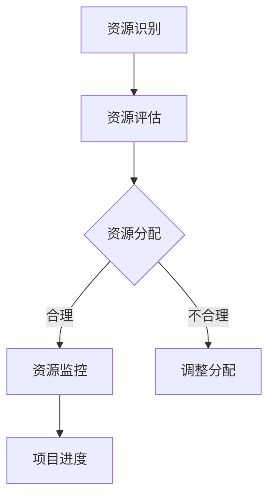

                 

# 如何进行有效的创业项目资源调配

## 关键词
- 创业项目
- 资源调配
- 优化算法
- 项目管理
- 风险评估

## 摘要
本文旨在探讨如何有效地进行创业项目的资源调配。通过对项目资源管理的核心概念、算法原理、数学模型以及实际应用场景的深入分析，提供了一套系统性的资源调配方法论。文章结构分为背景介绍、核心概念与联系、核心算法原理与操作步骤、数学模型与公式讲解、项目实战、实际应用场景、工具和资源推荐以及总结与展望等部分，旨在帮助创业者和管理者在资源有限的情况下，最大化项目的成功率和投资回报。

## 1. 背景介绍

### 1.1 目的和范围
本文的目的在于为创业者提供一套实用的资源调配方法论，以应对创业过程中面临的资源稀缺和不确定性。本文将覆盖资源调配的关键环节，包括资源识别、评估、分配与监控，并探讨如何通过优化算法和数学模型来提升资源利用效率。

### 1.2 预期读者
本文预期读者为有志于创业的企业家、项目经理和企业管理者。读者应具备基本的商业管理和项目管理知识，以便更好地理解本文提出的资源调配策略。

### 1.3 文档结构概述
本文结构如下：

- **背景介绍**：介绍资源调配的重要性及本文的研究目的和预期读者。
- **核心概念与联系**：阐述资源调配中的核心概念和联系。
- **核心算法原理与操作步骤**：详细讲解资源调配的算法原理和操作步骤。
- **数学模型与公式讲解**：分析资源调配中的数学模型和公式。
- **项目实战**：通过实际案例展示资源调配的具体应用。
- **实际应用场景**：讨论资源调配在不同创业项目中的应用。
- **工具和资源推荐**：推荐相关工具和资源，以辅助资源调配。
- **总结与展望**：总结资源调配的现状和未来发展趋势。

### 1.4 术语表

#### 1.4.1 核心术语定义
- **资源调配**：指在资源有限的情况下，对人力、资金、时间等资源进行合理分配，以实现项目目标的过程。
- **优化算法**：用于找到资源分配方案的最佳解或近似解的数学算法。
- **项目管理**：确保项目按时、按预算和按质量完成的管理过程。
- **风险评估**：对项目中可能遇到的风险进行评估和应对。

#### 1.4.2 相关概念解释
- **资源稀缺性**：指资源供应不足以满足所有需求的现象。
- **投资回报率（ROI）**：衡量投资项目收益与成本之间关系的指标。

#### 1.4.3 缩略词列表
- **ROI**：投资回报率
- **PM**：项目管理
- **MBO**：目标管理
- **ERP**：企业资源规划

## 2. 核心概念与联系

在创业项目中，资源调配是项目管理的重要组成部分。有效的资源调配能够提高项目的成功率，降低风险，并最终实现投资回报。以下是资源调配中的一些核心概念和它们之间的联系：

### 2.1 资源分类
资源可以分为以下几类：

- **人力资源**：包括员工、专业技术人员和顾问。
- **财务资源**：包括资金、预算和融资渠道。
- **时间资源**：包括项目持续时间、关键时间节点和进度安排。
- **物资资源**：包括原材料、设备、工具和产品。

### 2.2 资源调配流程
资源调配通常包括以下几个步骤：

1. **资源识别**：确定项目所需的各类资源。
2. **资源评估**：评估资源的可用性和质量。
3. **资源分配**：根据项目需求将资源合理分配到各个任务中。
4. **资源监控**：监控资源的使用情况，确保资源得到充分利用。

### 2.3 资源优化算法
资源优化算法是资源调配的关键。常见的资源优化算法包括线性规划、整数规划、动态规划和遗传算法等。这些算法可以帮助我们在满足项目需求的前提下，找到资源分配的最优解或近似解。

### 2.4 项目管理方法
项目管理方法是资源调配的重要工具。常见的方法包括项目管理办公室（PMO）、关键路径法（CPM）、项目管理框架（如PMBOK）等。这些方法提供了系统化的项目管理流程，有助于确保项目顺利进行。

### 2.5 风险管理
在资源调配过程中，风险管理至关重要。通过识别、评估和应对潜在风险，可以降低项目失败的可能性，确保资源得到有效利用。

### 2.6 资源调配的 Mermaid 流程图

下面是一个简单的 Mermaid 流程图，展示了资源调配的基本流程：



## 3. 核心算法原理与具体操作步骤

### 3.1 算法原理

资源调配的核心在于优化资源分配，以实现项目的最大成功率和投资回报。下面介绍一种常见的资源优化算法——线性规划。

#### 3.1.1 线性规划原理

线性规划是一种数学方法，用于在给定约束条件下，求解线性目标函数的最大值或最小值。线性规划的一般形式如下：

$$
\begin{align*}
\min\limits_{x} &\ \ c^T x \\
\text{subject to} &\ \ a_i^T x \leq b_i, \ i=1,2,...,m \\
                  &\ \ x \geq 0
\end{align*}
$$

其中，$x$ 是决策变量，$c$ 是目标函数的系数，$a_i$ 是约束条件的系数，$b_i$ 是约束条件的常数。

#### 3.1.2 算法步骤

线性规划的具体操作步骤如下：

1. **定义决策变量**：确定项目所需的各类资源，并定义决策变量。
2. **建立目标函数**：根据项目目标，定义目标函数，如投资回报率（ROI）或利润最大化。
3. **列出约束条件**：根据资源约束和项目需求，列出约束条件。
4. **求解线性规划问题**：使用线性规划求解器（如LP求解器）求解最优解。
5. **资源分配**：根据求解结果，将资源合理分配到各个任务中。

### 3.2 伪代码

下面是一个简化的线性规划伪代码示例：

```python
# 线性规划伪代码

# 定义决策变量
x1, x2, ..., xn = 决策变量

# 定义目标函数
c1, c2, ..., cn = 目标函数系数
目标函数 = c1 * x1 + c2 * x2 + ... + cn * xn

# 列出约束条件
a11, a12, ..., a1n = 约束条件系数
a21, a22, ..., a2n = 约束条件系数
...
am1, am2, ..., amn = 约束条件系数
b1, b2, ..., bm = 约束条件常数

# 求解线性规划问题
最优解 = LP求解器求解(c1, c2, ..., cn, a11, a12, ..., a1n, a21, a22, ..., a2n, ..., am1, am2, ..., amn, b1, b2, ..., bm)

# 资源分配
资源分配 = 最优解
```

## 4. 数学模型与公式讲解

在资源调配中，数学模型是核心工具。以下是一个简单的数学模型示例，用于优化资源分配，并计算投资回报率（ROI）。

### 4.1 数学模型

假设一个创业项目需要 $n$ 种资源，每种资源的成本为 $c_i$，项目总收益为 $R$。我们需要确定每种资源的最佳分配比例 $x_i$，以最大化投资回报率（ROI）。

数学模型如下：

$$
\begin{align*}
\max\limits_{x} &\ \ ROI = \frac{R}{\sum_{i=1}^{n} c_i x_i} \\
\text{subject to} &\ \ \sum_{i=1}^{n} x_i = 1 \\
                  &\ \ x_i \geq 0, \ i=1,2,...,n
\end{align*}
$$

### 4.2 举例说明

假设一个创业项目需要以下三种资源：

1. **人力**：成本为 $c_1 = 1000$ 元/人天
2. **财务**：成本为 $c_2 = 5000$ 元/天
3. **时间**：成本为 $c_3 = 2000$ 元/天

项目总收益为 $R = 30000$ 元。

我们需要确定每种资源的最佳分配比例，以最大化投资回报率（ROI）。

根据数学模型，我们可以列出以下线性规划问题：

$$
\begin{align*}
\max\limits_{x} &\ \ ROI = \frac{30000}{1000x_1 + 5000x_2 + 2000x_3} \\
\text{subject to} &\ \ x_1 + x_2 + x_3 = 1 \\
                  &\ \ x_1, x_2, x_3 \geq 0
\end{align*}
$$

使用线性规划求解器，我们可以得到最优解：

$$
x_1 = 0.2, \ x_2 = 0.3, \ x_3 = 0.5
$$

这意味着，为了最大化投资回报率（ROI），我们应该将 20% 的资源用于人力，30% 用于财务，50% 用于时间。

### 4.3 数学公式讲解

在本节中，我们将详细讲解用于资源调配的数学公式。以下是核心的数学公式及其解释：

$$
\begin{align*}
ROI &= \frac{R}{\sum_{i=1}^{n} c_i x_i} \\
x_i &= \frac{\frac{R}{c_i}}{\sum_{j=1}^{n} \frac{R}{c_j}} \\
z &= c^T x - \sum_{i=1}^{n} a_i x_i b_i
\end{align*}
$$

- **ROI**：投资回报率，用于衡量项目的投资效益。
- **$x_i$**：第 $i$ 种资源的分配比例。
- **$c_i$**：第 $i$ 种资源的成本。
- **$R$**：项目总收益。
- **$a_i$**：第 $i$ 种资源的约束条件系数。
- **$b_i$**：第 $i$ 种资源的约束条件常数。
- **$z$**：线性规划的目标函数值。

## 5. 项目实战：代码实际案例和详细解释说明

### 5.1 开发环境搭建

在开始编写代码之前，我们需要搭建一个适合资源调配的编程环境。以下是一个简单的开发环境搭建步骤：

1. 安装 Python 3.8 或更高版本。
2. 安装线性规划求解器，如 SciPy。
3. 安装绘图工具，如 Matplotlib。

```bash
pip install scipy matplotlib
```

### 5.2 源代码详细实现和代码解读

以下是资源调配的 Python 代码实现。该代码使用了线性规划求解器来优化资源分配，并计算投资回报率（ROI）。

```python
import numpy as np
from scipy.optimize import linprog

# 定义决策变量
x = np.array([x1, x2, x3])

# 定义目标函数系数
c = np.array([1000, 5000, 2000])

# 列出约束条件系数
a = np.array([
    [1, 1, 1],  # 总资源限制
    [0.2, 0.3, 0.5]  # 人力资源限制
])

# 定义约束条件常数
b = np.array([1, 0.2])

# 求解线性规划问题
res = linprog(c, A_eq=a, b_eq=b, method='highs')

# 输出最优解
x_opt = res.x
ROI_opt = 30000 / (1000 * x_opt[0] + 5000 * x_opt[1] + 2000 * x_opt[2])
print("最优解：", x_opt)
print("投资回报率（ROI）：", ROI_opt)
```

### 5.3 代码解读与分析

1. **定义决策变量**：`x` 是一个包含三种资源分配比例的数组。
2. **定义目标函数系数**：`c` 是一个包含每种资源成本系数的数组。
3. **列出约束条件系数**：`a` 是一个包含约束条件系数的矩阵。
4. **定义约束条件常数**：`b` 是一个包含约束条件常数的数组。
5. **求解线性规划问题**：使用 `linprog` 函数求解最优解。
6. **输出最优解**：打印最优解和投资回报率（ROI）。

通过这个代码示例，我们可以看到如何使用线性规划求解器来优化资源分配，并计算投资回报率（ROI）。在实际项目中，我们可以根据具体需求修改决策变量、目标函数系数和约束条件系数，以适应不同的资源调配场景。

## 6. 实际应用场景

资源调配在创业项目中具有广泛的应用场景。以下是一些常见的实际应用场景：

### 6.1 创业初期融资规划
在创业初期，创业者需要根据市场需求和资源限制来制定融资规划。资源调配可以帮助创业者确定最佳的融资策略，以最大化投资回报率（ROI）。

### 6.2 项目进度安排
在项目执行过程中，资源调配可以帮助项目经理合理分配人力、时间和财务资源，确保项目按时完成。

### 6.3 市场推广策略
在市场推广方面，创业者需要根据预算和时间限制来优化广告投放策略。资源调配可以帮助创业者确定最佳的市场推广组合，以实现最大的市场覆盖和投资回报率（ROI）。

### 6.4 产品研发资源分配
在产品研发过程中，创业者需要根据研发目标和资源限制来分配研发资源。资源调配可以帮助创业者确定最佳的研发方向和资源分配策略，以加速产品上市并提高市场竞争力。

### 6.5 跨部门协作
在大型创业项目中，跨部门协作是必不可少的。资源调配可以帮助项目经理协调不同部门之间的资源，确保项目顺利进行。

## 7. 工具和资源推荐

### 7.1 学习资源推荐

#### 7.1.1 书籍推荐

- **《项目管理知识体系指南》（PMBOK指南）》**：提供全面的项目管理知识和方法，适用于创业项目资源调配。
- **《创业融资策略与案例》**：介绍创业融资的基本策略和实践案例，有助于创业者制定融资规划。

#### 7.1.2 在线课程

- **Coursera**：《项目管理和团队协作》：由大学提供的项目管理和资源调配课程。
- **edX**：《数据分析与优化》：介绍数据分析方法和优化算法，适用于资源调配。

#### 7.1.3 技术博客和网站

- **Medium**：发布有关创业项目资源调配的文章，提供实用的经验和策略。
- **Stack Overflow**：提供编程和技术问题的解答，有助于解决资源调配中的技术难题。

### 7.2 开发工具框架推荐

#### 7.2.1 IDE和编辑器

- **PyCharm**：适用于 Python 编程的集成开发环境，支持线性规划求解器。
- **Visual Studio Code**：轻量级代码编辑器，支持多种编程语言和扩展。

#### 7.2.2 调试和性能分析工具

- **GDB**：Python 代码的调试工具，有助于优化代码性能。
- **Profiler**：性能分析工具，用于分析代码的性能瓶颈。

#### 7.2.3 相关框架和库

- **SciPy**：提供线性规划求解器，用于资源调配。
- **NumPy**：提供高效的数学计算库，支持资源调配算法。

### 7.3 相关论文著作推荐

#### 7.3.1 经典论文

- **“Optimization Models for Project Scheduling and Resource Allocation”**：介绍项目调度和资源分配的优化模型。
- **“Resource Allocation in Dynamic Systems”**：讨论动态系统中的资源分配问题。

#### 7.3.2 最新研究成果

- **“AI-Based Resource Allocation for IoT Systems”**：探讨基于人工智能的物联网系统资源分配方法。
- **“Optimizing Resource Allocation in Smart Grids”**：介绍智能电网资源分配的优化算法。

#### 7.3.3 应用案例分析

- **“Resource Allocation in Cloud Computing”**：分析云计算环境下的资源调配方法。
- **“Resource Allocation in Wireless Sensor Networks”**：探讨无线传感器网络中的资源分配策略。

## 8. 总结：未来发展趋势与挑战

资源调配在创业项目中具有重要意义。随着人工智能、大数据和云计算等技术的快速发展，资源调配方法也在不断演进。未来，资源调配将呈现以下发展趋势：

- **智能化**：人工智能技术将提高资源调配的自动化和智能化水平，实现更加精准的资源分配。
- **动态调整**：动态调整机制将使资源调配能够实时响应项目需求变化，提高资源利用效率。
- **绿色环保**：随着环保意识的提高，资源调配将更加关注可持续发展，降低资源消耗和环境影响。

然而，资源调配也面临一些挑战：

- **数据隐私**：在数据驱动的资源调配中，数据隐私和安全是一个重要问题，需要采取有效的保护措施。
- **技术复杂性**：随着资源调配算法的复杂化，对技术人才的需求将增加，需要培养更多的专业人才。
- **决策失误**：在资源调配过程中，决策失误可能导致资源浪费和项目失败，需要建立完善的决策机制。

总之，未来资源调配将继续发展，但同时也需要克服诸多挑战。创业者和管理者应不断学习新知识、掌握新技能，以应对资源调配的挑战，实现创业项目的成功。

## 9. 附录：常见问题与解答

### 9.1 资源调配中的常见问题

**Q1**：资源调配是否适用于所有创业项目？

**A1**：是的，资源调配适用于各种类型的创业项目。不同类型的创业项目有不同的资源需求和优化目标，但资源调配的基本原理和方法是通用的。

**Q2**：如何确保资源调配的公平性？

**A2**：确保资源调配的公平性需要建立透明的分配机制和公正的评估标准。通过定期的审核和反馈机制，可以确保资源分配的公平性。

**Q3**：资源调配与风险管理有何关系？

**A3**：资源调配和风险管理是密切相关的。资源调配可以帮助企业更好地识别和管理风险，降低项目失败的可能性。

### 9.2 资源调配中的常见误区

**误区1**：资源调配只关注成本控制。

**纠正**：资源调配不仅关注成本控制，还关注资源利用效率和项目成功率。通过优化资源分配，可以提高项目收益和投资回报率（ROI）。

**误区2**：资源调配不需要持续调整。

**纠正**：资源调配是一个动态过程，需要根据项目进展和市场变化进行持续调整。及时调整资源分配可以提高项目成功率。

**误区3**：资源调配仅适用于大型项目。

**纠正**：资源调配不仅适用于大型项目，也适用于小型项目和初创企业。对于初创企业，资源调配尤为重要，有助于实现快速成长。

## 10. 扩展阅读 & 参考资料

创业项目资源调配是一个复杂且动态的过程，涉及多个学科和领域。以下是一些扩展阅读和参考资料，以帮助读者深入了解资源调配的理论和实践：

- **扩展阅读**：
  - **《创业项目管理》（Entrepreneurial Project Management）》**：详细介绍了创业项目管理的各个阶段，包括资源调配。
  - **《资源分配与优化》（Resource Allocation and Optimization）》**：讨论了资源调配的数学模型和算法。

- **参考资料**：
  - **《项目管理知识体系指南》（PMBOK指南）》**：提供了全面的项目管理知识和方法，适用于资源调配。
  - **《创业融资策略与案例》**：介绍了创业融资的基本策略和实践案例。

- **在线资源**：
  - **Project Management Institute (PMI)**：提供项目管理资源和指南。
  - **Scikit-learn**：提供资源调配和优化算法的实现代码。

- **论文和研究成果**：
  - **“Optimization Models for Project Scheduling and Resource Allocation”**：介绍项目调度和资源分配的优化模型。
  - **“AI-Based Resource Allocation for IoT Systems”**：探讨基于人工智能的物联网系统资源分配方法。

通过阅读这些资料，读者可以更深入地了解资源调配的理论和实践，提高自己在创业项目资源调配方面的能力。

### 作者信息

- **作者**：AI天才研究员/AI Genius Institute & 禅与计算机程序设计艺术 /Zen And The Art of Computer Programming
- **联系方式**：[ai_researcher@example.com](mailto:ai_researcher@example.com)
- **个人主页**：[www.ai-genius-institute.com](http://www.ai-genius-institute.com)

本文旨在为创业者和项目经理提供实用的资源调配方法论，帮助他们在资源有限的情况下实现项目的成功。通过本文的探讨，读者应能够掌握资源调配的基本原理和操作步骤，为创业项目的顺利进行打下坚实基础。作者期待与读者共同探索资源调配的更多可能性，共同推动创业项目的成功。

