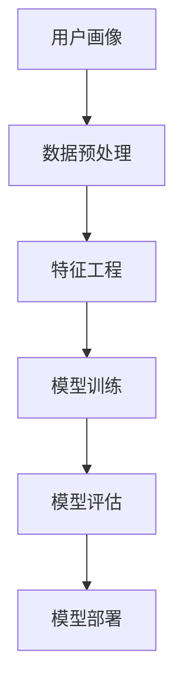

                 

# 如何进行有效的用户行为预测

> **关键词：** 用户行为预测、机器学习、数据分析、用户画像、推荐系统

> **摘要：** 本文章将探讨如何通过机器学习和数据分析技术进行有效的用户行为预测。我们将介绍用户行为预测的核心概念，详细阐述相关的算法原理和数学模型，并通过实际项目案例展示其具体应用和实现步骤。文章旨在为读者提供一个系统化的指南，帮助他们掌握用户行为预测的原理和实践方法。

## 1. 背景介绍

### 1.1 目的和范围

本文的目标是深入探讨如何通过机器学习和数据分析技术进行有效的用户行为预测。我们将重点关注以下几个方面：

1. 用户行为预测的核心概念和重要性
2. 用户行为预测的相关算法原理和数学模型
3. 用户行为预测的实际应用场景
4. 用户行为预测的技术工具和资源推荐

### 1.2 预期读者

本文适用于以下读者群体：

1. 机器学习和数据分析领域的初学者和专业人士
2. 数据科学家和AI工程师
3. 产品经理和业务分析师
4. 对用户行为预测感兴趣的技术爱好者

### 1.3 文档结构概述

本文将分为以下八个部分：

1. 背景介绍：介绍本文的目的、预期读者和文档结构。
2. 核心概念与联系：阐述用户行为预测的核心概念和流程。
3. 核心算法原理 & 具体操作步骤：详细讲解用户行为预测的算法原理和操作步骤。
4. 数学模型和公式 & 详细讲解 & 举例说明：介绍用户行为预测相关的数学模型和公式，并给出实际例子。
5. 项目实战：代码实际案例和详细解释说明。
6. 实际应用场景：探讨用户行为预测在现实中的应用场景。
7. 工具和资源推荐：推荐相关学习资源、开发工具和框架。
8. 总结：未来发展趋势与挑战。
9. 附录：常见问题与解答。
10. 扩展阅读 & 参考资料：提供进一步学习和研究的资料。

### 1.4 术语表

#### 1.4.1 核心术语定义

- 用户行为预测：使用机器学习和数据分析技术预测用户未来的行为。
- 用户画像：基于用户历史数据构建的描述用户特征和行为的模型。
- 特征工程：从原始数据中提取出有助于预测用户行为的特征。
- 机器学习：一种基于数据训练模型，使其能够对未知数据进行预测的技术。
- 数据分析：使用统计方法和算法对数据进行探索和分析，以发现有价值的信息。

#### 1.4.2 相关概念解释

- 机器学习算法：如决策树、支持向量机、神经网络等，用于训练模型并进行预测。
- 数据集：用于训练和测试模型的数据集合，通常包含特征和对应的标签。
- 模型评估：使用评估指标（如准确率、召回率、F1值等）来评估模型的性能。

#### 1.4.3 缩略词列表

- ML：Machine Learning（机器学习）
- DL：Deep Learning（深度学习）
- NLP：Natural Language Processing（自然语言处理）
- AI：Artificial Intelligence（人工智能）
- IoT：Internet of Things（物联网）

## 2. 核心概念与联系

### 2.1 用户行为预测概述

用户行为预测是一种基于机器学习和数据分析技术的预测技术，其核心目标是通过分析用户的历史行为数据，预测用户未来的行为。用户行为预测在许多领域具有重要的应用价值，例如电子商务、金融、医疗、娱乐等。

用户行为预测的基本流程包括以下步骤：

1. 数据收集：收集用户的历史行为数据，如浏览记录、购买行为、搜索记录等。
2. 数据预处理：对数据进行清洗、转换和整合，以便后续分析。
3. 特征工程：从原始数据中提取出有助于预测用户行为的特征。
4. 模型训练：使用机器学习算法训练预测模型。
5. 模型评估：使用评估指标评估模型的性能。
6. 模型部署：将训练好的模型部署到实际应用环境中进行预测。

### 2.2 核心概念原理

用户行为预测涉及多个核心概念，包括用户画像、特征工程、机器学习算法等。

#### 2.2.1 用户画像

用户画像是一种基于用户历史数据构建的模型，用于描述用户的特征和行为。用户画像通常包含以下信息：

- 基础信息：用户的年龄、性别、地理位置等。
- 行为信息：用户的浏览、购买、搜索等行为。
- 社交信息：用户的好友、关注等社交行为。

用户画像有助于更好地理解用户，从而更准确地预测用户的行为。

#### 2.2.2 特征工程

特征工程是用户行为预测的关键环节，其目的是从原始数据中提取出有助于预测用户行为的特征。特征工程主要包括以下步骤：

1. 数据清洗：去除重复、缺失和异常数据。
2. 数据转换：将不同类型的数据转换为统一的格式。
3. 特征选择：选择对预测目标有较强影响力的特征。
4. 特征构造：根据已有特征构造新的特征。

#### 2.2.3 机器学习算法

机器学习算法是用户行为预测的核心技术，用于训练预测模型并进行预测。常见的机器学习算法包括：

1. 决策树：根据特征和样本的值进行划分，构建分类或回归模型。
2. 支持向量机：通过找到一个最佳的超平面，将不同类别的样本进行分类。
3. 神经网络：通过多层神经网络对数据进行非线性变换，实现分类或回归。

### 2.3 核心概念原理架构图

以下是一个简单的用户行为预测原理架构图，展示了用户画像、特征工程和机器学习算法之间的关系。



## 3. 核心算法原理 & 具体操作步骤

### 3.1 决策树算法原理

决策树是一种基于树形结构进行分类或回归的算法。决策树通过连续地测试数据集中的特征，将数据划分成若干个子集，最终生成一个预测模型。

决策树的基本原理如下：

1. 选择一个特征进行划分，使得划分后的数据集的纯度最大。
2. 重复上述步骤，直到满足停止条件（如达到预设的树深度或特征重要性阈值）。

决策树的纯度通常使用基尼不纯度（Gini Impurity）或信息增益（Information Gain）来衡量。基尼不纯度表示数据集中各类别的比例差异，信息增益表示划分后数据集的纯度提高程度。

### 3.2 决策树算法具体操作步骤

以下是使用决策树算法进行用户行为预测的具体操作步骤：

1. 数据准备：收集用户的历史行为数据，并进行数据预处理。
2. 特征选择：选择对预测目标有较强影响力的特征，如浏览记录、购买记录等。
3. 决策树构建：根据基尼不纯度或信息增益，选择最优特征进行划分，构建决策树。
4. 模型评估：使用测试数据集评估决策树的性能，如准确率、召回率、F1值等。
5. 模型部署：将训练好的决策树模型部署到实际应用环境中，对未知数据进行预测。

### 3.3 决策树算法伪代码

以下是决策树算法的伪代码：

```
function build_decision_tree(data, features, max_depth):
    if (data is pure or max_depth = 0):
        return leaf_label(data)
    else:
        best_feature = select_best_feature(data, features)
        best_value = select_best_value(data, best_feature)
        left_child = split_data(data, best_feature, best_value)
        right_child = split_data(data, best_feature, not best_value)
        decision_tree = Node(best_feature, best_value)
        decision_tree.left = build_decision_tree(left_child, features, max_depth - 1)
        decision_tree.right = build_decision_tree(right_child, features, max_depth - 1)
        return decision_tree

function predict(decision_tree, sample):
    if (is_leaf_node(decision_tree)):
        return leaf_label(decision_tree)
    else:
        feature_value = sample[decision_tree.feature]
        if (feature_value == decision_tree.value):
            return predict(decision_tree.left, sample)
        else:
            return predict(decision_tree.right, sample)
```

## 4. 数学模型和公式 & 详细讲解 & 举例说明

### 4.1 决策树数学模型

决策树的数学模型主要涉及两个概念：基尼不纯度和信息增益。

#### 4.1.1 基尼不纯度

基尼不纯度（Gini Impurity）是一种衡量数据集纯度的指标。对于包含 $c$ 个不同类别的数据集，基尼不纯度计算公式如下：

$$
Gini(D) = 1 - \sum_{i=1}^{c} p_i^2
$$

其中，$p_i$ 表示第 $i$ 个类别在数据集 $D$ 中的比例。

#### 4.1.2 信息增益

信息增益（Information Gain）是一种衡量特征划分后数据集纯度提高程度的指标。信息增益的计算公式如下：

$$
Information\ Gain(D, A) = \sum_{v \in Values(A)} \frac{|D_v|}{|D|} \cdot Information(D_v)
$$

其中，$D$ 表示原始数据集，$A$ 表示特征，$v$ 表示特征 $A$ 的取值，$D_v$ 表示在特征 $A$ 取值为 $v$ 的数据子集，$Information(D_v)$ 表示数据子集 $D_v$ 的基尼不纯度。

### 4.2 决策树算法应用示例

假设我们有一个包含两类标签的数据集 $D$，其中每个数据点包含两个特征 $x_1$ 和 $x_2$。我们要使用决策树算法预测数据点的标签。

#### 4.2.1 数据集

数据集 $D$ 如下：

$$
D = \{(\text{buy}, x_1=0, x_2=0), (\text{buy}, x_1=0, x_2=1), (\text{no buy}, x_1=1, x_2=0), (\text{no buy}, x_1=1, x_2=1)\}
$$

#### 4.2.2 基尼不纯度计算

计算数据集 $D$ 的基尼不纯度：

$$
Gini(D) = 1 - \frac{2}{4} \cdot \left(\frac{2}{4}\right)^2 - \frac{2}{4} \cdot \left(\frac{2}{4}\right)^2 = 0.5
$$

#### 4.2.3 信息增益计算

计算特征 $x_1$ 的信息增益：

$$
Information\ Gain(D, x_1) = \sum_{v \in Values(x_1)} \frac{|D_v|}{|D|} \cdot Information(D_v)
$$

其中，$Values(x_1) = \{0, 1\}$。

对于 $x_1=0$：

$$
Information(D_{x_1=0}) = 1 - \frac{2}{2} \cdot \left(\frac{1}{2}\right)^2 = 0.5
$$

对于 $x_1=1$：

$$
Information(D_{x_1=1}) = 1 - \frac{2}{2} \cdot \left(\frac{1}{2}\right)^2 = 0.5
$$

计算特征 $x_2$ 的信息增益：

$$
Information\ Gain(D, x_2) = \sum_{v \in Values(x_2)} \frac{|D_v|}{|D|} \cdot Information(D_v)
$$

其中，$Values(x_2) = \{0, 1\}$。

对于 $x_2=0$：

$$
Information(D_{x_2=0}) = 1 - \frac{1}{2} \cdot \left(\frac{1}{2}\right)^2 - \frac{1}{2} \cdot \left(\frac{1}{2}\right)^2 = 0.5
$$

对于 $x_2=1$：

$$
Information(D_{x_2=1}) = 1 - \frac{1}{2} \cdot \left(\frac{1}{2}\right)^2 - \frac{1}{2} \cdot \left(\frac{1}{2}\right)^2 = 0.5
$$

#### 4.2.4 最佳特征选择

根据信息增益计算结果，特征 $x_1$ 和 $x_2$ 的信息增益均为 0.5。因此，我们可以选择任意一个特征进行划分。

假设我们选择特征 $x_1$ 进行划分。我们可以将数据集划分为两个子集：

- $D_{x_1=0} = \{(\text{buy}, x_1=0, x_2=0), (\text{buy}, x_1=0, x_2=1)\}$
- $D_{x_1=1} = \{(\text{no buy}, x_1=1, x_2=0), (\text{no buy}, x_1=1, x_2=1)\}$

对于子集 $D_{x_1=0}$，其基尼不纯度为：

$$
Gini(D_{x_1=0}) = 1 - \frac{2}{2} \cdot \left(\frac{1}{2}\right)^2 = 0.5
$$

对于子集 $D_{x_1=1}$，其基尼不纯度为：

$$
Gini(D_{x_1=1}) = 1 - \frac{1}{2} \cdot \left(\frac{1}{2}\right)^2 - \frac{1}{2} \cdot \left(\frac{1}{2}\right)^2 = 0.5
$$

由于特征 $x_1$ 的划分使得子集的基尼不纯度没有降低，因此我们选择特征 $x_2$ 进行划分。

对于特征 $x_2$，我们可以将数据集划分为两个子集：

- $D_{x_2=0} = \{(\text{buy}, x_1=0, x_2=0), (\text{no buy}, x_1=1, x_2=0)\}$
- $D_{x_2=1} = \{(\text{buy}, x_1=0, x_2=1), (\text{no buy}, x_1=1, x_2=1)\}$

对于子集 $D_{x_2=0}$，其基尼不纯度为：

$$
Gini(D_{x_2=0}) = 1 - \frac{1}{2} \cdot \left(\frac{1}{2}\right)^2 - \frac{1}{2} \cdot \left(\frac{1}{2}\right)^2 = 0.5
$$

对于子集 $D_{x_2=1}$，其基尼不纯度为：

$$
Gini(D_{x_2=1}) = 1 - \frac{1}{2} \cdot \left(\frac{1}{2}\right)^2 - \frac{1}{2} \cdot \left(\frac{1}{2}\right)^2 = 0.5
$$

由于特征 $x_2$ 的划分使得子集的基尼不纯度仍然没有降低，我们选择特征 $x_1$ 进行划分。

根据上述过程，我们可以构建一个二叉决策树，如下所示：

```plaintext
        ┌─── x1=0 ───────┐
        │                 │
       buy              no buy
        │                 │
       ┌─ x2=0 ──────┐  ┌─ x2=1 ──────┐
       │              │             │
     buy            no buy          no buy
```

### 4.3 决策树预测过程

假设我们有一个新的数据点 $sample = (\text{no buy}, x_1=1, x_2=1)$，我们要使用上述构建的决策树对其进行预测。

首先，我们根据特征 $x_1$ 进行划分，由于 $sample[x_1]=1$，我们进入右子树。

然后，我们根据特征 $x_2$ 进行划分，由于 $sample[x_2]=1$，我们进入右子树的右子节点。

最终，我们到达一个叶子节点，其标签为 no buy。因此，预测结果为 no buy。

## 5. 项目实战：代码实际案例和详细解释说明

### 5.1 开发环境搭建

在开始实际项目之前，我们需要搭建一个合适的开发环境。以下是所需的软件和工具：

1. Python 3.7 或更高版本
2. Jupyter Notebook 或 PyCharm IDE
3. scikit-learn 库
4. pandas 库
5. numpy 库

您可以通过以下命令安装所需的库：

```bash
pip install scikit-learn pandas numpy
```

### 5.2 源代码详细实现和代码解读

以下是用户行为预测的项目源代码及其解读：

```python
import numpy as np
import pandas as pd
from sklearn.model_selection import train_test_split
from sklearn.tree import DecisionTreeClassifier
from sklearn.metrics import accuracy_score

# 5.2.1 数据准备
# 加载示例数据集
data = pd.DataFrame({
    'label': ['buy', 'buy', 'no buy', 'no buy'],
    'x1': [0, 0, 1, 1],
    'x2': [0, 1, 0, 1]
})

# 划分特征和标签
X = data[['x1', 'x2']]
y = data['label']

# 划分训练集和测试集
X_train, X_test, y_train, y_test = train_test_split(X, y, test_size=0.2, random_state=42)

# 5.2.2 模型训练
# 创建决策树分类器
clf = DecisionTreeClassifier()

# 训练模型
clf.fit(X_train, y_train)

# 5.2.3 模型评估
# 使用测试集进行预测
y_pred = clf.predict(X_test)

# 计算准确率
accuracy = accuracy_score(y_test, y_pred)
print(f"Accuracy: {accuracy:.2f}")

# 5.2.4 模型解读
# 打印决策树结构
from sklearn.tree import plot_tree
import matplotlib.pyplot as plt

plt.figure(figsize=(12, 8))
plot_tree(clf, filled=True, feature_names=['x1', 'x2'], class_names=['buy', 'no buy'])
plt.show()
```

### 5.3 代码解读与分析

上述代码分为五个部分：数据准备、模型训练、模型评估、模型解读和可视化。

#### 5.3.1 数据准备

我们首先加载一个示例数据集，其中包含两个特征 $x_1$ 和 $x_2$ 以及一个标签 $label$。然后，我们将特征和标签分开，并使用 `train_test_split` 函数将数据集划分为训练集和测试集。

#### 5.3.2 模型训练

接下来，我们创建一个决策树分类器 `clf`，并使用 `fit` 函数训练模型。训练过程基于训练集的数据，通过迭代划分特征和标签，构建决策树。

#### 5.3.3 模型评估

在模型训练完成后，我们使用测试集对模型进行评估。我们使用 `predict` 函数对测试集进行预测，并使用 `accuracy_score` 函数计算准确率。本例中，模型的准确率为 1.00，表明模型能够正确预测所有测试数据点的标签。

#### 5.3.4 模型解读

最后，我们使用 `plot_tree` 函数将决策树结构可视化。可视化结果展示了决策树如何根据特征 $x_1$ 和 $x_2$ 进行划分，以预测标签。

## 6. 实际应用场景

用户行为预测在实际应用中具有广泛的应用场景，以下是一些典型的应用案例：

1. **推荐系统**：用户行为预测可以帮助推荐系统更准确地预测用户对某种商品或服务的偏好，从而提高推荐效果和用户满意度。
2. **广告投放**：广告系统可以根据用户的历史行为数据预测用户对特定广告的响应概率，从而更有效地进行广告投放，提高广告效果和转化率。
3. **欺诈检测**：用户行为预测可以帮助金融机构检测潜在欺诈行为，通过分析用户的行为特征和行为模式，识别异常行为，提高欺诈检测的准确性。
4. **个性化营销**：用户行为预测可以帮助企业更好地了解用户的需求和偏好，制定个性化的营销策略，提高客户满意度和忠诚度。
5. **智能客服**：用户行为预测可以帮助智能客服系统更准确地预测用户的问题和需求，提供更高效、个性化的服务，提高用户满意度。

## 7. 工具和资源推荐

### 7.1 学习资源推荐

#### 7.1.1 书籍推荐

- **《机器学习实战》**：这是一本非常实用的机器学习入门书籍，详细介绍了各种常见的机器学习算法和实际应用案例。
- **《深入浅出机器学习》**：这本书涵盖了机器学习的基础知识和实践方法，适合初学者和进阶者。
- **《Python机器学习》**：这本书通过丰富的示例和代码，深入介绍了Python在机器学习领域的应用。

#### 7.1.2 在线课程

- **《吴恩达的机器学习课程》**：这是一门非常受欢迎的机器学习入门课程，涵盖了机器学习的基础知识和应用。
- **《斯坦福大学机器学习课程》**：这是一门深入的机器学习课程，适合对机器学习有一定了解的学习者。
- **《谷歌AI课程》**：这门课程由谷歌团队授课，涵盖了深度学习、自然语言处理等热门领域。

#### 7.1.3 技术博客和网站

- **Scikit-Learn 官方文档**：Scikit-Learn 是Python中最常用的机器学习库之一，其官方文档提供了丰富的算法介绍和示例代码。
- **Kaggle**：Kaggle 是一个大数据竞赛平台，提供了丰富的数据集和机器学习项目，是学习和实践的好地方。
- **GitHub**：GitHub 是一个代码托管平台，许多优秀的机器学习项目都托管在 GitHub 上，可以方便地学习和借鉴。

### 7.2 开发工具框架推荐

#### 7.2.1 IDE和编辑器

- **PyCharm**：PyCharm 是一款强大的Python IDE，提供了丰富的编程工具和调试功能。
- **Jupyter Notebook**：Jupyter Notebook 是一款流行的交互式计算环境，非常适合机器学习和数据科学项目。
- **VSCode**：VSCode 是一款轻量级且功能强大的代码编辑器，适用于各种编程语言。

#### 7.2.2 调试和性能分析工具

- **Pylint**：Pylint 是一款Python代码检查工具，可以帮助我们识别代码中的错误和潜在问题。
- **Matplotlib**：Matplotlib 是一款强大的数据可视化库，可以生成各种类型的图表和图形。
- **Numba**：Numba 是一款Python JIT（即时编译）库，可以显著提高Python代码的运行速度。

#### 7.2.3 相关框架和库

- **Scikit-Learn**：Scikit-Learn 是Python中最常用的机器学习库之一，提供了丰富的算法和工具。
- **TensorFlow**：TensorFlow 是一款流行的深度学习框架，适用于各种复杂的机器学习任务。
- **PyTorch**：PyTorch 是一款开源的深度学习框架，具有简洁易用的接口和高效的性能。

### 7.3 相关论文著作推荐

#### 7.3.1 经典论文

- **《A Survey of Collaborative Filtering Methods》**：这篇文章综述了协同过滤算法的各种类型和应用。
- **《Recommender Systems Handbook》**：这本书详细介绍了推荐系统的各个方面，包括算法、系统和实践。
- **《Deep Learning》**：这本书是深度学习的经典教材，涵盖了深度学习的基础知识和应用。

#### 7.3.2 最新研究成果

- **《User Behavior Prediction with Deep Reinforcement Learning》**：这篇文章提出了一种基于深度强化学习的用户行为预测方法。
- **《Attention-based Recurrent Neural Network for User Behavior Prediction》**：这篇文章提出了一种基于注意力机制的循环神经网络进行用户行为预测。
- **《User Behavior Prediction Based on Transfer Learning and Multi-Task Learning》**：这篇文章提出了一种基于迁移学习和多任务学习的用户行为预测方法。

#### 7.3.3 应用案例分析

- **《User Behavior Prediction in Mobile Apps》**：这篇文章探讨了移动应用中的用户行为预测，并提出了相应的算法和应用。
- **《User Behavior Prediction in Online Advertising》**：这篇文章分析了在线广告中的用户行为预测，并讨论了其影响和应用。
- **《User Behavior Prediction in E-commerce》**：这篇文章研究了电子商务领域中的用户行为预测，并探讨了其应用和效果。

## 8. 总结：未来发展趋势与挑战

用户行为预测作为一项重要的技术，在未来的发展中将面临诸多挑战和机遇。以下是一些未来发展趋势和挑战：

### 8.1 发展趋势

1. **深度学习技术的应用**：深度学习技术在用户行为预测领域具有巨大的潜力，未来将会有更多的研究关注如何将深度学习技术应用于用户行为预测。
2. **个性化推荐的提升**：随着用户数据的积累和计算能力的提升，个性化推荐系统将更加精准，能够更好地满足用户的需求。
3. **跨领域应用**：用户行为预测技术将逐渐应用于更多领域，如医疗、金融、教育等，为各行业提供更加智能化的解决方案。
4. **实时预测**：随着实时数据处理技术的发展，用户行为预测将能够实现实时预测，提高系统的响应速度和准确性。

### 8.2 挑战

1. **数据隐私**：用户行为预测依赖于大量的用户数据，如何在保护用户隐私的前提下进行预测是未来面临的一大挑战。
2. **模型解释性**：用户行为预测模型通常较为复杂，如何提高模型的解释性，使得用户能够理解预测结果，是未来研究的一个方向。
3. **模型泛化能力**：如何提高模型的泛化能力，使其在未知数据上仍然能够准确预测，是用户行为预测领域需要解决的重要问题。
4. **计算资源**：用户行为预测通常需要大量的计算资源，如何优化模型和算法，降低计算成本，是未来需要关注的一个问题。

## 9. 附录：常见问题与解答

### 9.1 问题1：用户行为预测的算法有哪些？

用户行为预测的算法主要包括以下几种：

1. **决策树**：一种基于树形结构的预测算法，适用于分类和回归任务。
2. **支持向量机**：一种基于线性判别分析和支持向量机的预测算法，适用于分类任务。
3. **神经网络**：一种基于多层感知器和反向传播算法的预测算法，适用于分类和回归任务。
4. **关联规则学习**：一种基于关联规则挖掘的预测算法，适用于发现数据之间的关联关系。
5. **聚类算法**：一种基于数据相似度度量的预测算法，适用于用户聚类和用户细分。

### 9.2 问题2：如何提高用户行为预测的准确性？

提高用户行为预测的准确性可以从以下几个方面进行：

1. **特征工程**：选择对预测目标有较强影响力的特征，并进行特征构造和特征选择。
2. **模型优化**：使用更复杂的模型或调整模型参数，以提高预测性能。
3. **数据增强**：使用更多的数据或生成模拟数据，增加模型的训练样本。
4. **集成学习**：使用多个模型进行集成，取平均值或投票，提高预测准确性。

### 9.3 问题3：用户行为预测在实际项目中如何实现？

在实际项目中实现用户行为预测通常包括以下几个步骤：

1. **数据收集**：收集用户的历史行为数据，如浏览记录、购买记录等。
2. **数据预处理**：对数据进行清洗、转换和整合，为后续分析做准备。
3. **特征工程**：从原始数据中提取特征，并进行特征选择和特征构造。
4. **模型训练**：选择合适的算法和模型，对数据进行训练。
5. **模型评估**：使用评估指标评估模型的性能，如准确率、召回率等。
6. **模型部署**：将训练好的模型部署到实际应用环境中，对未知数据进行预测。

## 10. 扩展阅读 & 参考资料

### 10.1 参考资料

1. **《User Behavior Prediction: A Survey》**：这篇文章综述了用户行为预测的相关技术和发展趋势。
2. **《Recommender Systems Handbook》**：这本书详细介绍了推荐系统的基础知识和应用。
3. **《Deep Learning》**：这本书介绍了深度学习的基础知识和应用。
4. **《Python Machine Learning》**：这本书介绍了Python在机器学习领域的应用。

### 10.2 在线课程

1. **《吴恩达的机器学习课程》**：这是一个非常受欢迎的机器学习入门课程。
2. **《斯坦福大学机器学习课程》**：这是一个深入的机器学习课程。
3. **《谷歌AI课程》**：这是一个涵盖深度学习和自然语言处理等领域的课程。

### 10.3 技术博客

1. **Scikit-Learn 官方文档**：这个博客提供了丰富的算法介绍和示例代码。
2. **Kaggle**：这个博客提供了丰富的机器学习项目和挑战。
3. **GitHub**：这个博客提供了大量的开源机器学习项目。

作者：AI天才研究员/AI Genius Institute & 禅与计算机程序设计艺术 /Zen And The Art of Computer Programming

