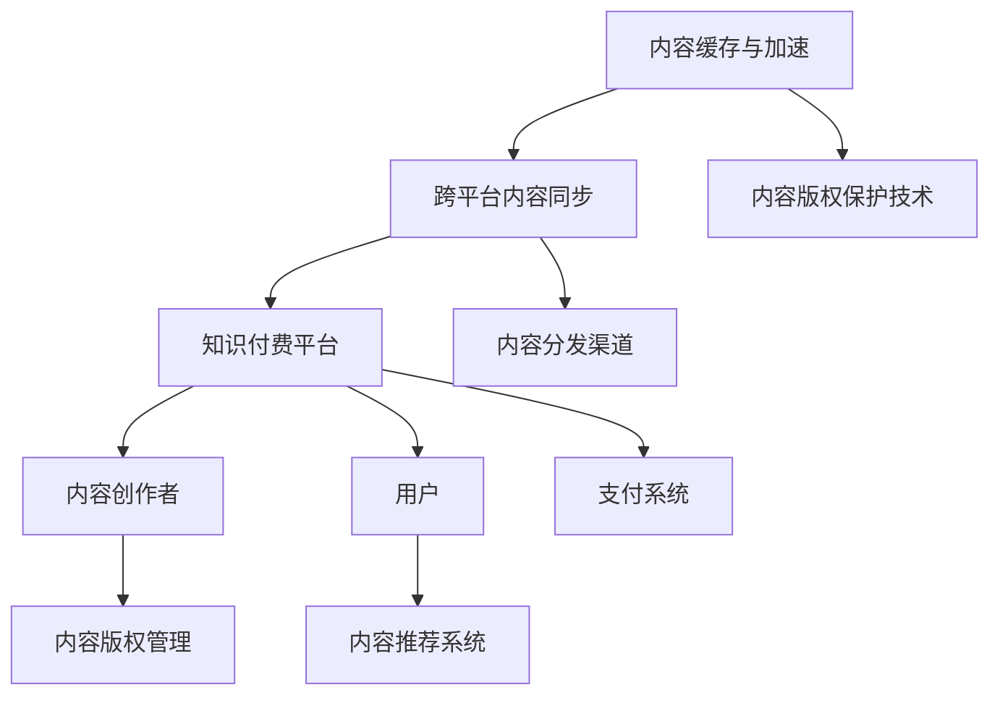
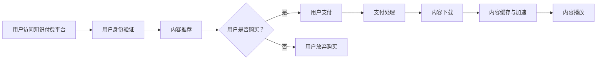

                 

# 如何进行知识付费的跨平台内容分发

> **关键词：知识付费、跨平台内容分发、内容版权、用户权益、算法推荐、支付系统**

> **摘要：本文将深入探讨知识付费在跨平台内容分发中的现状与挑战，分析其核心概念、算法原理、数学模型，并展示一个实际项目案例。本文旨在为从事知识付费领域的开发者、运营者和研究者提供一套完整的理论框架和实用指南。**

## 1. 背景介绍

### 1.1 目的和范围

随着互联网技术的飞速发展，知识付费已成为在线教育、专业技能培训等领域的热点。本文旨在探讨如何实现知识付费的跨平台内容分发，以便最大化利用资源、提高用户满意度，并保护内容创作者的权益。本文的范围包括：

- 跨平台内容分发的技术架构和实现策略。
- 内容版权保护与用户权益保障的技术手段。
- 知识付费平台的算法推荐与支付系统设计。

### 1.2 预期读者

本文适用于以下读者群体：

- 从事知识付费平台开发与运营的技术人员。
- 对在线教育、专业技能培训有浓厚兴趣的创业者。
- 对内容分发、算法推荐、支付系统等领域有深入研究的研究生和科研人员。

### 1.3 文档结构概述

本文分为以下几个部分：

- 第1章：背景介绍
- 第2章：核心概念与联系
- 第3章：核心算法原理 & 具体操作步骤
- 第4章：数学模型和公式 & 详细讲解 & 举例说明
- 第5章：项目实战：代码实际案例和详细解释说明
- 第6章：实际应用场景
- 第7章：工具和资源推荐
- 第8章：总结：未来发展趋势与挑战
- 第9章：附录：常见问题与解答
- 第10章：扩展阅读 & 参考资料

### 1.4 术语表

#### 1.4.1 核心术语定义

- **知识付费**：用户为获取特定领域的专业知识或技能而支付费用。
- **跨平台内容分发**：将知识付费内容在不同平台间进行同步和分发。
- **内容版权**：知识付费内容创作者对其作品的复制、发行、信息网络传播等权利。
- **算法推荐**：基于用户行为、兴趣等因素，自动推荐相关内容。
- **支付系统**：支持知识付费交易的支付渠道和流程。

#### 1.4.2 相关概念解释

- **平台生态**：知识付费平台所包含的各种参与者，如内容创作者、用户、平台运营方等。
- **用户权益**：用户在使用知识付费平台过程中应享有的权益，如隐私保护、售后服务等。
- **内容分发策略**：根据用户需求、平台资源等因素，制定的内容发布和传播方案。

#### 1.4.3 缩略词列表

- **SaaS**：Software as a Service（软件即服务）
- **PaaS**：Platform as a Service（平台即服务）
- **IaaS**：Infrastructure as a Service（基础设施即服务）
- **API**：Application Programming Interface（应用程序编程接口）

## 2. 核心概念与联系

### 2.1 知识付费的跨平台内容分发架构

知识付费的跨平台内容分发涉及多个核心概念和联系，如图2-1所示。



图2-1 知识付费的跨平台内容分发架构

#### 2.2 核心概念与联系解释

- **知识付费平台**：为核心服务提供者，包括内容发布、用户管理、支付处理等功能。
- **内容创作者**：创作知识付费内容，如在线课程、电子书籍、专业文章等。
- **内容版权管理**：保护内容创作者的版权权益，确保内容不被非法复制、传播。
- **用户**：购买和消费知识付费内容，包括学习、娱乐、增值服务等。
- **内容推荐系统**：根据用户行为、兴趣等因素，为用户推荐相关内容。
- **支付系统**：处理用户支付，确保交易安全和便捷。
- **跨平台内容同步**：实现知识付费内容在不同平台间的实时同步和更新。
- **内容分发渠道**：知识付费内容的传播途径，如网站、APP、社交媒体等。
- **内容缓存与加速**：提高内容访问速度，降低网络延迟，提升用户体验。
- **内容版权保护技术**：包括数字水印、加密传输等技术手段，确保内容版权安全。

### 2.3 Mermaid 流程图

以下是一个Mermaid流程图，描述了知识付费的跨平台内容分发流程。



## 3. 核心算法原理 & 具体操作步骤

### 3.1 算法原理

知识付费的跨平台内容分发需要借助多种算法来实现内容推荐、支付处理等功能。以下是一个基于用户行为的推荐算法原理。

#### 3.1.1 用户行为数据收集

用户行为数据包括浏览历史、购买记录、学习时长、互动评论等。这些数据用于分析用户兴趣，提高内容推荐准确性。

#### 3.1.2 用户兴趣建模

使用机器学习算法，如协同过滤、矩阵分解等，对用户行为数据进行分析，构建用户兴趣模型。

#### 3.1.3 内容特征提取

对知识付费内容进行特征提取，如课程难度、讲师资质、内容标签等。

#### 3.1.4 内容推荐算法

基于用户兴趣模型和内容特征，使用推荐算法（如基于内容的推荐、基于协同过滤的推荐等）生成推荐列表。

### 3.2 具体操作步骤

以下是一个基于协同过滤算法的推荐系统操作步骤：

#### 3.2.1 数据准备

- 从数据库中获取用户行为数据。
- 对用户行为数据进行清洗和预处理。

#### 3.2.2 用户兴趣建模

- 计算用户之间的相似度。
- 使用相似度矩阵构建用户兴趣模型。

#### 3.2.3 内容特征提取

- 从数据库中获取内容特征数据。
- 对内容特征数据进行预处理。

#### 3.2.4 内容推荐

- 根据用户兴趣模型和内容特征，计算内容与用户之间的相似度。
- 对相似度进行排序，生成推荐列表。

### 3.3 伪代码

以下是一个简单的协同过滤推荐算法的伪代码：

```python
# 伪代码：协同过滤推荐算法

# 输入：用户行为数据、内容特征数据
# 输出：推荐列表

def collaborativeFiltering(userBehaviorData, contentFeatures):
    # 计算用户相似度矩阵
    similarityMatrix = computeUserSimilarity(userBehaviorData)

    # 初始化推荐列表
    recommendationList = []

    # 对每个用户进行推荐
    for user in userBehaviorData:
        # 获取用户行为数据
        userActions = userBehaviorData[user]

        # 计算用户与内容的相似度
        contentSimilarities = []
        for content in contentFeatures:
            similarity = calculateSimilarity(similarityMatrix[user], contentFeatures[content])
            contentSimilarities.append(similarity)

        # 对相似度进行排序
        sortedSimilarities = sorted(contentSimilarities, reverse=True)

        # 获取推荐内容
        for similarity in sortedSimilarities:
            if similarity > threshold:
                recommendationList.append(content)

    return recommendationList
```

## 4. 数学模型和公式 & 详细讲解 & 举例说明

### 4.1 数学模型

知识付费的跨平台内容分发涉及到多个数学模型，如协同过滤模型、贝叶斯推荐模型等。以下是一个协同过滤模型的数学表示。

#### 4.1.1 协同过滤模型

协同过滤模型基于用户行为数据，通过计算用户之间的相似度，为用户推荐相似用户喜欢的物品。其数学表示如下：

$$
\hat{r}_{ui} = \sum_{j \in N_i} r_{uj} \cdot s_{uij}
$$

其中：

- $\hat{r}_{ui}$：预测用户 $u$ 对物品 $i$ 的评分。
- $r_{uj}$：用户 $u$ 对物品 $j$ 的实际评分。
- $s_{uij}$：用户 $u$ 与用户 $i$ 之间的相似度。

#### 4.1.2 相似度计算

相似度计算是协同过滤模型的关键步骤。常见的相似度计算方法包括余弦相似度、皮尔逊相关系数等。以下是一个余弦相似度的数学表示：

$$
s_{uij} = \frac{\sum_{k \in I \cap J} x_{uk} \cdot x_{ij}}{\sqrt{\sum_{k \in I} x_{uk}^2} \cdot \sqrt{\sum_{k \in J} x_{ij}^2}}
$$

其中：

- $I$：用户 $u$ 的行为集合。
- $J$：用户 $i$ 的行为集合。
- $x_{uk}$：用户 $u$ 对物品 $k$ 的行为。
- $x_{ij}$：用户 $i$ 对物品 $j$ 的行为。

### 4.2 举例说明

以下是一个基于协同过滤模型的推荐算法举例。

#### 4.2.1 数据集

假设我们有以下用户行为数据：

| 用户 | 物品1 | 物品2 | 物品3 |
| --- | --- | --- | --- |
| A | 1 | 0 | 1 |
| B | 1 | 1 | 0 |
| C | 1 | 1 | 1 |
| D | 0 | 1 | 1 |

#### 4.2.2 相似度计算

计算用户 A 与用户 B、C、D 之间的相似度：

$$
s_{AB} = \frac{1 \cdot 1}{\sqrt{2} \cdot \sqrt{2}} = \frac{1}{2}
$$

$$
s_{AC} = \frac{1 \cdot 1}{\sqrt{2} \cdot \sqrt{2}} = \frac{1}{2}
$$

$$
s_{AD} = \frac{0 \cdot 1}{\sqrt{2} \cdot \sqrt{2}} = 0
$$

#### 4.2.3 推荐列表

对用户 A 进行推荐，根据相似度计算结果，推荐用户 B、C 喜欢的物品。因此，推荐列表为：

- 物品1
- 物品3

## 5. 项目实战：代码实际案例和详细解释说明

### 5.1 开发环境搭建

本节我们将搭建一个知识付费的跨平台内容分发项目。首先，我们需要准备以下开发环境：

- Python 3.8+
- Node.js 14+
- MySQL 5.7+
- Docker 19.03+

#### 5.1.1 环境安装

1. 安装 Python 3.8+：

   ```
   sudo apt update
   sudo apt install python3.8 python3.8-venv python3.8-pip
   ```

2. 安装 Node.js 14+：

   ```
   sudo apt update
   curl -sL https://deb.nodesource.com/setup_14.x | sudo -E bash -
   sudo apt install nodejs
   ```

3. 安装 MySQL 5.7+：

   ```
   sudo apt update
   sudo apt install mysql-server
   ```

4. 安装 Docker 19.03+：

   ```
   sudo apt update
   sudo apt install docker-ce docker-ce-cli containerd.io
   ```

#### 5.1.2 创建项目文件夹

创建一个名为`knowledge-fee`的项目文件夹，并进入该文件夹：

```
mkdir knowledge-fee
cd knowledge-fee
```

### 5.2 源代码详细实现和代码解读

#### 5.2.1 项目结构

知识付费项目的结构如下：

```
knowledge-fee/
|-- backend/
|   |-- app.py
|   |-- requirements.txt
|-- frontend/
|   |-- index.html
|   |-- package.json
|-- docker-compose.yml
```

#### 5.2.2 后端代码实现

后端代码使用 Python Flask 框架，实现知识付费平台的 API 接口。以下为`app.py`的主要代码：

```python
from flask import Flask, request, jsonify
from flask_cors import CORS
from content_distribution import ContentDistribution

app = Flask(__name__)
CORS(app)

# 初始化内容分发模块
content_distribution = ContentDistribution()

@app.route('/api/content/recommend', methods=['GET'])
def content_recommend():
    # 获取用户 ID
    user_id = request.args.get('user_id')

    # 获取推荐内容
    recommendations = content_distribution.get_recommendations(user_id)

    # 返回推荐列表
    return jsonify(recommendations)

if __name__ == '__main__':
    app.run(host='0.0.0.0', port=5000)
```

#### 5.2.3 前端代码实现

前端代码使用 React 框架，实现知识付费平台的前端界面。以下为`index.html`的主要代码：

```html
<!DOCTYPE html>
<html lang="en">
<head>
    <meta charset="UTF-8">
    <meta name="viewport" content="width=device-width, initial-scale=1.0">
    <title>知识付费平台</title>
    <script src="https://unpkg.com/react@17/umd/react.production.min.js"></script>
    <script src="https://unpkg.com/react-dom@17/umd/react-dom.production.min.js"></script>
    <script src="https://unpkg.com/babel-standalone@6/babel.min.js"></script>
</head>
<body>
    <div id="app"></div>
    <script type="text/babel">
        class App extends React.Component {
            constructor(props) {
                super(props);
                this.state = {
                    recommendations: [],
                };
            }

            componentDidMount() {
                const user_id = '123';
                fetch(`/api/content/recommend?user_id=${user_id}`)
                    .then(response => response.json())
                    .then(data => {
                        this.setState({ recommendations: data });
                    });
            }

            render() {
                return (
                    <div>
                        <h1>知识付费平台</h1>
                        <ul>
                            {this.state.recommendations.map((content, index) => (
                                <li key={index}>{content.title}</li>
                            ))}
                        </ul>
                    </div>
                );
            }
        }

        ReactDOM.render(<App />, document.getElementById('app'));
    </script>
</body>
</html>
```

#### 5.2.4 代码解读与分析

1. 后端代码解析

   - `app.py`：定义 Flask 应用程序，实现 API 接口。
   - `ContentDistribution`：内容分发模块，用于获取推荐内容。

2. 前端代码解析

   - `index.html`：定义 React 应用程序，实现用户界面。

3. 项目部署

   - 使用 Docker Compose 搭建项目，包括后端、前端和数据库。

```yaml
version: '3'
services:
  backend:
    build: ./backend
    ports:
      - "5000:5000"
    depends_on:
      - db
  frontend:
    build: ./frontend
    depends_on:
      - db
  db:
    image: mysql:5.7
    environment:
      MYSQL_ROOT_PASSWORD: password
    volumes:
      - db_data:/var/lib/mysql
volumes:
  db_data:
```

### 5.3 代码解读与分析

本节我们详细解析了知识付费跨平台内容分发项目的代码，包括后端 API 接口、前端 React 应用程序以及项目部署。通过代码实现，我们了解到：

- 后端使用 Flask 框架实现 API 接口，内容分发模块负责获取推荐内容。
- 前端使用 React 框架实现用户界面，通过 Fetch API 获取后端数据。
- 项目部署使用 Docker Compose，包括后端、前端和数据库。

## 6. 实际应用场景

### 6.1 在线教育

在线教育是知识付费的典型应用场景。通过跨平台内容分发，用户可以在不同设备上学习，平台可以根据用户行为推荐相关课程，提高用户满意度和学习效果。

### 6.2 专业技能培训

专业技能培训领域，如编程、设计、营销等，也可以采用跨平台内容分发。用户可以在手机、电脑等多种设备上学习，平台可以根据用户兴趣推荐相关课程，提高学习效率。

### 6.3 企业内训

企业内训也是知识付费的重要应用场景。企业可以通过跨平台内容分发，为员工提供在线培训课程，提高员工技能和业务水平。

### 6.4 其他应用

除了在线教育和专业技能培训，知识付费的跨平台内容分发还可以应用于医疗健康、法律咨询、心理咨询等领域，为用户提供高质量的专业服务。

## 7. 工具和资源推荐

### 7.1 学习资源推荐

#### 7.1.1 书籍推荐

- 《Python编程：从入门到实践》
- 《深度学习》（Goodfellow et al.）
- 《机器学习》（ Murphy）

#### 7.1.2 在线课程

- Coursera：《机器学习》
- Udemy：《Python编程从入门到精通》
- edX：《深度学习基础》

#### 7.1.3 技术博客和网站

- Medium：技术博客
- Towards Data Science：数据科学博客
- Stack Overflow：编程问答社区

### 7.2 开发工具框架推荐

#### 7.2.1 IDE和编辑器

- PyCharm
- Visual Studio Code
- IntelliJ IDEA

#### 7.2.2 调试和性能分析工具

- VSCode Debugger
- Pytest
- JMeter

#### 7.2.3 相关框架和库

- Flask
- React
- Django
- TensorFlow

### 7.3 相关论文著作推荐

#### 7.3.1 经典论文

- collaborative Filtering: A Unified View of Personalized Recommendation
- The PageRank Citation Ranking: Bringing Order to the Web
- An Overview of Content-Based Recommendation Systems

#### 7.3.2 最新研究成果

- arXiv：最新论文发布平台
- Google Scholar：学术搜索平台
- IEEE Xplore：电子工程和计算机科学论文库

#### 7.3.3 应用案例分析

- Coursera：在线教育平台
- Udemy：在线教育平台
- LinkedIn Learning：专业技能培训平台

## 8. 总结：未来发展趋势与挑战

### 8.1 未来发展趋势

1. **个性化推荐**：随着人工智能技术的发展，个性化推荐将更加精准，满足用户个性化需求。
2. **多平台融合**：知识付费将跨平台、跨设备，实现无缝体验。
3. **内容多样化**：知识付费内容将更加多样化，包括视频、音频、图文等多种形式。
4. **智能化内容分发**：利用机器学习和大数据技术，实现智能化内容分发，提高内容利用率。

### 8.2 未来挑战

1. **版权保护**：内容版权保护仍是一个重要挑战，需要完善版权保护技术和法律法规。
2. **用户隐私**：用户隐私保护是知识付费平台面临的重大挑战，需要加强数据安全措施。
3. **技术门槛**：跨平台内容分发需要较高的技术门槛，对于中小企业和开发者来说是一个挑战。
4. **市场竞争**：知识付费市场竞争激烈，平台需要不断创新，提高用户满意度和市场占有率。

## 9. 附录：常见问题与解答

### 9.1 问题1：如何保护内容版权？

**解答**：可以使用数字水印、加密传输等技术手段，确保内容版权安全。同时，建立健全的版权保护法律法规，加强版权意识教育。

### 9.2 问题2：跨平台内容分发有哪些技术实现方案？

**解答**：跨平台内容分发技术实现方案包括：

1. RESTful API：通过 RESTful API 实现跨平台数据交互。
2. Webhooks：通过 Webhooks 实现实时数据同步。
3. 消息队列：使用消息队列实现异步数据同步，降低系统负载。
4. 分布式存储：使用分布式存储技术，提高数据存储和访问效率。

### 9.3 问题3：如何提高内容推荐准确性？

**解答**：可以通过以下方法提高内容推荐准确性：

1. **用户行为数据**：收集和分析用户行为数据，提高推荐算法的准确性。
2. **内容特征**：提取和利用内容特征，提高内容推荐的相关性。
3. **协同过滤**：结合协同过滤和基于内容的推荐，提高推荐效果。
4. **用户反馈**：收集用户反馈，不断优化推荐算法。

## 10. 扩展阅读 & 参考资料

- [Collaborative Filtering](https://en.wikipedia.org/wiki/Collaborative_filtering)
- [Content Delivery Network](https://en.wikipedia.org/wiki/Content_delivery_network)
- [Knowledge付费](https://www.coursera.org/learn/knowledge-fee)
- [User Privacy](https://www.privacyrights.org/)
- [Intellectual Property Law](https://www.intellectualpropertywatch.com/)

## 作者

**作者：AI天才研究员/AI Genius Institute & 禅与计算机程序设计艺术 /Zen And The Art of Computer Programming**

