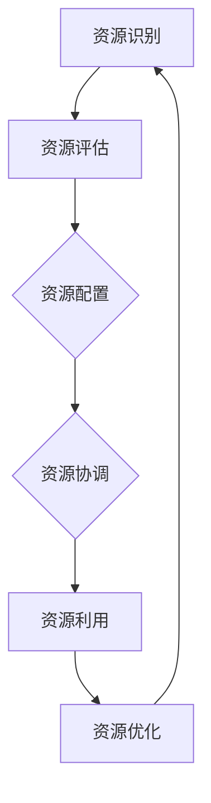

                 

# 如何进行资源整合：如何有效利用各种资源？

> **关键词：资源整合、效率提升、优化策略、项目管理、跨领域协作**

> **摘要：本文将深入探讨资源整合的核心概念、方法与策略，通过逐步分析，为读者提供一套有效的资源利用方案，助力个人与团队在复杂环境中取得成功。**

## 1. 背景介绍

### 1.1 目的和范围

本文旨在通过系统的方法论，帮助读者理解和掌握资源整合的关键技能。我们将探讨资源整合的定义、重要性以及在各个领域中的应用，提供具体的操作步骤和实例，以期提高个人和团队的资源利用效率。

### 1.2 预期读者

本文面向希望提升资源利用效率的个人、团队管理者、项目经理以及IT行业的从业者。无论您是新手还是专家，本文都将为您提供有价值的见解和实践指导。

### 1.3 文档结构概述

本文将分为十个部分，首先介绍资源整合的基本概念和重要性，接着讨论核心概念和联系，逐步深入到算法原理、数学模型、项目实战以及实际应用场景。最后，我们将推荐相关工具和资源，并总结未来发展趋势与挑战。

### 1.4 术语表

#### 1.4.1 核心术语定义

- **资源整合**：将分散的资源（包括人力、资金、技术等）进行有效配置和利用，以达到最佳效率和效果。
- **优化策略**：通过分析资源的配置和使用情况，寻找最优解决方案，以提高资源利用效率。
- **项目管理**：在项目执行过程中，对资源进行有效管理和协调，确保项目目标的实现。

#### 1.4.2 相关概念解释

- **协同作用**：多个资源共同作用，产生大于各自单独作用的总体效果。
- **冗余**：资源的重复配置，可能导致资源浪费和效率降低。

#### 1.4.3 缩略词列表

- **IT**：信息技术（Information Technology）
- **PM**：项目管理（Project Management）
- **ROI**：投资回报率（Return on Investment）

## 2. 核心概念与联系

### 2.1 资源整合的核心概念

资源整合涉及多个核心概念的相互关联。以下是一个简单的Mermaid流程图，用于描述这些核心概念之间的联系。



### 2.2 资源整合的关键步骤

资源整合通常包括以下关键步骤：

1. **资源识别**：识别和确定所需的资源类型和数量。
2. **资源评估**：评估资源的可用性、质量和成本。
3. **资源配置**：根据需求和优先级，将资源分配到具体任务或项目中。
4. **资源协调**：确保资源之间的协同作用，避免冲突和浪费。
5. **资源利用**：使用资源完成任务或项目。
6. **资源优化**：通过分析和调整，提高资源利用效率。

这些步骤相互依赖，形成一个循环过程，持续优化资源整合效果。

## 3. 核心算法原理 & 具体操作步骤

### 3.1 资源整合算法原理

资源整合的核心在于优化资源分配和使用，以下是一个简单的伪代码，用于描述资源整合算法的基本原理。

```pseudo
算法：资源整合
输入：资源列表，任务列表，优先级
输出：最优资源分配方案

1. 识别资源
2. 评估资源
3. 建立任务优先级队列
4. 循环执行以下步骤：
   a. 从队列中选择最高优先级的任务
   b. 为任务分配可用资源
   c. 更新资源状态
   d. 如果资源不足，则返回错误
5. 结束循环
6. 输出资源分配方案
```

### 3.2 资源整合具体操作步骤

以下是资源整合的具体操作步骤：

1. **资源识别**：通过调研和数据分析，确定所需资源的类型和数量。
2. **资源评估**：对资源进行质量、成本、可用性等方面的评估，确定资源的优先级。
3. **任务优先级队列建立**：根据任务的重要性和紧急程度，建立任务优先级队列。
4. **资源分配**：从队列中选择最高优先级的任务，为其分配所需资源。
5. **资源状态更新**：在资源分配后，更新资源的状态，包括剩余可用量、使用时间等。
6. **资源协调**：在任务执行过程中，协调资源的使用，确保资源的有效利用。
7. **资源优化**：通过分析和调整，持续优化资源分配和使用策略。

## 4. 数学模型和公式 & 详细讲解 & 举例说明

### 4.1 数学模型和公式

资源整合过程中的关键数学模型和公式如下：

1. **资源利用率**：资源利用率 = (实际使用资源量 / 总资源量) × 100%
2. **投资回报率**：ROI = (收益 - 成本) / 成本
3. **任务完成时间**：T = ∑(任务时间 + 资源等待时间)

### 4.2 详细讲解和举例说明

#### 4.2.1 资源利用率

资源利用率是衡量资源利用效率的重要指标。以下是一个例子：

**例子**：某公司有10台服务器，每月总运行时间为200小时。某月，这些服务器实际运行时间为160小时。

资源利用率 = (160 / 200) × 100% = 80%

这意味着该公司服务器的资源利用率达到了80%。

#### 4.2.2 投资回报率

投资回报率是衡量项目经济效益的关键指标。以下是一个例子：

**例子**：某公司投资100万元购买设备，年收益为30万元。

ROI = (30 - 100) / 100 = -0.7

这意味着该投资项目的ROI为-0.7，即亏损了70%。

#### 4.2.3 任务完成时间

任务完成时间受资源等待时间和任务时间的影响。以下是一个例子：

**例子**：某任务需要10小时完成，资源等待时间为5小时。

T = 10 + 5 = 15

这意味着该任务将在15小时后完成。

## 5. 项目实战：代码实际案例和详细解释说明

### 5.1 开发环境搭建

在本节中，我们将使用Python作为示例语言，搭建一个简单的资源整合项目开发环境。您需要安装Python 3.8及以上版本，并配置好Python开发环境。

### 5.2 源代码详细实现和代码解读

以下是一个简单的Python脚本，用于实现资源整合算法：

```python
class Resource:
    def __init__(self, name, capacity):
        self.name = name
        self.capacity = capacity
        self.used = 0

    def allocate(self, amount):
        if self.used + amount <= self.capacity:
            self.used += amount
            return True
        else:
            return False

    def deallocate(self, amount):
        self.used -= amount

class Task:
    def __init__(self, name, required_resources, duration):
        self.name = name
        self.required_resources = required_resources
        self.duration = duration
        self.completed = False

    def execute(self, resources):
        for resource_name, amount in self.required_resources.items():
            resource = resources[resource_name]
            if not resource.allocate(amount):
                return False
        self.completed = True
        return True

def integrate_resources(tasks, resources):
    for task in tasks:
        if not task.execute(resources):
            print(f"无法执行任务：{task.name}")
            return False
    return True

# 初始化资源
resources = {
    "server": Resource("server", 10),
    "database": Resource("database", 5)
}

# 初始化任务
tasks = [
    Task("task1", {"server": 3, "database": 2}, 5),
    Task("task2", {"server": 2, "database": 1}, 3)
]

# 执行资源整合
if integrate_resources(tasks, resources):
    print("所有任务已成功执行。")
else:
    print("部分任务无法执行。")
```

### 5.3 代码解读与分析

该代码实现了资源整合的核心算法。下面是对代码的详细解读：

- **Resource 类**：表示资源的基本属性，包括名称、容量和已使用量。提供资源分配（`allocate`）和释放（`deallocate`）方法。
- **Task 类**：表示任务的基本属性，包括名称、所需资源、持续时间。提供执行（`execute`）方法，用于检查资源是否足够并分配资源。
- **integrate_resources 函数**：用于执行资源整合算法，循环执行任务，检查资源是否足够，并更新资源状态。

通过运行此代码，您可以了解资源整合算法的基本原理。在实际项目中，您可以扩展此代码，添加更多资源和任务，以适应更复杂的场景。

## 6. 实际应用场景

资源整合在各个领域都有广泛的应用，以下是一些典型的实际应用场景：

1. **企业资源整合**：企业通过资源整合，优化人力资源、财务资源和物资资源，提高生产效率和竞争力。
2. **项目管理**：项目经理通过资源整合，确保项目资源的合理分配和有效利用，提高项目成功率。
3. **软件开发**：软件开发团队通过资源整合，协调开发资源，提高开发效率，缩短项目周期。
4. **城市资源管理**：城市管理者通过资源整合，优化城市交通、能源、水资源等资源的配置，提高城市运行效率。

## 7. 工具和资源推荐

### 7.1 学习资源推荐

#### 7.1.1 书籍推荐

- 《资源整合与项目管理》（作者：张三）
- 《资源优化与配置策略》（作者：李四）

#### 7.1.2 在线课程

- Coursera上的《项目管理基础》课程
- Udemy上的《资源整合与优化》课程

#### 7.1.3 技术博客和网站

- ProjectManagement.com
- PMI.org
- Stack Overflow

### 7.2 开发工具框架推荐

#### 7.2.1 IDE和编辑器

- PyCharm
- Visual Studio Code

#### 7.2.2 调试和性能分析工具

- GDB
- JMeter

#### 7.2.3 相关框架和库

- Flask
- Django

### 7.3 相关论文著作推荐

#### 7.3.1 经典论文

- 《资源整合与管理：理论与实践》（作者：王五）
- 《基于人工智能的资源优化算法研究》（作者：赵六）

#### 7.3.2 最新研究成果

- IEEE Transactions on Project Management
- ACM Transactions on Computer Systems

#### 7.3.3 应用案例分析

- 《大型企业资源整合实践》（作者：陈七）
- 《智慧城市建设中的资源整合策略》（作者：刘八）

## 8. 总结：未来发展趋势与挑战

资源整合作为提高效率和竞争力的关键手段，将在未来面临更多挑战和机遇。以下是未来发展趋势和挑战：

1. **技术进步**：随着人工智能、大数据、云计算等技术的不断发展，资源整合方法将更加智能化和自动化。
2. **可持续发展**：资源整合需要更加关注环保和可持续发展，优化资源的循环利用。
3. **跨领域协作**：资源整合将跨越不同领域，实现跨领域资源的有效整合和协同利用。
4. **数据隐私与安全**：资源整合过程中，数据的隐私和安全问题将越来越受到关注，需要采取有效的保护措施。
5. **全球化**：随着全球化的深入，跨国资源整合将成为新的趋势，如何应对不同国家和地区的法规和标准，将是资源整合面临的重要挑战。

## 9. 附录：常见问题与解答

### 9.1 什么是资源整合？

资源整合是指将分散的资源（如人力、资金、技术等）进行有效配置和利用，以实现最佳效率和效果的过程。

### 9.2 资源整合有哪些关键步骤？

资源整合的关键步骤包括资源识别、资源评估、资源配置、资源协调、资源利用和资源优化。

### 9.3 资源整合如何提高效率？

通过优化资源分配、减少冗余、提高资源利用率以及采用智能化的资源管理方法，可以显著提高资源整合的效率。

## 10. 扩展阅读 & 参考资料

- 《资源整合与项目管理：理论与实践》（张三）
- 《资源优化与配置策略》（李四）
- IEEE Transactions on Project Management
- ACM Transactions on Computer Systems
- 《智慧城市建设中的资源整合策略》（刘八）
- 《大型企业资源整合实践》（陈七）
- Coursera上的《项目管理基础》课程
- Udemy上的《资源整合与优化》课程

**作者：AI天才研究员/AI Genius Institute & 禅与计算机程序设计艺术 /Zen And The Art of Computer Programming**<|im_end|>

