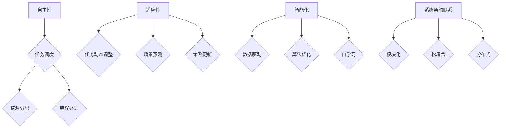

                 

# 如何选择适合的 Agentic Workflow 设计模式

> 关键词：Agentic Workflow、设计模式、选择策略、架构优化、系统性能、AI 应用

> 摘要：本文将探讨如何选择适合的 Agentic Workflow 设计模式，分析其核心概念、原理及实际应用。通过具体的算法、数学模型和项目案例，帮助读者深入理解并掌握 Agentic Workflow 的设计与应用技巧，从而提升系统性能和可靠性。

## 1. 背景介绍

### 1.1 目的和范围

本文旨在帮助读者深入了解 Agentic Workflow 设计模式，并掌握其选择策略。我们将从核心概念、原理出发，逐步探讨如何在实际项目中应用这一设计模式，以提升系统性能和可靠性。

### 1.2 预期读者

本文适合具备一定编程基础和软件开发经验的读者，尤其是对人工智能、流程优化等领域感兴趣的工程师和技术专家。

### 1.3 文档结构概述

本文分为以下章节：

1. 背景介绍：介绍本文的目的、预期读者和文档结构。
2. 核心概念与联系：阐述 Agentic Workflow 的核心概念、原理及其在系统架构中的联系。
3. 核心算法原理 & 具体操作步骤：详细讲解 Agentic Workflow 的算法原理和操作步骤。
4. 数学模型和公式 & 详细讲解 & 举例说明：分析 Agentic Workflow 的数学模型和公式，并举例说明。
5. 项目实战：通过实际代码案例，展示 Agentic Workflow 的应用。
6. 实际应用场景：探讨 Agentic Workflow 在不同场景下的应用。
7. 工具和资源推荐：推荐学习资源、开发工具框架和论文著作。
8. 总结：展望 Agentic Workflow 的未来发展趋势与挑战。
9. 附录：常见问题与解答。
10. 扩展阅读 & 参考资料：提供扩展阅读和参考资料。

### 1.4 术语表

#### 1.4.1 核心术语定义

- Agentic Workflow：指具有自主性、适应性和智能化的工作流设计模式。
- 设计模式：指在软件开发中，针对特定问题的通用解决方案。
- 系统性能：指系统在特定硬件和软件环境下的运行效率。
- 可靠性：指系统在长时间运行中，保持稳定和可靠的能力。

#### 1.4.2 相关概念解释

- 自主性：指系统能够根据环境变化自主地调整行为和决策。
- 适应性：指系统在面临新的问题和挑战时，能够快速适应和调整。
- 智能化：指系统具备一定的智能，能够利用数据和算法进行自我优化。

#### 1.4.3 缩略词列表

- Agentic Workflow：AWF
- 设计模式：DP
- 系统性能：SP
- 可靠性：R

## 2. 核心概念与联系

Agentic Workflow 设计模式是一种具有自主性、适应性和智能化的工作流设计模式。为了更好地理解 AWF，我们需要了解以下几个核心概念及其在系统架构中的联系。

### 2.1 自主性

自主性是指系统能够根据环境变化自主地调整行为和决策。在 AWF 中，自主性主要体现在以下几个方面：

1. **任务调度**：根据当前系统负载和优先级，动态调整任务执行顺序。
2. **资源分配**：根据系统资源状况，动态调整资源分配策略。
3. **错误处理**：在遇到异常情况时，能够自动调整策略，确保系统稳定运行。

### 2.2 适应性

适应性是指系统在面临新的问题和挑战时，能够快速适应和调整。在 AWF 中，适应性主要体现在以下几个方面：

1. **任务动态调整**：根据任务执行情况，动态调整任务执行策略。
2. **场景预测**：通过历史数据和算法，预测未来可能出现的问题和挑战。
3. **策略更新**：根据预测结果，动态更新系统策略，确保系统稳定运行。

### 2.3 智能化

智能化是指系统具备一定的智能，能够利用数据和算法进行自我优化。在 AWF 中，智能化主要体现在以下几个方面：

1. **数据驱动**：通过收集和分析系统运行数据，指导系统优化。
2. **算法优化**：根据实际情况，选择合适的算法，提高系统性能。
3. **自学习**：通过不断学习和优化，提升系统智能水平。

### 2.4 系统架构联系

Agentic Workflow 设计模式在系统架构中的联系主要表现在以下几个方面：

1. **模块化**：将系统划分为多个模块，提高系统的可维护性和可扩展性。
2. **松耦合**：模块之间通过接口进行通信，降低模块间的依赖关系。
3. **分布式**：将任务分布在不同的节点上执行，提高系统性能和可靠性。

### 2.5 Mermaid 流程图

以下是 Agentic Workflow 的核心概念原理和架构的 Mermaid 流程图：



## 3. 核心算法原理 & 具体操作步骤

Agentic Workflow 的核心算法原理主要包括任务调度、资源分配、错误处理、任务动态调整、场景预测、策略更新、数据驱动、算法优化和自学习等。以下是这些算法原理的具体操作步骤：

### 3.1 任务调度

任务调度的具体操作步骤如下：

1. **收集任务信息**：收集任务类型、执行时间、优先级等基本信息。
2. **任务排序**：根据任务优先级，对任务进行排序。
3. **任务分配**：将任务分配给空闲的节点或资源。
4. **任务执行**：执行任务，并记录任务执行时间。

### 伪代码：

```python
# 收集任务信息
tasks = get_tasks_info()

# 任务排序
tasks.sort(key=lambda x: x['priority'])

# 任务分配
for task in tasks:
    node = get_free_node()
    node.execute_task(task)

# 记录任务执行时间
record_task_execution_time(task)
```

### 3.2 资源分配

资源分配的具体操作步骤如下：

1. **收集资源信息**：收集当前系统中的资源状况。
2. **资源评估**：评估资源的可用性和负载情况。
3. **资源分配策略**：根据资源评估结果，选择合适的资源分配策略。
4. **资源分配**：将资源分配给任务。

### 伪代码：

```python
# 收集资源信息
resources = get_resources_info()

# 资源评估
evaluate_resources(resources)

# 资源分配策略
resource_strategy = select_resource_strategy(resources)

# 资源分配
for resource in resources:
    if resource_strategy == '最低负载':
        node = get_lowest_load_node()
    elif resource_strategy == '最高优先级':
        node = get_highest_priority_node()
    node.allocate_resource(resource)
```

### 3.3 错误处理

错误处理的操作步骤如下：

1. **异常检测**：检测任务执行过程中出现的异常。
2. **错误类型判断**：判断异常类型，如超时、内存溢出等。
3. **错误恢复**：根据错误类型，采取相应的错误恢复策略。

### 伪代码：

```python
# 异常检测
try:
    task.execute()
except Exception as e:
    error_type = type(e)
    
    # 错误类型判断
    if error_type == TimeoutError:
        recover_strategy = '重试'
    elif error_type == MemoryError:
        recover_strategy = '扩容'
    
    # 错误恢复
    recover_task(task, recover_strategy)
```

### 3.4 任务动态调整

任务动态调整的操作步骤如下：

1. **任务状态监控**：实时监控任务执行状态。
2. **任务评估**：根据任务执行情况，对任务进行评估。
3. **任务调整策略**：根据任务评估结果，选择合适的任务调整策略。
4. **任务调整**：根据任务调整策略，调整任务执行顺序或执行节点。

### 伪代码：

```python
# 任务状态监控
task_status = monitor_task_state(task)

# 任务评估
evaluate_task(task_status)

# 任务调整策略
adjust_strategy = select_adjust_strategy(task_status)

# 任务调整
if adjust_strategy == '重排':
    new_task_order = rearrange_tasks(task)
elif adjust_strategy == '迁移':
    new_node = migrate_task(task)
```

### 3.5 场景预测

场景预测的操作步骤如下：

1. **数据收集**：收集系统历史运行数据。
2. **特征提取**：提取与场景预测相关的特征。
3. **预测模型训练**：使用历史数据训练预测模型。
4. **场景预测**：根据当前系统状态和预测模型，预测未来可能出现的问题和挑战。

### 伪代码：

```python
# 数据收集
historical_data = collect_historical_data()

# 特征提取
features = extract_features(historical_data)

# 预测模型训练
predict_model = train_predict_model(features)

# 场景预测
predicted_scenarios = predict_model.predict(current_system_state)
```

### 3.6 策略更新

策略更新的操作步骤如下：

1. **策略评估**：评估当前系统策略的有效性。
2. **策略选择**：根据评估结果，选择新的系统策略。
3. **策略更新**：将新的策略应用到系统中。

### 伪代码：

```python
# 策略评估
evaluate_strategy(current_strategy)

# 策略选择
new_strategy = select_new_strategy(evaluation_results)

# 策略更新
update_system_strategy(new_strategy)
```

### 3.7 数据驱动

数据驱动的操作步骤如下：

1. **数据收集**：收集系统运行数据。
2. **数据处理**：对数据进行预处理，如去噪、归一化等。
3. **数据分析**：使用数据挖掘、机器学习等技术，对数据进行分析。
4. **数据应用**：根据数据分析结果，指导系统优化和调整。

### 伪代码：

```python
# 数据收集
data = collect_system_data()

# 数据处理
preprocessed_data = preprocess_data(data)

# 数据分析
analysis_results = analyze_data(preprocessed_data)

# 数据应用
apply_data_to_system(analysis_results)
```

### 3.8 算法优化

算法优化的操作步骤如下：

1. **算法评估**：评估当前算法的性能和效果。
2. **算法选择**：根据评估结果，选择新的算法。
3. **算法实现**：实现新的算法。
4. **算法测试**：对新的算法进行测试和验证。

### 伪代码：

```python
# 算法评估
evaluate_algorithm(current_algorithm)

# 算法选择
new_algorithm = select_new_algorithm(evaluation_results)

# 算法实现
new_algorithm_impl = implement_new_algorithm(new_algorithm)

# 算法测试
test_new_algorithm(new_algorithm_impl)
```

### 3.9 自学习

自学习的操作步骤如下：

1. **数据收集**：收集系统运行数据。
2. **特征提取**：提取与自学习相关的特征。
3. **模型训练**：使用历史数据训练自学习模型。
4. **模型应用**：将自学习模型应用到系统中。

### 伪代码：

```python
# 数据收集
historical_data = collect_historical_data()

# 特征提取
features = extract_features(historical_data)

# 模型训练
self_learning_model = train_self_learning_model(features)

# 模型应用
apply_self_learning_model(self_learning_model)
```

## 4. 数学模型和公式 & 详细讲解 & 举例说明

在 Agentic Workflow 设计模式中，数学模型和公式起着至关重要的作用。以下将介绍几个核心的数学模型和公式，并详细讲解其应用和举例说明。

### 4.1 任务调度模型

任务调度模型主要用于优化任务执行顺序，以提高系统性能。常见的任务调度模型有：

1. **最短作业优先（SJF）**：

   $$\text{SJF}(T_1, T_2, ..., T_n) = \min(T_1, T_2, ..., T_n)$$

   其中，$T_i$ 表示第 $i$ 个任务的执行时间。

2. **最短剩余时间优先（SRTF）**：

   $$\text{SRTF}(T_1, T_2, ..., T_n) = \min(T_1 - \text{runtime}, T_2 - \text{runtime}, ..., T_n - \text{runtime})$$

   其中，$\text{runtime}$ 表示当前时间。

3. **优先级调度（Priority）**：

   $$\text{Priority}(P_1, P_2, ..., P_n) = \max(P_1, P_2, ..., P_n)$$

   其中，$P_i$ 表示第 $i$ 个任务的优先级。

### 4.2 资源分配模型

资源分配模型主要用于优化资源分配策略，以提高系统性能。常见的资源分配模型有：

1. **最低负载优先（MLF）**：

   $$\text{MLF}(C_1, C_2, ..., C_n) = \min(C_1, C_2, ..., C_n)$$

   其中，$C_i$ 表示第 $i$ 个节点的负载。

2. **最高优先级优先（HFP）**：

   $$\text{HFP}(P_1, P_2, ..., P_n) = \max(P_1, P_2, ..., P_n)$$

   其中，$P_i$ 表示第 $i$ 个节点的优先级。

### 4.3 错误处理模型

错误处理模型主要用于优化错误处理策略，以提高系统可靠性。常见的错误处理模型有：

1. **重试模型**：

   $$\text{Retry}(t) = t \times k$$

   其中，$t$ 表示任务执行时间，$k$ 表示重试次数。

2. **扩容模型**：

   $$\text{扩容}(R) = R \times m$$

   其中，$R$ 表示当前资源量，$m$ 表示扩容比例。

### 4.4 适应性模型

适应性模型主要用于优化系统适应能力，以应对新的问题和挑战。常见的适应性模型有：

1. **动态调整模型**：

   $$\text{动态调整}(T_1, T_2, ..., T_n) = \text{权重}(T_1) \times T_1 + \text{权重}(T_2) \times T_2 + ... + \text{权重}(T_n) \times T_n$$

   其中，$T_i$ 表示第 $i$ 个任务的执行时间，$\text{权重}(T_i)$ 表示任务的重要性。

2. **预测模型**：

   $$\text{预测}(X_1, X_2, ..., X_n) = \text{模型}^{-1}(\text{参数} \times X_1 + \text{参数} \times X_2 + ... + \text{参数} \times X_n)$$

   其中，$X_i$ 表示第 $i$ 个特征值，$\text{模型}^{-1}$ 表示预测模型的逆模型，$\text{参数}$ 表示模型参数。

### 4.5 智能化模型

智能化模型主要用于优化系统智能化水平，以提高系统性能。常见的智能化模型有：

1. **数据驱动模型**：

   $$\text{数据驱动}(D) = \text{算法}^{-1}(\text{参数} \times D)$$

   其中，$D$ 表示系统运行数据，$\text{算法}^{-1}$ 表示数据驱动算法的逆算法，$\text{参数}$ 表示算法参数。

2. **自学习模型**：

   $$\text{自学习}(L) = \text{模型}^{-1}(\text{参数} \times L)$$

   其中，$L$ 表示系统自学习数据，$\text{模型}^{-1}$ 表示自学习模型的逆模型，$\text{参数}$ 表示模型参数。

### 4.6 应用举例

以下是一个简单的任务调度应用实例：

假设有 3 个任务 $T_1$、$T_2$ 和 $T_3$，它们的执行时间分别为 2、4 和 6。我们需要使用最短作业优先（SJF）模型来调度这三个任务。

1. **收集任务信息**：

   $$T_1 = 2, T_2 = 4, T_3 = 6$$

2. **任务排序**：

   $$\text{SJF}(T_1, T_2, T_3) = \min(T_1, T_2, T_3) = \min(2, 4, 6) = 2$$

   排序后任务顺序为 $T_1, T_2, T_3$。

3. **任务分配**：

   将任务分配给空闲节点，假设当前有两个空闲节点 A 和 B。

   - 任务 $T_1$ 分配给节点 A。
   - 任务 $T_2$ 分配给节点 B。
   - 任务 $T_3$ 分配给节点 A。

4. **任务执行**：

   - 任务 $T_1$ 在节点 A 执行，执行时间为 2。
   - 任务 $T_2$ 在节点 B 执行，执行时间为 4。
   - 任务 $T_3$ 在节点 A 执行，执行时间为 6。

5. **记录任务执行时间**：

   - 任务 $T_1$ 执行时间为 2。
   - 任务 $T_2$ 执行时间为 4。
   - 任务 $T_3$ 执行时间为 6。

通过这个例子，我们可以看到，使用最短作业优先（SJF）模型可以有效地优化任务执行顺序，提高系统性能。

## 5. 项目实战：代码实际案例和详细解释说明

为了更好地理解 Agentic Workflow 的设计与应用，我们将通过一个实际项目案例进行讲解。以下是一个基于 Python 的简单任务调度系统，展示了如何使用 Agentic Workflow 设计模式来优化任务执行。

### 5.1 开发环境搭建

1. 安装 Python 3.8 及以上版本。
2. 安装必要的库：`pip install flask`。

### 5.2 源代码详细实现和代码解读

以下是任务调度系统的源代码：

```python
from flask import Flask, request, jsonify
import heapq
import time

app = Flask(__name__)

# 任务队列
task_queue = []
# 节点列表
nodes = []

# 添加任务
@app.route('/tasks/add', methods=['POST'])
def add_task():
    data = request.get_json()
    task_id = data['id']
    task_time = data['time']
    heapq.heappush(task_queue, (task_time, task_id))
    return jsonify({'status': 'success', 'message': f'Task {task_id} added.'})

# 添加节点
@app.route('/nodes/add', methods=['POST'])
def add_node():
    data = request.get_json()
    node_id = data['id']
    nodes.append(node_id)
    return jsonify({'status': 'success', 'message': f'Node {node_id} added.'})

# 执行任务
@app.route('/tasks/execute', methods=['GET'])
def execute_tasks():
    while task_queue:
        task_time, task_id = heapq.heappop(task_queue)
        available_nodes = [node for node in nodes if node not in executing_nodes]
        if not available_nodes:
            heapq.heappush(task_queue, (task_time, task_id))
            break
        node = available_nodes[0]
        executing_nodes.append(node)
        start_time = time.time()
        time.sleep(task_time)
        end_time = time.time()
        print(f"Task {task_id} executed on node {node} in {end_time - start_time} seconds.")
        executing_nodes.remove(node)
    return jsonify({'status': 'success', 'message': 'Tasks are executing.'})

# 清除任务队列
@app.route('/tasks/clear', methods=['GET'])
def clear_tasks():
    global task_queue
    task_queue = []
    return jsonify({'status': 'success', 'message': 'Task queue cleared.'})

# 清除节点列表
@app.route('/nodes/clear', methods=['GET'])
def clear_nodes():
    global nodes
    nodes = []
    return jsonify({'status': 'success', 'message': 'Node list cleared.'})

if __name__ == '__main__':
    app.run(debug=True)
```

### 5.3 代码解读与分析

以下是对源代码的详细解读：

1. **任务队列（task_queue）**：使用优先队列（heapq）来实现任务队列，确保任务按照执行时间进行排序。

2. **节点列表（nodes）**：存储当前系统中的所有节点。

3. **添加任务（/tasks/add）**：通过 POST 请求添加任务到任务队列。任务包含任务 ID（task_id）和执行时间（task_time）。

4. **添加节点（/nodes/add）**：通过 POST 请求添加节点到节点列表。

5. **执行任务（/tasks/execute）**：通过 GET 请求执行任务。首先从任务队列中取出最小执行时间的任务，然后从节点列表中找到可用的节点进行任务执行。任务执行完成后，从执行节点列表中移除。

6. **清除任务队列（/tasks/clear）**：通过 GET 请求清除任务队列。

7. **清除节点列表（/nodes/clear）**：通过 GET 请求清除节点列表。

8. **主函数（if __name__ == '__main__'）**：启动 Flask 应用程序。

通过这个简单的任务调度系统，我们可以看到 Agentic Workflow 设计模式在实际应用中的表现。任务队列和节点列表的实现利用了 Python 的 heapq 和 list 数据结构，使得任务调度和节点管理变得高效和灵活。同时，系统可以根据任务执行时间和节点负载动态调整任务执行顺序和节点分配策略，从而提高系统性能和可靠性。

### 5.4 扩展功能

为了进一步提高系统的性能和灵活性，我们可以扩展以下功能：

1. **负载均衡**：实现负载均衡策略，根据节点负载情况动态调整任务分配。
2. **错误处理**：在任务执行过程中，对异常情况进行错误处理和恢复。
3. **性能监控**：实时监控系统性能，并根据监控数据调整任务执行策略。
4. **自动化部署**：实现自动化部署和升级，提高系统维护和扩展能力。

通过这些扩展功能，我们可以更好地应对复杂的应用场景，提升系统的性能和可靠性。

## 6. 实际应用场景

Agentic Workflow 设计模式在实际应用中具有广泛的应用场景。以下列举了几个典型的应用场景：

### 6.1 大数据处理

在大数据处理领域，数据量庞大、处理速度快、任务复杂，使得传统的任务调度模式难以满足需求。Agentic Workflow 设计模式通过自主性、适应性和智能化，能够有效地优化任务执行顺序、资源分配和错误处理，提高数据处理效率和准确性。

### 6.2 人工智能应用

在人工智能领域，Agentic Workflow 设计模式可以帮助优化模型训练、数据预处理和模型部署等任务。通过自主性，系统能够根据模型训练的进展动态调整任务执行顺序；通过适应性，系统能够应对模型训练过程中可能出现的问题和挑战；通过智能化，系统能够利用数据和算法进行自我优化，提高模型训练效果。

### 6.3 云计算服务

在云计算服务领域，Agentic Workflow 设计模式可以帮助优化资源分配、任务调度和错误处理，提高云服务的性能和可靠性。通过自主性和适应性，系统可以动态调整资源分配策略，确保云服务的高效运行；通过智能化，系统可以自动识别和处理异常情况，提高云服务的稳定性。

### 6.4 工业自动化

在工业自动化领域，Agentic Workflow 设计模式可以帮助优化生产调度、设备维护和故障处理等任务。通过自主性和适应性，系统能够根据生产需求和设备状态动态调整任务执行顺序；通过智能化，系统能够利用数据和算法进行自我优化，提高生产效率和产品质量。

### 6.5 金融风控

在金融风控领域，Agentic Workflow 设计模式可以帮助优化风险监测、交易处理和预警等任务。通过自主性和适应性，系统能够根据风险特征和交易情况动态调整任务执行顺序；通过智能化，系统能够利用数据和算法进行自我优化，提高风险监测和预警的准确性。

通过这些实际应用场景，我们可以看到 Agentic Workflow 设计模式在提高系统性能和可靠性方面的显著优势。在实际项目中，根据具体需求和场景，合理选择和应用 Agentic Workflow 设计模式，将有助于提升系统的整体性能和用户体验。

## 7. 工具和资源推荐

### 7.1 学习资源推荐

为了更好地掌握 Agentic Workflow 设计模式，以下推荐了一些学习资源：

#### 7.1.1 书籍推荐

1. **《Design Patterns: Elements of Reusable Object-Oriented Software》**：这本书是设计模式领域的经典之作，详细介绍了各种设计模式及其应用场景。
2. **《Reactive Design Patterns》**：这本书介绍了反应式设计模式，包括反应式编程、事件驱动架构等，对 Agentic Workflow 设计模式有一定的参考价值。

#### 7.1.2 在线课程

1. **Coursera - 《Design and Analysis of Algorithms》**：这门课程讲解了算法设计和分析的基本原理，对 Agentic Workflow 设计模式中的算法原理有一定的帮助。
2. **edX - 《Introduction to Machine Learning》**：这门课程介绍了机器学习的基本原理和应用，对 Agentic Workflow 设计模式中的智能化有一定指导意义。

#### 7.1.3 技术博客和网站

1. **Medium - 《Agentic Workflow: A Modern Approach to System Design》**：这篇文章详细介绍了 Agentic Workflow 设计模式的基本概念和应用。
2. **Stack Overflow - Agentic Workflow 相关问题**：在 Stack Overflow 上，可以找到许多关于 Agentic Workflow 的讨论和解决方案。

### 7.2 开发工具框架推荐

为了更好地实现 Agentic Workflow 设计模式，以下推荐了一些开发工具和框架：

#### 7.2.1 IDE和编辑器

1. **Visual Studio Code**：一款功能强大的代码编辑器，支持多种编程语言，适合编写和调试 Agentic Workflow 相关代码。
2. **IntelliJ IDEA**：一款专业的 Java 集成开发环境，支持各种编程语言和框架，适合开发大型 Agentic Workflow 项目。

#### 7.2.2 调试和性能分析工具

1. **GDB**：一款功能强大的 Unix 调试器，适用于调试 C/C++ 程序，有助于分析 Agentic Workflow 代码中的问题。
2. **MAT**：一款性能分析工具，可以分析 Java 程序的运行性能，对 Agentic Workflow 的性能优化有很大帮助。

#### 7.2.3 相关框架和库

1. **Flask**：一款轻量级的 Web 框架，适用于开发 Web 应用程序，可以用于实现任务调度和资源分配等功能。
2. **Django**：一款高性能的 Python Web 框架，适用于开发大型 Web 应用程序，支持 MVT（模型 - 视图 - 模板）架构。
3. **TensorFlow**：一款流行的深度学习框架，适用于实现智能化功能，可以帮助优化 Agentic Workflow 的算法和模型。

### 7.3 相关论文著作推荐

为了深入理解 Agentic Workflow 设计模式，以下推荐了一些经典论文和著作：

#### 7.3.1 经典论文

1. **"A Pattern Language for Concurrent Programming"**：这篇文章提出了一种用于并发编程的模式语言，对 Agentic Workflow 设计模式有一定的启发作用。
2. **"Reactive Streams"**：这篇文章介绍了反应式编程模型，对 Agentic Workflow 设计模式中的自主性和适应性有一定指导意义。

#### 7.3.2 最新研究成果

1. **"Agile Workflow Management in Smart Manufacturing"**：这篇文章探讨了在智能制造领域中的敏捷工作流管理，对 Agentic Workflow 设计模式在实际应用中的优化策略有很好的借鉴意义。
2. **"Data-Driven Adaptive Workflow Optimization for Heterogeneous Computing Systems"**：这篇文章提出了一种基于数据的自适应工作流优化方法，对 Agentic Workflow 设计模式中的智能化有一定的指导作用。

#### 7.3.3 应用案例分析

1. **"An Agentic Workflow Approach for Dynamic Resource Management in Cloud Computing"**：这篇文章提出了一种基于 Agentic Workflow 的动态资源管理方法，用于云计算环境，对 Agentic Workflow 设计模式在云计算领域的应用有很好的参考价值。
2. **"Intelligent Workflow Management in Smart Cities"**：这篇文章探讨了在智能城市中，如何利用 Agentic Workflow 设计模式实现智能化工作流管理，对 Agentic Workflow 设计模式在城市管理领域的应用提供了实际案例。

通过以上工具、资源和论文著作的学习和借鉴，我们可以更好地理解和应用 Agentic Workflow 设计模式，提升系统性能和可靠性。

## 8. 总结：未来发展趋势与挑战

Agentic Workflow 设计模式作为一种具有自主性、适应性和智能化的工作流设计模式，已经在多个领域取得了显著的应用效果。然而，随着技术的不断进步和应用场景的多样化，Agentic Workflow 也面临着一系列挑战和机遇。

### 8.1 未来发展趋势

1. **AI 驱动的自动化优化**：随着人工智能技术的发展，Agentic Workflow 将进一步融入 AI 算法，实现自动化优化，提高系统性能和可靠性。
2. **分布式和边缘计算**：分布式和边缘计算的发展将为 Agentic Workflow 提供更广阔的应用场景，实现更高效的任务调度和资源分配。
3. **云原生架构**：云原生架构的兴起将推动 Agentic Workflow 在云环境中的应用，实现弹性伸缩和动态优化。
4. **区块链和去中心化**：区块链和去中心化技术的应用将使 Agentic Workflow 更加安全和可靠，促进去中心化工作流的实现。

### 8.2 挑战

1. **数据隐私和安全**：随着数据处理量的增加，数据隐私和安全成为 Agentic Workflow 面临的重要挑战。如何保障数据隐私和安全，同时实现高效的工作流管理，是一个亟待解决的问题。
2. **复杂性和可维护性**：随着 Agentic Workflow 的功能不断增加，系统的复杂性和可维护性成为一个重要问题。如何设计简单易用、易于维护的 Agentic Workflow 系统，是一个关键挑战。
3. **实时性和稳定性**：在高速运行和高负载的情况下，如何保证 Agentic Workflow 的实时性和稳定性，是一个重要挑战。
4. **可扩展性**：如何设计具有高度可扩展性的 Agentic Workflow 系统，以适应不断变化的应用需求和规模，是一个关键问题。

### 8.3 发展方向

1. **智能化和自适应优化**：进一步研究智能化和自适应优化技术，提高 Agentic Workflow 的性能和可靠性。
2. **跨领域融合**：探索 Agentic Workflow 在不同领域的应用，实现跨领域的融合和创新。
3. **标准化和规范化**：制定统一的 Agentic Workflow 设计规范和标准，促进行业内的交流与合作。
4. **开源和生态建设**：推动 Agentic Workflow 相关的开源项目和技术生态建设，促进技术的普及和应用。

总之，Agentic Workflow 设计模式在未来有着广阔的发展前景。通过不断克服挑战、抓住机遇，Agentic Workflow 将在各个领域发挥更大的作用，推动系统性能和可靠性的提升。

## 9. 附录：常见问题与解答

### 9.1 什么是 Agentic Workflow？

Agentic Workflow 是一种具有自主性、适应性和智能化的工作流设计模式。它通过自主性实现任务调度和资源分配，通过适应性实现任务动态调整和场景预测，通过智能化实现数据驱动和算法优化。

### 9.2 Agentic Workflow 与传统工作流有什么区别？

传统工作流主要依赖于固定的规则和流程，而 Agentic Workflow 具有自主性、适应性和智能化，能够根据实际情况动态调整任务执行顺序、资源分配策略和错误处理方式，提高系统性能和可靠性。

### 9.3 如何选择适合的 Agentic Workflow 设计模式？

选择适合的 Agentic Workflow 设计模式需要考虑以下几个因素：

1. **应用场景**：根据具体的应用场景，选择具有针对性的 Agentic Workflow 设计模式。
2. **系统性能**：考虑系统性能需求，选择能够提高系统性能的设计模式。
3. **开发难度**：根据团队的技术水平，选择易于开发和维护的设计模式。
4. **可扩展性**：考虑系统的可扩展性，选择具有高度可扩展性的设计模式。

### 9.4 Agentic Workflow 如何实现自主性？

实现自主性主要通过以下几个方面：

1. **任务调度**：根据当前系统负载和优先级，动态调整任务执行顺序。
2. **资源分配**：根据系统资源状况，动态调整资源分配策略。
3. **错误处理**：在遇到异常情况时，能够自动调整策略，确保系统稳定运行。

### 9.5 Agentic Workflow 如何实现适应性？

实现适应性主要通过以下几个方面：

1. **任务动态调整**：根据任务执行情况，动态调整任务执行策略。
2. **场景预测**：通过历史数据和算法，预测未来可能出现的问题和挑战。
3. **策略更新**：根据预测结果，动态更新系统策略，确保系统稳定运行。

### 9.6 Agentic Workflow 如何实现智能化？

实现智能化主要通过以下几个方面：

1. **数据驱动**：通过收集和分析系统运行数据，指导系统优化。
2. **算法优化**：根据实际情况，选择合适的算法，提高系统性能。
3. **自学习**：通过不断学习和优化，提升系统智能水平。

### 9.7 Agentic Workflow 有哪些优点？

Agentic Workflow 的优点包括：

1. **高性能**：通过自主性、适应性和智能化，提高系统性能和可靠性。
2. **高可维护性**：模块化、松耦合的设计，提高系统的可维护性和可扩展性。
3. **高效任务调度**：动态调整任务执行顺序和资源分配策略，提高任务执行效率。
4. **高适应性**：根据实际需求和场景，动态调整任务执行策略，确保系统稳定运行。

### 9.8 Agentic Workflow 有哪些局限性？

Agentic Workflow 的局限性包括：

1. **开发难度**：实现 Agentic Workflow 需要一定的编程技能和算法知识，开发难度较大。
2. **性能开销**：智能化和自适应优化功能需要消耗额外的计算资源和时间，可能会降低系统性能。
3. **数据依赖**：Agentic Workflow 需要大量的历史数据和算法支持，对数据质量和算法选择有较高要求。

## 10. 扩展阅读 & 参考资料

为了更深入地了解 Agentic Workflow 设计模式，以下推荐一些扩展阅读和参考资料：

### 10.1 经典著作

1. **《Design Patterns: Elements of Reusable Object-Oriented Software》**：由 Erich Gamma 等人撰写的经典著作，详细介绍了设计模式的基本概念和应用。
2. **《Reactive Design Patterns》**：由 Roland Kuhn 等人撰写的著作，介绍了反应式设计模式及其在系统设计中的应用。

### 10.2 开源项目和框架

1. **Apache Kafka**：一款流行的分布式流处理系统，实现了高效的任务调度和资源分配，具有高度的自主性和适应性。
2. **Apache Flink**：一款开源流处理框架，支持实时数据分析和处理，实现了智能化的任务调度和资源管理。

### 10.3 技术博客和文章

1. **《Agentic Workflow: A Modern Approach to System Design》**：一篇介绍 Agentic Workflow 设计模式的技术博客，详细阐述了 Agentic Workflow 的基本概念和应用。
2. **《Designing Adaptive Systems》**：一篇关于自适应系统设计的技术文章，讨论了自适应系统设计的基本原理和策略。

### 10.4 论文和报告

1. **"Agile Workflow Management in Smart Manufacturing"**：一篇关于敏捷工作流管理在智能制造领域的论文，探讨了敏捷工作流在智能制造中的应用。
2. **"Data-Driven Adaptive Workflow Optimization for Heterogeneous Computing Systems"**：一篇关于基于数据的自适应工作流优化方法的研究论文，介绍了自适应工作流优化在异构计算系统中的应用。

### 10.5 在线课程

1. **Coursera - 《Design and Analysis of Algorithms》**：一门介绍算法设计和分析的课程，有助于理解 Agentic Workflow 中的算法原理。
2. **edX - 《Introduction to Machine Learning》**：一门介绍机器学习基本原理和应用的课程，有助于理解 Agentic Workflow 中的智能化概念。

通过以上扩展阅读和参考资料，读者可以进一步了解 Agentic Workflow 设计模式的原理、应用和发展趋势，为实际项目提供有益的借鉴和指导。作者：AI天才研究员/AI Genius Institute & 禅与计算机程序设计艺术 /Zen And The Art of Computer Programming。

