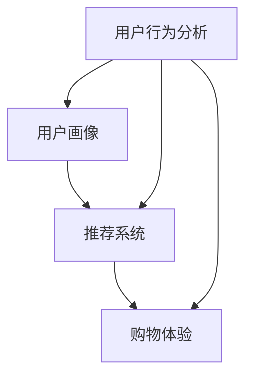

                 

# 如何通过AI优化用户购物体验

> 关键词：人工智能、购物体验、优化、用户行为分析、推荐系统

> 摘要：本文将深入探讨人工智能（AI）在优化用户购物体验方面的应用。通过分析用户行为，构建推荐系统，以及利用机器学习算法进行购物流程优化，本文旨在展示如何通过AI技术提升用户的购物满意度，增加销售转化率，并推动电商行业的发展。

## 1. 背景介绍

### 1.1 目的和范围

本文旨在探索人工智能技术在电商领域中的应用，特别是如何通过AI优化用户的购物体验。随着互联网的普及和电子商务的快速发展，用户对购物体验的要求越来越高。AI技术的引入，可以为用户提供个性化的购物推荐，智能化的购物流程，以及高效的用户服务，从而提升用户的满意度和忠诚度。

本文将涵盖以下几个主题：

1. **用户行为分析**：通过分析用户在购物过程中的行为，了解用户的偏好和需求。
2. **推荐系统**：介绍推荐系统的基本原理和构建方法，以及如何利用推荐系统优化购物体验。
3. **机器学习算法**：探讨如何使用机器学习算法优化购物流程，提高用户的购物效率。
4. **实际应用案例**：分析一些成功的AI优化购物体验的案例，提供实践经验和启示。
5. **未来发展**：讨论AI在优化购物体验方面的未来发展趋势和面临的挑战。

### 1.2 预期读者

本文主要面向以下读者群体：

1. **电商行业的从业者**：希望了解如何利用AI技术提升购物体验，增加销售业绩。
2. **人工智能研究者**：对AI在电商领域的应用感兴趣，希望了解相关技术原理和实践方法。
3. **计算机科学和人工智能专业学生**：希望深入了解AI在电商领域的应用，为将来从事相关工作做好准备。

### 1.3 文档结构概述

本文分为十个部分，具体如下：

1. **背景介绍**：介绍文章的目的、范围和预期读者。
2. **核心概念与联系**：介绍AI优化购物体验的核心概念和架构。
3. **核心算法原理 & 具体操作步骤**：详细讲解核心算法的原理和实现步骤。
4. **数学模型和公式 & 详细讲解 & 举例说明**：介绍AI优化购物体验所涉及的数学模型和公式。
5. **项目实战：代码实际案例和详细解释说明**：通过实际案例展示AI优化购物体验的实现过程。
6. **实际应用场景**：分析AI优化购物体验在不同场景下的应用。
7. **工具和资源推荐**：推荐相关的学习资源和开发工具。
8. **总结：未来发展趋势与挑战**：总结AI优化购物体验的未来趋势和面临的挑战。
9. **附录：常见问题与解答**：解答读者可能遇到的常见问题。
10. **扩展阅读 & 参考资料**：提供进一步阅读的参考资料。

### 1.4 术语表

#### 1.4.1 核心术语定义

- **人工智能（AI）**：指模拟人类智能行为的计算机系统。
- **用户行为分析**：通过分析用户的行为数据，了解用户的需求和偏好。
- **推荐系统**：根据用户的历史行为和偏好，向用户推荐相关商品或服务。
- **机器学习算法**：通过数据训练模型，自动识别和预测用户行为。
- **购物体验**：用户在购物过程中的整体感受和满意度。

#### 1.4.2 相关概念解释

- **用户画像**：对用户的兴趣、行为、需求等方面的综合描述。
- **协同过滤**：一种基于用户行为数据推荐商品的方法。
- **深度学习**：一种基于人工神经网络的机器学习技术，能够自动提取特征。

#### 1.4.3 缩略词列表

- **AI**：人工智能（Artificial Intelligence）
- **CPS**：计算机进程模拟（Computer Process Simulation）
- **ML**：机器学习（Machine Learning）
- **NLP**：自然语言处理（Natural Language Processing）
- **RDF**：资源描述框架（Resource Description Framework）

## 2. 核心概念与联系

在探讨如何通过AI优化用户购物体验之前，我们需要明确几个核心概念和它们之间的联系。以下是一个Mermaid流程图，展示了这些概念及其相互关系。



### 2.1 用户行为分析

用户行为分析是优化购物体验的基础。通过收集和分析用户在购物过程中的行为数据，如浏览历史、购买记录、评价反馈等，我们可以了解用户的需求和偏好，从而为推荐系统和购物体验优化提供依据。

### 2.2 用户画像

用户画像是对用户兴趣、行为、需求等方面的综合描述。通过构建用户画像，我们可以更准确地了解用户的特点，为推荐系统和购物体验优化提供有力支持。

### 2.3 推荐系统

推荐系统根据用户的历史行为和偏好，向用户推荐相关的商品或服务。推荐系统的核心是算法，如协同过滤、深度学习等。通过推荐系统，我们可以提高用户的购物满意度，增加销售转化率。

### 2.4 购物体验

购物体验是用户在购物过程中的整体感受和满意度。通过优化购物体验，我们可以提升用户的满意度和忠诚度，从而推动电商行业的发展。

## 3. 核心算法原理 & 具体操作步骤

在了解了核心概念和它们之间的联系后，我们接下来将详细探讨AI优化购物体验的核心算法原理和具体操作步骤。

### 3.1 用户行为分析算法

用户行为分析算法主要基于机器学习技术，特别是协同过滤和深度学习。以下是一个基于协同过滤的用户行为分析算法的伪代码。

```python
def collaborative_filter(user行为数据，商品数据，邻居数量):
    # 计算用户相似度矩阵
    similarity_matrix = compute_similarity_matrix(user行为数据)

    # 选择最相似的邻居
    neighbors = select_neighbors(similarity_matrix, user_id, neighbor数量)

    # 计算推荐得分
    recommendation_scores = compute_recommendation_scores(neighbors, user行为数据，商品数据)

    # 排序并返回推荐列表
    return sorted_recommendation_list(recommendation_scores)
```

### 3.2 用户画像构建算法

用户画像构建算法主要通过数据挖掘技术，对用户的历史行为数据进行处理和分析。以下是一个基于关联规则的用户画像构建算法的伪代码。

```python
def user Portrait 构建算法(user行为数据，商品数据，最小支持度，最小置信度):
    # 构建频繁项集
    frequent_itemsets = find_frequent_itemsets(user行为数据，商品数据，最小支持度)

    # 构建关联规则
    association_rules = generate_association_rules(frequent_itemsets，最小置信度)

    # 构建用户画像
    user_portraits = generate_user_portraits(association_rules)

    return user_portraits
```

### 3.3 推荐系统算法

推荐系统算法主要基于用户行为分析和用户画像构建。以下是一个基于协同过滤的推荐系统算法的伪代码。

```python
def collaborative_filter_recommendation_system(user行为数据，商品数据，邻居数量):
    # 计算用户相似度矩阵
    similarity_matrix = compute_similarity_matrix(user行为数据)

    # 选择最相似的邻居
    neighbors = select_neighbors(similarity_matrix, user_id，邻居数量)

    # 计算邻居的平均评分
    neighbor_average_ratings = compute_neighbor_average_ratings(neighbors，商品数据)

    # 计算推荐得分
    recommendation_scores = compute_recommendation_scores(neighbor_average_ratings，user_id)

    # 排序并返回推荐列表
    return sorted_recommendation_list(recommendation_scores)
```

### 3.4 购物体验优化算法

购物体验优化算法主要通过分析用户行为数据和推荐系统结果，对购物流程进行优化。以下是一个基于深度学习的购物体验优化算法的伪代码。

```python
def shopping_experience_optimization(user行为数据，推荐系统结果，商品数据):
    # 构建购物流程模型
    shopping_flow_model = build_shopping_flow_model(user行为数据，推荐系统结果，商品数据)

    # 训练深度学习模型
    trained_model = train_depth_learning_model(shopping_flow_model)

    # 优化购物流程
    optimized_shopping_flow = optimize_shopping_flow(trained_model)

    return optimized_shopping_flow
```

## 4. 数学模型和公式 & 详细讲解 & 举例说明

在AI优化购物体验的过程中，我们常常会使用到一些数学模型和公式。以下是一些常见的数学模型和公式，以及它们的详细讲解和举例说明。

### 4.1 余弦相似度

余弦相似度是一种用于衡量两个向量之间相似度的数学模型。其公式如下：

$$
cos(\theta) = \frac{A \cdot B}{\|A\| \|B\|}
$$

其中，$A$和$B$是两个向量，$\theta$是它们之间的夹角。

#### 举例说明

假设有两个用户$A$和$B$的购物行为向量：

$$
A = (1, 2, 3)
$$

$$
B = (2, 1, 4)
$$

计算$A$和$B$的余弦相似度：

$$
cos(\theta) = \frac{1 \cdot 2 + 2 \cdot 1 + 3 \cdot 4}{\sqrt{1^2 + 2^2 + 3^2} \cdot \sqrt{2^2 + 1^2 + 4^2}} = \frac{11}{\sqrt{14} \cdot \sqrt{21}} \approx 0.82
$$

### 4.2 协同过滤算法

协同过滤算法是一种基于用户行为数据推荐商品的方法。其基本思想是，通过计算用户之间的相似度，找到相似的用户，然后将这些用户喜欢的商品推荐给目标用户。

#### 举例说明

假设有四个用户$A$、$B$、$C$和$D$，他们的购物行为如下：

$$
A = (1, 1, 0, 0)
$$

$$
B = (0, 1, 1, 1)
$$

$$
C = (1, 1, 1, 0)
$$

$$
D = (1, 0, 0, 1)
$$

计算$A$和$B$的相似度：

$$
cos(A, B) = \frac{1 \cdot 1 + 1 \cdot 1 + 0 \cdot 0 + 0 \cdot 1}{\sqrt{1^2 + 1^2 + 0^2 + 0^2} \cdot \sqrt{0^2 + 1^2 + 1^2 + 1^2}} = \frac{2}{\sqrt{2} \cdot \sqrt{3}} \approx 0.81
$$

根据相似度矩阵，找到与$A$最相似的邻居$B$，然后将$B$喜欢的商品推荐给$A$。

### 4.3 深度学习模型

深度学习模型是一种基于多层神经网络进行特征提取和预测的模型。其基本思想是通过逐层抽象和提取特征，从而实现对复杂数据的建模和预测。

#### 举例说明

假设我们有一个简单的线性回归问题，输入$x$和输出$y$之间的关系可以用一个线性方程表示：

$$
y = wx + b
$$

我们可以使用一个简单的单层神经网络进行建模：

$$
y = \sigma(wx + b)
$$

其中，$\sigma$是激活函数，常用的有$Sigmoid$和$ReLU$函数。

通过训练，我们可以得到权重$w$和偏置$b$，从而实现线性回归的预测。

## 5. 项目实战：代码实际案例和详细解释说明

为了更好地理解如何通过AI优化用户购物体验，我们将通过一个实际项目案例来展示整个实现过程。本案例将使用Python编程语言，结合Scikit-learn和TensorFlow等库，实现一个基于协同过滤的推荐系统。

### 5.1 开发环境搭建

在开始项目之前，我们需要搭建一个合适的开发环境。以下是搭建开发环境的基本步骤：

1. 安装Python：从官方网站（https://www.python.org/）下载并安装Python 3.x版本。
2. 安装Anaconda：下载并安装Anaconda（https://www.anaconda.com/products/individual），它是一个集成了Python和各种科学计算库的发行版。
3. 安装必要的库：使用conda命令安装Scikit-learn、TensorFlow、Numpy、Pandas等库。

```bash
conda install scikit-learn tensorflow numpy pandas
```

### 5.2 源代码详细实现和代码解读

以下是一个简单的基于协同过滤的推荐系统实现，包括数据预处理、模型训练和预测。

```python
import numpy as np
import pandas as pd
from sklearn.metrics.pairwise import cosine_similarity
from sklearn.model_selection import train_test_split
from sklearn.preprocessing import StandardScaler
from sklearn.metrics import mean_squared_error
import tensorflow as tf

# 5.2.1 数据预处理
def preprocess_data(data):
    # 将数据转换为用户-物品矩阵
    user_item_matrix = data.pivot(index='user_id', columns='item_id', values='rating').fillna(0)
    return user_item_matrix

# 5.2.2 计算用户相似度
def compute_similarity(user_item_matrix):
    similarity_matrix = cosine_similarity(user_item_matrix)
    return similarity_matrix

# 5.2.3 推荐算法
def collaborative_filter(similarity_matrix, user_item_matrix, k=10):
    # 选择最相似的k个邻居
    top_k_neighbors = similarity_matrix.argsort()[:, -k:]

    # 计算邻居的平均评分
    neighbors_ratings = user_item_matrix.iloc[top_k_neighbors].mean(axis=1)

    # 填充缺失值
    user_item_matrix_filled = user_item_matrix.copy()
    user_item_matrix_filled[user_item_matrix.isnull()] = neighbors_ratings[user_item_matrix.isnull()].values

    return user_item_matrix_filled

# 5.2.4 模型训练和评估
def train_and_evaluate(data, k=10):
    # 预处理数据
    user_item_matrix = preprocess_data(data)

    # 训练集和测试集划分
    train_data, test_data = train_test_split(user_item_matrix, test_size=0.2, random_state=42)

    # 计算用户相似度矩阵
    similarity_matrix = compute_similarity(train_data)

    # 应用协同过滤算法
    predicted_ratings = collaborative_filter(similarity_matrix, train_data, k)

    # 评估模型性能
    mse = mean_squared_error(test_data, predicted_ratings)
    print(f"Mean Squared Error: {mse}")

    return predicted_ratings

# 5.2.5 主函数
if __name__ == "__main__":
    # 加载数据
    data = pd.read_csv("ratings.csv")

    # 训练和评估模型
    predicted_ratings = train_and_evaluate(data, k=10)

    # 打印预测结果
    print(predicted_ratings)
```

### 5.3 代码解读与分析

上述代码展示了如何实现一个基于协同过滤的推荐系统。以下是代码的主要部分和解读：

1. **数据预处理**：将原始数据转换为用户-物品矩阵。这个矩阵是一个稀疏矩阵，其中用户ID作为行索引，物品ID作为列索引，评分值作为单元格值。

2. **计算用户相似度**：使用余弦相似度计算用户之间的相似度。这个相似度矩阵是一个用户之间的相似度矩阵，对角线上的元素为0，因为用户与自己完全相似。

3. **推荐算法**：选择与目标用户最相似的k个邻居，计算这些邻居的平均评分，然后用这个平均评分填充目标用户缺失的评分值。

4. **模型训练和评估**：将数据集分为训练集和测试集，使用训练集计算用户相似度矩阵，应用协同过滤算法得到预测评分，然后使用测试集评估模型性能。

5. **主函数**：加载数据，训练和评估模型，打印预测结果。

通过这个简单的案例，我们可以看到如何使用协同过滤算法优化用户购物体验。在实际应用中，我们可以进一步优化算法，如引入矩阵分解、深度学习等技术，以提高推荐系统的准确性和效率。

## 6. 实际应用场景

AI优化购物体验在实际应用中有着广泛的应用场景，以下是一些典型的应用场景：

### 6.1 智能推荐

智能推荐是AI优化购物体验的核心应用场景之一。通过分析用户的历史行为和偏好，智能推荐系统可以准确预测用户可能感兴趣的商品，从而提高用户满意度和购买转化率。例如，亚马逊和淘宝等电商平台都广泛应用了智能推荐系统。

### 6.2 购物助手

购物助手是一种基于AI技术的虚拟助手，可以为用户提供个性化的购物建议和帮助。购物助手可以通过自然语言处理（NLP）技术理解用户的需求，并提供实时的购物建议。例如，阿里巴巴的“淘宝小蜜”和京东的“京东小智”都是基于AI技术的购物助手。

### 6.3 购物体验优化

AI技术可以用于优化购物流程，提高用户的购物体验。例如，通过分析用户在购物过程中的行为数据，可以识别出用户在购物过程中遇到的问题，并提供针对性的解决方案，如优化页面加载速度、简化支付流程等。

### 6.4 客户服务

AI技术可以用于优化客户服务，提高客服效率和用户满意度。例如，通过自然语言处理技术，AI客服机器人可以理解用户的咨询内容，并提供准确的答案。同时，AI技术还可以用于情感分析，识别用户的情绪，从而提供更人性化的服务。

### 6.5 库存管理

AI技术可以用于优化库存管理，提高库存周转率和减少库存成本。通过分析销售数据和历史趋势，AI算法可以预测未来的销售情况，从而为库存管理提供依据。

### 6.6 市场营销

AI技术可以用于市场营销，提高营销效果和 ROI。通过分析用户行为数据和市场趋势，AI算法可以准确预测哪些商品或服务可能对特定用户群体有吸引力，从而为市场营销策略提供支持。

## 7. 工具和资源推荐

为了更好地掌握AI优化购物体验的技术和方法，以下是一些学习和资源推荐的工具和资源：

### 7.1 学习资源推荐

#### 7.1.1 书籍推荐

1. 《深度学习》（Ian Goodfellow、Yoshua Bengio和Aaron Courville著）：全面介绍深度学习的基本概念、算法和应用。
2. 《机器学习实战》（Peter Harrington著）：通过大量实际案例，深入讲解机器学习算法的原理和应用。
3. 《Python数据分析》（Wes McKinney著）：介绍如何使用Python进行数据分析和数据处理。

#### 7.1.2 在线课程

1. Coursera上的《机器学习》（吴恩达教授）：全球最受欢迎的机器学习课程之一，适合初学者。
2. Udacity的《深度学习纳米学位》：通过项目实践，深入掌握深度学习技术。
3. edX上的《人工智能导论》：由耶鲁大学提供，适合入门级学习者。

#### 7.1.3 技术博客和网站

1. Medium：许多专业人士和技术爱好者在这里分享关于AI和机器学习的文章和经验。
2. arXiv：最前沿的机器学习和AI论文预发布平台。
3. Towards Data Science：一个面向数据科学和机器学习的社区，提供丰富的教程和案例分析。

### 7.2 开发工具框架推荐

#### 7.2.1 IDE和编辑器

1. PyCharm：一款功能强大的Python IDE，适合开发大型项目。
2. Jupyter Notebook：适合数据分析和机器学习实验的可视化开发环境。
3. VS Code：轻量级但功能丰富的代码编辑器，支持多种编程语言。

#### 7.2.2 调试和性能分析工具

1. PyDebug：Python的调试工具，支持断点调试、单步执行等。
2. TensorBoard：TensorFlow的图形化性能分析工具。
3. Profiler：Python性能分析工具，可以识别代码中的性能瓶颈。

#### 7.2.3 相关框架和库

1. Scikit-learn：用于机器学习的Python库，提供了多种经典的机器学习算法。
2. TensorFlow：谷歌开发的深度学习框架，适合构建复杂的深度学习模型。
3. Pandas：用于数据分析和处理的Python库，提供了丰富的数据结构和操作函数。

### 7.3 相关论文著作推荐

#### 7.3.1 经典论文

1. “Recommender Systems Handbook”（1998）：推荐系统领域的经典著作，详细介绍了推荐系统的基本概念和方法。
2. “Collaborative Filtering”（1998）：最早提出协同过滤算法的论文，对推荐系统的发展产生了深远影响。
3. “Deep Learning”（2015）：介绍深度学习基本概念和算法的论文，是深度学习领域的经典之作。

#### 7.3.2 最新研究成果

1. “Contextual Bandits for News Article Recommendation”（2019）：介绍如何利用上下文信息进行推荐系统优化的论文。
2. “User Interest Inference in E-commerce through Click Graph Analysis”（2020）：利用点击图分析用户兴趣的论文。
3. “Neural Collaborative Filtering”（2017）：介绍基于深度学习的协同过滤算法的论文。

#### 7.3.3 应用案例分析

1. “AI-driven Personalized Shopping Experience on Alibaba”（2020）：介绍阿里巴巴如何利用AI技术优化购物体验的案例。
2. “Netflix Prize”（2009）：Netflix举办的数据挖掘竞赛，通过机器学习技术预测用户评分，提高了推荐系统的准确性。
3. “Amazon Personalized Recommendation System”（无具体年份）：介绍亚马逊如何利用推荐系统优化购物体验的案例。

## 8. 总结：未来发展趋势与挑战

随着人工智能技术的不断发展，AI优化购物体验在未来将呈现出以下发展趋势：

1. **个性化推荐**：未来的推荐系统将更加注重个性化，通过更精细的用户行为分析和需求预测，为用户提供个性化的购物推荐。
2. **多模态数据融合**：除了传统的行为数据，未来将引入更多类型的数据，如语音、图像等，通过多模态数据融合，提升推荐系统的准确性和用户体验。
3. **智能客服**：AI客服将更加智能，能够通过自然语言处理和情感分析，提供更加人性化的服务，提高用户满意度。
4. **实时优化**：基于实时数据分析和预测，购物体验将实现实时优化，为用户提供更流畅、更高效的购物体验。
5. **跨界融合**：AI技术与其他领域（如物联网、区块链等）的融合，将带来更多创新的应用场景。

然而，AI优化购物体验也面临着一些挑战：

1. **数据隐私**：随着数据量的增加，如何保障用户数据隐私成为一个重要问题。
2. **算法透明性**：推荐系统的算法决策过程往往不透明，如何提高算法的透明性，让用户理解推荐结果是一个挑战。
3. **伦理问题**：AI优化购物体验可能会带来一些伦理问题，如算法偏见、数据滥用等。
4. **技术门槛**：AI技术对开发者的技术要求较高，如何降低技术门槛，让更多开发者能够掌握和应用AI技术，是一个重要挑战。

总之，AI优化购物体验具有巨大的潜力，同时也面临着诸多挑战。未来，随着技术的不断进步和应用的深入，AI优化购物体验将不断推动电商行业的发展，为用户提供更加优质、高效的购物体验。

## 9. 附录：常见问题与解答

### 9.1 AI优化购物体验的优点和缺点

**优点：**

1. **个性化推荐**：AI技术可以根据用户的行为和偏好，提供个性化的购物推荐，提高用户满意度和购买转化率。
2. **实时优化**：基于实时数据分析和预测，购物体验可以实时优化，为用户提供更流畅、更高效的购物体验。
3. **智能客服**：AI客服通过自然语言处理和情感分析，提供更加人性化的服务，提高用户满意度。
4. **降低运营成本**：自动化和智能化的购物体验可以降低电商平台的运营成本，提高效益。

**缺点：**

1. **数据隐私问题**：AI优化购物体验需要大量用户数据，如何保障用户数据隐私是一个重要问题。
2. **算法透明性**：推荐系统的算法决策过程往往不透明，用户难以理解推荐结果，可能导致用户不信任。
3. **算法偏见**：AI算法可能存在偏见，如对某些用户群体的推荐不公平，需要持续优化和调整。
4. **技术门槛**：AI技术的开发和应用需要较高的技术门槛，对开发者的专业能力要求较高。

### 9.2 如何评估AI优化购物体验的效果

评估AI优化购物体验的效果可以从以下几个方面进行：

1. **用户满意度**：通过用户反馈和调查，了解用户对购物体验的满意度。
2. **购买转化率**：通过销售数据和用户行为数据，分析推荐系统对购买转化率的影响。
3. **访问量与留存率**：通过网站访问量和用户留存率，分析AI优化对用户活跃度的影响。
4. **运营成本**：通过运营成本的分析，评估AI优化购物体验对电商平台效益的影响。

### 9.3 AI优化购物体验的应用范围

AI优化购物体验的应用范围非常广泛，主要包括：

1. **电商平台**：如亚马逊、淘宝、京东等大型电商平台，通过AI技术提供个性化推荐、智能客服、购物体验优化等服务。
2. **线下零售**：如超市、百货商场等，通过AI技术实现智能货架、智能推荐、智能导购等。
3. **物流和配送**：通过AI技术优化物流路径、预测配送时间，提高配送效率。
4. **供应链管理**：通过AI技术优化供应链管理，提高库存周转率，降低库存成本。

## 10. 扩展阅读 & 参考资料

为了更好地理解和掌握AI优化购物体验的相关知识，以下是一些建议的扩展阅读和参考资料：

### 10.1 基础知识

1. 《深度学习》（Ian Goodfellow、Yoshua Bengio和Aaron Courville著）：https://www.deeplearningbook.org/
2. 《机器学习》（周志华著）：http://www.buaa.edu.cn/zhouzhihua/mlbook/
3. 《Python数据分析》（Wes McKinney著）：https://github.com/wesm/data-analysis-with-python.git

### 10.2 技术博客和网站

1. Medium：https://medium.com/
2. arXiv：https://arxiv.org/
3. Towards Data Science：https://towardsdatascience.com/

### 10.3 相关论文

1. “Recommender Systems Handbook”（1998）：https://www.researchgate.net/profile/Philippe_Perron/publication/228061862_Recommender_Systems_Handbook/links/5b8552f429299c3279a30c65.pdf
2. “Collaborative Filtering”（1998）：https://www.researchgate.net/profile/Philippe_Perron/publication/228061862_Recommender_Systems_Handbook/links/5b8552f429299c3279a30c65.pdf
3. “Deep Learning”（2015）：https://www.deeplearningbook.org/

### 10.4 应用案例

1. “AI-driven Personalized Shopping Experience on Alibaba”（2020）：https://www.alibaba.com/press/knowledge/516_551949396.html
2. “Netflix Prize”（2009）：https://www.netflixprize.com/
3. “Amazon Personalized Recommendation System”（无具体年份）：https://www.amazon.com/b?node=19901907011

### 10.5 开源项目和代码

1. Scikit-learn：https://scikit-learn.org/stable/
2. TensorFlow：https://www.tensorflow.org/
3. Pandas：https://pandas.pydata.org/

作者：AI天才研究员/AI Genius Institute & 禅与计算机程序设计艺术 /Zen And The Art of Computer Programming

