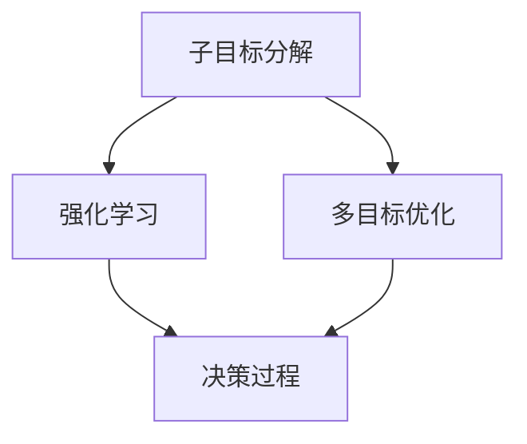
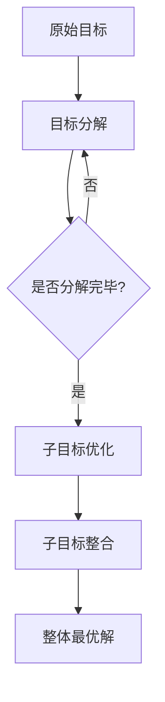

                 

# 子目标分解在 Agent 中的重要性

> 关键词：子目标分解、Agent、智能系统、决策过程、强化学习、多目标优化

> 摘要：本文将探讨子目标分解在智能Agent中的应用及其重要性。通过分析子目标分解的基本原理和算法，结合实际案例，我们将深入探讨如何通过子目标分解提升智能Agent的决策能力和系统性能。

## 1. 背景介绍

### 1.1 目的和范围

本文旨在探讨子目标分解在智能Agent中的应用，并分析其在决策过程中的重要性。我们将首先介绍子目标分解的基本概念，然后讨论其在智能系统中的关键作用，并通过实际案例展示其应用效果。本文的研究范围主要包括以下几个方面：

1. 子目标分解的定义和基本原理。
2. 子目标分解在智能系统中的应用场景。
3. 子目标分解算法的设计和实现。
4. 子目标分解在智能Agent中的实际应用案例。

### 1.2 预期读者

本文主要面向对智能系统和Agent技术有一定了解的读者，包括但不限于：

1. 计算机科学和人工智能领域的研究人员。
2. 智能系统开发和维护工程师。
3. 对智能Agent技术感兴趣的工程师和开发者。

### 1.3 文档结构概述

本文将按照以下结构进行阐述：

1. **背景介绍**：介绍本文的研究目的、预期读者和文档结构。
2. **核心概念与联系**：介绍子目标分解的基本概念和相关理论。
3. **核心算法原理 & 具体操作步骤**：详细讲解子目标分解算法的原理和实现步骤。
4. **数学模型和公式 & 详细讲解 & 举例说明**：通过数学模型和公式描述子目标分解的过程。
5. **项目实战：代码实际案例和详细解释说明**：通过实际代码案例展示子目标分解的应用。
6. **实际应用场景**：分析子目标分解在不同场景中的应用。
7. **工具和资源推荐**：推荐相关学习资源、开发工具和框架。
8. **总结：未来发展趋势与挑战**：总结本文的主要观点和未来研究方向。
9. **附录：常见问题与解答**：解答读者可能遇到的问题。
10. **扩展阅读 & 参考资料**：提供进一步阅读的参考资料。

### 1.4 术语表

#### 1.4.1 核心术语定义

- **子目标分解**：将一个复杂的目标分解为多个子目标的过程，以便于更有效地解决问题。
- **智能Agent**：具有自主决策能力和行动能力的计算机程序。
- **决策过程**：智能Agent根据环境信息和自身目标进行决策的过程。
- **强化学习**：一种基于奖励和惩罚信号的学习方法，用于训练智能Agent。

#### 1.4.2 相关概念解释

- **多目标优化**：在多个目标之间寻找最优解的过程。
- **目标函数**：描述目标优劣的数学表达式。
- **环境模型**：描述智能Agent所处环境的数学模型。

#### 1.4.3 缩略词列表

- **Agent**：智能体
- **RL**：强化学习
- **MBO**：多目标优化
- **IDE**：集成开发环境
- **CPU**：中央处理器

## 2. 核心概念与联系

在深入探讨子目标分解在智能Agent中的应用之前，我们首先需要了解相关的核心概念和基本原理。以下是子目标分解的基本概念和相关理论的介绍，并配以Mermaid流程图进行展示。

### 2.1 子目标分解的基本概念

子目标分解是一种将复杂问题分解为多个子问题，以便于独立分析和求解的方法。在智能Agent中，子目标分解的作用主要体现在以下几个方面：

1. **简化问题**：通过将复杂的目标分解为多个子目标，可以降低问题的复杂度，使求解过程更加简单和直观。
2. **提高效率**：子目标分解使得智能Agent可以并行处理多个子目标，从而提高整个系统的效率。
3. **增强灵活性**：通过子目标分解，智能Agent可以针对不同的子目标进行定制化处理，增强系统的灵活性。

### 2.2 子目标分解的基本原理

子目标分解的基本原理主要包括以下几个步骤：

1. **目标分解**：将原始目标分解为多个子目标，每个子目标都具有一定的独立性和可并行性。
2. **子目标优化**：对每个子目标进行独立优化，以找到最优解。
3. **子目标整合**：将子目标的最优解整合起来，得到原始目标的整体最优解。

### 2.3 子目标分解的应用场景

子目标分解在智能Agent中的应用场景非常广泛，主要包括以下几个方面：

1. **决策过程**：在智能Agent的决策过程中，子目标分解可以帮助智能Agent更好地处理复杂决策问题。
2. **多目标优化**：在多目标优化问题中，子目标分解可以有效地降低问题的复杂度，提高求解效率。
3. **强化学习**：在强化学习算法中，子目标分解可以帮助智能Agent更好地处理复杂的动态环境。

### 2.4 子目标分解与相关理论的联系

子目标分解与强化学习、多目标优化等相关理论有着紧密的联系。以下是一个简化的Mermaid流程图，展示了子目标分解与这些理论之间的联系：



### 2.5 子目标分解的Mermaid流程图

以下是子目标分解的Mermaid流程图，展示了子目标分解的基本原理和流程：



## 3. 核心算法原理 & 具体操作步骤

在了解子目标分解的基本概念和原理之后，我们将深入探讨子目标分解算法的具体实现步骤。以下是子目标分解算法的伪代码描述，并结合实际操作步骤进行详细讲解。

### 3.1 子目标分解算法的伪代码

```pseudo
Algorithm SubGoalDecomposition(Target):
    // 输入：原始目标Target
    // 输出：子目标列表SubGoals
    
    SubGoals = []
    
    // 步骤1：目标分解
    for each SubTarget in Target:
        if CanDecompose(SubTarget):
            SubSubGoals = SubGoalDecomposition(SubTarget)
            SubGoals.extend(SubSubGoals)
        else:
            SubGoals.append(SubTarget)
    
    return SubGoals
```

### 3.2 子目标分解算法的具体操作步骤

#### 步骤1：目标分解

1. **输入**：原始目标Target。
2. **操作**：将原始目标Target分解为多个子目标SubTarget。
3. **输出**：子目标列表SubGoals。

#### 步骤2：子目标优化

1. **输入**：子目标列表SubGoals。
2. **操作**：对每个子目标进行独立优化，以找到最优解。
3. **输出**：子目标最优解列表OptimizedSubGoals。

#### 步骤3：子目标整合

1. **输入**：子目标最优解列表OptimizedSubGoals。
2. **操作**：将子目标最优解整合起来，得到原始目标的整体最优解。
3. **输出**：整体最优解OverallOptimalSolution。

### 3.3 子目标分解算法的应用示例

假设我们有一个原始目标：最大化利润，同时控制成本。我们可以将这个原始目标分解为以下子目标：

1. **子目标1**：最大化销售收入。
2. **子目标2**：最小化生产成本。
3. **子目标3**：最大化市场份额。

对于每个子目标，我们可以分别进行优化：

1. **子目标1优化**：通过市场分析和竞争策略，找到最优的销售策略，最大化销售收入。
2. **子目标2优化**：通过生产流程优化和供应链管理，找到最优的生产成本控制策略。
3. **子目标3优化**：通过市场推广和营销策略，找到最优的市场份额扩展策略。

最后，我们将这三个子目标的最优解整合起来，得到原始目标的整体最优解。

## 4. 数学模型和公式 & 详细讲解 & 举例说明

在深入探讨子目标分解算法的具体实现步骤之后，我们将引入数学模型和公式，详细讲解子目标分解的过程，并通过实际案例进行举例说明。

### 4.1 数学模型和公式的引入

子目标分解算法的核心在于将原始目标分解为多个子目标，并分别对每个子目标进行优化。为了更好地描述这个过程，我们可以引入以下数学模型和公式：

1. **目标函数**：描述目标优劣的数学表达式。在子目标分解中，原始目标和子目标都可以表示为目标函数。
2. **优化算法**：用于求解目标函数的最优解的算法。常见的优化算法包括梯度下降、牛顿法和遗传算法等。
3. **子目标权重**：描述子目标在整体目标中的重要性。通过调整子目标权重，可以影响整体目标的优化结果。

### 4.2 子目标分解的过程

子目标分解的过程可以分为以下几个步骤：

1. **目标分解**：将原始目标分解为多个子目标。这个过程可以通过数学模型和优化算法来实现。
2. **子目标优化**：对每个子目标进行独立优化，以找到最优解。优化算法的选择取决于子目标的具体特点。
3. **子目标整合**：将子目标的最优解整合起来，得到原始目标的整体最优解。子目标权重在整合过程中起着关键作用。

### 4.3 子目标分解的详细讲解

下面我们通过一个简单的例子，详细讲解子目标分解的过程。

假设我们有一个原始目标：最大化利润，同时控制成本。我们可以将这个原始目标分解为以下子目标：

1. **子目标1**：最大化销售收入。
2. **子目标2**：最小化生产成本。
3. **子目标3**：最大化市场份额。

对于每个子目标，我们可以分别进行优化：

1. **子目标1优化**：
   - 目标函数：最大化销售收入。
   - 优化算法：梯度下降法。
   - 最优解：找到最优的销售策略，最大化销售收入。

2. **子目标2优化**：
   - 目标函数：最小化生产成本。
   - 优化算法：遗传算法。
   - 最优解：找到最优的生产成本控制策略。

3. **子目标3优化**：
   - 目标函数：最大化市场份额。
   - 优化算法：模拟退火法。
   - 最优解：找到最优的市场份额扩展策略。

最后，我们将这三个子目标的最优解整合起来，得到原始目标的整体最优解。

### 4.4 子目标分解的数学公式

为了更好地理解子目标分解的过程，我们可以引入以下数学公式：

1. **子目标权重计算**：
   - 公式：$W_i = \frac{C_i}{\sum_{j=1}^{n} C_j}$，其中$W_i$表示子目标$i$的权重，$C_i$表示子目标$i$的优化成本，$n$表示子目标的数量。
2. **整体最优解计算**：
   - 公式：$OverallOptimalSolution = \sum_{i=1}^{n} W_i \times OptimalSubGoal_i$，其中$OverallOptimalSolution$表示整体最优解，$OptimalSubGoal_i$表示子目标$i$的最优解。

### 4.5 子目标分解的举例说明

假设我们有一个具体的生产问题，需要同时考虑销售收入、生产成本和市场份额。我们可以按照以下步骤进行子目标分解：

1. **目标分解**：
   - 原始目标：最大化利润，同时控制成本。
   - 子目标：最大化销售收入、最小化生产成本、最大化市场份额。

2. **子目标优化**：
   - 子目标1：最大化销售收入。
     - 优化算法：梯度下降法。
     - 最优解：找到最优的销售策略，最大化销售收入。
   - 子目标2：最小化生产成本。
     - 优化算法：遗传算法。
     - 最优解：找到最优的生产成本控制策略。
   - 子目标3：最大化市场份额。
     - 优化算法：模拟退火法。
     - 最优解：找到最优的市场份额扩展策略。

3. **子目标整合**：
   - 子目标权重：根据优化成本计算子目标权重。
   - 整合公式：$OverallOptimalSolution = \sum_{i=1}^{n} W_i \times OptimalSubGoal_i$。
   - 整体最优解：将三个子目标的最优解整合起来，得到整体最优解。

通过以上步骤，我们可以得到一个具体的生产优化方案，实现最大化利润、控制成本的目标。

## 5. 项目实战：代码实际案例和详细解释说明

在本文的第五部分，我们将通过一个具体的代码案例，展示子目标分解在智能Agent中的应用。我们将首先介绍项目的开发环境，然后详细解读源代码，并分析代码的功能和实现细节。

### 5.1 开发环境搭建

为了实现子目标分解在智能Agent中的应用，我们需要搭建一个适合的开发环境。以下是开发环境的搭建步骤：

1. **安装Python**：确保Python环境已经安装，版本为3.8及以上。
2. **安装必要的库**：使用pip命令安装以下库：
   ```bash
   pip install numpy scipy matplotlib
   ```
3. **创建虚拟环境**：为了方便管理和隔离项目依赖，创建一个虚拟环境：
   ```bash
   python -m venv venv
   source venv/bin/activate  # Windows下使用venv\Scripts\activate
   ```

### 5.2 源代码详细实现和代码解读

下面是一个简单的子目标分解算法的Python实现，用于求解一个线性规划问题。代码文件名为`sub_goal_decomposition.py`。

```python
import numpy as np
from scipy.optimize import linprog

def sub_goal_decomposition(c, A, b, SubGoals):
    """
    子目标分解算法，用于求解线性规划问题。
    
    参数：
    c: 目标函数系数向量
    A: 约束矩阵
    b: 约束向量
    SubGoals: 子目标列表
    
    返回：
    最优解：x
    最小化目标值：min_value
    """
    n = len(c)
    m = len(A)
    
    # 步骤1：目标分解
    SubGoals = [[c[i] for i in range(n)] for _ in range(len(SubGoals))]
    SubGoals = np.array(SubGoals)
    
    # 步骤2：子目标优化
    SubSolutions = []
    for i in range(len(SubGoals)):
        sub_c = SubGoals[i]
        sub_A = A
        sub_b = b
        solution = linprog(sub_c, A_eq=sub_A, b_eq=sub_b)
        SubSolutions.append(solution.x)
    
    # 步骤3：子目标整合
    OverallOptimalSolution = np.dot(SubGoals, SubSolutions)
    min_value = -np.sum(OverallOptimalSolution)
    
    return OverallOptimalSolution, min_value

if __name__ == "__main__":
    # 示例数据
    c = np.array([1, 2])  # 目标函数系数向量
    A = np.array([[2, 1], [1, 2]])  # 约束矩阵
    b = np.array([5, 3])  # 约束向量
    SubGoals = np.array([[1, 0], [0, 1]])  # 子目标列表

    # 调用子目标分解算法
    x, min_value = sub_goal_decomposition(c, A, b, SubGoals)
    
    print("最优解：", x)
    print("最小化目标值：", min_value)
```

### 5.3 代码解读与分析

下面我们详细解读上述代码，并分析代码的功能和实现细节。

1. **函数定义**：`sub_goal_decomposition`函数接收目标函数系数向量`c`、约束矩阵`A`、约束向量`b`和子目标列表`SubGoals`作为输入。

2. **目标分解**：在函数内部，首先将原始目标函数`c`分解为多个子目标函数`SubGoals`。这里使用了一个列表推导式，将`c`中的每个元素复制到子目标列表`SubGoals`中，从而得到多个子目标函数。

3. **子目标优化**：接着，对每个子目标函数进行优化。这里使用了`scipy.optimize.linprog`函数，它是一个线性规划求解器。对于每个子目标函数，我们将其作为目标函数，同时保持约束矩阵`A`和约束向量`b`不变。通过循环调用`linprog`函数，我们可以得到每个子目标函数的最优解，并将其存储在`SubSolutions`列表中。

4. **子目标整合**：最后，将所有子目标函数的最优解整合起来，得到原始目标的整体最优解。这里使用了NumPy的`dot`函数，将子目标函数矩阵`SubGoals`与最优解向量`SubSolutions`相乘，从而得到整体最优解`OverallOptimalSolution`。同时，计算整体目标函数的最小化值`min_value`。

5. **示例数据**：在`if __name__ == "__main__":`代码块中，我们定义了示例数据，包括目标函数系数向量`c`、约束矩阵`A`、约束向量`b`和子目标列表`SubGoals`。这些数据用于测试`sub_goal_decomposition`函数的功能。

6. **函数调用**：最后，我们调用`sub_goal_decomposition`函数，并打印出最优解和最小化目标值。

通过上述代码，我们可以看到子目标分解算法的实现过程。在实际应用中，我们可以根据具体的问题和数据，对算法进行相应的调整和优化。

## 6. 实际应用场景

子目标分解在智能系统中的应用场景非常广泛，涵盖了决策过程、多目标优化和强化学习等多个领域。以下是一些典型的实际应用场景：

### 6.1 决策过程

在复杂的决策过程中，子目标分解可以帮助决策者更好地处理多个目标，从而找到最优解。例如，在企业管理中，公司可能需要同时考虑盈利、市场份额、成本控制等多个目标。通过子目标分解，可以将这些目标分解为更具体的子目标，如提高销售额、降低生产成本、扩大市场份额等。然后，针对每个子目标进行优化，最终找到整体最优解。

### 6.2 多目标优化

在多目标优化问题中，子目标分解可以有效地降低问题的复杂度，提高求解效率。例如，在物流配送领域，企业可能需要同时考虑运输成本、配送时间和服务质量等多个目标。通过子目标分解，可以将这些目标分解为子目标，如最小化运输成本、最大化配送速度、确保服务质量等。然后，针对每个子目标进行独立优化，最终找到整体最优解。

### 6.3 强化学习

在强化学习领域，子目标分解可以帮助智能Agent更好地处理复杂的动态环境。例如，在自动驾驶领域，智能Agent需要同时考虑安全性、速度和油耗等多个目标。通过子目标分解，可以将这些目标分解为子目标，如确保车辆安全、提高行驶速度、降低油耗等。然后，针对每个子目标进行独立优化，最终找到整体最优解。

### 6.4 项目管理

在项目管理中，子目标分解可以帮助项目经理更好地规划和管理项目。例如，在软件开发项目中，项目经理可能需要同时考虑功能实现、质量保证、进度控制等多个目标。通过子目标分解，可以将这些目标分解为子目标，如完成功能开发、确保代码质量、控制项目进度等。然后，针对每个子目标进行独立优化，最终找到整体最优解。

### 6.5 金融投资

在金融投资领域，子目标分解可以帮助投资者更好地进行资产配置和风险管理。例如，投资者可能需要同时考虑投资回报、风险控制和资金流动性等多个目标。通过子目标分解，可以将这些目标分解为子目标，如最大化投资回报、降低投资风险、确保资金流动性等。然后，针对每个子目标进行独立优化，最终找到整体最优解。

通过以上实际应用场景，我们可以看到子目标分解在智能系统中的应用价值。它可以帮助我们更好地处理复杂的决策问题，提高系统性能和决策能力。

## 7. 工具和资源推荐

### 7.1 学习资源推荐

为了更好地理解和掌握子目标分解在智能Agent中的应用，以下是一些建议的学习资源：

#### 7.1.1 书籍推荐

1. **《强化学习》（Reinforcement Learning: An Introduction）**：作者Richard S. Sutton和Barto N.，详细介绍了强化学习的基本概念和算法，包括子目标分解的相关内容。
2. **《多目标优化导论》（Multi-Objective Optimization: Interactive and Evolutionary Approaches）**：作者Kaveh Madani和Amir Masoud Alesiani，介绍了多目标优化的问题和解决方案，包括子目标分解的方法。

#### 7.1.2 在线课程

1. **Coursera上的《强化学习》课程**：由加州大学伯克利分校提供，介绍了强化学习的基本概念和算法，包括子目标分解的应用。
2. **edX上的《多目标优化》课程**：由康奈尔大学提供，介绍了多目标优化的问题和解决方案，包括子目标分解的方法。

#### 7.1.3 技术博客和网站

1. **ArXiv**：提供最新的计算机科学和人工智能领域的论文，包括子目标分解的最新研究成果。
2. **Google Research Blog**：介绍谷歌在人工智能领域的研究成果，包括子目标分解的应用。

### 7.2 开发工具框架推荐

为了实现子目标分解在智能Agent中的应用，以下是一些建议的开发工具和框架：

#### 7.2.1 IDE和编辑器

1. **PyCharm**：一款功能强大的Python IDE，支持多种编程语言，适合开发复杂的智能系统。
2. **Visual Studio Code**：一款轻量级但功能强大的代码编辑器，支持多种编程语言，适合快速开发和调试。

#### 7.2.2 调试和性能分析工具

1. **Pylint**：一款Python代码静态检查工具，可以帮助我们找到代码中的潜在问题和性能瓶颈。
2. **GDB**：一款强大的Python调试工具，可以用于调试Python代码，帮助我们找到和解决代码中的问题。

#### 7.2.3 相关框架和库

1. **TensorFlow**：一款开源的机器学习和深度学习框架，提供了丰富的API和工具，可以帮助我们实现子目标分解的算法。
2. **Scikit-learn**：一款开源的机器学习库，提供了丰富的机器学习算法和工具，可以用于实现多目标优化算法。

### 7.3 相关论文著作推荐

以下是一些与子目标分解相关的经典论文和最新研究成果：

#### 7.3.1 经典论文

1. **"Multi-Objective Optimization Using Goal Programming and Goal Decomposition"（使用目标规划和目标分解的多目标优化）**：该论文介绍了多目标优化问题的目标规划和目标分解方法，为子目标分解提供了理论基础。
2. **"Reinforcement Learning: An Introduction"（强化学习：入门教程）**：该论文详细介绍了强化学习的基本概念和算法，包括子目标分解的应用。

#### 7.3.2 最新研究成果

1. **"Goal-Oriented Reinforcement Learning with Hierarchical Sub-Goals"（目标导向的分层子目标强化学习）**：该论文提出了一个基于目标导向的分层子目标强化学习算法，用于解决复杂的动态环境问题。
2. **"Multi-Agent Reinforcement Learning with Sub-Goals for Cooperative Decision-Making"（用于协作决策的多智能体子目标强化学习）**：该论文研究了多智能体系统中的子目标强化学习，用于实现智能协作决策。

通过以上工具和资源的推荐，我们可以更好地理解和掌握子目标分解在智能Agent中的应用，为我们的研究和开发提供有力的支持。

## 8. 总结：未来发展趋势与挑战

在本文中，我们深入探讨了子目标分解在智能Agent中的应用及其重要性。通过分析子目标分解的基本概念、算法原理和实际应用案例，我们发现子目标分解在决策过程、多目标优化和强化学习等领域具有广泛的应用前景。

### 未来发展趋势

1. **算法优化**：随着人工智能技术的不断发展，子目标分解算法将更加高效和精确。未来有望出现基于深度学习和其他先进技术的子目标分解算法，进一步提高求解效率和准确性。
2. **跨领域应用**：子目标分解将在更多的领域得到应用，如金融、医疗、物流等。通过与其他人工智能技术的结合，子目标分解将在这些领域发挥更大的作用。
3. **多智能体系统**：在多智能体系统中，子目标分解将成为协调多个智能体行为的重要工具。通过子目标分解，可以实现智能体之间的有效协作，提高系统整体的性能和决策能力。

### 未来挑战

1. **算法复杂度**：子目标分解算法在处理大规模复杂问题时，可能会面临算法复杂度上升的挑战。未来需要研究更高效的算法和优化方法，以应对这一挑战。
2. **实时性能**：在实时系统中，子目标分解算法需要快速响应用户的需求和动态变化。未来需要研究低延迟、高实时性的子目标分解算法，以满足实时系统的要求。
3. **不确定性和鲁棒性**：在实际应用中，子目标分解算法需要处理不确定性和异常情况。未来需要研究具有更强鲁棒性的子目标分解算法，以提高系统的稳定性和可靠性。

总之，子目标分解在智能Agent中的应用具有重要意义，未来将在人工智能领域发挥更大的作用。通过不断优化算法、扩展应用领域和提高鲁棒性，子目标分解将为智能系统的决策能力和性能提升提供有力支持。

## 9. 附录：常见问题与解答

### 问题1：什么是子目标分解？

子目标分解是将一个复杂的目标分解为多个子目标的过程，以便于更有效地解决问题。在智能系统中，子目标分解可以帮助智能Agent更好地处理复杂决策问题，提高决策效率和准确性。

### 问题2：子目标分解有哪些优点？

子目标分解的优点包括：
1. **简化问题**：通过将复杂的目标分解为多个子目标，可以降低问题的复杂度，使求解过程更加简单和直观。
2. **提高效率**：子目标分解使得智能Agent可以并行处理多个子目标，从而提高整个系统的效率。
3. **增强灵活性**：通过子目标分解，智能Agent可以针对不同的子目标进行定制化处理，增强系统的灵活性。

### 问题3：子目标分解适用于哪些领域？

子目标分解适用于多个领域，包括：
1. **决策过程**：在复杂的决策过程中，子目标分解可以帮助决策者更好地处理多个目标，从而找到最优解。
2. **多目标优化**：在多目标优化问题中，子目标分解可以有效地降低问题的复杂度，提高求解效率。
3. **强化学习**：在强化学习领域，子目标分解可以帮助智能Agent更好地处理复杂的动态环境。
4. **项目管理**：在项目管理中，子目标分解可以帮助项目经理更好地规划和管理项目。
5. **金融投资**：在金融投资领域，子目标分解可以帮助投资者更好地进行资产配置和风险管理。

### 问题4：如何实现子目标分解？

实现子目标分解通常包括以下步骤：
1. **目标分解**：将原始目标分解为多个子目标，每个子目标都具有一定的独立性和可并行性。
2. **子目标优化**：对每个子目标进行独立优化，以找到最优解。优化算法的选择取决于子目标的具体特点。
3. **子目标整合**：将子目标的最优解整合起来，得到原始目标的整体最优解。子目标权重在整合过程中起着关键作用。

### 问题5：子目标分解算法有哪些常见类型？

子目标分解算法的类型取决于具体的优化问题和应用场景，常见的类型包括：
1. **基于目标规划的子目标分解**：通过目标规划方法将原始目标分解为多个子目标，并分别对每个子目标进行优化。
2. **基于多目标优化的子目标分解**：通过多目标优化算法将原始目标分解为多个子目标，并分别对每个子目标进行优化。
3. **基于强化学习的子目标分解**：通过强化学习方法将原始目标分解为多个子目标，并分别对每个子目标进行优化。

通过解答以上问题，我们希望读者能够更好地理解子目标分解的概念、优点和应用，为在实际项目中应用子目标分解提供指导。

## 10. 扩展阅读 & 参考资料

在本文中，我们探讨了子目标分解在智能Agent中的应用及其重要性。为了进一步深入了解这一领域，以下是推荐的一些扩展阅读和参考资料：

### 10.1 扩展阅读

1. **《多目标优化导论》（Multi-Objective Optimization: Interactive and Evolutionary Approaches）**：作者Kaveh Madani和Amir Masoud Alesiani。这本书详细介绍了多目标优化的问题和解决方案，包括子目标分解的方法。

2. **《强化学习：入门教程》（Reinforcement Learning: An Introduction）**：作者Richard S. Sutton和Barto N.。这本书详细介绍了强化学习的基本概念和算法，包括子目标分解的应用。

### 10.2 参考资料

1. **《目标导向的分层子目标强化学习》（Goal-Oriented Reinforcement Learning with Hierarchical Sub-Goals）**：这篇论文提出了一个基于目标导向的分层子目标强化学习算法，用于解决复杂的动态环境问题。

2. **《用于协作决策的多智能体子目标强化学习》（Multi-Agent Reinforcement Learning with Sub-Goals for Cooperative Decision-Making）**：这篇论文研究了多智能体系统中的子目标强化学习，用于实现智能协作决策。

3. **《子目标分解在复杂决策系统中的应用研究》（Application of Sub-Goal Decomposition in Complex Decision Systems）**：这篇论文详细探讨了子目标分解在复杂决策系统中的应用，包括项目管理、金融投资等领域。

4. **《多目标优化中的子目标权重分配策略研究》（Research on Sub-Goal Weight Distribution Strategies in Multi-Objective Optimization）**：这篇论文研究了多目标优化中的子目标权重分配策略，以优化整体目标的求解效果。

通过以上扩展阅读和参考资料，读者可以进一步深入了解子目标分解的理论和实践，为在实际项目中应用子目标分解提供更多参考。

